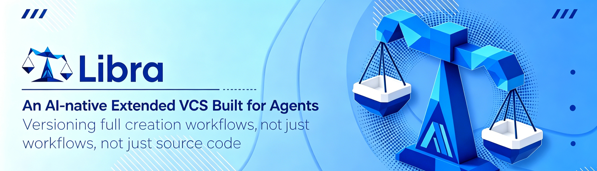

[中文](README.zh-CN.md) | English



<div align="center">

# Libra — An AI-native Extended VCS Built for Agents

**Versioning the entire software creation lifecycle, not just code.**

Libra is an AI-native infrastructure that captures and structures the full lifecycle of software development, documenting every step from human intent and AI reasoning to validation and release.

Our mission is to ensure that every software creation becomes lasting knowledge instead of discarded workflow data, empowering developers, teams, and AI systems to retrieve, reuse, and build upon the intelligence behind every piece of software.

As AI becomes the primary producer of software, Libra provides the foundational infrastructure that preserves, compounds, and unlocks the long-term value of software creation.

</div>

[](LICENSE)
[](https://github.com/wingwangsz/libra/actions/workflows/base.yml)
[](https://t.co/425ibAmBb8)
[](https://x.com/git_mono_AI)
[](https://docs.libra.tools)

---

## Key Differentiators

| Capability | Traditional VCS (Git) | Libra |
|-----------|----------------------|-------|
| **Versioned Artifacts** | Source code only | Code + AI reasoning + decisions + validation reports + session transcripts |
| **AI Collaboration** | Manual commit messages | Native AI agent threads with full audit trail |
| **Knowledge Reuse** | Code snapshots | Reusable intelligence assets across projects |
| **Security** | External GPG/SSH setup | Built-in vault with per-repo key isolation |
| **Provider Lock-in** | N/A | 7+ AI providers, switch freely |
| **Automation** | External CI/CD | Built-in cron-driven agent automation |

---

## Quick Start

### Install

```bash
# macOS / Linux (recommended)
curl -fsSL https://download.libra.tools/install.sh | sh

# Homebrew (macOS)
brew install libra

# From source (requires Rust)
git clone https://github.com/wingwangsz/libra.git
cd libra
cargo build --release
```

### Initialize Your First Repository

```bash
# Create a new Libra repository
libra init my-project
cd my-project

# Or convert an existing Git repository
libra init --from-git-repository /path/to/existing/git/repo
```

### Start AI-Native Coding

```bash
# Launch the interactive TUI (Terminal + Web + MCP)
libra code

# Or run in web-only mode
libra code --web

# Or as an MCP server for Claude Desktop
libra code --stdio
```

> See the [full documentation](https://docs.libra.tools) for advanced setup, configuration, and usage guides.

---

## Core Features

### 🧠 AI-Native Threading & Persistence

Every AI agent session is a first-class citizen in Libra. Threads, plans, tasks, decisions, validation reports, tool invocations, and patchset snapshots are all persisted directly in the repository alongside your code. No out-of-band state — everything is durable, queryable, and replayable.

```
.libra/
├── libra.db              # SQLite: Git core + AI threads + runtime contracts
├── vault.db              # Encrypted secrets (provider keys, signing keys)
├── objects/              # Object store (loose + pack, compatible with Git)
├── sessions/             # AI conversation transcripts in JSONL
└── ai/                   # AI runtime working files
```

### 🔄 Git-Compatible Foundation

Libra speaks Git's language. On-disk formats (objects, index, pack, pack-index) and wire protocols are fully compatible with standard Git servers (GitHub, GitLab, Gitea, etc.). You can `push` and `pull` to any Git remote with zero friction.

Key difference: Git manages files. Libra manages **creation**.

### 🤖 Multi-Agent Collaboration

The `libra code` command launches an interactive TUI backed by a web server and an MCP stdio interface, designed for collaborative AI-human workflows. Switch between 7+ AI providers without changing your workflow.

```bash
libra code --provider gemini      # Google Gemini (default)
libra code --provider openai      # OpenAI GPT
libra code --provider anthropic   # Anthropic Claude
libra code --provider deepseek    # DeepSeek
libra code --provider kimi        # Moonshot AI
libra code --provider zhipu       # Zhipu GLM
libra code --provider ollama      # Local inference
```

### 🔐 Vault-Backed Security

Every `libra init` automatically creates a per-repository vault for encrypted key management:
- **GPG signing keys** for commit verification
- **SSH keys** for remote authentication
- **AI provider credentials** securely stored

No external key management setup required. Keys are isolated per repository and never leave the vault.

### 🛡️ Command Safety Sandbox

Every tool invocation from an AI agent passes through a configurable safety sandbox with command preflight checks, network policy enforcement, and optional seccomp/seatbelt restrictions. Define what agents can and cannot do.

### ☁️ Tiered Cloud Storage & Backup

- **Tiered storage**: Offload large objects to S3/R2/MinIO with local LRU caching
- **Cloud backup**: Sync your entire repository state (including AI history) to Cloudflare D1 + R2
- **Portable**: Move a Libra repository between machines with all AI context intact

### 🛠️ AI-Native Subcommands

Commands you won't find in Git, built for agent workflows:

| Command | Purpose |
|---------|---------|
| `libra code` | Launch AI-native TUI (TUI + Web + MCP) |
| `libra automation` | Cron-driven rule-based automation |
| `libra agent` | Capture external agent sessions (Claude Code, Gemini) |
| `libra publish` | Read-only Cloudflare Worker publishing |
| `libra graph` | Visualize AI thread version graphs |
| `libra sandbox` | Inspect and configure safety sandbox |
| `libra usage` | Token and cost tracking across providers |
| `libra cloud` | Backup and restore to/from D1 + R2 |

### 🌐 MCP Protocol Native

Libra natively supports the [Model Context Protocol](https://modelcontextprotocol.io/), enabling direct integration with Claude Desktop, Cursor, and any MCP-compatible client. Configure once, use everywhere.

```json
{
  "mcpServers": {
    "libra": {
      "command": "/path/to/libra",
      "args": ["code", "--stdio"],
      "cwd": "/path/to/your/libra/repo"
    }
  }
}
```

---

## Supported AI Providers

Libra supports Gemini (default), OpenAI, Anthropic, DeepSeek, Kimi, Zhipu, and Ollama — switch providers freely with `--provider`.

> See [docs.libra.tools](https://docs.libra.tools/en/docs/getting-started/agent) for provider setup and configuration details.

---

## Community & Resources

| Resource | Link |
|----------|------|
| **Website** | [libra.tools](https://www.libra.tools) |
| **Documentation** | [docs.libra.tools](https://docs.libra.tools) |
| **Discord** | [Join the community](https://t.co/425ibAmBb8) |
| **X / Twitter** | [@git_mono_AI](https://x.com/git_mono_AI) |
| **GitHub** | [github.com/wingwangsz/libra](https://github.com/wingwangsz/libra) |

---

## Contributing

We welcome contributions from developers, AI researchers, and anyone passionate about the future of software creation. Before submitting a Pull Request, please ensure your code passes our quality checks:

```bash
# Run clippy with all warnings treated as errors
cargo clippy --all-targets --all-features -- -D warnings

# Check code formatting (requires nightly toolchain)
cargo +nightly fmt --all --check

# Fix formatting automatically if needed
cargo +nightly fmt --all
```

For Windows builds, please see the [Windows build guide](docs/installation/windows.md) for OpenSSL setup instructions.

For detailed contribution guidelines, see [docs/development/contributing.md](docs/development/contributing.md).

---

## License

MIT License — see [LICENSE](LICENSE) for details.

Copyright (c) 2025-2026 Web3 Infrastructure Foundation.

---

<div align="center">

**[Get Started](https://docs.libra.tools) · [Join Discord](https://t.co/425ibAmBb8) · [Follow on X](https://x.com/git_mono_AI)**

</div>
