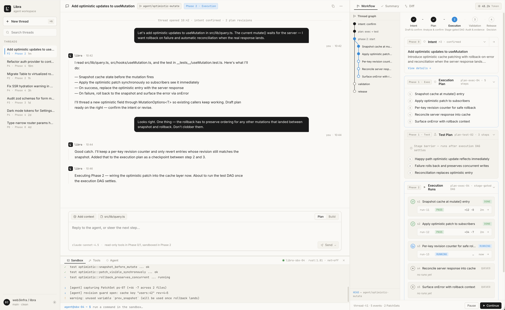

[English](README.md) | 中文


<div align="center">

# Libra — 面向 AI Agent 的 AI 原生扩展版本控制系统

**版本化整个软件创造生命周期，而非仅仅是代码。**

Libra 是一个 AI 原生基础设施，捕获并结构化软件开发的完整生命周期，记录从人类意图、AI 推理到验证和发布的每一个步骤。

我们的愿景是将创造记录转化为可复用的智能资产，使软件知识变得可复用、可拥有，并随着时间的推移不断增值。

我们的使命是确保每一次软件创造都成为持久的知识，而非被丢弃的工作流数据，赋能开发者、团队和 AI 系统去检索、复用并基于每一份软件背后的智能进行构建。

当 AI 成为软件的主要生产者时，Libra 提供基础架构来保存、累积并释放软件创造的长期价值。

</div>

---

<div align="center">

[](LICENSE)
[](https://github.com/wingwangsz/libra/actions/workflows/base.yml)
[](https://t.co/425ibAmBb8)
[](https://x.com/git_mono_AI)
[](https://docs.libra.tools)

</div>

---



---

## Libra 是什么？

Libra 是一个**面向 AI Agent 编程时代的 AI 原生版本控制系统**。它在保持与 Git 磁盘格式和传输协议完全兼容的同时，将版本控制的范围从传统代码扩展到了**整个软件创造生命周期**。

每一次交互、每一个 AI 推理步骤、每一个验证结果、每一个开发过程中的决策，都被捕获、结构化并存储在仓库中，可随时查询和回放。这不仅仅是代码历史——它是**智能历史**。

### 核心差异

| 能力 | 传统版本控制（Git） | Libra |
|-----------|----------------------|-------|
| **版本化内容** | 仅源代码 | 代码 + AI 推理 + 决策 + 验证报告 + 会话记录 |
| **AI 协作** | 手动提交信息 | 原生 AI Agent 线程，完整审计追踪 |
| **知识复用** | 代码快照 | 跨项目可复用的智能资产 |
| **安全** | 外部 GPG/SSH 配置 | 内置 Vault，每个仓库独立隔离密钥 |
| **供应商锁定** | 不适用 | 7+ 家 AI 提供商，自由切换 |
| **自动化** | 外部 CI/CD | 内置 Cron 驱动的 Agent 自动化 |

---

## 快速开始

### 安装

```bash
# macOS / Linux（推荐）
curl -fsSL https://download.libra.tools/install.sh | sh

# Homebrew（macOS）
brew install libra

# 从源码编译（需要 Rust）
git clone https://github.com/wingwangsz/libra.git
cd libra
cargo build --release
```

### 初始化你的第一个仓库

```bash
# 创建新的 Libra 仓库
libra init my-project
cd my-project

# 或从现有 Git 仓库转换
libra init --from-git-repository /path/to/existing/git/repo
```

### 开始 AI 原生编程

```bash
# 启动交互式 TUI（终端 + Web + MCP）
libra code

# 或仅运行 Web 模式
libra code --web

# 或作为 MCP 服务器供 Claude Desktop 使用
libra code --stdio
```

> 查看[完整文档](https://docs.libra.tools)获取高级配置和使用指南。

---

## 核心特性

### 🧠 AI 原生线程与持久化

每一个 AI Agent 会话都是 Libra 中的一等公民。线程、计划、任务、决策、验证报告、工具调用和代码补丁快照都直接持久化在仓库中，与代码共存。没有外部状态——一切都是可持久化、可查询、可回放的。

```
.libra/
├── libra.db              # SQLite：Git 核心 + AI 线程 + 运行时合约
├── vault.db              # 加密密钥库（提供商密钥、签名密钥）
├── objects/              # 对象存储（loose + pack，与 Git 兼容）
├── sessions/             # AI 会话记录（JSONL 格式）
└── ai/                   # AI 运行时工作文件
```

### 🔄 Git 兼容基础

Libra 使用 Git 的语言。磁盘格式（objects、index、pack、pack-index）和传输协议与标准 Git 服务器（GitHub、GitLab、Gitea 等）完全兼容。你可以零摩擦地向任何 Git 远程仓库 `push` 和 `pull`。

关键区别：Git 管理文件。Libra 管理**创造**。

### 🤖 多 Agent 协作

`libra code` 命令启动一个交互式 TUI，后台由 Web 服务器和 MCP stdio 接口支持，专为 AI 与人类协作工作流设计。在 7+ 家 AI 提供商之间自由切换，无需改变工作流。

```bash
libra code --provider gemini      # Google Gemini（默认）
libra code --provider openai      # OpenAI GPT
libra code --provider anthropic   # Anthropic Claude
libra code --provider deepseek    # DeepSeek
libra code --provider kimi        # 月之暗面 Kimi
libra code --provider zhipu       # 智谱 GLM
libra code --provider ollama      # 本地推理
```

### 🔐 Vault 安全

每次 `libra init` 自动创建仓库级加密密钥管理：
- **GPG 签名密钥**用于提交验证
- **SSH 密钥**用于远程认证
- **AI 提供商凭证**安全存储

无需外部密钥管理配置。每个仓库的密钥独立隔离，永不离库。

### 🛡️ 命令安全沙箱

每个 AI Agent 的工具调用都经过可配置的安全沙箱，包含命令预检、网络策略执行和可选的 seccomp/seatbelt 限制。定义 Agent 能做什么、不能做什么。

### ☁️ 分层云存储与备份

- **分层存储**：将大对象卸载到 S3/R2/MinIO，本地 LRU 缓存
- **云端备份**：将完整仓库状态（含 AI 历史）同步到 Cloudflare D1 + R2
- **可移植**：在不同机器之间迁移 Libra 仓库，AI 上下文完整保留

### 🛠️ AI 原生子命令

Git 中找不到的命令，专为 Agent 工作流设计：

| 命令 | 用途 |
|---------|---------|
| `libra code` | 启动 AI 原生 TUI（终端 + Web + MCP） |
| `libra automation` | 基于 Cron 的规则驱动自动化 |
| `libra agent` | 捕获外部 Agent 会话（Claude Code、Gemini） |
| `libra publish` | 只读 Cloudflare Worker 发布 |
| `libra graph` | 可视化 AI 线程版本图 |
| `libra sandbox` | 检查并配置安全沙箱 |
| `libra usage` | 跨提供商 Token 和成本追踪 |
| `libra cloud` | 向/从 D1 + R2 备份和恢复 |

### 🌐 原生 MCP 协议支持

Libra 原生支持 [Model Context Protocol](https://modelcontextprotocol.io/)，可直接与 Claude Desktop、Cursor 和任何 MCP 兼容客户端集成。配置一次，到处使用。

```json
{
  "mcpServers": {
    "libra": {
      "command": "/path/to/libra",
      "args": ["code", "--stdio"],
      "cwd": "/path/to/your/libra/repo"
    }
  }
}
```

---

## 支持的 AI 提供商

| 提供商 | 默认模型 | 认证方式 | 基础 URL 覆盖 |
|----------|--------------|------|-------------------|
| **Gemini**（默认） | `gemini-2.5-flash` | `GEMINI_API_KEY` | — |
| **OpenAI** | `gpt-4o-mini` | `OPENAI_API_KEY` | `OPENAI_BASE_URL` |
| **Anthropic** | `claude-sonnet-4-6` | `ANTHROPIC_API_KEY` | `ANTHROPIC_BASE_URL` |
| **DeepSeek** | `deepseek-chat` | `DEEPSEEK_API_KEY` | `--api-base` |
| **Kimi** | `kimi-k2.6` | `MOONSHOT_API_KEY` | `MOONSHOT_BASE_URL` |
| **Zhipu** | `glm-5` | `ZHIPU_API_KEY` | `ZHIPU_BASE_URL` |
| **Ollama** | *（指定 `--model`）* | `OLLAMA_API_KEY` | `OLLAMA_BASE_URL`, `--api-base` |

> 前往 [docs.libra.tools](https://docs.libra.tools) 查看提供商特定的调优选项、推理控制参数和模型选择。

---

## 架构

Libra 使用 **Rust** 构建，采用清晰、模块化的架构：

- **SQLite 元数据**：对 config、refs、HEAD 和所有 AI 运行时数据进行统一事务管理
- **Git 兼容对象**：磁盘格式（loose + pack）与标准 Git 兼容
- **分层存储**：本地 + S3/R2/MinIO 对象存储，带 LRU 缓存
- **Vault 加密**：每个仓库独立的 libvault 密钥管理
- **跨平台**：Windows、Linux、macOS

详细架构文档请访问 [docs.libra.tools](https://docs.libra.tools)。

---

## 社区与资源

| 资源 | 链接 |
|----------|------|
| **官网** | [libra.tools](https://www.libra.tools) |
| **文档** | [docs.libra.tools](https://docs.libra.tools) |
| **Discord** | [加入社区](https://t.co/425ibAmBb8) |
| **X / Twitter** | [@git_mono_AI](https://x.com/git_mono_AI) |
| **GitHub** | [github.com/wingwangsz/libra](https://github.com/wingwangsz/libra) |

---

## 贡献指南

我们欢迎来自开发者、AI 研究人员和所有热爱软件创造未来的人的贡献。在提交 Pull Request 之前，请确保你的代码通过我们的质量检查：

```bash
# 运行 clippy，所有警告视为错误
cargo clippy --all-targets --all-features -- -D warnings

# 检查代码格式（需要 nightly 工具链）
cargo +nightly fmt --all --check

# 如需要自动修复格式
cargo +nightly fmt --all
```

Windows 构建用户请查看 [Windows 构建指南](docs/installation/windows.md) 了解 OpenSSL 配置。

详细贡献指南请参见 [docs/development/contributing.md](docs/development/contributing.md)。

---

## 许可证

MIT 许可证 — 详情见 [LICENSE](LICENSE)。

Copyright (c) 2025-2026 Web3 Infrastructure Foundation.

---

<div align="center">

**[开始使用](https://docs.libra.tools) · [加入 Discord](https://t.co/425ibAmBb8) · [关注 X](https://x.com/git_mono_AI)**

</div>
