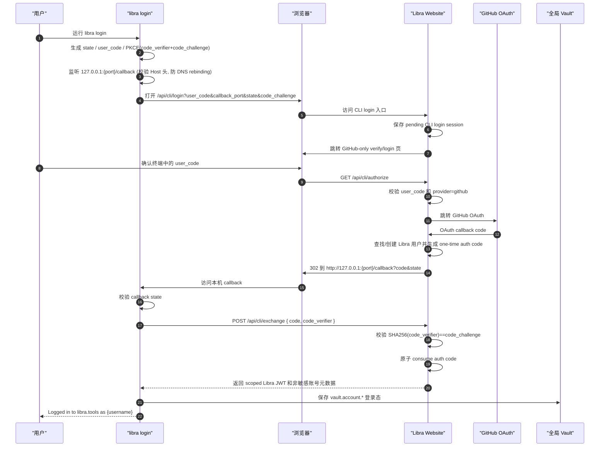
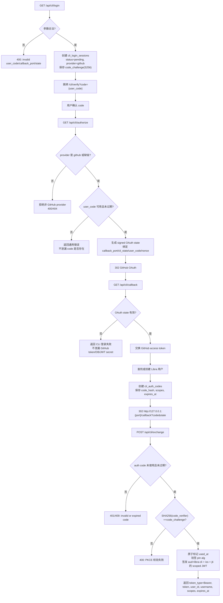

# Libra Account 登录设计

> **Out-of-scope of `tracing/plan.md`（§0 范围声明）**：本文档是 account-login 特性（Track A–E）的**设计草案**，不属于 AG-16~AG-24 外部捕获改进计划（account 特性非 AG-* 任务卡）。**已发布的 `libra login/logout/whoami` 是本草案的一个更精简子集**，本文档许多细节尚未与实现对齐。**当前实现行为的唯一事实源**是用户文档 [`docs/commands/login.md`](../../commands/login.md) / [`logout.md`](../../commands/logout.md) / [`whoami.md`](../../commands/whoami.md) 与 [`_compatibility.md`](commands/_compatibility.md) 的 `LFS/account auth` 行，而非本草案。已知与实现的偏差（本草案待 owner 刷新）：
> - **CLI 已注册**：`src/cli.rs::Commands` 已公开并 dispatch `Login`/`Logout`/`Whoami`（本草案多处仍称"尚无"）。
> - **会话存储**：实现用单个加密 JSON blob 存于 `account.host.<host_sha256>`（`src/internal/account.rs` 的 `ACCOUNT_SESSION_PREFIX`），**非**本草案描述的 `vault.account.hosts.*`；`vault.account.*` 命名空间是**另一条**尚未落地的 Git-HTTP-credential/Bearer 面。
> - **端点**：实现用 `/api/cli/{login,exchange,whoami,logout}`；本草案的 `/api/account/me`、`/api/cli/revoke` 等未采用。
> - **whoami**：实现每次都在线调 `GET /api/cli/whoami`，无"离线 cached 视图 + exit 0"回退；`--refresh` 为接受式 no-op。
> - **logout**：服务端 `/api/cli/logout` 撤销失败时命令报错、**不**删本地 token（除非 `--local-only`）；本草案的"网络失败仍删本地"不成立。
> - **flags**：实现仅 `login --host/--no-browser`、`whoami --host/--refresh`、`logout --host/--all/--local-only`；本草案的 `--port/--timeout/--scope/--verify` 未实现。

## 状态

Proposed（设计草案；见顶部 out-of-scope banner 说明与实现的偏差。已过两轮安全复核 + 2026-06-07 十维度审查修订；无新增漏洞类别，详见“现状安全缺口”与“十维度综合审查”）

## 日期

2026-06-05（2026-06-06：补“现状安全缺口”对齐、`/api/internal/verify` 契约；2026-06-07：十维度审查、决策账本、全局存储路径澄清、scope 注册表、完成定义）

## 一、摘要

**概述**：为 Libra CLI 新增 `libra login` / `logout` / `whoami`，复用 website 已有 GitHub OAuth + loopback CLI flow，在 **Track A（website Phase 0）安全前提** 落地后，由 CLI 通过 PKCE 绑定兑换 scoped JWT，并将登录态写入**全局**加密配置（`~/.libra/config.db` 的 `vault.account.*`，非 repo-local）。

**当前 Libra 基线**：`src/cli.rs::Commands` **尚无** `Login`/`Logout`/`Whoami`；`LBR-AUTH-001/002` 已存在于 `src/utils/error.rs`，`003–005` 待新增；`is_sensitive_key()` 对末段含 `token` 的键已有启发式命中，但 `vault.account.*` 命名空间仍需显式纳入 `is_vault_internal_key()` 与 compat guard。

**关键依赖**：[LFS 配额托管设计](lfs-quota-service-design.md)（Phase 3 Bearer 认证）；website `/Users/eli/Documents/website` CLI auth routes（Phase 0 必须先于 CLI 指向生产 host）。

**交付物**：website Track A（PKCE/JWT/持久存储/限流/GitHub-only）+ Libra Track B–D（login/Vault/whoami/logout/credential provider/LFS Bearer）+ 文档/compat/integration 同步。

**规模**：大（跨两个仓库，约 18 个 PR；website ~安全关键，CLI ~600–900 LOC）

**关键路径**：`A1–A16` 服务端契约冻结 → `B1–B5` CLI login → `C1–C4` Vault 读取与 provider → `D1–D2` LFS Bearer

## 背景

当前 Libra CLI 没有通用登录态，也没有 `libra login` / `libra logout` / `libra whoami` 这类账号命令。现有认证能力分散在不同场景：

- HTTPS Git / LFS 请求遇到 `401` 时，通过 `BasicAuth` 临时询问用户名和密码；不会形成持久登录态。
- `cloud` / `publish` 读取 `vault.env.*` 或环境变量中的 Cloudflare/D1/R2 凭据；这是基础设施凭据，不是 Libra 用户账号。
- `config` / Vault 已有本地/全局加密能力；账号登录态必须走全局 Vault-backed secret storage。

Libra LFS 配额上传需要一个明确的 Libra 用户身份：上传、下载、锁定、配额、计费和审计都必须绑定到注册用户或组织。因此 LFS 之前必须先设计 CLI 登录能力。

Libra 网站使用 `/Users/eli/Documents/website` 的程序。该网站已经存在 CLI 登录相关实现，但 Libra 账号登录只允许 GitHub：

- `libs/auth/auth.ts`：Better Auth 服务端当前具备邮箱密码、Google、GitHub、微信、手机号等能力；Libra 部署必须只启用 GitHub OAuth，禁用其他登录入口。
- `libs/auth/cli-auth.ts`：CLI 登录工具，包含 HS256 JWT 签名/验签、OAuth state 签名、8 位 user code、一次性 auth code。
- `apps/next-app/app/api/cli/login/route.ts`：CLI 登录入口，接收 `user_code`、`callback_port`、`state`。
- `apps/next-app/app/[lang]/(auth)/cli/verify/page.tsx`：浏览器验证页，用户输入或确认终端中的 8 位 code。
- `apps/next-app/app/api/cli/authorize/route.ts`：根据 user code 生成 GitHub OAuth state 并跳转 GitHub。
- `apps/next-app/app/api/cli/callback/route.ts`：GitHub callback，查找/创建用户，生成一次性 auth code，并跳回本机 loopback callback。
- `apps/next-app/app/api/cli/exchange/route.ts`：CLI 用一次性 auth code 换长期 JWT。
- `apps/next-app/app/api/internal/verify/route.ts`：内部服务验 JWT，当前返回 push/pull 权限。

这些能力目前文案和注释仍带 `rkforge`，并且 `userCodeStore` / `authCodeStore` 是进程内 `Map`。它们适合单实例开发环境，但生产部署必须改成 D1/KV/数据库短期表或明确 sticky session，否则多实例/无状态部署会丢失登录流程状态。

## 目标

- 新增顶层 CLI 子命令 `libra login`，让用户通过浏览器完成 GitHub OAuth 登录。
- 新增 `libra logout` 和 `libra whoami`，让用户能删除和检查当前账号登录态。
- 登录态保存在 Libra 全局 Vault 中，不写入仓库 `.libra/libra.db` 或 repo-local Vault，避免 repo 共享时泄漏用户账号状态。
- 复用 `/Users/eli/Documents/website` 已有 CLI auth flow，减少服务端新增面。
- Libra 账号域只支持 GitHub：禁用邮箱密码、Google、微信、手机号和其他 Better Auth provider。
- 形成后续 LFS、package registry、cloud/publish 用户态操作可共用的 credential provider。
- 保持机器输出稳定：`--json` / `--machine` 只输出非 secret 元数据，永不输出 token 明文。

## 非目标

- 不在 v1 实现用户名密码直输登录；Libra 登录只走 GitHub OAuth。
- 不支持 Google、微信、手机号、邮箱密码、magic link、passkey 或其他非 GitHub 登录方式。
- 不把 Cloudflare D1/R2 运维凭据迁移到账号登录；`cloud` / `publish` 现有基础设施凭据仍保持独立。
- 不在 Libra CLI 中嵌入 GitHub OAuth client secret；OAuth 交换必须在网站后端完成。
- 不直接使用 Better Auth browser session cookie 作为 CLI token；CLI 使用网站签发的 scoped JWT。
- 不在本文实现 LFS 配额表；LFS 只依赖本文定义的账号 token 和 token 验证契约。

## 二、十维度综合审查与改进结论

| 维度 | 结论 / 差距 | 已固化到本文的改进 |
|------|-------------|-------------------|
| **1. 方案合理性** | 方向正确：复用 website flow、PKCE 补最大缺口、全局存储避 repo 泄漏、GitHub-only 符合产品定位。风险在于把契约字段误当现网已有——已通过“现状安全缺口”表与契约小节 **现状澄清** 约束。 | 维持 Track A 先于 CLI 生产；契约字段均标 **待新增**；禁止 B-5 真连未实现 PKCE 的生产 host。 |
| **2. 可行性** | website 路由与页面已存在，Libra 侧重 CLI + Vault 接线；`vault_sign_commit` 级复杂度的密码学在 website 侧。全局加密存储可复用 `ConfigKv` + `encrypt_token`（global unseal），无需新造 repo `vault.db` 账号桶。 | 明确全局存储实现路径（§本地登录态）；`client.rs` 补 `code_verifier` 参数；分 18 PR、mock/staging 门禁。 |
| **3. 安全性** | 威胁模型与 Phase 0 缺口表扎实；PKCE + Host 校验 + `aud`/`iss`/`jti` 为必要增量。残余风险（本机同用户读 `~/.libra/`）已诚实记录。 | HS256 仅开发期；生产 RS256/EdDSA + JWKS；全路由限流；opaque 错误；`vault.account.*` 不可 `--reveal`。 |
| **4. 功能正确性与接口兼容性** | 与 Git 无直接对标（Libra-only extension）。与 website 契约需字节级对齐：`exchange` 请求体、JWT claims、scope 字符串。 | scope 注册表（§Scope）；`whoami` 补 `--verify`；JSON schema _additive_；`registry_url` 保留为 package registry hint（可选字段）。 |
| **5. 数据流与控制流** | 主路径清晰（CLI→loopback→exchange→Vault）。须防止：`vault.account.*` 误写入 repo-local config；exchange 响应未校验即落盘；logout 网络失败与本地删除顺序。 | 全局-only 写入 API；typed deserialize + `expires_at` 校验后才 `save_token`；logout 先 revoke 再本地删（best-effort）。 |
| **6. 性能与效率** | loopback 默认 300s 阻塞可接受；D1 session 表需 TTL/cron 防膨胀；限流防刷表。 | session/code 短 TTL + 清理任务；loopback 首 callback 即关；whoami local-first 减 RTT。 |
| **7. 可靠性与容错性** | 网络分区：whoami 降级、logout 本地优先；多实例：必须 D1 持久存储。端口占用、`ssh -L` 场景已文档化。 | whoami 网络不可达降级（`--verify` 强制在线）；`--port` 绑定失败硬错误；website 原子 consume。 |
| **8. 兼容性与互操作性** | 与 Git credential helper **不**互操作；与 GitHub OAuth、RFC 7636 PKCE、RFC 8252 loopback 对齐。CI 用 `LIBRA_ACCOUNT_TOKEN` 旁路。 | 文档明确 loopback 限制与 v2 device flow；`LIBRA_ACCOUNT_TOKEN` 仅 CI、不入日志；staging gate 跨仓库 PR 依赖。 |
| **9. 可扩展性与可维护性** | `internal/account/` + credential provider 抽象正确，可供 LFS/package/cloud 复用。 | 统一 `resolve_account_bearer`；redaction 模块；website store interface 可插拔。 |
| **10. 合规性与标准符合性** | OAuth/PKCE/JWT 标准可对照；新增 `LBR-AUTH-003–005` 须同步 `docs/error-codes.md` 与 `compat_error_codes_doc_sync`。公开命令须 EXAMPLES + compat 三守卫。 | 错误码表 + 退出码矩阵（§错误码）；E1–E3 文档/integration 清单；测试隔离 `LIBRA_CONFIG_GLOBAL_DB`/`LIBRA_TEST_HOME`。 |

**审查结论**：方案**合理且应实施**，但 **Track A 是安全前提，不是可跳过的前置文案**；在 Phase 0 完成前，不得将 `--verify-signatures` 级信任赋予当前 website CLI auth 现网行为。

## 三、决策账本

| 决策点 | 级别 | 决策 | 拒绝的替代方案 |
|--------|------|------|----------------|
| 顶层 `libra login` | Libra-only | v1 提供顶层命令，非仅 `libra account login` | 仅子命令命名空间（用户发现成本高） |
| 登录方式 | intentionally-different | 仅 GitHub OAuth；website 禁用其他 Better Auth provider | 邮箱密码/多 provider（扩大攻击面） |
| CLI token 形态 | supported（相对 OAuth 标准） | scoped JWT，`aud=libra-cli`，无 refresh token | 复用 browser session cookie（难撤销、难 scope） |
| PKCE | supported（RFC 7636） | S256 必须；`code_verifier` 仅进程内存 | 仅 `state`（不足以防本机 code 截获） |
| JWT 算法 | partially-deferred | 生产 RS256/EdDSA + `/.well-known/jwks.json`；HS256 仅 dev/staging | 长期 HS256 共享密钥（扩散面大） |
| 登录态存储 | intentionally-different | **全局** `~/.libra/config.db` 的 `vault.account.*`（encrypted）；`account.default_host` 非敏感放普通 global config | repo-local config/vault（随仓库共享泄漏） |
| whoami 离线行为 | supported | local-first；网络不可达降级提示；`--verify` 强制在线 | 每次 whoami 必须联网（离线不可用） |
| 退出码 | intentionally-different | auth 失败 coarse **128**（`LBR-AUTH-*`）；参数/clap **129**；与全局 `src/utils/error.rs` 一致 | 照搬 Git 各类 auth 细粒度退出码 |
| CI 凭据 | supported | `LIBRA_ACCOUNT_TOKEN` 最高优先级；文档标注仅 CI | 交互式 login 上 CI（不可行） |
| 远程 headless | deferred | v1 不宣称 `--no-browser` = headless；v2 RFC 8628 device flow | v1 伪 device flow（易钓鱼） |
| LFS 身份 | supported | Bearer + `user_id` 配额归属；不经 `user.name` | BasicAuth / Cloudflare 运维 token |

## 四、威胁模型

明确本设计要防御的攻击者，以及显式不在 v1 防御范围内的部分，避免后续实现误判优先级。

防御目标（v1 必须覆盖）：

- **本机其他进程窃取 auth code**：loopback callback 把一次性 auth code 经浏览器重定向回 `127.0.0.1`。同一主机上的其他本地进程（恶意程序、共享 CI runner、同机其他用户）可能抢占端口、嗅探 loopback 或读取浏览器历史拿到 code。必须用 PKCE 把 code 兑换绑定到发起 CLI（见安全要求），仅靠 `state` 不够。
- **跨站请求伪造 loopback callback**：用户访问的恶意网页可能向 `http://127.0.0.1:<port>/callback` 发请求，或用 DNS rebinding 把 `evil.com` 解析到 `127.0.0.1`。必须用 CLI 自己生成并校验的 `state` + 校验 `Host` 请求头阻断。
- **钓鱼到恶意 host**：诱导用户 `libra login --host https://evil.example`，把 GitHub OAuth 同意页和 token 签发指向攻击者。必须强制 HTTPS 且对非默认 host 显著告警。
- **登录态在仓库间泄漏**：repo-local 存储会随仓库共享、被 AI agent 读到。登录态只写全局 Vault，永不写 repo-local。
- **token 误用到其他服务**：JWT 必须绑定 `aud=libra-cli`、`iss`，验签 pin 算法，下游（LFS）必须校验 `aud`/`iss`/`exp`/`scopes`。
- **auth code / user code 重放与暴力**：一次性消费 + 短 TTL + 哈希存储 + 全路由限流。

显式不在 v1 防御范围（已知残余风险，需诚实记录）：

- **完全受控的本机攻击者**：能以同一用户身份读取 `~/.libra/` 的攻击者可同时拿到全局 Vault 密钥与密文，从而解出 token。全局 Vault 的机密性依赖文件权限（0600/0700）+ 对称密钥文件，不是口令派生加密；这是 CLI token 落盘存储的固有边界，与系统 keychain / 浏览器同级。靠短 token 生命周期 + 服务端可撤销（`jti`）限制损失。
- **被攻陷的浏览器或操作系统**。
- **GitHub 账号本身被攻陷**。

## 五、现状安全缺口（当前 website 代码实测）

一次对 `/Users/eli/Documents/website` 当前代码的独立安全复核确认：本设计要求的服务端安全控制**目前大多尚未实现**，因此 Phase 0 是安全关键阶段，不是“小改文案”。下面这张表把“本文要求”与“当前代码现状”逐条对齐，带 file 锚点，避免后续把契约小节里的 `code_challenge`/`aud`/`jti` 误读成“现网已有”。

| 控制项 | 本文要求 | 当前代码现状 | 锚点 |
| --- | --- | --- | --- |
| PKCE 端到端 | login 持久化 `code_challenge`，exchange 校验 `code_verifier` 后才签发 | **未实现**：`login` 只收 `user_code`/`callback_port`/`state`，从不解析/存储 `code_challenge`；`exchange` 只收 `{ code }`，从不校验 verifier | `app/api/cli/login/route.ts`、`app/api/cli/exchange/route.ts`、`libs/auth/cli-auth.ts` |
| JWT 绑定 | 签发带 `aud=libra-cli`/`scopes`/`jti` | **未实现**：签发的 token 缺 `aud`/`scopes`/`jti` | `app/api/cli/exchange/route.ts` |
| 下游验签强度 | `/api/internal/verify` 校验 `alg`/`iss`/`aud`/`exp`/`scopes` + `jti` 撤销 | **不足**：当前只校验签名/过期/`sub`，无 `aud`/`scopes`/`jti` 检查 | `app/api/internal/verify/route.ts` |
| 服务端撤销 | 持久化 `jti`，`/api/cli/logout` + verify 期 denylist | **未实现**：exchange 不记录 token 标识，verify 无 denylist 查询 | `app/api/cli/exchange/route.ts`、`app/api/internal/verify/route.ts` |
| 持久短期存储 | D1/DB 表 + 仅存 hash + 原子 consume | **未实现**：`userCodeStore`/`authCodeStore` 为进程内 `Map`，consume 仅本地 `used` 标志 | `libs/auth/cli-auth.ts` |
| 全路由限流 | login/authorize/callback/exchange/internal-verify 全限流 | **未实现**：`rateLimit` 仅配了 `/send-verification-email`、`/request-password-reset` 等无关端点 | `libs/auth/auth.ts`、各 CLI route |
| callback fallback 收紧 | CLI 流程 state 失败必须终止报错，不降级网页登录 | **未收紧**：state 无效/非 CLI 时回退到 `/api/auth/callback/github` 普通网页路径 | `app/api/cli/callback/route.ts` |
| GitHub-only 锁定 | 仅启用 GitHub，禁邮箱密码/Google/微信/手机号 + 禁隐式 account linking | **未锁定**：email/password、Google、WeChat、phone 仍启用，`accountLinking` trust 仍配置 | `libs/auth/auth.ts` |
| 错误 oracle | code 生命周期失败统一不透明错误 | **泄漏**：authorize/exchange 对 missing/expired/invalid/used 返回可区分的结果 | `app/api/cli/authorize/route.ts`、`app/api/cli/exchange/route.ts` |

复核未发现本文要求之外的新漏洞类别——设计方向被验证为可靠；上述差距全部落在 Phase 0 服务端实现，本文契约小节中标注的 `code_challenge`/`code_verifier`/`aud`/`jti` 均为**待新增**，而非现网既有。

## 六、命令面

### `libra login`

```text
libra login [--host <url>] [--no-browser] [--json|--machine]
```

默认行为：

1. 选择登录 host，默认 `https://libra.tools`，可由 `--host` 或非敏感 config `account.default_host` 覆盖。CLI 必须强制 host 为 `https://`（拒绝非 loopback 的 `http://`）；当 host 不是默认值时必须在终端显著告警（“你正在登录到非默认服务器 <host>，请确认可信”），防止 `--host` 钓鱼。
2. 在 `127.0.0.1:<ephemeral-port>` 启动本地 loopback callback server（`--port` 可固定端口，见下）。
3. 生成（全部使用密码学安全随机数 CSPRNG）：
   - `state`：至少 128 bit 随机 URL-safe 字符串，用于校验 loopback callback（CSRF 防护）。
   - `user_code`：8 位大写字母数字，显示为 `ABCD-EFGH`；必须由 CSPRNG 生成（charset 36，约 41 bit，配合服务端短 TTL + 限流）。
   - `code_verifier`：至少 256 bit 随机 URL-safe 字符串（PKCE，RFC 7636），**只保存在发起 CLI 进程内存**，永不写盘、永不出现在浏览器 URL 中。
   - `code_challenge = BASE64URL(SHA256(code_verifier))`，`code_challenge_method = S256`。
4. 打开浏览器到：

```text
<host>/api/cli/login?user_code=<code>&callback_port=<port>&state=<state>&code_challenge=<challenge>&code_challenge_method=S256
```

5. 终端显示 code 和浏览器 URL。`--no-browser` 时只打印 URL。
6. 网站完成 GitHub OAuth 登录后，重定向到：

```text
http://127.0.0.1:<port>/callback?code=<one_time_auth_code>&state=<state>
```

7. CLI 校验 callback `state`，用 `POST <host>/api/cli/exchange { code, code_verifier }` 换取账号 JWT；服务端校验 `SHA256(code_verifier) == code_challenge` 才签发，从而把兑换绑定到发起 CLI（即使 code 被本机其他进程截获也无法兑换）。
8. CLI 保存 token 和本地登录状态到全局 Vault。

成功 human 输出：

```text
Logged in to libra.tools as eli
```

成功 JSON 输出不得包含 token：

```json
{
  "ok": true,
  "command": "login",
  "data": {
    "host": "https://libra.tools",
    "username": "eli",
    "user_id": "user_...",
    "expires_at": "2026-06-06T10:00:00.000Z",
    "scopes": ["account:read", "lfs:read", "lfs:write"]
  }
}
```

`--timeout`：

- 默认 300 秒。
- 超时后关闭 loopback server，删除临时 state。
- JSON 错误使用 `LBR-AUTH-003`，提示重新运行 `libra login`。

`--scope`：

- v1 默认请求 `account:read lfs:read lfs:write package:read package:write`。
- 服务端可以降级返回实际 granted scopes。
- CLI 必须保存 granted scopes，并在 LFS/Package 操作前做本地预检（注意：本地预检只是提示，服务端必须始终对实际操作强制 scope）。

`--port`（可选）：

- 默认使用 ephemeral 端口（系统分配）。
- 指定后 loopback server 绑定该固定端口，用于 `ssh -L` 端口转发等需要预先确定端口的场景。
- 端口范围 `1024..=65535`；绑定失败直接报错，不静默回退到随机端口。

### `libra login --no-browser`

`--no-browser` 只是“不自动打开浏览器”，仍然依赖 loopback callback：

```text
Open this URL in a browser:
https://libra.tools/api/cli/login?user_code=ABCD1234&callback_port=49152&state=<redacted>&code_challenge=<redacted>&code_challenge_method=S256

Then enter code:
ABCD-1234
```

重要限制：loopback flow 要求**完成 GitHub OAuth 的浏览器能访问运行 CLI 那台机器的 `127.0.0.1:<port>`**。因此：

- 同一台机器上有图形浏览器：`--no-browser` 可用（手动复制 URL）。
- 纯远程 SSH（浏览器在本地、CLI 在远端）：浏览器的 `127.0.0.1` 不是远端 loopback，重定向会落空。v1 的可用解法：
  - 用 `libra login --port <p> --no-browser` 固定端口，再 `ssh -L <p>:127.0.0.1:<p>` 把远端端口转发到本地；或
  - 在 CI / 无人值守场景改用 `LIBRA_ACCOUNT_TOKEN` 直接注入 token。
- 文档不得宣称 `--no-browser` 等于“headless 可用”。真正的远程 headless 登录留给 v2 的 device flow（RFC 8628：服务端生成 user_code + verification_uri，CLI 轮询取 token，不依赖 loopback）。device flow 落地时必须实现 RFC 8628 的反钓鱼措施：verification 页明确展示“某 CLI 正在请求登录你的账号”、展示请求来源、`slow_down`/间隔限流、user_code 短 TTL。

### `libra whoami`

```text
libra whoami [--host <url>] [--refresh] [--json|--machine]
```

| Flag | 说明 |
|------|------|
| `--host` | 指定账号 host；默认读 `account.default_host`，再回退到上次登录 host |
| `--verify` | 强制在线校验；网络失败或 token 无效/撤销时失败（不降级为本地视图） |
| `--json` / `--machine` | 结构化输出；**永不**包含 token |

行为：

- 从**全局** config（`~/.libra/config.db`）读取 `account.host.<host_sha256>` 下的加密登录态 blob（解密后仅在进程内存）。
- 默认 **local-first**：先用本地 `expires_at` 判断；再调用 `GET <host>/api/cli/whoami` 确认 token 未过期、未撤销。
- 网络不可达时：输出“本地视图 + 未在线校验”warning，退出码 0（仅展示缓存元数据）。`--refresh` 当前为接受式 no-op（whoami 每次都在线校验，不重写本地 token）。
- 本地已判定过期或在线校验失败：映射 `LBR-AUTH-004`（过期/撤销）或 `LBR-AUTH-005`（API 不可用）。
- 成功输出 username、user_id、host、expires_at、scopes。
- token 缺失时返回 `LBR-AUTH-001`，hint：`run: libra login`。
- token 过期/撤销时返回 `LBR-AUTH-004`，hint：`run: libra login`。

### `libra logout`

```text
libra logout [--host <url>] [--all] [--json|--machine]
```

行为：

- 默认删除指定 host 在全局 config 中 `account.host.<host_sha256>` 的登录态 blob。
- 尝试调用 `POST <host>/api/cli/logout` 撤销服务端 token；网络失败时本地删除仍成功（`--local-only` 跳过服务端调用），但输出 warning。
- `--all` 删除所有 host 的 `account.host.*` 登录态。

## 七、本地登录态与全局加密存储

登录态必须写入**全局**加密配置，不写入 repo-local `.libra/libra.db`，也不写入 repo-local `.libra/vault.db`。`account.default_host` 等非敏感偏好可放普通 global config（明文）；每个 host 的 token 与账号元数据必须加密。

### 7.1 实现路径（与现有 Vault 架构对齐）

Libra 当前有两套秘密存储，账号登录态必须走 **global** 路径：

| 存储 | 路径 | 账号登录态 |
|------|------|------------|
| Repo-local vault | `.libra/vault.db` + repo `ConfigKv` | **禁止**写入 `vault.account.*` |
| Global config + global unseal | `~/.libra/config.db`（或 `LIBRA_CONFIG_GLOBAL_DB`）+ `~/.libra/vault-unseal-key` | **必须**写入 `vault.account.*`（`ConfigKv::set(..., encrypted=true)`，经 `vault::encrypt_token`） |

实现约束：

- `save_token()` / `load_token()` / `delete_token()` 必须显式打开 **global** DB（`global_config_path()`），不得经 `read_cascaded_config_value` 落到 repo-local。
- 在任意 repo 目录内执行 `libra login` 时，登录态仍只进 `~/.libra/config.db`；`cwd` 下的 `.libra/libra.db` 不得出现 `vault.account.*` 键（集成测试必须断言）。
- 测试必须使用隔离 `LIBRA_CONFIG_GLOBAL_DB` + `LIBRA_TEST_HOME`（与 `docs/development/integration/integration-test-plan.md` §3 一致），不得读写开发者真实 `~/.libra/config.db`。

建议键名：

```text
account.default_host = https://libra.tools
account.host.<host_sha256>.url = https://libra.tools
account.host.<host_sha256>.username = eli
account.host.<host_sha256>.user_id = user_...
account.host.<host_sha256>.expires_at = 2026-06-06T10:00:00.000Z
account.host.<host_sha256>.scopes = account:read,lfs:read,lfs:write
account.host.<host_sha256>.token = <encrypted JWT>
```

规则：

- `<host_hash>` 为规范化 host 的 SHA-256 前 16 hex，避免 URL 中的 `.`、`:`、`/` 影响 config key。
- `vault.account.*` 是账号登录态专用 Vault namespace；所有 key 都必须强制加密和默认脱敏，即使 `url`、`username`、`expires_at` 本身不是 secret。
- `token`、`user_id`、`scopes`、`expires_at` 和 `username` 必须作为一个登录态整体写入 Vault；不能把非 token 字段拆到普通 config。
- `config list` / `config get` 默认显示 `<REDACTED>`；`--reveal` 不得 reveal `vault.account.*`。
- `--json` / `--machine` 不输出 token，即使用户传 `--reveal` 也不应该通过 login/whoami 输出 token。
- 文件权限沿用全局 Vault 现有约束（密钥文件 0600、目录 0700）；不要新增独立 plaintext token 文件。
- 诚实记录残余风险：全局加密的机密性来自文件权限 + `~/.libra/vault-unseal-key`（32 字节 AES-256-GCM，见 `src/internal/vault.rs::lazy_init_vault_for_scope("global")`），不是口令派生加密。能以同一用户身份读取 `~/.libra/` 的本机攻击者可同时拿到密钥和密文并解出 token——这是与系统 keychain / 浏览器同级的固有边界，靠短 token 生命周期 + 服务端可撤销（`jti`）来限制损失。
- **多 host**：允许同时保存多个 `account.host.<host_sha256>`；`--host` 选择操作对象；`logout --all` 清空全部。

## 八、Scope 注册表

v1 使用空格分隔请求、逗号分隔持久化；服务端可降级授予子集。

| Scope | 含义 | 需要该 scope 的操作 |
|-------|------|---------------------|
| `account:read` | 读取账号身份 | `libra whoami`、`/api/cli/whoami` |
| `lfs:read` | LFS 下载、读锁 | `libra lfs` download、quota 读 |
| `lfs:write` | LFS 上传、写锁 | `libra lfs` push、lock/unlock |
| `package:read` | 包注册表读 | 未来 `libra package` pull |
| `package:write` | 包注册表写 | 未来 `libra package` push |

CLI 默认请求：`account:read lfs:read lfs:write package:read package:write`。`resolve_account_bearer(host, required_scope)` 在本地做**提示性**预检；LFS/package 服务端必须独立强制 scope（纵深防御）。

## 九、登录流程图

### CLI 视角



### Website 视角



GitHub-only 约束：

- Website 不提供 provider 选择；CLI auth routes 固定 GitHub。
- 邮箱密码、Google、微信、手机号、magic link、passkey 和其他 Better Auth provider 在 Libra 域禁用。
- 非 GitHub provider 请求必须在进入 OAuth 前被拒绝，不能 fallback 到 GitHub 或普通网页登录。

## 十、网站 API 契约

### `GET /api/cli/login`

route 已存在，但**当前实现只接收 `user_code`/`callback_port`/`state`，不解析也不持久化 `code_challenge`**（PKCE 待新增，见“现状安全缺口”）。

请求：

```text
GET /api/cli/login?user_code=ABCD1234&callback_port=49152&state=<opaque>&code_challenge=<base64url>&code_challenge_method=S256
```

要求：

- `user_code`：8 位 `[A-Z0-9]`，服务端可接受带 `-` 的显示格式并规范化；必须由 CLI 用 CSPRNG 生成。
- `callback_port`：`1024..=65535`。
- `state`：不透明字符串，服务端只保存（哈希）并回传，CLI 负责校验。
- `code_challenge`：PKCE challenge，`code_challenge_method` 仅接受 `S256`（拒绝 `plain`）。服务端把 `code_challenge` 与该 pending session 一起持久化，供 `/api/cli/exchange` 校验。

当前问题：

- route 注释和页面文案写的是 `rkforge`，落地 Libra 前必须改成 `Libra CLI`。
- `storeUserCode()` 当前写入进程内 Map；生产必须替换成 D1/KV/数据库表。
- 当前 redirect 到 `/<locale>/cli/verify` 不携带 code，这可以保留，因为页面支持手动输入；也可以追加 `?code=<user_code>` 优化体验。

### `GET /api/cli/authorize`

route 已存在；**当前实现对 missing/expired/invalid 的 user code 返回可区分的错误，构成生命周期 oracle，落地前需统一为不透明错误**（见“现状安全缺口”）。

行为：

- 根据 user code 查找 pending CLI login。
- 生成 signed OAuth state。
- 跳转 GitHub OAuth。

要求：

- OAuth state 必须绑定 `callback_port`、`cli_state`、`user_code`、nonce、过期时间。
- state TTL 建议 5 分钟。
- 只允许 GitHub provider；`provider` 参数如果存在，唯一合法值是 `github`。
- `provider=google|wechat|phone|email` 或任何未知 provider 必须返回 400/404，不得降级到其他登录方式。

### `GET /api/cli/callback`

route 已存在；**当前实现在 OAuth state 无效时会回退到 `/api/auth/callback/github` 普通网页登录路径，这条 fallback 必须收紧**（见下方“当前兼容点”）。

行为：

- GitHub OAuth callback。
- 交换 GitHub access token。
- 查找或创建 Libra 用户。
- 生成一次性 auth code。
- 重定向到本机 loopback callback。

要求：

- callback 只能跳转 `http://127.0.0.1:<callback_port>/callback`，不得接受任意 callback URL。
- one-time auth code 单次使用，TTL 建议 120 秒。
- 错误页不得泄漏 GitHub token、DB 错误、JWT secret。

当前兼容点与必须收紧的行为：

- 现有代码在 OAuth state 验签失败时会 fallback 到 Better Auth 的 GitHub callback（见 `callback/route.ts`）。这条 fallback 必须收紧：只有在请求**确实不属于 CLI 流程**（没有 CLI 专属标记）时才允许走普通网页登录；属于 CLI 流程但 state 验签失败时必须直接报错并终止，**绝不能静默把一次 CLI 登录降级成网页 session**，否则会绕过 PKCE / `callback_port` 绑定与 CLI verify 页。
- Libra CLI state 失败必须给出清楚错误，且错误页不得泄漏 GitHub token / DB / JWT secret。

### `POST /api/cli/exchange`

route 已存在，但**当前实现只接收 `{ code }`，不接收 `code_verifier`、不校验 PKCE，签发的 JWT 缺少 `aud`/`scopes`/`jti`**（均待新增，见“现状安全缺口”）。

请求：

```json
{
  "code": "cli_auth_...",
  "code_verifier": "<pkce-verifier>"
}
```

当前响应：

```json
{
  "token": "<jwt>",
  "username": "eli",
  "expires_at": "2026-06-06T10:00:00.000Z",
  "registry_url": "127.0.0.1:8968"
}
```

Libra 需要扩展为：

```json
{
  "token": "<jwt>",
  "token_type": "Bearer",
  "username": "eli",
  "user_id": "user_...",
  "expires_at": "2026-06-06T10:00:00.000Z",
  "issuer": "libra.tools",
  "scopes": ["account:read", "lfs:read", "lfs:write"],
  "registry_url": "registry.libra.tools"
}
```

JWT claims 建议：

```json
{
  "sub": "eli",
  "iss": "libra.tools",
  "aud": "libra-cli",
  "iat": 1780720800,
  "exp": 1780807200,
  "user_id": "user_...",
  "scopes": ["account:read", "lfs:read", "lfs:write"],
  "jti": "token_..."
}
```

要求：

- `code` 单次使用，原子标记 `used_at`。
- 必须先校验 PKCE：`BASE64URL(SHA256(code_verifier))` 等于 pending session 持久化的 `code_challenge`，否则返回 400，不签发 token。这把兑换绑定到发起 CLI，即使一次性 code 被本机其他进程截获也无法兑换。
- `token` 必须绑定 `aud=libra-cli` 和 `iss=libra.tools`，避免误用到其他服务；下游（LFS / registry）验签时必须校验 `aud`、`iss`、`exp` 和 `scopes`。
- 必须签发 `jti`，并以 `jti` 支持服务端撤销（`/api/cli/logout` + 撤销表/短期黑名单）和审计。
- **验签必须 pin 算法**：只接受签发时约定的 `alg`，显式拒绝 `alg: none` 及 HS/RS 混淆（不能用“header 里写什么算法就用什么”的实现）。
- 当前实现是 HS256 共享密钥，且该密钥与 LFS/Distribution 等下游共享——这会随服务数量扩大对称密钥扩散面。**生产必须采用 RS256 或 EdDSA + JWKS**：
  - 签发：website 私钥（仅 website 持有）
  - 验签：下游拉取 `GET https://<issuer>/.well-known/jwks.json`（缓存 TTL 建议 1h，支持 `kid` 轮换）
  - HS256 仅作为单实例 dev/staging 临时方案；`JWT_SECRET` 绝不下发 CLI
- **时钟偏移**：`exp`/`iat` 校验允许 ±60s skew（CLI 与 `/api/internal/verify` 一致）。
- token 生命周期：建议较短（当前默认 24h 可接受），到期重新 `libra login`；以服务端可撤销（`jti`）作为长寿命场景的安全网。CLI 不持有 refresh token，避免长寿命凭据落盘。
- `registry_url`（exchange 响应）：可选 hint，指向 Libra package registry 基址；CLI v1 可忽略，供未来 `libra package` 发现。

### `GET /api/cli/whoami`

当前网站未看到明确实现，建议新增。

请求：

```text
Authorization: Bearer <token>
```

响应：

```json
{
  "user": {
    "id": "user_...",
    "username": "eli",
    "email": "eli@example.com",
    "emailVerified": true,
    "image": "https://..."
  },
  "token": {
    "expires_at": "2026-06-06T10:00:00.000Z",
    "scopes": ["account:read", "lfs:read", "lfs:write"]
  }
}
```

`libra whoami` 和未来 credential provider 使用该 endpoint。

### `POST /api/cli/logout`

当前网站未看到明确实现，建议新增。

请求：

```json
{
  "jti": "token_..."
}
```

或直接按 `Authorization` header 撤销当前 token。

响应：

```json
{ "ok": true }
```

### `GET|POST /api/internal/verify`

route 已存在，但**当前实现只校验签名/过期/`sub`**，是下游（LFS / registry）信任的根，必须收紧为完整契约。

请求：

```text
Authorization: Bearer <token>
```

要求（落地前必须补齐）：

- **pin 算法**：只接受签发约定的 `alg`，显式拒绝 `alg: none` 与 HS/RS 混淆；不要“按 header 里的 alg 验签”。
- 校验 `iss=libra.tools`、`aud=libra-cli`、`exp`（带小幅 clock-skew 容差）。
- 校验 `scopes` 是否覆盖被请求的操作（push/pull/lfs:write 等），不足即拒绝。
- 查询 `jti` denylist / 撤销表；命中即拒绝，**不论 token 是否仍在有效期**。
- 错误响应不得泄漏 token、DB 错误或验签内部原因；统一不透明错误 + 结构化服务端日志。

## 十一、服务端状态存储要求

当前 `libs/auth/cli-auth.ts` 使用两个进程内 Map：

- `userCodeStore`：8 位 user code -> callback_port + cli_state。
- `authCodeStore`：one-time auth code -> userId + username + callback_port + cli_state。

生产落地必须迁移为持久短期存储，例如 D1 表：

```sql
CREATE TABLE cli_login_sessions (
    user_code_hash TEXT PRIMARY KEY,
    callback_port INTEGER NOT NULL CHECK (callback_port BETWEEN 1024 AND 65535),
    cli_state_hash TEXT NOT NULL,
    code_challenge TEXT NOT NULL,
    code_challenge_method TEXT NOT NULL DEFAULT 'S256' CHECK (code_challenge_method = 'S256'),
    scopes TEXT NOT NULL,
    status TEXT NOT NULL CHECK (status IN ('pending', 'authorized', 'expired', 'consumed')),
    attempt_count INTEGER NOT NULL DEFAULT 0,
    last_attempt_at TEXT,
    created_at TEXT NOT NULL,
    expires_at TEXT NOT NULL
);

CREATE TABLE cli_auth_codes (
    code_hash TEXT PRIMARY KEY,
    user_id TEXT NOT NULL,
    username TEXT NOT NULL,
    cli_state_hash TEXT NOT NULL,
    code_challenge TEXT NOT NULL,
    scopes TEXT NOT NULL,
    used_at TEXT,
    exchange_attempt_count INTEGER NOT NULL DEFAULT 0,
    last_exchange_attempt_at TEXT,
    created_at TEXT NOT NULL,
    expires_at TEXT NOT NULL
);
```

要求：

- 只存 code hash（auth code、user code 均哈希存储），不存明文。
- user code 5 分钟 TTL，auth code 120 秒 TTL。
- PKCE `code_challenge` 随 session 持久化并传递到 `cli_auth_codes`，`/api/cli/exchange` 校验 `code_verifier` 后才签发。
- **全部 CLI auth 路由都要限流**（`/api/cli/login`、`/authorize`、`/callback`、`/exchange`、`/api/internal/verify`），不能只限 authorize/exchange；至少 per-IP + per-code/user-code，并对 `/login`（建 session）限流防止 session 表被刷爆。
- 连续失败达到阈值后锁定或过期该 session/code，错误响应不得泄漏 code 是否存在（统一通用错误 + 恒定时间比较）。
- consume auth code 必须原子更新 `used_at`，防止并发二次兑换。
- 定期清理过期 session/code（cron / TTL 索引），不依赖单实例的 `setInterval`。

## 十二、GitHub-only 登录要求

Libra 登录域必须显式禁用 GitHub 之外的登录方式：

- CLI auth routes 只能发起 GitHub OAuth，不暴露 provider 选择。
- Libra 登录页、CLI verify 页和相关 auth UI 不显示邮箱密码、Google、微信、手机号、magic link、passkey 或其他登录按钮。
- Better Auth 配置在 Libra 部署中只启用 GitHub provider；其他 provider 即使代码存在，也必须通过配置禁用。
- `/api/auth/*` 或等价通用 auth route 如果仍服务 Libra 域，必须拒绝非 GitHub 登录动作，避免用户绕过 CLI verify 页注册账号。
- 已有非 GitHub 用户不得获得 Libra CLI token；迁移时应要求重新用 GitHub 登录并绑定账号。
- 账号绑定安全：禁止“GitHub 登录自动 link 到已存在的同邮箱 email/password 账号”这类隐式合并（Better Auth 默认可能开启 account linking），否则攻击者可用未验证邮箱抢注后等待受害者 GitHub 登录被并入。要绑定必须显式确认且校验邮箱归属（GitHub 已验证邮箱 + 用户主动确认）。
- 测试必须覆盖非 GitHub provider 被拒绝，且错误响应不暴露内部 provider 配置。

## 十三、Libra CLI 实现边界

建议新增：

```text
src/command/account.rs
```

并在 `src/cli.rs::Commands` 注册：

```rust
Login(command::account::LoginArgs),
Logout(command::account::LogoutArgs),
Whoami(command::account::WhoamiArgs),
```

如果后续希望收敛命名空间，可以再新增 `libra account login`，但 v1 必须提供顶层 `libra login`，因为这是用户最自然的入口。

内部模块建议：

```text
src/internal/account/
  mod.rs
  auth_flow.rs        # browser + loopback + exchange
  credential.rs       # token load/store/delete
  client.rs           # website API client
  redaction.rs        # URL/token redaction
```

`credential.rs` 对外提供：

```rust
pub struct AccountToken {
    pub host: String,
    pub username: String,
    pub user_id: String,
    pub expires_at: DateTime<Utc>,
    pub scopes: Vec<String>,
    token: SecretString,
}

pub async fn load_token(host: Option<&str>) -> CliResult<AccountToken>;
pub async fn save_token(token: AccountToken) -> CliResult<()>;
pub async fn delete_token(host: &str) -> CliResult<DeleteTokenResult>;
```

实现约束：

- `save_token()` 必须写 global scope 的 Vault-backed storage；不得写 repo-local `.libra/libra.db` 或 repo-local Vault。
- `load_token()` 和 `delete_token()` 必须只访问 `vault.account.*` namespace，除非用户通过 `LIBRA_ACCOUNT_TOKEN` 显式覆盖。
- `src/internal/config.rs::is_sensitive_key()`（config.rs:1721）对末段含 `token` 的键已有启发式命中，但 **`vault.account.*` 前缀必须整体纳入** `is_sensitive_key()` 与 `is_vault_internal_key()`（config.rs:1767）——当前后者只覆盖 `vault.env.*` / `*.privkey` / `vault.unsealkey|roottoken`；需显式扩展 + `tests/compat/` guard，确保 `username`/`user_id`/`scopes` 等字段也不可 `--reveal`。
- `src/command/config.rs` 的 generic section rename/remove 必须继续拒绝 `vault.account.*`，避免普通 config 操作移动或删除登录态。
- `SecretString`：代码库当前**未**引入 `secrecy` crate（现有脱敏走 ConfigKv `encrypted` 标志 + 渲染期 `<REDACTED>`）。若用 `token: SecretString` 需新增依赖并确保其 `Debug`/`Display`/`Serialize` 不泄漏明文；否则沿用现有 encrypted-value 模式即可。

`client.rs` 对外提供：

```rust
pub async fn exchange_auth_code(
    host: &str,
    code: &str,
    code_verifier: &str,  // PKCE；仅内存传入，不得持久化
) -> CliResult<ExchangeResponse>;
pub async fn get_me(host: &str, token: &AccountToken) -> CliResult<AccountMe>;
pub async fn revoke(host: &str, token: &AccountToken) -> CliResult<()>;
```

`ExchangeResponse` 反序列化后须经 schema 校验再构造 `AccountToken`；`token` 字段进入 `AccountToken` 后不得实现泄漏明文的 `Debug`/`Display`/`Serialize`。

## 十四、Credential Provider

LFS 和后续 registry/package 命令不得直接读 config key，而应通过统一 provider：

```rust
pub enum CredentialKind {
    AccountBearer,
    BasicAuth,
    CloudInfrastructure,
}

pub async fn resolve_account_bearer(host: &str, required_scope: &str) -> CliResult<SecretString>;
```

解析规则：

1. 显式环境变量 `LIBRA_ACCOUNT_TOKEN`，**仅用于 CI/自动化**，优先级最高；不得写入 shell profile、不得提交到仓库；进程 env 不入持久日志；文档与 `--help` 须警告泄露风险。
2. 全局 Vault 中 `account.host.<host_sha256>.token`。
3. 缺失时返回 `LBR-AUTH-001`，hint：`run: libra login --host <host>`。
4. 过期时返回 `LBR-AUTH-004`，hint：`run: libra login --host <host>`。
5. scope 不足返回 `LBR-AUTH-002`，hint：重新登录或联系组织管理员。

## 十五、错误码与退出码

稳定错误码（`LBR-AUTH-001/002` **已存在**于 `src/utils/error.rs`；只需新增 `003–005` 三个枚举变体）：

| Code | 枚举变体（建议） | 场景 | 退出码（coarse） | Hint |
| --- | --- | --- | --- | --- |
| `LBR-AUTH-001` | `AuthMissingCredentials`（已有） | 未登录 / token 缺失 | 128 | `run: libra login` |
| `LBR-AUTH-002` | `AuthPermissionDenied`（已有） | 已登录但 scope 不足 | 128 | 重新登录或联系管理员 |
| `LBR-AUTH-003` | `AuthLoginFailed`（新增） | 登录超时 / state 不匹配 / PKCE 失败 / callback 失败 / 非法 host | 128 | 重新运行 `libra login` |
| `LBR-AUTH-004` | `AuthTokenExpired`（新增） | token 过期或被撤销 | 128 | `run: libra login` |
| `LBR-AUTH-005` | `AuthServiceUnavailable`（新增） | 账号 API 不可用或响应无效 | 128 | 检查 `--host` 和网络 |

**有意差异**：clap 参数错误 / usage → **129**；与全局 Libra coarse 模型一致，不照搬 Git。

新增 003–005 必须同步：`StableErrorCode`（`as_str` / `category`→`Auth` / `description`）、`From<AccountError> for CliError` 映射测试、`docs/error-codes.md`，否则 `compat_error_codes_doc_sync` 失败。

错误输出必须脱敏：

- 不打印 raw token。
- 不打印带 code/state 的完整 URL 到 debug/error log；human 输出可以显示给用户打开的 URL，但 structured log 要 redacted。
- 不把 one-time auth code 写入持久日志。

## 十六、安全要求

PKCE 与兑换绑定：

- CLI 必须实现 PKCE（S256）：`code_verifier` 仅在进程内存，`code_challenge` 随 `/api/cli/login` 发出，`code_verifier` 仅在 `/api/cli/exchange` 提交；服务端校验通过才签发 token。
- 仅 `state` 不足以保护兑换（state 走浏览器 URL，可能被本机其他进程 / 浏览器历史泄漏）：`state` 防 CSRF，PKCE 防 code 截获后被兑换，二者都必须有。

Loopback server：

- 只绑定 `127.0.0.1`（及可选 `[::1]`），绝不绑定 `0.0.0.0`。
- Callback path 必须固定为 `/callback`；非该 path / 非 GET 一律拒绝。
- 必须校验 `Host` 请求头为 `127.0.0.1:<port>`（或 `localhost:<port>`），拒绝任意主机名，防 DNS rebinding 让恶意网页打到 loopback。
- 必须校验 callback `state`，不匹配则拒绝 exchange。
- 收到第一个有效 callback 后立即关闭；对无效请求计数并在阈值后放弃，避免被本机其他进程刷探。
- 用最小化的本地响应页回执（不加载任何外部资源），避免把带 `code`/`state` 的 URL 通过 Referer 泄漏。

host 与传输：

- 强制 host 为 `https://`，拒绝非 loopback 的 `http://`；非默认 host 显著告警，防 `--host` 钓鱼。
- 用安全方式拉起浏览器（参数传递，不经 shell 字符串拼接），避免命令注入。

token 与状态：

- `login` 期间所有临时 state（含 `code_verifier`）只在内存，不写磁盘。
- Token 保存前必须通过服务端响应 schema 校验（typed struct 反序列化，外部输入一律不可信）。
- Token 过期时间必须解析为 RFC3339；缺失或过去时间直接拒绝保存；验签留小幅 clock-skew 容差。
- token 存全局 Vault，权限沿用 0600/0700；机密性边界见“威胁模型”。
- scope 本地预检只是提示，服务端必须始终对实际操作强制 scope（纵深防御）。
- OAuth provider（GitHub）token 只存在网站后端，不下发给 Libra CLI。
- 不打印 raw token / 一次性 code / 完整带 code 的 URL 到持久日志。

服务端：

- 生产不得继续用进程内 Map 保存 CLI auth/user code（多实例丢状态、无法持久化限流）；迁移到 D1/KV 短期表。
- JWT 验签 pin 算法、校验 `aud`/`iss`/`exp`；优先 RS256/EdDSA + JWKS。
- 全部 CLI auth 路由限流并对失败计数。

## 十七、与 LFS 的关系

LFS 托管设计必须依赖本文账号登录能力：

- `libra lfs push/download/lock/unlock/quota` 访问 Libra 托管 LFS 时使用 `Authorization: Bearer <account token>`。
- LFS service 使用 `aud=libra-cli`、`scopes`、`user_id` 做认证和配额归属。
- LFS quota 以 `user_id` 或 org account id 为 owner，不以 Git remote URL 或本地 `user.name` 为身份。
- LFS 不应复用 Cloudflare `LIBRA_D1_API_TOKEN` / `LIBRA_STORAGE_*`，这些是运维凭据，不是用户账号凭据。

## 十八、实施计划

### Phase 0：网站 CLI auth 改名和生产化前置

验收：

- `rkforge` 文案、注释、页面标题改为 `Libra CLI`（`login/route.ts`、`callback/route.ts`、`cli/verify/page.tsx` 等）。
- Website auth 配置只启用 GitHub OAuth，禁用邮箱密码、Google、微信、手机号、magic link、passkey 和其他 provider。
- Libra 登录/验证 UI 只显示 GitHub 登录入口；verify 页明确展示“某 CLI 正在请求登录”和请求来源（反钓鱼）。
- 非 GitHub provider 的 auth route / callback / token exchange 被拒绝，并有自动化测试覆盖。
- 禁止隐式账号合并（GitHub ↔ 已存在 email 账号）；绑定需显式确认 + 邮箱归属校验。
- `GET /api/cli/login` 接受并持久化 PKCE `code_challenge`（仅 S256）；`/api/cli/exchange` 校验 `code_verifier` 后才签发。
- `GET /api/cli/login` redirect 可携带 `?code=<user_code>`，保留手动输入 fallback。
- `/api/cli/callback` 的 Better Auth fallback 收紧：CLI 流程 state 失败必须报错，不降级为网页 session。
- `userCodeStore` / `authCodeStore` 抽象为 store interface。
- 生产 store 使用 D1/KV/数据库短期表；测试可以继续用内存实现。
- 全部 CLI auth 路由限流 + 失败计数；code/user code 哈希存储 + 一次性消费 + 短 TTL。
- JWT 签发增加 `aud=libra-cli`、`iss`、`jti`、`scopes`；生产 RS256/EdDSA + `/.well-known/jwks.json`。
- `/api/internal/verify` 收紧为完整契约：pin 算法、校验 `iss`/`aud`/`exp`/`scopes`、查询 `jti` denylist（当前只校验签名/过期/`sub`）。
- `/api/cli/exchange` 响应增加 `token_type`、`user_id`、`issuer`、`scopes`。
- authorize/exchange 的 code 生命周期错误统一为不透明错误（消除 missing/expired/invalid/used oracle）。
- 新增 `/api/cli/whoami`。
- 新增 `/api/cli/logout`（基于 `jti`），并在 `/api/internal/verify` 期执行撤销检查；或明确 token 不可撤销并缩短 lifetime。

### Phase 1：Libra CLI `login`

验收：

- `src/cli.rs` 注册顶层 `login`（含 `--host`/`--no-browser`/`--port`/`--timeout`/`--scope`）。
- `src/command/account.rs` 实现 login flow，含 PKCE（`code_verifier`/`code_challenge` S256）。
- 强制 host 为 HTTPS、非默认 host 告警；非法 host 拒绝。
- loopback callback：state mismatch 拒绝、`Host` 头校验（防 DNS rebinding）、非 `/callback` / 非 GET 拒绝、首个有效 callback 后立即关闭——均有测试。
- exchange 失败、PKCE 失败、invalid JSON、timeout、server 500 都映射到稳定错误码。
- 成功登录写入全局 Vault 的 `vault.account.*` namespace。
- `--json` 成功输出不含 token；日志不含 raw token / code / 完整 callback URL。

### Phase 2：`whoami` / `logout` / credential provider

验收：

- `whoami` 能调用网站 `me` API 验证 token。
- `logout` 删除全局 Vault 中的 `vault.account.*` 登录态，并 best-effort revoke 服务端 token。
- `resolve_account_bearer()` 可被 LFS/Package 复用。
- 缺失、过期、scope 不足有稳定错误码和 hint。

### Phase 3：接入 LFS

验收：

- `LFSClient` 对 Libra 托管 host 使用 Bearer token，不再只依赖 BasicAuth。
- `libra lfs quota` 使用 account token 调用 LFS quota API。
- token 缺失时提示 `libra login`。
- LFS 错误日志和 JSON 输出不泄漏 token/action URL secrets。

## 十九、实现任务清单（可执行）

把上面的 Phase 0–3 拆成原子、可独立验收、带依赖顺序的任务。`[W]` = website (`/Users/eli/Documents/website`)，`[L]` = Libra CLI (`/Volumes/Data/GitMono/libra`)。每个任务给出关键文件与验收信号；安全关键任务集中在 Track A，必须先落地。

### Track A — Website 服务端安全化（Phase 0，安全关键，最先做）

- [ ] **A1 [W] 改名去 `rkforge`**。`app/api/cli/{login,callback}/route.ts`、`app/[lang]/(auth)/cli/verify/page.tsx` 文案/注释/标题改 `Libra CLI`。验收：仓库内 `rkforge` grep 在 CLI auth 路径下为空。
- [ ] **A2 [W] GitHub-only 锁定**。`libs/auth/auth.ts` 禁用 email/password、Google、WeChat、phoneNumber、magic link、passkey；关闭/收紧 `accountLinking` 隐式 trust。验收：非 GitHub provider 的登录/绑定请求被拒，自动化测试覆盖；无未验证邮箱隐式合并。依赖：无。
- [ ] **A3 [W] 持久短期存储**。把 `libs/auth/cli-auth.ts` 的 `userCodeStore`/`authCodeStore` 抽象为 store interface，生产实现用 D1 表 `cli_login_sessions` / `cli_auth_codes`（见 SQL）；只存 hash；测试保留内存实现。验收：多实例/重启不丢登录流程态。依赖：无。
- [ ] **A4 [W] 原子一次性消费**。consume auth code 用 `UPDATE ... SET used_at=now() WHERE used_at IS NULL` 等价的事务原子更新，防并发二次兑换。验收：并发兑换测试只有一次成功。依赖：A3。
- [ ] **A5 [W] PKCE 端到端**。`/api/cli/login` 解析并随 session 持久化 `code_challenge`+`code_challenge_method`（仅 S256）；写入 `cli_auth_codes`；`/api/cli/exchange` 必须收 `code_verifier`，校验 `BASE64URL(SHA256(verifier))==code_challenge` 才签发。验收：缺/错 verifier 返回 400 且不签发；正确 verifier 成功。依赖：A3。
- [ ] **A6 [W] JWT 签发强化**。`/api/cli/exchange` 签发带 `aud=libra-cli`、`iss=libra.tools`、`jti`、`scopes`、`iat`、`exp`；持久化 `jti`。生产 RS256/EdDSA；暴露 `GET /.well-known/jwks.json`（`kid` 轮换）；HS256 仅 dev/staging。验收：解出的 token 含全部 claim；下游仅凭 JWKS 验签（无共享 `JWT_SECRET`）。依赖：A3。
- [ ] **A7 [W] `/api/internal/verify` 收紧**。pin 算法、拒 `alg:none`/HS-RS 混淆；校验 `iss`/`aud`/`exp`/`scopes`；查询 `jti` denylist。验收：篡改 alg、错 aud、撤销的 jti、scope 不足全部被拒。依赖：A6、A9。
- [ ] **A8 [W] callback fallback 收紧**。`app/api/cli/callback/route.ts`：CLI 流程（带 CLI 专属标记）的 state 失败必须终止报错，绝不回退 `/api/auth/callback/github`。验收：CLI state 篡改不再降级为网页 session。依赖：无。
- [ ] **A9 [W] 撤销端点**。新增 `POST /api/cli/logout`（按 `jti` 或 Authorization）写撤销表；`/api/internal/verify` 命中即拒。验收：revoke 后即便未过期也验签失败。依赖：A6。
- [ ] **A10 [W] 全路由限流 + 失败计数**。`/api/cli/login`、`/authorize`、`/callback`、`/exchange`、`/api/internal/verify` 全部加 per-IP + per-code/user-code 限流；`/login` 防 session 表刷爆；失败阈值锁定 session/code。验收：超阈值返回限流错误。依赖：A3。
- [ ] **A11 [W] 消除错误 oracle**。authorize/exchange 对 missing/expired/invalid/used 统一返回不透明错误 + 恒定时间比较；真实原因只进结构化日志。验收：外部无法区分 code 是否存在。依赖：无。
- [ ] **A12 [W] 过期清理**。session/code 用 cron / TTL 索引清理，不用单实例 `setInterval`。验收：过期记录被清理且不依赖单进程存活。依赖：A3。
- [ ] **A13 [W] `/api/cli/exchange` 响应扩展**。增加 `token_type=Bearer`、`user_id`、`issuer`、`scopes`、`registry_url`。验收：响应 schema 与本文契约一致。依赖：A6。
- [ ] **A14 [W] 新增 `/api/cli/whoami`**。Bearer 校验后返回 user + token 元数据（见契约）。验收：有效 token 返回正确账号，过期/撤销返回 401。依赖：A7。
- [ ] **A15 [W] verify 页反钓鱼**。`cli/verify/page.tsx` 明确展示“某 CLI 正在请求登录你的账号 + 请求来源”。验收：页面渲染该提示。依赖：A1。
- [ ] **A16 [W] Website 测试 + 必跑**。覆盖 A2/A5/A7/A8/A11；跑 `pnpm lint` / `pnpm test` / `--filter next-app build`。验收：全绿。依赖：A1–A15。

### Track B — Libra CLI `login`（Phase 1，依赖 Track A 契约冻结）

- [ ] **B1 [L] 命令骨架**。`src/cli.rs::Commands` 注册顶层 `Login/Logout/Whoami`；新建 `src/command/account.rs` 的 `LoginArgs`（`--host`/`--no-browser`/`--port`/`--timeout`/`--scope`/`--json`/`--machine`）。验收：`libra login --help` 渲染 EXAMPLES；`root_after_help_lists_every_visible_command` 与 `compat_help_examples_banner` 通过。
- [ ] **B2 [L] 模块脚手架**。`src/internal/account/{mod,auth_flow,credential,client,redaction}.rs`。验收：`cargo check` 通过。依赖：B1。
- [ ] **B3 [L] host 校验**。强制 `https://`（拒非 loopback `http://`），非默认 host 显著告警；非法 host → `LBR-AUTH-003`。验收：单元测试覆盖。依赖：B2。
- [ ] **B4 [L] PKCE + state + user_code 生成**。CSPRNG：`state`≥128bit、`user_code` 8 位 charset36、`code_verifier`≥256bit（仅内存）、`code_challenge=BASE64URL(SHA256(verifier))` S256。验收：verifier 不写盘、不进 URL、不进日志。依赖：B2。
- [ ] **B5 [L] loopback server**。仅绑 `127.0.0.1`（可选 `[::1]`），固定 `/callback`，非该 path/非 GET 拒绝；校验 `Host` 头（防 DNS rebinding）；校验 `state`；首个有效 callback 后立即关闭；无效请求计数阈值放弃；最小本地回执页（无外部资源，防 Referer 泄漏）；`--port` 固定端口（`1024..=65535`，绑定失败报错不回退）。验收：各分支单元测试。依赖：B4。
- [ ] **B6 [L] 浏览器拉起**。参数传递不经 shell 拼接（防注入）；`--no-browser` 只打印 URL，且文档不宣称等于 headless。验收：注入用例测试。依赖：B4。
- [ ] **B7 [L] exchange + 响应校验**。`client.rs::exchange_auth_code(host, code, code_verifier)` → `POST /api/cli/exchange { code, code_verifier }`；typed struct 反序列化（外部输入不可信）；`expires_at` RFC3339，缺失/过去时间拒绝 `save_token`；失败映射 `LBR-AUTH-003/005`。验收：PKCE 失败、invalid JSON、timeout、500 均到稳定错误码；`code_verifier` 不出现在日志/磁盘。依赖：B5、A5、A13。
- [ ] **B8 [L] 错误码同步**。新增 `LBR-AUTH-003/004/005` 到 `StableErrorCode`（`as_str`/`category`→`Auth`/`description`）+ `docs/error-codes.md`；复用既有 `001/002`。验收：`compat_error_codes_doc_sync` 通过。依赖：B2。

### Track C — Vault 存储 + `whoami`/`logout`/credential provider（Phase 2）

- [ ] **C1 [L] 全局 Vault 写入**。`credential.rs::save_token()` 经 `global_config_path()` 写 `~/.libra/config.db`（或 `LIBRA_CONFIG_GLOBAL_DB`）的 `account.host.<host_sha256>`（`<host_hash>`=规范化 host SHA-256 前 16 hex，`encrypted=true`）；整登录态原子写入；**禁止**写 repo-local `.libra/libra.db` / `.libra/vault.db`。验收：任意 repo 目录 login 后 repo `.libra/libra.db` grep 无 `vault.account`；隔离 `LIBRA_CONFIG_GLOBAL_DB` 的集成测试。依赖：B2。
- [ ] **C2 [L] 敏感键扩展**。`src/internal/config.rs::is_sensitive_key()`(1721) 与 `is_vault_internal_key()`(1767) 纳入 `vault.account.*`（默认脱敏 + 不可 `--reveal`）；`src/command/config.rs` 的 section rename/remove 拒绝 `vault.account.*`。验收：`config list/get` 显示 `<REDACTED>`，`--reveal` 不泄漏，rename/remove 被拒，新增 compat guard。依赖：C1。
- [ ] **C3 [L] load/delete**。`load_token()`/`delete_token()` 只访问 `vault.account.*`，除非 `LIBRA_ACCOUNT_TOKEN` 覆盖；`SecretString` 决策：当前无 `secrecy` crate，沿用 ConfigKv `encrypted` 模式或新增依赖并确保 `Debug`/`Display`/`Serialize` 不泄漏。验收：单元测试。依赖：C1。
- [ ] **C4 [L] `whoami`**。读 Vault；local-first（本地 `expires_at`）→ `GET /api/cli/whoami` 在线校验；网络不可达降级提示（除非 `--verify`）；缺失→`001`、过期/撤销→`004`。验收：三态测试 + `--json` 不含 token。依赖：C3、A14。
- [ ] **C5 [L] `logout`**。删指定 host（`--all` 删全部）`vault.account.*`；best-effort `POST /api/cli/logout`，网络失败仍本地删成功 + warning。验收：测试。依赖：C3、A9。
- [ ] **C6 [L] credential provider**。`resolve_account_bearer(host, required_scope)`：env `LIBRA_ACCOUNT_TOKEN` → Vault → 缺失`001`/过期`004`/scope 不足`002`。验收：可被 LFS 复用，单元测试覆盖优先级。依赖：C3。

### Track D — 接入 LFS（Phase 3）

- [ ] **D1 [L] LFSClient Bearer**。Libra 托管 host 用 `Authorization: Bearer <account token>`（经 `resolve_account_bearer`），不再只 BasicAuth；token 缺失提示 `libra login`。验收：mock LFS 测试。依赖：C6。
- [ ] **D2 [L] `libra lfs quota`**。用 account token 调 LFS quota API；owner 以 `user_id`/org，不用 remote URL/`user.name`。验收：测试。依赖：D1。
- [ ] **D3 [L] LFS 脱敏**。错误日志/JSON 不泄漏 token/action URL secrets。验收：redaction 测试。依赖：D1。

### Track E — 文档 / 兼容 / 集成（贯穿，随对应命令落地）

- [ ] **E1 [L] 命令文档**。`docs/commands/{login,logout,whoami}.md`，含 Examples / Common Commands 标题。验收：`compat_command_docs_examples_section` 通过。依赖：B1。
- [ ] **E2 [L] COMPATIBILITY**。`login/logout/whoami` 标记为 Libra-only extension。验收：`compat_matrix_alignment` 通过。依赖：B1。
- [ ] **E3 [L] 集成场景**。`docs/development/integration/integration-scenarios/integration-scenarios.yaml` + `docs/development/integration/integration-scenarios/cli.account-login-smoke.md` + `tools/integration-runner/src/scenarios/account_login_smoke.rs` + `registry.rs` + README 命令映射。验收：`check-plan` 通过、`run --only cli.account-login-smoke` 通过。依赖：B7。
- [ ] **E4 [L] 全量必跑**。见“必跑验证”。验收：fmt/clippy/test 全绿。依赖：全部。

### 关键依赖顺序

`A1–A16`（服务端契约冻结）→ `B1–B8`（CLI login）→ `C1–C6`（Vault + whoami/logout/provider）→ `D1–D3`（LFS）。`E*` 随对应命令并行落地。Track A 是安全前提，**不得在 Track A 未完成时把 CLI 指向生产 host**（开发期可指向已实现 PKCE 的 staging）。

### PR 切分（Track A / B）

按「小而内聚、可独立 review、依赖有序」拆分。测试随功能同 PR 提交（不留尾巴测试 PR）。每个 PR 给出包含任务、改动文件、验收命令。

#### Track A — Website（`/Users/eli/Documents/website`，全部 Phase 0）

每个 website PR 的验收基线（除特别注明外都要过）：

```bash
pnpm --dir /Users/eli/Documents/website lint
pnpm --dir /Users/eli/Documents/website test
pnpm --dir /Users/eli/Documents/website --filter next-app build
```

- **PR A-1 — Rebrand + verify 页反钓鱼**（任务 A1, A15）。改 `app/api/cli/login/route.ts`、`app/api/cli/callback/route.ts`、`app/[lang]/(auth)/cli/verify/page.tsx` 文案/注释/标题去 `rkforge`；verify 页加“某 CLI 正在请求登录 + 请求来源”。低风险，先行。依赖：无。
- **PR A-2 — GitHub-only 锁定**（A2）。改 `libs/auth/auth.ts`：禁用 email/password、Google、WeChat、phoneNumber、magic link、passkey；关闭/收紧 `accountLinking` 隐式 trust。测试：非 GitHub provider 登录/绑定被拒。依赖：无。安全敏感，独立 review。
- **PR A-3 — 持久短期存储**（A3, A4, A12）。新建 D1 迁移建 `cli_login_sessions` / `cli_auth_codes`（见本文 SQL）；`libs/auth/cli-auth.ts` 把 `userCodeStore`/`authCodeStore` 抽象为 store interface + D1 实现（仅存 hash）；原子 consume（`UPDATE ... WHERE used_at IS NULL`）；cron/TTL 清理替代 `setInterval`。测试：并发兑换只成一次、重启不丢态。依赖：无。后续 A5/A6/A10 的地基。
- **PR A-4 — PKCE S256 端到端**（A5）。`app/api/cli/login/route.ts` 解析+持久化 `code_challenge`/`code_challenge_method`（仅 S256）；写入 `cli_auth_codes`；`app/api/cli/exchange/route.ts` 收 `code_verifier` 并校验 `BASE64URL(SHA256(verifier))==challenge` 才签发。测试：缺/错 verifier→400 不签发。依赖：A-3。**最关键安全增量。**
- **PR A-5 — JWT 签发强化 + exchange 响应扩展**（A6, A13）。`libs/auth/cli-auth.ts` 签发带 `aud=libra-cli`/`iss`/`jti`/`scopes`/`iat`/`exp` 并持久化 `jti`（规划 RS256/EdDSA+JWKS，HS256 仅开发期）；`app/api/cli/exchange/route.ts` 响应加 `token_type`/`user_id`/`issuer`/`scopes`/`registry_url`。测试：解出的 token 含全 claim、响应 schema 对齐。依赖：A-3。
- **PR A-6 — 验签收紧 + 撤销 + account API**（A7, A9, A14）。`app/api/internal/verify/route.ts` pin 算法 + 校验 `iss`/`aud`/`exp`/`scopes` + 查 `jti` denylist；新建 `app/api/cli/logout/route.ts`（按 `jti`/Authorization 写撤销表 + 迁移）；新建 `app/api/cli/whoami/route.ts`。测试：篡改 alg/错 aud/撤销 jti/scope 不足全拒，revoke 后即时失效。依赖：A-5。
- **PR A-7 — 全路由限流 + 消除 oracle + callback fallback 收紧**（A10, A11, A8）。`/api/cli/{login,authorize,callback,exchange}` + `/api/internal/verify` 加 per-IP + per-code 限流 + 失败阈值锁定；authorize/exchange 生命周期错误统一不透明 + 恒定时间比较；`app/api/cli/callback/route.ts` 收紧：CLI 流程 state 失败终止报错，不回退 `/api/auth/callback/github`。测试：超阈值限流、外部无法区分 code 是否存在、CLI state 篡改不降级。依赖：A-3（限流计数）；A-8 部分无代码依赖，可提前。

> 注：A-8（callback fallback）无硬代码依赖，若 review 资源允许可与 A-2 一并提前，因为它直接关系到 CLI state/PKCE 绑定不被旁路。

#### Track B — Libra CLI（`/Volumes/Data/GitMono/libra`）

每个 CLI PR 的验收基线：

```bash
cargo +nightly fmt --all --check
LIBRA_SKIP_WEB_BUILD=1 cargo clippy --all-targets --all-features -- -D warnings
```

- **PR B-1 — 命令面 + 稳定契约骨架**（B1, B2, B8, E1, E2）。`src/cli.rs` 注册顶层 `Login/Logout/Whoami`（含 EXAMPLES + after_help）；新建 `src/command/account.rs`（Args）与 `src/internal/account/{mod,auth_flow,credential,client,redaction}.rs` 脚手架；`src/utils/error.rs` 加 `LBR-AUTH-003/004/005`（`as_str`/`category`→`Auth`/`description`）+ `docs/error-codes.md`；`docs/commands/{login,logout,whoami}.md`（Examples 标题）；`COMPATIBILITY.md` 标 Libra-only。命令此时可解析但未实现流程。验收：`compat_help_examples_banner`、`root_after_help_lists_every_visible_command`、`compat_command_docs_examples_section`、`compat_error_codes_doc_sync`、`cargo test --test compat_matrix_alignment` 全过。依赖：无。绿色可合并地基。
- **PR B-2 — 登录密码学核心**（B3, B4）。`account/auth_flow.rs`：强制 HTTPS host + 非默认 host 告警（非法→`LBR-AUTH-003`）；CSPRNG 生成 `state`≥128bit、`user_code` 8 位 charset36、`code_verifier`≥256bit（仅内存）、`code_challenge=BASE64URL(SHA256(verifier))` S256。纯函数、无网络，全单元测试覆盖（verifier 不写盘/不进 URL/不进日志）。依赖：B-1。
- **PR B-3 — loopback server + 浏览器拉起**（B5, B6）。仅绑 `127.0.0.1`（可选 `[::1]`）、固定 `/callback`、非该 path/非 GET 拒绝、`Host` 头校验（防 DNS rebinding）、`state` 校验、首个有效 callback 即关、无效请求计数阈值放弃、最小回执页（无外部资源）、`--port` 固定端口（绑定失败报错不回退）；浏览器参数传递不经 shell 拼接，`--no-browser` 只打印 URL。各分支单元测试。依赖：B-2。
- **PR B-4 — Token 持久化到全局 Vault + 脱敏**（C1, C2，从 Track C 前移）。`account/credential.rs::save_token()` 写全局 Vault `account.host.<host_sha256>`（整登录态原子写、不写 repo-local）；`src/internal/config.rs::is_sensitive_key()`(1721)、`is_vault_internal_key()`(1767) 纳入 `vault.account.*`；`src/command/config.rs` 拒绝对 `vault.account.*` 的 section rename/remove；新增 compat guard。验收：`config list/get`→`<REDACTED>`、`--reveal` 不泄漏、rename/remove 被拒。依赖：B-1。**安全前置**：login 写盘前必须先有脱敏，故从 Track C 前移到 login 链路。
- **PR B-5 — 端到端 `login`：exchange + schema 校验 + 集成**（B7, E3, E4）。`account/client.rs::exchange_auth_code()` `POST /api/cli/exchange { code, code_verifier }`；typed struct 反序列化（外部不可信）；`expires_at` RFC3339，缺失/过去时间拒存；失败映射 `LBR-AUTH-003/005`；串起 B-2/B-3/B-4 完成全流程并 `save_token`；`--json` 不含 token、日志不含 raw token/code/完整 callback URL。新增集成场景 `docs/development/integration/integration-scenarios/integration-scenarios.yaml` + `docs/development/integration/integration-scenarios/cli.account-login-smoke.md` + `tools/integration-runner/src/scenarios/account_login_smoke.rs` + `registry.rs` + README 映射。验收：

```bash
LIBRA_SKIP_WEB_BUILD=1 cargo test --test command_test login -- --test-threads=1
LIBRA_SKIP_WEB_BUILD=1 cargo test --test compat_matrix_alignment
cargo run --manifest-path tools/integration-runner/Cargo.toml -- check-plan
cargo run --manifest-path tools/integration-runner/Cargo.toml -- run --only cli.account-login-smoke
```

依赖：B-3、B-4、且 website 侧 **A-4（PKCE）+ A-5（响应字段）** 已落地（或指向已实现的 staging）。

> Track A/B 跨仓库门禁：B-5 的真实 exchange 必须打到已合并 A-4/A-5 的 website；在此之前 B-5 用 mock website 响应跑 L1 单测，端到端 smoke 指向 staging。

#### Track C — Vault 读取 + `whoami`/`logout`/credential provider（`/Volumes/Data/GitMono/libra`，Phase 2）

> C1/C2（save_token + 脱敏）已在 PR **B-4** 前移落地；本 Track 只剩 C3–C6。验收基线同 Track B（`fmt --check` + `clippy -D warnings`）。

- **PR C-1 — credential 读取/删除 + `SecretString` 决策**（C3）。`account/credential.rs::load_token()`/`delete_token()` 只访问 `vault.account.*`，除非 `LIBRA_ACCOUNT_TOKEN` 显式覆盖；定稿 `SecretString` 决策（当前无 `secrecy` crate：沿用 ConfigKv `encrypted` 模式，或新增依赖并确保 `Debug`/`Display`/`Serialize` 不泄漏明文——若新增需改 `Cargo.toml`）。全单元测试（覆盖 env 覆盖、namespace 隔离、缺失/损坏态）。验收：`LIBRA_SKIP_WEB_BUILD=1 cargo test --test command_test account -- --test-threads=1`。依赖：B-4。Track C 余下 PR 的地基。
- **PR C-2 — `libra whoami`**（C4, E3-whoami）。`account/client.rs::get_me()` + `command/account.rs` whoami：读 Vault → local-first 用本地 `expires_at` → `GET /api/cli/whoami` 在线校验；网络不可达降级“本地视图 + 未在线校验”（除非 `--verify`）；缺失→`LBR-AUTH-001`、过期/撤销→`LBR-AUTH-004`；`--json` 不含 token。新增 whoami 集成场景。验收：`cargo test --test command_test whoami -- --test-threads=1` + smoke。依赖：C-1、website **A-6（`/api/cli/whoami`）**。
- **PR C-3 — `libra logout`**（C5, E3-logout）。`account/client.rs::revoke()` + logout：删指定 host（`--all` 删全部）`vault.account.*`；best-effort `POST /api/cli/logout`，网络失败仍本地删成功 + warning。新增 logout 集成场景。验收：`cargo test --test command_test logout -- --test-threads=1` + smoke。依赖：C-1、website **A-6（`/api/cli/logout`）**。
- **PR C-4 — credential provider**（C6）。`account/credential.rs::resolve_account_bearer(host, required_scope)`：优先级 env `LIBRA_ACCOUNT_TOKEN` → Vault `account.host.<host_sha256>.token` → 缺失`LBR-AUTH-001`/过期`LBR-AUTH-004`/scope 不足`LBR-AUTH-002`，各带 hint。单元测试覆盖全优先级链。验收：单测 + `clippy`。依赖：C-1。**LFS/registry/package 复用的统一入口，gate 住 Track D。**

> C-2 / C-3 / C-4 在 C-1 之后可并行（互不依赖）；C-4 必须先于 Track D。

#### Track D — 接入 LFS（`/Volumes/Data/GitMono/libra`，Phase 3）

> 验收基线同上；LFS 测试用 mock LFS server（参照现有 `tests/` LFS mock）。

- **PR D-1 — LFSClient Bearer + 脱敏**（D1, D3）。`LFSClient` 对 Libra 托管 host 经 `resolve_account_bearer` 用 `Authorization: Bearer <account token>`，不再只 BasicAuth；token 缺失提示 `run: libra login`；错误日志/JSON 不泄漏 token/action URL secrets（脱敏与新认证路径同 PR）。改 `src/internal/protocol/lfs*` + `src/command/lfs.rs`。验收：mock LFS Bearer 测试 + redaction 测试。依赖：C-4。
- **PR D-2 — `libra lfs quota`**（D2）。用 account token 调 LFS quota API；owner 以 `user_id`/org account id，不以 remote URL / `user.name` 为身份。改 `src/command/lfs.rs`（+ quota API client）。验收：mock quota 测试 + `docs/commands/lfs.md` / `COMPATIBILITY.md` 同步。依赖：D-1。

### 全局 PR 顺序速览

```text
Track A (website):  A-1, A-2, A-3 ──► A-4 ──► A-5 ──► A-6 ──► A-7
Track B (CLI):      B-1 ──► B-2 ──► B-3 ─┐
                    B-1 ──► B-4 ─────────┴─► B-5 (需 A-4+A-5)
Track C (CLI):      B-4 ──► C-1 ──► {C-2(需A-6), C-3(需A-6), C-4}
Track D (CLI):      C-4 ──► D-1 ──► D-2
```

共 7（website）+ 5（B）+ 4（C）+ 2（D）= **18 个 PR**。Track A 与 Track B 的非 exchange 部分可并行推进；B-5、C-2、C-3、D 受对应 website PR gate。

## 二十、必跑验证

Libra CLI 侧：

```bash
LIBRA_SKIP_WEB_BUILD=1 cargo test --test command_test login -- --test-threads=1
LIBRA_SKIP_WEB_BUILD=1 cargo test --test command_test whoami -- --test-threads=1
LIBRA_SKIP_WEB_BUILD=1 cargo test --test command_test logout -- --test-threads=1
LIBRA_SKIP_WEB_BUILD=1 cargo test --test compat_matrix_alignment
cargo run --manifest-path tools/integration-runner/Cargo.toml -- check-plan
cargo +nightly fmt --all --check
LIBRA_SKIP_WEB_BUILD=1 cargo clippy --all-targets --all-features -- -D warnings
```

Website 侧：

```bash
pnpm --dir /Users/eli/Documents/website lint
pnpm --dir /Users/eli/Documents/website test
pnpm --dir /Users/eli/Documents/website --filter next-app build
```

新增公开命令时还必须同步（AGENTS.md 公开面清单）：

- `src/cli.rs`（`Commands` + `LOGIN_EXAMPLES` / `LOGOUT_EXAMPLES` / `WHOAMI_EXAMPLES` + `after_help`）
- `docs/commands/login.md`、`docs/commands/logout.md`、`docs/commands/whoami.md`（含 `## Examples`）
- `COMPATIBILITY.md`：`login`/`logout`/`whoami` 标记 **Libra-only extension**（非 Git 对标）
- `tests/INDEX.md`（若新增 top-level `command_test` 子模块或独立 `--test` target）
- `docs/development/integration/integration-scenarios/integration-scenarios.yaml`
- `docs/development/integration/integration-scenarios/cli.account-login-smoke.md`
- `tools/integration-runner/src/scenarios/account_login_smoke.rs` + `registry.rs`
- `docs/development/integration/integration-scenarios/README.md` 命令映射
- `tests/compat/` + `Cargo.toml [[test]]`（若新增 `vault.account` redaction guard）

## 二十一、数据流与控制流（CLI 登录）

```text
libra login
  ├─ resolve host (https only, warn if non-default)
  ├─ CSPRNG: state, user_code, code_verifier → code_challenge
  ├─ start loopback 127.0.0.1:port/callback (Host check, state check)
  ├─ open browser → GET /api/cli/login?...&code_challenge
  │     └─ [website] persist session (D1 hash) → GitHub OAuth → loopback ?code&state
  ├─ POST /api/cli/exchange { code, code_verifier }
  │     └─ [website] PKCE verify → atomic consume → issue JWT (aud/iss/jti/scopes)
  ├─ validate ExchangeResponse schema + expires_at
  ├─ save_token → global config.db vault.account.* ONLY (encrypted)
  └─ human/json output (no token in json)

libra whoami
  ├─ load_token from global vault.account.* (or LIBRA_ACCOUNT_TOKEN override)
  ├─ local expires_at check
  ├─ optional GET /api/cli/whoami (--verify forces)
  └─ output metadata (no token)

libra logout
  ├─ best-effort POST /api/cli/logout
  └─ delete_token global vault.account.* (always succeeds locally)

LFS / package (Phase 3+)
  └─ resolve_account_bearer(host, scope) → Authorization: Bearer
```

**控制流不变量**：`save_token` 之前不得更新任何 repo-local state；`code_verifier` 生命周期 ≤ 单次 login 进程；loopback server 在成功或超时后必须关闭。

## 二十二、完成定义（Definition of Done）

- [ ] website Track A（A1–A16）验收全过，含 PKCE、JWT claims、D1 存储、限流、GitHub-only、`/api/cli/whoami`、`/api/cli/logout`
- [ ] Libra `libra login` 端到端对 staging/production（已实现 Track A）成功；`--json` 不含 token
- [ ] 登录态仅存在于 global `config.db`；repo-local 无 `vault.account.*`
- [ ] `whoami` / `logout` / `resolve_account_bearer` 可用；LFS Bearer 路径（Track D）可调用 provider
- [ ] `LBR-AUTH-001–005` 文档与 `compat_error_codes_doc_sync` 同步
- [ ] `compat_help_examples_banner`、`compat_command_docs_examples_section`、`compat_matrix_alignment` 通过
- [ ] `check-plan` + `run --only cli.account-login-smoke` 通过
- [ ] `cargo +nightly fmt --check`、`clippy -D warnings`、`cargo test --all`（L1）通过
- [ ] 无新增生产 `unwrap`/`expect`（`compat_all_production_unwrap_guard` 通过）

## 二十三、相关文档

| 文档 | 关系 |
|------|------|
| [lfs-quota-service-design.md](lfs-quota-service-design.md) | 下游：LFS Bearer 认证与 `user_id` 配额 |
| [integration-test-plan.md](integration-test-plan.md) | 测试隔离：`LIBRA_CONFIG_GLOBAL_DB`、`HOME` |
| [docs/error-codes.md](../error-codes.md) | `LBR-AUTH-*` 公开契约 |
| [docs/commands/config.md](../commands/config.md) | `vault.account.*` 脱敏与 `--reveal` 行为 |
| `COMPATIBILITY.md` | Libra-only 命令 tier |

## 二十四、关键决策（索引）

完整论证见 **§三、决策账本**。实施时优先记住：

- **Track A 是安全前提**；现网 website CLI auth **不能**直接用于生产 Libra CLI。
- **PKCE（S256）** 是本设计相对现状最重要的安全增量。
- 登录态 → **全局** `~/.libra/config.db` 加密命名空间，非 repo-local。
- v1 **loopback only**；`--no-browser` ≠ headless；CI 用 `LIBRA_ACCOUNT_TOKEN`。
- LFS 走 **credential provider**，不用 Cloudflare 运维凭据。
