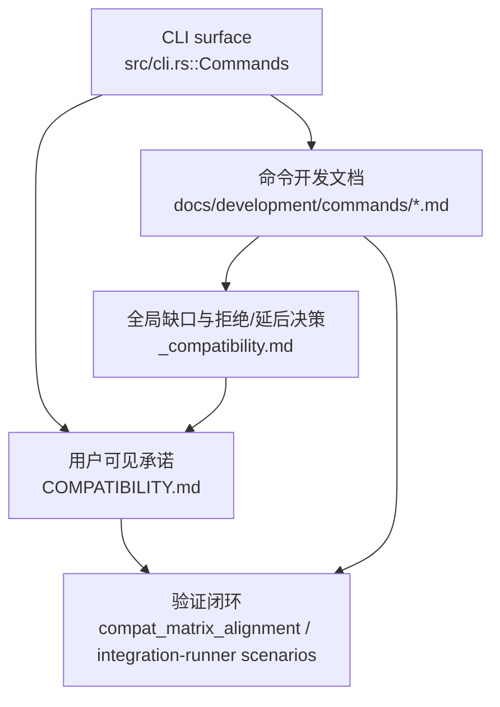

# 兼容性治理开发设计

## 命令实现目标

本文件维护 Libra Git 兼容面的开发目标、兼容分级、拒绝/延后决策和参数级治理。它不是 `COMPATIBILITY.md` 的替代品；`COMPATIBILITY.md` 是用户可见承诺，本文件解释这些承诺背后的设计、证据来源和后续工作。

## 对比 Git 与兼容性

- Libra 采用四级兼容模型：`supported`、`partial`、`unsupported`、`intentionally-different`。
- Git 兼容面只覆盖公开命令和公开参数；Libra AI/Cloud/Publish/Agent 等命令是有意扩展。
- `.libra_attributes` 是当前 Libra LFS 属性文件名；文档、代码和测试都必须使用这一拼写。
- 参数级状态由各命令开发文档的“还未实现的功能”、本文件的全局未实现表和 D 编号决策维护；`COMPATIBILITY.md` 维护命令级用户承诺。

## 设计方案

- 入口与分发：本文件不对应单个 CLI 子命令；治理入口是 `COMPATIBILITY.md` 的用户可见命令级承诺、`src/cli.rs::Commands` 的公开 CLI surface、各命令开发文档的参数级缺口，以及本文件的全局 D 编号决策。
- 源码分层：命令级状态来自 `src/cli.rs` 与 `src/command/mod.rs`，参数级状态来自 `docs/development/commands/<cmd>.md`，用户说明来自 `docs/commands/<cmd>.md`，跨命令拒绝/延后决策来自本文件。
- 执行路径：修改兼容状态时，先确认源码行为和测试证据，再同步 `COMPATIBILITY.md`、命令开发文档、用户文档和 compat 测试，最后运行脚本检查闭环。

- 流程图：以下流程图展示兼容性治理如何从源码事实进入矩阵、决策记录、用户承诺和测试验证。

- 底层操作对象：治理对象包括公开命令 enum、`COMPATIBILITY.md` 顶层矩阵、D 编号决策、用户文档、命令开发文档、Cargo compat 测试和 shell 校验脚本；它们共同决定“代码是否真的支持某项 Git surface”。
- 输出与错误契约：`COMPATIBILITY.md` 必须记录命令级 tier；各命令开发文档必须记录参数级缺口和测试处理方式；任何新增拒绝/延后项都要落到稳定 D 编号，避免未实现项失去解释来源。
- 副作用边界：本文件解释“为什么这样兼容”，不替代 `COMPATIBILITY.md` 的用户承诺；新增命令或参数时必须同时给出 tier、测试证据和未完成项处理方式。

## 当前状态

| 命令 | 当前 tier | 治理结论 | 说明 |
|---|---|---|---|
| merge | partial | partial | fast-forward and single-head three-way merge supported; `-m`/`--ff-only`/`--no-ff`/`--squash`/`--no-commit`/`--no-edit`/`--verify-signatures` (vault-key PGP only) supported; octopus/custom strategies deferred |
| pull | partial | partial | fetch + fast-forward/three-way merge supported; advanced strategy flags still partial |
| push | partial | partial | branch/tag update, multi-refspec, delete, `--tags`, and `--mirror` supported; local file remote rejected intentionally |
| checkout | partial | partial | visible branch compatibility surface plus explicit `checkout -- <path>` restoration alias; prefer `switch` / `restore` |

## 还未实现的功能

本节是对 `docs/development` 下所有 Markdown 文档中“还未实现的功能”、`BASELINE_GAP-*`、Account/Agent/Web-only 任务卡和 LFS quota 设计的全集整理，并按当前代码做最后核对。这里只保留代码仍未落地、用户面未公开、测试证据未闭合，或文档与代码存在收口风险的项；已经由代码确认落地的旧文档条目不再作为全局未实现项列入。

| 范围 | 全局未实现项 | 代码核对 | 最后确认/处理 |
|---|---|---|---|
| 命令接入治理 | `gc`、`package`、`prune`、`stats` 的开发文档或源码文件存在，但用户可见 CLI 与 `COMPATIBILITY.md` 未公开。 | `for-each-ref`、`ls-files`、`ls-tree`、`archive` 和 `notes` 已在 `src/cli.rs::Commands`、`COMPATIBILITY.md` 和命令开发文档中公开，不能再列为未公开命令。其余命令仍需按当前 CLI surface 核对是否返回 `LBR-CLI-001` 或应降级为内部资料。 | 作为全局未收口项保留；后续必须二选一：接入 CLI 并同步 `COMPATIBILITY.md`、命令文档和集成场景，或把对应命令文档降级为内部/历史资料。 |
| 兼容证据治理 | 参数级缺口不能只停留在文字说明；需要在命令开发文档、用户文档和 compat/integration 测试之间闭环。 | 删除独立参数 YAML 后，不再存在 `test_evidence`/`last_verified` 字段；证据必须落到具体测试、脚本或 D 编号说明中。 | 不允许把未验证参数当作完成承诺；新增兼容项时补测试证据，或把状态改为拒绝、延后、有意差异并给出 D 编号。 |
| 拒绝/延后决策 | submodule family、本地 file remote push、Git hooks bridge、clone recurse-submodules、Git LFS filter/hooks bridge、bisect replay/terms、stash create/store、sparse checkout、patch mode、interactive rebase/todo、clean pathspec、empty commit message、跨网/foreign-Git/push 侧 notes travel、依赖过滤克隆的工作树磁盘收窄。 | 对应 D1-D10、D15、D16、D17、D18、D-clean-pathspec、D-empty-message；源码/CLI 未暴露或显式拒绝这些 surface。 | 维持 D 编号；只有出现明确需求、设计和测试方案时再重启。 |
| staging/worktree Git surface | `add --intent-to-add`、`clean -i`、`clean <pathspec>`、`reset --merge/--keep`、`checkout -p` 以及跨命令 patch mode。（`restore --overlay`/`--ours`/`--theirs`/`--merge`/`--conflict` 已实现；`restore --progress` 是全局 `--progress` 冲突，DEAD。） | `mv -k` / `--skip-errors` 已实现，`mv --sparse` 与 `rm --sparse` 均已作为 no-op 暴露；`add`、`clean`、`reset` 的参数结构仍未暴露这些剩余 flag；patch mode 由 D15 拒绝；`switch --detach` 已实现，不能再把 detached HEAD 作为全局缺口。 | 作为命令级 Git 兼容缺口保留；实现时同步命令文档、`COMPATIBILITY.md` 和 integration scenarios。 |
| commit/rewrite/sequencer | `commit --allow-empty-message`、`rebase -i/--edit-todo/--exec/--rebase-merges/--empty=stop|ask` 类项、`rebase -i/--edit-todo/--exec/--rebase-merges/--empty=stop|ask`、`cherry-pick` 的 `--edit`、sequencer `--skip` / todo 自动续作与 strategy 扩展（`revert` 的 `--edit`/`--skip`/多提交续作均已实现，余为 cherry-pick/rebase 范畴）。 | `CommitArgs` 已公开并实现 `--fixup`、`--squash`、`--cleanup`，以及 `-e/--edit`、`-v/--verbose`（共享编辑器 helper + scissors 剥离）、`--porcelain`（提交状态 porcelain v1 机器输出）、`--status`/`--no-status`、`-t/--template`（含 `commit.template` 配置回落 + unedited-template 中止），这些不能再列为当前缺口；`--allow-empty-message` 仍由 D-empty-message 拒绝；`RebaseArgs` 已支持 `--onto`/`--autosquash`/`--reapply-cherry-picks`/`--keep-empty`/`--no-keep-empty`(丢弃 start-empty)/`--empty=<drop|keep>`(replay 后变空提交，缺省 keep)（仍缺 `-i/--exec/--rebase-merges`/`--empty=stop|ask` 等）；`cherry-pick` 已有较完整 sequencer，`revert` 已有 `--continue`/`--abort`/`--skip`、`--no-edit`（接受式 no-op）与 `-e/--edit`（编辑器，opt-in，经 `RevertState.edit` 串到 `--continue`/`--skip`），并已实现多提交冲突自动续作（冲突时把剩余提交 ID 存入 `RevertState.remaining`，`--continue`/`--skip` 续作其余）。注意 `pull --rebase` 已实现，不列入缺口。 | 保留为重写/序列器能力缺口；不能把已实现的 rebase `--onto`、commit `--fixup`/`--squash`/`--cleanup`/`-e`/`-v` 当作缺失。 |
| merge/pull strategy surface | octopus merge、自定义 strategy/`-X`。 | `MergeArgs` 已有 `-m`/`--ff-only`/`--no-ff`/`--squash`/`--no-commit`/`--no-edit`/`--verify-signatures`(vault-key PGP 验证，无外部 keyring)（octopus/自定义 strategy/`-X` 仍缺）；`PullArgs` 已有 `--rebase`、`--ff-only`、`--ff`、`--no-ff`、`--squash`、`--commit`、`--no-commit`、`--autostash` 与 fetch `--depth`。 | 仅 octopus/自定义 strategy/`-X` 仍为缺口；不要再把已实现的 merge/pull strategy flags（`--ff-only`/`--no-ff`/`--squash`/`--no-commit`/`-m`/`--no-edit`/`--verify-signatures`、pull `--squash`/`--commit`/`--no-commit`/`--autostash`）当作缺失。 |
| object/plumbing surface | `cat-file --follow-symlinks` 等（`index-pack --fix-thin` 已作为接受式 no-op 实现——libra 要求自包含 pack、无外部 delta-base 解析器、从不产出 thin pack，故对其能建索引的 pack 无需补全；真正的 thin-pack 补全不支持，不再列为开放缺口）。 | `cat-file` 暴露 `-t/-s/-p/-e`、AI modes、`--batch-check`/`--batch`/`--batch-command`（info/contents，带可选 `=<format>`）、`--batch-all-objects`（loose+packed，按 id 排序）；`verify-pack` 接受一个或多个 idx file、`--pack`（仅单 idx）、`-v` 和 `-s/--stat-only`；`index-pack` 是隐藏 plumbing，接受 pack file、`--stdin`、`-o`、`--keep[=<MSG>]`、Git-style `--progress` / `--no-progress`、`--fix-thin`（接受式 no-op）兼容入口和 test-only index version；`ls-tree` 已公开基础 tree inspection surface、子目录路径语义、`--full-name`、`--full-tree`、部分 `--format` atom 和 `REV:path` 子树导航，仅缺少完整 Git pathspec magic。 | 保留为 plumbing 兼容缺口；扩展参数时同步用户文档、命令文档、兼容矩阵和测试证据。 |
| inspection/reporting surface | `blame` reverse/incremental 与 copy/move detection、`describe --contains`、`diff --color-words`（`--binary`/`--ext-diff` 已实现）、`shortlog` stdin。 | `grep --untracked`（搜索未跟踪非忽略文件，#160）与 `grep --no-index`（无仓库递归遍历文件系统，#161）已实现；`shortlog --format`（自定义每条提交行模板，复用 `log --format` 占位符，#166）已实现；`describe --long` / `--dirty` / `--first-parent` / `--match` / `--exclude` / `--candidates`（n=0 等价 exact-match）/ `--all`（任意 ref，带 heads/remotes/tags 前缀）已有 CLI、JSON 和集成场景证据；`grep -A/-B/-C`、`-E/-G`、`-P` 拒绝、`-a/-I`、`--heading`/`--break`/`-z`、`grep -m`/`--max-count`、`grep -o`/`--only-matching`、`for-each-ref --merged`、`for-each-ref --exclude`、`blame -e`、`blame -l`/`-s`/`-t`/`--abbrev`/`-p`（显示标志）、`blame -w`/`--ignore-whitespace`（ignore-all-whitespace 行归属）、`diff --shortstat`/`--exit-code`/`-s`、`rev-parse --is-inside-git-dir`、`archive -v` 已实现；`shortlog --author`、`shortlog --group=author\|committer\|trailer:<key>` 与 `shortlog -w`（换行宽度，默认 76/6/9）已实现。 | 保留为低风险兼容增强池；新增时必须补命令级回归和测试证据。 |
| refs/worktree/tag surface | `worktree add <path> <branch>`、`worktree --detach`、per-worktree branch isolation、branch custom-format/其余 sort key（如 authordate/object-size）、tag Git-GPG 互通。 | `switch -C/--orphan`、`branch -m`、`branch -c`/`-C`/`--copy`（复制分支及上游配置）、`branch --unset-upstream`、`branch --points-at`、`branch --merged`/`--no-merged`、`branch --sort`（refname/version:refname/committerdate/creatordate）、`branch --ignore-case`、`branch --edit-description`、`tag -m`、`tag -F`、`tag -e`/`--edit`（编辑器撰写/编辑附注消息）、`tag --contains/--no-contains`、`tag --merged/--no-merged`、`tag --sort`、`tag --column`（always/auto/never）与 vault-PGP `tag -s/-v` 已实现，不再列为缺口；`worktree` 以共享 `.libra` 状态注册物理工作树。 | 保留剩余 Git surface 缺口；文档中已实现的旧缺口后续要在对应命令文档里清掉。 |
| LFS/account auth | `libra login/logout/whoami`、`vault.account.*`、account Bearer credential provider、`libra lfs quota`、uploads 和 account Bearer 接入未落地。 | `src/cli.rs` 无 Login/Logout/Whoami；`LfsCmds` 只有 track/untrack/locks/lock/unlock/ls-files；`LFSClient` 仍从 remote URL 派生 LFS endpoint；`is_vault_internal_key()` 未纳入 `vault.account.*`。 | 按 `docs/development/account.md` Track A-E 和 `lfs-quota-service-design.md` 继续推进；Track A website 安全前置未完成前不得宣称生产可用。 |
| Code Web-only / Agent runtime | `libra code` 默认 Web、拒绝 stdio、TUI startup 删除、Web harness 替代 PTY、Web graph parity、WorkflowPattern 和 per-workflow budget 未完成。 | `CodeArgs` 仍有 `--web/--web-only` 与 `--stdio`；默认分支仍调用 `execute_tui()`；`BudgetScope` 只有 Session/Agent/Goal；未发现 `WorkflowPattern` 层。 | 按 `docs/development/code-agent-runtime.md` AG-00 到 AG-15 继续；旧 W1 到 W12 已并入该文“旧 Web-only 草案合并闭环”。未完成前不能删除 TUI、graph、PTY harness 或切默认 Web。 |
| 集成测试治理 | `BASELINE_GAP-INTEG-001..007` 仍未全部收口：多机调度器、YAML/DSL 驱动、FA-* ID、四节点预算、live test fail-fast、pick-waves、tests/INDEX TODO。 | 辅助脚本目录已移除；Rust integration runner 已有 scenarios，因此缺口是 YAML/DSL 与调度/预算治理，不是“没有 runner”；`tests/INDEX.md` 仍有 TODO section。 | 保留为全局测试治理缺口；修改 Git 兼容命令时仍必须同步 integration scenarios 与集成测试计划。 |

## 拒绝与延后决策

### D1：`submodule` 子命令族

- 状态：拒绝。Libra 产品边界是单仓库/trunk-based，不维护 submodule 子命令族。
- 重启条件：出现无法用 monorepo 或对象存储解决的多仓库依赖场景，并有明确 RFC。

### D2：本地 file remote 的 `push`

- 状态：有意差异。`push` 面向网络 remote；本地路径 push 的并发和原子写入语义不纳入当前实现。
- 重启条件：有明确本地多工作树协作场景，并完成 lock/恢复语义设计。

### D3：Git hooks bridge 作为核心特性

- 状态：延后/拒绝作为核心默认能力。Libra 使用 `.libra/hooks` 和 AI provider hook 体系，不读取 `.git/hooks` 或 `core.hooksPath` 作为默认核心行为。
- 重启条件：Agent hook 体系完成统一收口后，再评估 stock Git hooks bridge 的安全边界。

### D4：`clone --recurse-submodules`

- 状态：拒绝。该 flag 依赖 D1 submodule 能力。
- 重启条件：D1 重启时同步重启。

### D5：Git LFS `.gitattributes` filter / hooks bridge

- 状态：有意差异。Libra LFS 使用内置 pointer/lock/batch client 和 `.libra_attributes`，不依赖外部 `git-lfs` filter 或 hooks。
- 重启条件：出现必须与 stock Git + `git-lfs` 双向共享同一工作树的生产场景，并有冲突处理 RFC。

### D6：`bisect replay`

- 状态：延后。当前 `bisect` 已覆盖 start/bad/good/reset/skip/log/run/view，replay 属低频复盘能力。
- 重启条件：`bisect log` 输出稳定并出现明确用户需求。

### D7：`bisect terms`

- 状态：延后。自定义 good/bad 术语不影响核心定位能力。
- 重启条件：用户明确请求且 `bisect run` 已稳定。

### D8：`stash create`

- 状态：延后。`stash create` 是 plumbing，当前不暴露。
- 重启条件：出现明确脚本/工具链调用方。

### D9：`stash store`

- 状态：延后。与 D8 配套，单独实现价值有限。
- 重启条件：与 D8 同步。

### D10：`clone --sparse` 与顶层 `sparse-checkout` 命令

- 状态：延后。Sparse checkout 依赖工作树配置和 skip-worktree 语义；Libra 已将 config/HEAD/refs 放入 SQLite，桥接成本高。
- 重启条件：出现大型 monorepo 子树检出需求，并完成对象存储 + 部分检出的工程 RFC。

- lore.md 2.2 landed the NON-declined complement: `libra sparse-view`, a strictly READ-ONLY view filter over `ls-files`/`diff` (working-tree) output that NEVER materializes or prunes the working tree, never writes skip-worktree bits, and never filters the to-be-committed set (status stays honest). The materializing `sparse-checkout` command and `clone --sparse` remain declined here.

### D15：跨命令 patch mode

- 状态：拒绝。`add -p`、`commit -p`、`checkout -p`、`restore -p`、`reset -p`、`stash -p` 等交互式 patch mode 暂不进入当前兼容面。
- 原因：patch mode 需要稳定的交互式 hunk 编辑、索引/工作树半应用语义和可恢复错误处理；当前 Libra 优先保证非交互式 Agent 可驱动路径。
- 重启条件：先完成可测试的 hunk 编辑模型、JSON/机器输出边界和端到端回归测试，再逐命令开放。

### D16：交互式 rebase 和 todo 编辑

- 状态：拒绝。`rebase -i` 与 `rebase --edit-todo` 暂不支持。
- 原因：交互式 rebase 需要 sequencer/todo 文件、编辑器生命周期、冲突恢复和历史重写保护；当前 rebase 兼容面优先覆盖可脚本化路径。
- 重启条件：sequencer 状态模型、错误恢复和非 TTY/Agent 驱动协议完成后重新评估。（lore.md 2.6 已落地统一 `sequence_state` 状态模型的 v1——cherry-pick 迁移 + 对称跨序列互斥；交互式 rebase 的 todo 文件/编辑器生命周期仍待后续，此状态模型为其前置。）

### D-clean-pathspec：`clean <pathspec>`

- 状态：延后。`clean` 的 pathspec 位置参数未纳入当前可用面。
- 原因：`clean` 会删除工作树文件，pathspec 过滤必须先有明确的 ignore、目录递归、dry-run 和安全提示一致性。
- 重启条件：完成 pathspec 解析与删除保护测试，确保 dry-run 与实际删除结果一致。

### D-empty-message：`commit --allow-empty-message`

- 状态：拒绝。空提交说明不是当前 `commit` 默认可用面。
- 原因：Libra 依赖提交信息作为人类和 Agent 的审计线索；允许空消息需要显式产品决策和钩子/签名路径测试。
- 重启条件：存在明确自动化场景，并补齐 commit-msg hook、签名和日志渲染测试。

### D17：跨网 / foreign-Git / push 侧 `refs/notes/deps` travel

- 状态：延后。lore.md 3.2 v1 只在**本地协议 LibraRepo↔LibraRepo** 之间旅行依赖图：`fetch`/`pull --notes` 从本地 Libra 源经专用旁路（`export_deps_notes` → `deps::import_notes` union-merge）导入 `refs/notes/deps`，默认 OFF（Git parity）。跨网远端（`https://`/`ssh://`/`git://`）、本地 **foreign-Git** 源、以及 **push 侧** notes travel 尚未支持——网络/foreign 远端只发一条诚实的 "not supported yet" 警告并不导入任何图。
- 原因：Libra 的 note 不是 Git 的 notes-tree-commit（是 loose blob + SQLite `notes` 行，`refs/notes/deps` 非 reference 表真 ref），故无法搭 pack/ref want 集旅行；跨网需要线协议能力（双向 notes-tree ⇄ Libra notes-row 翻译，或 Libra 原生能力协商通道），push 侧还叠加 D2（本地 file remote push 有意拒绝）的原子写/并发语义。这些都需要独立的协议设计与端到端测试。
- 重启条件：先冻结 notes 线协议（能力协商 + 双向翻译 + 鉴权），补齐跨网/foreign-Git 往返与 push 侧原子写测试，再逐通道开放。

### D18：依赖过滤克隆的工作树**磁盘**收窄

- 状态：延后。`clone --deps-of`（lore.md 3.2）在**全量、commit-safe 的 checkout** 之后，只把只读 sparse VIEW（2.2）scope 到依赖闭包——**整棵树仍在磁盘上**，对象也从不 wire 过滤（与 `clone --filter` "不排除对象" 同等诚实）。真正按依赖闭包**收窄工作树磁盘占用**（只物化闭包文件）尚未支持。
- 原因：commit-safe 地收窄工作树需要 **skip-worktree/materializing-sparse 机制**（Libra 至今无此索引位——正是 D10 延后的 materializing 形）：HEAD 是完整提交树，任何窄于 HEAD 的索引都会让 `commit` 丢文件，而全索引+窄工作树在没有 skip-worktree 位时会让 `status` 谎报删除。因此磁盘收窄与 D10 绑定，不能在 v1 单独安全交付。
- 重启条件：先落地 D10 的 materializing sparse-checkout / skip-worktree 索引位（含 status/add/commit/checkout 全链一致性与测试），再让 `--deps-of` 复用其物化路径实现磁盘收窄。

## 维护要求

- 改进本命令前，必须先阅读并遵循 [docs/development/commands/_general.md](_general.md)；这是命令设计、实现、测试和文档同步的强制要求。
- 修改 Git 兼容行为时，必须同步 `COMPATIBILITY.md`、本文件、对应 `docs/development/commands/<cmd>.md`、用户命令文档和测试。
- 新增拒绝/延后项必须分配 D 编号，并在对应命令开发文档的未实现表中引用。
