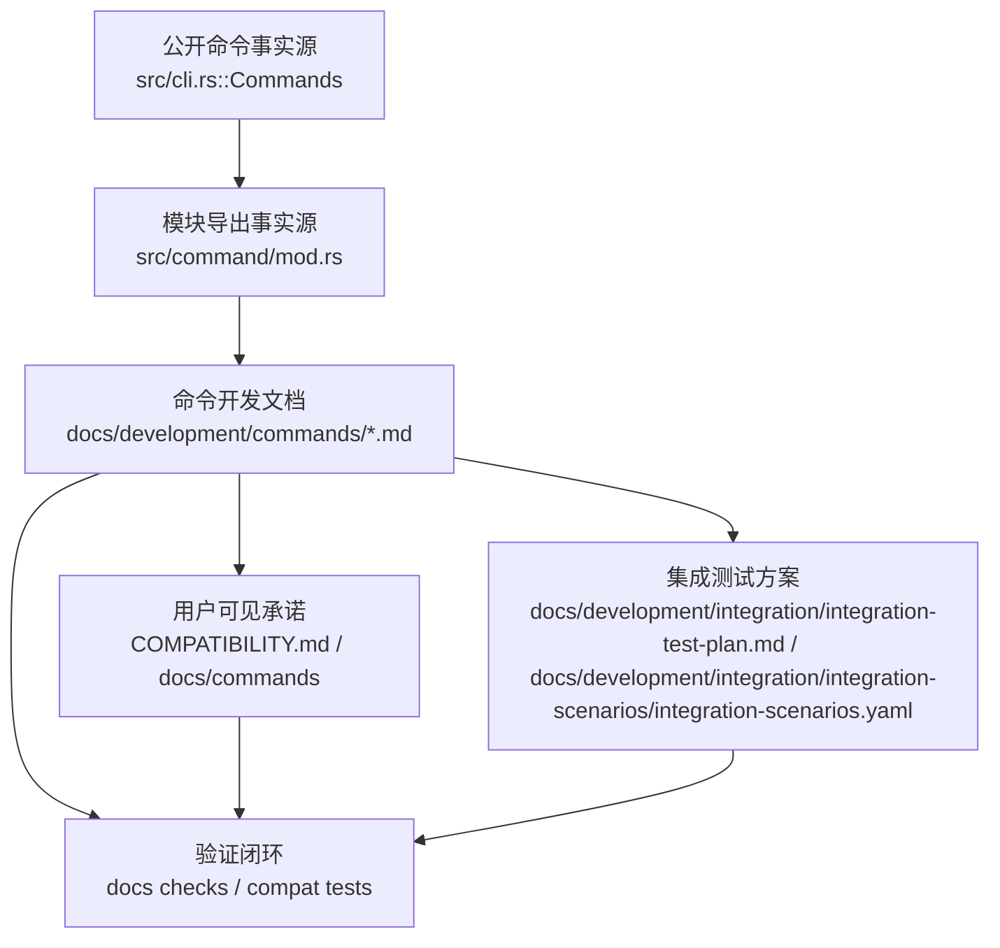

# 跨命令开发规范

## 命令实现目标

本文件作为 `docs/development/commands` 的总览，说明命令文档的组织方式、共同约束和跨命令治理规则。它用于帮助维护者判断每个命令文档应如何描述实现目标、Git 兼容状态、设计方案、历史来源、当前状态和未完成工作。

## 对比 Git 与兼容性

- Git 兼容命令以 `COMPATIBILITY.md` 为用户承诺，以 `docs/development/commands/<cmd>.md` 记录实现细节和未完成项，并以 `docs/development/integration/integration-test-plan.md` / `docs/development/integration/integration-scenarios/integration-scenarios.yaml` 作为集成验证方案的事实源。
- Libra 扩展命令如 `code`、`agent`、`cloud`、`publish`、`usage`、`sandbox` 不追求 Git 同形，必须解释差异和替代工作流。
- 全局参数 `--json`、`--machine`、`--no-pager`、`--color`、`--progress`、`--quiet`、`--exit-code-on-warning` 是 Agent 驱动 CLI 的基础契约。
- 全局耐久性参数 `--sync-data`（`lore.md` §0.5）：对本地对象写强制 fsync（临时文件与父目录）换取抗断电耐久性，代价是写吞吐；recovery-critical 的 sequencer 状态恒 fsync 不受此开关影响。等价于 `LIBRA_SYNC_DATA=1`，经 `utils::atomic_write` 收口。
- 全局资源上限 `--max-connections <N>`（`lore.md` §0.9）：限制并发远端连接/请求数，防止大仓库/CI fan-out 打爆连接。优先级 flag > `LIBRA_MAX_CONNECTIONS` env > 默认 16；`0` 视为 `1`；非法 env 值报 usage 错误（退出 128）。经 `utils::resource_limits` 全局收口，被 `RemoteStorage::exist_batch`（§0.6）的 `buffered(N)` 消费；对纯本地操作 no-op。文件数/大小、线程、search 等其它资源上限为后续项。
- 全局取数策略（`lore.md` §0.8）：控制分层对象存储的取数来源。`--offline` 全局 flag（唯一 collision-free 的名字——`--local`/`--remote` 会与 `config --local`/`clone --local`/`config generate-ssh-key --remote`/`agent push --remote` 撞名）→ 只读本地、缺对象即明确报错不触远端（即 Lore 的 `--offline`/`--local` 读语义）。完整三态经 env `LIBRA_READ_POLICY`（`auto`/`offline`/`local`/`remote`）：`remote` 强制从 durable tier 刷新（本地命中也重取，远端缺失才回退本地）。优先级：`--offline` flag > `LIBRA_READ_POLICY` env > `Auto` 缺省（本地优先、miss 再取远端）。无法识别的 `LIBRA_READ_POLICY` 值直接报 usage 错误（退出 128），不静默回落 Auto——防止 typo 悄悄重新开启远端读。`cli.rs` 无论有无 flag/env 都显式 `set_read_policy`（含 Auto），故复用进程不会残留旧策略。经 `utils::read_policy` 全局收口，被 `TieredStorage::get` 消费；对无远端的纯本地仓库为 no-op。

## 设计方案

- 入口与分发：本总览不对应单个 CLI 子命令；它以 `src/cli.rs::Commands` 作为公开命令入口事实源，以 `src/command/mod.rs` 作为命令模块导出事实源。
- 源码分层：文档结构固定维护六段内容：实现目标、Git 兼容性、设计方案、实现历史、当前状态、未完成项；`README.md` 只作为索引，不承载单命令设计。
- 执行路径：维护者新增或修改命令文档时，先核对 `src/cli.rs`、`src/command/<cmd>.rs` 和必要的子模块，再把入口、参数类型、输出/错误类型、执行流程和测试证据写回对应文档；若修改的是 Git 兼容命令，还必须同步 `COMPATIBILITY.md`、`docs/development/integration/integration-test-plan.md`、`docs/development/integration/integration-scenarios/integration-scenarios.yaml` 和对应集成测试证据，保证命令文档、用户可见承诺和集成测试方案一致。

- 流程图：以下流程图展示跨命令文档治理的事实源、写入位置和验证闭环。

- 底层操作对象：涉及 `.libra/index`、对象库、SQLite refs/HEAD/reflog、D1/R2、Agent session/checkpoint、worktree registry 等对象时，文档必须点名这些对象和副作用边界。
- 输出与错误契约：每个命令页都必须说明 `CliError` / `CliResult`、`OutputConfig`、JSON/machine 输出以及 stable error code 的维护方式；未公开命令必须显式标记为未发布。
- 副作用边界：文档变更后运行 `cargo test --test compat_matrix_alignment` 和相关 compat Cargo 测试，避免文档、集成测试方案和代码状态再次分叉。

## 实现历史

- 本节依据本地 main 分支提交历史重写，重点记录跨命令治理节点，而不是重复各单命令日志。
- 2026-03-18 `d8eaed0e`（`feat(cli): standardize error codes and add error-code help/docs (#302)`）：统一 CLI 错误码和错误码文档，为后续命令文档提供稳定的用户可见错误口径。
- 2026-03-19 `2fd0c85f`（`feat(cli): add global machine-readable output flags (#303) (#304)`）：引入全局机器可读输出开关，形成 JSON/结构化输出在命令文档中的共同说明基础。
- 2026-05-23 `b2b27741`、`5672d865`、`9d2437f6`：连续补齐帮助文本描述、位置参数说明和 impl-meta 泄漏守卫，说明当前文档需要和 `--help` 可见面保持一致。
- 2026-06-11 `e905d594`（`test(integration): complete CLI coverage audit`）：把 CLI 覆盖审计纳入历史，后续新增/改名命令需要同步文档、测试索引和 `COMPATIBILITY.md`。

## 当前状态

- 公开命令由 `src/cli.rs::Commands` 决定；未在 enum 中出现的文档页不能被视为可用 CLI。
- `tests/compat/matrix_alignment.rs` 已守卫 `COMPATIBILITY.md` 与 CLI 命令集合对齐，并覆盖 Code UI / automation 的关键命令文档契约和集成测试计划引用。
- `tools/integration-runner` 已承载黑盒场景执行；Git 兼容命令变更必须把需要新增或调整的集成场景同步到该计划。
- `agent.md` 必须保留 `diagnostics_redaction_test` 事实，该约束由 compat 测试守卫。
- `tests/compat/*` 继续承担跨命令兼容性和文档契约检查。

## 还未实现的功能

| 类别 | 未完成项 | 当前处理 |
|---|---|---|
| 功能缺口 | 未公开命令资料需要逐一决策：接入 CLI、移出用户文档，或保留为明确的历史设计。 | 后续实现时需要同步源码、测试、`COMPATIBILITY.md` 和集成测试方案。 |
| 功能缺口 | 部分命令仍是 `部分支持`，具体缺口以各命令文档和 `_compatibility.md` 为准。 | 后续实现时需要同步源码、测试、`COMPATIBILITY.md` 和集成测试方案。 |
| 功能缺口 | 参数级缺口需要随实现持续补齐命令文档、测试证据和 owner scenario。 | 后续实现时需要同步源码、测试、`COMPATIBILITY.md` 和集成测试方案。 |

## 维护要求

- 本文件是改进命令的强制前置规范；改进任何命令前必须先阅读并遵循 [docs/development/commands/_general.md](_general.md)。
- 新增命令：先补 `src/cli.rs`、`src/command/mod.rs`、实现模块、用户文档、开发文档、`COMPATIBILITY.md` 和测试。
- 新增参数：必须说明 Git 对齐情况、JSON/机器输出影响、错误码和回归测试。
- 修改 Git 兼容命令时，必须把新增、删除或语义变化的场景加入 `docs/development/integration/integration-test-plan.md` 和 `docs/development/integration/integration-scenarios/integration-scenarios.yaml`，并保持对应 runner、Wave、执行命令和验收证据一致。
- 移除或延后能力：必须在命令文档和 `_compatibility.md` 中明确用户影响和重启条件。
