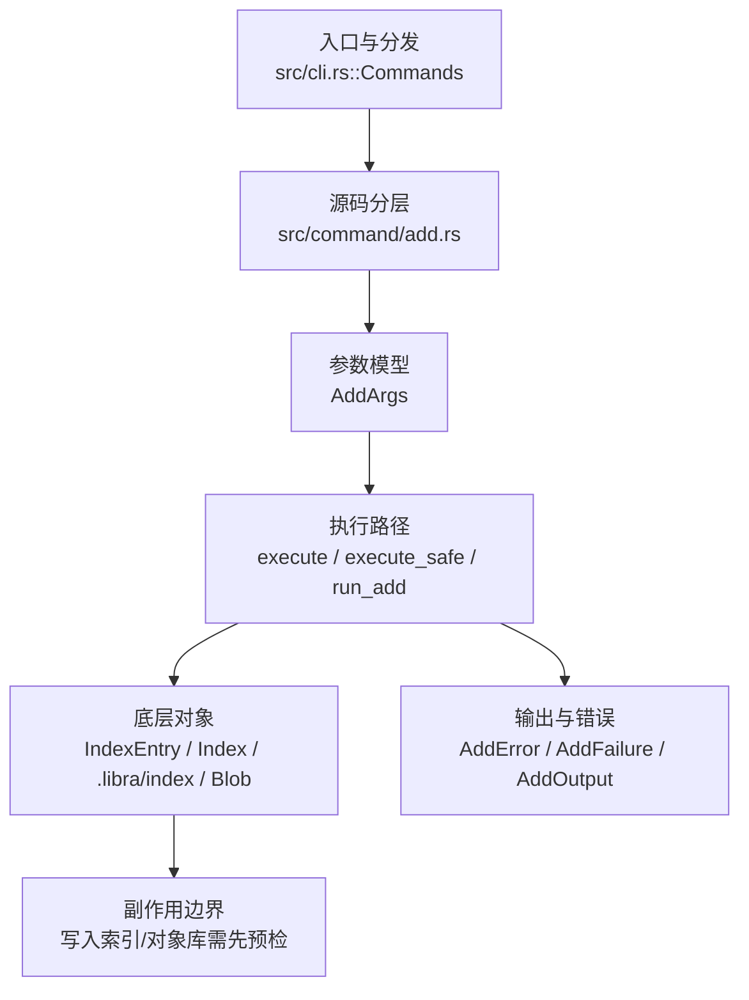

# `libra add` 开发设计

## 命令实现目标

`libra add` 的目标是把工作区中的文件变化写入索引，为下一次 `libra commit` 准备快照。实现需要覆盖路径规格、忽略规则、`--dry-run` 预览、`--refresh` 重新检查已跟踪条目、`-A` 全量暂存以及 LFS 指针文件暂存，同时保证路径解析不会越过仓库根目录。

## 对比 Git 与兼容性

- 兼容级别：`partial`。sparse-checkout flag unsupported

- 当前矩阵明确仍是部分兼容；未覆盖的 Git surface 必须显式列在“还未实现的功能”。

## 设计方案

- 入口与分发：已公开接入 `src/cli.rs::Commands`；已由 `src/command/mod.rs` 导出。CLI 层在 `src/cli.rs` 把解析后的参数交给命令模块，命令模块负责把领域错误转换为 `CliError` / `CliResult`。
- 源码分层：主要实现文件为 `src/command/add.rs`。参数/子命令类型包括：`AddArgs`；输出、错误或状态类型包括：`AddError`、`AddFailure`、`AddOutput`；主要执行函数包括：`execute`、`execute_safe`、`run_add`。
- 源码意图：源码模块注释说明该命令会解析 pathspec 与模式标志，套用 Git/Libra ignore 策略，按工作区和索引分类路径，写入 blob 对象，最后保存更新后的索引。
- 执行路径：`execute_safe` 负责 CLI 安全包装、错误映射和输出配置；核心领域逻辑集中在 `run_add`；索引路径会加载、比较、刷新或保存 `.libra/index`；对象路径会解析 revision 并读写 blob/tree/commit/tag 等对象；LFS 路径会按 Git/Libra attributes 来源生成 pointer、锁或 batch 请求。

- 流程图：以下流程图按当前源码分层展示主路径和底层对象边界，便于维护者把代码入口、执行函数和副作用范围对应起来。

- 底层操作对象：`IndexEntry`（索引条目，承载路径、mode、object id 和 stat 元数据）；`Index` / `.libra/index`（暂存区状态、路径条目和刷新/保存边界）；`Blob`（文件内容或 LFS pointer 写入对象库后的 blob 对象）；LFS pointer / lock / batch 对象（Git/Libra attributes 来源驱动的大文件路径）
- 输出与错误契约：人类输出、`--json` / `--machine` 输出和 quiet/verbose 分支必须继续走现有 `OutputConfig` / `emit_json_data` / `CliError` 路径；新增失败模式要补稳定错误码、用户提示和回归测试。
- 副作用边界：凡是写入索引、对象库、refs/HEAD、reflog、SQLite/D1、工作树或远端的路径，都必须先完成参数校验和 dry-run/预检分支，再执行持久化，避免部分写入后静默成功。

## 实现历史

- 本节依据本地 main 分支提交历史重写，筛选与该命令实现、测试或文档路径直接相关的提交；以下是归纳后的实现脉络。
- 2025-11-12 `dceab279`（`feat: 为 add 命令提供 --force 并统一 ignore 策略 (#38)`）：基础实现节点：为 add 命令提供 --force 并统一 ignore 策略 (#38)；当前实现的主要轮廓可追溯到该提交。
- 2026-06-12 `57dc1cf8`（`feat(p0-rejection): add -p/--patch flag rejection across add, commit, checkout, restore, reset, rebase, stash`）：功能演进：add -p/--patch flag rejection across add, commit, checkout, restore, reset, rebase, stash；注意：当前 `src/command/add.rs` 已不含 `-p`/`--patch` 拒绝逻辑，该改动后续被回退。
- 2026-06-03 `d22736ef`（`feat(add): implement --renormalize (tracked-only), --pathspec-from-file/--pathspec-file-nul, --ignore-missing (dry-run) (v0.17.1281)`）：功能演进：implement --renormalize (tracked-only), --pathspec-from-file/--pathspec-file-nul, --ignore-missing (dry-run) (v0.17.1281)；注意：`--pathspec-from-file`/`--pathspec-file-nul` 一直保留；`--renormalize` 与 `--ignore-missing` 曾被回退，现已随 `--chmod` 一并重新落地（见缺口表“✅ 已实现”）。
- 2026-06-07 `5c2961e7`（`fix(add): close compatibility plan gaps`）：实现修正：close compatibility plan gaps；该节点把边界行为、错误处理或兼容差异纳入当前实现约束。
- 2026-07-09（plan-20260708 P1-01）：`add` 的位置 pathspec、`--pathspec-from-file`、`--refresh`、`--chmod`、`--renormalize` 与普通暂存候选统一接入 `src/utils/pathspec/`。当前支持 plain prefix、wildcard、`:(top)`/`:/`、`:(glob)`、`:(literal)`、`:(icase)`、`:(exclude)`、`:!`、`:^`，并按 `core.ignorecase` 作为默认大小写策略；wildcard-looking pattern 仍匹配同名字面路径或目录前缀（Git bracket-file / bracket-directory 行为）；ignore/missing 校验改为对共享 matcher 的正向规格逐一确认。回归守卫：`compat_pathspec_magic::add_honors_shared_pathspec_magic` 与 `command_test pathspec`。
- 历史结论：当前文档应以这些提交之后的代码、测试和兼容矩阵为准；更早的迁移式文档只保留为背景，不再作为事实来源。

## 当前状态

- 公开状态：已公开；模块状态：已导出。
- 用户文档：`docs/commands/add.md`。
- Synopsis：`libra add [OPTIONS] [PATHSPEC...]`。
- 公开参数/子命令包括：`[PATHSPEC...]`、`-A, --all`、`-u, --update`、`--refresh`、`-f, --force`、`-n, --dry-run`（`-n` 对齐 Git；`-d` 保留为 Libra 兼容短别名，经 `visible_short_alias`）、`-v, --verbose`、`--ignore-errors`、`--pathspec-from-file`、`--pathspec-file-nul`、`--chmod=(+|-)x`、`--renormalize`、`--ignore-missing`。
- plan-20260708 P1-01 后，`add` 使用共享 pathspec engine：plain prefix、wildcard、`:(top)`/`:/`、`:(glob)`、`:(literal)`、`:(icase)`、`:(exclude)`、`:!`、`:^` 均由 `PathspecSet::from_workdir_with_default_icase` 编译；候选集统一通过 `matches_path` 过滤，未命中的正向规格由 `unmatched_positive_specs` 报错或在 `--dry-run --ignore-missing` 下跳过；包含 wildcard metachar 的 pathspec 仍先匹配同名字面候选或目录前缀，再走 regex 匹配。
- plan-20260708 P0-11 后，工作树 symlink 会按链接本身暂存：`gen_blob_from_file` 经 `read_worktree_blob_bytes` 读取 link target bytes，index mode 由 `IndexEntry::new_from_file` 记录为 `120000`，不会跟随目标文件；`--ignore-missing` 与路径分类使用 `symlink_metadata`，dangling symlink 仍视为存在路径。回归守卫：`compat_symlink_basic::add_symlink_stores_mode_and_target_blob`。

## 还未实现的功能

| 类别 | 未完成项 | 当前处理 |
|---|---|---|
| 兼容矩阵说明 | sparse-checkout 标志不支持 | 按当前兼容矩阵保留；实现状态变化时同步 `_compatibility.md` 和测试证据。 |
| 兼容差异项 | Intent to add | 原始对照：git add -N / --intent-to-add；相关参数/替代：不适用；当前说明：不适用 (未实现)。 后续实现时需要补对应回归测试并同步兼容矩阵。 |
| 兼容差异项 | Interactive patch (`-p`/`--patch`) | 原始对照：git add -p / --patch；当前 `AddArgs` 不含该参数（曾在 `57dc1cf8` 加入拒绝逻辑后被回退）。后续实现时需补回归测试并同步兼容矩阵。 |
| ✅ 已实现 | Chmod (`--chmod=±x`) | 原始对照：git add --chmod=+x；当前说明：`--chmod=+x`→index mode `100755`、`--chmod=-x`→`100644`，经 `apply_chmod` 对 pathspec 命中的 tracked 普通 blob 强制改 mode（保持 blob 不变，符号链接/gitlink 跳过；非法值报 `LBR-CLI-002`）；mode 仅变更也计入 modified。**为使 chmod-only 改动可提交**，`status::changes_to_be_committed_safe` 改用 `get_plain_items_with_mode` 比对 HEAD tree 与 index 的 mode（经 `index_mode_to_tree_item_mode` 归类），mode 不同即记为 staged-modified（此前只比 hash，纯 mode 改动会被 status/commit 视为无变更）。带集成测试 `test_add_chmod_sets_and_clears_exec_bit`/`test_add_chmod_invalid_value_errors`。 |
| ✅ 已实现 | Renormalize (`--renormalize`) | 原始对照：git add --renormalize；当前说明：隐含 `-u`（仅 tracked），经 `renormalize_entry` 对每个命中的 tracked 文件强制重写 blob 并更新 index（内容不变也重写；已删除则 stage 删除；目录 no-op），从不 stage 未跟踪文件。带集成测试 `test_add_renormalize_only_tracked`/`test_add_renormalize_stages_tracked_deletion`。 |
| ✅ 已实现 | Pathspec from file (`--pathspec-from-file`/`--pathspec-file-nul`) | 原始对照：git add --pathspec-from-file / --pathspec-file-nul；当前说明：`AddArgs` 含 `pathspec_from_file: Option<String>` 与 `pathspec_file_nul: bool`（clap `requires = "pathspec_from_file"`）；`execute_safe` 读取该文件并按换行或 NUL 切分、与命令行 pathspec 合并（空行忽略）。 |
| ✅ 已实现 | Ignore missing (`--ignore-missing`) | 原始对照：git add --ignore-missing；当前说明：clap `requires = "dry_run"`（与 git 一致，必须配 `--dry-run`）；`validate_pathspecs` 对没有匹配 add 候选的 pathspec 跳过并记入 `ValidatedPathspecs.missing`（text 模式 stderr 警告；JSON 模式作为机器可读 `missing` 列表输出），只命中 ignored 文件的 pathspec 仍进入 ignored warning。带集成测试 `test_add_ignore_missing_dry_run_skips`。 |
| ✅ 已实现 | Symlink staging | 原始对照：Git 把 symlink 作为 mode `120000` blob，内容为 link target；当前说明：`libra add` 读取 symlink target bytes 入库，不跟随或打开目标路径，dangling symlink 可正常暂存。带 compat 测试 `compat_symlink_basic`。 |
| ✅ 已实现 | Shared pathspec magic | 原始对照：git pathspec magic；当前说明：`add` 位置参数与 `--pathspec-from-file` 条目统一走 `src/utils/pathspec/`，支持 plain prefix、wildcard、`top`/`glob`/`literal`/`icase`/`exclude` 等高价值 magic，并继承 `core.ignorecase`。带 compat 测试 `compat_pathspec_magic::add_honors_shared_pathspec_magic`。 |

## 维护要求

- 改进本命令前，必须先阅读并遵循 [docs/development/commands/_general.md](_general.md)；这是命令设计、实现、测试和文档同步的强制要求。
- 任何行为变更都要先核对实现源码，再同步 `COMPATIBILITY.md`、`docs/commands/<cmd>.md` 和相关测试。
- 新增 Git 兼容参数时必须明确 tier、错误码、JSON/机器输出契约和回归测试。
