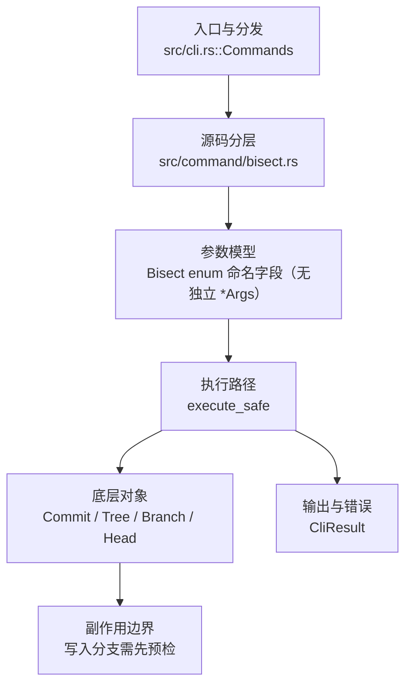

# `libra bisect` 开发设计

## 命令实现目标

`libra bisect` 的目标是用二分法定位引入问题的提交，并提供 `start`、`bad`、`good`、`skip`、`run`、`reset`、`log`、`view` 等子命令。实现需要把状态持久化到仓库数据库，`start` 接受可选的 bad 位置参数和单个 `--good` 标志（内部状态可累积多个 good 提交），同时在不支持的 Git 扩展上给出明确拒绝。

## 对比 Git 与兼容性

- 兼容级别：`partial`。`start` / `bad` / `good` / `reset` / `skip` / `log` / `run` / `view`（含 git 别名 `visualize`）与 `start --first-parent`（候选枚举仅沿首父历史）supported; `replay` (see [docs/development/commands/_compatibility.md#d6-bisect-replay](docs/development/commands/_compatibility.md#d6-bisect-replay)) / `terms` (see [docs/development/commands/_compatibility.md#d7-bisect-terms](docs/development/commands/_compatibility.md#d7-bisect-terms)) deferred

- 当前矩阵明确仍是部分兼容；未覆盖的 Git surface 必须显式列在“还未实现的功能”。

## 设计方案

- 入口与分发：已公开接入 `src/cli.rs::Commands`；已由 `src/command/mod.rs` 导出。CLI 层在 `src/cli.rs` 把解析后的参数交给命令模块，命令模块负责把领域错误转换为 `CliError` / `CliResult`。
- 源码分层：主要实现文件为 `src/command/bisect.rs`。参数/子命令类型包括：源码未暴露独立 `*Args` 类型，参数边界以子命令 enum 或私有 parser 为准；输出、错误或状态类型包括：源码未暴露独立输出/错误类型，错误通过 `CliResult` 或上层命令错误统一传播；主要执行函数包括：`execute_safe`。
- 执行路径：`execute_safe` 负责 CLI 安全包装、错误映射和输出配置；对象路径会解析 revision 并读取 commit/tree 对象，并在工作树恢复时（`restore_to_commit` → `restore_tree_to_workdir` → `restore::restore_to_file`）对每个检出文件读取其 `Blob`（涉及 `Commit` / `Tree` / `Blob`，不涉及 tag）；引用路径会读取或更新 SQLite refs 与 HEAD（不写 reflog）；数据库路径仅通过 SeaORM/SQLite 持久化 `bisect_state` 元数据（不使用 D1 客户端）。

- 流程图：以下流程图按当前源码分层展示主路径和底层对象边界，便于维护者把代码入口、执行函数和副作用范围对应起来。

- 底层操作对象：`Commit`（提交对象、父提交关系和提交消息载荷）；`Tree`（由索引或对象遍历生成的目录树对象）；`Branch` / branch store（SQLite refs 上的分支读写、过滤和上游关系）；`Head`（SQLite 中的 HEAD 指向、当前分支和 detached 状态）；SeaORM / `.libra/libra.db`（配置、refs、reflog、AI/发布元数据等 SQLite 表）；`ObjectHash`（SHA-1/SHA-256 对象 ID 和 revision 解析结果）；`ConfigKv`（配置键值持久化行）
- 输出与错误契约：人类输出、`--json` / `--machine` 输出和 quiet/verbose 分支必须继续走现有 `OutputConfig` / `emit_json_data` / `CliError` 路径；新增失败模式要补稳定错误码、用户提示和回归测试。
- 副作用边界：`bisect` 实际只写入 HEAD、SQLite `bisect_state` 表与工作树（经由 `restore_to_commit`）；它不写索引、不直接写对象库、不写 reflog、不使用 D1、也从不联系远端。这些写入路径都必须先完成参数校验和预检分支，再执行持久化，避免部分写入后静默成功。

## 实现历史

- 本节依据本地 main 分支提交历史重写，筛选与该命令实现、测试或文档路径直接相关的提交；以下是归纳后的实现脉络。
- 2026-03-31 `41ee8224`（`feat(bisect): implement git bisect command for binary search debugging (#329)`）：基础实现节点：implement git bisect command for binary search debugging (#329)；当前实现的主要轮廓可追溯到该提交。
- 2026-06-03 `9c0249d5`（`feat(bisect): accept multiple good commits as positional args to start (v0.17.1284)`）：功能演进；当前 HEAD 的 `start` surface 为可选 `<bad>` 位置参数加单个 `-g, --good` 标志（位置式多 good 已不在当前 CLI 暴露），多个 good 通过后续 `bisect good` 累积进内部状态。
- 2026-05-26 `85eada4e`（`feat(bisect): add structured output contract`）：功能演进：add structured output contract；该节点扩展了当前命令可用的参数或行为。
- 2026-06-04 `a0e349a9`（`fix: align blame and bisect compatibility`）：实现修正：align blame and bisect compatibility；该节点把边界行为、错误处理或兼容差异纳入当前实现约束。
- 历史结论：当前文档应以这些提交之后的代码、测试和兼容矩阵为准；更早的迁移式文档只保留为背景，不再作为事实来源。

## 当前状态

- 公开状态：已公开；模块状态：已导出。
- 用户文档：`docs/commands/bisect.md`。
- Synopsis：`libra bisect start [<bad>] [--good <commit>] [--first-parent]`。
- 公开参数/子命令包括：`start [<bad>] [-g, --good <good>] [--first-parent]`、`bad [<rev>]`、`good [<rev>]`、`reset [<rev>]`、`skip [<rev>]`、`log`、`run <cmd>...`、`view`（`visible_alias = "visualize"`——git 的 `visualize` 在 Libra 里是 `view` 的别名，显示文本状态而非 gitk GUI，终端原生的有意差异）。`--first-parent` 持久化到 `bisect_state.first_parent` 列（带 `ALTER TABLE` 迁移），`get_testable_commits` 在 BFS 时仅入队 `parent_commit_ids.first()`（good 祖先集合仍用全祖先，因为某提交若是 good 的任意祖先即为 good）。

## 还未实现的功能

| 类别 | 未完成项 | 当前处理 |
|---|---|---|
| 兼容矩阵说明 | `start` / `bad` / `good` / `reset` / `skip` / `log` / `run` / `view` 支持; `replay` (see [docs/development/commands/_compatibility.md#d6-bisect-replay](docs/development/commands/_compatibility.md#d6-bisect-replay)) / `terms` (see [docs/development/commands/_compatibility.md#d7-bisect-terms](docs/development/commands/_compatibility.md#d7-bisect-terms)) 延后 | 按当前兼容矩阵保留；实现状态变化时同步 `_compatibility.md` 和测试证据。 |
| 兼容差异项 | Custom terms | 原始对照：不支持 (延后 — see compatibility/declined.md D7)；相关参数/替代：bisect terms / --term-old / --term-new；当前说明：不适用。 后续实现时需要补对应回归测试并同步兼容矩阵。 |
| 兼容差异项 | Replay session | 原始对照：不支持 (延后 — see compatibility/declined.md D6)；相关参数/替代：bisect replay <logfile>；当前说明：不适用。 后续实现时需要补对应回归测试并同步兼容矩阵。 |
| ✅ 已实现（有意差异） | `bisect visualize` | `visualize` 作为 `view` 的 clap `visible_alias`：两者路由到同一 `run_bisect_view` 处理器，输出文本状态（HEAD/good/bad/current/remaining + 候选）。Libra 无 gitk，故不启动 GUI（git 的 `visualize` 启 gitk/log）——这是终端原生的有意差异。带集成测试（`bisect_visualize_aliases_view`：与 `view` 退出码/输出一致，`--help` 列出别名）。 |
| ✅ 已实现 | First-parent only `--first-parent` | `bisect start --first-parent` 将候选枚举限制在首父历史：状态持久化到 `bisect_state.first_parent`（列 + 迁移），`get_testable_commits` 仅沿 `parent_commit_ids.first()` 走，使合并入的侧分支不贡献可测提交。带集成测试（合并历史下候选集严格小于全父模式）。 |

## 维护要求

- 改进本命令前，必须先阅读并遵循 [docs/development/commands/_general.md](_general.md)；这是命令设计、实现、测试和文档同步的强制要求。
- 任何行为变更都要先核对实现源码，再同步 `COMPATIBILITY.md`、`docs/commands/<cmd>.md` 和相关测试。
- 新增 Git 兼容参数时必须明确 tier、错误码、JSON/机器输出契约和回归测试。
