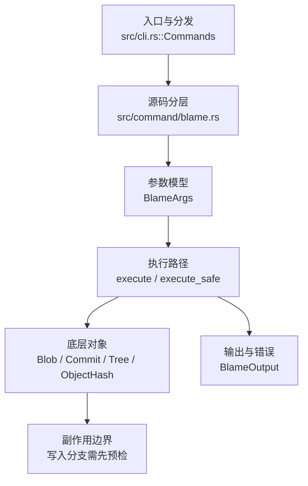

# `libra blame` 开发设计

## 命令实现目标

`libra blame` 的目标是按行展示文件内容的最近修改提交、作者和时间信息。实现需要支持常用显示字段（`-l`/`-s`/`-t`/`--abbrev`/`-e`）、porcelain 输出和行号范围等兼容面，空白忽略（`-w`，ignore-all-whitespace）也已支持，同时把移动/复制检测、反向 blame、incremental 等高阶能力列为后续工作（当前 HEAD 未实现）。

## 对比 Git 与兼容性

- 兼容级别：`partial`。基础文件 blame、`-L` 行范围（数字、`START,END`、`START,+COUNT`，以及 `/regex/` start/end 端点；单端点跨到文件末尾，与 git 一致）、`--porcelain`/`-p`/`--line-porcelain`、`-e`/`--show-email`、显示标志 `-l`（完整 hash）/`-s`（隐藏作者与日期）/`-t`（原始时间戳）/`-f`（`--show-name`，在 hash 后显示文件名）/`--abbrev <n>`、`--root`（接受式 no-op：Libra 从不给边界/root 提交加 `^` 前缀）、`-w`/`--ignore-whitespace`（ignore-all-whitespace 行归属）已支持；`-L :<funcname>`、reverse、incremental 和 copy/move detection 尚未公开。

- 当前矩阵承诺常用 Git 行为已支持；新增语义必须同步矩阵、用户文档和测试。

## 设计方案

- 入口与分发：已公开接入 `src/cli.rs::Commands`；已由 `src/command/mod.rs` 导出。CLI 层在 `src/cli.rs` 把解析后的参数交给命令模块，命令模块负责把领域错误转换为 `CliError` / `CliResult`。
- 源码分层：主要实现文件为 `src/command/blame.rs`。参数/子命令类型包括：`BlameArgs`；输出、错误或状态类型包括：`BlameOutput`；主要执行函数包括：`execute`、`execute_safe`。
- 执行路径：`execute_safe` 负责 CLI 安全包装、错误映射和输出配置；对象路径会解析 revision 并读写 blob/tree/commit/tag 等对象。

- 流程图：以下流程图按当前源码分层展示主路径和底层对象边界，便于维护者把代码入口、执行函数和副作用范围对应起来。

- 底层操作对象：`Blob`（文件内容或 LFS pointer 写入对象库后的 blob 对象）；`Commit`（提交对象、父提交关系和提交消息载荷）；`Tree`（由索引或对象遍历生成的目录树对象）；`ObjectHash`（SHA-1/SHA-256 对象 ID 和 revision 解析结果）
- 输出与错误契约：人类输出、`--json` / `--machine` 输出和 quiet/verbose 分支必须继续走现有 `OutputConfig` / `emit_json_data` / `CliError` 路径；新增失败模式要补稳定错误码、用户提示和回归测试。
- 副作用边界：凡是写入索引、对象库、refs/HEAD、reflog、SQLite/D1、工作树或远端的路径，都必须先完成参数校验和 dry-run/预检分支，再执行持久化，避免部分写入后静默成功。

## 实现历史

- 本节依据本地 main 分支提交历史重写，筛选与该命令实现、测试或文档路径直接相关的提交；以下是归纳后的实现脉络。
- 2025-11-29 `4a66aa45`（`feat(blame, diff): add blame support, bump the git-internal version (#70)`）：基础实现节点：add blame support, bump the git-internal version (#70)；当前实现的主要轮廓可追溯到该提交。
- 2026-06-03 `1d055f9e`（`feat(blame): add ignore-whitespace (-w) attribution and BFS early-exit (v0.17.1290)`）：功能演进：add ignore-whitespace (-w) attribution and BFS early-exit (v0.17.1290)；该提交引入的 `-w` / ignore-whitespace 曾被回退，现已在当前 HEAD 重新实现（`BlameArgs.ignore_whitespace` + `normalize_for_whitespace`），与缺口表“✅ 已实现”一致。
- 2026-06-03 `e377e0a6`（`feat(blame): implement porcelain/-p output and clamp overlong -L end with checked arithmetic (v0.17.1289)`）：功能演进：implement porcelain/-p output and clamp overlong -L end with checked arithmetic (v0.17.1289)；porcelain / `-p` 输出当前 HEAD 已实现（`BlameArgs.porcelain`/`line_porcelain` + `execute_safe` 渲染），与缺口表“✅ 已实现（部分）porcelain 格式”一致。
- 2026-06-04 `a0e349a9`（`fix: align blame and bisect compatibility`）：实现修正：align blame and bisect compatibility；该节点把边界行为、错误处理或兼容差异纳入当前实现约束。
- 历史结论：当前文档应以这些提交之后的代码、测试和兼容矩阵为准；更早的迁移式文档只保留为背景，不再作为事实来源。

## 当前状态

- 公开状态：已公开；模块状态：已导出。
- 用户文档：`docs/commands/blame.md`。
- Synopsis：`libra blame <file> [<commit>] [-L <range>] [-f] [--root] [-w]`。
- 公开参数/子命令包括：`<FILE>`、`[<COMMIT>]`、`-L <RANGE>`（数字 `N`/`START,END`/`START,+COUNT` 与 `/regex/` start/end 端点；单端点跨到文件末尾）、`--porcelain`/`-p`、`--line-porcelain`、`-e`/`--show-email`、`-l`、`-s`、`-t`、`--abbrev <N>`、`-f`/`--show-name`（在 hash 列后插入文件名；`name_col` 仅作用于人类格式的 `-s` 与默认两条输出路径，不影响 porcelain——porcelain 已有 `filename` 行；Libra 不跟踪 rename/copy，故每行都是被 blame 的文件）、`--root`（接受式 no-op：字段 `root` 解析后不被读取；Libra 的 blame 从不给边界/root 提交加 `^` 前缀，故 `--root` 请求的“root 按普通提交显示”已是默认行为）、`-w`/`--ignore-whitespace`（比较父子版本时去除全部空白，仅空白变更的行归属到更早提交；`normalize_for_whitespace` 仅作用于比较键，显示仍用原始行）。
- `-l`/`-s`/`-t`/`--abbrev <N>`（默认人类格式的显示标志，复用现有 `BlameLine` 字段）：`-l` 在每行行首打印完整提交 hash（取代缩写）；`--abbrev=<n>` 用 n 位 hex 缩写（`-l` 优先于 `--abbrev`）；`-s` 整列隐藏作者与日期，仅保留 `<hash> <line>) <content>`；`-t` 在日期列打印原始 author 时间戳（epoch 秒）取代本地化日期。`BlameLine` 现额外序列化 `timestamp`（JSON 加项）。这些标志只影响默认人类格式，不影响 porcelain。
- `-e`/`--show-email`：默认人类输出中以 `<email>` 形式显示作者邮箱代替作者名；与作者名共用固定 15 列宽（过长按 12 + `...` 截断，属与 Git 动态列宽的既有有意差异）。仅影响默认格式，不影响 `--porcelain`（其本身已含 `author-mail`）。`BlameLine` 现额外序列化 `author_email`（JSON 加项）。
- `--porcelain`/`--line-porcelain`：机器可读输出，每行先打印 `<sha> <orig> <final> [<group>]` 头部，再（`--porcelain` 每个提交一次、`--line-porcelain` 每行）打印 author/author-mail/author-time/author-tz/committer*/summary/filename 元数据块，最后是 `\t<content>`。元数据通过重新加载归属提交读取。**有意差异/限制**：blame 遍历不跟踪每提交的原始行号，`<orig>` 以 `<final>` 近似。

## 还未实现的功能

| 类别 | 未完成项 | 当前处理 |
|---|---|---|
| ✅ 已实现 | `-L /regex/` 正则行范围 | start/end 均支持 `/regex/`（start 从文件首行搜索、end 从 start 行起搜索首个匹配），与数字 / `+COUNT` 自由组合；单端点 `-L <n>` 或 `-L /regex/` 现在跨到文件末尾（与 git 一致，而非仅单行）；无匹配按 `LBR-CLI-002`/退出 129 报错。`split_line_range_tokens` 处理可含逗号与 `\/` 转义的 `/regex/` start；`resolve_start_endpoint`/`resolve_end_endpoint` 用 `regex` crate 解析。带集成测试 `test_blame_regex_line_range`。 |
| 兼容差异项 | `-L :<funcname>` 函数名行范围 | 原始对照：git `-L :<funcname>:<file>`；当前说明：尚未实现（需 funcname 语言识别）。 后续实现时需要补对应回归测试并同步兼容矩阵。 |
| 兼容差异项 | 反向 blame | 原始对照：不支持；相关参数/替代：--reverse；当前说明：不适用。 后续实现时需要补对应回归测试并同步兼容矩阵。 |
| ✅ 已实现 | 显示邮箱 `-e`/`--show-email` | 默认输出以 `<email>` 显示作者邮箱代替作者名（仅人类格式；porcelain 不受影响）。带集成测试（`test_blame_show_email_displays_author_email`）。 |
| ✅ 已实现 | 显示标志 `-l`/`-s`/`-t`/`-f`/`--abbrev`/`-p` | `-l` 完整 hash；`--abbrev=<n>` n 位缩写（`-l` 优先）；`-s` 隐藏作者/日期列；`-t` 原始 epoch 时间戳；`-f`/`--show-name` 在 hash 后插入文件名（人类格式两条路径；Libra 不跟踪 rename，每行同名）；`-p` 为 `--porcelain` 短别名。复用现有 `BlameLine` 字段（新增 `timestamp` JSON 项）；仅人类格式。带集成测试（`test_blame_display_flags_long_suppress_timestamp_abbrev`、`test_blame_show_name_flag_prints_filename`）。 |
| ✅ 已实现（部分） | porcelain 格式 | `--porcelain`/`--line-porcelain` 已支持（重新加载提交取元数据；带集成测试）。限制：`<orig>` 原始行号以 `<final>` 近似（blame 遍历未跟踪每提交原始行号），未输出 `boundary`/`previous` 行。 |
| ✅ 已实现 | 忽略空白 `-w`/`--ignore-whitespace` | 比较父子两版行时忽略全部空白（git `-w` 即 ignore-all-whitespace 语义）：仅空白变更的行归属到更早的提交。`normalize_for_whitespace` 去除所有空白字符，仅用于 `compute_diff` 输入与 `Equal` 块的内容比较键，原始行内容保留用于显示。带集成测试 `test_blame_ignore_whitespace_attributes_to_older_commit`。 |
| 兼容差异项 | 增量输出 | 原始对照：不支持；相关参数/替代：--incremental；当前说明：不适用。 后续实现时需要补对应回归测试并同步兼容矩阵。 |
| 兼容差异项 | 相似度阈值 | 原始对照：不支持；相关参数/替代：-M / -C (move/copy detection)；当前说明：不适用。 后续实现时需要补对应回归测试并同步兼容矩阵。 |

## 维护要求

- 改进本命令前，必须先阅读并遵循 [docs/development/commands/_general.md](_general.md)；这是命令设计、实现、测试和文档同步的强制要求。
- 任何行为变更都要先核对实现源码，再同步 `COMPATIBILITY.md`、`docs/commands/<cmd>.md` 和相关测试。
- 新增 Git 兼容参数时必须明确 tier、错误码、JSON/机器输出契约和回归测试。
