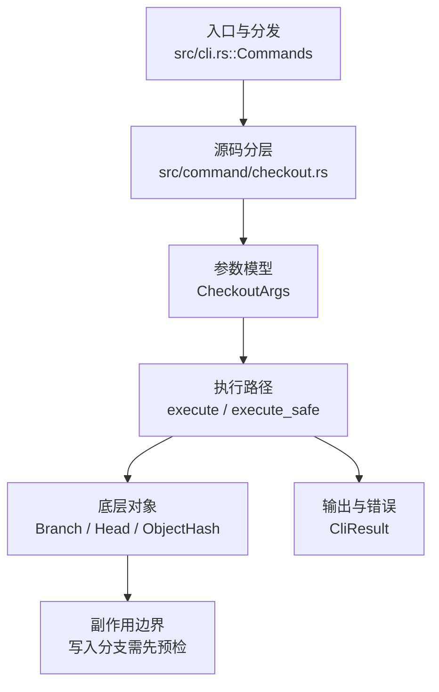

# `libra checkout` 开发设计

## 命令实现目标

`libra checkout` 的目标是保留 Git 兼容入口，同时把分支切换和文件恢复分别引导到 `switch` 与 `restore` 的清晰模型。当前实现覆盖分支切换、`-b <name> [<start-point>]` 创建并切换、`-B <name> [<start-point>]` 强制创建/重置并切换、`checkout <commit>` detached HEAD，以及 `checkout -- <path>` 恢复别名。

## 对比 Git 与兼容性

- 兼容级别：`partial`。visible branch compatibility surface plus `checkout <commit>` / `-d`/`--detach` detached HEAD, `-b`/`-B <branch> [<start-point>]` branch creation/reset that leaves `HEAD` symbolic on the target branch, `-t`/`--track` (accepted no-op; Libra always DWIM-tracks remote-tracking checkouts), and explicit `checkout -- <path>` restoration alias; prefer `switch` / `restore` for new code; patch modes still partial

- 当前矩阵明确仍是部分兼容；未覆盖的 Git surface 必须显式列在“还未实现的功能”。

## 设计方案

- 入口与分发：已公开接入 `src/cli.rs::Commands`；已由 `src/command/mod.rs` 导出。CLI 层在 `src/cli.rs` 把解析后的参数交给命令模块，命令模块负责把领域错误转换为 `CliError` / `CliResult`。
- 源码分层：主要实现文件为 `src/command/checkout.rs`。参数/子命令类型包括：`CheckoutArgs`；输出、错误或状态类型包括：`CheckoutOutput`、`CheckoutTrackingOutput`、`CheckoutError`（经 `From<CheckoutError> for CliError` 映射到稳定错误码）；主要执行函数包括：`execute`、`execute_safe`、`run_checkout`、`render_checkout_output`。
- 执行路径：`execute_safe` 负责 CLI 安全包装、错误映射和输出配置；对象路径会解析 revision 并读写 blob/tree/commit/tag 等对象；引用路径会读取或更新 SQLite refs、HEAD 与 reflog。

- 流程图：以下流程图按当前源码分层展示主路径和底层对象边界，便于维护者把代码入口、执行函数和副作用范围对应起来。

- 底层操作对象：`Branch` / branch store（SQLite refs 上的分支读写、过滤和上游关系）；`Head`（SQLite 中的 HEAD 指向、当前分支和 detached 状态）；`ObjectHash`（SHA-1/SHA-256 对象 ID 和 revision 解析结果）
- 输出与错误契约：人类输出、`--json` / `--machine` 输出和 quiet/verbose 分支必须继续走现有 `OutputConfig` / `emit_json_data` / `CliError` 路径；新增失败模式要补稳定错误码、用户提示和回归测试。
- 副作用边界：凡是写入索引、对象库、refs/HEAD、reflog、SQLite/D1、工作树或远端的路径，都必须先完成参数校验和 dry-run/预检分支，再执行持久化，避免部分写入后静默成功。

## 实现历史

- 本节依据本地 main 分支提交历史重写，筛选与该命令实现、测试或文档路径直接相关的提交；以下是归纳后的实现脉络。
- 2026-05-17 `d11ed7ca`（`feat(checkout): complete CheckoutError typed enum + remote proxy error layering`）：基础实现节点：complete CheckoutError typed enum + remote proxy error layering；当前实现的主要轮廓可追溯到该提交。
- 2026-06-04 `b00c9532`（`feat(checkout): implement --ours, --theirs conflict path checkout and --force switch (v0.17.1304)`）：功能演进：implement --ours, --theirs conflict path checkout and --force switch (v0.17.1304)；该节点扩展了当前命令可用的参数或行为。
- 2026-06-04 `c7e090d7`（`feat(checkout): support -B, --detach, and --orphan branch checkout modes (v0.17.1303)`）：功能演进：support -B, --detach, and --orphan branch checkout modes (v0.17.1303)；该节点扩展了当前命令可用的参数或行为。
- 2026-06-04 `092371f0`（`fix(checkout): use exists_result for --orphan name collision (catch unborn refs) (v0.17.1308)`）：实现修正：use exists_result for --orphan name collision (catch unborn refs) (v0.17.1308)；该节点把边界行为、错误处理或兼容差异纳入当前实现约束。
- 2026-06-04 `5bac3d88`（`docs(checkout): document -B/--detach/--orphan/--ours/--theirs and pass compat guards (v0.17.1306)`）：文档与兼容口径：document -B/--detach/--orphan/--ours/--theirs and pass compat guards (v0.17.1306)；当前文档按该节点之后的实现状态校准。
- 2026-07-09（plan-20260708 P0-04）：源码核对确认 `checkout -b/-B <branch> <start-point>` 曾把 start-point 当作普通 checkout target 走 detached 路径；当前实现先解析 start-point、预检工作树，再创建/重置分支并切换到该 symbolic branch。回归守卫：`compat_checkout_branch_startpoint`。
- 历史结论：当前文档应以这些提交之后的代码、测试和兼容矩阵为准；更早的迁移式文档只保留为背景，不再作为事实来源。当前源码已公开 `[<branch>]`、`-b <new_branch> [<start-point>]`、`-B <new_branch> [<start-point>]`、`checkout <commit>` / `-d`/`--detach` detached HEAD 与 `-- <pathspec>`。

## 当前状态

- 公开状态：已公开；模块状态：已导出。
- 用户文档：`docs/commands/checkout.md`。
- Synopsis：`libra checkout [-b <new_branch> [<start-point>]] [-B <new_branch> [<start-point>]] [-t] [--ignore-other-worktrees] [--no-progress] [--no-overlay] [<branch>] [-- <pathspec>...]`。
- 公开参数/子命令包括：`[<branch>]`、`-b <new_branch> [<start-point>]`、`-B <new_branch> [<start-point>]`、`-f, --force`、`-d, --detach`、`-t, --track`、`--ignore-other-worktrees`（实际 bypass：`switch_branch_with_output` 默认拒绝切到另一个 linked worktree 已 checkout 的共享分支；该标志把 `ignore_other_worktrees` 传入分支切换路径并跳过该保护）、`--no-progress`（接受式 no-op：Libra 的 checkout 从不渲染进度条；字段 `no_progress` 解析后不被读取）、`--no-overlay`（接受式 no-op：Libra 的 checkout 从不处于 overlay 模式，已是 Git 默认；字段 `no_overlay` 解析后不被读取。Git 的反向 `--overlay` 未实现）、`-- <pathspec>...`。`-b` / `-B` 先解析可选 start-point（提交、标签或分支）并完成工作树预检，成功后 `HEAD` 必须是 `refs/heads/<new_branch>`；无效 start-point 或预检失败不会移动 `HEAD`。`-d`/`--detach` 让分支名也走 detached 路径：`checkout --detach <branch>` 在该分支的提交处 detach HEAD（而非切换到分支），复用现有 `checkout_detached`；同时跳过 "already-on" 短路（`--detach <当前分支>` 仍会 detach）。`-t`/`--track` 为接受式 no-op：Libra 在 checkout 远程跟踪分支时本就通过 DWIM 配置 upstream（`set_upstream_safe_with_output`，action `track`），故 `--track` 请求的正是已有行为；对非远程目标无效果（与 Git 严格语义略有差异）；独立显式跟踪请用 `switch --track`。
- `-f`/`--force`：在工作树/索引与 HEAD 有差异时仍切换，丢弃对**已跟踪**文件的本地修改（由 `restore_to_commit` 覆盖写回目标内容）。**有意安全差异**：即使带 `-f` 也仍拒绝覆盖会被目标分支写入的**未跟踪**文件（独立调用 `switch::ensure_no_untracked_overwrite`，避免静默丢失未跟踪数据），返回 128。

## 还未实现的功能

| 类别 | 未完成项 | 当前处理 |
|---|---|---|
| 兼容矩阵说明 | visible branch compatibility surface plus `checkout <commit>` / `-d`/`--detach` detached HEAD, `-b`/`-B` branch creation, `-t`/`--track` (accepted no-op; Libra always DWIM-tracks remote-tracking checkouts), and explicit `checkout -- <path>` restoration alias; prefer `switch` / `restore` for new code; patch modes still partial | 按当前兼容矩阵保留；实现状态变化时同步 `_compatibility.md` 和测试证据。 |
| 兼容差异项 | Patch mode | 原始对照：`checkout -p`；相关参数/替代：不支持 (use libra restore)；当前说明：按全局 D15 延后/拒绝。 后续实现时需要补对应回归测试并同步兼容矩阵。 |

## 维护要求

- 改进本命令前，必须先阅读并遵循 [docs/development/commands/_general.md](_general.md)；这是命令设计、实现、测试和文档同步的强制要求。
- 任何行为变更都要先核对实现源码，再同步 `COMPATIBILITY.md`、`docs/commands/<cmd>.md` 和相关测试。
- 新增 Git 兼容参数时必须明确 tier、错误码、JSON/机器输出契约和回归测试。
