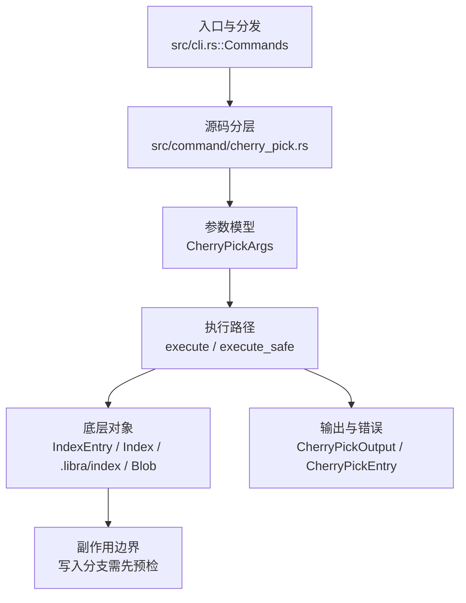

# `libra cherry-pick` 开发设计

## 命令实现目标

`libra cherry-pick` 的目标是把一个或多个已有提交引入当前分支。当前实现支持按顺序重放多个提交、`-n, --no-commit`（暂存而不自动提交，已支持多提交）、`-x`、`-s/--signoff`、`-e/--edit`、`-m/--mainline <n>`、`--ff`、`-S/--gpg-sign`、空提交策略、`--cleanup=<mode>`，以及可重复且 last-wins 的 `-X/--strategy-option ours|theirs`。`-X` 复用 merge 的 hunk resolver，只偏向真正冲突 region，保留同文件 clean hunk；add/add 与 modify/delete 选择整侧。有效值经 `CherryPickOpts.strategy_option` 随统一 `sequence_state` 持久化。自动提交保留源 author metadata，committer 取当前身份；消息先去签名。未解决冲突写 index stage 1/2/3 与工作树标记，并支持 `--continue`/`--skip`/`--abort`/`--quit` 及跨操作对称 mutex。自定义 `--strategy` 仍显式拒绝；`--rerere-autoupdate` 在 rerere 启用时生效。

## 对比 Git 与兼容性

- 兼容级别：`partial`。提交 replay、消息/空提交控制、`-X ours/theirs` 与 sequencer 已支持；`-X` 可重复且最后一个值生效，modify/modify 只偏向冲突 hunk，add/add 与 modify/delete 选择整侧。自定义 `--strategy <name>` 仍未实现。

- 当前矩阵承诺常用 Git 行为已支持；新增语义必须同步矩阵、用户文档和测试。

## 设计方案

- 入口与分发：已公开接入 `src/cli.rs::Commands`；已由 `src/command/mod.rs` 导出。CLI 层在 `src/cli.rs` 把解析后的参数交给命令模块，命令模块负责把领域错误转换为 `CliError` / `CliResult`。
- 源码分层：主要实现文件为 `src/command/cherry_pick.rs`。参数/子命令类型包括：`CherryPickArgs`；输出、错误或状态类型包括：`CherryPickOutput`、`CherryPickEntry`；主要执行函数包括：`execute`、`execute_safe`。
- 执行路径：`execute_safe` 负责 CLI 安全包装、错误映射和输出配置；索引路径会加载、比较、刷新或保存 `.libra/index`；对象路径会解析 revision 并读写 blob/tree/commit/tag 等对象；引用路径会读取或更新 SQLite refs、HEAD 与 reflog；数据库路径会通过 SeaORM/SQLite 或 D1 客户端持久化元数据。

- 流程图：以下流程图按当前源码分层展示主路径和底层对象边界，便于维护者把代码入口、执行函数和副作用范围对应起来。

- 底层操作对象：`IndexEntry`（索引条目，承载路径、mode、object id 和 stat 元数据）；`Index` / `.libra/index`（暂存区状态、路径条目和刷新/保存边界）；`Blob`（文件内容或 LFS pointer 写入对象库后的 blob 对象）；`Commit`（提交对象、父提交关系和提交消息载荷）；`TreeItem` / `TreeItemMode`（tree 中的路径项和 mode）；`Tree`（由索引或对象遍历生成的目录树对象）；`Branch` / branch store（SQLite refs 上的分支读写、过滤和上游关系）；`Head`（SQLite 中的 HEAD 指向、当前分支和 detached 状态）；`ReflogContext` / `with_reflog`（SQLite reflog 写入和动作记录）；SeaORM / `.libra/libra.db`（配置、refs、reflog、AI/发布元数据等 SQLite 表）；`ObjectHash`（SHA-1/SHA-256 对象 ID 和 revision 解析结果）；`ObjectType`（blob/tree/commit/tag 类型分派）
- 输出与错误契约：人类输出、`--json` / `--machine` 输出和 quiet/verbose 分支必须继续走现有 `OutputConfig` / `emit_json_data` / `CliError` 路径；新增失败模式要补稳定错误码、用户提示和回归测试。
- 副作用边界：凡是写入索引、对象库、refs/HEAD、reflog、SQLite/D1、工作树或远端的路径，都必须先完成参数校验和 dry-run/预检分支，再执行持久化，避免部分写入后静默成功。

## 实现历史

- 本节依据本地 main 分支提交历史重写，筛选与该命令实现、测试或文档路径直接相关的提交；以下是归纳后的实现脉络。
- 2026-06-04 `c0268ec9`（`feat(cherry-pick): add -x/-s/-e and allow-empty flags, lift multi-commit no-commit restriction (v0.17.1309)`）：引入 `-x`/`-s`/`-e`、空提交策略与多提交 no-commit 放宽。
- 2026-06-04 `9b95d8f4`（`feat(cherry-pick): add cherry_pick_state SQLite sequencer table and CherryPickState facade (v0.17.1310)`）：新增 `cherry_pick_state` 迁移表与 `CherryPickState` 原生 SQL facade（无 sea-orm entity）。
- 2026-06-04 `bd5f8c4d`（`feat(cherry-pick): persist conflict sequencer in SQLite for continue/skip/abort/quit (v0.17.1311)`）：落地 sequencer 运行时（continue/skip/abort/quit、三方冲突持久化、merge/rebase 互斥）。
- 2026-06-04 `f3d4a180`（`feat(cherry-pick): support -m mainline for merge commits, --ff fast-forward, reject unsupported strategies (v0.17.1312)`）：新增 `-m mainline`/`--ff` 并显式拒绝不支持的策略。
- 2026-06-04 `b9c7d575`（`fix(cherry-pick): keep sequencer state accurate when a resumed pick hard-errors mid-sequence (v0.17.1316)`）：修正 resume 期间非冲突硬错误后的 sequencer 状态准确性。
- 2026-06-18 恢复（reconcile 丢失补回）：一次纠缠的 reconcile 在保留提交消息的同时丢弃了上述提交的内容（model/facade、sequencer 运行时与 `-m`/`--ff`/`-s`/`-e`/`--allow-empty` 等参数）。本次针对当前已发散的代码重新恢复：迁移表本就存在，`CherryPickState` facade 为 `cherry_pick.rs` 内的原生 SQL（无 sea-orm entity）；`-s`/`-e` 改用本地内联 helper（`util::create_signatures` + `core.editor`/`$VISUAL`/`$EDITOR`），`-S` 复用 `commit::vault_sign_commit`（新增 `force` 形参）。
- 历史结论：上述 `-s`/`-e`、`-m mainline`、`--ff`、`-S`、空提交策略、多提交 no-commit 放宽与 SQLite sequencer（continue/skip/abort/quit）在当前 HEAD 全部可用。文档以现行代码、测试和兼容矩阵为准。

## 当前状态

- 公开状态：已公开；模块状态：已导出。
- 用户文档：`docs/commands/cherry-pick.md`。
- Synopsis：`libra cherry-pick ... [-X <ours|theirs>] [--cleanup=<mode>] <commit>...` 或 `libra cherry-pick (--continue|--skip|--abort|--quit)`。
- 公开参数在既有 surface 上新增 `-X/--strategy-option <ours|theirs>`（可重复，last-wins）；其余包括消息/空提交控制、sequencer 控制、JSON 与 quiet。

## 还未实现的功能

| 类别 | 未完成项 | 当前处理 |
|---|---|---|
| 兼容差异项 | 自定义合并策略 | 原始对照：--strategy <s>；相关参数/替代：单一内置三方合并；当前说明：显式拒绝（LBR-UNSUPPORTED-001 / 128）。后续实现时需要补对应回归测试并同步兼容矩阵。 |
| ✅ 已实现 | 策略选项 | `-X/--strategy-option ours|theirs` 可重复且 last-wins；共享 `merge::merge_bytes_with_favor` 仅选择冲突 hunk，clean hunk 保留；整路径冲突选择对应侧；`CherryPickOpts` round-trip；`compat_noninteractive_history_controls::cherry_pick_strategy_option_is_hunk_level_and_last_wins` 固定 tree 与 parent。 |
| ✅ 已实现 | 空提交模式 | 原始对照：`--empty=<how>`；当前说明：`--empty=stop`（默认，halt）/`drop`（跳过冗余提交，HEAD 不前进，打印 `dropping <sha> <subject> -- patch contents already upstream`）/`keep`（保留空提交，等价 `--keep-redundant-commits`）已支持。`effective_empty_mode`：`--empty` 优先，否则 `--keep-redundant-commits`→keep，缺省→stop。在任何 sequencer 分发之前校验（非法 mode → `invalid value for '--empty'`，`LBR-CLI-002`/退出 129，与 `--cleanup` 同样早校验），随 `CherryPickOpts.empty` round-trip 到 `--continue`/`--skip`。`PickOutcome{Committed,Staged,Dropped}` + `PickAccumulator{picked,dropped}` 驱动主循环与 `resume_picks`；`drop` 的 subject 经 `parse_commit_msg` 去签名取首行。带集成测试 `test_cherry_pick_empty_modes`。 |
| ✅ 已实现 | 消息清理 `--cleanup=<mode>` | 已公开：`strip`/`whitespace`/`verbatim`/`scissors`/`default`，复用 commit 的 `parse_cleanup_mode` + `cleanup_commit_message`（已改为 `pub(crate)`）。`build_cherry_pick_message` 先清理被 pick 的正文（`-e` 时再清理编辑后的缓冲），再追加 `-x`/`Signed-off-by` trailer，从而不会塌陷 trailer 分隔空行；仅在显式给出时生效（默认仍为 trim，行为不变）。无 editor 时 `default`/`scissors` 回退为 `whitespace`（同 commit / git 的“若消息将被编辑”语义）。mode 在 sequencer 控制分发之前即校验，非法值报 `InvalidCleanup` → `LBR-CLI-002`/退出 129（`--continue --cleanup=bogus` 亦快速失败）。通过 `CherryPickOpts.cleanup`（原始字符串）round-trip 到 `--continue`/`--skip`。带集成测试 `cherry_pick_cleanup_strip_then_verbatim`、`cherry_pick_cleanup_survives_conflict_resume`、`cherry_pick_invalid_cleanup_mode_rejected` 与单元 round-trip 守卫。 |
| 兼容差异项 | rerere 自动更新 | 原始对照：--rerere-autoupdate；相关参数/替代：不适用；当前说明：显式拒绝（LBR-UNSUPPORTED-001 / 128）。后续实现时需要补对应回归测试并同步兼容矩阵。 |
| ✅ 已实现 | 行级冲突 hunk | 原始对照：Git 行级三方合并；当前说明：modify/modify 冲突经共享的 `merge::render_line_level_conflict`（`diffy` `ConflictStyle::Merge` + 把 `ours`/`theirs` 标签重写为 `HEAD`/被 pick 提交缩写）以行级 hunk 呈现——仅发散行包在 `<<<<<<<`/`=======`/`>>>>>>>` 之间，共享上下文留在标记外，与 Git 一致；删除/修改（某侧缺失）或二进制内容回退整文件 `whole_file_conflict`。该 helper 同时被 merge/pull 复用（revert/restore 另有各自的整文件实现，不走此路径）。Git 兼容配置 `merge.conflictStyle` 同样被尊重（`diff3` 额外输出 `||||||| base` 祖先块；经 `merge::conflict_style_from_config` 解析，非法值报错、绝不静默回落——与 `libra merge` 一致，带集成测试 `cherry_pick_conflict_honors_diff3_style`）。`base_hash` 经冲突元组 `ConflictEntry` 透传以喂给三方合并。带集成测试 `cherry_pick_conflict_is_line_level`。 |
| ✅ 已实现 | P0-08 author/message 保真 | `create_cherry_pick_commit` 使用 `original_commit.author.clone()` 作为新提交 author，committer 走 `commit::create_committer_signature`（含 `GIT_COMMITTER_DATE`）；`build_cherry_pick_message` 对源消息调用 `parse_commit_msg` 后再 cleanup/trailer。带 compat 测试 `compat_sequencer_message_author::cherry_pick_preserves_original_author_and_uses_current_committer`。 |

## 维护要求

- 改进本命令前，必须先阅读并遵循 [docs/development/commands/_general.md](_general.md)；这是命令设计、实现、测试和文档同步的强制要求。
- 任何行为变更都要先核对实现源码，再同步 `COMPATIBILITY.md`、`docs/commands/<cmd>.md` 和相关测试。
- 新增 Git 兼容参数时必须明确 tier、错误码、JSON/机器输出契约和回归测试。
