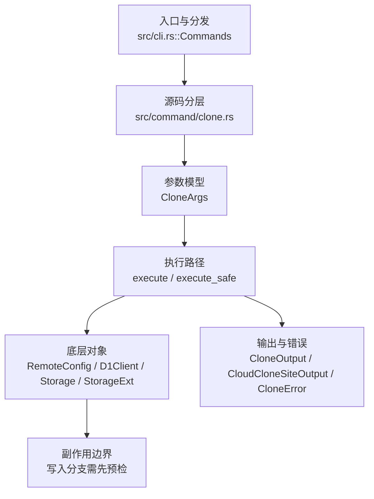

# `libra clone` 开发设计

## 命令实现目标

`libra clone` 的目标是从本地、SSH、HTTPS 或 Libra cloud 来源创建新仓库，并初始化对象、refs、配置和工作区。当前实现覆盖浅克隆（`--depth`）、单分支克隆（`--single-branch`）、裸仓库（`--bare`）、分支检出（`-b/--branch`）、URL 脱敏和安全边界检查，同时明确子模块与 sparse checkout 的延后决策；origin 命名 `-o`、引用仓库 `--reference`/`--shared`/`--dissociate`、镜像 `--mirror`、以及局部克隆过滤 `--filter` 与浅历史 `--shallow-since`/`--shallow-exclude`（接受式 no-op，见下）均已处理。

## 对比 Git 与兼容性

- 兼容级别：`partial`。`--depth`、`--single-branch`/`--no-single-branch`（toggle，`--no-single-branch` 撤销 `--single-branch`，last-wins，默认克隆所有分支故单独为 no-op）、`--no-checkout`（克隆后不检出 HEAD 到工作区，仍设置 objects/refs/HEAD）、`-o`/`--origin <NAME>`（标准克隆用 NAME 命名远端及 `refs/remotes/<NAME>/*`，取代默认 `origin`；libra+cloud 克隆仍用 `origin`）supported; `--sparse` unsupported (see [docs/development/commands/_compatibility.md#d10-clone---sparse-与顶层-sparse-checkout-命令](docs/development/commands/_compatibility.md#d10-clone---sparse-与顶层-sparse-checkout-命令)); `--recurse-submodules` unsupported (see [docs/development/commands/_compatibility.md#d4-clone---recurse-submodules](docs/development/commands/_compatibility.md#d4-clone---recurse-submodules))

- 当前矩阵明确仍是部分兼容；未覆盖的 Git surface 必须显式列在“还未实现的功能”。

## 设计方案

- 入口与分发：已公开接入 `src/cli.rs::Commands`；已由 `src/command/mod.rs` 导出。CLI 层在 `src/cli.rs` 把解析后的参数交给命令模块，命令模块负责把领域错误转换为 `CliError` / `CliResult`。
- 源码分层：主要实现文件为 `src/command/clone.rs`。参数/子命令类型包括：`CloneArgs`；输出、错误或状态类型包括：`CloneOutput`、`CloudCloneSiteOutput`、`CloneError`；主要执行函数包括：`execute`、`execute_safe`。
- 源码意图：源码模块注释说明该命令会解析 URL、通过协议客户端获取对象、检出工作树，并写入初始 refs/config；执行层生成 `CloneOutput`，渲染层按 `OutputConfig` 输出。
- 执行路径：`execute_safe` 负责 CLI 安全包装、错误映射和输出配置；对象路径会解析 revision 并读写 blob/tree/commit/tag 等对象；引用路径会读取或更新 SQLite refs、HEAD 与 reflog；网络路径会解析 remote 配置、协商协议并处理 pack/idx 数据；数据库路径会通过 SeaORM/SQLite 或 D1 客户端持久化元数据。

- 流程图：以下流程图按当前源码分层展示主路径和底层对象边界，便于维护者把代码入口、执行函数和副作用范围对应起来。

- 底层操作对象：`RemoteConfig`（remote URL、refspec 和凭据配置）；pack / idx 对象（传输包、索引、delta 和完整性校验）；`D1Client`（Cloudflare D1 元数据读写）；`Storage` / `StorageExt`（对象存储抽象，覆盖本地、remote 和 publish 存储）；SeaORM / `.libra/libra.db`（配置、refs、reflog、AI/发布元数据等 SQLite 表）；`Branch` / branch store（SQLite refs 上的分支读写、过滤和上游关系）；`Head`（SQLite 中的 HEAD 指向、当前分支和 detached 状态）；`Tree`（由索引或对象遍历生成的目录树对象）；`Commit`（提交对象、父提交关系和提交消息载荷）；`Blob`（文件内容或 LFS pointer 写入对象库后的 blob 对象）；`TreeItem` / `TreeItemMode`（tree 中的路径项和 mode）；`ReflogContext` / `with_reflog`（SQLite reflog 写入和动作记录）
- 输出与错误契约：人类输出、`--json` / `--machine` 输出和 quiet/verbose 分支必须继续走现有 `OutputConfig` / `emit_json_data` / `CliError` 路径；新增失败模式要补稳定错误码、用户提示和回归测试。
- 副作用边界：凡是写入索引、对象库、refs/HEAD、reflog、SQLite/D1、工作树或远端的路径，都必须先完成参数校验和 dry-run/预检分支，再执行持久化，避免部分写入后静默成功。

## 实现历史

- 本节依据本地 main 分支提交历史重写，筛选与该命令实现、测试或文档路径直接相关的提交；以下是归纳后的实现脉络。
- 2026-01-25 `3703bfab`（`feat(clone): add --depth parameter for shallow clone (#165)`）：基础实现节点：add --depth parameter for shallow clone (#165)；当前实现的主要轮廓可追溯到该提交。
- 2026-06-04 `98e5f47b`（`feat(clone): atomic remote/branch config write and credential redaction`）：功能演进：atomic remote/branch config write and credential redaction；该节点扩展了当前命令可用的参数或行为。
- 2026-06-04 `d03e2902`（`feat(clone): add --filter partial clone with promisor config`）：该提交曾引入**真正的** `--filter` partial clone 与 promisor 配置，但随后被回退。**当前 `CloneArgs` 重新加入了 `filter` 字段，但作为接受式 no-op**（libra 无 partial-clone/promisor 支持 → 忽略 + 告警、不应用该优化、仅按 `--depth` 限定；云端拒绝），而非真正的 partial clone；clone.rs 仍无 promisor 逻辑。详见下方“还未实现的功能”缺口表中 `--filter`/`--shallow-since`/`--shallow-exclude` 的 ✅ no-op 行。
- 2026-06-07 `38e31be2`（`fix(clone): close compatibility plan gaps`）：实现修正：close compatibility plan gaps；该节点把边界行为、错误处理或兼容差异纳入当前实现约束。
- 历史结论：当前文档应以这些提交之后的代码、测试和兼容矩阵为准；更早的迁移式文档只保留为背景，不再作为事实来源。

## 当前状态

- 公开状态：已公开；模块状态：已导出。
- 用户文档：`docs/commands/clone.md`。
- Synopsis：`libra clone [OPTIONS] <REMOTE_REPO> [LOCAL_PATH]`。
- 公开参数/子命令包括：`<REMOTE_REPO>` (required)、`[LOCAL_PATH]`、`-b, --branch <BRANCH>`、`--single-branch`、`--no-single-branch`、`--bare`、`-l, --local`、`--no-local`、`--depth <N>`、`--reject-shallow`、`--reference <repo>`、`--reference-if-able <repo>`、`--shared`/`-s`、`--dissociate`、`--mirror`、`--filter <spec>`、`--shallow-since <date>`、`--shallow-exclude <rev>`、`--tags`/`--no-tags`、`--no-progress`、`--no-checkout`、`-o, --origin <NAME>`（其中 `--reference`/`--reference-if-able`/`--shared`/`--dissociate` 为对象-alternates no-op、`--filter`/`--shallow-since`/`--shallow-exclude` 为 fetch-优化 no-op、`--mirror` 见缺口表 ✅ 行，详见各自“还未实现的功能”说明）。`-o`/`--origin` 在标准路径用 `remote_name` 命名远端（`RemoteConfig.name`），经 `setup_repository` 传导到 `refs/remotes/<name>/*`、`branch.<b>.remote`、`remote.<name>.url` 与 `tagOpt`；cloud 路径固定 `origin`。`--no-checkout` 把普通路径 `setup_repository` 的 `checkout_worktree` 设为 `!args.bare && !args.no_checkout`（并同步抑制 “Checking out working copy” 消息），cloud-publish 路径把工作区 `restore` 块包进 `if !args.no_checkout`；objects/refs/HEAD 仍设置，仅跳过工作区检出。`--no-progress` 经 `fetch::apply_no_progress` 把传给 clone fetch（`fetch::fetch_repository_with_result`）的 child output 的 `progress` 强制为 `ProgressMode::None`，抑制 “Receiving objects” 进度条，对齐 `git clone --no-progress`。CloneArgs 无 `Default` 派生，故 `no_progress: false`/`no_single_branch: false` 被加入全部 full-literal 构造点（src + test）。`--no-single-branch`（经 clap `overrides_with` 与 `--single-branch` 互为最后一个生效；读 `single_branch` 字段，`no_single_branch` 不直接读取）选择克隆所有分支，撤销先前的 `--single-branch`；默认即所有分支故单独为 no-op。

## 还未实现的功能

| 类别 | 未完成项 | 当前处理 |
|---|---|---|
| 兼容矩阵说明 | `--depth`、`--single-branch`/`--no-single-branch`(toggle) 支持; `--sparse` 不支持 (see [docs/development/commands/_compatibility.md#d10-clone---sparse-与顶层-sparse-checkout-命令](docs/development/commands/_compatibility.md#d10-clone---sparse-与顶层-sparse-checkout-命令)); `--recurse-submodules` 不支持 (see [docs/development/commands/_compatibility.md#d4-clone---recurse-submodules](docs/development/commands/_compatibility.md#d4-clone---recurse-submodules)) | 按当前兼容矩阵保留；实现状态变化时同步 `_compatibility.md` 和测试证据。 |
| ✅ 已实现 | `objects_fetched` / `bytes_received` JSON 字段 | clone 改为调用 `fetch::fetch_repository_with_result` 捕获 `FetchRepositoryResult`（新增 `bytes_received` = fetch pack 字节数，`objects_fetched` = `pack_object_count`），写入 `CloneOutput.objects_fetched`/`bytes_received`（`Option<usize>`，`skip_serializing_if=Option::is_none`）。Git 源为 `Some(...)`；`libra+cloud://`（从 R2 下载索引对象而非 pack 流）为 `None`（省略）。带回归测试 `test_clone_json_reports_fetch_transfer_counts`。 |
| 功能缺口 | sparse is intentionally 不支持 | 后续实现时需要同步源码、测试和兼容矩阵。 |
| 功能缺口 | `--sparse` 未实现（不在 `CloneArgs` 中）；audit-driven decision is to keep --sparse 延后 | 后续实现时需要同步源码、测试和兼容矩阵。 |
| 功能缺口 | recurse-submodules is intentionally 不支持 | 后续实现时需要同步源码、测试和兼容矩阵。 |
| 功能缺口 | `--recurse-submodules` 未实现（不在 `CloneArgs` 中）；不支持，详见 [docs/development/commands/_compatibility.md#d4-clone---recurse-submodules](docs/development/commands/_compatibility.md#d4-clone---recurse-submodules) | 后续实现时需要同步源码、测试和兼容矩阵。 |
| ✅ 已实现 | `--no-checkout`（克隆后不检出工作区） | `CloneArgs.no_checkout`；普通路径把 `setup_repository` 的 `checkout_worktree` 从 `!args.bare` 改为 `!args.bare && !args.no_checkout`，cloud-publish 路径把 `restore` 检出块包进 `if !args.no_checkout`。objects/refs/HEAD 仍设置，仅跳过工作区 restore。带集成测试（`no_checkout_skips_working_tree`，本地克隆 + 正常克隆对照）。 |
| ✅ 已实现 | `--deps-of <path>` / `--deps-depth-limit <N>`（依赖过滤克隆，lore.md 3.2，intentionally-different） | `CloneArgs.deps_of: Vec<String>` / `deps_depth_limit: Option<usize>`（`--deps-of` `conflicts_with_all=[no_checkout,bare,mirror]`，`--deps-depth-limit requires=deps_of`；cloud 路径在 `validate_cloud_clone_option_compatibility` 硬拒）。全量 commit-safe checkout **之后**由 `apply_deps_of_view` 处理：fetch 隐含 `--notes`（`!args.deps_of.is_empty()` 传入 `fetch_repository_with_result`）导入 `refs/notes/deps`，`DependencyStore::transitive_closure(HEAD, roots, Forward, depth)` 算前向闭包，经 `sparse_include_pattern`（锚定 `/` + 转义 `\*?[]`）转成 include pattern 后 `SparseViewStore::replace` 设 sparse VIEW，并记 `remote.<name>.fetchNotesDeps=true`。**对象绝不 wire 过滤、全树在盘**（磁盘收窄延后 D18）；仅本地 Libra 源能旅行图（否则不设窄 VIEW、发响亮 warning，D17）；空图 absence-tolerant（VIEW=roots-only + warning，exit 0）。带集成测试（`clone_deps_of_scopes_view_but_keeps_commit_safe_full_checkout` 含改-add-commit 断言 out-of-closure 文件存活 + 元字符名 `a[1].txt` 证锚定转义、`clone_deps_of_depth_limit_*`、`clone_deps_of_empty_graph_*`、`clone_deps_of_is_rejected_for_cloud_sources`、`clone_deps_of_conflicts_with_no_checkout_and_bare`）。 |
| ✅ 已实现 | `-o`/`--origin <NAME>`（命名远端而非 `origin`） | `CloneArgs.origin: Option<String>`；标准路径用 `remote_name = args.origin.unwrap_or("origin")` 构造 `RemoteConfig.name`，`setup_repository` 据此写 `refs/remotes/<name>/*`、`branch.<b>.remote`、`remote.<name>.url`；`--no-tags` 的 `remote.<name>.tagOpt` 也用该名。libra+cloud 路径的 `cloud.origin.*` 为固定 schema，仍用 `origin`（已在 help 与文档说明）。带集成测试（`origin_flag_names_the_remote`）。 |
| ✅ 已实现 | `-l`/`--local` 与 `--no-local` | 接受式 no-op（`CloneArgs.local`/`no_local`，`overrides_with` 互斥、last-wins，无 execute 逻辑）：git `--local` 请求本地优化（复制/硬链接代替传输）、`--no-local` 强制走传输避免硬链接。libra **从不硬链接**（始终复制），且读取本地源的方式由源类型决定（本地 Libra 源直接读对象，本地 Git 源经 `LocalClient` **进程内**读取其 refs 与对象，不依赖系统 `git-upload-pack`）而非这两个 flag，故均按 no-op 接受、不影响结果。本地源 clone 用任一形式均成功（带集成测试 `test_clone_local_flag_accepted_for_local_source`）。 |
| ✅ 已实现 | `--reject-shallow` | 拒绝未经请求即变浅的克隆（即源仓库为浅克隆），对齐 `git clone --reject-shallow`。fetch 后在新仓库 cwd 下读 `.libra/shallow`，纯判定 `clone_should_reject_shallow(reject, is_shallow, depth) = reject && is_shallow && depth.is_none()`（`--depth` 引入的浅克隆是预期的、不拒绝）；命中则恢复 cwd 后返回 `CloneError::RejectShallow`（exit 128），由既有 `cleanup_failed_clone` 删除半成品。**相对 Git 收窄**：Git 拒绝浅 SOURCE 与 `--depth` 无关，但 libra 无协议信号区分源浅与 `--depth` 浅（都只留 `.libra/shallow`），故带 `--depth` 时不拒绝（单元测试已固定该取舍）。带纯单元测试（判定四组合）+ 集成测试（正常源/`--depth` 源均放行）。注：libra 本地路径 clone 会重取完整历史、不传播源的浅标记，故 reject 主要对浅 remote 生效。 |
| ✅ 已实现 | `--reference <repo>`/`--reference-if-able <repo>`/`--shared`/`-s`/`--dissociate` | 对象 alternates 族：Libra 无 alternates、总是把每个对象拷贝进克隆，故克隆天然自包含。均按 no-op 接受（`object_alternates_warning`）：`--reference`/`--shared` 追加一条说明性 warning（进 `CloneOutput.warnings`，human+JSON），`--reference-if-able`（Git 的优雅降级语义：引用不可用即忽略）与 `--dissociate`（已自包含，无可 dissociate）静默。`--reference`/`--reference-if-able` 为 `Vec<String>`（可多次）。带回归测试 `test_clone_object_alternates_flags_are_noops`。 |
| ✅ 已实现（收窄） | `--mirror` | 隐含 `--bare`（`execute_safe` 入口设 `args.bare=true`）。fetch 后经 `normalize_mirror_refs`：把每个 remote-tracking 分支提升为 verbatim 本地 `refs/heads/<name>`（剥离 `refs/remotes/<remote>/` 前缀）、删除 tracking 命名空间、写 `remote.<remote>.mirror=true` 标记；tags（`refs/tags/*`）原样保留。**两点收窄 vs Git**：(1) Git 原样镜像 `refs/*:refs/*`，但 libra 只镜像其 fetch 传输的内容（每个 tracking ref 提升为 `refs/heads/*`）；`refs/notes/*` 等未 fetch 的命名空间不镜像。fetch 把 `refs/heads/mr/*` 与 `refs/mr/*` 折叠进同一 tracking 命名空间、出处丢失，故不过滤（过滤会静默丢掉真实的 `mr/*` 分支），这类 ref 一律镜像为 `refs/heads/mr/*`；(2) 不写 `+refs/*:refs/*` refspec（libra fetch 不会honor，写了会误导），`mirror=true` 仅为标记，`libra fetch` 尚不感知镜像。`libra+cloud://` 拒绝（`validate_cloud_clone_option_compatibility` 在 `--bare` 前先查 `--mirror`）。带 `test_clone_mirror_maps_all_refs_and_sets_config` + cloud 拒绝单测。注：默认分支/HEAD 选择沿用 clone 既有行为（pre-existing）。 |
| ✅ 已实现（接受式 no-op） | `--filter <spec>`、`--shallow-since <date>`、`--shallow-exclude <rev>` | 这些是 libra 缺失的 fetch 优化（partial-clone/promisor、deepen-since/deepen-not）。对 Git 远程：按 no-op 接受、忽略该优化（克隆仍取回这些 flag 本会裁剪的内容，仅在同时给出 `--depth` 时按 `--depth` 限定；不带 `--depth` 即完整克隆——被过滤/浅克隆结果的正确超集），每个给出的 flag 经 `unsupported_fetch_optimization_warnings` 追加一条 warning（进 `CloneOutput.warnings`，human+JSON）——与 Git 在服务器不支持 `--filter` 时告警回退到完整克隆一致。`--filter`/`--shallow-since` 为 `Option<String>`，`--shallow-exclude` 为 `Vec<String>`（可多次）。对 `libra+cloud://`：与 `--depth` 一样**拒绝**（`validate_cloud_clone_option_compatibility`，云恢复必须下载完整对象集）。带集成测试 `test_clone_unsupported_fetch_optimizations_warn_and_full_clone` + 3 个 cloud 拒绝单测。 |
| 兼容差异项 | Malformed URL or 不支持 scheme | 原始对照：LBR-CLI-003；相关参数/替代：129；当前说明："check the clone URL or scheme"。 后续实现时需要补对应回归测试并同步兼容矩阵。 |

## 维护要求

- 改进本命令前，必须先阅读并遵循 [docs/development/commands/_general.md](_general.md)；这是命令设计、实现、测试和文档同步的强制要求。
- 任何行为变更都要先核对实现源码，再同步 `COMPATIBILITY.md`、`docs/commands/<cmd>.md` 和相关测试。
- 新增 Git 兼容参数时必须明确 tier、错误码、JSON/机器输出契约和回归测试。
