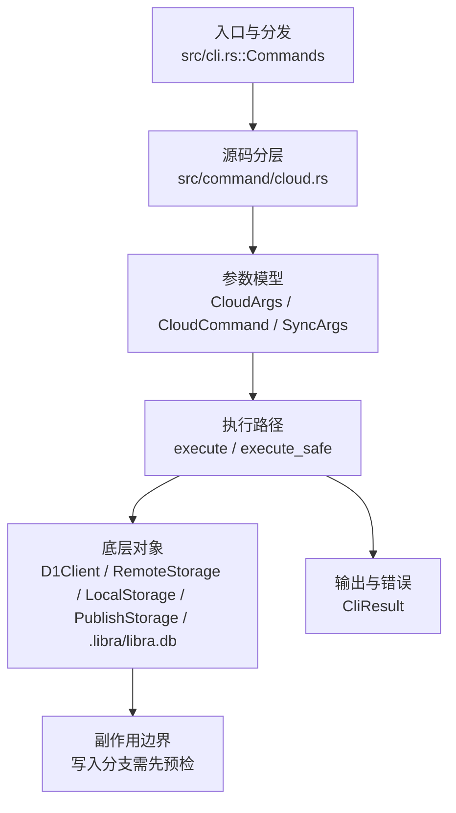

# `libra cloud` 开发设计

## 命令实现目标

`libra cloud` 的目标是通过 Cloudflare D1/R2 备份、恢复和同步 Libra 仓库元数据与对象数据。它是 Libra 云端备份扩展，重点是结构化进度、JSON/quiet 输出和云配置错误可诊断性，不对应 Git 原生命令。

## 对比 Git 与兼容性

- 兼容级别：`intentionally-different`。Libra cloud backup/restore extension, not a Git command

- 该命令或行为属于 Libra 扩展/有意差异；重点是清晰边界、结构化输出和可测试错误，而不是 Git 完全同形。

## 设计方案

- 入口与分发：已公开接入 `src/cli.rs::Commands`；已由 `src/command/mod.rs` 导出。CLI 层在 `src/cli.rs` 把解析后的参数交给命令模块，命令模块负责把领域错误转换为 `CliError` / `CliResult`。
- 源码分层：主要实现文件为 `src/command/cloud.rs`。参数/子命令类型包括：`CloudArgs`、`CloudCommand`、`SyncArgs`、`RestoreArgs`、`StatusArgs`；输出、错误或状态类型包括：`CloudSyncContext`、`MetadataSyncOutcome`、`AgentCaptureSyncOutcome`、`CloudSyncReport`、`CloudSyncProgress`（trait）、`ConsoleCloudSyncProgress`，以及 crate 私有的 `CloudError`（错误枚举）；主要执行函数包括：`execute`、`execute_safe`、`run_cloud_sync`（`pub(crate)`）。
- 执行路径：`execute_safe` 负责 CLI 安全包装、错误映射和输出配置；对象路径会解析 revision 并读写 blob/tree/commit/tag 等对象；引用路径会读取或更新 SQLite refs、HEAD 与 reflog；数据库路径会通过 SeaORM/SQLite 或 D1 客户端持久化元数据；AI 路径会读写 session、checkpoint、thread graph 或 agent profile 状态。

- 流程图：以下流程图按当前源码分层展示主路径和底层对象边界，便于维护者把代码入口、执行函数和副作用范围对应起来。

- 底层操作对象：`D1Client`（Cloudflare D1 元数据读写）；`Storage`（对象存储 trait，由 `RemoteStorage` / `LocalStorage` / `PublishStorage` 实现，覆盖本地、remote 和 publish 存储）；SeaORM / `.libra/libra.db`（配置、refs、reflog、AI/发布元数据等 SQLite 表）；`ObjectHash`（SHA-1/SHA-256 对象 ID 和 revision 解析结果）；`Branch` / branch store（SQLite refs 上的分支读写、过滤和上游关系）；`Head`（SQLite 中的 HEAD 指向、当前分支和 detached 状态）；`LocalStorage`（本地对象或发布存储根目录）；`DatabaseConnection`（SeaORM 数据库连接）；agent checkpoint（仅对 `agent_session` / `agent_checkpoint` 表行做摘要级 upsert/insert 镜像；按 CEX-EntireIO §10.2，per-event JSONL 流、回放和 transcript 截断属 Phase 4 工作，当前显式跳过）
- 输出与错误契约：人类输出、`--json` / `--machine` 输出和 quiet/verbose 分支必须继续走现有 `OutputConfig` / `emit_json_data` / `CliError` 路径；新增失败模式要补稳定错误码、用户提示和回归测试。
- 全局配置 schema 保护（P0-12）：CLI dispatch 前通过 `utils::client_storage::inspect_global_config_schema_future` 检查 `~/.libra/config.db` / `LIBRA_CONFIG_GLOBAL_DB`。`cloud` 默认把 future schema 视为 fail-closed 配置错误，返回 `LBR-CONFIG-001`（category `config`，exit 128），避免静默忽略全局 tiered storage 配置；`--offline` 或 `LIBRA_READ_POLICY=offline|local` 明确降级时仅 warning 一次并继续本地对象访问。诊断必须包含二进制路径、二进制版本、配置 DB 路径、当前/支持的 schema 版本和升级命令，且不得泄露 `vault.env.*` secret。回归测试：`compat_global_config_schema_future`。
- 副作用边界：凡是写入索引、对象库、refs/HEAD、reflog、SQLite/D1、工作树或远端的路径，都必须先完成参数校验和 dry-run/预检分支，再执行持久化，避免部分写入后静默成功。

## 实现历史

- 本节依据本地 main 分支提交历史重写，筛选与该命令实现、测试或文档路径直接相关的提交；以下是归纳后的实现脉络。
- 2026-05-15 `11de0c1f`（`feat(cloud): add structured sync output for json and quiet`）：基础实现节点：add structured sync output for json and quiet；当前实现的主要轮廓可追溯到该提交。
- 2026-05-15 `2319b664`（`feat(cloud): add structured restore output for json mode`）：功能演进：add structured restore output for json mode；该节点扩展了当前命令可用的参数或行为。
- 2026-05-15 `bd9f4b99`（`feat(cloud): add json progress events for cloud sync`）：功能演进：add json progress events for cloud sync；该节点扩展了当前命令可用的参数或行为。
- 2026-05-24 `110efec1`（`fix(cloud): semantic value_names + mutual-exclusion hints (v0.17.903)`）：实现修正：semantic value_names + mutual-exclusion hints (v0.17.903)；该节点把边界行为、错误处理或兼容差异纳入当前实现约束。
- 2026-05-17 `f07208d0`（`test(command/cloud): pin Display for 7 CloudError variants (v0.17.365)`）：测试契约：pin Display for 7 CloudError variants (v0.17.365)；相关行为已有回归守卫，后续变更需要继续满足。
- 历史结论：当前文档应以这些提交之后的代码、测试和兼容矩阵为准；更早的迁移式文档只保留为背景，不再作为事实来源。

## 当前状态

- 公开状态：已公开；模块状态：已导出。
- 用户文档：`docs/commands/cloud.md`。
- Synopsis：`libra cloud sync [--force] [--batch-size <N>]`。
- 公开参数/子命令包括：`sync [--force] [--batch-size <N>]`、`restore [--repo-id <UUID>] [--name <NAME>] [--metadata-only]`、`status [--verbose]`。
- 批量去重预检查（`lore.md` §0.6）：`Storage::exist_batch(&[ObjectHash]) -> Vec<bool>`（按序返回）——默认逐对象 `exist`（仅正确性兜底），`RemoteStorage` override 用 `futures` 有界并发（上限取自全局 `--max-connections`/`LIBRA_MAX_CONNECTIONS`，默认 16，§0.9）批量 HEAD、继承 §0.2 退避，`TieredStorage` override 本地命中免往返、只对未命中批量远端探测。`cloud sync` 的每批上传前先 `r2_storage.exist_batch` 一次性判定哪些对象已在 R2，替代原先每对象一次串行 HEAD。`exist_batch` 的 `buffered(N)` 并发上限取自全局 `--max-connections`/`LIBRA_MAX_CONNECTIONS`（`utils::resource_limits`，默认 16，§0.9），防大批量探测打爆连接。
- 取数策略（`lore.md` §0.8）：`TieredStorage::get` 消费 `utils::read_policy` 的进程级 `ReadPolicy`（`cli.rs` dispatch 时由 `--offline` flag 或 `LIBRA_READ_POLICY` env 设定，`--offline` 优先）——`LocalOnly`（`--offline`/`LIBRA_READ_POLICY=offline|local`）本地 miss 即返回 `ObjectNotFound` 明确报错、绝不触远端；`Remote`（`LIBRA_READ_POLICY=remote`）先从 durable tier 取+校验+缓存（本地命中也刷新）、远端 miss 才回退本地；缺省 `Auto` 为本地优先、miss 再取远端并 §0.3 校验缓存。get/put/heal 的落盘缓存统一收口在 `cache_fetched_object`（大对象已在 LRU 时只 touch 不重插，避免旧 `CachedFile` 的 `Drop` 删掉刚写回的文件）。纯本地仓库（无 `LIBRA_STORAGE_*`）不经 TieredStorage，policy 为 no-op。
- 本地原子写（`lore.md` §7.7）：`LocalStorage::put` 写 loose object 改走 `utils::atomic_write::write_atomic`（临时文件 → rename，崩溃只留完整或缺失对象、绝不半截，避免污染后续 reconcile/fsck）；fsync 由 `atomic_write::sync_data_enabled` 全局钩子控制——启动时经 `init_sync_data_from_env` 读 `LIBRA_SYNC_DATA`（`1`/`true`/`yes`/`on`）初始化，全局 flag `--sync-data`（§0.5，`cli.rs` 解析后 `set_sync_data(true)`）再强制开启；默认关闭以保对象写快路径，sequencer 状态则恒 fsync。写前经 `ensure_dir_exists` 逐级创建缺失目录并（fsync 时）fsync 每个新目录的父目录，保证新建 shard 目录本身也持久。`.libra/index` 走 git-internal `Index::save`（外部 crate），refs/HEAD/config/reflog 及 cherry-pick/rebase sequencer 状态在 SQLite（事务原子），均不在本项文件写范围内。
- 取数即校验（`lore.md` §0.3）：`TieredStorage::get` 从远端拉取对象后、写入本地缓存或返回调用方之前，先经 `verify_fetched_object` 重算 OID（把 payload 重组为 `<type> <len>\0<content>` 再哈希），与请求的 OID 不符则返回 `InvalidObjectInfo` 拒绝缓存，避免被篡改/损坏的远端对象污染本地缓存。哈希算法取自**请求 OID 自身的 `expected.kind()`**、而非线程本地 `HashKind`——因为 `ClientStorage::get` 在 spawn 的静态 runtime worker 线程上跑存储 future，其 thread-local `HashKind` 从未设置、默认 SHA-1，用它会把合法 SHA-256 对象误判。`cloud restore` 的 `restore_indexed_objects_from_remote` 也在落盘前校验。带 sha1/sha256 双格式单测。
- 云端退避与脱敏（`lore.md` §0.2）：`D1Client::execute` 的远端调用经 `utils::backoff::RetryPolicy`（默认 5 次重试、200ms 基延迟、10s 单次上限、60s 总预算、全抖动）对 `429`/`503` 与连接级失败自动退避重试，并解析/钳制 `Retry-After`；D1 错误消息不再回显响应体或 reqwest `Debug`（仅报失败类别与主机名）。`RemoteStorage`（object_store S3/R2）已内建对 `429`/`SlowDown`/5xx 的退避（含 `Retry-After`），此处显式将其重试上限对齐到同一组参数（`with_retry`）。D1 UPSERT/SELECT 天然幂等，仅对「服务端未执行」的场景（连接失败、429/503）重试，不会重复写入。

## 还未实现的功能

| 类别 | 未完成项 | 当前处理 |
|---|---|---|
| 兼容矩阵说明 | Libra 云备份/恢复扩展, 不是 Git 命令 | 按当前兼容矩阵保留；实现状态变化时同步 `_compatibility.md` 和测试证据。 |

## 维护要求

- 改进本命令前，必须先阅读并遵循 [docs/development/commands/_general.md](_general.md)；这是命令设计、实现、测试和文档同步的强制要求。
- 任何行为变更都要先核对实现源码，再同步 `COMPATIBILITY.md`、`docs/commands/<cmd>.md` 和相关测试。
- 新增 Git 兼容参数时必须明确 tier、错误码、JSON/机器输出契约和回归测试。
