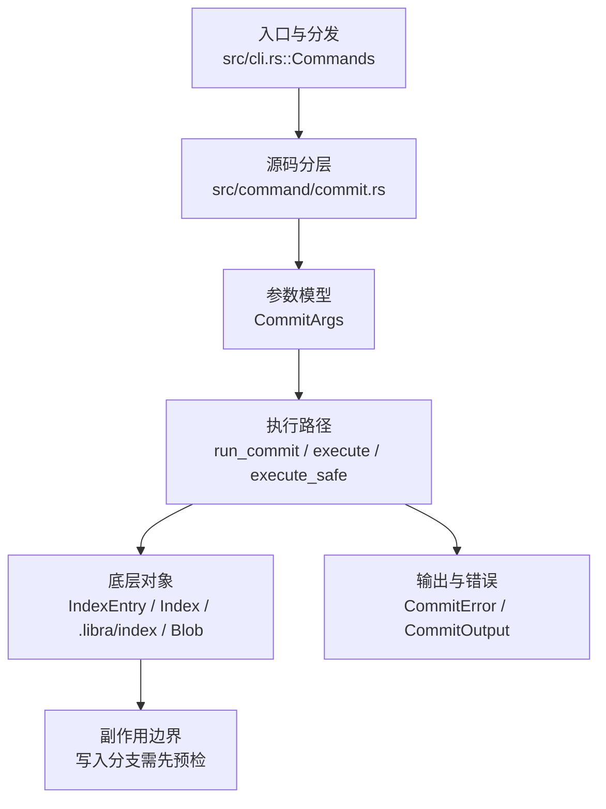

# `libra commit` 开发设计

## 命令实现目标

`libra commit` 的目标是把索引快照记录为新的提交，并处理消息来源、作者、签名、Libra 自有 pre-commit hook、结构化输出和兼容拒绝。这里的 hook 只指 `.libra/hooks/pre-commit.*`；Git hooks bridge（`.git/hooks` / `core.hooksPath`，包括 stock `commit-msg` bridge）按 [`_compatibility.md` D3](_compatibility.md#d3git-hooks-bridge-作为核心特性) 拒绝。实现已支持 `--all`、`--author`、`--date`（设置 author date）、`GIT_AUTHOR_*`/`GIT_COMMITTER_*` 身份与日期覆盖（非 `user.useConfigOnly` 时 Git env 优先于 config，`LIBRA_COMMITTER_*` 为后备）、`--cleanup`、`--dry-run`、`--fixup`、`--squash`、`-C/-c`（复用提交消息和 author metadata）、`--trailer`、`--reset-author`、`-e/--edit`（始终开编辑器）、`-v/--verbose`（编辑器模板含 staged diff，经 scissors 剥离）、bare `commit` 在可用编辑器时开编辑器、autosquash、dry-run porcelain、commit trailers 和稳定错误码，`--porcelain`（would-be-committed 状态的 porcelain v1 机器输出，隐含 `--dry-run`，不创建提交）、`--status`/`--no-status`（last-wins 切换：`--status` 把工作树 status 以 `#` 注释行注入编辑器模板，随后被 cleanup 剥离；仅当生效 cleanup 会剥离注释时才注入，`--cleanup=verbatim`/`whitespace` 下省略以免泄漏；默认不含 status 段）、`commit.cleanup`/`commit.verbose` 配置默认（CLI flag 未给时由 `read_cascaded_config_value` 读 local→global 配置：`commit.cleanup` 经 `parse_cleanup_mode` 解析为 `CleanupMode`、`commit.verbose` 经 `parse_git_config_bool` 解析为 bool-or-int（非零即 verbose）；显式 `--cleanup`/`-v` 短路覆盖配置，无效配置值 fatal。**已知限制**：`commit.verbose` 仅 on/off——`=2`/`=1k` 等非零整数等同 `true`（支持 git bool-or-int 的 k/m/g 后缀），无 `-vv`/未暂存 diff 的 level-2 渲染，也无 `--no-verbose` 单次关闭，因 Libra 的 `-v` 本就是 bool；另：present-but-empty 的配置值（如 `commit.verbose =`）经共享 `read_cascaded_config_value` 被规整为 unset（全 diff/config 共有的既有行为），故读作未设置而非 git 的 false）也已支持，`-t/--template`（初始模板，含 `commit.template` 配置回落与 unedited-template 中止）、`--no-gpg-sign`（强制未签名提交，跳过 `vault_sign_commit`，覆盖 `vault.signing=true`；仅当本就不会签名时才是 no-op。Git 正向 `-S`/`--gpg-sign` 未公开）亦已实现。

## 对比 Git 与兼容性

- 兼容级别：`partial`。

- 当前矩阵承诺常用 Git commit 子集已支持；`--date`、`GIT_AUTHOR_*`/`GIT_COMMITTER_*`、`--cleanup`、`--dry-run`、`--fixup`、`--squash`、`-C/-c`（消息和 author metadata）、`--trailer`、`--reset-author`、`-e/--edit`、`-v/--verbose`、`--porcelain`、`--status`/`--no-status`（last-wins 切换，`--status` 注入注释化 status 段，仅在 cleanup 会剥离注释时）、`commit.cleanup`/`commit.verbose` 配置默认、`-t/--template`（含 `commit.template` 配置回落）与 `--no-gpg-sign`（抑制 vault 签名，覆盖 `vault.signing=true`）已补齐。新增语义必须同步矩阵、用户文档和测试。
- `--amend` 作者归属与 Git 对齐：默认**保留**被修订提交的原作者（name/email/authored date），只有显式 `--reset-author`、`--author <AUTHOR>`、`--date` 或 `-C/-c` 来源作者才会改写对应 author 字段；committer 始终取当前身份。此前 `--amend` 会静默把作者改成当前身份、使 `--reset-author` 沦为空操作，已修正（见 `src/command/commit.rs` amend 分支）。
- `--amend --no-edit` 的 clean amend 行为与 Git 对齐：即使 tree、父列表、作者和消息都未变化，也必须生成替换提交并刷新 committer date，避免脚本看到成功摘要但 `HEAD` 未改变。实现点是 `refresh_noop_amend_committer_timestamp`：当新提交除 committer timestamp 外会复用父提交内容，且新 timestamp 不大于父提交时，将 committer timestamp 推进到父提交之后。

## 设计方案

- 入口与分发：已公开接入 `src/cli.rs::Commands`；已由 `src/command/mod.rs` 导出。CLI 层在 `src/cli.rs` 把解析后的参数交给命令模块，命令模块负责把领域错误转换为 `CliError` / `CliResult`。
- 源码分层：主要实现文件为 `src/command/commit.rs`。参数/子命令类型包括：`CommitArgs`；输出、错误或状态类型包括：`CommitError`、`CommitOutput`；主要执行函数包括：`run_commit`、`execute`、`execute_safe`。
- 源码意图：源码模块注释说明该命令会收集暂存变更、构建 tree/commit 对象、校验提交消息和签名，并更新 HEAD/refs。
- 执行路径：`execute_safe` 负责 CLI 安全包装、错误映射和输出配置；核心领域逻辑集中在 `run_commit`；索引路径会加载、比较、刷新或保存 `.libra/index`；对象路径会解析 revision 并读写 blob/tree/commit/tag 等对象；引用路径会读取或更新 SQLite refs、HEAD 与 reflog；数据库路径会通过 SeaORM/SQLite 或 D1 客户端持久化元数据。

- 流程图：以下流程图按当前源码分层展示主路径和底层对象边界，便于维护者把代码入口、执行函数和副作用范围对应起来。

- 底层操作对象：`IndexEntry`（索引条目，承载路径、mode、object id 和 stat 元数据）；`Index` / `.libra/index`（暂存区状态、路径条目和刷新/保存边界）；`Blob`（文件内容或 LFS pointer 写入对象库后的 blob 对象）；`Commit`（提交对象、父提交关系和提交消息载荷）；`TreeItem` / `TreeItemMode`（tree 中的路径项和 mode）；`Tree`（由索引或对象遍历生成的目录树对象）；`Branch` / branch store（SQLite refs 上的分支读写、过滤和上游关系）；`Head`（SQLite 中的 HEAD 指向、当前分支和 detached 状态）；`ReflogContext` / `with_reflog`（SQLite reflog 写入和动作记录）；`ClientStorage`（本地/分层对象存储读写入口）；SeaORM / `.libra/libra.db`（配置、refs、reflog、AI/发布元数据等 SQLite 表）；`ObjectHash`（SHA-1/SHA-256 对象 ID 和 revision 解析结果）
- 输出与错误契约：人类输出、`--json` / `--machine` 输出和 quiet/verbose 分支必须继续走现有 `OutputConfig` / `emit_json_data` / `CliError` 路径；新增失败模式要补稳定错误码、用户提示和回归测试。P0-09 起，commit 在计算 staged changes 和写 tree/commit 前调用 `tree_plumbing::validate_index_objects`，缺失或类型不匹配的 blob/tree index 对象返回 `LBR-REPO-002`，且不得移动 `HEAD`。
- 副作用边界：凡是写入索引、对象库、refs/HEAD、reflog、SQLite/D1、工作树或远端的路径，都必须先完成参数校验和 dry-run/预检分支，再执行持久化，避免部分写入后静默成功。

## 实现历史

- 2026-07-10（plan-20260708 P1-05b）：`run_commit` 在 auto-stage、hook、对象与 ref 写入前严格读取 `commit.gpgSign`。`true` 强制使用仓库 vault key 签名，`false` 禁用签名，未配置时继承 `vault.signing`；`--no-gpg-sign` 优先级最高。无效值 `LBR-CLI-002`、读取失败 `LBR-IO-001`。回归 target：`compat_config_history_defaults`。

- 本节依据本地 main 分支提交历史重写，筛选与该命令实现、测试或文档路径直接相关的提交；以下是归纳后的实现脉络。
- 2025-10-02 `e45fc0f7`（`feat: add option -F/--file for commit command (#10)`）：基础实现节点：add option -F/--file for commit command (#10)；当前实现的主要轮廓可追溯到该提交。
- 2026-06-07 `d399c043`（`feat: support show-ref dereference and commit trailers`）：功能演进：support show-ref dereference and commit trailers；该节点扩展了当前命令可用的参数或行为。
- 2026-06-05 `d68e5d66`（`feat(commit): support autosquash and dry-run porcelain modes`）：功能演进：support autosquash and dry-run porcelain modes；当前 `CommitArgs` 含 `--dry-run` 与 `--porcelain`（would-be-committed 状态的 porcelain v1 机器输出，隐含 dry-run，复用 `status::output_porcelain`）；autosquash 也在实现中。
- 2026-06-07 `f2c67a80`（`fix(commit): close compatibility plan gaps`）：实现修正：close compatibility plan gaps；该节点把边界行为、错误处理或兼容差异纳入当前实现约束。
- 2026-06-19（PR-15）：实现 `-e/--edit` 与 `-v/--verbose`。新增共享编辑器模块 `src/command/editor.rs`（`resolve_editor` 返回 Option，解析序 `$GIT_EDITOR`→`core.editor`→`$VISUAL`→`$EDITOR`；`edit_message` 接收已解析 editor 串 + `abort_on_failure`），cherry-pick 复用其启动逻辑（保留自身 precedence）。`resolve_commit_message` 重构为 `resolve_final_message(args, output, parent_ids)`：拼装 base（fixup/squash/-C/-c/-m/-F），`needs_editor = edit || reedit || (无 base && !no_edit)`，显式 editor 即使非 TTY 也运行、`vi` 兜底需 TTY；`-v` 经 `build_verbose_template` 注入 staged diff（`diff::staged_diff_text`，`DiffError` 升 `pub(crate)`）并强制 `Scissors` cleanup。`cleanup_commit_message` 的 `Scissors` 谓词扩展为接受可选 `#` 前缀。CLI：`message`/`file` 改为可选、`no_edit` 去掉 `requires=amend`/`conflicts message`、`edit` 与 `no_edit` 互斥。新增 `CommitError::EditorFailed`（复用 `IoReadFailed`/128）。`-t/--template`、`commit.cleanup`/`commit.verbose` 配置仍延后（对应孤儿测试已 `#[ignore]`）。
- 历史结论：当前文档应以这些提交之后的代码、测试和兼容矩阵为准；更早的迁移式文档只保留为背景，不再作为事实来源。

## 当前状态

- 签名默认：`commit.gpgSign=true|false` 按 local→global→system 严格级联读取并优先于 `vault.signing`；`--no-gpg-sign` 再覆盖两者。Git 正向 `-S`/`--gpg-sign` 仍未公开。

- 公开状态：已公开；模块状态：已导出。
- 用户文档：`docs/commands/commit.md`。
- Synopsis：`libra commit [OPTIONS] (-m <MESSAGE> | -F <FILE> | -C <COMMIT> | -c <COMMIT> | --fixup <COMMIT> | --squash <COMMIT> | --amend --no-edit)`。
- 公开参数/子命令包括：`-m, --message <MESSAGE>`、`-F, --file <FILE>`、`--amend`、`--no-edit`、`--conventional`、`-a, --all`、`-s, --signoff`、`--author <AUTHOR>`、`--date <DATE>`、`--allow-empty`、`--disable-pre`（跳过 Libra 自有 `.libra/hooks/pre-commit.*`）、`--no-verify`（跳过 Libra 自有 pre-commit 与消息校验，不启用 Git `commit-msg` hook bridge）、`--cleanup <MODE>`、`--dry-run`、`--fixup <COMMIT>`、`--squash <COMMIT>`、`-C/--reuse-message <COMMIT>`、`-c/--reedit-message <COMMIT>`、`--trailer <TRAILER>`、`--reset-author`、`-e/--edit`、`-v/--verbose`、`-t/--template <FILE>`（初始模板，回落 `commit.template` 配置）、`--porcelain`、`--status`/`--no-status`（last-wins 切换；`--status` 把工作树 status 以注释行注入编辑器模板）、`--no-gpg-sign`（抑制本次提交的 vault GPG 签名：在 `run_commit` 的 amend 与普通提交两条路径中，`args.no_gpg_sign` 为真时跳过 `vault_sign_commit`（`gpg_sig = None`），覆盖 `vault.signing=true` 配置；仅当本就不会签名时才是 no-op。Git 正向 `-S`/`--gpg-sign` 未公开——签名由 `vault.signing` 配置驱动）等。

## 还未实现的功能

| 类别 | 未完成项 | 当前处理 |
|---|---|---|
| 兼容矩阵说明 | common Git commit surface plus `--cleanup`, `--dry-run`, `--fixup`, `--squash`, `-C/-c`, `--trailer`, and `--reset-author` supported | 按当前兼容矩阵保留；实现状态变化时同步 `_compatibility.md` 和测试证据。 |
| ✅ 已实现 | `--porcelain` 机器输出 | 输出 would-be-committed 状态的 porcelain v1（复用 `status::output_porcelain` + 折叠 untracked 目录），替代人类摘要；与 Git 一致 **隐含 `--dry-run`**（不创建提交）；`-a` 仅为预览自动暂存，dry-run 后通过 index 快照还原（不改动 index），`--json` 模式下惰性。带集成测试（`test_commit_porcelain_outputs_status_format`、`test_commit_all_porcelain_shows_autostaged_as_staged`）。 |
| ✅ 已实现 | `--status` / `--no-status` | last-wins 切换。`--status` 在打开编辑器时把工作树 status（经 `status::execute_to` 长格式）以 `#` 注释行注入模板（`-v` 时置于 scissors 之上），随后被 `cleanup_commit_message` 当作注释行剥离 → 不进入最终消息。**仅当生效的 cleanup 会剥离注释时才注入**（`cleanup_strips_comments = matches!(mode, Strip\|Default)`）：`--cleanup=verbatim`/`whitespace`/`scissors`（保留注释行——显式 scissors 是 whitespace cleanup + 截断，marker 之上的 `#` 行保留）下不注入，故绝不泄漏。`-v` 仅截断附加 diff、不再强制 strip，故 `build_verbose_template` 的 `# Please enter` 帮助注释也仅在 `strips_comments` 时注入（否则非剥离模式会把模板自身的 `#` 行提交进去）。无 `-m`/`-F`（不开编辑器）时无效果。默认与 `--no-status` 不含 status 段。带集成测试（`status_flag_seeds_commented_status_into_template_and_strips_it`、`default_and_no_status_omit_status_from_template`、`status_not_seeded_under_non_comment_stripping_cleanup`）。 |
| ✅ 已实现 | `commit.cleanup`/`commit.verbose` 配置默认（CLI flag 未给时回退到 local→global 配置，flag 优先；`parse_cleanup_mode` + `parse_git_config_bool`）。带集成测试 `test_commit_honors_cleanup_and_verbose_config`（verbatim 保留 `#` 注释、verbose=true 在 `-m` 提交时把 staged diff 打到 stderr）。 | 与 git 一致；经真实 git 对照。 |
| ✅ 已实现 | `-t/--template <FILE>` 初始模板 | `CommitArgs.template`（短 `-t`）。仅当无显式消息源（`-m`/`-F`/`-C`/`-c`/`--fixup`/`--squash`，即 `base.is_none()`）时经 `resolve_commit_template` 读取：`-t` 文件优先，否则回落 `commit.template` 配置（文件路径，`~/` 展开为 `$HOME`）；读失败→`CommitError::TemplateRead`（`IoReadFailed`）。模板作为 `initial` 缓冲，优先于 amend 父消息。`--no-edit` 时直接用作消息；否则 seed 编辑器，**若编辑后（cleanup 归一）等于 cleanup(template) 则中止**（`CommitError::TemplateUnedited`，与 git "you did not edit the message" 一致；`--no-edit` 不触发）。有显式消息源时 `-t` 不读取也不报错（`-m` 胜，与 git 一致）。带集成测试（`template_t_flag_loads_initial_content`/`template_seeds_editor_and_edited_message_is_committed`/`template_left_unedited_aborts`）。 |
| ✅ 已实现 | P0-08 身份/日期保真 | `create_commit_signatures` 分离 author/committer 身份；非 `user.useConfigOnly` 下 Git env 覆盖 config，`LIBRA_COMMITTER_*` 为后备；`--date` 与 `GIT_AUTHOR_DATE` 设置 author date，`GIT_COMMITTER_DATE` 设置 committer date，raw `<unix> <tz>` 保留时区；`-C/-c` 复用来源提交 message 与 author metadata；`--reset-author` amend 时重置到当前 author 身份/日期。带 compat 测试 `compat_commit_identity_date`。 |
| ✅ 已实现 | P0-09 index 对象完整性预检 | `commit` 在加载/刷新 index 后立即调用 `tree_plumbing::validate_index_objects`，确保普通/可执行/symlink 条目指向 blob、tree-mode 条目指向 tree；缺失或错类型返回 `LBR-REPO-002` 并保持 `HEAD` 不变。带 compat 测试 `compat_write_tree_missing_object`。 |

## 维护要求

- 改进本命令前，必须先阅读并遵循 [docs/development/commands/_general.md](_general.md)；这是命令设计、实现、测试和文档同步的强制要求。
- 任何行为变更都要先核对实现源码，再同步 `COMPATIBILITY.md`、`docs/commands/<cmd>.md` 和相关测试。
- 新增 Git 兼容参数时必须明确 tier、错误码、JSON/机器输出契约和回归测试。
