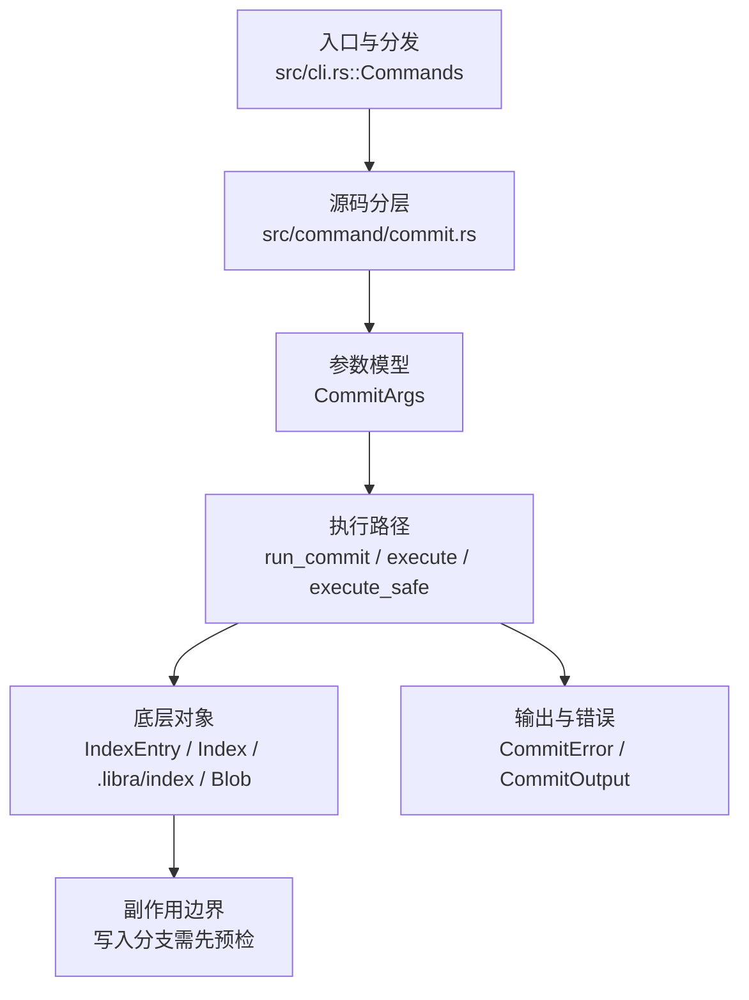

# `libra commit` 开发设计

## 命令实现目标

`libra commit` 的目标是把索引快照记录为新提交，并处理消息来源、作者/提交者、vault 签名、`.libra/hooks` commit 生命周期、结构化输出和兼容拒绝。P1-10 支持 `pre-commit`、`prepare-commit-msg`、`commit-msg`、`post-rewrite` 与 `post-commit`；Git hooks bridge（`.git/hooks` / `core.hooksPath`）仍按 [`_compatibility.md` D3](_compatibility.md#d3git-hooks-bridge-作为核心特性) 拒绝。常用 Git commit 表面已经覆盖：消息/模板/复用、amend、auto-stage、author/date/env、cleanup、dry-run/porcelain、trailers、编辑器、verbose diff 与稳定错误码。编辑器模板默认含注释化 status；`commit.status=false` 可关闭，`--status`/`--no-status` 显式覆盖，且仅在 cleanup 会剥离注释时注入。`commit.cleanup`/`commit.verbose` 提供既有 local→global 默认；`commit.gpgSign` 与 `--no-gpg-sign` 控制 vault 签名。Git 正向 `-S`/`--gpg-sign` 尚未公开。

## 对比 Git 与兼容性

- 兼容级别：`partial`。

- 当前矩阵承诺常用 Git commit 子集已支持；`commit.status` 按严格 local→global→system 级联读取，未设置默认 true，`--status`/`--no-status` last-wins 并短路覆盖。`--date`、Git 身份/日期环境变量、cleanup、dry-run/porcelain、fixup/squash、消息复用、trailers、reset-author、编辑器/verbose、template 与 vault 签名配置也已补齐。新增语义必须同步矩阵、用户文档和测试。
- `--amend` 作者归属与 Git 对齐：默认**保留**被修订提交的原作者（name/email/authored date），只有显式 `--reset-author`、`--author <AUTHOR>`、`--date` 或 `-C/-c` 来源作者才会改写对应 author 字段；committer 始终取当前身份。此前 `--amend` 会静默把作者改成当前身份、使 `--reset-author` 沦为空操作，已修正（见 `src/command/commit.rs` amend 分支）。
- `--amend --no-edit` 的 clean amend 行为与 Git 对齐：即使 tree、父列表、作者和消息都未变化，也必须生成替换提交并刷新 committer date，避免脚本看到成功摘要但 `HEAD` 未改变。实现点是 `refresh_noop_amend_committer_timestamp`：当新提交除 committer timestamp 外会复用父提交内容，且新 timestamp 不大于父提交时，将 committer timestamp 推进到父提交之后。

## 设计方案

- 入口与分发：已公开接入 `src/cli.rs::Commands`；已由 `src/command/mod.rs` 导出。CLI 层在 `src/cli.rs` 把解析后的参数交给命令模块，命令模块负责把领域错误转换为 `CliError` / `CliResult`。
- 源码分层：主要实现文件为 `src/command/commit.rs`。参数/子命令类型包括：`CommitArgs`；输出、错误或状态类型包括：`CommitError`、`CommitOutput`；主要执行函数包括：`run_commit`、`execute`、`execute_safe`。
- 源码意图：源码模块注释说明该命令会收集暂存变更、构建 tree/commit 对象、校验提交消息和签名，并更新 HEAD/refs。
- 执行路径：`execute_safe` 负责 CLI 安全包装、错误映射和输出配置；核心领域逻辑集中在 `run_commit`；索引路径会加载、比较、刷新或保存 `.libra/index`；对象路径会解析 revision 并读写 blob/tree/commit/tag 等对象；引用路径会读取或更新 SQLite refs、HEAD 与 reflog；数据库路径会通过 SeaORM/SQLite 或 D1 客户端持久化元数据。

- 流程图：以下流程图按当前源码分层展示主路径和底层对象边界，便于维护者把代码入口、执行函数和副作用范围对应起来。

- 底层操作对象：`IndexEntry`（索引条目，承载路径、mode、object id 和 stat 元数据）；`Index` / `.libra/index`（暂存区状态、路径条目和刷新/保存边界）；`Blob`（文件内容或 LFS pointer 写入对象库后的 blob 对象）；`Commit`（提交对象、父提交关系和提交消息载荷）；`TreeItem` / `TreeItemMode`（tree 中的路径项和 mode）；`Tree`（由索引或对象遍历生成的目录树对象）；`Branch` / branch store（SQLite refs 上的分支读写、过滤和上游关系）；`Head`（SQLite 中的 HEAD 指向、当前分支和 detached 状态）；`ReflogContext` / `with_reflog`（SQLite reflog 写入和动作记录）；`ClientStorage`（本地/分层对象存储读写入口）；SeaORM / `.libra/libra.db`（配置、refs、reflog、AI/发布元数据等 SQLite 表）；`ObjectHash`（SHA-1/SHA-256 对象 ID 和 revision 解析结果）
- 输出与错误契约：人类输出、`--json` / `--machine` 输出和 quiet/verbose 分支必须继续走现有 `OutputConfig` / `emit_json_data` / `CliError` 路径；新增失败模式要补稳定错误码、用户提示和回归测试。P0-09 起，commit 在计算 staged changes 和写 tree/commit 前调用 `tree_plumbing::validate_index_objects`，缺失或类型不匹配的 blob/tree index 对象返回 `LBR-REPO-002`，且不得移动 `HEAD`。
- 副作用边界：凡是写入索引、对象库、refs/HEAD、reflog、SQLite/D1、工作树或远端的路径，都必须先完成参数校验和 dry-run/预检分支，再执行持久化，避免部分写入后静默成功。
- Hook 边界：共享 `internal::repo_hooks` 解析 canonical 名称、复制到私有执行位置并经 required workspace-write/禁网 sandbox 运行。hook 子进程清空调用方环境，仅保留进程/locale allowlist 与 Libra hook/temp 变量，避免把 API token 等 secret 交给仓库代码。`.libra` 默认只读，仅 `prepare-commit-msg`/`commit-msg` 可写 worktree 私有 `COMMIT_EDITMSG`；blocking hook 在对象/ref 更新前失败，`post-commit`/`post-rewrite` 在成功后 advisory 运行。quiet/JSON/machine 不重放 hook 输出。

## 实现历史

- 2026-07-14（plan-20260708 P1-10）：commit hook 顺序收敛为 `pre-commit` → `prepare-commit-msg` → editor/trailers → `commit-msg` → object/ref update → `post-commit` → amend `post-rewrite`；`--no-verify` 跳过全部仓库 hook，`--disable-pre` 只跳过首项。消息 hook 通过原子 `.libra/COMMIT_EDITMSG` round-trip 修改消息；post hooks 失败不回滚已完成提交。回归 target：`compat_libra_hooks_lifecycle`。
- 2026-07-12（plan-20260708 P1-05）：`run_commit` 在 auto-stage、hook、对象与 ref 写入前解析 `commit.status`；严格 local→global→system 级联，未设置默认 true，Git 布尔解析，`--status`/`--no-status` 短路覆盖。无效值 `LBR-CLI-002`、读取失败 `LBR-IO-001`。回归 target：`compat_config_defaults_semantics`。
- 2026-07-10（plan-20260708 P1-05b）：`run_commit` 在 auto-stage、hook、对象与 ref 写入前严格读取 `commit.gpgSign`。`true` 强制使用仓库 vault key 签名，`false` 禁用签名，未配置时继承 `vault.signing`；`--no-gpg-sign` 优先级最高。无效值 `LBR-CLI-002`、读取失败 `LBR-IO-001`。回归 target：`compat_config_history_defaults`。

- 本节依据本地 main 分支提交历史重写，筛选与该命令实现、测试或文档路径直接相关的提交；以下是归纳后的实现脉络。
- 2025-10-02 `e45fc0f7`（`feat: add option -F/--file for commit command (#10)`）：基础实现节点：add option -F/--file for commit command (#10)；当前实现的主要轮廓可追溯到该提交。
- 2026-06-07 `d399c043`（`feat: support show-ref dereference and commit trailers`）：功能演进：support show-ref dereference and commit trailers；该节点扩展了当前命令可用的参数或行为。
- 2026-06-05 `d68e5d66`（`feat(commit): support autosquash and dry-run porcelain modes`）：功能演进：support autosquash and dry-run porcelain modes；当前 `CommitArgs` 含 `--dry-run` 与 `--porcelain`（would-be-committed 状态的 porcelain v1 机器输出，隐含 dry-run，复用 `status::output_porcelain`）；autosquash 也在实现中。
- 2026-06-07 `f2c67a80`（`fix(commit): close compatibility plan gaps`）：实现修正：close compatibility plan gaps；该节点把边界行为、错误处理或兼容差异纳入当前实现约束。
- 2026-06-19（PR-15）：实现 `-e/--edit` 与 `-v/--verbose`。新增共享编辑器模块 `src/command/editor.rs`（`resolve_editor` 返回 Option，解析序 `$GIT_EDITOR`→`core.editor`→`$VISUAL`→`$EDITOR`；`edit_message` 接收已解析 editor 串 + `abort_on_failure`），cherry-pick 复用其启动逻辑（保留自身 precedence）。`resolve_commit_message` 重构为 `resolve_final_message(args, output, parent_ids)`：拼装 base（fixup/squash/-C/-c/-m/-F），`needs_editor = edit || reedit || (无 base && !no_edit)`，显式 editor 即使非 TTY 也运行、`vi` 兜底需 TTY；`-v` 经 `build_verbose_template` 注入 staged diff（`diff::staged_diff_text`，`DiffError` 升 `pub(crate)`）并强制 `Scissors` cleanup。`cleanup_commit_message` 的 `Scissors` 谓词扩展为接受可选 `#` 前缀。CLI：`message`/`file` 改为可选、`no_edit` 去掉 `requires=amend`/`conflicts message`、`edit` 与 `no_edit` 互斥。新增 `CommitError::EditorFailed`（复用 `IoReadFailed`/128）。`-t/--template`、`commit.cleanup`/`commit.verbose` 配置仍延后（对应孤儿测试已 `#[ignore]`）。
- 历史结论：当前文档应以这些提交之后的代码、测试和兼容矩阵为准；更早的迁移式文档只保留为背景，不再作为事实来源。

## 当前状态

- 签名默认：`commit.gpgSign=true|false` 按 local→global→system 严格级联读取并优先于 `vault.signing`；`--no-gpg-sign` 再覆盖两者。Git 正向 `-S`/`--gpg-sign` 仍未公开。

- 公开状态：已公开；模块状态：已导出。
- 用户文档：`docs/commands/commit.md`。
- Synopsis：`libra commit [OPTIONS] (-m <MESSAGE> | -F <FILE> | -C <COMMIT> | -c <COMMIT> | --fixup <COMMIT> | --squash <COMMIT> | --amend --no-edit)`。
- 公开参数/子命令包括：`-m, --message <MESSAGE>`、`-F, --file <FILE>`、`--amend`、`--no-edit`、`--conventional`、`-a, --all`、`-s, --signoff`、`--author <AUTHOR>`、`--date <DATE>`、`--allow-empty`、`--disable-pre`（只跳过 `.libra/hooks/pre-commit[.sh|.ps1]`）、`--no-verify`（跳过全部 `.libra/hooks` 生命周期及消息校验；不启用 `.git/hooks` bridge）、`--cleanup <MODE>`、`--dry-run`、`--fixup <COMMIT>`、`--squash <COMMIT>`、`-C/--reuse-message <COMMIT>`、`-c/--reedit-message <COMMIT>`、`--trailer <TRAILER>`、`--reset-author`、`-e/--edit`、`-v/--verbose`、`-t/--template <FILE>`（初始模板，回落 `commit.template` 配置）、`--porcelain`、`--status`/`--no-status`（last-wins 切换；`--status` 把工作树 status 以注释行注入编辑器模板）、`--no-gpg-sign`（抑制本次提交的 vault GPG 签名：在 `run_commit` 的 amend 与普通提交两条路径中，`args.no_gpg_sign` 为真时跳过 `vault_sign_commit`（`gpg_sig = None`），覆盖 `vault.signing=true` 配置；仅当本就不会签名时才是 no-op。Git 正向 `-S`/`--gpg-sign` 未公开——签名由 `vault.signing` 配置驱动）等。

## 还未实现的功能

| 类别 | 未完成项 | 当前处理 |
|---|---|---|
| 兼容矩阵说明 | common Git commit surface plus `--cleanup`, `--dry-run`, `--fixup`, `--squash`, `-C/-c`, `--trailer`, and `--reset-author` supported | 按当前兼容矩阵保留；实现状态变化时同步 `_compatibility.md` 和测试证据。 |
| ✅ 已实现 | `--porcelain` 机器输出 | 输出 would-be-committed 状态的 porcelain v1（复用 `status::output_porcelain` + 折叠 untracked 目录），替代人类摘要；与 Git 一致 **隐含 `--dry-run`**（不创建提交）；`-a` 在 task-local 临时 index 中预览自动暂存，live index 从不替换，临时 blob/LFS/tree 也不持久化；`--json` 模式下惰性。带集成测试（`test_commit_porcelain_outputs_status_format`、`test_commit_all_porcelain_shows_autostaged_as_staged`）。 |
| ✅ 已实现 | `commit.status` / `--status` / `--no-status` | 编辑器模板默认含 status；仅当编辑器会打开且 cleanup 会剥离注释时，`commit.status` 才按严格 local→global→system 级联读取 Git 布尔值，显式 CLI last-wins 且短路覆盖；适用路径中的无效/读取失败在 auto-stage 前返回 `LBR-CLI-002`/`LBR-IO-001`，`-m`、dry-run/porcelain、JSON 与非剥离 cleanup 绕过该键。显式 `--status` + 不可读 store 的回归点名下游 `status.showUntrackedFiles` 且排除 `commit.status`，证明短路边界。启用模板 status 时，`status.*` 先解析一次，auto-stage 后、hook 前以同一 resolved args 采集；配置/采集/渲染错误保留原 `CliError`，不再静默省略。`--dry-run -a` 经 `path::with_index_override` 把整个预览绑定到 task-local 隔离临时 index，live index 从不替换且临时对象不持久化；非 verbose regular blob 用 64 KiB 缓冲流式哈希且不保留载荷。verbose 在读取前统一预算 staged diff 变化两侧的 HEAD、已暂存与 auto-stage blob（未变化对象不计费）：单对象 32 MiB、总计费 64 MiB、最多 4096 对象；auto-stage 在读载荷前先做 provisional 字节/对象预留，再按 hash 去重结算。scratch 位于所有 linked worktree 共用的公共仓库存储 `.libra/tmp/commit-preview`，并发预留总上限 256 MiB，每次最多扫描 256 个 run、清理 32 个超过 24 小时且未持锁的旧 run。HEAD/已暂存对象预检超限固定 exit 128、`LBR-IO-001`、可操作提示、live index/对象库不变；auto-stage cache 与 scratch reserve 写侧失败保持 `LBR-IO-002`；无法有界本地预检的对象（remote-only 或 pack 缺现成 index）在加载前 fail-closed，且预览不重建 pack index。loose 预检常量内存流式校验声明边界与压缩流 EOF；pack/delta 预检完整验证并计费 base/instruction/result 链、限制深度且拒绝非法指令/u64 溢出；批量只枚举 pack 一次、每个现有 index 只打开一次，并保持一次 storage-runtime 往返。auto-stage regular/LFS 读取、LFS 备份、预览缓存与对象持久化均为 `Result`，按读/写返回 `LBR-IO-001`/`LBR-IO-002`，不再经 `BlobExt` panic。真实 `-a` 的 LFS 路径流式写临时快照，从同一字节流计算 OID/size，再原子替换同 OID 的旧备份；`--sync-data` 下持久创建祖先、fsync 临时文件、同步 staging 与目标目录，Windows 因无可靠目录 fsync 等价物而使用 write-through replace。后续采集失败沿用 auto-stage-on-abort 保留语义。真实 persist 失败回归固定 exit 128、`LBR-IO-002`、目标 OID、无 panic 与 live index 不变。dry-run/porcelain 一律跳过 hook、editor、rerere 与 `post_commit` automation；status 注释仅在 `Strip\|Default` cleanup 下注入。回归：`compat_config_defaults_semantics` 与 `default_includes_status_and_no_status_omits_it`。 |
| ✅ 已实现 | `commit.cleanup`/`commit.verbose` 配置默认（CLI flag 未给时回退到 local→global 配置，flag 优先；`parse_cleanup_mode` + `parse_git_config_bool`）。带集成测试 `test_commit_honors_cleanup_and_verbose_config`（verbatim 保留 `#` 注释、verbose=true 在 `-m` 提交时把 staged diff 打到 stderr）。 | 与 git 一致；经真实 git 对照。 |
| ✅ 已实现 | `-t/--template <FILE>` 初始模板 | `CommitArgs.template`（短 `-t`）。仅当无显式消息源（`-m`/`-F`/`-C`/`-c`/`--fixup`/`--squash`，即 `base.is_none()`）时经 `resolve_commit_template` 读取：`-t` 文件优先，否则回落 `commit.template` 配置（文件路径，`~/` 展开为 `$HOME`）；读失败→`CommitError::TemplateRead`（`IoReadFailed`）。模板作为 `initial` 缓冲，优先于 amend 父消息。`--no-edit` 时直接用作消息；否则 seed 编辑器，**若编辑后（cleanup 归一）等于 cleanup(template) 则中止**（`CommitError::TemplateUnedited`，与 git "you did not edit the message" 一致；`--no-edit` 不触发）。有显式消息源时 `-t` 不读取也不报错（`-m` 胜，与 git 一致）。带集成测试（`template_t_flag_loads_initial_content`/`template_seeds_editor_and_edited_message_is_committed`/`template_left_unedited_aborts`）。 |
| ✅ 已实现 | P0-08 身份/日期保真 | `create_commit_signatures` 分离 author/committer 身份；非 `user.useConfigOnly` 下 Git env 覆盖 config，`LIBRA_COMMITTER_*` 为后备；`--date` 与 `GIT_AUTHOR_DATE` 设置 author date，`GIT_COMMITTER_DATE` 设置 committer date，raw `<unix> <tz>` 保留时区；`-C/-c` 复用来源提交 message 与 author metadata；`--reset-author` amend 时重置到当前 author 身份/日期。带 compat 测试 `compat_commit_identity_date`。 |
| ✅ 已实现 | P0-09 index 对象完整性预检 | `commit` 在加载/刷新 index 后立即调用 `tree_plumbing::validate_index_objects`，确保普通/可执行/symlink 条目指向 blob、tree-mode 条目指向 tree；缺失或错类型返回 `LBR-REPO-002` 并保持 `HEAD` 不变。带 compat 测试 `compat_write_tree_missing_object`。 |

P1-05e R14 补强：verbose preview 的实际对象读取显式调用 local-only
`get_with_limit`，不依赖 storage 私有 runtime/`spawn_blocking` 无法继承的
task-local 状态。loose 与非 delta pack 会在 payload 解码前检查声明长度；
remote-only 对象继续 fail-closed。对应 lower-level 回归先固定“超限声明必须
在解码前被拒绝”，再验证 bounded load 不读取超限 payload。

P1-05e R15 补强：变化对象总数在 `object_sizes` 前整批预检，4,097 个
HEAD/staged 对象不会触发 loose/pack sizing；超限 delta instruction 声明在访问
base 前立即失败；`status.showStash=true` 的 stash log 读取/解析错误以
`LBR-IO-001` 在 hook/editor/ref 写入前传播。三条回归均先红后绿。

P1-05e R16 补强：stash ref 存在性检查改为 `Result`，只把 `NotFound` 视为
无 stash，元数据错误和损坏日志在普通与 cached status 中均以 `LBR-IO-001`
传播；活动 preview run 的 reservation 元数据缺失/不可读时配额扫描
fail-closed；公开矩阵统一为“常量内存有界本地预检”。完整 config target
94/94、stash/autostash 56/56 与默认范围 clippy 均通过。

P1-05e R17 补强：已有但非普通文件的 `refs/stash` 不再被当作无 stash，
普通 commit-status 与 fresh cached-status 都在输出/副作用前返回 `LBR-IO-001`；
bounded pack read 新增只遍历既有 index 的读取路径，不再调用会为无关 pack
重建 index 的普通 `get_from_pack`。配置 target 94/94、storage local 11/11。

P1-05e R18 补强：stash ref 检查改用 `symlink_metadata`，符号链接即使指向
普通文件也按非普通 ref 以 `LBR-IO-001` fail-closed；pack 批量 sizing 贯穿
preview 剩余聚合预算，首个越界对象完成保守定长后立即停止，不再解压/校验
后续对象。普通 commit-status、fresh cached-status 与 pack probe 回归均先红后绿。

P1-05e R19 补强：storage sizing 与 preview cache 共享每对象最少 4 KiB
计费函数，避免 tiny packed objects 在 cache 已越界后仍继续探测；新增回归贯穿
ClientStorage、tiered、本地 alternate 与 pack，并证明 4,095-byte 剩余预算在
首个 10-byte packed blob 后立即失败。cached-status 的 symlink 场景局部
`cfg(unix)`，损坏日志与目录 ref 的跨平台覆盖保留。

P1-05e R20 补强：`commit -a` 在 LFS 判断或普通文件读取前用
`symlink_metadata` 识别 tracked symlink，包含 dangling link；真实提交、verbose
与 non-verbose preview 都只使用 link-target bytes 并保持 mode `120000`，命中
LFS attribute 的 symlink 也不会被当成目标文件内容。Unix 回归均先红后绿。

P1-05e R21 补强：bounded packed-object 读取改走专用 uncached 递归解码，
不读取/填充 200 MiB 全局 `PACK_OBJ_CACHE`；delta/base/instruction/result 的共存
仍由 size preflight 的 peak 计费，最终 payload 从 `CacheObject` 直接 move，避免
返回侧完整克隆。OFS_DELTA 回归固定 delta/base cache key 均保持不存在。

## 维护要求

- 改进本命令前，必须先阅读并遵循 [docs/development/commands/_general.md](_general.md)；这是命令设计、实现、测试和文档同步的强制要求。
- 任何行为变更都要先核对实现源码，再同步 `COMPATIBILITY.md`、`docs/commands/<cmd>.md` 和相关测试。
- 新增 Git 兼容参数时必须明确 tier、错误码、JSON/机器输出契约和回归测试。
