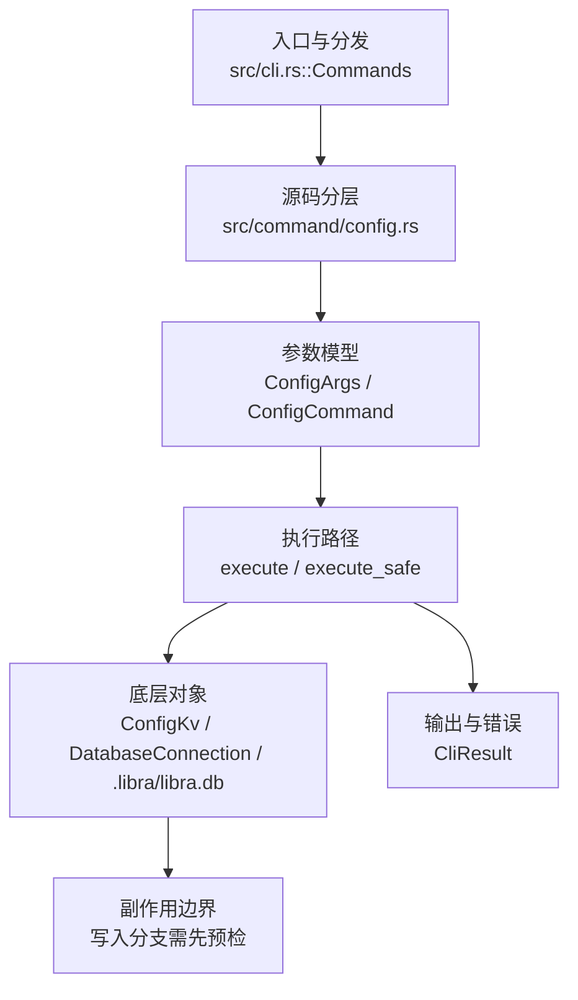

# `libra config` 开发设计

## 命令实现目标

`libra config` 的目标是读取和修改 Libra 配置，覆盖 local/global/system 作用域、多值项、section、类型化输出和机器可读格式。实现需要尊重 SQLite/Vault 存储边界，避免把配置安全性降级为可任意文本编辑，并把 Git 文本配置中的编辑、includeIf 等差异列为兼容缺口（`-z`/`--null` 输出已实现）。

## 对比 Git 与兼容性

- 兼容级别：`partial`。vault-backed local/global config 已支持；section 操作 `--remove-section <name>` / `--rename-section <old> <new>`（事务化，采用 Git 的 section/subsection 身份而非裸前缀——`--remove-section branch` 删除 `branch.<key>` 但不动 `branch.feature.*` 子节）已支持；`-z`/`--null` NUL 分隔输出（get/get-all 输出 `value\0`，`--get-regexp`/`--list` 输出 `key\nvalue\0`，`--name-only` 输出 `key\0`，`--show-origin` 前缀 `origin\0`）已支持；读取与设置时的类型规范化 `--type=<bool|int|path>` 及 `--bool`/`--int`/`--path` 快捷方式（bool 变体→true/false、int 的 k/m/g 1024 倍率、path 的 `~`/`~/` 展开；set 时在存储前校验+规范化，非法值报错不写入）已支持；`--system` 作用域（`/etc/libra/config.db`，可经 `LIBRA_CONFIG_SYSTEM_DB` 覆盖，级联优先级最低；vault 加密密钥与 `import` 在该作用域被拒绝）已支持；editor round-trip 和 includeIf 尚未完整支持。

- 当前矩阵承诺常用 Git 行为已支持；新增语义必须同步矩阵、用户文档和测试。

## 设计方案

- 入口与分发：已公开接入 `src/cli.rs::Commands`；已由 `src/command/mod.rs` 导出。CLI 层在 `src/cli.rs` 把解析后的参数交给命令模块，命令模块负责把领域错误转换为 `CliError` / `CliResult`。
- 源码分层：主要实现文件为 `src/command/config.rs`。参数/子命令类型包括：`ConfigArgs`、`ConfigCommand`；输出、错误或状态类型包括：`ConfigListEntry`、`ConfigImportSummary`、`ConfigSshKeyEntry`、`ConfigGpgKeyEntry`（`--json` 序列化），错误通过 `CliError` / `CliResult` 统一传播；主要执行函数包括：`execute`、`execute_safe`、`execute_inner`、`resolve_command`。
- 执行路径：`execute_safe` 负责 CLI 安全包装、错误映射和输出配置；数据库路径会通过 SeaORM/SQLite 或 D1 客户端持久化元数据。

- 流程图：以下流程图按当前源码分层展示主路径和底层对象边界，便于维护者把代码入口、执行函数和副作用范围对应起来。

- 底层操作对象：`ConfigKv`（配置键值持久化行）；配置层（local/global/system、remote、identity 和运行时设置）；`DatabaseConnection`（SeaORM 数据库连接）；SeaORM / `.libra/libra.db`（配置、refs、reflog、AI/发布元数据等 SQLite 表）；Vault/libvault（身份、密钥或 vault-backed 签名边界）
- 输出与错误契约：人类输出、`--json` / `--machine` 输出和 quiet/verbose 分支必须继续走现有 `OutputConfig` / `emit_json_data` / `CliError` 路径；新增失败模式要补稳定错误码、用户提示和回归测试。
- 副作用边界：凡是写入索引、对象库、refs/HEAD、reflog、SQLite/D1、工作树或远端的路径，都必须先完成参数校验和 dry-run/预检分支，再执行持久化，避免部分写入后静默成功。

## 实现历史

- 本节依据本地 main 分支提交历史重写，筛选与该命令实现、测试或文档路径直接相关的提交；以下是归纳后的实现脉络。
- 2026-07-15（plan-20260708 P0-12 回归修复）：`internal::config` 的两条级联读取（`read_cascaded_config_value_strict` 与 `global_config_value`）在 global scope 读取失败时，改为先经 `utils::client_storage::inspect_global_config_schema_future_at_path` 做类型化 future-schema 探测：命中则复用 P0-12 的去重警告（`emit_global_config_schema_future_warning`）并把 global scope 视为未设置继续级联；其它失败保持 fail-closed 原样传播（`LBR-IO-001` 契约不变）。此前 P1-05 家族给 `status`/`branch`/`tag`/`merge`/`commit`/`fetch`/`init`/`diff`/`log` 等命令加的配置默认读取会把 schema-newer 的全局库当普通 I/O 失败，破坏 P0-12「本地命令警告一次并继续」的既定行为（回归由 `compat_global_config_schema_future::local_command_warns_once_and_continues` 钉住）。
- 2026-01-07 `a1366d77`（`feat(config): add --global/--local/--system scope support (#108)`）：基础实现节点：add --global/--local/--system scope support (#108)；当前实现的主要轮廓可追溯到该提交。
- 2026-06-03 `05250fe2`（`feat(config): implement git config parity — multi-value, sections, typed values, output flags (v0.17.1277)`）：功能演进：implement git config parity — multi-value, sections, typed values, output flags (v0.17.1277)；该节点扩展了当前命令可用的参数或行为。
- 2026-05-18 `d1f61a92`（`feat(config): expose resolve_env_sync + wire into libra code provider bootstrap`）：功能演进：expose resolve_env_sync + wire into libra code provider bootstrap；该节点扩展了当前命令可用的参数或行为。
- 2026-05-29 `0d7ae4d9`（`fix(config): reject global key generation`）：实现修正：reject global key generation；该节点把边界行为、错误处理或兼容差异纳入当前实现约束。
- 2026-06-02 `ac845f79`（`docs(config): document git config compatibility matrix and decision ledger (v0.17.1276)`）：文档与兼容口径：document git config compatibility matrix and decision ledger (v0.17.1276)；当前文档按该节点之后的实现状态校准。
- 历史结论：当前文档应以这些提交之后的代码、测试和兼容矩阵为准；更早的迁移式文档只保留为背景，不再作为事实来源。

## 当前状态

- 公开状态：已公开；模块状态：已导出。
- 用户文档：`docs/commands/config.md`。
- Synopsis：`libra config [OPTIONS] [key] [value] [COMMAND]`。
- 公开参数/子命令包括：`set`、`get`、`list`、`unset`、`import`、`path`、`edit`、`generate-ssh-key`、`generate-gpg-key`、`--local`、`--global`、`-d, --default <DEFAULT>` 等（另含隐藏 Git 兼容标志 `--get`、`--get-all`、`--unset`、`--unset-all`、`-l, --list`、`--add`、`--import`、`--get-regexp`、`--show-origin`、`--remove-section`、`--rename-section`、`-z`/`--null`、`--type`/`--bool`/`--int`/`--path`）。`--type`/`--bool`/`--int`/`--path`（互斥；`resolve_value_type`）对 get/get-all/get-regexp（读时规范化）与 set（写时校验+规范化，与 git `config --type` 一致：`yes`→`true`、`1k`→`1024`、`~/x`→展开路径；非法值报错且不写入）有效，其它模式报 129。`--remove-section <name>` / `--rename-section <old> <new>` 经 `ScopedConfig::get_connection` + sea-orm 事务执行：先 `begin()`，再在事务内 `get_by_prefix_with_conn` 取候选并用 `key_in_section` 过滤为精确 section 成员（Git section/subsection 身份，非裸前缀），rename 先 `add_with_conn` 到 `new.<name>` 再 `unset_all_with_conn` 旧 key，全部一个事务内提交；空 section 报 “No such section”（exit 128），rename 同名（exit 2）或目标 section 已存在（exit 128，避免合并与加密标志继承）均拒绝。`--system` 已支持：作用域 DB 为 `/etc/libra/config.db`（可经 `LIBRA_CONFIG_SYSTEM_DB` 覆盖），级联优先级最低（`CASCADE_ORDER = [Local, Global, System]`）；`get_config_path`/`ensure_config_exists`/`get_connection`（经 `SYSTEM_CONFIG_CONN` 缓存）镜像 Global 实现，写入通常需提升权限。级联读取在 `path.exists()` 处跳过不存在的系统 DB，且 `should_skip_config_scope_read_error` 对 System 一律跳过（避免不可读的 `/etc/libra/config.db` 破坏所有读取）。vault 加密密钥（`vault.*`/`--encrypt`）在 System 作用域被拒绝（root 拥有的 unseal key 的权限隔离问题）；SSH/GPG key 生成沿用 `reject_global_key_generation`（仅 local）。详见下方缺口表。

## 还未实现的功能

| 类别 | 未完成项 | 当前处理 |
|---|---|---|
| 功能缺口 | 不支持编辑器编辑：Libra 使用 SQLite 存储，不能安全地通过文本编辑器往返修改；详见设计方案。 | 后续实现时需要同步源码、测试和兼容矩阵。 |
| ✅ 已实现 | `--system` 作用域 | 原始对照：git config --system；当前说明：已实现纯配置的系统级作用域 `/etc/libra/config.db`（可经 `LIBRA_CONFIG_SYSTEM_DB` 覆盖），级联优先级最低（`[Local, Global, System]`），镜像 Global 的 path/ensure/connection（`SYSTEM_CONFIG_CONN` 缓存）；纯配置 `get`/`set`/`list`/`unset`/`path` 支持。vault 加密密钥（`vault.*`/`--encrypt`）在该作用域被拒绝（`LBR-CLI-002`，root 拥有的 unseal key 权限隔离问题），且 `import --system` 整体被拒绝（import 会对敏感键自动加密）；`handle_set` 在任何 DB 访问前对 system vault 写入做预检，使被拒写入不会创建 `/etc/libra/config.db`。带集成测试 `test_cli_config_system_read_write`、`test_config_system_scope_roundtrip_and_vault_rejection`、`test_config_cascade_system_is_lowest_precedence`、`test_config_scope_system_errors`（vault + import 拒绝）、`test_config_system_rejected_vault_write_does_not_create_db`。 |
| 兼容差异项 | 编辑器编辑 | 原始对照：git config -e；相关参数/替代：jj config edit；当前说明：不支持 (SQLite 存储)。 后续实现时需要补对应回归测试并同步兼容矩阵。 |
| ✅ 已实现 | 类型转换（读取与设置时） | `--type=<bool\|int\|path>` 与 `--bool`/`--int`/`--path` 快捷方式（`resolve_value_type` + `canonicalize_typed_value`）：bool（yes/true/on/1→`true`，no/false/off/0 与显式空值→`false`，否则报错；不裁剪空白，故 ` true ` 报错）、int（可选 k/m/g 1024 倍率，非整数/含空白报错）、path（`~`/`~/` 展开 home，`~user` 不支持原样返回）。作用于 get/get-all/get-regexp（含 `--default`，读时规范化）**与 set（写时）**：set 路径在 `handle_set` 中于加密前用同一 `canonicalize_typed_value` 校验+规范化 `resolved_value`（非法值报错且不存储），与 git `config --type` 在 set 上的行为一致。applicability 检查移至 `resolve_command` 包装器（resolve 后判定 cmd 是否 Get/Set）；非 get/set 模式仍报 129；未知 `--type` 报 129。与 `-z`/`--json` 组合正常。带集成测试 `test_config_typed_get`（读）与 `test_config_typed_set`（写：bool yes→true、int 1k→1024、path ~/ 展开、非法不存、`--type --unset`→129）。 |
| ✅ 已实现 | NUL 分隔输出 `-z`/`--null` | `ConfigArgs.null`（`global=true`）线程到 `ResolvedCommand::{Get,List}` 与 `handle_get`/`handle_list`：get/get-all → `value\0`；`--get-regexp`/`--list` → `key\nvalue\0`；`--name-only` → `key\0`；`--show-origin` 前缀 `origin\0`。`--json` 优先于 `-z`。`-z` 与 Libra 专有的 `--ssh-keys`/`--gpg-keys`/`--vault` 汇总视图组合时报 `command_usage`（exit 129，无 `key\nvalue\0` 映射），仅作用于标准 key/value 输出。带集成测试 `test_config_null_terminated_output`（精确字节断言）。 |
| ✅ 已实现 | 重命名/删除 section | 采用 Git section/subsection 身份（`key_in_section`：section=首个 `.` 前、name=末个 `.` 后、subsection=两者之间）。`--remove-section <name>` 删除该 section 的 key（`--remove-section branch` 只删 `branch.<key>`，不动 `branch.feature.*`）；`--rename-section <old> <new>` 把 old section 的 key 搬到 new（保留 value 与加密标志，多值顺序由 `get_by_prefix_with_conn` 的 `(Key,Id)` 排序稳定保留，目标 section 已存在则拒绝以避免合并/标志继承）。均在单个 sea-orm 事务内（含存在性检查），空 section→exit 128，rename 同名/目标已存在→exit 2/128。带集成测试 `test_config_remove_and_rename_section`/`test_config_section_ops_exact_git_semantics`/`test_config_rename_section_preserves_multivalue_order`。 |
| 兼容差异项 | 条件配置 | 原始对照：includeIf；相关参数/替代：[[when]] blocks；当前说明：不支持。 后续实现时需要补对应回归测试并同步兼容矩阵。 |

## 维护要求

- 改进本命令前，必须先阅读并遵循 [docs/development/commands/_general.md](_general.md)；这是命令设计、实现、测试和文档同步的强制要求。
- 任何行为变更都要先核对实现源码，再同步 `COMPATIBILITY.md`、`docs/commands/<cmd>.md` 和相关测试。
- 新增 Git 兼容参数时必须明确 tier、错误码、JSON/机器输出契约和回归测试。
