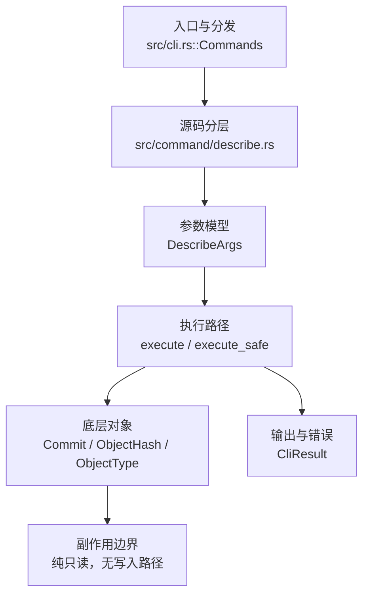

# `libra describe` 开发设计

## 命令实现目标

`libra describe` 的目标是根据可达 tag 为提交生成可读名称。当前实现刻意保持小而可验证的 Git 子集：支持 `[COMMIT]`、`--tags`、`--abbrev <N>`、`--always`、`--exact-match`、`--long`、`--dirty[=<mark>]`、`--first-parent`、`--match`/`--exclude`（wax glob，≤256 字符，exclude 优先于 match）、`--candidates <N>`（N=0 等价 exact-match）、`--all`（使用任意 ref：分支/远程跟踪/标签，带 `heads/`/`remotes/`/`tags/` 前缀）、`--contains`（git name-rev 反向包含查询：命名最近的「包含」目标的后代 tag，输出 `<tag>`/`<tag>~<n>`/`<tag>~<n>^<m>~<k>`）与 JSON 输出，并在无法描述时给出稳定错误。

## 对比 Git 与兼容性

- 兼容级别：`partial`。基础 describe、`--tags`、`--always`、`--abbrev`、`--exact-match`、`--long`、`--dirty[=<mark>]`、`--first-parent`、`--match`/`--exclude`、`--candidates <n>`（n=0 等价于 exact-match）和 `--all`（使用任意 ref：分支/远程跟踪/标签，分别以 `heads/`/`remotes/`/`tags/` 前缀显示）和 `--contains`（git name-rev 反向包含查询）已支持。

- 当前矩阵承诺常用 Git 行为已支持；新增语义必须同步矩阵、用户文档和测试。

## 设计方案

- 入口与分发：已公开接入 `src/cli.rs::Commands`；已由 `src/command/mod.rs` 导出。CLI 层在 `src/cli.rs` 把解析后的参数交给命令模块，命令模块负责把领域错误转换为 `CliError` / `CliResult`。
- 源码分层：主要实现文件为 `src/command/describe.rs`。参数/子命令类型包括：`DescribeArgs`；输出、错误或状态类型包括：`DescribeOutput`、`DescribeError`（均为 crate 私有，未 `pub` 导出），错误最终通过 `CliResult` 向上层命令统一传播；主要执行函数包括：`execute`、`execute_safe`。
- 执行路径：`execute_safe` 负责 CLI 安全包装、错误映射和输出配置；基础 describe 路径只读 refs、commit 与 tag 对象（经 `tag::list` / `load_object::<Commit>`）；启用 `--dirty[=<mark>]` 时会通过 `status` helper 读取 staged/unstaged tracked change 状态，但仍不会写入对象库、索引、refs/HEAD、reflog、SQLite 或远端。

- 流程图：以下流程图按当前源码分层展示主路径和底层对象边界，便于维护者把代码入口、执行函数和副作用范围对应起来。

- 底层操作对象：`Commit`（提交对象、父提交关系和提交消息载荷）；`ObjectHash`（SHA-1/SHA-256 对象 ID 和 revision 解析结果）；`ObjectType`（blob/tree/commit/tag 类型分派）
- 输出与错误契约：人类输出、`--json` / `--machine` 输出和 quiet/verbose 分支必须继续走现有 `OutputConfig` / `emit_json_data` / `CliError` 路径；新增失败模式要补稳定错误码、用户提示和回归测试。
- 副作用边界：凡是写入索引、对象库、refs/HEAD、reflog、SQLite/D1、工作树或远端的路径，都必须先完成参数校验和 dry-run/预检分支，再执行持久化，避免部分写入后静默成功。

## 实现历史

- 本节依据本地 main 分支提交历史重写，筛选与该命令实现、测试或文档路径直接相关的提交；以下是归纳后的实现脉络。
- 当前 `src/command/describe.rs` 实现 `[COMMIT]`、`--tags`、`--abbrev <N>`、`--always`、`--exact-match`、`--long`、`--dirty[=<mark>]`、`--first-parent`、`--match`/`--exclude` 与 `--json` 输出，基于一次有界 BFS 查找可达 tag；`--long` 会在精确匹配时输出 Git 兼容的 `tag-0-gHASH` 形式，并拒绝 `--long --abbrev=0`。`--first-parent` 在 BFS 中只跟随合并提交的第一个父；`--match`/`--exclude` 用 wax glob 过滤 tag 名（exclude 优先，模式 ≤256 字符，超长或非法模式以 `LBR-CLI-002`/129 拒绝）。2026-06-18 由 reconcile 丢失后恢复（原提交 0d12516/c543fae）。`--candidates <N>` 已实现（`N=0` 等价 `--exact-match`：`exact_match = args.exact_match || args.candidates == Some(0)`；`N≥1` 维持最近-tag BFS）。`--all` 已实现：将本地分支（`heads/<name>`）、远程跟踪分支（`remotes/<remote>/<name>`，远程名经 `remote.<name>.*` 配置枚举）与标签（`tags/<name>`，含轻量标签）一并加入候选 map 后复用同一 BFS；同一提交上标签优先、其次 heads、再次 remotes（`or_insert_with` 不覆盖已存在的标签项）。`--contains` 已实现（`run_describe_contains`）：从每个 tag commit 反向做 Dijkstra（first-parent 步权重 1，其它父权重 `MERGE_COST=65535`，故最近后代 tag 的最直路径胜出），命名目标为 `<tag>`/`<tag>~<n>`/`<tag>~<n>^<m>~<k>`；隐含含轻量 tag（`include_lightweight |= contains`）。seed 按 tag 名排序以保证等权重并列时输出确定。无后代 tag → 专用 `NoContainingTag`（提示创建/获取后代 tag，而非泛化的 `--tags`/`--always` 提示）。`--first-parent` 只跟随第一个父，故仅经第二父可达的提交无法命名。
- 历史结论：当前文档应以这些提交之后的代码、测试和兼容矩阵为准；更早的迁移式文档只保留为背景，不再作为事实来源。

## 当前状态

- 公开状态：已公开；模块状态：已导出。
- 用户文档：`docs/commands/describe.md`。
- Synopsis：`libra describe [OPTIONS] [COMMIT]`。
- 公开参数/子命令包括：`[COMMIT]`、`--tags`、`--all`、`--abbrev <N>`、`--always`、`--exact-match`、`--long`、`--dirty[=<mark>]`、`--first-parent`、`--match <pattern>`、`--exclude <pattern>`、`--candidates <N>`。
- `--candidates <N>`：`N=0` 等价于 `--exact-match`（仅当目标精确命中 tag 才输出，否则报 `no tag exactly matches`）；`N≥1` 维持当前最近-tag BFS 行为（不强制 Git 的候选数量上界，属有意子集）。实现复用既有 exact-match 路径（`exact_match = args.exact_match || args.candidates == Some(0)`）。

## 还未实现的功能

| 类别 | 未完成项 | 当前处理 |
|---|---|---|
| ✅ 已实现 | Find tags containing commit | `--contains`（git name-rev）。`run_describe_contains` 以 Dijkstra 从所有 tag commit 反向传播命名（first-parent 权重 1 / 其它父 65535），输出最近后代 tag 的 `<tag>~<n>^<m>` 形式；隐含含轻量 tag；seed 按 tag 名排序（确定性并列）；无后代 tag → `NoContainingTag`（contains 专用提示）。带集成测试 `test_describe_contains_names_relative_to_descendant_tag` + `test_describe_contains_merge_first_parent_and_lightweight`（合并 `^2`、轻量 tag、`--first-parent` 剪枝）。 |
| ✅ 已实现 | Consider N candidate tags | `--candidates <N>` 已公开：`N=0` 等价 `--exact-match`，`N≥1` 维持最近-tag BFS。带集成测试（`test_describe_candidates_zero_requires_exact_match`，覆盖精确命中、off-tag 失败、N≥1 正常、非整数拒绝）。 |
| ✅ 已实现 | Consider all refs | `--all` 已公开：将本地分支（`heads/`）、远程跟踪分支（`remotes/`）与标签（`tags/`，含轻量标签）加入候选 map 后复用同一 BFS，名称带 ref 前缀；同一提交上标签优先、其次 heads、再次 remotes。带集成测试（`test_describe_all_uses_branches_and_tags_with_prefix`）。 |

## 维护要求

- 改进本命令前，必须先阅读并遵循 [docs/development/commands/_general.md](_general.md)；这是命令设计、实现、测试和文档同步的强制要求。
- 任何行为变更都要先核对实现源码，再同步 `COMPATIBILITY.md`、`docs/commands/<cmd>.md` 和相关测试。
- 新增 Git 兼容参数时必须明确 tier、错误码、JSON/机器输出契约和回归测试。
