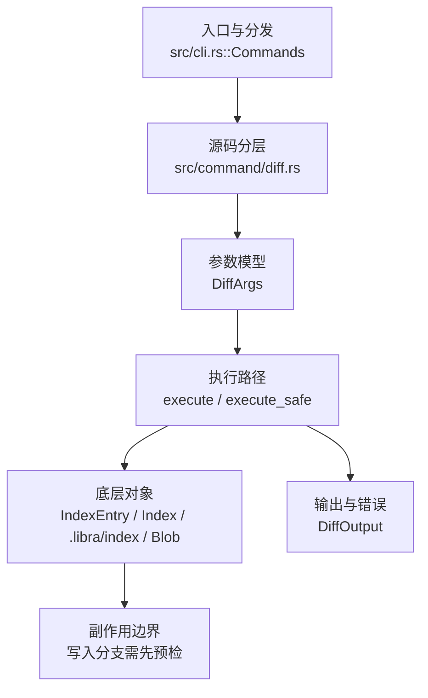

# `libra diff` 开发设计

## 命令实现目标

`libra diff` 的目标是比较提交、索引和工作区之间的内容差异。实现需要覆盖原始输出、相对路径、上下文行、空白忽略、word diff、rename/copy 检测、函数上下文和退出码，同时把二进制补丁、外部 diff 等能力列为差异项。

## 对比 Git 与兼容性

- 兼容级别：`partial`。staged/old-new/pathspec/name/stat/numstat/shortstat/summary/output/algorithm、`--exit-code`/`-s`(`--no-patch`)/`-z`(`--null`)/`-U<n>`(`--unified=<n>`，patch 上下文行数，默认 3；只改上下文不改 +/- 行，故 stat/name 计数不变，`--json` hunk 范围随之变化)/`-w`(`--ignore-all-space`，比较时忽略所有空白；仅空白变更不报告→该文件被丢弃，上下文取新一侧，受影响文件重新 diff 故 stat/name/numstat/JSON 均反映忽略空白结果，遵循 `-U<n>`)/`-b`(`--ignore-space-change`，只忽略空白数量：连续空白折叠为单空格+忽略行尾，空白有无仍重要)/`--ignore-space-at-eol`(只忽略行尾空白)/`--ignore-cr-at-eol`(只忽略行尾回车：CRLF↔LF-only 变更被丢弃；最弱空白 flag，被 `-w`/`-b`/`--ignore-space-at-eol` 优先；对 Git 的非传递 allow-one-remaining-CR 规则为「剥全部尾部 CR」近似（两条记录切分路径——主路径 str::lines() 已剥终止符 \r、ignore-blank raw-split 保留——在 strip-all 下等价同一行对；仅病态多 CR 结尾与 Git 有别），已文档化)/`--ignore-blank-lines`(忽略全空行变更：仅空白行的变更不报告→文件丢弃；距真实变更 `<ctxlen` 行的空行随之显示；忠实移植 Git `xdl_get_hunk` 的 blank-aware hunk 选择)/`--check`（在新增行检测尾随空白、indent 中 space-before-tab、leftover conflict marker、new blank line at EOF，发现即退出码 2）/`-R`(`--reverse`，交换两侧得到反向 diff)与位置性两点范围 `A..B`（`diff A..B`）已支持；`--no-ext-diff`（禁用本次运行的外部 diff 驱动，强制内建引擎）与 `--no-relative`（单独使用为 no-op：Libra 默认即仓库根相对路径；与 `--relative` 同时给出时优先，关闭相对输出）、`--no-indent-heuristic`（接受式 no-op：Libra 不使用 indent 启发式）与 `--no-renames`（关闭重命名检测，覆盖默认行为、`diff.renames` 与 `-M`）、`--no-color-moved`（关闭移动行着色，为默认且 countermand `--color-moved`）、`--no-textconv`（关闭 textconv；textconv 默认开启，此 flag countermand `--textconv`）已支持；`-M`/`--find-renames`（重命名检测，相似度与 Git 一致，见下表“已实现”）、`--color-moved[=<mode>]`（移动行着色，plain 语义，见下表“已实现”）与 `--textconv`（textconv 过滤器，默认开启，见下表“已实现”）已支持；`--ext-diff` / `diff.external`（外部 diff 驱动：按 Git GIT_EXTERNAL_DIFF 协议 `cmd path old-file old-hex old-mode new-file new-hex new-mode` 经 shell 调用，工作区新一侧 hash 报全零；`--no-ext-diff` 禁用、`--stat`/name/numstat/`-s`/`--check` 绕过）已支持；位置性修订已按 Git 文法公开（`resolve_positional_revisions`：`diff A`/`diff A B`≡`A..B`/胶合 `A..B`、`A...B`（merge-base，无共同祖先报 `NoMergeBase`）/`--staged <commit>`（range 或第二 rev 报 `StagedRevisionRange`）/`--` 分隔符（`after_dashdash` last=true + 裸尾随 `--` 的 argv 恢复）/Git 双歧义错误 `AmbiguousArgument`（rev 与文件同名且无 `--`）与 `UnknownRevisionOrPath`（既非 rev 又不存在，glob 魔法字符豁免）——均退出 129（LBR-CLI-002/003，Git 为 128，已文档化）；>2 个 rev 报 `TooManyRevisions`（Git≥2.38 的 merge combined-diff 形态为 declined）；给出 `--old`/`--new` 时位置参数保持 pathspec（Libra-only 宽松，无歧义走查））；word-diff 的 `--color-words`/`--word-diff-regex` 变体、indent 启发式（`--indent-heuristic`）尚未公开（`--word-diff[=<mode>]`、`--relative[=<path>]`、`-M`/`--find-renames`、`--color-moved`、`--textconv`、`--binary`/`-a`(`--text`) 已实现，见下）。

- 当前矩阵承诺常用 Git 行为已支持；P1-03 后，默认工作树 diff 只比较 index 中的 tracked 路径与工作树内容，未跟踪文件（包括未跟踪 `.libraignore`）不会进入 `--name-status` / `--numstat` / `--shortstat`，也不会影响 `--quiet` / `--exit-code`。新增语义必须同步矩阵、用户文档和测试。

## 设计方案

- 入口与分发：已公开接入 `src/cli.rs::Commands`；已由 `src/command/mod.rs` 导出。CLI 层在 `src/cli.rs` 把解析后的参数交给命令模块，命令模块负责把领域错误转换为 `CliError` / `CliResult`。
- 源码分层：主要实现文件为 `src/command/diff.rs`。参数/子命令类型包括：`DiffArgs`；输出、错误或状态类型包括：`DiffOutput`；主要执行函数包括：`execute`、`execute_safe`。
- 执行路径：`execute_safe` 负责 CLI 安全包装、错误映射和输出配置；索引路径会加载、比较、刷新或保存 `.libra/index`；对象路径会解析 revision 并读写 blob/tree/commit/tag 等对象；引用路径会读取或更新 SQLite refs、HEAD 与 reflog。

- 流程图：以下流程图按当前源码分层展示主路径和底层对象边界，便于维护者把代码入口、执行函数和副作用范围对应起来。

- 底层操作对象：`IndexEntry`（索引条目，承载路径、mode、object id 和 stat 元数据）；`Index` / `.libra/index`（暂存区状态、路径条目和刷新/保存边界）；`Blob`（文件内容或 LFS pointer 写入对象库后的 blob 对象）；`Commit`（提交对象、父提交关系和提交消息载荷）；`Tree`（由索引或对象遍历生成的目录树对象）；`Head`（SQLite 中的 HEAD 指向、当前分支和 detached 状态）；`ObjectHash`（SHA-1/SHA-256 对象 ID 和 revision 解析结果）；`ObjectType`（blob/tree/commit/tag 类型分派）
- 输出与错误契约：人类输出、`--json` / `--machine` 输出和 quiet/verbose 分支必须继续走现有 `OutputConfig` / `emit_json_data` / `CliError` 路径；新增失败模式要补稳定错误码、用户提示和回归测试。
- 副作用边界：凡是写入索引、对象库、refs/HEAD、reflog、SQLite/D1、工作树或远端的路径，都必须先完成参数校验和 dry-run/预检分支，再执行持久化，避免部分写入后静默成功。

## 实现历史

- 本节依据本地 main 分支提交历史重写，筛选与该命令实现、测试或文档路径直接相关的提交；以下是归纳后的实现脉络。
- 2025-11-29 `4a66aa45`（`feat(blame, diff): add blame support, bump the git-internal version (#70)`）：基础实现节点：add blame support, bump the git-internal version (#70)；当前实现的主要轮廓可追溯到该提交。
- 2026-06-05 `a9e6093e`（`feat(diff): add -W/--function-context hunk expansion`）：历史节点；`-W`/`--function-context` 当前并未在 `DiffArgs` 中公开，该行为已不在当前实现内。
- 2026-06-05 `45de394f`（`feat(diff): add --word-diff with plain/color and configurable regex`）：历史节点。`--word-diff[=plain|color|porcelain|none]` 现已在 `DiffArgs` 中公开并实现（见下方专门行）；`--color-words` 与 `--word-diff-regex` 仍未实现。
- 2026-06-07 `6ef353a3`（`fix(diff): close compatibility plan gaps`）：实现修正：close compatibility plan gaps；该节点把边界行为、错误处理或兼容差异纳入当前实现约束。
- 2026-07-09（plan-20260708 P0-06）：stdout 下游提前关闭时经全局入口与 `Pager` 输出层静默正常终止，不打印 panic/backtrace/`Broken pipe` 诊断。回归覆盖：`compat_broken_pipe_output`。
- 2026-07-09（plan-20260708 P0-11）：源码核对确认工作树 diff 的内容读取和文件集合会跟随/漏掉 symlink，特别是 dangling symlink 会被当作删除。当前工作树侧统一经 `read_worktree_blob_bytes` 读取 symlink target bytes，tracked symlink 文件集合用 `symlink_metadata` 判断存在。回归守卫：`compat_symlink_basic`。
- 2026-07-09（plan-20260708 P1-01）：`diff` pathspec 解析接入共享 `src/utils/pathspec/`；普通正向前缀仍下推到 diff engine 作为预过滤，带 magic/exclude 的 pathspec 先计算全量 diff 再按共享 matcher 过滤输出，覆盖 `top`/`exclude`/`icase`/`literal`/`glob`。回归覆盖：`compat_pathspec_magic`。
- 2026-07-09（plan-20260708 P1-03）：默认工作树 diff 的 new side 改为只遍历 index tracked paths（用 `symlink_metadata` 判断路径本身），不再把 untracked 纳入默认 diff；`--quiet`/`--exit-code`/`--name-status`/`--numstat`/`--shortstat` 因此与 Git 的默认 tracked 差异语义一致。回归覆盖：`compat_machine_porcelain_contract`。
- 2026-07-11（plan-20260708 P1-05d，diff 片 1/2）：`diff.context` 与 `diff.renames` 配置默认接入严格 local→global→system 级联（`resolve_diff_config` 在进度与扫描前一次解析，`read_diff_config`/`configured_diff_context`/`configured_diff_renames` 负责读取，新错误变体 `InvalidDiffConfig`→`LBR-CLI-002`（点名键）与 `DiffConfigRead`→`LBR-IO-001`，均在任何输出前 fail-closed）。`-U` 恒胜 `diff.context`（支持 Git k/m/g 整数，regen 门条件放宽为 `regen_context != 3`，unset≡3 行为不变）；`--no-renames`/`-M` 恒胜 `diff.renames`；`diff.renames` 真值以 50% 默认阈值启用、`copies`/`copy` 退化为普通重命名检测（无 `-C`）、**未设置按 Git 默认以 50% 阈值开启**。回归：`compat_config_defaults_semantics` 的 `diff_defaults::diff_context_config_cascades_accepts_git_integers_and_cli_wins`、`diff_defaults::diff_renames_defaults_to_git_and_config_cascades_with_cli_precedence` 与两条 stable-error/pre-progress 用例。既有不一致待后续：`diff.external`/`diff.<driver>.textconv` 仍走仅本地 `ConfigKv::get`（非级联）。同片订正 P1-03 漏更的两个陈旧测试（`test_diff_added_and_deleted_files_use_dev_null_headers`、`test_diff_after_init` 仍断言 untracked 出现在默认 diff——P1-03 已文档化地对齐 Git 语义将其排除；重写为 `--staged` 路径验证 `/dev/null` 头 + 空仓库默认 diff 为空）。
- 2026-07-11（P1-05d Codex 复审整改）：`diff.context` 收紧到 Git `int` 非负范围并覆盖 `INT_MAX`/`INT_MAX+1` 与后缀边界；`copies`/`copy` 无 CLI override 的真实分支纳入回归。默认 rename 的精确阶段改为 blob-id 索引，非精确阶段按侧缓存 blob；任一未匹配侧超过 1000 个文件时保留精确 rename、跳过二次方 pass 并告警。`diff.renames` 保持 porcelain-only，三个 plumbing 入口显式 `--no-renames` 并新增无效配置绕过回归。
- 2026-07-11（P1-05d 三轮复审整改）：精确 rename 的输出重建从逐文件 `Vec::position + remove` 改为 added-index 键控的 `HashMap::remove`，避免大量精确目录重命名的二次方尾部。`diff_rename_limit_test::diff_large_set_warns_and_preserves_exact_renames` 通过真实 CLI 覆盖 1001 个精确 rename + 1001 对非精确候选，锁定超限 warning 与精确 rename 保留语义；plumbing 的 EN/zh 用户文档同步明确 `--no-renames` 与 `diff.renames` 免疫。
- 2026-07-11（P1-05d 收口）：第四轮独立 Codex review PASS；fmt、全 targets/all features Clippy `-D warnings`、配置 44、plumbing 9、diff 64、大集合 1、文档 1/7 与 limit 单测全部通过，随 v0.18.57 发布。
- 2026-07-11（plan-20260708 P1-05d，diff 片 2/2，第四轮独立 Codex review PASS，随 v0.18.58 发布）：`diff.noPrefix` / `diff.mnemonicPrefix` / `diff.srcPrefix` / `diff.dstPrefix` 接入严格级联并在进度前解析。前缀策略按 Git 优先级 `noPrefix` > mnemonic > custom > `a/ b/`，`-R` 交换两侧；逐键级联允许 src/dst 来自不同 scope。渲染在 relative 后仅于首个 hunk 前精确改写内建 `diff --git`、`---`/`+++` 与 binary 行（含增删文件的 `/dev/null`），避免 word-diff 内容碰撞；rename from/to 保持无前缀，external diff 保持 verbatim。`staged_diff_text` 用于 `commit -v`，与 Git 一致强制内建 diff、传播配置错误。前三轮 Codex review 的 11 个 P1 已整改；第三轮新增的真实未合并 `diff --cc` 与空值/边界空格 verbatim 缺口已补回归，第四轮无新增发现。fmt、全 targets/all features Clippy `-D warnings`、配置 56、diff 64、plumbing 9、commit-editor 28、文档 1/7 与 CRLF 单测全绿。回归：`diff_prefix_defaults::*`、`diff_prefix_edges::*`、`commit_editor_test`。
- 历史结论：当前文档应以这些提交之后的代码、测试和兼容矩阵为准；更早的迁移式文档只保留为背景，不再作为事实来源。

## 当前状态

- 公开状态：已公开；模块状态：已导出。
- 用户文档：`docs/commands/diff.md`。
- Synopsis：`libra diff [--staged | --cached [<commit>]] [--old <COMMIT> --new <COMMIT>] [<commit> [<commit>]] [<commit>..<commit> | <commit>...<commit>] [--] [--stat | --numstat | --shortstat | --name-only | --name-status | --summary] [-U<n> | --unified=<n>] [-w | --ignore-all-space] [-b | --ignore-space-change] [--ignore-space-at-eol] [--ignore-blank-lines] [-s | --no-patch] [--exit-code] [--check] [-R] [-a | --text] [--binary] [--no-ext-diff] [--ext-diff] [--color-moved[=<mode>]] [--no-color-moved] [-M[<n>] | --find-renames[=<n>]] [--no-renames] [--no-relative] [--relative[=<path>]] [--no-indent-heuristic] [--textconv] [--no-textconv] [-z] [<pathspec>...]`。
- P0-01 后，默认工作区 diff 会从普通 diff 结果中移除 unmerged path 的 `/dev/null` 新增误报，并通过 `src/command/unmerged.rs` 追加 `diff --cc <path>` combined record；pathspec 会过滤该记录，缺工作树文件的删除类 unmerged 不会中止 diff。回归测试：`compat_conflict_status_diff`。
- P0-11 后，工作树 symlink 按 link target blob bytes diff：目标变化会以旧目标/新目标的文本差异显示，dangling symlink 不因目标不存在而进入删除分支。
- P1-01 后，pathspec 支持普通路径/目录前缀、默认通配符与 `:(top)` / `:(exclude)` / `:(icase)` / `:(literal)` / `:(glob)` magic；重命名条目按新路径或旧路径任一匹配保留。
- P1-03 后，默认机器输出只报告 tracked/index 与工作树之间的差异；未跟踪文件不出现在 `--name-status`/`--numstat`/`--shortstat`，也不会让 `--quiet` 或 `--exit-code` 失败。
- 公开参数/子命令包括：`--old <COMMIT>`、`--new <COMMIT>`、`--staged`（`--cached` 为 Git 兼容别名）、`[<pathspec>...]`、`--algorithm <NAME>`、`--output <FILENAME>`、`--name-only`、`--name-status`、`--numstat`、`--stat`、`-U<n>`/`--unified=<n>`（patch 上下文行数，默认 3；n≠3 时由 `rewrite_unified_diff_context`+移植的 `compute_unified_hunks`（`similar` Myers，context-参数化）重生成 hunk body、复用 git_internal 文件头，只改上下文不改 +/- 行（stat/name 计数不变，`--json` hunk 随之），二进制/大文件原样保留；零计数侧（纯增/删、新/删文件）锚定到该侧最后消费行以与 Git 对齐）、`-w`/`--ignore-all-space`（比较时忽略所有空白；`compute_unified_hunks_normalized` 归一化比较+发原始行+上下文取新一侧，空 body→丢弃该文件，`count_body_changes` 重算 +/- 计数；遵循 `-U<n>`）、`-b`/`--ignore-space-change`（`normalize_ignore_space_change`：折叠空白run为单空格+trim_end）与 `--ignore-space-at-eol`（`normalize_ignore_space_at_eol`：仅 trim_end）——同一 `ws_normalize: Option<fn(&str)->String>` 选择器复用 `-w` 的重新 diff/丢弃/重算管线，优先级 `-w`>`-b`>`--ignore-space-at-eol`>`--ignore-cr-at-eol`（`normalize_ignore_cr_at_eol`：`trim_end_matches('\r')` 剥全部尾部 CR，使 str::lines() 主路径与 raw-split ignore-blank 路径等价同一行对）、`--ignore-blank-lines`（`compute_unified_hunks_ignore_blank`：忠实移植 Git xdiff `xdl_get_hunk`——构建 change-group（记 i1/chg1/i2/chg2 与 `ignore`=全空行标志），prelude 丢弃距下一变更 `>=ctxlen` 的前导 ignorable 组，主循环按 `max_common=2*ctxlen`/`max_ignorable=ctxlen` 选择 lxch，再用非 funccontext 路径算 s1/s2/e1/e2 上下文并从新侧发出本体；空 body→丢弃文件（但纯空行内容的新增/删除文件仍以零计数+无 hunk 保留，匹配 git），复用 `count_body_changes` 重算计数；blank 判定：无空白 flag 时用原始记录逐字节空判定（`\r`-only CRLF 空行非空行，匹配 git）；任一空白 flag 复合时按 Git `xdl_blankline` 以「原始记录全空白」判 blank（对 -w/-b/eol 与旧的 normalize 后为空等价，对 cr-at-eol 修正了 `"  \r"` 应记 blank 的情形）；与空白标志复合（`compute_unified_hunks_ignore_blank_normalized`：在归一化视图上 diff+判 blank，发原始行），匹配 `git diff -w --ignore-blank-lines`）、`--shortstat`、`--summary`、`--exit-code`、`-s`/`--no-patch`、`-z`/`--null`、`--check`（`render_diff_check`：扫描每个文件 `raw_diff` 的新增行，按 hunk 头追踪新文件行号，对尾随空白/space-before-tab/leftover conflict marker/new blank line at EOF 报 `<path>:<line>: <msg>`，有问题则 `silent_exit(2)`；优先于其他输出模式）、`-R`/`--reverse`（在 `run_diff` 内交换 `old_side`/`new_side` 的 blobs 与 label 后再调 `Diff::diff`，加减号与 status 随之反转；loader 按 hash 内容寻址，交换后仍正确）、`-a`/`--text`（把所有文件按文本处理：跳过二进制检测，即便含 NUL 也输出内容 diff——见“还未实现的功能”表的 Binary diff 行）、`--binary`（对检测为二进制的文件输出 `GIT binary patch`，否则输出 “Binary files … differ”——同见 Binary diff 行）、`--no-ext-diff`（禁用本次运行的外部 diff 驱动 `diff.external`，强制内建引擎；字段 `no_ext_diff` 经此门控）、`--ext-diff`（启用已配置的 `diff.external` 外部驱动生成每文件 patch，配置后默认即启用，此 flag 为 `--no-ext-diff` 的显式反面；经 `apply_external_diff` 按 GIT_EXTERNAL_DIFF 协议运行，仅 patch 输出模式生效，`patch_body_is_shown` 门控）、`--color-moved[=<mode>]`（移动行着色：彩色输出中对“一处删除、另一处新增”的行着色——见“还未实现的功能”表的移动行着色行；plain 语义，块模式以 plain 近似；经 `color_moved_active` 校验+门控）、`--no-color-moved`（关闭移动行着色，为默认且 countermand `--color-moved`）、`--relative[=<path>]`（限定到某子目录并从所有显示路径剥离前缀——见“还未实现的功能”表的相对路径行）、`--no-relative`（单独使用为 no-op：Libra 默认即仓库根相对路径；与 `--relative` 同时给出时优先，关闭相对输出）、`-M[<n>]`/`--find-renames[=<n>]`（重命名检测：把 删除+新增 文件对折叠为单条重命名，相似度对真实内容与 Git 一致——见“还未实现的功能”表的重命名检测行；裸 `-M`=50%，clap `default_missing_value` 使裸 `-M` 与 glued `-M90` 皆可。注意裸 `-M`/`--find-renames` 后不能紧跟 pathspec）、`--no-renames`（关闭重命名检测，覆盖默认行为、`diff.renames` 与先前的 `-M`/`--find-renames`；字段 `no_renames` 经 `resolve_rename_threshold` 读取）、`--no-indent-heuristic`（接受式 no-op：Libra 不使用 Git 的 indent 启发式；字段解析后不被读取，对应正向 `--indent-heuristic` 未公开）、`--textconv`（textconv 过滤器，默认开启——见“还未实现的功能”表的 Textconv 行）、`--no-textconv`（关闭 textconv；textconv 默认开启，此 flag countermand `--textconv`）。`--shortstat` 只输出 `--stat` 的汇总行（零项省略）；`--exit-code` 仍打印 diff 但有差异时退出码为 1（区别于 `--quiet` 的静默）；`-s`/`--no-patch` 抑制 patch 主体（与 `--exit-code` 组合做状态检查）；`-z`/`--null` 对 `--name-only`/`--name-status`/`--numstat` 用 NUL 终止每条记录（且 `--name-status` 的状态与路径以 NUL 分隔、无尾随换行；由 `join_diff_records` 实现），其他模式不受影响。
- 位置修订解析：`resolve_positional_revisions`（可失败，取代旧 `normalize_diff_range`）实现 Git 文法 `diff [<revision>...] [--] [<path>...]`——胶合范围 `A..B`/`A...B`（三点走 merge-base，两侧均解析但无共同祖先报 `NoMergeBase`；含 `..` 且无法解析、但确为现存路径的记号仍作 pathspec）、裸修订 `diff A`/`diff A B`（≡`A..B`）/`--staged <commit>`（rev 赋给 `--old`，索引为 new 侧；range/第二 rev 报 `StagedRevisionRange`）、`--` 分隔符（`after_dashdash` last=true + 裸尾随 `--` 的 argv 恢复；`--` 后原样为路径、`--` 前必须为修订）与 Git 双歧义错误（`AmbiguousArgument`/`UnknownRevisionOrPath`，glob 豁免；均 129）。给出 `--old`/`--new` 时位置参数保持 pathspec（无修订走查）。

## 还未实现的功能

说明：下表中的 `-M` 是显式阈值入口；porcelain `diff` 默认按 50% 检测重命名，`diff.renames=false` / `--no-renames` 可关闭。精确匹配按 blob id 索引；任一剩余侧超过 1000 个文件时跳过非精确阶段并告警。三个 plumbing diff 命令不读取 `diff.renames`。

| 类别 | 未完成项 | 当前处理 |
|---|---|---|
| ✅ 已实现 | Summary | `--summary` 输出 create/delete/rename 的精简摘要（`format_diff_summary`→`summary_line` 解析各文件 raw diff 头 `new file mode`/`deleted file mode`，并对 `status=="renamed"` 输出 ` rename <old => new> (N%)`），格式与 `git diff --summary` 一致；纯内容修改不产生行，纯 mode 变更不暴露。重命名检测默认开启，可由 `diff.renames=false` 或 `--no-renames` 关闭；`-M`/`--find-renames` 可显式设置阈值。带集成测试（`test_diff_summary_lists_creates_and_deletes`）。 |
| ✅ 已实现 | Word diff `--word-diff[=<mode>]` | `apply_word_diff`→`word_diff_transform` 重写每个文件的 unified diff：保留头部/`@@`，把每个 hunk 重构为 old 侧（context+`-`行）与 new 侧（context+`+`行），用 `word_tokens`（空白分隔：换行/空白串/非空白词，匹配 git 默认分词，不支持 `--word-diff-regex`）+ `similar::TextDiff::from_slices` 逐词 diff，按 mode 渲染：`plain`（默认，`[-removed-]`/`{+added+}`，换行关闭标记并断行）、`color`（终端着色、无括号，经 `colored` 自动按 tty 门控）、`porcelain`（每 token 一行，` `/`-`/`+` 前缀 + `~` 换行标记）、`none`（常规行 patch）。无效 mode→129；`word_diff_active` 时 `render_diff_output` 跳过 `maybe_colorize_diff`（避免重复着色）。**有意差异**：(1) 与 git 语义/结构一致，但 token 分组在歧义（重复 token）场景可能不同——Myers 引擎差异，两者皆为合法最小 diff；(2) `@@` 头沿用 libra unified-diff 格式（count 恒输出，git 在 count=1 时省略）。差分验证 plain/porcelain/insert/suffix 与 git 逐字节一致。带集成测试 `test_diff_word_diff_modes`。 |
| ✅ 已实现 | Binary diff | 二进制检测 + `--binary`：`apply_binary_detection` 在 textconv 之后、上下文/空白 post-pass 之前运行——文件判为二进制当其内容 diff 含 NUL（`raw_diff.contains('\0')`，二进制内容必有、文本必无）**或** git_internal 已把它折叠为裸 `Binary files differ` 行（exact-match，对非 UTF-8 内容如此）；**重命名项**（`status=="renamed"`）的 body 经 lossy-UTF-8 重建、raw 信号不可靠，故改为扫描其原始 blob 字节（含 NUL 或非-UTF-8 即二进制），非重命名文本文件则用便宜的 raw 信号（不加载 blob）；textconv'd 文件跳过。默认（无 `--binary`）：保留 `diff --git`+mode+`index`（缩写 hash）头，body 换为 `Binary files <a> and <b> differ`（`<a>`/`<b>` 优先取自原 `---`/`+++` 行，裸 marker 形态无 `---`/`+++` 则按 status 退化为 `a/<old>`/`b/<new>`，新增/删除侧用 `/dev/null`）；`--stat` 显示 ` <name> | Bin <old> -> <new> bytes`、`--numstat` 显示 `-\t-\t<path>`、JSON 带 `binary:[old,new]`、insertions/deletions=0、hunks 空。`--binary`：index 行改写为**全量** hash（`binary_index_full`，git `--binary` 隐含 `--full-index`——对同一 diff 里的**文本文件也全量化**），追加 `GIT binary patch\nliteral <new_size>\n<base85>\n\nliteral <old_size>\n<base85>\n`（先 new 后 old，`git_base85` 为 git base85 行格式，`zlib_deflate` 经 flate2）。`--binary` 输出经 `binary_patch` 标志**逐字节渲染**（不 trim），保留每个 literal 后的空行终止符——故 `git apply` 接受（已验证 round-trip）。`-a`/`--text` 跳过检测（强制内容 diff）；`--check`/`diff.external` 激活时不检测。post-pass 对二进制（无 `@@`/`binary.is_some()`）跳过；`--relative` 经 `strip_relative_prefix_in_line` 一并剥离 `Binary files <a> and <b>` 行的前缀。**有意限制**：(1) `--binary` 的压缩字节与 git 不逐字节一致——flate2 deflate ≠ git zlib（已验证），且始终输出 `literal` 而非 git 的 literal/delta 取小；补丁仍有效可被 `git apply`；(2) 检测靠内容 diff 的 NUL 或裸 marker，故一个有效-UTF-8、内容含 NUL 但改动区不含 NUL（NUL 在被省略的上下文外）的文件可能被当作文本——少见的 documented 边缘；大文件 `<LargeFile>` marker 同理不检测；(3) `-a`/`--text` 对裸 marker（非 UTF-8）文件经 `force_text_for_bare_binary` 用 lossy-UTF-8 重 diff 强制内容——但 Libra 的 diff 引擎是基于 `str` 的，故字节不同但 lossy 后相同的内容（如 `\xfd` vs `\xfc` 均→U+FFFD）仍显示为 `Binary files differ`（无法忠实表示原始非-UTF-8 字节）。默认 “Binary files differ”/`--stat` `Bin`/`--numstat` `-`/`--binary` 全量 index 与真实 git 逐字节一致（缺省 `index` 缩写 hash 同 git）。带集成测试 `test_diff_binary`/`diff_text_flag_forces_content_for_binary`。 |
| ✅ 已实现 | 上下文行 | `-U<n>` / `--unified=<n>` 控制 patch 上下文行数（默认 3）。git_internal 的 `Diff::diff` 硬编码 3 上下文，故 n≠3 时由 `command::diff` 内移植自 git_internal 的 context-参数化汇编器（`compute_unified_hunks`，依赖 `similar`）重新生成每个文本文件的 hunk body，复用 git_internal 的文件头；+/- 行不变故 insertions/deletions 不变，仅上下文与重解析的 `hunks` 改变；二进制/大文件原样保留。`--stat`/`--name-only`/`--numstat` 计数不受影响，但 `--json` 的 hunk 范围/行随 `<n>` 变化。零计数侧（纯增/删与新/删文件）锚定到该侧最后消费行（`@@ -k,0`/`+k,0`、行首 `-0,0`/`+0,0`），与 Git 一致；移植的汇编器对任意 context 正确（含 0：`prefix_ctx` push-then-trim、阈值用 `saturating_mul`、不按 context 预分配以防大 `-U` OOM）。带集成测试（`test_diff_unified_context_controls_surrounding_lines` 覆盖 -U0/-U1/-U5/默认/`--unified=N`，`test_diff_unified_zero_context_anchors_pure_insert_delete` 覆盖纯增/删与新/删文件锚定）。 |
| ✅ 已实现 | Ignore whitespace | `-w` / `--ignore-all-space`：比较行时忽略所有空白。git_internal 的 `Diff::diff` 无空白参数，故在 `command::diff` 内对受影响文件重新 diff：`compute_unified_hunks_normalized` 用 `normalize_ignore_all_space`(去除全部空白)归一化后比较、但发出原始行（上下文取新一侧），空 body→该文件整体丢弃（含 `--name-only`/`--stat`/`--numstat`/JSON）；`count_body_changes` 重算该文件 +/- 计数。二进制/无 hunk 文件原样保留。遵循 `-U<n>` 的上下文宽度。`-b`/`--ignore-space-change`（`normalize_ignore_space_change`：折叠空白run为单空格+trim_end）与 `--ignore-space-at-eol`（`normalize_ignore_space_at_eol`：仅 trim_end）同样已实现，复用同一 `ws_normalize` 选择器与重新 diff 管线（优先级 `-w`>`-b`>`--ignore-space-at-eol`）。`--ignore-blank-lines` 亦已实现（`compute_unified_hunks_ignore_blank`：忠实移植 Git `xdl_get_hunk` 的 blank-aware hunk 选择——见上方公开参数说明）。空行判定：内容为字节空（或经空白归一化后为空）即为空行。带单元测试（`test_ignore_blank_lines_*`：far 前导空行抑制 `@@ -5,4 +6,4`、in-window 空行合并 `@@ -1,4 +1,5`、两变更夹空行、far change 无空行扩展、纯空行丢弃/ws 非空行、相邻多空行无真实变更、CRLF `\r` 非空行、`-w` 复合）与集成测试（含含 header 样文本的修改仍被丢弃、纯空行新增文件保留），并经随机 fuzz（含 `-w`/`-b`/`--ignore-space-at-eol` 复合，per-flag base gate）与真实 git 逐字节对照：所有**有尾随换行**文件零逻辑分歧。**已知限制（pre-existing，全 diff 模式共有）**：Libra 的 diff 仅按内容建模行、不跟踪行终止符，故不发出 Git 的 `\ No newline at end of file` 标记、无法识别仅终止符变化（`a\n` 与 `a` 视作相同）、也不模拟 Git 依赖终止符的 `xdl_blankline` `size<=1`（无换行末行的空行判定）。对**无尾随换行**文件，`--ignore-blank-lines` 可能与 git 有差异——`libra diff`/`-w`/`-U<n>` 同样如此（根因在 git_internal 层）。该 flag 对 Libra 所建模的有尾随换行文件完全忠实。 |
| ✅ 已实现 | External diff tool | `diff.external` + `--ext-diff` / `--no-ext-diff`：`run_diff` 在 patch 输出模式（`patch_body_is_shown`）且未 `--no-ext-diff` 且配置了 `diff.external` 时，经 `apply_external_diff` 对每个文件按 Git GIT_EXTERNAL_DIFF 协议（`cmd path old-file old-hex old-mode new-file new-hex new-mode`，经 `sh -c '<cmd> "$@"'` 运行）以命令 stdout 替换 patch；缺失侧用 `/dev/null`+`.`，工作区一侧 hash 全零、mode 直接从磁盘读取（symlink→120000/可执行→100755/否则 100644，准确）；树/索引侧 mode 取自内部 patch 头（`index <o>..<n> <mode>` 或 mode-change 头）——**注意 Libra 内建 diff 对可执行树条目的 index 行当前渲染为 100644，故树侧 mode 可能少报可执行位，这是内建 diff 的既有限制、非外部驱动特有**；驱动非零退出为 fatal（带 stderr）；`--json`/`--quiet`/非 patch 模式绕过；输出 verbatim（跳过 trim/着色/补行尾 与 word-diff/relative 重写，但 `--relative` 仍在调用前按前缀过滤文件集）；每次调用设 `GIT_DIFF_PATH_COUNTER`/`GIT_DIFF_PATH_TOTAL`。带集成测试 `test_diff_external_driver_replaces_patch`/`test_diff_external_driver_gating_and_failure`。 |
| ✅ 已实现 | 移动行着色 | `--color-moved[=<mode>]`：彩色输出中对“移动行”（一处 `-` 删除、另一处 `+` 新增的相同内容）着色——删除→粗体洋红（git `oldMoved`，`1;35`）、新增→粗体青（git `newMoved`，`1;36`）。`color_moved_active` 校验 mode（no/default/plain/blocks/zebra/dimmed-zebra；非法→`LBR-CLI-002`）并门控；`moved_line_bodies` 取 `-`/`+` 行体的交集为移动集，`colorize_diff` 据此对移动行改用移动色。**有意差异**：(1) 仅实现 git 的 `plain` 语义——对所有移动行着色；裸 `--color-moved`/`default`/`zebra`/`blocks`/`dimmed-zebra` 均以 plain 近似，不实现 git 保守的移动块显著性/zebra 条带（git 的 zebra 即便对清晰的跨 hunk 移动块也常不着色，其 pmb 显著性规则不透明、难以逐字节复刻）；(2) 颜色 ANSI 经 `colored` crate（reset `\e[0m` 而非 git 的 `\e[m`），与 libra 既有着色一致、与 git 字节不同。**附带修复**：着色门控此前用 `io::stdout().is_terminal()`，忽略 `--color=always`（管道时无色）；改为遵循 `OutputConfig.color`（Always→开、Never→关、Auto→is_terminal），使 `libra diff --color=always \| pipe` 正确着色（含移动色）。带单元测试 `test_color_moved_uses_distinct_colors` 与集成测试 `test_diff_color_moved`。 |
| ✅ 已实现 | 重命名检测 | `-M[<n>]` / `--find-renames[=<n>]`：`resolve_rename_threshold` 解析阈值（裸 `-M`=50%、`-M<n>`/`-M<n>%`/`--find-renames=<n>` 设定；clap `default_missing_value="50"` 使 glued `-M90` 与裸 `-M` 皆可），`apply_rename_detection` 在 `run_diff` 内（post-pass 前）把 删除+新增 文件对折叠为单条重命名：先精确（同 blob id=100%）后非精确（`similarity_score` 按降序贪心配对、每侧一次）；阈值=MAX_SCORE（`-M100%`）时跳过非精确 pass——与 Git 一致，仅精确重命名（故 100% 相似但内容不同的重排行在 `-M100%` 下显示为 add+delete）。**相似度对真实内容与 Git 一致**：`spanhash_counts` 按 Git rename spanhash 分块（遇换行或满 64 字节即成块、文本侧忽略 `\r\n` 的 `\r`），用 FNV-1a（非 Git 较弱的 `HASHBASE` 滚动哈希）哈希每块累加字节数，`score = 公共块字节 * 60000 / max(两侧大小)`、显示 `percent = score/600`；相等块恒匹配、FNV 碰撞概率极低，故真实内容相似度与 Git 相同，但专门构造为在 Git 哈希下碰撞的输入可能不同。阈值在 `parse_rename_score` 内用整数运算（与 Git 一致的截断，无浮点取整）。渲染：`build_rename_entry` 输出 `diff --git a/old b/new`+`similarity index N%`+`rename from/to`，当 blob 字节不同时再附内容 diff（`index <o7>..<n7> 100644`+`--- a/old`+`+++ b/new`+`compute_unified_hunks`）——即便相似度 100%（重排行）也输出 body，仅字节相同的重命名无 body，与 Git 一致；`--name-status` 输出 `R<score3>`+old+new（`-z` 时各以 NUL 分隔）、`--numstat` 输出 `ins\tdel\t<old => new>`（`-z` 时 `ins\tdel\t\0old\0new`）、`--summary` 输出 ` rename <old => new> (N%)`、`--stat` 路径列同用 `old => new`——其中 stat/numstat/summary 经 `rename_display` 套用 Git `pprint_rename` 的目录花括号压缩（`src/{old.txt => new.txt}`，前后缀均按 `/` 边界切分）。阈值解析 `parse_rename_score` 忠实移植 Git：`<n>%`=字面百分比、含 `.` 的 `<n>`=字面小数（`0.9`=90%）、裸整数读作隐含 `0.` 后的小数位（`-M5`=50%、`-M90`=90%、`-M100`=10%），非法值报 `LBR-CLI-002`（“invalid argument to find-renames”）。post-pass（空白/上下文重 diff）跳过 `status=="renamed"` 项，重命名的内容 diff 由 `build_rename_entry` 按当前 `-U<n>`/`-w`/`-b`/`--ignore-blank-lines` 选择器生成（仅空白差异→空 body→只出 rename 头）；纯重命名（0 改动）stat 显示 `name | 0`（修正空 graph 的尾随空格）；`diff.external` 下重命名的 old 侧按 `rename_from` 取内容。**有意限制**：(1) 重命名 `index` 行 mode 恒为 `100644`、不发出 mode-change 头——与 Libra 内建 diff 不跟踪/暴露 mode 变更一致（pre-existing）；(2) 非精确配对用 score 降序贪心 + 同 basename 平局；Git 的 diffcore-rename 在分值矩阵之前先做 basename 预配对（`find_basename_matches`，可能优先选用分值**更低**的同名配对），故对**多重命名集**，Libra 选出的 old/new 配对与对应 patch body 可能与 Git 不同——不限于等分歧义；(3) 分块哈希用 FNV-1a 而非 Git 的 `HASHBASE`，故构造的哈希碰撞输入可能改变相似度（真实内容一致）；(4) 裸 `-M` 后不能紧跟 pathspec（会被当作分值），pathspec 需置于 `-M` 之前或 `--` 之后（clap 对可选值短选项的限制：保留 Git 的 glued `-M90` 与禁止吞掉后续 token 二者不可兼得，取前者）。带集成测试 `test_diff_rename_detection_surfaces`/`test_diff_rename_threshold_and_no_renames`，并与真实 git 逐字节对照 name-status/numstat/stat/summary（含 `-z` hexdump 与花括号压缩）。 |
| ✅ 已实现 | 相对路径 | `--relative[=<path>]` 已实现：`apply_relative_filter` 在 `run_diff` 之后、渲染之前，按目录前缀（`=<path>` 经 `to_workdir_path` 解析为仓库根相对；裸 `--relative` 用 cwd）过滤文件并从所有显示路径剥离前缀（`file.path` + raw_diff 的 `diff --git`/`---`/`+++`/`rename|copy from|to` 行 → 进而影响 `--stat`/JSON/create-delete-mode 摘要），并重算 totals；`--no-relative`（接受式 no-op，并优先于 `--relative`：两者同时给出时关闭相对输出）与 cwd 位于仓库根时为 no-op。与 git 差分验证（`--relative=sub`/`sub/deep`/cwd/`--stat`）。带集成测试 `test_diff_relative_filters_and_strips_prefix`。 |
| 部分实现 | Indent 启发式 | `--no-indent-heuristic` 作为接受式 no-op 已公开（Libra 不使用 Git 的 indent 启发式）；`--indent-heuristic` 仍不支持。 |
| ✅ 已实现 | Textconv | `--textconv`（默认开启，`--no-textconv` 关闭）：`utils::attributes::diff_driver_for_path` 从 `core.attributesFile`、逐目录 `.gitattributes`、`.libra_attributes` 和 `.git/info/attributes` 解析 `diff=<driver>` 模式（同目录 `.libra_attributes` 覆盖 `.gitattributes`，last-match-wins，`-diff`/`!diff`/裸 `diff` 会清除先前 driver）；`ConfigKv::get("diff.<driver>.textconv")` 取转换命令；`apply_textconv` 对命中文件用 `run_textconv`（把 blob 内容写临时文件、`sh -c '<cmd> "$@"' <cmd> <tmpfile>`、stdout 为转换后文本；temp/spawn/非零退出均为 fatal 错误 `LBR-IO-001`，与 git「unable to read files to diff」一致——不静默回退原始内容）转换两侧，再以 `compute_unified_hunks`(遵循 `-U<n>`/`-w`/`-b`/`--ignore-blank-lines`) 重 diff 转换后内容、`splice_unified_body` 替换 patch body、`count_body_changes` 重算计数；转换后内容相同的修改被丢弃（含纯增/删保留），与 Git 一致。stat/numstat/name/JSON 均反映转换后内容（与 git `diff` 一致；plumbing 的默认关闭不适用，Libra `diff` 为 porcelain）。`run_diff` 中在 rename 检测之后、上下文/空白 post-pass 之前应用，记录 `textconv_paths` 让 post-pass 跳过。重命名项也被 textconv：其 old 侧按 `rename_from` 取内容、转换后重 diff 并 `splice_unified_body` 替换 body（保留 `similarity`/`rename from`/`to` 头）；转换后内容相同时保留 header（不丢弃）。blob 读取失败按错误上抛（不当作空内容）。驱动按**每侧**解析：重命名的 old 侧用 `rename_from` 路径的 driver、new 侧用 `file.path` 的 driver（与 Git 按 blob/path 解析一致），某侧无 driver 则该侧用原始内容；缺失侧（新增/删除的另一侧）保持空、不喂入 textconv（避免转换器对空输入伪造 hunk）。精确重命名（无 content hunk）若两侧转换后不同（跨 driver），合成 `index`/`---`/`+++`+hunk 接到 rename 头之后。**AI-VCS 安全**：`run_libra_vcs diff` 因 textconv 与 `diff.external` 默认开启、二者均可执行配置的 shell 命令，故仅在 `--` 之前同时带 `--no-textconv` 与 `--no-ext-diff` 时算只读，否则需人工审批（`libra_vcs.diff_default_filters`；`--ext-diff`/`--output` 仍 Deny）。**有意限制**：`--check` 与 `diff.external` 激活时不应用（前者扫原始新增行、后者优先）。与真实 git（`.gitattributes`+`diff.<driver>.textconv`）逐字节对照 body 与 `--stat` 一致；failing textconv、`-diff` 清除、跨 driver 重命名均经 `test_diff_textconv` 覆盖，Git/Libra attributes 来源扩展经 `compat_ignore_attributes_sources` 覆盖。 |

## 维护要求

- 改进本命令前，必须先阅读并遵循 [docs/development/commands/_general.md](_general.md)；这是命令设计、实现、测试和文档同步的强制要求。
- 任何行为变更都要先核对实现源码，再同步 `COMPATIBILITY.md`、`docs/commands/<cmd>.md` 和相关测试。
- 新增 Git 兼容参数时必须明确 tier、错误码、JSON/机器输出契约和回归测试。
