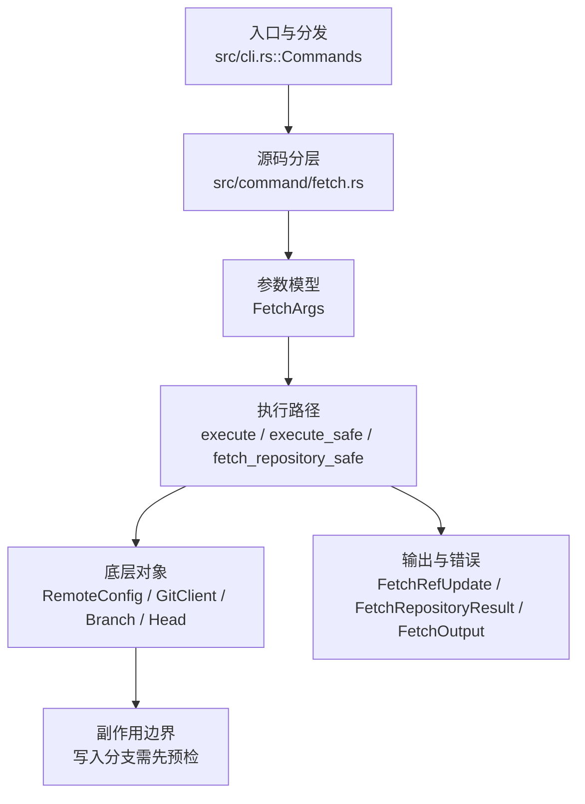

# `libra fetch` 开发设计

## 命令实现目标

`libra fetch` 的目标是从远端下载对象和 refs，并按 refspec、FETCH_HEAD、tag 策略、浅边界和 dry-run/porcelain 规则更新本地状态。实现需要支持 ref 更新原子回滚、prune、force、append 和远端诊断，同时避免网络/pack 流处理出现静默失败；独立的 `--atomic` / `--refmap` 选项仍为延后 surface。

## 对比 Git 与兼容性

- 兼容级别：`partial`。repository/refspec（短 source、精确 `<src>:<dst>`、单通配符配置映射）与大小写不敏感的 `remote.<name>.fetch`、`--all`、`--depth`（Git shallow 协商路径支持；本地 Libra remote fail-closed，`LBR-REPO-002`）、`--dry-run`、`-v/--verbose`、`--porcelain`、`--tags`/`--no-tags`、`--prune`/`-p`/`--no-prune` 以及 `FETCH_HEAD` 写入与 `--append` 已公开；`--refmap`、`--atomic` 与 shallow 扩展参数（`--shallow-since` / `--shallow-exclude` / `--update-shallow`）仍未公开。`--prune`/`-p` 在 fetch 完成后按有效 refspec 展开的 tracking destination（一次性显式 refspec 也保留当前配置映射与普通 advertised 范围）分类并删除非存活的 `refs/remotes/<remote>/*`；删除 + 审计 reflog 在单事务内，失败回滚；`--dry-run` 只预览不写；远端 advertise 空 refs 时跳过；本地分支、tag、`refs/remotes/<remote>/HEAD` 与其它远端不受影响。`--prune`/`--no-prune` 为 last-one-wins toggle，并覆盖 Git 兼容的 `remote.<name>.prune` → `fetch.prune` 配置默认（严格 local→global→system 级联；未配置默认 false，与 Git 出厂一致；无效值 `LBR-CLI-002`、local/global 读取失败 `LBR-IO-001`，均在联网前 fail-closed，`--all` 时先校验所有远程再开始第一个 fetch）。

- 当前矩阵承诺常用 Git 行为已支持；新增语义必须同步矩阵、用户文档和测试。

## 设计方案

- 入口与分发：已公开接入 `src/cli.rs::Commands`；已由 `src/command/mod.rs` 导出。CLI 层在 `src/cli.rs` 把解析后的参数交给命令模块，命令模块负责把领域错误转换为 `CliError` / `CliResult`。
- 源码分层：主要实现文件为 `src/command/fetch.rs`。参数/子命令类型包括：`FetchArgs`；输出、错误或状态类型包括：`FetchRefUpdate`、`FetchRepositoryResult`、`FetchOutput`、`RemoteSpecErrorKind`、`FetchError`；主要执行函数包括：`execute`、`execute_safe`、`fetch_repository_safe`。
- 源码意图：源码模块注释说明该命令负责远端协商、下载 pack、更新 remote-tracking refs，并处理 prune/depth 选项。
- 执行路径：`execute_safe` 负责 CLI 安全包装、错误映射和输出配置；核心领域逻辑集中在 `fetch_repository_safe`；对象路径会解析 revision 并读写 blob/tree/commit/tag 等对象；引用路径会读取或更新 SQLite refs、HEAD 与 reflog；网络路径会解析 remote 配置、协商协议并处理 pack/idx 数据；数据库路径会通过 SeaORM/SQLite 或 D1 客户端持久化元数据。

- 流程图：以下流程图按当前源码分层展示主路径和底层对象边界，便于维护者把代码入口、执行函数和副作用范围对应起来。

- 底层操作对象：`RemoteConfig`（remote URL、refspec 和凭据配置）；`GitClient` / protocol client（Git wire 协议协商）；SSH transport（SSH remote 连接和认证）；HTTPS transport（HTTP(S) remote 连接和认证）；pack / idx 对象（传输包、索引、delta 和完整性校验）；`Branch` / branch store（SQLite refs 上的分支读写、过滤和上游关系）；`Head`（SQLite 中的 HEAD 指向、当前分支和 detached 状态）；`ReflogContext` / `with_reflog`（SQLite reflog 写入和动作记录）；`ObjectHash`（SHA-1/SHA-256 对象 ID 和 revision 解析结果）；`Commit`（提交对象、父提交关系和提交消息载荷）；SeaORM / `.libra/libra.db`（配置、refs、reflog、AI/发布元数据等 SQLite 表）；Vault/libvault（身份、密钥或 vault-backed 签名边界）
- 输出与错误契约：人类输出、`--json` / `--machine` 输出和 quiet/verbose 分支必须继续走现有 `OutputConfig` / `emit_json_data` / `CliError` 路径；新增失败模式要补稳定错误码、用户提示和回归测试。
- 全局配置 schema 保护（P0-12）：CLI dispatch 前通过 `utils::client_storage::inspect_global_config_schema_future` 检查 `~/.libra/config.db` / `LIBRA_CONFIG_GLOBAL_DB`。`fetch` 默认把 future schema 视为 fail-closed 配置错误，返回 `LBR-CONFIG-001`（category `config`，exit 128），避免静默忽略全局 tiered storage 配置；`--offline` 或 `LIBRA_READ_POLICY=offline|local` 明确降级时仅 warning 一次并继续本地对象访问。诊断必须包含二进制路径、二进制版本、配置 DB 路径、当前/支持的 schema 版本和升级命令，且不得泄露 `vault.env.*` secret。回归测试：`compat_global_config_schema_future`。
- 副作用边界：凡是写入索引、对象库、refs/HEAD、reflog、SQLite/D1、工作树或远端的路径，都必须先完成参数校验和 dry-run/预检分支，再执行持久化，避免部分写入后静默成功。

## 实现历史

- 本节依据本地 main 分支提交历史重写，筛选与该命令实现、测试或文档路径直接相关的提交；以下是归纳后的实现脉络。
- 2026-04-06 `30bed711`（`feat(remote): land batch-5 remote and fetch UX (#341)`）：基础实现节点：land batch-5 remote and fetch UX (#341)；当前实现的主要轮廓可追溯到该提交。
- 2026-06-05 起 `a501ddd` / `2c2ad76` / `10d8744` / `470e275`（`feat(fetch): --dry-run` / `-v,--verbose` / `--porcelain` / `FETCH_HEAD + --append`）：这些本地（不依赖 shallow/tag/prune 子系统）的参数在一次 reconcile 中被误丢。2026-06-18 已在当前（已分叉、回退过的）fetch 代码上重新恢复：`--dry-run`（仅基于发现的 refs 预览 remote-tracking 更新，不下载、不写入）、`-v/--verbose`（stderr 公告远端）、`--porcelain`（拒绝与 `--json` 同用）、`FETCH_HEAD` 写入与 `--append`。
- 2026-06-05 `7d75d886`（`feat(fetch): add --refmap to override fetched-ref destinations`）：历史节点：曾尝试新增 `--refmap`；当前 `FetchArgs` 仍未公开该参数——它依赖回退过的 `ShallowOptions`/refspec 映射基础设施，属于 deferred。
- 2026-06-05 `b005e9ee`（`feat(fetch): add --atomic with rollback pack cleanup`）：历史节点：曾尝试新增 `--atomic`；当前 `FetchArgs` 仍未公开该参数——它依赖回退过的多步事务/pack 回滚基础设施，属于 deferred。
- 2026-06-05 起 `479cd0b` / `916edc2` / `5a05f0f`（`--shallow-since/--shallow-exclude` / `--update-shallow` / `-f,--force`）：历史节点；shallow 扩展仍未公开（依赖回退过的 `ShallowOptions` 浅边界基础设施）；`-f/--force` 与 `--tags`/`--no-tags` 此后均已重新落地（force 见「当前状态」`-f`/`--force` 条目；tags 见 PR-10a）：发现层保留 `refs/tags/*`，`current_have_safe` 把本地 tag（含 annotated peel）纳入 `have` 以避免重复下载，`update_references` 以 `kind=Tag` 落库（create-if-absent，不强制覆盖）。
- 2026-06-07 `b21dc6fd`（`fix(fetch): close compatibility plan gaps`）：实现修正：close compatibility plan gaps；该节点把边界行为、错误处理或兼容差异纳入当前实现约束。
- 2026-07-09 P0-03：`fetch_repository_with_result` 在 remote discovery 后、对象请求前拒绝本地 Libra remote 的 `--depth`（`FetchError::UnsupportedShallowLocalLibra` → `LBR-REPO-002`），因为该路径当前会截断 commit walk 但不能返回 `shallow <oid>` 边界；测试 `compat_clone_shallow_integrity::fetch_depth_from_local_libra_remote_fails_before_shallow_metadata`。
- 2026-07-11（plan-20260708 P1-05c）：`fetch.prune`/`remote.<name>.prune` 配置默认接入。CLI 意图三态化（`--prune`→Some(true)、`--no-prune`→Some(false)、未给→None），`resolve_prune_mode` 在两个调用点（单远程与 `--all` 循环）于联网前解析生效值；`configured_fetch_prune` 按「远程作用域优先」顺序经 `read_cascaded_config_value_strict` 读取，无效值 `LBR-CLI-002`、读取失败 `LBR-IO-001`。`fetch_repository_with_result` 签名保持 `prune: bool`。同片订正 doc-truth：`--prune` clap help 的「Before fetching」改为「After the fetch」（实现自始为 fetch 后修剪）；用户文档 FETCH_HEAD 补 tag 行形态、JSON schema 补 `forced` 与 `pruned[]` 字段、prune 行补 `refs/mr/*`、「Git ships fetch.prune=true」误导表述改写；zh-CN fetch.md 全量重写至与 EN parity（此前声称 `--prune` 未公开且缺 9 个选项与 4 个章节）。布尔解析用共享 `internal::config::parse_git_config_bool`（`git_config_bool` 语义：true/yes/on 与任意非零整数（含 k/m/g 后缀）为真、false/no/off 与 0 为假、空值按 P1-05 族约定拒绝），并同步接入 merge/commit（`history_config`）与 pull 读取器。回归：`compat_config_defaults_semantics` 新增 7 个 fetch-prune 用例——`fetch_prune_config_removes_stale_tracking_ref_without_cli_flag`、`remote_scoped_prune_config_overrides_fetch_prune`、`remote_scoped_prune_wins_across_scopes`、`fetch_cli_prune_flags_override_configured_prune`、`fetch_prune_accepts_git_numeric_booleans`、`fetch_prune_invalid_config_fails_before_fetch`、`fetch_all_invalid_prune_config_fails_before_any_fetch`——另有 `pull_rebase_accepts_git_numeric_boolean`；`compat_config_history_defaults` 新增 `history_defaults_accept_git_numeric_booleans_and_keep_only`。
- 2026-07-13（plan-20260708 P1-06）：新增 `FetchRefspec`/`FetchRefPlan` 解析与映射层。显式 refspec 只请求并更新指定 source，`<src>:<dst>` 精确写目标；未显式指定时大小写不敏感地读取多值 `remote.<name>.fetch`（支持每侧一个匹配 `*`），没有配置才走所有 heads/mr 的默认 tracking 映射。多目标 ref + reflog + remote HEAD 在同一事务内，非 FF 需 `+`/`--force`，任一 worktree checkout 的本地目标分支拒绝写入；prune 按映射后的 tracking destination 判断存活，完整 fetch 会删除默认 source 已不再映射的 stale remote HEAD；`FETCH_HEAD` 记录全部选中 source（含 up-to-date），普通 fetch 不碰 `ORIG_HEAD`。回归：`compat_fetch_remote_refspec`。
- 历史结论：当前文档应以这些提交之后的代码、测试和兼容矩阵为准；更早的迁移式文档只保留为背景，不再作为事实来源。

## 当前状态

- 公开状态：已公开；模块状态：已导出。
- 用户文档：`docs/commands/fetch.md`。
- Synopsis：`libra fetch [OPTIONS] [<repository> [<refspec>]]`。
- refspec 当前语义（P1-06）：短 source 归一为 `refs/heads/<name>`；显式 `<src>:<dst>` 覆盖配置；无显式 refspec 时大小写不敏感地读取 `remote.<name>.fetch`，支持精确与单通配符映射。目标限于内部可无损表达的 `refs/heads/*` 与 `refs/remotes/<remote>/*`；tag 目标由 `--tags` 管理，其它命名空间 fail-closed。重复的完全相同映射去重，不同 source 竞争同一 destination 时拒绝。`FetchRefUpdate.remote_ref` 是实际本地目标，JSON key-set 不变。
- 公开参数/子命令包括：`[<repository>]`、`[<refspec>]`、`-a, --all`、`--depth <N>`（Git shallow 协商路径支持；本地 Libra remote 在对象传输前返回 `LBR-REPO-002`，不写 `.libra/shallow` / refs / FETCH_HEAD）、`--dry-run`、`--append`、`-v, --verbose`、`--porcelain`、`--tags`、`--no-tags`、`--no-auto-gc`（接受式 no-op：Libra 的 fetch 从不触发自动 gc，故无可禁用；字段 `no_auto_gc` 在解构 `FetchArgs` 时以 `_` 绑定、不被读取）、`--no-progress`（**实际生效**：经 `apply_no_progress` 把 `OutputConfig.progress` 强制为 `ProgressMode::None`（并 `progress_preference=None`）后再下传，从而抑制 `read_fetch_stream` 的 “Receiving objects” 进度 spinner 与 NDJSON 进度事件，对齐 `git fetch --no-progress`；带单元测试 `apply_no_progress_forces_progress_mode_off`）、`-p, --prune`（**实际生效**：fetch 后按有效 refspec 展开得到的 `refs/remotes/<remote>/*` destination 集合，经 `classify_stale_tracking_branches`（与 `remote prune` 共用）找出不再存活的 tracking refs；一次性显式 refspec 额外保留普通 full-remote advertise 范围与其自定义 destination。`prune_stale_remote_refs` 在单事务内逐条写审计 reflog（`<old> -> 0…0`，`ReflogAction::Fetch`）再删除，失败整体回滚；`pruned` 结果进入 human/porcelain/JSON 输出。`--dry-run` 只 classify 不删；远端 advertise 空 refs 时整体跳过 prune）、`--no-prune`（显式关闭修剪并覆盖配置默认；`--prune`/`--no-prune` 经 clap `overrides_with` 组成 last-one-wins toggle，二者均未给出时按 `remote.<name>.prune` → `fetch.prune` 配置默认解析，见下）。
- prune 配置默认（P1-05c，**实际生效**）：`resolve_prune_mode(remote, prune_cli)`——CLI 三态优先；否则 `configured_fetch_prune` 依次读 `remote.<name>.prune`、`fetch.prune`（`read_cascaded_config_value_strict`，local→global→system，大小写不敏感、加密值解密、legacy 行回退、system 不可读跳过），命中即按 `parse_git_config_bool` 解析（true/yes/on 与任意非零整数含 k/m/g 后缀为真、false/no/off 与 0 为假、空值拒绝），无效值 `LBR-CLI-002` + hint、读取失败 `LBR-IO-001`，都发生在联网前；两键皆未设→false（Git 出厂默认）。`--all` 路径先对全部远程解析（任一无效在第一个 fetch 前失败），单远程路径在 `fetch_repository_with_result` 调用前解析；函数签名保持 `prune: bool` 不变。测试（`compat_config_defaults_semantics` 共 7 个 fetch-prune 用例）：`fetch_prune_config_removes_stale_tracking_ref_without_cli_flag`（local+global 级联）、`remote_scoped_prune_config_overrides_fetch_prune`、`remote_scoped_prune_wins_across_scopes`（GLOBAL remote 键胜 LOCAL fetch.prune，双向）、`fetch_cli_prune_flags_override_configured_prune`、`fetch_prune_accepts_git_numeric_booleans`（`fetch.prune=2` 真、`remote.origin.prune=0k` 假且胜出）、`fetch_prune_invalid_config_fails_before_fetch`（两键、129、tracking ref 不前进）、`fetch_all_invalid_prune_config_fails_before_any_fetch`（`--all` 预校验）。
- tag 处理（每 remote 解析：CLI flag > `remote.<name>.tagOpt` > 默认 **auto-follow**）。默认 auto-follow：协商时发送 `include-tag` capability，fetch 后把「对象/目标已落本地」的远端 tag 持久化到共享 `refs/tags/*`（lightweight 看 commit 是否到位，annotated 看 tag 对象是否经 include-tag 到位）。`--tags` 抓全部远端 tag（显式 `want` `refs/tags/*`）；`--no-tags` 一个都不抓。本地已存在同名 tag 时 create-if-absent / 相同跳过 / 不同则跳过并 warning，`-f`/`--force` 时 clobber。tag 不写 reflog。
- `-f` / `--force`：允许非 fast-forward 更新并 clobber 指向别处的本地 tag；输出对非 FF/clobber 标 `+`（porcelain）/`(forced update)`（human）。FF 判定由 `commit_is_ancestor_if_known` 提供；真实更新在 ancestry 不可判时 fail-closed，dry-run 则不把预下载的未知 ancestry 误报为 forced。未带 `+` 的 refspec 对 remote-tracking 分支同样拒绝 non-FF，因此 `forced` 同时是输出标记和实际更新闸门。
- `--notes`（lore.md 3.2，**实际生效**）：额外经**专用旁路**导入文件依赖图 `refs/notes/deps`。`FetchArgs.notes` 透传到 `fetch_repository_with_result`，在 `update_references` 之后门控 `(--notes ∨ remote.<name>.fetchNotesDeps) ∧ RemoteClient::Local ∧ is_libra_source()`：`LocalClient::export_deps_notes()`（LibraRepo 臂在 `with_repo_current_dir`+HashKindRestoreGuard 内 `notes::list` + 读 blob，per-note 容错）→ `DependencyStore::import_notes()`（DepsDoc 校验 + 每边 `normalize_edge_path` + union-merge + per-note warn-skip 坏 doc/缺 commit）。默认 OFF（Git parity）；网络/foreign-Git 远端发诚实延后 warning 不导入图（D17）。note 不搭 pack（Libra note = loose blob + SQLite 行，非 commit 可达）。带集成测试（`deps_travel_test.rs`：本地往返、无 --notes 空图、union-merge 不 clobber、foreign-Git 延后 warn）。
- HTTPS ref 发现退避与脱敏（`lore.md` §0.2）：`HttpsClient::discovery_reference`（`info/refs` GET，幂等）经 `utils::backoff::RetryPolicy`（默认 5 次、200ms 基延迟、10s 单次上限、60s 总预算、全抖动）对 `429`/`503` 与连接级失败自动退避重试并解析/钳制 `Retry-After`；发送与读体错误消息统一经 `utils::redact::redact_url_credentials` 脱敏，`user:token@host` 形式的凭证不再进入日志/错误。仅重试只读发现请求，pack 拉取流不在此重试范围内。

## 还未实现的功能

| 类别 | 未完成项 | 当前处理 |
|---|---|---|
| 兼容差异项 | `--atomic` / `--refmap` | 原始对照：`git fetch --atomic` / `--refmap`；当前说明：不公开。普通 fetch 的本地多 ref 更新已事务化，但 pack/tag/prune 全流水线的 `--atomic` 回滚和命令行 `--refmap` 覆盖仍需独立设计。 |
| 兼容差异项 | Git shallow 扩展参数 | 原始对照：`--deepen` / `--shallow-since` / `--shallow-exclude` / `--update-shallow` / `--unshallow` 等；当前说明：不支持——依赖回退过的 `ShallowOptions` 浅边界基础设施。 后续实现时需要补对应回归测试并同步兼容矩阵。 |

## 维护要求

- 改进本命令前，必须先阅读并遵循 [docs/development/commands/_general.md](_general.md)；这是命令设计、实现、测试和文档同步的强制要求。
- 任何行为变更都要先核对实现源码，再同步 `COMPATIBILITY.md`、`docs/commands/<cmd>.md` 和相关测试。
- 新增 Git 兼容参数时必须明确 tier、错误码、JSON/机器输出契约和回归测试。
