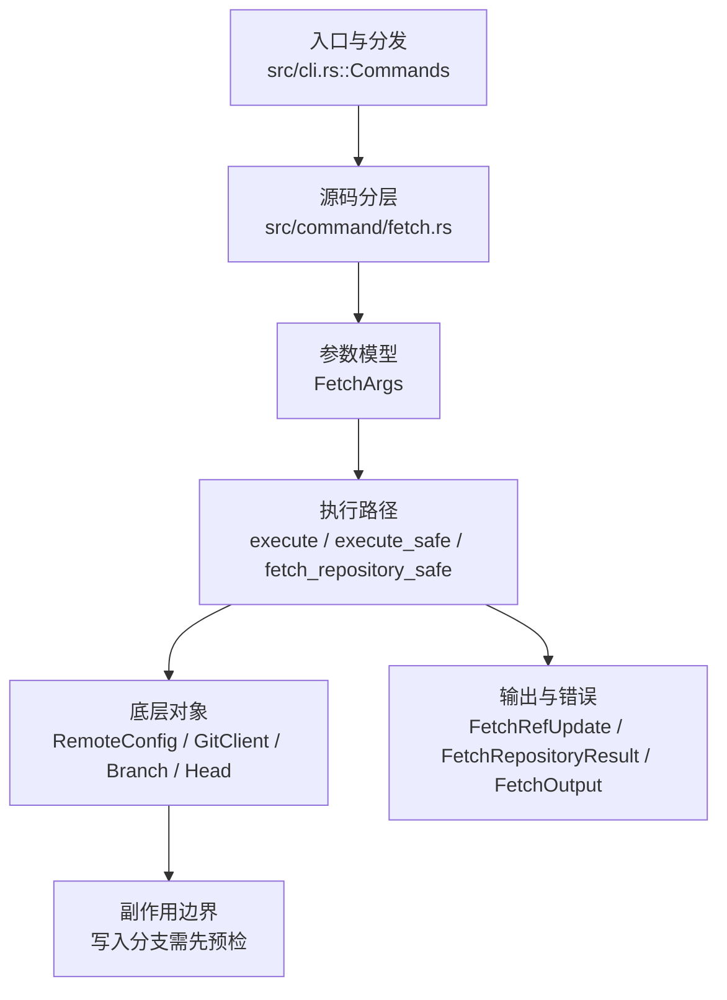

# `libra fetch` 开发设计

## 命令实现目标

`libra fetch` 的目标是从远端下载对象和 refs，并按 refspec、FETCH_HEAD、tag 策略、浅边界和 dry-run/porcelain 规则更新本地状态。实现需要支持原子回滚、prune、force、append、refmap 和远端诊断，同时避免网络/pack 流处理出现静默失败。

## 对比 Git 与兼容性

- 兼容级别：`partial`。repository/refspec、`--all`、`--depth`、`--dry-run`、`-v/--verbose`、`--porcelain`、`--tags`/`--no-tags`、`--prune`/`-p`/`--no-prune` 以及 `FETCH_HEAD` 写入与 `--append` 已公开；`--refmap`、`--atomic` 与 shallow 扩展参数（`--shallow-since` / `--shallow-exclude` / `--update-shallow`）仍未公开。`--prune`/`-p` 在 fetch 完成后按 `remote prune` 的 stale 分类删除远端已不再 advertise 的 `refs/remotes/<remote>/*`（删除 + 审计 reflog 在单事务内，失败回滚；`--dry-run` 只预览不写；full-remote 范围而非 refspec 范围、远端 advertise 空 refs 时跳过——均为相对 Git 的有意收窄；本地分支、tag、`refs/remotes/<remote>/HEAD` 与其它远端不受影响）。`--prune`/`--no-prune` 为 last-one-wins toggle。

- 当前矩阵承诺常用 Git 行为已支持；新增语义必须同步矩阵、用户文档和测试。

## 设计方案

- 入口与分发：已公开接入 `src/cli.rs::Commands`；已由 `src/command/mod.rs` 导出。CLI 层在 `src/cli.rs` 把解析后的参数交给命令模块，命令模块负责把领域错误转换为 `CliError` / `CliResult`。
- 源码分层：主要实现文件为 `src/command/fetch.rs`。参数/子命令类型包括：`FetchArgs`；输出、错误或状态类型包括：`FetchRefUpdate`、`FetchRepositoryResult`、`FetchOutput`、`RemoteSpecErrorKind`、`FetchError`；主要执行函数包括：`execute`、`execute_safe`、`fetch_repository_safe`。
- 源码意图：源码模块注释说明该命令负责远端协商、下载 pack、更新 remote-tracking refs，并处理 prune/depth 选项。
- 执行路径：`execute_safe` 负责 CLI 安全包装、错误映射和输出配置；核心领域逻辑集中在 `fetch_repository_safe`；对象路径会解析 revision 并读写 blob/tree/commit/tag 等对象；引用路径会读取或更新 SQLite refs、HEAD 与 reflog；网络路径会解析 remote 配置、协商协议并处理 pack/idx 数据；数据库路径会通过 SeaORM/SQLite 或 D1 客户端持久化元数据。

- 流程图：以下流程图按当前源码分层展示主路径和底层对象边界，便于维护者把代码入口、执行函数和副作用范围对应起来。

- 底层操作对象：`RemoteConfig`（remote URL、refspec 和凭据配置）；`GitClient` / protocol client（Git wire 协议协商）；SSH transport（SSH remote 连接和认证）；HTTPS transport（HTTP(S) remote 连接和认证）；pack / idx 对象（传输包、索引、delta 和完整性校验）；`Branch` / branch store（SQLite refs 上的分支读写、过滤和上游关系）；`Head`（SQLite 中的 HEAD 指向、当前分支和 detached 状态）；`ReflogContext` / `with_reflog`（SQLite reflog 写入和动作记录）；`ObjectHash`（SHA-1/SHA-256 对象 ID 和 revision 解析结果）；`Commit`（提交对象、父提交关系和提交消息载荷）；SeaORM / `.libra/libra.db`（配置、refs、reflog、AI/发布元数据等 SQLite 表）；Vault/libvault（身份、密钥或 vault-backed 签名边界）
- 输出与错误契约：人类输出、`--json` / `--machine` 输出和 quiet/verbose 分支必须继续走现有 `OutputConfig` / `emit_json_data` / `CliError` 路径；新增失败模式要补稳定错误码、用户提示和回归测试。
- 副作用边界：凡是写入索引、对象库、refs/HEAD、reflog、SQLite/D1、工作树或远端的路径，都必须先完成参数校验和 dry-run/预检分支，再执行持久化，避免部分写入后静默成功。

## 实现历史

- 本节依据本地 main 分支提交历史重写，筛选与该命令实现、测试或文档路径直接相关的提交；以下是归纳后的实现脉络。
- 2026-04-06 `30bed711`（`feat(remote): land batch-5 remote and fetch UX (#341)`）：基础实现节点：land batch-5 remote and fetch UX (#341)；当前实现的主要轮廓可追溯到该提交。
- 2026-06-05 起 `a501ddd` / `2c2ad76` / `10d8744` / `470e275`（`feat(fetch): --dry-run` / `-v,--verbose` / `--porcelain` / `FETCH_HEAD + --append`）：这些本地（不依赖 shallow/tag/prune 子系统）的参数在一次 reconcile 中被误丢。2026-06-18 已在当前（已分叉、回退过的）fetch 代码上重新恢复：`--dry-run`（仅基于发现的 refs 预览 remote-tracking 更新，不下载、不写入）、`-v/--verbose`（stderr 公告远端）、`--porcelain`（拒绝与 `--json` 同用）、`FETCH_HEAD` 写入与 `--append`。
- 2026-06-05 `7d75d886`（`feat(fetch): add --refmap to override fetched-ref destinations`）：历史节点：曾尝试新增 `--refmap`；当前 `FetchArgs` 仍未公开该参数——它依赖回退过的 `ShallowOptions`/refspec 映射基础设施，属于 deferred。
- 2026-06-05 `b005e9ee`（`feat(fetch): add --atomic with rollback pack cleanup`）：历史节点：曾尝试新增 `--atomic`；当前 `FetchArgs` 仍未公开该参数——它依赖回退过的多步事务/pack 回滚基础设施，属于 deferred。
- 2026-06-05 起 `479cd0b` / `916edc2` / `5a05f0f`（`--shallow-since/--shallow-exclude` / `--update-shallow` / `-f,--force`）：历史节点；shallow 扩展与 `-f/--force` 仍未公开（依赖回退过的 `ShallowOptions` 浅边界扩展与 `forced` 字段），但 `--tags`/`--no-tags` 已在 PR-10a 重新落地：发现层保留 `refs/tags/*`，`current_have_safe` 把本地 tag（含 annotated peel）纳入 `have` 以避免重复下载，`update_references` 以 `kind=Tag` 落库（create-if-absent，不强制覆盖）。
- 2026-06-07 `b21dc6fd`（`fix(fetch): close compatibility plan gaps`）：实现修正：close compatibility plan gaps；该节点把边界行为、错误处理或兼容差异纳入当前实现约束。
- 历史结论：当前文档应以这些提交之后的代码、测试和兼容矩阵为准；更早的迁移式文档只保留为背景，不再作为事实来源。

## 当前状态

- 公开状态：已公开；模块状态：已导出。
- 用户文档：`docs/commands/fetch.md`。
- Synopsis：`libra fetch [OPTIONS] [<repository> [<refspec>]]`。
- 公开参数/子命令包括：`[<repository>]`、`[<refspec>]`、`-a, --all`、`--depth <N>`、`--dry-run`、`--append`、`-v, --verbose`、`--porcelain`、`--tags`、`--no-tags`、`--no-auto-gc`（接受式 no-op：Libra 的 fetch 从不触发自动 gc，故无可禁用；字段 `no_auto_gc` 在解构 `FetchArgs` 时以 `_` 绑定、不被读取）、`--no-progress`（**实际生效**：经 `apply_no_progress` 把 `OutputConfig.progress` 强制为 `ProgressMode::None`（并 `progress_preference=None`）后再下传，从而抑制 `read_fetch_stream` 的 “Receiving objects” 进度 spinner 与 NDJSON 进度事件，对齐 `git fetch --no-progress`；带单元测试 `apply_no_progress_forces_progress_mode_off`）、`-p, --prune`（**实际生效**：fetch 后用 `remote_advertised_branch_names` + `classify_stale_tracking_branches`（与 `remote prune` 共用，定义在 `remote.rs`）找出远端已不再 advertise 的 `refs/remotes/<remote>/*`，由 `prune_stale_remote_refs` 在单事务内逐条写一条审计 reflog（`<old> -> 0…0`，`ReflogAction::Fetch`）再删除该 ref，失败整体回滚；`pruned` 结果进入 `FetchRepositoryResult.pruned` 并在 human（`- [deleted] … -> <remote>/<branch>`）/porcelain（`- <old> <zero> <ref>`）/JSON 输出中呈现。`--dry-run` 只 classify 不删；远端 advertise 空 refs 时整体跳过 prune）、`--no-prune`（默认行为；`no_prune` 字段解构时以 `_` 绑定不被读取——`--prune`/`--no-prune` 经 clap `overrides_with` 组成 last-one-wins toggle）。
- tag 处理（每 remote 解析：CLI flag > `remote.<name>.tagOpt` > 默认 **auto-follow**）。默认 auto-follow：协商时发送 `include-tag` capability，fetch 后把「对象/目标已落本地」的远端 tag 持久化到共享 `refs/tags/*`（lightweight 看 commit 是否到位，annotated 看 tag 对象是否经 include-tag 到位）。`--tags` 抓全部远端 tag（显式 `want` `refs/tags/*`）；`--no-tags` 一个都不抓。本地已存在同名 tag 时 create-if-absent / 相同跳过 / 不同则跳过并 warning，`-f`/`--force` 时 clobber。tag 不写 reflog。
- `-f` / `--force`：允许非 fast-forward 更新并 clobber 指向别处的本地 tag；输出对非 FF/clobber 标 `+`（porcelain）/`(forced update)`（human）。FF 判定用 `commit_is_ancestor`（remote-tracking 分支本就强制更新，故 `forced` 主要是信息性标记 + tag clobber 闸门）。
- `--notes`（lore.md 3.2，**实际生效**）：额外经**专用旁路**导入文件依赖图 `refs/notes/deps`。`FetchArgs.notes` 透传到 `fetch_repository_with_result`，在 `update_references` 之后门控 `(--notes ∨ remote.<name>.fetchNotesDeps) ∧ RemoteClient::Local ∧ is_libra_source()`：`LocalClient::export_deps_notes()`（LibraRepo 臂在 `with_repo_current_dir`+HashKindRestoreGuard 内 `notes::list` + 读 blob，per-note 容错）→ `DependencyStore::import_notes()`（DepsDoc 校验 + 每边 `normalize_edge_path` + union-merge + per-note warn-skip 坏 doc/缺 commit）。默认 OFF（Git parity）；网络/foreign-Git 远端发诚实延后 warning 不导入图（D17）。note 不搭 pack（Libra note = loose blob + SQLite 行，非 commit 可达）。带集成测试（`deps_travel_test.rs`：本地往返、无 --notes 空图、union-merge 不 clobber、foreign-Git 延后 warn）。
- HTTPS ref 发现退避与脱敏（`lore.md` §0.2）：`HttpsClient::discovery_reference`（`info/refs` GET，幂等）经 `utils::backoff::RetryPolicy`（默认 5 次、200ms 基延迟、10s 单次上限、60s 总预算、全抖动）对 `429`/`503` 与连接级失败自动退避重试并解析/钳制 `Retry-After`；发送与读体错误消息统一经 `utils::redact::redact_url_credentials` 脱敏，`user:token@host` 形式的凭证不再进入日志/错误。仅重试只读发现请求，pack 拉取流不在此重试范围内。

## 还未实现的功能

| 类别 | 未完成项 | 当前处理 |
|---|---|---|
| 兼容差异项 | `-f` / `--force` | 原始对照：`git fetch --force`；当前说明：不支持——依赖回退过的 `forced` 字段基础设施。`--tags`/`--no-tags` 已实现（见 PR-10a），但强制覆盖（forced tag update）仍随 `-f/--force` 一起 deferred。 |
| 兼容差异项 | `--atomic` / `--refmap` | 原始对照：`git fetch --atomic` / `--refmap`；当前说明：不支持——依赖回退过的多步事务回滚与 refspec 映射基础设施。 |
| 兼容差异项 | Git shallow 扩展参数 | 原始对照：`--deepen` / `--shallow-since` / `--shallow-exclude` / `--update-shallow` / `--unshallow` 等；当前说明：不支持——依赖回退过的 `ShallowOptions` 浅边界基础设施。 后续实现时需要补对应回归测试并同步兼容矩阵。 |

## 维护要求

- 改进本命令前，必须先阅读并遵循 [docs/development/commands/_general.md](_general.md)；这是命令设计、实现、测试和文档同步的强制要求。
- 任何行为变更都要先核对实现源码，再同步 `COMPATIBILITY.md`、`docs/commands/<cmd>.md` 和相关测试。
- 新增 Git 兼容参数时必须明确 tier、错误码、JSON/机器输出契约和回归测试。
