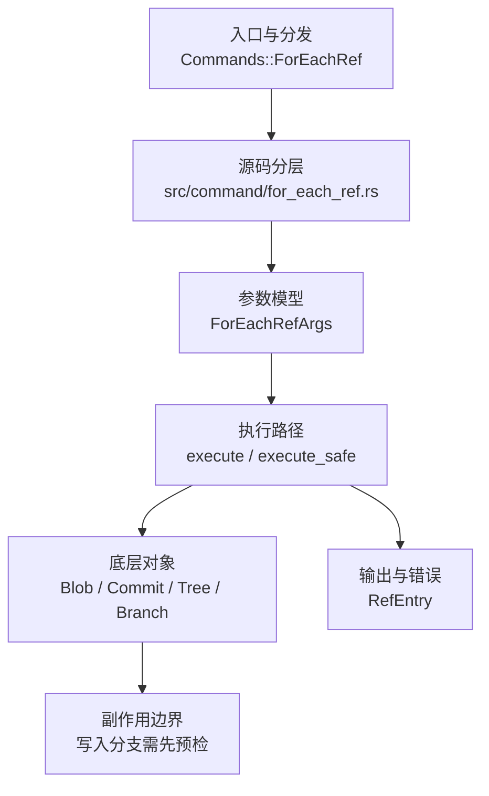

# `libra for-each-ref` 开发设计

## 命令实现目标

`libra for-each-ref` 的目标是按格式列出本地引用，作为 Git ref listing 的 plumbing 兼容入口。当前实现文件、用户文档和顶层 CLI 入口均已公开；剩余工作集中在完整 atom 语言（shell/perl/python/tcl quoting modes 与 contains/merged 类高级过滤已实现）。

## 对比 Git 与兼容性

- 兼容级别：`partial`。`--heads` / `--tags` / `--remotes` / `--all` / `--format` / `--sort`（`refname`/`objectname`/`version:refname`/`committerdate`/`authordate`/`creatordate`/`objectsize`/`*objectname`/`*objecttype`/`*objectsize`，均可加 `-` 反转）/ `--count` / `--points-at` / `--contains` / `--no-contains` / `--merged` / `--no-merged` / `--exclude` / `--shell` / `--perl` / `--python` / `--tcl`（互斥的输出引用模式）/ `<pattern>` supported; `%(tree)`/`%(tree:short)`/`%(parent)`/`%(parent:short)`/`%(numparent)` commit-graph atoms 已支持；日期格式修饰符 `%(committerdate|authordate|taggerdate|creatordate):<fmt>`（default/short/iso/iso8601/iso-strict/rfc/unix/raw/relative；local/human/format: 未支持，回落默认）与 `%(creatordate)` atom 已支持；`%(color:<spec>)`（ANSI 转义，`color_spec_to_ansi` 解析 8 基础色+bright/default/256/#rgb + bold/dim/italic/ul/blink/reverse/strike 属性，fg→bg 槽位；仅在 color 启用时输出，`--color` 经 `OutputConfig` 解析 always/never/auto+tty）已支持；`%(raw)`/`%(raw:size)`（原始解压对象内容及其字节大小，size 等于 `%(objectsize)`；`%(raw)` 在 `--shell`/`--python`/`--tcl` 下被拒绝并 fatal 退出 128，与 git 一致）已支持；`%(describe[:opts])`（对每个 ref 的提交跑 describe，复用 `describe::describe_commit_for_atom`；`opts` 逗号分隔支持 `tags`/`abbrev=<n>`/`match=<glob>`/`exclude=<glob>`，未识别选项报 `unrecognized %(describe) argument` 退出 129 且在无匹配 ref 时也校验；无可达 tag 渲染空串；因 describe 为 async 而 render 为 sync，故异步预算到 `RefEntry.describe` 缓存后再同步渲染）已支持；`%(symref)`/`%(symref:short)`/`%(symref:lstrip=N)`/`%(symref:rstrip=N)`（符号引用如 `refs/remotes/<remote>/HEAD` 的目标，普通 ref 为空；`run_for_each_ref` 在 `--remotes`/`--all` 下经 `Head::remote_current` 枚举 remote HEAD 为 `symbolic_ref_entry`）已支持；`%(worktreepath)`（持有该 ref 检出的工作树绝对路径，否则空；libra 工作树共享单一 HEAD，故检出分支即当前 HEAD 分支、路径取命令运行所在的当前工作树，与 git 单工作树仓库一致）已支持；其余 niche atom（`%(deltabase)`）are not exposed（`%(objectsize)` atom+`--sort=objectsize`、`%(*objectname)`/`%(*objectname:short)`/`%(*objecttype)`/`%(*objectsize)` deref atom + 全部 `--sort=*objectname`/`*objecttype`/`*objectsize` deref sort keys、`%(align:…)`…`%(end)` 对齐块、`%(if[:equals=v|:notequals=v])`…`%(then)`…`%(else)`…`%(end)` 条件块 均已实现）

- 当前矩阵明确仍是部分兼容；未覆盖的 Git surface 必须显式列在“还未实现的功能”。

## 设计方案

- 入口与分发：源码资料存在并已公开接入 `src/cli.rs::Commands`；`src/command/mod.rs` 已导出。CLI 层在 `src/cli.rs` 把解析后的参数交给命令模块，命令模块负责把领域错误转换为 `CliError` / `CliResult`。
- 源码分层：主要实现文件为 `src/command/for_each_ref.rs`。参数/子命令类型包括：`ForEachRefArgs`；输出、错误或状态类型包括：`RefEntry`；主要执行函数包括：`execute`、`execute_safe`。
- 执行路径：`execute_safe` 负责 CLI 安全包装、错误映射和输出配置；对象路径会解析 revision 并读写 blob/tree/commit/tag 等对象；引用路径会读取或更新 SQLite refs、HEAD 与 reflog。

- 流程图：以下流程图按当前源码分层展示主路径和底层对象边界，便于维护者把代码入口、执行函数和副作用范围对应起来。

- 底层操作对象：`Blob`（文件内容或 LFS pointer 写入对象库后的 blob 对象）；`Commit`（提交对象、父提交关系和提交消息载荷）；`Tree`（由索引或对象遍历生成的目录树对象）；`Branch` / branch store（SQLite refs 上的分支读写、过滤和上游关系）；`ConfigKv`（配置键值持久化行）
- 输出与错误契约：人类输出、`--json` / `--machine` 输出和 quiet/verbose 分支必须继续走现有 `OutputConfig` / `emit_json_data` / `CliError` 路径；新增失败模式要补稳定错误码、用户提示和回归测试。
- 副作用边界：凡是写入索引、对象库、refs/HEAD、reflog、SQLite/D1、工作树或远端的路径，都必须先完成参数校验和 dry-run/预检分支，再执行持久化，避免部分写入后静默成功。

## 实现历史

- 本节依据本地 main 分支提交历史重写，筛选与该命令实现、测试或文档路径直接相关的提交；以下是归纳后的实现脉络。
- 2026-06-13 `8d4fb969`（`Implement ref and index listing commands`）：基础实现节点：Implement ref and index listing commands；当前实现的主要轮廓可追溯到该提交。
- 2026-07-09（plan-20260708 P0-06）：仍使用 `println!` 的行输出路径由 `main.rs` stdout broken-pipe panic hook 统一收口；下游提前关闭管道时静默正常终止，不打印 panic/backtrace/`Broken pipe` 诊断。回归覆盖：`compat_broken_pipe_output`。
- 历史结论：`src/command/for_each_ref.rs` 已通过 `src/cli.rs::Commands::ForEachRef` 公开；早期“未公开 CLI”的记录已经过期，当前状态以源码和本页“当前状态”为准。

## 当前状态

- 公开状态：已公开；模块状态：已从 `src/command/mod.rs` 导出。
- 用户文档：`docs/commands/for-each-ref.md`，记录公开 CLI 合约。
- 公开参数/子命令包括：`--heads`、`--tags`、`--remotes`、`--all`、`--format`、`--sort`、`--count`、`--points-at <object>`、`--contains <commit>`、`--no-contains <commit>`、`--merged <commit>`、`--no-merged <commit>`、`--exclude <pattern>`、`<pattern>...`。`--exclude`（可重复）在位置 include 模式过滤之后，丢弃 refname 匹配任一 exclude 模式的 ref（复用 `matches_ref_pattern`）。
- P1-04 核对结论：`for-each-ref --format` 是 Git 的 `%(atom)` ref 模板语言，已在本页 atom 表中单独维护；它不消费 `log`/`show`/`shortlog` 的 `%` pretty-format placeholder，因此本切片不把 `CommitFormatter` 接入 `for-each-ref`。
- `--contains <commit>` / `--no-contains <commit>`：仅保留（或排除）其提交以 `<commit>` 为祖先的 ref（即 ref 的提交“包含”该 commit）。复用 `log::get_reachable_commits` 对每个 ref 的 peeled commit 做一次可达性遍历。
- `--merged <commit>` / `--no-merged <commit>`：仅保留（或排除）其提交可从 `<commit>` 到达的 ref（即 ref 已合并入 `<commit>`），方向与 `--contains` 相反。复用 `log::get_reachable_commits` 对 `<commit>` 计算一次可达集合后逐 ref 判定，避免逐 ref 重复遍历。

## 还未实现的功能

| 类别 | 未完成项 | 当前处理 |
|---|---|---|
| 兼容矩阵 | `COMPATIBILITY.md` 已登记该命令为 `partial`。 | 保持与矩阵对齐；新增参数时同步矩阵和守卫测试。 |
| ✅ 已实现（综合 atom 子集）| Git atom 语言 | 原始对照：完整 `%(atom)` 集合；相关参数/替代：`--format`；当前说明：支持 `%(refname)` / `%(refname:short)` / `%(refname:lstrip=N)` / `%(refname:rstrip=N)`（N>0 去前/后 N 段，N<0 保留末/首 |N| 段）/ `%(objectname)` / `%(objectname:short)`（7 位）/ `%(objectname:short=N)`（N 位，超过长度则取全长）/ `%(objecttype)` / `%(objectsize)`（ref 直接对象的字节大小，附注标签取 tag 对象不剥离）/ `%(*objectname)` / `%(*objectname:short)`（附注标签解引用到的目标对象 id，非 tag ref 为空）/ `%(*objecttype)` / `%(*objectsize)`（解引用目标对象的类型/字节大小，非 tag ref 为空）/ `%(HEAD)`（当前分支标 `*`）/ `%(upstream)` / `%(upstream:short)`（来自 `branch.<name>.remote`+`.merge` 的标准追踪 ref，自定义 refspec 映射未建模）/ `%(subject)`（提交或附注标签消息首行，经 `load_object` 读取）/ `%(contents)`（完整消息）/ `%(contents:subject)`（=subject）/ `%(body)`=`%(contents:body)`（首个空行之后的正文）/ `%(authorname)` / `%(authoremail)` / `%(committername)` / `%(committeremail)`（提交身份）/ `%(taggername)` / `%(taggeremail)`（附注标签 tagger 身份，非 tag ref 为空；email 带尖括号；对象只加载一次）/ `%(authordate)` / `%(committerdate)` / `%(taggerdate)`（Git 默认日期格式，复用 `log::formatter::format_timestamp_with`，与 `libra log` 一致渲染为 UTC `+0000`，非原始时区）/ `%(push)` / `%(push:short)`（push 追踪 ref；push remote 按 `branch.<name>.pushRemote` → `remote.pushDefault` → `branch.<name>.remote` 优先级，配合 `.merge` 派生为 `refs/remotes/<push-remote>/<branch>`，config-derived 同 `%(upstream)`，不检查 ref 是否存在；`pushRemote`/`pushDefault` 变量名经 `ConfigKv::get_var_case_insensitive` 大小写不敏感解析，与 Git 一致——驼峰与 `git config --list` 输出的小写形式视为同一变量。正常情况下一个逻辑变量只有一行（`set` 原地更新），故必然解析到该值；仅当两个大小写变体行并存这一异常情形（Libra config 按大小写存储，无 write-order 列，且 vault 变量名大小写敏感故无法全局归一化写入路径）下，取最近插入者，确定但非跨变体真正的 last-write） / `%(tree)` / `%(tree:short)` / `%(parent)` / `%(parent:short)`（提交的 tree id / 父提交 id，空格分隔，非提交为空）/ `%(numparent)`（父提交数）。`%(align)` 对齐块与 `%(if)`/`%(then)`/`%(else)` 条件块见下方专门行，均已实现。日期格式修饰符 `%(committerdate|authordate|taggerdate|creatordate):<fmt>`（复用 `format_timestamp_with` 的 default/short/iso/iso8601/iso-strict/rfc/rfc2822/unix/raw + 本地 `relative_date` 的 git 阈值实现；`local`/`human`/`format:<strftime>` 回落默认格式）与 `%(creatordate)`（commit→committer date，附注 tag→tagger date）已支持，经 `DateAtomContext` 把原始时间戳传入 `render_fragment`。`%(color:<spec>)` 已支持（`color_spec_to_ansi`，color-enabled 经 `OutputConfig` 的 ColorChoice/tty 判定）。`%(raw)`/`%(raw:size)` 已支持（`ref_raw_content` 经 `objects_storage().get` 取原始解压对象内容；`%(raw:size)` 复用 `ref_object_size`，等于 `%(objectsize)`；`%(raw)` 在 `--shell`/`--python`/`--tcl` 下 fatal 退出 128，`--perl` 允许，与 git 一致；均按 `format.contains` 惰性计算。render 管线是 UTF-8 文本制，故 `%(raw)` 对非 UTF-8 二进制对象用 `String::from_utf8` 直接拒绝并报错——而非有损转码导致与 `%(raw:size)` 不一致；commit/annotated-tag 这类 ref 正常指向的对象均为文本）。`%(describe[:opts])` 已支持（`describe_specs_in_format` 扫描格式收集各 option 串、`parse_describe_options` 校验 `tags`/`abbrev=<n>`/`match=<glob>`/`exclude=<glob>`（未识别→`unrecognized %(describe) argument` 退出 129，且在无匹配 ref 时也校验），`populate_describe_cache` 对每个 ref 调 `describe::describe_commit_for_atom`（复用 `run_describe`）预算到 `RefEntry.describe`（`#[serde(skip)]`，不入 JSON），render_fragment 按 option 串取缓存；无可达 tag→空串；因 describe async/render sync 故必须预算）。`%(symref)`/`%(symref:short)`/`%(symref:lstrip=N)`/`%(symref:rstrip=N)` 已支持（`symref_atom` 渲染 `RefEntry.symref`，复用 `short_refname`/`strip_ref_components`；`run_for_each_ref` 在 `--remotes`/`--all` 下经 `Head::remote_current(remote)` 枚举符号 remote HEAD 为 `symbolic_ref_entry(refs/remotes/<remote>/HEAD, target, objectname)`，普通 ref 的 `symref` 为 None→空；带集成测试 `test_for_each_ref_symref_atom`）。`%(worktreepath)` 已支持（持有该 ref 检出的工作树绝对路径，否则空；`format.contains` 惰性计算，仅当 ref==当前 HEAD 分支时取 `util::working_dir().canonicalize()` 即命令运行所在的当前工作树；libra 工作树共享 HEAD，故报告当前工作树，git 单工作树场景字节一致；带集成测试 `test_for_each_ref_worktreepath_atom`）。**以下 niche atom 故意未实现**：`%(deltabase)`（libra 不暴露 pack delta-base API）。 扩展时需补回归测试并同步兼容矩阵。带集成测试 `test_for_each_ref_raw_atom`、`test_for_each_ref_describe_atom`。 |
| ✅ 已实现 | `--sort=version:refname`（别名 `v:refname`，可加 `-` 反转） | 复用 `utils::util::version_refname_cmp`（与 `ls-remote` 共享）：数字串按数值比较，使 `v1.9` 排在 `v1.10` 前。带集成测试（`test_for_each_ref_sort_version_refname`）。 |
| ✅ 已实现 | `--sort` date keys：`committerdate` / `authordate` / `creatordate`（均可加 `-` 反转） | 预解析每个 ref 的时间戳（`sort_entries_by_date`，同步）后排序：`committerdate`/`authordate` 取（剥离附注标签到的）commit 的 committer/author 时间戳；`creatordate` 对附注标签取 tagger 时间戳（`ref_sort_timestamp`），对 commit/轻量标签回落到 committer 时间戳。`ref_commit`→`peel_to_commit` **递归**剥离 tag→tag→…→commit：每步先用 `ClientStorage::get_object_type` 读对象**实际**存储类型再做 typed-load（绝不依赖标签声明的 `type` 行，避免把 mismatched 字节交给假定类型的 `from_bytes` 解析器），并用 `MAX_TAG_PEEL_DEPTH` 限深防环。并列项按 refname 升序兜底（与 Git 一致，已与 git 差分验证升/降序及并列方向）。无法加载或指向 tree/blob 的 ref 取 0。带集成测试：`test_for_each_ref_sort_by_committerdate`（分支升/降序）、`test_for_each_ref_sort_creatordate_uses_tagger_date_for_annotated_tags`（附注标签 creatordate=tagger vs committer/authordate=剥离 commit）、`test_for_each_ref_sort_peels_nested_annotated_tags`（手工构造 tag→tag→commit 锁定递归剥离）。剩余 sort keys 见下方 `*objectname` 行。 |
| ✅ 已实现 | `objectsize` sort key + `%(objectsize)` atom | `parse_objectsize_sort_key` 识别 `objectsize`/`-objectsize`，`sort_entries_by_objectsize` 用 `ref_object_size`（`ClientStorage::get(objectname).len()`，即对象解压内容长度=git objectsize）逐 ref 预解析后排序，并列按 refname 升序。`%(objectsize)` atom 在 format 含该 atom 时惰性计算同一大小。取 ref 的**直接**对象（附注标签取 tag 对象，不剥离），与 git `%(objectsize)` 语义一致（已与 git 差分验证：附注标签对象 > 其 commit）。带集成测试（`test_for_each_ref_objectsize_atom_and_sort`）。`*objectname` 解引用 sort key 见下方专门行（已实现）。 |
| ✅ 已实现 | `*objectname` sort key + `%(*objectname)`/`%(*objectname:short)` atom | `ref_deref_objectname` 仅对 `objecttype=="tag"` 的 ref 生效：`peel_tag_to_target` 按 tag 对象**自身记录**的 `object_type`/`object_hash` 逐层跟随嵌套 tag 到首个非-tag 对象，返回其 id（无需读取目标对象本身，与 git 一致——git 报告 tag 记录的 id），`MAX_TAG_PEEL_DEPTH` 限深。非 tag ref 为空串。`%(*objectname:short)` 取 7 位。`--sort=*objectname` 用同值排序（空串排前），并列按 refname 升序，与 date/objectsize sort 同框架。已与 git 差分验证（附注标签 *obj=其 commit，非 tag 为空；升序空串在前、降序附注标签在前）。带集成测试（`test_for_each_ref_deref_objectname_atom_and_sort`）。`%(*objecttype)`/`%(*objectsize)` deref atom 见下方专门行（已实现）。 |
| ✅ 已实现 | `%(*objecttype)` / `%(*objectsize)` deref atom | 复用 `peel_tag_to_target`（现返回 `(目标 hash, 目标 type)`）与共享 `ref_deref_target`（现为 fallible：非 tag ref→`Ok(None)`→空串；tag ref 但 chain 无法 peel——无效 object id、缺失/损坏的中间 tag、或超 `MAX_TAG_PEEL_DEPTH` 的环——→`Err`，三个 `*`-deref atom（含 #173 的 `%(*objectname)`）统一**显式报错而非静默空串**，与 git 在损坏对象上报错一致）。`%(*objecttype)`=目标对象类型（取自最后一层 tag 记录的 `object_type`，经 `object_type_name`，无需读目标对象）；`%(*objectsize)`=读取解引用目标对象的字节大小（`Option<i64>`，非 tag→None→空串；目标/链路读失败→`IoReadFailed` 而非静默 0/空）。非 tag ref（分支/轻量标签）两者皆空，与 git 一致（已差分验证：附注标签 *objecttype=commit、*objectsize=其 commit 大小；分支/lw 为空）。带集成测试（`test_for_each_ref_deref_objecttype_and_objectsize_atoms` + 断链报错的 `test_for_each_ref_deref_size_errors_on_broken_tag_chain`：outer→inner→c1 删 inner tag 后 `%(*objectsize)` 报错并 name the ref）。`*`-deref sort keys（`--sort=*objecttype`/`*objectsize`）、`%(align)` 对齐块、`%(if)`/`%(then)`/`%(else)` 条件块均见下方专门行（已实现）。 |
| ✅ 已实现 | `--sort=*objecttype` / `--sort=*objectsize` deref sort keys | `parse_deref_objecttype_sort_key`/`parse_deref_objectsize_sort_key`（识别 `*objecttype`/`*objectsize` 及 `-` 反转）+ `sort_entries_by_deref_objecttype`/`sort_entries_by_deref_objectsize`（复用 fallible `ref_deref_objecttype`/`ref_deref_objectsize` 预解析后排序）。空 deref（非 tag ref）排前：type 用空串（字典序最前），size 用 `i64::MIN` 哨兵；并列按 refname 升序，与现有 sort 同框架（断链 ref 同样经 fallible resolver 报错）。已与 git 差分验证（升序空在前/atag 末尾、降序 atag 首）。带集成测试（`test_for_each_ref_sort_by_deref_objecttype_and_objectsize`）。for-each-ref `*`-deref 家族（atom + sort）至此完整；`%(align)` 对齐块与 `%(if)` 条件块见下方专门行（均已实现）。 |
| ✅ 已实现 | `%(align:…)` … `%(end)` 对齐块 | 渲染循环重构为递归 `render_fragment`（共享 atom 表 + `entry` + quote）：遇到 `%(align:<spec>)` 时经 `find_matching_align_end`（按 `%(align`/`%(end)` 深度配平，支持嵌套）定位匹配的 `%(end)`，对块内片段递归渲染后用 `pad_aligned` 按 Unicode 显示列宽（`unicode_width::UnicodeWidthStr`）补齐。`parse_align_spec` 顺序无关地解析 `<width>`（裸数字或 `width=N`，必填）与 `<position>`（`left`/`right`/`middle` 或 `position=P`，默认 `left`）；`middle` 的奇数余量偏右、内容已达/超宽不截断（与 git 一致）。**与引用模式交互**：块内片段以 `quote=None` 递归渲染（内部 atom、字面文本、嵌套 align 块均为 raw），padding 后整块经 `push_field` 在当前层一次性引用——与 git 一致：`--shell`/`--perl`/`--python`/`--tcl` 下只有最外层 align 块作为单个字符串字面量被引用，嵌套块与块内字面量不单独引用（已对全部 4 种引用模式 × left/嵌套/含字面量片段差分验证）。错误：缺宽度→`align_missing_width_error`、缺 `%(end)`→`align_missing_end_error`、非法 spec→`align_spec_error`（均 `CliInvalidArguments`/129）。与 git 差分验证（left/right/middle、width-only、`width=`/`position=` 形式、position-before-width、超宽不截断、嵌套、各引用模式），带集成测试 `test_for_each_ref_align_atom_pads_to_width`（含 `--shell` 引用断言）。 |
| ✅ 已实现 | `%(if)`…`%(then)`…`%(else)`…`%(end)` 条件块 | 复用 `render_fragment` + 共享 `find_block_end`（`is_block_opener` 现把 `align`/`if` 都算作开块，`%(end)` 配平，故 if 可嵌套且可嵌入 align）。`%(if[:equals=v|:notequals=v])` token 经 `eval_if_condition` 判定：plain `%(if)` 在条件渲染值 **trim 空白后非空** 时为真（故 `%(HEAD)` 的单空格→假，与 git 一致）；`equals`/`notequals` 比较 **未 trim 的 raw** 值。条件片段（`%(if…)`→`%(then)` 之间）以 `quote=None` 渲染（是测试不是输出），选中的分支以**当前引用层**渲染（故 align 内的 if 分支为 raw，顶层 if 分支正常 per-atom 引用）。`find_if_marker` 在 if 块内容的 depth-0 处定位 `%(then)`/`%(else)`（嵌套 if 的 marker 在 depth>0 被跳过）；`%(else)` 可省略。错误：缺 `%(then)`→`if_missing_then_error`、缺 `%(end)`→`if_missing_end_error`、游离 `%(then)`/`%(else)`→`if_stray_marker_error`、游离 `%(end)`→`stray_end_error`、非法 spec→`if_invalid_spec_error`（均 `CliInvalidArguments`/129；git 用 128，libra 统一沿用 for-each-ref 既有 129 format-error 约定）。与 git 差分验证（plain truthy/falsy、equals/notequals、`%(HEAD)` 空格 trim、嵌入 align、含 `--shell` 嵌套），带集成测试 `test_for_each_ref_if_then_else_conditional`。 |
| ✅ 已实现 | 高级过滤 | `--contains` / `--no-contains`、`--merged` / `--no-merged` 均已实现（基于 `log::get_reachable_commits` 的可达性判定，`--merged` 对目标提交计算一次可达集合后逐 ref 判定）；`--points-at` 支持 direct refs、lightweight tags 和 annotated tag peeled target。带集成测试（`test_for_each_ref_contains_filter`、`test_for_each_ref_merged_filter`）。 |
| ✅ 已实现 | 输出引用模式 `--shell` / `--perl` / `--python` / `--tcl` | 互斥标志（clap `conflicts_with_all`，多选→129），`resolve_quote_style` 解析为 `QuoteStyle`；`render_format` 对**每个**插值 atom 值调 `quote_value`（字面 format 文本不引用），默认 `<oid> <refname>` 路径也分别引用两字段。引用规则与 git 源码（`sq_quote_buf`/`perl_quote_buf`/`python_quote_buf`/`tcl_quote_buf`）逐字节差分验证：shell 单引号包裹，`'` 与 `!` 各转为 `'\<c>'`（如 `'\''`、`'\!'`），换行保持物理换行；perl 单引号包裹，先 `\`→`\\` 再 `'`→`\'`，换行物理保留；python 同 perl 但额外把换行转为字面 `\n`（保持单行 Python 字面量）；tcl 双引号包裹、`\ " $ [ ] { }` 反斜杠转义 + 控制符 `\f\r\n\t\v`。带集成测试（`test_for_each_ref_quoting_styles`，含 `!` shell-escape 与多行 python `\n` 用例）。 |

## 维护要求

- 改进本命令前，必须先阅读并遵循 [docs/development/commands/_general.md](_general.md)；这是命令设计、实现、测试和文档同步的强制要求。
- 任何行为变更都要先核对实现源码，再同步 `COMPATIBILITY.md`、`docs/commands/<cmd>.md` 和相关测试。
- 新增 Git 兼容参数时必须明确 tier、错误码、JSON/机器输出契约和回归测试。
- 若决定发布该命令，最小闭环是：CLI 变体、`src/command/mod.rs` 导出、dispatch、用户文档、兼容矩阵和测试。
