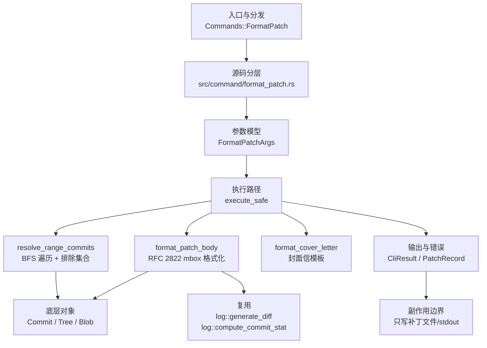

# `libra format-patch` 开发设计

## 命令实现目标

`libra format-patch` 将提交导出为 mbox 格式的邮件补丁文件。该命令解析 `A..B` 修订范围（空左右侧均默认 `HEAD`，单修订号按 `<spec>..HEAD` 处理），对范围内的每个非合并提交生成一个补丁文件（文件名后缀由 `--suffix` 决定，默认 `.patch`；`--numbered-files` 下改用纯序号并忽略后缀）。每个文件按 RFC 2822 标准生成 mbox 信封（`From ` 行）、邮件头（`From:`、`Date:`、`Subject:`、`Message-ID` 等）和邮件体（提交正文 + `---` 分隔 + diffstat + unified diff）。输出通过 `-o` 写入目录或通过 `--stdout` 输出到标准输出。

## 对比 Git 与兼容性

- 兼容级别：`partial`。核心补丁导出能力已公开，支持 15+ 参数（含 `--suffix <sfx>`，默认 `.patch`；`--zero-commit`；`--signature`/`--no-signature`；`--signature-file <file>`；`--encode-email-headers`/`--no-encode-email-headers`），merge 提交默认跳过。收件人头 `--to`/`--cc`（可重复，按 git 折叠续行，置于 MIME 头之后，cover letter 同样输出）与 `--no-to`/`--no-cc`（抑制——Libra 无 `format.to`/`format.cc` 配置可重置）已实现。`--from [<ident>]`（改写 `From:` 头为给定身份，无值时用 committer 配置身份；与提交作者不同则将原作者保留为 in-body `From:` 供 `git am` 还原）已实现。`--notes[=<ref>]`（在 `---` 之后、diffstat 之前附加 notes，复用 notes 子系统）已实现。`--attach` / `--inline`（将补丁包成 `multipart/mixed` MIME：log+diffstat 为 `text/plain` part，diff 为 `text/x-patch` part，`Content-Disposition` 分别为 `attachment`/`inline`；boundary 取工具版本，二者互斥）已实现。`--base=<commit>`（记录 `base-commit:` 尾注 + 介于 base 与系列之间各提交的 `prerequisite-patch-id:`，供 `git am --base`）已实现：尾注挂在最后一个补丁上，或在 `--cover-letter` 时挂在 cover letter 上；base 必须是系列的祖先（否则 `base commit should be the ancestor of revision list`，退出 128）；patch-id 复用 git 的 stable 算法（逐行去空白、跳过 `index` 行、忽略 hunk 行号、按文件 SHA 后用逐字节进位加法合并，即 git `flush_one_hunk`，非 XOR），对 text diff 与 `git patch-id --stable` 字节一致（含多文件）；前置补丁跳过 merge 提交；**binary 文件前置补丁不保证字节一致**（见缺口表说明）。`--base=auto`（依赖上游推断 base）暂以用法错误（退出 129）拒绝。未实现的 Git 选项包括 `--interdiff`、`--range-diff`（`--force` 非 Git format-patch 标志）。

## 设计方案

- 入口与分发：`src/cli.rs::Commands::FormatPatch` 公开顶层 CLI，`src/command/mod.rs` 导出 `format_patch` 模块；CLI 层在 `src/cli.rs` 把解析后的参数交给 `command::format_patch::execute_safe`，命令模块负责把领域错误转换为 `CliError` / `CliResult`。
- 源码分层：主要实现文件为 `src/command/format_patch.rs`。参数类型为 `FormatPatchArgs`；错误类型为 `FormatPatchError`（`thiserror::Error` derive），映射到 `CliError` 的 `NotInRepo`、`CliInvalidTarget`、`IoWriteFailed` 等稳定错误码；主要执行函数为 `execute_safe`、`resolve_range_commits`、`format_patch_body`、`format_cover_letter`、`write_patch_file`。
- 执行路径：`execute_safe` 负责 CLI 安全包装、错误映射和输出配置；核心流程解析修订范围 → 遍历提交图 → 生成 diff → 格式化 mbox → 写入文件或 stdout。

- 流程图：

- 底层操作对象：`Commit`（通过 `log::get_reachable_commits` 加载，读取 `id`、`tree_id`、`parent_commit_ids`、`author`、`committer`、`message`）；`Tree` / `Blob`（由 `log::generate_diff` 和 `log::compute_commit_stat` 内部加载）。
- 输出与错误契约：`execute_safe` 支持 `--json` 输出结构化 `PatchRecord[]`；`--cover-letter` 写出封面（文件名为 `0000-cover-letter` + 后缀，后缀默认 `.patch` 由 `--suffix` 决定；`--numbered-files` 下为纯 `0`）时，该文件以 `number = 0` 的记录出现在 `PatchRecord[]` 中；`--quiet` 抑制文件路径打印；`--no-pager` 跳过分页器；失败通过 `CliError` / `CliResult` 传播，携带稳定错误码：`RepoNotFound`（`LBR-REPO-001`）、`CliInvalidTarget`（`LBR-CLI-003`，范围无提交）、`IoWriteFailed`（`LBR-IO-002`，文件写入失败）。新增失败模式要补稳定错误码、用户提示和回归测试。
- 副作用边界：该命令不应修改索引、对象库、refs/HEAD 或 reflog；唯一写入面是补丁文件（后缀默认 `.patch`，可由 `--suffix` 改变；`--numbered-files` 下为纯序号无后缀）或 stdout。

## 实现历史

- 2026-06-20 `3b43f2ca`（`feat(format-patch): add core implementation`）：初始实现，包含 FormatPatchArgs、范围解析、mbox 格式化、CLI 接入。
- 2026-06-20 `cd7696d4`（`docs(format-patch): add user documentation and compatibility entry`）：用户文档和兼容矩阵。
- 2026-06-20 `66e7a339`（`test(format-patch): add integration tests and compat surface guard`）：20 个集成测试和表面守卫。
- 2026-06-20 `945acee8`（`fix(format-patch): fix commit ordering, double-load, and cover letter reroll`）：修复提交排序、重复加载和封面信版本号。
- 2026-06-20 `1c2fd7b1`（`fix(format-patch): handle empty left side in ..B range and --start-number 0`）：修复空 `..` 侧默认值和编号 0 冲突。
- 2026-06-21 `e7e6c07b`（`fix(format-patch): default empty .. sides to HEAD for Git compatibility`）：空左右侧统一默认 `HEAD`。
- 2026-06-21 `574a6588`（`fix(format-patch): always number filenames and use UTF-8 safe slug truncation`）：文件名始终含序号，slug 截断 UTF-8 安全。

## 当前状态

- 公开状态：已公开；模块状态：`src/command/mod.rs` 导出 `format_patch`，`src/cli.rs::Commands::FormatPatch` 负责 CLI 接入。
- 用户文档：`docs/commands/format-patch.md`。
- Synopsis：`libra format-patch [OPTIONS] [revision-range]`。
- 公开参数包括：`[revision-range]`、`-o, --output-directory <DIR>`、`--stdout`、`-n, --numbered`、`--start-number <N>`、`--subject-prefix <PREFIX>`、`--cover-letter`、`--thread` / `--no-thread`、`--in-reply-to <MESSAGE_ID>`、`--to <ADDRESS>`、`--cc <ADDRESS>`、`--no-to`、`--no-cc`、`--from [<IDENT>]`、`-v, --reroll-count <N>`、`-s, --signoff`、`--full-index`、`--no-stat`、`--keep-subject`、`--suffix <SFX>`、`--zero-commit`、`--signature <SIGNATURE>`、`--no-signature`、`--signature-file <FILE>`、`--encode-email-headers` / `--no-encode-email-headers`、`--numbered-files`、`--notes [<REF>]`、`--attach`、`--inline`。`--signature-file` 在 `execute_safe` 早期读文件并填入 `signature` 槽（与 `--signature` 互斥，trim 尾换行）；`--encode-email-headers` 经 `encode_email_header` 对含非 ASCII 的 `From` 名称与 `Subject` 做整值 RFC 2047 Q 编码（`=?UTF-8?q?...?=`），纯 ASCII 或未开启时原样输出。

## 还未实现的功能

| 类别 | 未完成项 | 当前处理 |
|---|---|---|
| ✅ 已实现 | `--attach` / `--inline`（MIME 附件/内联模式） | 已公开：`format_patch_body` 在 `--attach`/`--inline` 下输出 `multipart/mixed`——`Content-Type` 头改为 `multipart/mixed; boundary="------------libra <ver>"`，正文为 “This is a multi-part message in MIME format.” + `text/plain`（log+`---`+notes+diffstat）part + `text/x-patch`（diff，`name=`/`filename=` 取补丁文件名）part + 关闭 boundary；`--attach` 用 `Content-Disposition: attachment`，`--inline` 用 `inline`，二者 clap `conflicts_with` 互斥（违反报 `LBR-CLI-002`/退出 129）。与 git `format-patch --attach` 结构字节对齐（boundary 取版本而非 git 版本串）。带集成测试 `attach_wraps_patch_in_mime_multipart`、`inline_uses_inline_content_disposition`、`attach_and_inline_are_mutually_exclusive`、`no_attach_stays_plain_text`。`--no-attach` 为默认行为，未单列。 |
| ✅ 已实现 | `--suffix <sfx>`（文件名后缀，默认 `.patch`） | 已公开：通过 `patch_filename` 的 `suffix` 参数与 cover-letter 列表统一使用；默认 `.patch` 保持原行为。带集成测试（`suffix_changes_patch_filename_extension`）。 |
| ✅ 已实现 | `--signature <sig>` / `--no-signature`（自定义/省略签名） | 已公开：`push_signature` 统一两处页脚（补丁正文 + cover letter）——`--no-signature` 完全省略 `-- ` 页脚；`--signature <s>` 设置文本；默认仍为 libra 版本号。带集成测试（`signature_controls_patch_footer`）。 |
| ✅ 已实现 | `--signature-file <file>`（从文件读取签名） | 已公开：`execute_safe` 早期读文件内容（trim 尾换行）填入 `signature` 槽，与 `--signature` 互斥，`--no-signature` 仍优先；读失败报 `LBR-IO-001`。带集成测试（`signature_file_sets_the_footer`）。 |
| ✅ 已实现 | `--to` / `--cc` / `--no-to` / `--no-cc`（邮件收件人/抄送头） | 已公开：`--to`/`--cc` 可重复，`resolve_recipients` 应用 `--no-to`/`--no-cc`（Libra 无 `format.to`/`format.cc` 配置，故直接抑制对应头），`fold_addresses` 按 git 以 `,`+4 空格续行折叠多地址，`push_recipient_headers` 在 MIME 头之后注入 `To:`/`Cc:`（每个补丁与 cover letter 都注入，与 git 头序一致）。值仅经 `sanitize_header_value`（剥离控制符防头注入），**不做 RFC2047 编码**——git 即便在 `--encode-email-headers` 下也原样输出收件人地址，已字节级差分验证。带集成测试（`recipient_headers_to_and_cc`，含头序、折叠、抑制、cover letter 与非 ASCII 原样用例）。 |
| ✅ 已实现 | `--from [<ident>]`（覆盖 `From:` 头，作者移入 in-body `From:`） | 已公开：`from: Option<Option<String>>`（`num_args=0..=1`+`require_equals`）。`resolve_from_identity` 解析 `--from=<ident>`（`parse_from_ident` 拆 `Name <email>`）或 `--from` 无值（`resolve_signoff_identity` 取 committer 配置身份）。`format_patch_body` 用该身份生成 `From:` 头（按 `--encode-email-headers` 编码），若 name/email 与提交作者不同，则在头/正文分隔空行后注入 in-body `From: <原作者>`（仅 sanitize，不编码，供 `git am` 还原）。cover letter 的 `From:` 同样用该身份。已与 git 字节级差分验证（differ→in-body、no-arg→committer、same→无 in-body）。带集成测试（`from_header_rewrites_author`）。 |
| ✅ 已实现 | `--base <commit>`（记录基础提交，供 `git am --base` 使用） | 已公开：`build_base_block` 解析 base（拒绝 `--base=auto`，退出 129），校验 base 是系列祖先（`reach(series_parent)` 含 base，否则 `base commit should be the ancestor of revision list` 退出 128），把 `reach(series_parent) \ reach(base)` 按 oldest-first 作为前置补丁，逐个经 `git_patch_id_for_commit`（git stable patch-id：`log::generate_diff` 输出逐行 `strip_whitespace`、跳过 `index` 行、`scan_hunk_header` 仅取行数忽略行号、按文件 `patch_id_digest`(SHA1/SHA256 依 `commit.id.kind()`) 后用逐字节进位加法合并（git `flush_one_hunk`，非 XOR）；与 `git patch-id --stable` 及 `prerequisite-patch-id` 字节一致，含多文件提交）算出 `prerequisite-patch-id`。前置补丁集合按 git 语义跳过 merge 提交（`parent_commit_ids.len() <= 1`）。**已知限制**：text diff 与 `git patch-id --stable` 字节一致；**binary 文件前置补丁**不保证字节一致——Libra 的 diff 渲染器输出裸 `Binary files differ`（git 为 `Binary files a/X and b/X differ`），且 git format-patch 计算 binary 前置 id 走内部路径、与其自身 `git patch-id` 输出都不同（实测 `git diff-tree -p|git patch-id` 与 `format-patch --base` 前置 id 对同一 binary 提交不一致）。邮件补丁系列中的 binary blob 罕见，text 用例（真实场景）已精确。尾注块（空行 + `base-commit:` + 各 `prerequisite-patch-id:`）在签名 `-- ` 之前注入：无 cover letter 时挂最后一个补丁，有 `--cover-letter` 时挂 cover letter。带集成测试 `base_records_base_commit_and_prerequisite_patch_ids`、`base_direct_parent_has_no_prerequisites`、`base_on_non_ancestor_fails`、`base_auto_is_rejected`、`base_with_cover_letter_lands_on_cover`。`--base=auto`（依赖上游推断）暂以用法错误退出 129 拒绝。 |
| Git flag | `--interdiff <prev>` / `--range-diff <prev>`（补丁间差异/范围差异） | 未公开；依赖 interdiff/range-diff 引擎。命令层。 |
| ✅ 已实现 | `--notes[=<ref>]`（在补丁中附加 notes） | 已公开：`notes: Option<Option<String>>`（`num_args=0..=1`+`require_equals`）。`render_notes_block` 在 `---` 分隔符之后、diffstat 之前，按 git 字节级格式注入：空行 + `Notes:`（默认 ref `refs/notes/commits`）或 `Notes (<short>):`（其他 ref，剥离 `refs/notes/` 前缀）头，note 每行缩进 4 空格（空行亦缩进，与 git 一致，先 trim 尾换行），再补一空行。复用 `internal::notes::{normalize_notes_ref, show}`；无 note（`NotFound`）则整块省略，与 git 一致。带集成测试（`notes_appends_block_after_separator`、`notes_custom_ref_uses_parenthesized_header`）。`--no-notes` 为默认行为，未单列。 |
| ✅ 已实现 | `--encode-email-headers` / `--no-encode-email-headers`（QP 编码非 ASCII 邮件头） | 已公开：`encode_email_header` 对含非 ASCII 的 `From` 名称与 `Subject` 做 RFC 2047 Q 编码（拆分为 ≤75 字符的多个 encoded-word，不跨多字节字符），纯 ASCII 或未开启时原样。默认关闭（Libra 无 `format.encodeEmailHeaders` 配置；git 由该配置决定，未设置时亦关闭）。带集成测试（`encode_email_headers_q_encodes_nonascii_subject`）。 |
| 非 Git flag | `--force`（强制覆盖已有文件） | `--force` 并非 Git format-patch 标志（git 默认即静默覆盖），故不实现；保留此行仅作澄清。 |
| ✅ 已实现 | `--zero-commit`（每个补丁的 `From <hash>` 信封行输出全零 hash） | 已公开：`format_patch_body` 按 `commit.id` 的十六进制长度生成全零串，仅替换信封行（其余补丁内容不变），与 `git format-patch` 一致。带集成测试（`zero_commit_zeroes_the_envelope_hash`）。 |
| ✅ 已实现 | `--numbered-files`（纯序号文件名，不含 slug/后缀） | 已公开：`patch_filename` 在该模式下直接返回 `patch_num.to_string()`（cover letter 为 `0`），忽略 `--suffix`，与 `git format-patch` 一致。带集成测试（`numbered_files_uses_bare_sequence_numbers`）。 |
| 行为差异 | 合并提交默认跳过，无可选 `--diff-merges` 参数 | 当前实现直接在范围解析时过滤掉所有多父提交。 |
| 兼容矩阵 | `COMPATIBILITY.md` 已登记该命令。 | 已纳入用户可见兼容矩阵和矩阵守卫。 |
| CLI 接入 | `src/cli.rs::Commands::FormatPatch` 已公开。 | 已接入 CLI；后续扩展参数时同步文档、矩阵和测试。 |

## 维护要求

- 改进本命令前，必须先阅读并遵循 [docs/development/commands/_general.md](_general.md)；这是命令设计、实现、测试和文档同步的强制要求。
- 任何行为变更都要先核对实现源码，再同步 `COMPATIBILITY.md`、`docs/commands/<cmd>.md` 和相关测试。
- 新增 Git 兼容参数时必须明确 tier、错误码、JSON/机器输出契约和回归测试。
- 若决定发布该命令，最小闭环是：CLI 变体、`src/command/mod.rs` 导出、dispatch、用户文档、兼容矩阵和测试。
