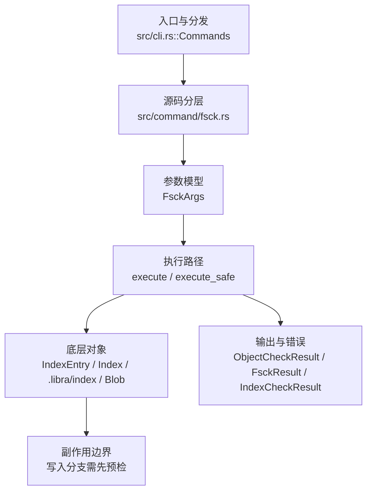

# `libra fsck` 开发设计

## 命令实现目标

`libra fsck` 的目标是检查对象、refs、索引和 reflog 的完整性。实现需要支持对象格式校验、dangling/unreachable 报告、lost-found 文档口径和发现严重损坏时的非零退出，确保损坏状态不会被静默吞掉。

## 对比 Git 与兼容性

- 兼容级别：`partial`。对象、refs、索引、reflog 和 connectivity 检查已支持；`--strict` 已支持（commit email/timezone、commit tree/parent 存在性与类型、tree 条目存在性/类型/排序检查，刻意窄于 Git：未实现 `.gitmodules`/pathname-charset 检查与 `fsck.<msg-id>` 严重级别配置）；`--full`/`--no-full` pack 校验已公开（默认开启，与 git 一致；逐个校验 `.pack` 的尾部校验和 + 经 `verify_pack_index::parse_index` 校验 `.idx`，**不解码 pack 对象**故对 body-corrupt pack 报错而非 panic）；JSON/machine 输出已公开。

- 当前矩阵承诺常用 Git 行为已支持；新增语义必须同步矩阵、用户文档和测试。

## 设计方案

- 入口与分发：已公开接入 `src/cli.rs::Commands`；已由 `src/command/mod.rs` 导出。CLI 层在 `src/cli.rs` 把解析后的参数交给命令模块，命令模块负责把领域错误转换为 `CliError` / `CliResult`。
- 源码分层：主要实现文件为 `src/command/fsck.rs`。参数/子命令类型包括：`FsckArgs`；输出、错误或状态类型包括：`ObjectCheckResult`、`FsckResult`、`IndexCheckResult`；主要执行函数包括：`execute`、`execute_safe`。
- 执行路径：`execute_safe` 负责 CLI 安全包装、错误映射和输出配置；索引路径会加载、比较、刷新或保存 `.libra/index`；对象路径会解析 revision 并读写 blob/tree/commit/tag 等对象；引用路径会读取或更新 SQLite refs、HEAD 与 reflog；数据库路径会通过 SeaORM/SQLite 或 D1 客户端持久化元数据。

- 流程图：以下流程图按当前源码分层展示主路径和底层对象边界，便于维护者把代码入口、执行函数和副作用范围对应起来。

- 底层操作对象：`IndexEntry`（索引条目，承载路径、mode、object id 和 stat 元数据）；`Index` / `.libra/index`（暂存区状态、路径条目和刷新/保存边界）；`Blob`（文件内容或 LFS pointer 写入对象库后的 blob 对象）；`Commit`（提交对象、父提交关系和提交消息载荷）；`Tree`（由索引或对象遍历生成的目录树对象）；`Branch` / branch store（SQLite refs 上的分支读写、过滤和上游关系）；`Head`（SQLite 中的 HEAD 指向、当前分支和 detached 状态）；`ClientStorage`（本地/分层对象存储读写入口）；SeaORM / `.libra/libra.db`（配置、refs、reflog、AI/发布元数据等 SQLite 表）；`ObjectHash`（SHA-1/SHA-256 对象 ID 和 revision 解析结果）；`ObjectType`（blob/tree/commit/tag 类型分派）
- 输出与错误契约：人类输出、`--json` / `--machine` 输出和 quiet/verbose 分支必须继续走现有 `OutputConfig` / `emit_json_data` / `CliError` 路径；新增失败模式要补稳定错误码、用户提示和回归测试。
- 副作用边界：凡是写入索引、对象库、refs/HEAD、reflog、SQLite/D1、工作树或远端的路径，都必须先完成参数校验和 dry-run/预检分支，再执行持久化，避免部分写入后静默成功。

## 实现历史

- 本节依据本地 main 分支提交历史重写，筛选与该命令实现、测试或文档路径直接相关的提交；以下是归纳后的实现脉络。
- 2026-05-18 `7f0e37b6`（`feat(fsck): implement fsck command (#371)`）：基础实现节点：implement fsck command (#371)；当前实现的主要轮廓可追溯到该提交。
- 2026-06-07 `7d3d9d31`（`feat(fsck): verify pack integrity by reusing verify-pack in-process (v0.17.1407)`）：历史节点曾引入复用 verify-pack 的 pack 完整性检查，但该 pack 校验路径在后续提交中已从 `src/command/fsck.rs` 移除，当前实现不再校验 pack。
- 2026-06-05 `1a48d4e7`（`feat(fsck): add --strict commit/tree format and graph checks`）：新增 `--strict` 严格格式与图检查。该改动曾被一次 reconcile 丢弃，2026-06-18 重新应用到当前 `src/command/fsck.rs`：`--strict` 检查 commit author/committer email 含 `@`、timezone 为 `±HHMM` 且在 ±1400 内、commit 的 tree/parent 存在且类型正确、tree 条目存在且类型与 mode 匹配并按 Git 规范排序。`--full`/`--no-full` pack 校验入口仍未恢复。
- 2026-06-07 `7e9ffa6d`（`fix(fsck): close compatibility plan gaps`）：实现修正：close compatibility plan gaps；该节点把边界行为、错误处理或兼容差异纳入当前实现约束。
- 历史结论：当前文档应以这些提交之后的代码、测试和兼容矩阵为准；更早的迁移式文档只保留为背景，不再作为事实来源。

## 当前状态

- 公开状态：已公开；模块状态：已导出。
- 用户文档：`docs/commands/fsck.md`。
- Synopsis：`libra fsck [OPTIONS] [OBJECT]`。
- 公开参数/子命令包括：`[OBJECT]`、`-v, --verbose`、`--no-reflogs`、`--unreachable`、`--dangling [<BOOL>]`、`--no-dangling`、`--name-objects`、`--lost-found`、`--root`、`--tags`、`--connectivity-only`、`--strict`、`--full`/`--no-full`、`--heal`。
- `--heal`（`lore.md` §0.4，Libra 扩展、Git 无对应）：从 durable tier 重取修复缺失/损坏对象。设计要点：
  - **heal-first + 全程本地读**：`run_fsck` 先 `run_heal_pass` 再跑检查，故退出码反映修复后状态。**关键不变量**：`--heal` 下所有验证读都走本地——`run_fsck` 给检查用 `ClientStorage::init_local`；`walk_object_refs`/`find_and_report_roots` 已改为经**传入的 storage** 读取（`storage.get` + `from_bytes`，不再走全局 `load_object`→`util::objects_storage()` 的缓存分层存储，也不做 `refs/replace` 解析），故检查阶段不会经分层 `get` 从远端拉取。全流程中**唯一**触达 durable tier 的路径就是 `run_heal_pass` 里经 `is_intentionally_absent` 钩子放行后的 `tiered.heal`——保证被 obliterate 的对象既不会在发现也不会在验证阶段被复活（§2.5 tombstone-safe）。非 `--heal` 路径行为不变（检查仍用 `ClientStorage::init` 分层）。
  - **候选收集** `collect_heal_candidates(local, extra_roots)`：复用 `collect_reachability_context` + `bfs_mark_reachable`（现均本地）；`missing` 用 `local.exist`（同时查 loose 与 pack index）判定，**不**用只含 loose 的 `all_objects`——否则打包对象会被误判缺失、在无 durable tier 时误报 unrecoverable；`corrupt = all_objects`（loose）中经 `stored_object_is_corrupt`（复用 `utils::storage::tiered::verify_fetched_object`）重算 OID 不符者（打包对象完整性由 fsck 的 pack 校验单独覆盖）。带集成 `test_fsck_heal_does_not_flag_packed_objects_as_missing` 回归。
  - **不动点修复**：`run_heal_pass` 循环——修好一个缺失 commit/tree 会让其引用在本地变得可发现，从而暴露更多缺失后代；每轮本地重新发现并修复，直到某轮未修好任何对象为止。每个 OID 经 `attempted` 集合只尝试一次，故循环受候选总数上界必然终止。
  - **修复入口**：新增 `Storage::heal(hash)` trait 方法（默认 `Ok(false)`，仅 `TieredStorage` override：`remote.get`→`verify_fetched_object`→`local.put`，绕过 local-first 短路故可覆盖损坏对象；先验证后落盘，绝不伪造；大对象修复后按 `threshold` 插入 LRU，与 `get` 一致受 `LIBRA_STORAGE_CACHE_SIZE` 淘汰约束，避免修复大量大对象撑爆本地缓存）；`ClientStorage::heal` 为同步桥接。远端重取继承 object_store 的 429/`SlowDown` 退避（§0.2），校验复用 §0.3。
  - **显式对象**：`fsck --heal <OBJECT>` 把该 OID 作为 extra root 注入 `collect_heal_candidates`，故即使它不被 refs/reflog/index 引用也会被尝试修复；若它修复成一个 commit/tree，不动点循环会继续发现并修复其子树。
  - **有意缺失跳过位**：`is_intentionally_absent(hash)` 前向兼容 §2.5 obliteration tombstone，当前恒 `false`，是 §2.5 唯一扩展点——保证 heal 从第一天起就 tombstone-aware、不会复活被 obliterate 的对象。
  - **报告与退出码**：`HealReport{ healed, unrecoverable, skipped_intentional_absence, failed, messages }`，human 经 `print_heal_summary` 打印、JSON 作为 `heal` 字段；失败消息经 `redact_url_credentials` 脱敏。无 durable tier 时全部候选 `unrecoverable`（不伪造）。退出码经 `fsck_failed(&result)` 判定：`has_errors || heal.unrecoverable>0 || heal.failed>0`——即使某些模式（`--object` 作用域、`--connectivity-only`）修复后检查未重新暴露该候选，只要仍有不可恢复/失败对象即 exit 1。
  - 已知边界：shallow clone 的边界父对象也会被当作 missing 候选并尝试重取（不在远端则报 unrecoverable，无害不伪造）；精确排除 shallow 边界留待后续。
  - 测试：`utils::storage::tiered` 的 `heal_recreates_missing_object_from_remote`/`heal_overwrites_corrupt_local_object`/`heal_returns_false_when_absent_from_remote`/`local_storage_cannot_heal`（storage 层重取-校验-落盘全覆盖，in-memory object_store）；L1 集成 `fsck_test::test_fsck_heal_local_only_reports_unrecoverable`/`test_fsck_heal_json_includes_report`（命令层 wiring：候选收集/钩子/报告/退出码，本地无 durable tier）；L3 集成 `cloud_storage_backup_test::fsck_heal_restores_object_from_durable_tier`（真实 S3/R2 durable tier 端到端，`test-live-cloud` + `LIBRA_STORAGE_*` gated）。

## 还未实现的功能

| 类别 | 未完成项 | 当前处理 |
|---|---|---|
| 输出契约 | `execute_safe` 当前未使用 `OutputConfig` 渲染 JSON/machine 输出。 | 后续实现时需要同步源码、测试和兼容矩阵。 |
| ✅ 已实现 | pack 校验入口（`--full`/`--no-full`） | 已公开：`FsckArgs` 增 `--full`（默认）/`--no-full`，Stage 11 `check_packs` 对 `.libra/objects/pack/*.pack` 逐个校验——`verify_pack_self_checksum` **流式**重算 `.pack` 尾部哈希（`PackHasher` 按 `get_hash_kind` 选 SHA1/SHA256，64KiB 分块读取、不整文件载入内存，检出 body corruption），`.idx` 经 `verify_pack_index::parse_index`（接受 git/libra 索引哈希变体 + fanout/排序校验），并**交叉校验** `parsed.pack_hash` 与 `.pack` 实测尾部哈希一致（检出 stale/swapped idx）。pack 目录/条目读取失败上报为错误而非静默跳过。`--verbose` 进度行经 `stdout_suppressed()` 守护（含既有 check_index/connectivity/objects/reflog 阶段），故 `--json --verbose` 不污染 JSON。**不调用 `decode_pack`**，故 body-corrupt pack 报 `error:` + 退出 1 而非 panic（这正是历史 v1407 集成被移除的原因，现以校验和路径绕开）。带集成测试 `fsck_full_passes_on_a_valid_pack`、`fsck_full_reports_corrupt_pack_without_panicking`、`fsck_full_reports_corrupt_index`、`fsck_full_detects_mismatched_index`、`fsck_full_json_verbose_emits_clean_json`。 |

## 维护要求

- 改进本命令前，必须先阅读并遵循 [docs/development/commands/_general.md](_general.md)；这是命令设计、实现、测试和文档同步的强制要求。
- 任何行为变更都要先核对实现源码，再同步 `COMPATIBILITY.md`、`docs/commands/<cmd>.md` 和相关测试。
- 新增 Git 兼容参数时必须明确 tier、错误码、JSON/机器输出契约和回归测试。
