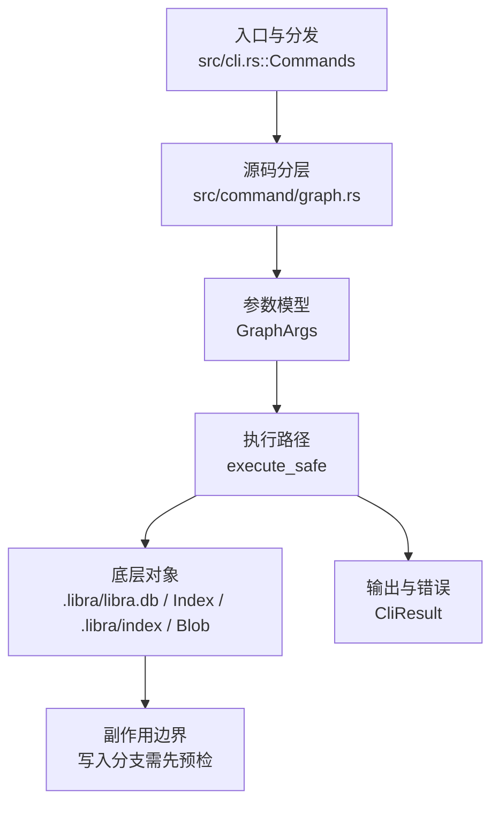

# `libra graph` 开发设计

## 命令实现目标

`libra graph` 的目标是在 TUI 中查看 AI thread 的版本图和运行关系。它服务于 Libra Code/Agent 运行历史诊断，重点是 thread UUID、仓库路径解析和只读展示，不对应 Git 命令。

## 对比 Git 与兼容性

- 兼容级别：`intentionally-different`。Libra AI graph inspection extension, not a Git command

- 该命令或行为属于 Libra 扩展/有意差异；重点是清晰边界、结构化输出和可测试错误，而不是 Git 完全同形。

## 设计方案

- 入口与分发：已公开接入 `src/cli.rs::Commands`；已由 `src/command/mod.rs` 导出。CLI 层在 `src/cli.rs` 把解析后的参数交给命令模块，命令模块负责把领域错误转换为 `CliError` / `CliResult`。
- 源码分层：主要实现文件为 `src/command/graph.rs`。参数/子命令类型包括：`GraphArgs`；输出、错误或状态类型包括：源码未暴露独立输出/错误类型，错误通过 `CliResult` 或上层命令错误统一传播；主要执行函数包括：`execute_safe`。
- 执行路径：`execute_safe` 负责 CLI 安全包装、错误映射和输出配置；索引路径会加载、比较、刷新或保存 `.libra/index`；对象路径会解析 revision 并读写 blob/tree/commit/tag 等对象；数据库路径会通过 SeaORM/SQLite 或 D1 客户端持久化元数据；AI 路径会读写 session、checkpoint、thread graph 或 agent profile 状态。

- 流程图：以下流程图按当前源码分层展示主路径和底层对象边界，便于维护者把代码入口、执行函数和副作用范围对应起来。

- 底层操作对象：AI thread graph（线程版本图和运行关系）；SeaORM / `.libra/libra.db`（配置、refs、reflog、AI/发布元数据等 SQLite 表）；`Index` / `.libra/index`（暂存区状态、路径条目和刷新/保存边界）；`Blob`（文件内容或 LFS pointer 写入对象库后的 blob 对象）；`Tree`（由索引或对象遍历生成的目录树对象）；`LocalStorage`（本地对象或发布存储根目录）；`Storage` / `StorageExt`（对象存储抽象，覆盖本地、remote 和 publish 存储）；`DatabaseConnection`（SeaORM 数据库连接）
- 输出与错误契约：`execute_safe(args, output)` 在加载 `ThreadGraph` 后，若 `output.is_json()` 则调 `ThreadGraph::to_json()` + `emit_json_data("graph", ...)` 返回结构化输出（agent 路径，免去需要终端的 TUI），否则调用 `run_graph_tui` 启动 ratatui TUI；失败路径仍通过 `CliError`（`command_usage` / `repo_not_found` / `fatal` + `RepoCorrupt` / `io`）返回稳定错误码、用户提示和回归测试。`--json` 是全局 flag（经 `OutputConfig`），非 `GraphArgs` 字段。
- 副作用边界：凡是写入索引、对象库、refs/HEAD、reflog、SQLite/D1、工作树或远端的路径，都必须先完成参数校验和 dry-run/预检分支，再执行持久化，避免部分写入后静默成功。

## 实现历史

- 本节依据本地 main 分支提交历史重写，筛选与该命令实现、测试或文档路径直接相关的提交；以下是归纳后的实现脉络。
- 2026-05-23 `165a0a1e`（`feat(graph): wire GRAPH_EXAMPLES into clap after_help (v0.17.826)`）：基础实现节点：wire GRAPH_EXAMPLES into clap after_help (v0.17.826)；当前实现的主要轮廓可追溯到该提交。
- 2026-05-23 `d98408ea`（`fix(graph): align <THREAD_UUID> + --repo <PATH> value names (v0.17.898)`）：实现修正：align <THREAD_UUID> + --repo <PATH> value names (v0.17.898)；该节点把边界行为、错误处理或兼容差异纳入当前实现约束。
- 历史结论：当前文档应以这些提交之后的代码、测试和兼容矩阵为准；更早的迁移式文档只保留为背景，不再作为事实来源。

## 当前状态

- 公开状态：已公开；模块状态：已导出。
- 用户文档：`docs/commands/graph.md`。
- Synopsis：`libra graph <THREAD_UUID> [--repo <PATH>]`。
- 公开参数/子命令包括：`<THREAD_UUID>`、`--repo <PATH>`。

## 还未实现的功能

| 类别 | 未完成项 | 当前处理 |
|---|---|---|
| 兼容矩阵说明 | Libra AI graph inspection extension, 不是 Git 命令 | 按当前兼容矩阵保留；实现状态变化时同步 `_compatibility.md` 和测试证据。 |
| ✅ 已实现 | `--json` / `--machine` 结构化输出 | 全局 `--json`（`OutputConfig`）使 `execute_safe` 在 TUI 之前走 `ThreadGraph::to_json()` + `emit_json_data`。`data` 含线程元数据（`thread_id`/`title`/`freshness`/`thread_version`/`scheduler_version`/`updated_at`/`selected_plan_id`/`active_task_id`/`active_run_id`）与 `nodes` 数组（每个节点 `depth`/`kind`(intent/plan/task/run/patchset 小写)/`id`/`label`/`tags`/`detail`(k-v 对象)/`object`(可空，含 `object_type`/`hash`/`git_object_type`/`summary`)）。`GRAPH_EXAMPLES` 第三行 `libra graph --json <thread-uuid>` 现已兑现。带单元测试（`to_json_serializes_metadata_and_nodes`）。 |

## 维护要求

- 改进本命令前，必须先阅读并遵循 [docs/development/commands/_general.md](_general.md)；这是命令设计、实现、测试和文档同步的强制要求。
- 任何行为变更都要先核对实现源码，再同步 `COMPATIBILITY.md`、`docs/commands/<cmd>.md` 和相关测试。
- 新增 Git 兼容参数时必须明确 tier、错误码、JSON/机器输出契约和回归测试。
