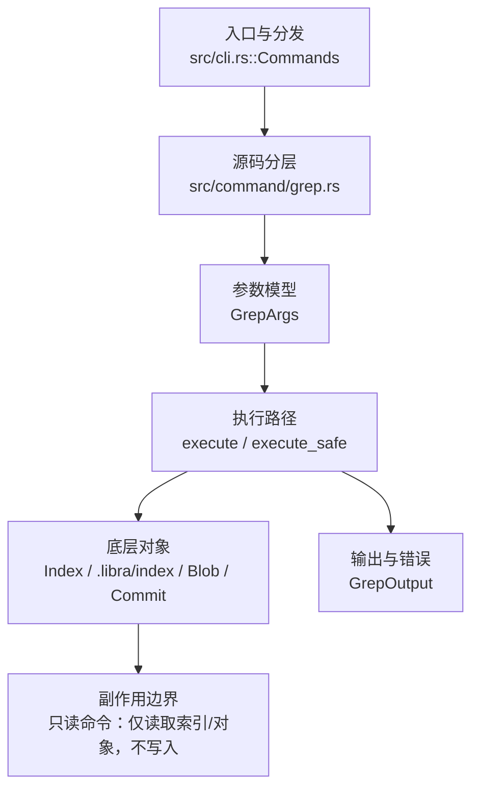

# `libra grep` 开发设计

## 命令实现目标

`libra grep` 的目标是在已跟踪文件或指定范围内搜索文本模式。实现需要覆盖仓库内搜索、未跟踪/无仓库模式、忽略规则、输出格式、byte offset、上下文行、扩展正则、深度限制（`--max-depth`）与 Git grep 退出码（命中 0、无命中 1、命令错误 2）；剩余兼容缺口主要是 Perl 正则（`-P` 显式拒绝）与函数显示（`-p`/`-W`）。

## 对比 Git 与兼容性

- 兼容级别：`partial`。tracked/index/tree search 与常用匹配/count/list/line flags 已支持；仓库搜索 pathspec 经共享 `utils::pathspec::PathspecSet` 支持普通路径/目录前缀、默认通配符、`:(top)`、`:(exclude)`、`:(icase)`、`:(literal)`、`:(glob)`；`-A`/`-B`/`-C` 上下文行、`-E`/`-G` 正则别名（`-P` 显式拒绝，命令错误退出 2）、`-a`/`-I` 二进制控制、`--heading`/`--break`、`-z`/`--null`、`-m`/`--max-count`、`-o`/`--only-matching`、`--untracked`（worktree 搜索额外纳入未跟踪、非忽略文件）、`--no-index`（无仓库、递归遍历文件系统、不套用 ignore；不使用仓库 pathspec magic）、`--max-depth <DEPTH>`（每个 pathspec 下最多下降 DEPTH 层目录；无 pathspec 时相对搜索根；负值=无限制）已支持。退出码遵循 Git grep 合同：命中 0、无命中 1 且不打印错误诊断、grep 命令层错误 2；仓库预检错误仍走 Libra 标准 fatal 退出码。

- 当前矩阵承诺常用 Git 行为已支持；新增语义必须同步矩阵、用户文档和测试。

## 设计方案

- 入口与分发：已公开接入 `src/cli.rs::Commands`；已由 `src/command/mod.rs` 导出。CLI 层在 `src/cli.rs` 把解析后的参数交给命令模块，命令模块负责把领域错误转换为 `CliError` / `CliResult`。
- 源码分层：主要实现文件为 `src/command/grep.rs`。参数/子命令类型包括：`GrepArgs`；输出、错误或状态类型包括：`GrepOutput`；主要执行函数包括：`execute`、`execute_safe`。
- 执行路径：`execute_safe` 负责 CLI 安全包装、错误映射和输出配置；索引路径会加载、比较、刷新或保存 `.libra/index`；对象路径会解析 revision 并读写 blob/tree/commit/tag 等对象；数据库路径会通过 SeaORM/SQLite 或 D1 客户端持久化元数据。

- 流程图：以下流程图按当前源码分层展示主路径和底层对象边界，便于维护者把代码入口、执行函数和副作用范围对应起来。

- 底层操作对象：`Index` / `.libra/index`（暂存区状态、路径条目和刷新/保存边界）；`Blob`（文件内容或 LFS pointer 写入对象库后的 blob 对象）；`Commit`（提交对象、父提交关系和提交消息载荷）；`Tree`（由索引或对象遍历生成的目录树对象）；SeaORM / `.libra/libra.db`（配置、refs、reflog、AI/发布元数据等 SQLite 表）；`ObjectHash`（SHA-1/SHA-256 对象 ID 和 revision 解析结果）
- 输出与错误契约：人类输出、`--json` / `--machine` 输出和 quiet/verbose 分支必须继续走现有 `OutputConfig` / `emit_json_data` / `CliError` 路径；新增失败模式要补稳定错误码、用户提示和回归测试。
- 副作用边界：凡是写入索引、对象库、refs/HEAD、reflog、SQLite/D1、工作树或远端的路径，都必须先完成参数校验和 dry-run/预检分支，再执行持久化，避免部分写入后静默成功。

## 实现历史

- 本节依据本地 main 分支提交历史重写，筛选与该命令实现、测试或文档路径直接相关的提交；以下是归纳后的实现脉络。
- 2026-04-05 `45291721`（`feat(grep): add git-like grep support (#336)`）：基础实现节点：add git-like grep support (#336)；当前实现的主要轮廓可追溯到该提交。
- 2026-06-05 `01997f50`（`feat(grep): add --untracked to also search untracked, non-ignored files`）：曾添加 `--untracked`，但被 `900c062`（`Update integration`）回退（[[goal_loop_work_vanished]] 模式）。
- 2026-06-26 (#160)：重新落地 `--untracked`。`get_search_files` 新增分支 → `get_working_tree_files_with_untracked`（tracked ∪ `list_workdir_files()` 的未跟踪-非忽略，按路径排序，`blob_hash: None` 从磁盘读取）；`conflicts_with = "cached"`；`--tree` 同用时运行期报错。
- 2026-06-05 `0e22f00d`（`feat(grep): add --no-index to search the filesystem without a repository`）：曾添加 `--no-index`，但被 `900c062`（`Update integration`）回退（[[goal_loop_work_vanished]] 模式）。
- 2026-06-26 (#161)：重新落地 `--no-index`。新增 `get_no_index_files`（`walkdir` 递归 + `pathdiff` 显示路径 + `SearchFile.read_override` 绝对路径读取）；`SearchFile` 新增 `read_override: Option<PathBuf>`；`execute_safe` 在 `no_index` 时跳过 `require_repo`；`cli.rs` 对 `Grep{no_index}` 用 `CommandPreflight::none()`（绕过 hash-kind preflight，仓库外可用）；`no_index` 字段设为 `pub` 以便 preflight 读取。`conflicts_with_all=[cached,untracked,tree]`。
- 2026-06-05 `e3bfe11`（`feat(grep): add -A/-B/-C context lines with group separators`）：曾添加 `-A`/`-B`/`-C` 上下文行与分组分隔符；该批改动一度被 `900c062`（`Update integration`）回退，现已重新实现并补齐测试（见「上下文行」已实现项）。
- 2026-06-05 `2d471be`（`feat(grep): add --heading/--no-heading, --break, and -z/--null output formats`）：曾添加 `--heading`/`--no-heading`、`--break` 与 `-z`/`--null` 输出格式；该批改动一度被 `900c062`（`Update integration`）回退，现已重新实现并补齐集成测试（见「当前状态」与缺口表中标记为「✅ 已实现」的三行）。
- 2026-06-05 `e8151a5`（`feat(grep): add -a/--text and -I binary-file handling`）：曾添加 `-a`/`--text` 与 `-I` 二进制文件处理；该批改动一度被 `900c062`（`Update integration`）回退，现已重新实现（见「强制文本搜索」「忽略二进制文件」已实现项）。
- 2026-06-05 `3e17784`（`feat(grep): accept -E/-G as regex aliases and decline -P/--perl-regexp (129)`）：曾添加 `-E`/`-G` 正则别名并按当时 Libra CLI usage 码拒绝 `-P`/`--perl-regexp`；该批改动一度被 `900c062`（`Update integration`）回退。当前 `-E`/`-G` 已重新实现，`-P` 继续显式拒绝，但 P1-03 后按 Git grep 命令错误退出 2。
- 2026-06-07 `6d60ee03`（`fix(grep): close compatibility plan gaps`）：实现修正：close compatibility plan gaps；该节点把边界行为、错误处理或兼容差异纳入当前实现约束。
- 2026-07-09（plan-20260708 P0-06）：stdout 下游提前关闭时经全局入口与 `Pager` 输出层静默正常终止，不打印 panic/backtrace/`Broken pipe` 诊断。回归覆盖：`compat_broken_pipe_output`。
- 2026-07-09（plan-20260708 P1-01）：仓库模式（working tree / `--cached` / `--tree` / `--untracked`）文件枚举切到共享 pathspec matcher，支持 `top`/`exclude`/`icase`/`literal`/`glob` magic；`--no-index` 保持纯文件系统路径根语义。回归覆盖：`compat_pathspec_magic`。
- 2026-07-09（plan-20260708 P1-03）：`grep` 退出码对齐 Git grep：命中 0、无命中 1 且静默、命令层错误 2；`-P`、非法正则、缺失 pattern 文件、无效 `--tree` 修订等 `run_grep` 错误统一覆写为 2。回归覆盖：`compat_machine_porcelain_contract`。
- 历史结论：当前文档应以这些提交之后的代码、测试和兼容矩阵为准；更早的迁移式文档只保留为背景，不再作为事实来源。

## 当前状态

- 公开状态：已公开；模块状态：已导出。
- 用户文档：`docs/commands/grep.md`。
- Synopsis：`libra grep [<options>] [<pattern>] [<pathspec>...]`。
- 公开参数/子命令包括：位置参数 `<PATTERN>`（可选，`pattern`）、位置参数 `<PATHS>...`（`pathspec`）、`-e, --regexp <PATTERN>`、`-f, --file <FILE>`、`--all-match`、`-F, --fixed-string`、`-E, --extended-regexp`、`-G, --basic-regexp`、`-P, --perl-regexp`（拒绝，退出 2）、`-i, --ignore-case`、`-c, --count`、`-l, --files-with-matches`、`-L, --files-without-matches`、`-n, --line-number`、`-w, --word-regexp`、`-v, --invert-match`、`-b, --byte-offset`、`-A, --after-context <NUM>`、`-B, --before-context <NUM>`、`-C, --context <NUM>`、`-a, --text`、`-I`、`--tree <REVISION>`、`--cached`、`--heading`/`--no-heading`、`--break`/`--no-break`、`-z, --null`、`-m, --max-count <NUM>`、`-o, --only-matching`、`--max-depth <DEPTH>` 等。`-m`/`--max-count` 在 `search_in_content` 之后按文件截断到前 NUM 个真实匹配行（连同其后续上下文）；`-o`/`--only-matching` 用 `matcher.find_iter` 把每个匹配行展开为逐个匹配子串（每个匹配一行，上下文行被丢弃；`-b` 时输出每个匹配的行内字节偏移 `m.start()`，与 Libra 既有的行内 `-b`（首个匹配的行内偏移）一致）。
- P1-01 后，仓库内 pathspec 通过 `compile_repo_pathspecs` 统一解析，`get_working_tree_files` / `get_index_files` / `get_tree_files` / `get_working_tree_files_with_untracked` 共享同一 matcher；exclude-only pathspec 表示“全部路径再排除”。
- P1-03 后，`grep` 命中退出 0、无命中退出 1 且 stderr 静默、命令层错误退出 2；该契约同时适用于 human 与 JSON/machine 错误 envelope 的进程退出码。

## 还未实现的功能

| 类别 | 未完成项 | 当前处理 |
|---|---|---|
| ✅ 已实现 | 上下文行 `-A`/`-B`/`-C` | 已重新实现：`-C` 为两侧默认，`-A`/`-B` 分别覆盖；上下文行在 JSON 中带 `is_context=true`，人类输出用 `-` 分隔符并在不相邻分组间打印 `--`；`total_matches`/`--count` 只计真实匹配。带单元测试（`search_in_content` 上下文）与集成测试。 |
| ✅ 已实现 | 扩展/基本正则 `-E`/`-G` | 已重新实现：作为别名接受（Libra 的 `regex` 引擎默认即 ERE 近似；`-G` 不做严格 BRE 翻译，属有意近似）。 |
| ✅ 已实现（拒绝） | Perl 正则 `-P` | 已重新实现：显式拒绝并以退出码 2 返回 `grep -P/--perl-regexp is not supported`（Git grep 命令错误）。带集成测试与 `compat_machine_porcelain_contract` 退出码守卫。 |
| 兼容差异项 | 显示函数 | 原始对照：不支持；相关参数/替代：-p / --show-function；当前说明：不适用。 后续实现时需要补对应回归测试并同步兼容矩阵。 |
| ✅ 已实现 | 最大深度 `--max-depth <DEPTH>` | 在 `get_search_files` 收集后由 `apply_max_depth` 统一过滤：把 pathspec 归一化到与文件路径同一形态（tracked/index/tree 用 `to_workdir_path` 的 workdir-relative；`--no-index` 用相对 cwd 的 display 形态），`within_max_depth` 按 `components(file) - components(spec) - 1`（clamp 0；无 pathspec 时 `components(file) - 1`）算深度，文件命中**任一** pathspec 的深度 ≤ DEPTH 即保留。pathspec 恰好命名某文件→深度 0 必留；负 DEPTH 或未给=不过滤。**有意差异（无 pathspec 时）**：libra grep 始终搜索整个工作树并返回工作树相对路径（与 cwd 无关，pre-existing 设计），故无 pathspec 时深度从**工作树根**度量，而非 git 的当前目录；要限定到子目录请将其作为 pathspec 传入（此时深度相对 pathspec，与 git 一致——已验证从子目录运行 `--max-depth 0 <subdir>` 选中的文件集与 git 相同）。与 git 差分验证（working-tree/`--cached`/`--tree`/`--no-index` × 无/单/深/精确文件/多 pathspec × depth 0/1/2/负）全部一致，带集成测试 `test_grep_max_depth_limits_directory_descent`（含从子目录运行的 pathspec-relative 断言）。 |
| ✅ 已实现 | 搜索未跟踪文件 | `--untracked` 已重新落地（#160，原 `01997f50` 被 `900c062` 回退）：worktree 搜索时除 tracked 外，还纳入 `util::list_workdir_files()` 返回的未跟踪、非忽略文件（`get_working_tree_files_with_untracked`：tracked ∪ 未跟踪-非忽略，按路径排序，均从磁盘读取）。与 `--cached` 冲突（clap 129），与 `--tree` 同用为运行期命令错误（LBR-CLI-002，退出 2）。与 git 差分验证（tracked+untracked，排除 ignored）。带集成测试 `test_grep_untracked_searches_untracked_non_ignored_files`。 |
| ✅ 已实现 | 无仓库文件系统搜索 | `--no-index` 已重新落地（#161，原 `0e22f00d` 被 `900c062` 回退）：`get_no_index_files` 用 `walkdir` 从给定路径（或 cwd）递归遍历，纳入每个常规文件（**不**套用 ignore，与 git 一致；跳过 `.git`/`.libra` 目录与符号链接），显示路径相对 cwd（`pathdiff`），内容经 `SearchFile.read_override`（绝对路径）读取。`cli.rs` preflight 对 `Grep{no_index}` 返回 `CommandPreflight::none()`、`execute_safe` 跳过 `require_repo`，故仓库外可用。`conflicts_with_all = [cached, untracked, tree]`。与 git 差分验证（仓库外递归、路径参数、仓库内含 ignored）。带集成测试 `test_grep_no_index_searches_filesystem_without_repository`、`test_grep_no_index_searches_ignored_files_inside_repo`。 |
| ✅ 已实现 | 文件名分组标题 `--heading`/`--no-heading` | 已重新实现：`--heading` 把文件名作为独立标题行打印，匹配行去掉每行文件名前缀；`--no-heading` 为默认。带集成测试（`test_grep_heading_groups_matches_under_file_name`）。 |
| ✅ 已实现 | 文件分组空行 `--break`/`--no-break` | 已实现：`--break` 在不同文件的匹配之间插入空行（保留每行前缀，与 Git 一致）；`--no-break` 为默认。带集成测试（`test_grep_break_inserts_blank_line_between_files`）。 |
| ✅ 已实现 | NUL 分隔输出 `-z`/`--null` | 已重新实现：所有字段分隔符（文件名、行号）改为 NUL，行仍以换行结束；`-lz`/`-Lz` 用 NUL 终止文件名且不输出换行，`-cz` 输出 `path\0count`。带集成测试（`test_grep_null_separates_fields_with_nul_byte`）。 |
| ✅ 已实现 | 强制文本搜索 `-a`/`--text` | 已重新实现：跳过二进制检测，将二进制文件按文本（UTF-8 lossy）搜索。 |
| ✅ 已实现（默认行为） | 忽略二进制文件 `-I` | 已重新实现：作为兼容标志接受；二进制文件默认即跳过，`-I` 显式表达该默认。 |

## 维护要求

- 改进本命令前，必须先阅读并遵循 [docs/development/commands/_general.md](_general.md)；这是命令设计、实现、测试和文档同步的强制要求。
- 任何行为变更都要先核对实现源码，再同步 `COMPATIBILITY.md`、`docs/commands/<cmd>.md` 和相关测试。
- 新增 Git 兼容参数时必须明确 tier、错误码、JSON/机器输出契约和回归测试。
