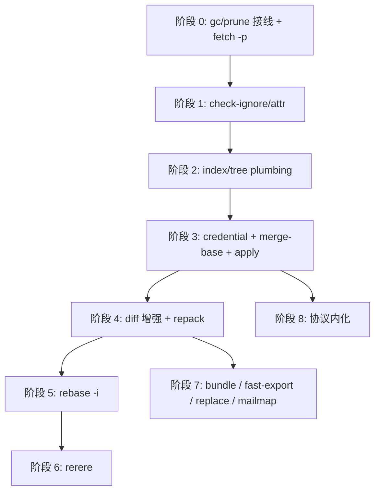
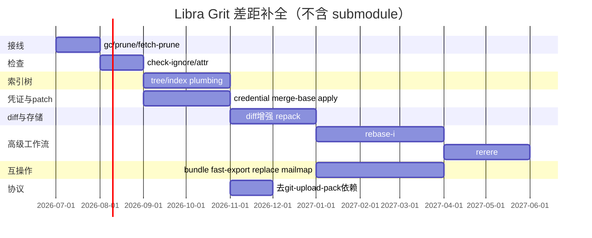

# Grit 差距补全执行计划

本文件记录 Libra 相对 [Grit](https://github.com/gitbutlerapp/grit)（`grit-git` CLI + `grit-lib`）在 Git 兼容命令面上的差距、源码核对结论，以及**按实现顺序排列**的补全路线图。

- **事实来源**：`src/cli.rs`、`src/command/`、Grit `grit-git/src/commands/` 与 `grit-git/src/main.rs::KNOWN_COMMANDS`。
- **用户承诺**：公开任何新命令前必须同步 [`COMPATIBILITY.md`](../../../COMPATIBILITY.md)、`docs/commands/<cmd>.md`、compat/integration 测试（见 [`_general.md`](_general.md)）。
- **治理交叉引用**：拒绝/延后决策见 [`_compatibility.md`](_compatibility.md)（D 编号）；本计划**不**覆盖 submodule（D1 拒绝，见下文范围声明）。

最后核对：2026-06-24（Libra `v0.17.1609` 工作区；Grit `v0.5.0` main）。

---

## 范围声明

### 明确不做

| 能力 | 决策 | 依据 |
|------|------|------|
| `submodule` / `submodule--helper` | **拒绝** | [`_compatibility.md` D1](_compatibility.md#d1submodule-子命令族)；单仓库 / trunk 产品边界 |
| `clone --recurse-submodules` | **拒绝** | D4（依赖 submodule） |
| Git LFS filter / `.gitattributes` smudge-clean 桥接 | **有意差异** | D5；使用 `libra lfs` + `.libra_attributes` |
| Git hooks bridge（`.git/hooks`、`core.hooksPath`） | **延后/拒绝** | D3 |
| 跨命令交互式 patch mode（`add -p` 等） | **拒绝** | D15 |
| 顶层 `sparse-checkout` | **延后** | D10 |
| 暴露 `send-pack` / `fetch-pack` 为用户命令 | **不做** | push/fetch 已内嵌协议；见阶段 8 |

gitlink（`0o160000`）在 tree/index 中仍可识别；`push` 等对 submodule 的警告可保留或文档化，但不实现 submodule 工作流。

### 并行推荐（未列入原需求清单，源码显示高价值）

| 命令 | 理由 |
|------|------|
| `merge-base` | `log.rs` / `rebase.rs` 已有算法，缺独立 CLI；解锁 `diff A...B` |
| `apply`（unified diff） | 无 Git patch 应用；仅有 AI 侧 `apply_patch`（Codex 格式） |
| `fetch --prune` | `remote prune` 已有；`fetch.rs` 未实现 prune flag |

---

## 对比基准

| 维度 | Grit | Libra |
|------|------|-------|
| Git 兼容 CLI | `grit-git`，~150 子命令（`KNOWN_COMMANDS`） | `libra`，~52 个可见 Git 命令 + AI 扩展 |
| 测试背书 | 上游 Git harness ~99.3%（41k+ tests） | 自有集成测试 + compat guards |
| 存储 | 传统 `.git/` 布局 | `.libra/`：Git 对象 + SQLite refs/config |
| 目标 | Git 行为复刻（库可链接） | AI Agent 原生 VCS + 部分 Git 兼容 |

---

## 差距清单与阶段映射

下表为计划内要补全的能力（**不含 submodule**）。「Libra 现状」以当前 `src/` 为准。

| 能力 | 建议阶段 | Libra 源码现状 | Grit 参考 |
|------|----------|----------------|-----------|
| `gc` / `prune` | **0** | `src/command/gc.rs`、`prune.rs` 已实现；`mod.rs` / `cli.rs` **未注册**；`maintenance.rs::run_gc` 为简化重复实现 | `grit-git/src/commands/gc.rs`、`prune.rs` |
| `fetch --prune`、`remote update -p` | **0** | `remote.rs::run_prune_remote` 已有；`fetch.rs` 文件头注明 prune 未实现 | `grit fetch -p` |
| `check-ignore` / `check-attr` | **1** | `utils/ignore.rs`、`utils/lfs.rs`；无 CLI | `check_ignore.rs`、`check_attr.rs` |
| `write-tree` / `read-tree` | **2** | AI `history.rs` 有内部 `write_tree`；无用户命令 | `write_tree.rs`、`read_tree.rs` |
| `update-index` / `update-ref` | **2** | cherry-pick/merge 内部改 index；refs 在 SQLite `reference` 表 | `update_index.rs`、`update_ref.rs` |
| `merge-file` | **2** | `merge.rs` 仅 porcelain 三路合并 | `merge_file.rs`、`grit-lib::merge_file` |
| `libra credential` | **3** | `vault.ssh.*` + `ask_basic_auth`；`config.rs` 识别 `credential.helper` 但不调用 | 参考协议形状，**不**移植 `credential-cache`/`credential-store` |
| `merge-base` | **3** | `log.rs:738`、`rebase.rs` 有 `find_merge_base` | `grit-lib/src/merge_base.rs` |
| `apply` | **3** | 无 unified diff apply | `grit-lib/src/apply.rs`（体量大） |
| `diff` 增强（`A...B`、`-w`） | **4** | `diff.rs:268` 写明 merge-base range 未实现 | `diff*.rs` |
| `repack` / `pack-objects`（隐藏） | **4** | `maintenance.rs` 有 `create_pack_from_hashes`、`run_incremental_repack` | `repack.rs`、`pack_objects.rs` |
| `diff-index` / `diff-files` / `diff-tree` | **4** | 仅统一 `diff.rs` | 三个 plumbing 命令 |
| `rebase -i` | **5** | `rebase_state` + `todo_actions`（Pick/Fixup/Squash/Amend）、`--autosquash`；无 `-i` / `--exec` | `rebase.rs` + `sequencer.rs` |
| `rerere` | **6** | 无模块；`cherry_pick.rs` 拒绝 `--rerere-autoupdate` | `grit-lib/src/rerere.rs` |
| `bundle` | **7** | 无 | `bundle.rs` |
| `fast-export` / `fast-import` | **7** | 无 | `fast_export.rs`、`fast_import.rs` |
| `check-mailmap` | **7** | 无 | `check_mailmap.rs` |
| `replace` | **7** | 无 `refs/replace` 与全局 peel | `replace.rs` |
| 协议去 `git-upload-pack` 依赖 | **8** | `local_client.rs` 部分路径 spawn 系统 git | `upload_pack.rs`（内化，不暴露 CLI） |

### 源码已实现、无需重复规划

| 项 | 位置 |
|----|------|
| `switch -f` / `--discard-changes` | `switch.rs:85-86` |
| `cherry-pick --skip` | `cherry_pick.rs:310-312` |
| `remote set-url --push` | `remote.rs:159-161` |

---

## 实现顺序（8 个阶段）

### 阶段 0 — 接线与去重（1–2 周）

**目标**：把已有实现发布为命令，统一维护路径。零新算法。

| 顺序 | 工作项 | 改动要点 | 验收 |
|------|--------|----------|------|
| 0.1 | 注册 **`gc`** | `src/command/mod.rs` 加 `pub mod gc`；`src/cli.rs` 注册 + dispatch；`COMPATIBILITY.md` | `libra gc --dry-run`；`gc.rs` 内嵌单元测试随模块编译 |
| 0.2 | 注册 **`prune`** | 同上 | `libra prune -n` |
| 0.3 | **去重** | `maintenance run --task gc` 委托 `gc::execute_safe` 或抽取 `internal/repository_gc.rs`；删除与 `gc.rs` 重复的简化 `run_gc` | `maintenance run --task gc` 与 `libra gc` 行为一致 |
| 0.4 | **`fetch --prune`** | `FetchArgs` 加 `prune`；fetch 后删 stale `refs/remotes/*`；复用 `remote prune` 逻辑 | 远端删分支后 `fetch -p` 清 tracking ref |
| 0.5 | **`remote update -p`** | `RemoteCmds::Update` 透传 `-p`/`--prune` | `remote update -p` 与 fetch prune 联动 |

**测试**：`tools/integration-runner` `cli.gc-smoke`（当前期望 `LBR-CLI-001`，接入后更新）；`tests/command/` 补 gc/prune/fetch-prune 端到端。

**工作量**：S–M

**首个 PR 建议范围**：仅 0.1–0.3 + `gc_smoke` 更新。

---

### 阶段 1 — 检查类命令（1–2 周）

| 顺序 | 工作项 | 复用 / 参考 |
|------|--------|-------------|
| 1.1 | **`check-ignore`** | `utils/ignore.rs::should_ignore`；首版：path、`-v`、`-n`、stdin、`-z`、`--no-index` |
| 1.2 | **`check-attr`**（Libra 语义） | `utils/lfs.rs` + `.libra_attributes`；首版 `filter` 查询；文档标明非 Git smudge/clean（D5） |

**验收**：`check-ignore -v <path>`、`check-attr filter <path>` + `--json`。

**工作量**：S–M

---

### 阶段 2 — 索引 / 树 plumbing（2–3 周）

**目标**：为 `apply`、`rerere`、`rebase -i` 提供共用底层。

| 顺序 | 工作项 | 说明 |
|------|--------|------|
| 2.0 | **`internal/tree_plumbing.rs`** | 从 `internal/ai/history.rs`、`cherry_pick.rs::update_index_entry` 抽取 write-tree / index 更新 API |
| 2.1 | **`write-tree` / `read-tree`** | 首版：index ↔ tree |
| 2.2 | **`update-index`** | 首版：`--add` / `--remove` / `--cacheinfo` |
| 2.3 | **`update-ref`** | SQLite `reference` 适配（非文件 `refs/`）；扩展 `symbolic-ref` 仅 HEAD 的现状 |
| 2.4 | **`merge-file`** | 首版：`merge-file -p base ours theirs` |

**暂不实现**：`merge-tree`（rerere / `rebase --rebase-merges` 需要时再开）。

**工作量**：M–L（`update-ref` 为架构敏感项）

---

### 阶段 3 — 凭证与 patch 基础（2–4 周）

| 顺序 | 工作项 | 说明 |
|------|--------|------|
| 3.1 | **`libra credential`** | `fill` / `store` / `erase`，对接 `internal/vault.rs` + `vault.ssh.*`；**不**移植 Grit `credential-cache`/`credential-store` |
| 3.2 | 协议接入 | `https_client.rs`、`ssh_client.rs` 优先读 vault，减少 `ask_basic_auth` 交互 |
| 3.3 | **`merge-base`** | 抽取 `internal/merge_base.rs`（合并 `log.rs` / `rebase.rs` 实现）；首版 `merge-base A B`、`--all`、`--is-ancestor` |
| 3.4 | **`apply` MVP** | 新建 `internal/patch/` + `src/command/apply.rs`：`--check`、worktree、`-p`；**不复用** AI `apply_patch` parser |

**验收**：非交互 fetch/push 可用存储凭证；`apply --check` 对单文件 patch 可用。

**工作量**：M–L（`apply` 为 L）

---

### 阶段 4 — diff 增强与存储优化（2–3 周）

| 顺序 | 工作项 | 说明 |
|------|--------|------|
| 4.1 | **`diff` 增强** | `A...B` merge-base range（依赖 3.3）；`-w` 忽略空白 |
| 4.2 | 顶层 **`repack`** | 复用 `maintenance::run_incremental_repack` |
| 4.3 | **`diff-index` / `diff-files` / `diff-tree`** | 按需：作为 `diff` 内部模式别名，避免三套引擎 |
| 4.4 | **`pack-objects`**（`hide = true`） | 复用 maintenance pack 编码 + `index_pack` |

**工作量**：M

---

### 阶段 5 — 交互式 rebase（4–8 周）

**已有基础**（`src/command/rebase.rs`）：

- SQLite `rebase_state`（`todo`、`todo_actions`、`stopped_sha`）
- `RebaseTodoAction`：Pick / Fixup / Squash / Amend
- `--autosquash` 已实现

| 子阶段 | 内容 |
|--------|------|
| 5.1 | `-i` 非交互核心：解析 todo（pick/drop/fixup/squash），`LIBRA_SEQUENCE_EDITOR` |
| 5.2 | `--edit-todo`、`-x` / `--exec` |
| 5.3 | `reword`、`--rebase-merges`（依赖 2.4 或增强 merge） |
| 5.4 | 编辑器 / TUI 集成（可选，产品决策） |

**原则**：继续用 SQLite state，不回退 `rebase-merge/` 目录。

**工作量**：5.1–5.2 为 M–L；5.3–5.4 为 L–XL

---

### 阶段 6 — rerere（3–5 周）

| 顺序 | 工作项 |
|------|--------|
| 6.1 | `internal/rerere/`（`.libra/rerere/` 或 SQLite 表） |
| 6.2 | `libra rerere`：`status` / `diff` / `forget` / `clear` / `gc` |
| 6.3 | 接入 merge / rebase / cherry-pick；**移除** `cherry_pick.rs` 对 `--rerere-autoupdate` 的拒绝 |

**依赖**：阶段 2.4 `merge-file`、与 `merge.rs` 一致的 conflict marker。

**工作量**：L

---

### 阶段 7 — 互操作与对象替换（4–8 周）

| 顺序 | 工作项 | 依赖 |
|------|--------|------|
| 7.1 | **`bundle`** | 阶段 4 repack + reachability |
| 7.2 | **`fast-export`** | object walk + refs |
| 7.3 | **`fast-import`** | 事务性 object/ref 写入 + SQLite |
| 7.4 | **`check-mailmap`** + log/blame 集成 | 解析 `.mailmap` |
| 7.5 | **`replace`** | SQLite refs + 全链路 object peel（`load_object`、`rev-parse`、`log`、`show`） |

**工作量**：7.1–7.4 各 M–L；7.5 为 L

---

### 阶段 8 — 协议内化（1–2 周）

| 工作项 | 说明 |
|--------|------|
| 去掉 `local_client.rs` 对 **`git-upload-pack`** 的 spawn | 改用 `internal/protocol` 已有 pack 协商（与 `push.rs` `send_pack` 同栈） |
| **不**注册 `libra send-pack` / `libra fetch-pack` | push/fetch 已内嵌 |

**工作量**：M

---

## 里程碑

| 里程碑 | 阶段 | 交付 |
|--------|------|------|
| **M1** | 0 | `gc` / `prune` CLI；`fetch -p`；`gc_smoke` 绿 |
| **M2** | 1 + 3.1 | `check-ignore` / `check-attr`；`libra credential` 基础 |
| **M3** | 2 + 3.3–3.4 + 4.1–4.2 | index/tree plumbing；`merge-base`；`apply --check`；`diff A...B`；`repack` |
| **M4** | 5.1–5.2 | 非交互 `rebase -i` 核心 |
| **M5** | 6 + 7.1 | `rerere`；`bundle` |
| **M6** | 7.2–7.5 | `fast-export/import`；`mailmap`；`replace` |
| **贯穿** | 8 | 本地协议不再依赖系统 `git` |

---

## 每阶段通用收口清单

完成任一阶段中「公开新命令或新 flag」的 PR 时，必须：

1. 更新 [`COMPATIBILITY.md`](../../../COMPATIBILITY.md) tier 与说明。
2. 新增或更新 `docs/development/commands/<cmd>.md` 与 `docs/commands/<cmd>.md`。
3. 在 `src/cli.rs` 补 `EXAMPLES` / compat help guards（见 [`_general.md`](_general.md)）。
4. 补 `tests/command/` 或 `tools/integration-runner` scenario。
5. 若改动拒绝/延后边界，更新 [`_compatibility.md`](_compatibility.md) D 编号或本文件范围声明。

---

## 与 README「未公开命令」说明的关系

[`README.md`](README.md) 当前将 `gc`/`prune` 列为「由 `maintenance run --task gc` 覆盖、不单独公开」。**本计划 supersede 该说明**：阶段 0 完成后应：

- 将 `gc`、`prune` 移入公开命令表；
- 更新 `docs/development/internal/gc.md`、`prune.md` 为已接入状态；
- 明确 `maintenance --task gc` 为对顶层 `gc` 的编排入口，而非唯一入口。

`package`（AI capability package）与 `stats`（工作树文件统计）仍不在本计划内。

---

## 维护要求

- 实现任一计划项后，在本文件对应阶段打勾或移到「已完成」小节（附 PR/commit 引用）。
- Grit 版本升级时，仅 re-audit 当前阶段 ±1 的相关命令，不必全量重比。
- submodule 相关需求一律引用 D1，不在本计划 backlog 中 reopen。
