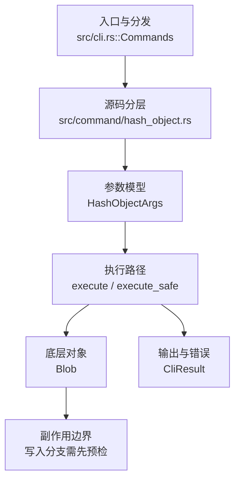

# `libra hash-object` 开发设计

## 命令实现目标

`libra hash-object` 的目标是计算 Git 兼容对象 ID，并可选地把 blob 写入对象库。实现需要支持文件、stdin、`--stdin-paths`、对象类型参数、`--path` 和 `--no-filters` 的兼容边界，同时把 `--literally`、不支持的对象类型和属性过滤行为清晰暴露。

## 对比 Git 与兼容性

- 兼容级别：`partial`。Blob hashing for files, `--stdin`, and `--stdin-paths`; `-w` writes objects; `--path` and `--no-filters` accepted for raw-byte hashing; `-t blob/commit/tree/tag` typed hashing (oid matches Git byte-for-byte) with `--literally` to skip content validation. Advanced Git hash-object behaviors (path filters/attributes, arbitrary `--literally` type strings) remain unsupported

- 当前矩阵明确仍是部分兼容；未覆盖的 Git surface 必须显式列在“还未实现的功能”。

## 设计方案

- 入口与分发：已公开接入 `src/cli.rs::Commands`；已由 `src/command/mod.rs` 导出。CLI 层在 `src/cli.rs` 把解析后的参数交给命令模块，命令模块负责把领域错误转换为 `CliError` / `CliResult`。
- 源码分层：主要实现文件为 `src/command/hash_object.rs`。参数/子命令类型包括：`HashObjectArgs`；输出、错误或状态类型包括：源码未暴露独立输出/错误类型，错误通过 `CliResult` 或上层命令错误统一传播；主要执行函数包括：`execute`、`execute_safe`。
- 执行路径：`execute_safe` 负责 CLI 安全包装、错误映射和输出配置；读取文件或 stdin 内容，按 `-t` 类型用 `ObjectHash::from_type_and_data` 计算 oid（blob/commit/tree/tag），非 `--literally` 时校验内容良构，`--path` 只作为 stdin JSON source label / Git 兼容路径上下文，`--no-filters` 显式选择当前 raw-byte hashing 行为，`-w` 时通过 `ClientStorage::put` 原始写入对象库（不解析 revision）。

- 流程图：以下流程图按当前源码分层展示主路径和底层对象边界，便于维护者把代码入口、执行函数和副作用范围对应起来。

- 底层操作对象：原始字节 + `ObjectType`（blob/commit/tree/tag）；oid 经 `ObjectHash::from_type_and_data` 计算，`-w` 经 `ClientStorage::put(oid, data, type)` 写入对象库（不构造具体对象类型，故对 `--literally` 畸形内容也能写）。
- 输出与错误契约：人类输出、`--json` / `--machine` 输出和 quiet/verbose 分支必须继续走现有 `OutputConfig` / `emit_json_data` / `CliError` 路径；新增失败模式要补稳定错误码、用户提示和回归测试。
- 副作用边界：凡是写入索引、对象库、refs/HEAD、reflog、SQLite/D1、工作树或远端的路径，都必须先完成参数校验和 dry-run/预检分支，再执行持久化，避免部分写入后静默成功。

## 实现历史

- 本节依据本地 main 分支提交历史重写，筛选与该命令实现、测试或文档路径直接相关的提交；以下是归纳后的实现脉络。
- 2026-05-18 `dc17dc9b`（`feat(hash-object): add blob hashing command (#373)`）：基础实现节点：add blob hashing command (#373)；当前实现的主要轮廓可追溯到该提交。
- 2026-06-15 本批实现：当前 `src/command/hash_object.rs` 已重新公开 `--path` / `--no-filters`。`--path` 不应用 attributes/clean filters，只作为 Git 兼容路径上下文和 stdin JSON source label；`--no-filters` 为 raw-byte hashing 的显式 no-op。
- 2026-06-05 `2f3306e7`（`feat(hash-object): support -t commit/tree/tag with --literally and write`）：该提交曾实现类型化哈希，但在后续 reconcile 中丢失（[[goal_loop_work_vanished]] 模式）。
- 2026-06-25 (#157)：重新落地 `-t commit/tree/tag` 类型化哈希 + `--literally`。`parse_git_object_type` 限定四种 git 类型；`hash_one_source` 用 `ObjectHash::from_type_and_data` 统一计算 oid（取代仅 blob 的 `Blob::from_content_bytes`）；非 `--literally` 经 `validate_object_content` 用**专门的 safe 字节级解析器**校验（不调用 git-internal `from_bytes` —— 后者含 `unwrap` 与 commit 消息上的 `unsafe String::from_utf8_unchecked`，对任意输入有 panic/UB 风险）；`-w` 经 `ClientStorage::put` 原始写入。`HashObjectOutput.object_type` 由 `&'static str` 改为 `String`。
- 2026-06-07 `da3f2f99`（`fix(hash-object): close compatibility plan gaps`）：实现修正：close compatibility plan gaps；该节点把边界行为、错误处理或兼容差异纳入当前实现约束。
- 历史结论：当前文档应以这些提交之后的代码、测试和兼容矩阵为准；更早的迁移式文档只保留为背景，不再作为事实来源。

## 当前状态

- 公开状态：已公开；模块状态：已导出。
- 用户文档：`docs/commands/hash-object.md`。
- 公开参数/子命令包括：`-w, --write`、`--stdin`、`--stdin-paths`（从 stdin 读取换行分隔的路径，逐个哈希；与 `--stdin`/`--path`/位置 `<PATH>` 互斥）、`--path <PATH>`、`--no-filters`、`-t, --type <TYPE>`（接受 `blob`/`commit`/`tree`/`tag`，其余类型显式拒绝）、`--literally`（跳过内容校验）、`<PATH>...`。

## 还未实现的功能

| 类别 | 未完成项 | 当前处理 |
|---|---|---|
| ✅ 已实现 | `--stdin-paths`（从 stdin 读取换行分隔的路径，逐个哈希，每行输出一个 oid） | 通过 `effective_paths`/`read_stdin_paths` 复用现有 path-hashing 循环；与 `--stdin`/`--path`/位置路径互斥。带集成测试（`hash_object_stdin_paths_hashes_each_path_in_order`）。 |
| ✅ 已实现 | `-t commit/tree/tag` 类型化哈希 + `--literally` | `parse_git_object_type` 限定 blob/commit/tree/tag（其余类型显式拒绝）；oid 由 `ObjectHash::from_type_and_data(type, data)` 统一计算（与 git 逐字节一致，empty-tree/commit/tag oid 经差分钉死）。非 `--literally` 时用**专门的 safe 字节级校验器**（`is_well_formed_commit`/`_tag`/`_tree`，绝不调用 git-internal `from_bytes` 以规避其 `unwrap`/`unsafe from_utf8_unchecked` 的 panic/UB 风险，对任意/二进制输入都安全）严格匹配 git fsck：commit 强制头部顺序 `tree`→`parent*`→`author`→`committer` + ident 校验；tag 要求 `object`/`type`/非空 `tag`/`tagger`+ident；tree 仅接受 git 规范 mode（40000/100644/100755/120000/160000）、拒绝含 `/` 或 `.`/`..` 的名字、强制 git 排序（顺带禁重复）。失败映射为 `invalid <type> object`（LBR-CLI-002）+ 提示 `--literally`；`-w` 经 `ClientStorage::put(oid, data, type)` 原始写入（无需解析对象，故 `--literally` 畸形内容也能写）。带集成测试（`hash_object_typed_oids_match_git_and_write_persists`、`hash_object_validates_typed_content_and_honors_literally`、`hash_object_rejects_non_git_object_type`）+ 单测 `safe_validators_match_git_strictness`（覆盖 git 的 6 个拒绝用例）。 |
| 兼容差异项 | Path filters / attributes | 原始对照：Git 可用 `--path` 触发 attribute/filter 处理；相关参数/替代：`--path` 已接受但不应用 filters，`--no-filters` 为 raw-byte hashing no-op；当前说明：属性过滤仍不支持。 后续实现真正 filter/attribute 支持时需要补对应回归测试并同步兼容矩阵。 |
| 兼容差异项 | `--literally` 任意类型字符串 | 原始对照：Git `--literally` 允许任意（含未知）类型名；当前说明：Libra 仍限定 blob/commit/tree/tag，未知类型名被拒绝。 |

## 维护要求

- 改进本命令前，必须先阅读并遵循 [docs/development/commands/_general.md](_general.md)；这是命令设计、实现、测试和文档同步的强制要求。
- 任何行为变更都要先核对实现源码，再同步 `COMPATIBILITY.md`、`docs/commands/<cmd>.md` 和相关测试。
- 新增 Git 兼容参数时必须明确 tier、错误码、JSON/机器输出契约和回归测试。
