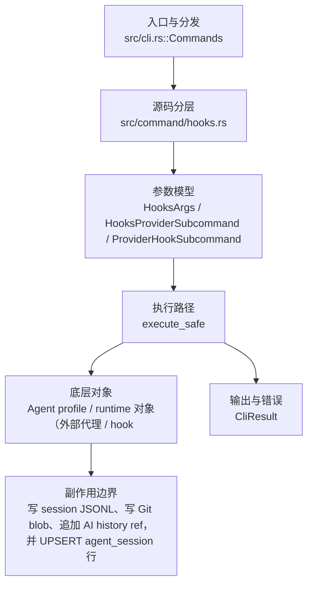

# `libra hooks` 开发设计

## 命令实现目标

`libra hooks` 的目标是为 `libra agent enable` 安装的 AI provider hook 配置提供隐藏兼容入口。它不作为普通用户主命令推广，主要用于帮助文本、测试和 agent hook 配置的稳定性。它不是 Git hooks bridge：不读取 `.git/hooks`，不读取 `core.hooksPath`，也不把 stock Git hook 生命周期纳入 Libra 核心能力；该决策见 [`_compatibility.md` D3](_compatibility.md#d3git-hooks-bridge-作为核心特性)。

## 对比 Git 与兼容性

- 兼容级别：`intentionally-different`。Hidden compatibility entry for AI provider hook configs installed by `libra agent enable`; not a Git hooks bridge.

- 该命令或行为属于 Libra 扩展/有意差异；重点是清晰边界、结构化输出和可测试错误，而不是 Git 完全同形。

## 设计方案

- 入口与分发：已公开接入 `src/cli.rs::Commands`；已由 `src/command/mod.rs` 导出。CLI 层在 `src/cli.rs` 把解析后的参数交给命令模块，命令模块负责把领域错误转换为 `CliError` / `CliResult`。
- 源码分层：主要实现文件为 `src/command/hooks.rs`。参数/子命令类型包括：`HooksArgs`、`HooksProviderSubcommand`、`ProviderHookSubcommand`；输出、错误或状态类型包括：源码未暴露独立输出/错误类型，错误通过 `CliResult` 或上层命令错误统一传播；主要执行函数包括：`execute_safe`。
- 执行路径：`execute_safe` 负责 CLI 安全包装、错误映射和输出配置；AI 路径会读写 session、checkpoint、thread graph 或 agent profile 状态。

- 流程图：以下流程图按当前源码分层展示主路径和底层对象边界，便于维护者把代码入口、执行函数和副作用范围对应起来。

- 底层操作对象：Agent profile / runtime 对象（外部代理、hook、权限和运行状态）；session/thread store（AI 会话、线程、事件和恢复状态）
- 输出与错误契约：人类输出、`--json` / `--machine` 输出和 quiet/verbose 分支必须继续走现有 `OutputConfig` / `emit_json_data` / `CliError` 路径；新增失败模式要补稳定错误码、用户提示和回归测试。
- 副作用边界：当前实现是写密集型路径（`process_hook_event_from_stdin`，`src/internal/ai/hooks/runtime.rs:157`）：通过 `SessionStore::save` 写 session JSONL 文件（runtime.rs:402-404），通过 `write_git_object` 写内容寻址的 Git blob（runtime.rs:1225），通过 `HistoryManager::append` 追加到 AI history ref（runtime.rs:1226-1228）；AgentTraces 路径还会 UPSERT `agent_session` 表中的行（runtime.rs:586-623）。任何持久化对象、回滚语义和测试证据的变更都要同步设计。

## 实现历史

- 本节依据本地 main 分支提交历史重写，筛选与该命令实现、测试或文档路径直接相关的提交；以下是归纳后的实现脉络。
- 2026-03-09 `2c509d93`（`Feat: unify hook ingestion under ai_session & Add GeminiCli SP (#275)`）：基础实现节点：unify hook ingestion under ai_session & Add GeminiCli SP (#275)；当前实现的主要轮廓可追溯到该提交。
- 历史结论：当前文档应以这些提交之后的代码、测试和兼容矩阵为准；更早的迁移式文档只保留为背景，不再作为事实来源。

## 当前状态

- 公开状态：已公开；模块状态：已导出。
- 用户文档：`docs/commands/hooks.md`。
- Synopsis：`libra hooks {claude|gemini} {session-start|prompt|tool-use|model-update|compaction|stop|session-end}`。
- 公开参数/子命令包括：`claude`、`gemini` 两个 provider 子命令，二者均接受 `session-start`、`prompt`、`tool-use`、`model-update`、`compaction`、`stop`、`session-end` 七个生命周期事件子命令。

## 还未实现的功能

| 类别 | 未完成项 | 当前处理 |
|---|---|---|
| 兼容矩阵说明 | 隐藏兼容入口 for AI provider hook configs installed by `libra agent enable`；不支持 `.git/hooks` / `core.hooksPath` Git hooks bridge（D3 拒绝） | 按当前兼容矩阵保留；实现状态变化时同步 `_compatibility.md` 和测试证据。 |

## 维护要求

- 改进本命令前，必须先阅读并遵循 [docs/development/commands/_general.md](_general.md)；这是命令设计、实现、测试和文档同步的强制要求。
- 任何行为变更都要先核对实现源码，再同步 `COMPATIBILITY.md`、`docs/commands/<cmd>.md` 和相关测试。
- 新增 Git 兼容参数时必须明确 tier、错误码、JSON/机器输出契约和回归测试。
