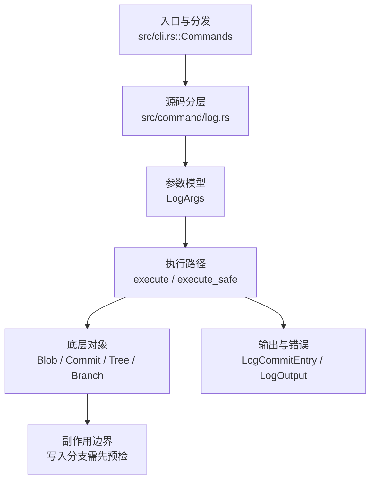

# `libra log` 开发设计

## 命令实现目标

`libra log` 的目标是展示提交历史，并支持数量、时间、作者、graph、format、颜色、revision range（位置性 `A..B`/`A...B`/`^A` 及 `--range`）、`--all`、`--reverse`、`--follow`、`-L` 和 `--parents`/`--children` 等常用查看能力。实现需要在 Git 兼容历史查看和 Libra 结构化输出之间保持一致，并把尚未覆盖的复杂格式能力列为后续工作。

## 对比 Git 与兼容性

- 兼容级别：`partial`。

- 当前矩阵承诺常用 Git log 子集已支持；`--range`（revision ranges）、Git 位置性 revision range（`A..B`/`A...B`/`^A` 位置参数）、`--all`、`--reverse`、`--follow`、`-L`、`--parents`/`--children`、`-i`/`--regexp-ignore-case`、`--invert-grep` 已补齐，仅复杂 rename follow 和精确行级归属仍为 partial。新增语义必须同步矩阵、用户文档和测试。

## 设计方案

- 入口与分发：已公开接入 `src/cli.rs::Commands`；已由 `src/command/mod.rs` 导出。CLI 层在 `src/cli.rs` 把解析后的参数交给命令模块，命令模块负责把领域错误转换为 `CliError` / `CliResult`。
- 源码分层：主要实现文件为 `src/command/log.rs`；P1-05 展示默认值集中在 `src/command/log/config.rs`。参数/子命令类型包括：`LogArgs`；输出、错误或状态类型包括：`LogCommitEntry`、`LogOutput`；主要执行函数包括：`execute`、`execute_safe`。
- 执行路径：`execute_safe` 负责 CLI 安全包装、错误映射和输出配置；对象路径会解析 revision 并读写 blob/tree/commit/tag 等对象；引用路径会读取或更新 SQLite refs、HEAD 与 reflog。

- 流程图：以下流程图按当前源码分层展示主路径和底层对象边界，便于维护者把代码入口、执行函数和副作用范围对应起来。

- 底层操作对象：`Blob`（文件内容或 LFS pointer 写入对象库后的 blob 对象）；`Commit`（提交对象、父提交关系和提交消息载荷）；`Tree`（由索引或对象遍历生成的目录树对象）；`Branch` / branch store（SQLite refs 上的分支读写、过滤和上游关系）；`Head`（SQLite 中的 HEAD 指向、当前分支和 detached 状态）；`ObjectHash`（SHA-1/SHA-256 对象 ID 和 revision 解析结果）；`ConfigKv`（配置键值持久化行）
- 输出与错误契约：人类输出、`--json` / `--machine` 输出和 quiet/verbose 分支必须继续走现有 `OutputConfig` / `emit_json_data` / `CliError` 路径；新增失败模式要补稳定错误码、用户提示和回归测试。
- 副作用边界：凡是写入索引、对象库、refs/HEAD、reflog、SQLite/D1、工作树或远端的路径，都必须先完成参数校验和 dry-run/预检分支，再执行持久化，避免部分写入后静默成功。

## 实现历史

- 本节依据本地 main 分支提交历史重写，筛选与该命令实现、测试或文档路径直接相关的提交；以下是归纳后的实现脉络。
- 2025-12-19 `d45bec8c`（`feat(log): add --abbrev-commit/--abbrev/--no-abbrev-commit for commit… (#93)`）：基础实现节点：add --abbrev-commit/--abbrev/--no-abbrev-commit for commit… (#93)；当前实现的主要轮廓可追溯到该提交。
- 2026-06-06 `f95b80df`（`feat(log): colorize graph columns and align compatibility matrix`）：功能演进：colorize graph columns and align compatibility matrix；该节点扩展了当前命令可用的参数或行为。
- 2026-06-06 `89045f35`（`feat(log): support revision ranges (A..B, A...B, ^A B)`）：通过 `--range <SPEC>` 引入 revision range 入口。**后续已补齐 Git 位置性 `git log A..B`/`A...B`/`^A` 语法**（`split_log_positionals` 把前导 positional 按解析结果分流到 revision 或 pathspec，rev/path 同名歧义报错并提示 `--range`）；`--range` 作为显式入口保留。
- 2026-06-07 `155a430a`（`fix(log): close compatibility plan gaps`）：实现修正：close compatibility plan gaps；该节点把边界行为、错误处理或兼容差异纳入当前实现约束。
- 2026-07-09（plan-20260708 P0-05）：orphan root 语义验收要求 `log --pretty=%P -1` 能稳定显示父提交列表；当前 `CommitFormatter` 补齐 `%P`（完整 parent OID 列表）与 `%p`（缩写 parent OID 列表），root commit 输出空字符串。回归覆盖：`compat_switch_orphan_root` 与 formatter 单测。
- 2026-07-09（plan-20260708 P0-06）：stdout 下游提前关闭时经全局入口与 `Pager`/输出层静默正常终止，不打印 panic/backtrace/`Broken pipe` 诊断。回归覆盖：`compat_broken_pipe_output`。
- 2026-07-09（plan-20260708 P1-04）：`CommitFormatter` 的自定义模板从链式 `replace` 改为单次扫描 renderer，补齐 `%b`/`%B`/`%n`/ASCII/control `%xNN`/`%%`/`%aI`/`%cI`/`%at`/`%ct`/`%D`/`%m`/常见 `%C...` color placeholders，并按 Git 规则保留未知占位符字面量；`log -z` 支持 NUL 记录与 `--name-only`/`--name-status` 路径字段，`--name-only --format=%s` 的提交文本与路径区块分隔对齐 Git。回归覆盖：`compat_pretty_format_placeholders`。
- 2026-07-11（plan-20260708 P1-05d，log 展示默认片）：`format.pretty`、`log.date`、`log.follow` 接入严格 local→global→system 级联；CLI `--oneline`/`--pretty`/`--format`、`--date`、`--follow`/`--no-follow` 分别优先。`format.pretty` 同步作用于 `show`；`log.follow=true` 仅在恰好一个位置路径时自动启用，human/JSON 选择一致，子目录路径先规范化到仓库根。核对既有实现时发现 `--follow` 在重命名提交未切换父路径，现改为反向 exact-blob 状态机：只选当前 tree 已消失的父路径、稳定排序候选，不会把保留源文件的 copy 误判为 rename；每个提交携带的历史路径同步驱动 name-status、stat/shortstat、patch、quiet 验证与 JSON。可跨纯重命名但仍不承诺内容变化/复杂非线性重命名。空值、未知裸 pretty 名、未支持 date mode、无效布尔与 local/global 读取失败均在输出前 fail-closed；system scope 保持既有跳过契约。回归覆盖：`compat_config_defaults_semantics::log_defaults` / `log_default_errors` / `log_follow_defaults`。
- 历史结论：当前文档应以这些提交之后的代码、测试和兼容矩阵为准；更早的迁移式文档只保留为背景，不再作为事实来源。

## 当前状态

- 公开状态：已公开；模块状态：已导出。
- 用户文档：`docs/commands/log.md`。
- Synopsis：`libra log [OPTIONS] [<revision-range>...] [[--] <path>...]`。
- 公开参数/子命令包括：`-n, --number <NUMBER>`（Git 别名 `--max-count`）、`--oneline`、`--abbrev-commit`、`--abbrev <N>`、`--no-abbrev-commit`、`-p, --patch`、`--name-only`、`--name-status`、`-z, --null`（NUL 终止 log record 和 name-only/name-status 路径字段）、`--author <PATTERN>`、`--committer <PATTERN>`、`--since <DATE>`、`--until <DATE>`、`--merges`、`--no-merges`、`--min-parents <N>`、`--max-parents <N>`、`--first-parent`、`-S <STRING>`、`-G <REGEX>`、`--skip <N>`、`--pretty <FORMAT>`、`--format <FORMAT>`（`--pretty` 的 Git 别名）、`--date <FORMAT>`、`--decorate[=<MODE>]`、`--no-decorate`、`--graph`、`--stat`、`--shortstat`（仅 diffstat 摘要行）、`--patch-with-stat`（Git 中 `-p --stat` 的同义词：先输出 diffstat 块再输出完整 patch；复用既有 `--stat`/`-p` 渲染器，按 stat→空行→patch 顺序组合，同时让显式的 `-p --stat` 组合也输出两者，此前仅显示 patch；stat/patch 块本身沿用 Libra 既有渲染，故不复刻 Git 的 `---` 分隔符与 stat 间距，属既有 intentionally-different）、`--grep <PATTERN>`、`-i, --regexp-ignore-case`、`--invert-grep`、`--reverse`、`--author-date-order`（按作者日期而非提交者日期排序，newest-first；经 `sort_commits_newest_first` 仅按时间戳排序，无 Git 的拓扑约束）、`--date-order`（接受式 no-op，显式选择默认的提交者日期顺序，与 `--author-date-order` 互斥）、`--no-expand-tabs`（接受式 no-op：Libra 从不在提交消息中展开 tab，逐字打印，故已是默认行为；字段 `no_expand_tabs` 解析后不被读取。Git 的反向 `--expand-tabs[=<n>]` 未实现）、`--no-notes`（接受式 no-op：Libra 的 log 从不内联显示 notes，故已是默认行为；字段 `no_notes` 解析后不被读取。Git 的反向 `--notes[=<ref>]` 未实现，读 note 用 `libra notes show <commit>`）、`--no-mailmap`（接受式 no-op：Libra 的 log 从不应用 mailmap，直接显示记录的原始身份；字段 `no_mailmap` 解析后不被读取。Git 的反向 `--mailmap` 未实现）、`--no-show-signature`（接受式 no-op：Libra 的 log 从不内联显示提交签名，故已是默认行为；字段 `no_show_signature` 解析后不被读取。Git 的反向 `--show-signature` 未实现）、`--all`、`--follow <FILE>`、`-L <RANGE:FILE>`、`--parents`、`--children`、`--range <SPEC>`、位置参数 `[<revision>...] [<path>...]`（前导可解析为 revision 的 token 经 `split_log_positionals` 分流为 revision range，其余为 pathspec；rev 与 path 同名时报歧义并提示 `--range`）等。`-i`/`--regexp-ignore-case` 让 `--grep` 大小写不敏感（author/committer 在 Libra 中本就大小写不敏感，故 `-i` 仅作用于 `--grep`）；`--invert-grep` 保留消息**不**匹配 `--grep` 的提交（在 `CommitFilter::with_grep_options` 中按 `matches == invert_grep` 排除）。`--parents`/`--children`（互斥）在每个提交哈希后追加缩写后的父/子提交 id：父来自 `commit.parent_commit_ids`，子在所展示提交（已渲染集合）范围内反向计算（与 rev-list 的子映射同算法，但作用于 log 的渲染集，不含范围外的子提交），经 `FormatContext.extra_hashes` 进入 full / oneline 格式。
- P1-05 展示配置：`format.pretty` 仅在没有 `--oneline`/`--pretty`/`--format`/`--only-trailers` 时生效，其 `medium` 值保持默认渲染器与完整 commit id；`log.date` 让位于 `--date`，`--only-trailers` 不读取无关的格式/日期默认；`log.follow` 让位于显式 `--follow <FILE>`/`--no-follow`，并仅为单一现存文件 path 自动启用，单目录仍走普通 path 过滤。三键均在任何 commit 输出前解析；format/date 不改变 JSON schema，follow 会改变 human/JSON 的选择集合。
- `--committer <PATTERN>`：按 committer name/email 的大小写不敏感子串过滤（对照 `--author`）。`--merges`/`--no-merges` 和 `--min-parents`/`--max-parents <N>`：按父提交数过滤（merges=≥2，no-merges=≤1，显式 min/max 优先）。`--first-parent`：遍历时只跟随合并提交的第一个父提交，折叠被并入的侧分支历史。`-S <STRING>`：pickaxe，仅显示改变了 STRING 出现次数的提交（对每个被改动文件比较其在该提交与第一父提交中的内容出现次数，总数变化即匹配；大小写敏感字面匹配）。`-G <REGEX>`：pickaxe，仅显示 diff 的新增/删除行中存在匹配该正则的提交（基于 `compute_diff`；与 `-S` 互斥）。`--skip <N>`：在输出前跳过前 N 个匹配提交（在过滤之后、`-n` 限制之前，对人类与 JSON 两条输出路径一致）。`--date=<mode>`：作者/提交日期渲染模式（`default`/`short`/`iso`/`iso-strict`/`rfc`/`unix`/`raw`），作用于人类输出（Full 与 `--pretty` 的 `%ad`/`%cd`）；时间以 UTC 渲染（时区 `+0000`），JSON 输出仍用规范日期。`log.date` 在 CLI 未显式指定时提供同一默认并同步供 `show` 使用；`relative`/`human`/`local`/`format:*`/`auto:*` 暂未实现，配置值会明确失败而不静默回退。
- `--pretty=<value>`：识别命名预设（`oneline`/`medium`/`short`/`full`/`fuller`/`reference`/`raw`）与 `format:<tmpl>`/`tformat:<tmpl>` 前缀（自定义模板）；其它值按裸自定义模板处理。`medium`（及空值）映射默认 Full（Git 默认）。`short`/`full`/`fuller`/`reference`/`raw` 经 `FormatType::Preset(LogPreset)` 单独渲染：`short`=commit+Author+缩进 subject（无 Date/Commit/body）；`full`=+Commit 行（无 Date）+完整消息；`fuller`=Author/AuthorDate/Commit/CommitDate 四行对齐+完整消息；`reference`=单行 `<abbrev> (<subject>, <short-date>)`；`raw`=tree/parent/author/committer 原始头（含可选 gpgsig，space-续行）+缩进消息（全 hash、原始时间戳）。自定义模板当前支持 `%H`/`%h`、`%P`/`%p`、`%s`/`%f`、`%b`/`%B`、`%n`、ASCII/control `%xNN`、`%%`、`%an`/`%ae`/`%ad`/`%aI`/`%at`、`%cn`/`%ce`/`%cd`/`%cI`/`%ct`、`%d`/`%D`、`%m` 和常见 `%C...` 颜色占位符；未知占位符按 Git 规则原样保留。其中 `%P` 是完整 parent OID 空格列表，root commit 输出空字符串；`%aI`/`%cI` 使用提交记录的原始 timezone 渲染 strict ISO；高位 `%x80..%xff` 原始字节输出仍不是本 UTF-8 文本 renderer 的兼容承诺；`%C(always,...)`/`%Creset` 按 Git color policy 处理，普通颜色关闭时 `%C(always,...)` 仍可发色、`%Creset` 不强制复位，需用 `%C(always,reset)` 强制 reset。预设继承 libra log 既有惯例（时间戳渲染 UTC `+0000`、`--pretty` 隐含缩写哈希、提交消息体空行在存储时已折叠），故在这些既有维度上与 git 非逐字节相同。`show` 与 `shortlog --format` 复用同一 `parse_pretty_format`/`CommitFormatter`，并按各自 human 输出路径的 `OutputConfig` 颜色策略启用 `%C...`。

- trailer 支持（`lore.md` §1.9）：共享 Git-faithful 解析器 `internal::log::trailer`（`parse_trailers`/`parse_trailers_with_recognized`/`trailer_block`/`ends_with_trailer_block`）——末段块定位（注释行在定位与分类中均透明）、首段（标题）排除、key 字符集仅 ASCII 字母数字+`-`（git `find_separator` 语义，`Change_Id:`/非 ASCII key 不是 trailer）、key 与 `:` 间容忍空白、空值合法、续行 RFC-822 折叠且在 25% 算术中记双非（孤儿续行记非 trailer 行）、可识别前缀 `Signed-off-by: `/`(cherry picked from commit `（后者仅入 raw 块，不作为结构化 Trailer）、合格判定 `全 trailer 或（含可识别且 trailer*3>=非)`。有意简化（不实现）：`trailer.separators`/`trailer.<token>.*` 配置、自定义注释字符、`---` divider。CLI：`--trailer KEY[=VALUE]`（AND 过滤，key 大小写不敏感、value 精确；`CommitFilter.trailer_filters` 同时接入 human 与 `--json` 两条构造路径）与 `--only-trailers`（`CommitFormatter::with_only_trailers`，与 oneline/pretty/format 互斥）为 Libra 扩展；`--json` 增量 `trailers` 字段。`%(trailers[:opts])` pretty 占位符为后续项（复用本解析器）。shortlog `--group=trailer:` 已改走本解析器（请求的 key 作为 recognized 强化，混合块可合格）。写侧三修复见 commit.md。

## 还未实现的功能

| 类别 | 未完成项 | 当前处理 |
|---|---|---|
| 兼容矩阵说明 | common Git log surface plus `--range` AND positional (`A..B`/`A...B`/`^A`) revision expressions, `--all`, `--reverse`, `--follow`, `-L`, and `--parents`/`--children` supported | 按当前兼容矩阵保留；实现状态变化时同步 `_compatibility.md` 和测试证据。 |
| ✅ 已实现 | Git 原生位置性 revision range 语法（`A..B`、`A...B`、`^A` 位置参数）| `split_log_positionals` 把前导 positional 按解析结果分流为 revision range 或 pathspec：range 语法（`A..B`/`A...B`/`^`）能解析→revision，不解析但命中现有 path（如 `../file`、名为 `foo..bar` 的文件）→pathspec，否则报错（未知 revision/path——typo guard）；bare token 解析成功且不与现有 path 同名才作 revision（同名报歧义提示 `--range`），否则进入 path 模式（保留 `--` 路由的历史 path）。`A...B` 用 `reachable_commit_ids(left)∩reachable(right)` 做真对称差（处理 criss-cross 多 merge-base 与无公共祖先），`get_reachable_commits_excluding` 对 exclude tips 做祖先闭包（修了 `A..B`/`^A` 只排除精确 commit 的旧 bug）。`--range` 作为显式入口保留。带测试 `test_log_positional_revision_range` / `test_log_positional_ambiguous_rev_and_path_errors`。 |
| 功能缺口 | `--follow` 重命名跟踪基于 best-effort blob 匹配，不保证复杂重命名场景 | 后续实现时需要同步源码、测试和兼容矩阵。 |
| 功能缺口 | `-L` 行级历史跟踪为 best-effort，尚未实现精确 blame 级行归属 | 后续实现时需要同步源码、测试和兼容矩阵。 |

## 维护要求

- 改进本命令前，必须先阅读并遵循 [docs/development/commands/_general.md](_general.md)；这是命令设计、实现、测试和文档同步的强制要求。
- 任何行为变更都要先核对实现源码，再同步 `COMPATIBILITY.md`、`docs/commands/<cmd>.md` 和相关测试。
- 新增 Git 兼容参数时必须明确 tier、错误码、JSON/机器输出契约和回归测试。
