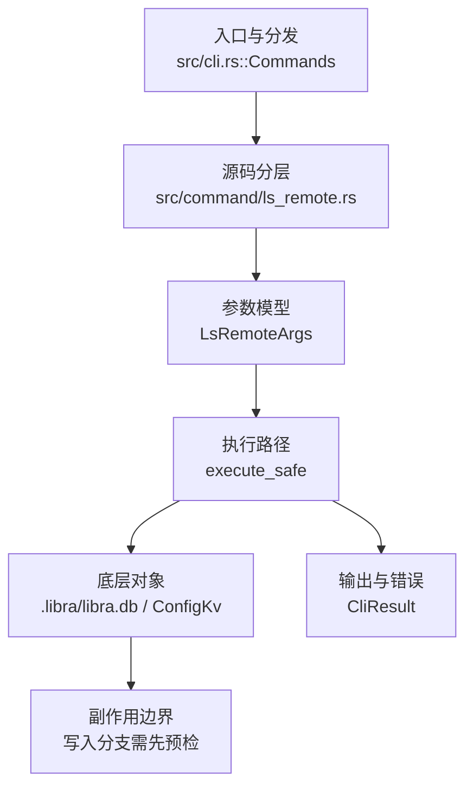

# `libra ls-remote` 开发设计

## 命令实现目标

`libra ls-remote` 的目标是列出远端引用，并支持 URL 或已配置 remote 名解析、`--heads`/`--tags`/`--refs` 过滤、ref 模式匹配、URL 解析、排序和脚本化 exit code 等能力。实现需要保证不需要完整 clone 也能诊断远端引用，同时把网络错误和认证错误区分清楚。

## 对比 Git 与兼容性

- 兼容级别：`partial`。heads/tags/refs filtering、patterns、`--get-url`、`--sort=refname` / `--sort=version:refname`、`--exit-code` 和 `--symref` 已支持。`--symref` 优先解析 discovery capabilities（`symref=<from>:<to>`，通常为 `HEAD`）；capability 缺失时（尤其本地 Libra 源），复用 fetch 的默认分支解析器按 HEAD OID / branch tips 合成可见的 `HEAD` 符号行。

- P1-06 现状复核确认 `--symref` 已正确从 Git upload-pack capability 输出 `ref: refs/heads/<branch>\tHEAD`，无需重写；`compat_fetch_remote_refspec::ls_remote_symref_matches_git_advertised_head_shape` 以真实本地 Git bare remote 固定该契约。
- 当前矩阵承诺常用 Git 行为已支持；新增语义必须同步矩阵、用户文档和测试。

## 设计方案

- 入口与分发：已公开接入 `src/cli.rs::Commands`；已由 `src/command/mod.rs` 导出。CLI 层在 `src/cli.rs` 把解析后的参数交给命令模块，命令模块负责把领域错误转换为 `CliError` / `CliResult`。
- 源码分层：主要实现文件为 `src/command/ls_remote.rs`，辅助模块包括 `ls_remote_filter.rs`（pattern/filter/sort）、`ls_remote_redaction.rs`（URL 脱敏和错误清洗）和 `ls_remote_tests.rs`（单元契约）。参数/子命令类型包括：`LsRemoteArgs`；输出、错误或状态类型包括：`LsRemoteOutput`、`LsRemoteEntry`、`LsRemoteError`；主要执行函数包括：`execute_safe`、`run_ls_remote`。
- 执行路径：`execute_safe` 负责 CLI 安全包装、错误映射和输出配置；`--get-url` 只解析 remote 名/URL 并输出脱敏后的 URL，不联系远端；普通网络路径会解析 remote 配置、协商协议并处理 pack/idx 数据；数据库路径仅通过 `ConfigKv::remote_config` 做一次只读 SQLite 查询，把 remote 名解析为 URL，不写入任何元数据，也不使用 D1。

- 流程图：以下流程图按当前源码分层展示主路径和底层对象边界，便于维护者把代码入口、执行函数和副作用范围对应起来。

- 底层操作对象：SSH transport（SSH remote 连接和认证）；`ConfigKv` / `.libra/libra.db`（仅只读查询 `remote.<name>.url` 配置行，解析 remote 名为 URL，不访问 refs/reflog/AI/发布等表）
- 输出与错误契约：人类输出、`--json` / `--machine` 输出和 quiet/verbose 分支必须继续走现有 `OutputConfig` / `emit_json_data` / `CliError` 路径；新增失败模式要补稳定错误码、用户提示和回归测试。
- 副作用边界：凡是写入索引、对象库、refs/HEAD、reflog、SQLite/D1、工作树或远端的路径，都必须先完成参数校验和 dry-run/预检分支，再执行持久化，避免部分写入后静默成功。

## 实现历史

- 本节依据本地 main 分支提交历史重写，筛选与该命令实现、测试或文档路径直接相关的提交；以下是归纳后的实现脉络。
- 2026-05-11 `5d36ac37`（`feat(remote): add ls-remote command (#365)`）：基础实现节点：add ls-remote command (#365)；当前实现的主要轮廓可追溯到该提交。
- 2026-06-06 `5d0754a6`（`feat(ls-remote): add --symref/--get-url/--sort/--exit-code and offline URL resolution`）：该提交记录的 `--get-url/--sort/--exit-code` 已在当前源码 `LsRemoteArgs` 中；`--symref` 一度从源码丢失，现已在 `LsRemoteArgs.symref` + `parse_symrefs` 中重新实现（解析 discovery capabilities 的 `symref=<from>:<to>`）。文档以当前源码暴露的参数为准。
- 2026-06-07 `0bf8ca90`（`fix(ls-remote): close compatibility plan gaps`）：实现修正：close compatibility plan gaps；该节点把边界行为、错误处理或兼容差异纳入当前实现约束。
- 历史结论：当前文档应以这些提交之后的代码、测试和兼容矩阵为准；更早的迁移式文档只保留为背景，不再作为事实来源。

## 当前状态

- 公开状态：已公开；模块状态：已导出。
- 用户文档：`docs/commands/ls-remote.md`。
- 公开参数/子命令包括：`--heads`、`-t, --tags`、`--refs`、`--get-url`、`--exit-code`、`--sort <KEY>`、`--symref`、`<repository>`、`[patterns]...`。`--sort` 当前支持 `refname`、`-refname`、`version:refname` / `v:refname` 和对应反向形式；未知 key 返回 `LBR-CLI-002`。`--exit-code` 在 discovery 成功但没有匹配 ref 时静默返回 2。`--symref` 先解析 capability，仅对过滤后仍存在的 name 输出 `ref: <target>\t<name>`；若 capability 缺失，则从 discovery 的 HEAD / heads 解析默认分支。本地 Libra 因而也可输出 `HEAD`；无可解析符号引用时 JSON 省略 `symrefs`。

## 还未实现的功能

| 类别 | 未完成项 | 当前处理 |
|---|---|---|
| 设计取舍 | `--symref` 在传输不通告 `symref=` 时需要推断默认分支。 | capability 始终优先；fallback 按 HEAD OID 匹配，再按 `main`、`master`、首个分支，复用 fetch 解析器；无可解析结果时 JSON 省略 `symrefs`。 |

## 维护要求

- 改进本命令前，必须先阅读并遵循 [docs/development/commands/_general.md](_general.md)；这是命令设计、实现、测试和文档同步的强制要求。
- 任何行为变更都要先核对实现源码，再同步 `COMPATIBILITY.md`、`docs/commands/<cmd>.md` 和相关测试。
- 新增 Git 兼容参数时必须明确 tier、错误码、JSON/机器输出契约和回归测试。
