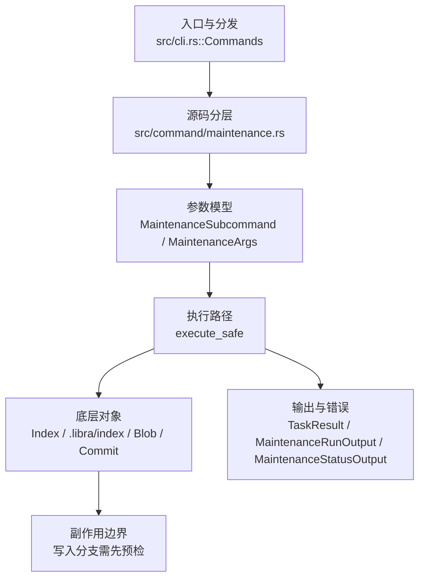

# `libra maintenance` 开发设计

## 命令实现目标

`libra maintenance` 的目标是提供高级仓库维护任务入口，暴露 `run`、`register`、`unregister`、`status` 等子命令。实现需要在底层任务尚未完整支持时安全跳过，并把 commit-graph、prefetch 等具体任务状态明确列出。

## 对比 Git 与兼容性

- 兼容级别：`partial`。`run` / `register` / `unregister` / `status` / `start` / `stop` exposed；`start`/`stop` 安装/移除 OS 调度入口（macOS 写 launchd LaunchAgents plist，登录时自动加载；其他 Unix 写 cron 片段），调度目录可由 `LIBRA_MAINTENANCE_AGENT_DIR` 覆盖（测试用）。`commit-graph` task 现写出 Git 兼容 v1 commit-graph 文件（`build_commit_graph`：CGPH 头 + OIDF/OIDL/CDAT chunk + 拓扑 generation + 按仓库 hash kind 的 trailer（SHA-1 或 SHA-256）→ `.libra/objects/info/commit-graph`；octopus(>2 父)经 EDGE chunk（`GRAPH_EXTRA_EDGES_NEEDED`/`GRAPH_LAST_EDGE`）写出已支持；SHA-256 仓库写 32 字节 OID（OIDL/CDAT 按 `hash_len` 自适应）+ header hash version 2 + SHA-256 trailer 已支持）；`prefetch` task 现遍历 `ConfigKv::all_remote_configs()` 并复用 `fetch_repository_safe` 预取所有已配置远端（无远端时跳过；`--dry-run` 仅列出）——与 Git 不同：Libra 复用普通 fetch 路径、刷新标准 remote-tracking refs 而非 `refs/prefetch/` 命名空间（intentionally-different，因 `maintenance` 是显式 opt-in 运行）

- 当前矩阵明确仍是部分兼容；未覆盖的 Git surface 必须显式列在“还未实现的功能”。

## 设计方案

- 入口与分发：已公开接入 `src/cli.rs::Commands`；已由 `src/command/mod.rs` 导出。CLI 层在 `src/cli.rs` 把解析后的参数交给命令模块，命令模块负责把领域错误转换为 `CliError` / `CliResult`。
- 源码分层：主要实现文件为 `src/command/maintenance.rs`。参数/子命令类型包括：`MaintenanceSubcommand`、`MaintenanceArgs`；输出、错误或状态类型包括：`TaskResult`、`MaintenanceRunOutput`、`MaintenanceStatusOutput`；主要执行函数包括：`execute_safe`。
- 执行路径：`execute_safe` 负责 CLI 安全包装、错误映射和输出配置；GC 的 `collect_reachable_objects` 在任何删除前追踪 SQLite refs/reflogs、index stage 0..3、文件型 `refs/stash` tip + `logs/refs/stash` 全部历史条目、`merge-autostash.json` 与 `rebase-aux.json` held OID，任一 root 不可读、OID 非法或对象缺失均 fail-closed；索引路径会加载、比较、刷新或保存 `.libra/index`；对象路径会解析 revision 并读写 blob/tree/commit/tag 等对象；网络路径会解析 remote 配置、协商协议并处理 pack/idx 数据；数据库路径会通过 SeaORM/SQLite 或 D1 客户端持久化元数据。

- 流程图：以下流程图按当前源码分层展示主路径和底层对象边界，便于维护者把代码入口、执行函数和副作用范围对应起来。

- 底层操作对象：`Index` / `.libra/index`（暂存区状态、路径条目和刷新/保存边界）；`Blob`（文件内容或 LFS pointer 写入对象库后的 blob 对象）；`Commit`（提交对象、父提交关系和提交消息载荷）；`Tree`（由索引或对象遍历生成的目录树对象）；pack / idx 对象（传输包、索引、delta 和完整性校验）；`ClientStorage`（本地/分层对象存储读写入口）；SeaORM / `.libra/libra.db`（配置、refs、reflog、AI/发布元数据等 SQLite 表）；`ObjectHash`（SHA-1/SHA-256 对象 ID 和 revision 解析结果）；`ObjectType`（blob/tree/commit/tag 类型分派）；`ConfigKv`（配置键值持久化行）
- 输出与错误契约：人类输出、`--json` / `--machine` 输出和 quiet/verbose 分支必须继续走现有 `OutputConfig` / `emit_json_data` / `CliError` 路径；新增失败模式要补稳定错误码、用户提示和回归测试。
- 副作用边界：凡是写入索引、对象库、refs/HEAD、reflog、SQLite/D1、工作树或远端的路径，都必须先完成参数校验和 dry-run/预检分支，再执行持久化，避免部分写入后静默成功。

## 实现历史

- 本节依据本地 main 分支提交历史重写，筛选与该命令实现、测试或文档路径直接相关的提交；以下是归纳后的实现脉络。
- 2026-06-10 `a4bbe28b`（`feat(gc): add safe repository maintenance command (#386)`）：基础实现节点：add safe repository maintenance command (#386)；当前实现的主要轮廓可追溯到该提交。
- 2026-07-13（P1-07a autostash review）：GC reachability 增加文件型 stash tip + reflog 全历史、merge held sidecar、rebase held sidecar、reflog old/new 两端与 annotated-tag target；unreadable index、非法 ref/reflog OID 及缺失/损坏可达对象不再静默跳过，统一在删除前 fail-closed。回归覆盖 `stash@{1}` 经 GC 后仍可 pop、annotated-tag-only commit 保留、损坏 index 不删 staged-only blob，以及 merge/rebase conflict-held autostash 经 GC 后仍可 abort 恢复。
- 历史结论：当前文档应以这些提交之后的代码、测试和兼容矩阵为准；更早的迁移式文档只保留为背景，不再作为事实来源。

## 当前状态

- 公开状态：已公开；模块状态：已导出。
- 用户文档：`docs/commands/maintenance.md`。
- Synopsis：`libra maintenance <subcommand> [options]`。
- 公开参数/子命令包括：`run`、`--task <task>`、`--dry-run`、`-q, --quiet`、`register`、`--schedule <schedule>`、`unregister`、`status`、`start --schedule <schedule>`、`stop`。
- `start`：设置 enabled/schedule 配置并经 `write_scheduler_entry` 写入 OS 调度入口（`scheduler_agent_dir()`：`LIBRA_MAINTENANCE_AGENT_DIR` 覆盖 → macOS `~/Library/LaunchAgents`/其他 `~/.config/libra/scheduler`；label = `tools.libra.maintenance.<sha1(repo)[..12]>`；schedule `hourly`/`daily`/`weekly` → launchd `StartInterval` 秒或 cron 表达式，运行 `libra maintenance run`）。`stop`：置 enabled=false 并 `remove_scheduler_entry`。artifact 生成是纯函数，按目录参数化以便单测（不触碰真实 launchd/cron）。

## 还未实现的功能

| 类别 | 未完成项 | 当前处理 |
|---|---|---|
| 兼容矩阵说明 | `run` / `register` / `unregister` / `status` / `start` / `stop` exposed; `commit-graph` 与 `prefetch` 已有实际任务实现，但仍保留 Git 语义差异 | 按当前兼容矩阵保留；实现状态变化时同步 `_compatibility.md` 和测试证据。 |
| ✅ 已实现 | commit-graph octopus merge | `build_commit_graph` 对 >2 父提交写出 EDGE chunk：CDAT 第二父槽置 `GRAPH_EXTRA_EDGES_NEEDED`(0x80000000) 按位或 EDGE 索引，EDGE chunk 列出第 2..N 个父的位置、末项按位或 `GRAPH_LAST_EDGE`(0x80000000)；有 octopus 时 chunk 数 3→4、TOC 增 `EDGE` 项、偏移顺延。非 octopus 输出逐字节不变。带单元测试 `commit_graph_build_writes_octopus_edge_chunk`（构造 3 父 merge，解析 EDGE/EXTRA 位/LAST 位）。注：libra `merge` 不支持 >2 分支，故 octopus 提交来自导入历史，不可经 CLI 复现。 |
| ✅ 已实现 | commit-graph SHA-256 | `build_commit_graph` 按 `oids[0].kind()` 选择 header hash version（1=SHA-1/2=SHA-256）与 trailer 摘要（`sha1::Sha1` / `sha2::Sha256`，新增 `sha2` 直接依赖，复用既有 transitive 0.10）；OIDL/CDAT 的 OID 宽度本就由 `hash_len = oids[0].size()` 自适应（20/32）。trailer 由 OID kind 决定（不依赖全局 hash kind），故对导入的 SHA-256 历史也自洽。带单元测试 `commit_graph_build_handles_sha256_repository`（直接构造 32 字节 OID，断言 header version 2 + 32 字节 OIDL 条目 + SHA-256 trailer）。 |
| 兼容差异项 | prefetch | 当前复用普通 fetch 路径刷新标准 remote-tracking refs；不同于 Git 的 `refs/prefetch/` namespace。无 remote 时跳过；后续若改为 Git namespace 语义，需要同步兼容矩阵和测试。 |

## 维护要求

- 改进本命令前，必须先阅读并遵循 [docs/development/commands/_general.md](_general.md)；这是命令设计、实现、测试和文档同步的强制要求。
- 任何行为变更都要先核对实现源码，再同步 `COMPATIBILITY.md`、`docs/commands/<cmd>.md` 和相关测试。
- 新增 Git 兼容参数时必须明确 tier、错误码、JSON/机器输出契约和回归测试。
