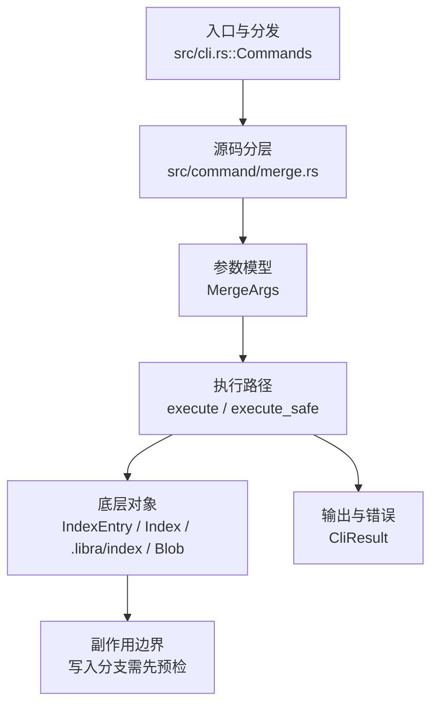

# `libra merge` 开发设计

## 命令实现目标

`libra merge` 的目标是把其他提交或分支合入当前 HEAD，覆盖 fast-forward、单头 three-way、`ours` strategy、冲突侧偏好与无关历史合并。实现需要处理冲突生命周期、autostash、rename detection、签名/策略兼容参数和 JSON 输出；`--ff`/`--ff-only`/`--no-ff`、`-s ours`、`-X ours/theirs`、`--allow-unrelated-histories`、`--log[=<n>]` 与 `merge.ff`/`merge.log`/`merge.verifySignatures` 配置默认已支持，同时把 octopus、其它 strategy/option、`--rerere-autoupdate` 和 merge-commit signing 作为未完成差异。

## 对比 Git 与兼容性

- 兼容级别：`partial`。fast-forward、单头 three-way、`-s ours`、`-X ours/theirs`、`--allow-unrelated-histories`、`--log[=<n>]`/`--no-log`、冲突 lifecycle、autostash、历史 config 与现有签名/显示 flags 已支持；octopus、其它 strategy/option、`--rerere-autoupdate` 与 merge-commit signing 延后。
- three-way 冲突仍由 `merge_tree_items` + `diffy` 行级合并处理；`-X` 只替换冲突 region，clean hunk 继续合并。`--dry-run` 仍在首次持久写前返回，strategy/option 与虚拟空 base 都只在内存计算；JSON `strategy` 对 `-s ours` 为 `ours`，真实输出不新增其它 schema key。
- `--restart` 继续对记录的 `state.target` 确定性重跑；recovery-critical 的 `allow_unrelated_histories` 从 fsynced state 重放，其它原始展示/策略 option 仍使用默认。`--no-commit` 的干净 state 继续由 `RestartWithoutConflicts` 拒绝。
- P1-07b 实现边界：`MergeStrategy::Ours` 记录双父并复用当前 tree；`MergeFavor::{Ours,Theirs}` 对 add/add、modify/delete 和内容冲突统一选侧，内容冲突使用不可与输入碰撞的动态 marker 只抽取冲突区段。LCA 缺失且显式允许时使用空 item map，`MergeState.base: Option<String>` 的 `None` 表达虚拟 base，不写伪对象。

- 当前矩阵明确仍是部分兼容；未覆盖的 Git surface 必须显式列在“还未实现的功能”。

## 设计方案

- 入口与分发：已公开接入 `src/cli.rs::Commands`；已由 `src/command/mod.rs` 导出。CLI 层在 `src/cli.rs` 把解析后的参数交给命令模块，命令模块负责把领域错误转换为 `CliError` / `CliResult`。
- 源码分层：主要实现文件为 `src/command/merge.rs`。参数/子命令类型包括：`MergeArgs`；输出、错误或状态类型包括：`PullMergeSummary`（别名 `MergeOutput`）、`PullMergeError`（别名 `MergeError`）、`MergeState`；主要执行函数包括：`execute`、`execute_safe`。
- 执行路径：`execute_safe` 负责 CLI 安全包装、错误映射和输出配置；索引路径会加载、比较、刷新或保存 `.libra/index`；对象路径会解析 revision 并读写 blob/tree/commit/tag 等对象；引用路径会读取或更新 SQLite refs、HEAD 与 reflog；数据库路径会通过 SeaORM/SQLite 或 D1 客户端持久化元数据。

- 流程图：以下流程图按当前源码分层展示主路径和底层对象边界，便于维护者把代码入口、执行函数和副作用范围对应起来。

- 底层操作对象：`IndexEntry`（索引条目，承载路径、mode、object id 和 stat 元数据）；`Index` / `.libra/index`（暂存区状态、路径条目和刷新/保存边界）；`Blob`（文件内容或 LFS pointer 写入对象库后的 blob 对象）；`Commit`（提交对象、父提交关系和提交消息载荷）；`TreeItem` / `TreeItemMode`（tree 中的路径项和 mode）；`Tree`（由索引或对象遍历生成的目录树对象）；`Branch` / branch store（SQLite refs 上的分支读写、过滤和上游关系）；`Head`（SQLite 中的 HEAD 指向、当前分支和 detached 状态）；`ReflogContext` / `with_reflog`（SQLite reflog 写入和动作记录）；`DatabaseTransaction`（需要原子性的数据库写入事务）；SeaORM / `.libra/libra.db`（配置、refs、reflog、AI/发布元数据等 SQLite 表）；`ObjectHash`（SHA-1/SHA-256 对象 ID 和 revision 解析结果）
- 输出与错误契约：人类输出、`--json` / `--machine` 输出和 quiet/verbose 分支必须继续走现有 `OutputConfig` / `emit_json_data` / `CliError` 路径；新增失败模式要补稳定错误码、用户提示和回归测试。
- 副作用边界：凡是写入索引、对象库、refs/HEAD、reflog、SQLite/D1、工作树或远端的路径，都必须先完成参数校验和 dry-run/预检分支，再执行持久化，避免部分写入后静默成功。

### --autostash（lore.md 1.8）

- 合并属主状态机（非 pull 的 push/pop 包裹）：`stash::create_held_stash_commit`（tracked-only，写 stash 提交对象与已落盘的 index-parent tree 但**不入 refs/stash**）→ sidecar `merge-autostash.json`（原子+fsync，MERGE_AUTOSTASH 模拟；held 提交仅由此文件可达，`maintenance gc` 将其作为 fail-closed reachability root）→ 硬重置 → 合并。统一 finalize（每个动作后运行）：无 merge-state → 回贴（干净→以独立 three-way merge 恢复 staged index 与 unstaged worktree 后删 sidecar；冲突→`store_stash_commit` 提升入 stash list + 通知，写工作树前完成冲突/碰撞预检，并保留纯添加 vs 未跟踪文件碰撞守卫；其它错误→警告+保留 sidecar，合并结果不变）；有 merge-state → held。`--restart` 以 `preserve_held_autostash` 跳过陈旧回收（否则 held stash 会被误降级）。陈旧 sidecar（崩溃残留）在下次合并启动时提升入 stash list（警告注明可能与已回贴内容重复）。配置 `merge.autostash` git-bool，非法值硬错误；`--dry-run` 下配置启用被静默抑制（dry-run 零写入契约）。`libra commit` 不终结合并（Libra 需 `merge --continue`，故 sidecar 不会被普通 commit 触发回贴）；并发合并进程间 sidecar 无锁（与 merge-state.json 同级暴露）。

## 实现历史

- 2026-07-10（plan-20260708 P1-05b）：新增 `history_config` 严格级联解析，`merge.ff=true|false|only`、`merge.log=true|false|<n>`、`merge.verifySignatures=true|false` 在任何 merge 写入前解析；CLI `--ff`/`--no-ff`/`--ff-only` 与正反签名 flag 优先。自动 merge message 通过 `merge_message` 追加目标侧 subject shortlog，显式 `-m` 抑制。回归 target：`compat_config_history_defaults`。同片 codex review 收口四项：签名验证提升到 `run_merge_for_pull_with_options` 顶部（目标解析+验签先于 stale-sidecar 恢复与 autostash 对象写入，验签对象即合并对象，pull 路径恒不验签）；`MergeState` 新增可选 `message` 字段（serde 默认，旧 state 兼容），冲突与 `--no-commit` 路径持久化解析后消息、`--continue` 原样重放（`-m`/shortlog 不再丢失）；`ff_only`（flag 或 `merge.ff=only`）仅在 LCA 证明分叉时拒绝，可快进的 `--squash`/`--no-commit` 放行（对齐 Git）；`commit --no-gpg-sign` 的 clap help 补 `commit.gpgSign` 优先级说明并以 `commit_help_documents_gpgsign_precedence` 钉住。
- 2026-07-13（P1-07a shared autostash safety）：held-stash 的 index-parent tree 先写入对象库；终态改用 `apply_held_stash_commit` 分别 three-way 恢复 staged index 与 unstaged worktree，补 `test_merge_autostash_restores_staged_and_worktree_layers`，消除 staged-only 内容在成功后变成不可达对象的数据丢失风险。
- 2026-07-13（P1-07b non-interactive merge controls）：新增 `-s ours`、重复且 last-wins 的 `-X ours/theirs`、`--allow-unrelated-histories`、`--log[=<n>]`/`--no-log`。虚拟空 base 与 allow 位进入原子 fsynced merge state，冲突可 restart/continue；显式 `-m --log` 的解析后消息跨 continue 保持。回归 target `compat_noninteractive_history_controls` 扩展至 21 项（含 `-s ours --no-commit` → `--continue`），并补 marker-like/no-final-newline 的选侧单测与旧 merge-state schema 兼容单测。

- 本节依据本地 main 分支提交历史重写，筛选与该命令实现、测试或文档路径直接相关的提交；以下是归纳后的实现脉络。
- 2026-05-23 `9b01fe78`（`feat(merge): wire MERGE_EXAMPLES into clap after_help (v0.17.814)`）：基础实现节点：wire MERGE_EXAMPLES into clap after_help (v0.17.814)；当前实现的主要轮廓可追溯到该提交。
- 2026-06-06 `0c7604f9`（`feat(pull): forward merge flags + depth, gate unsupported rebase strategies (#1388)`）：功能演进：forward merge flags + depth, gate unsupported rebase strategies (#1388)；该节点扩展了当前命令可用的参数或行为。
- 2026-06-03 `f4994c4f`（`feat: improve merge handling and embedded libra skill`）：功能演进：improve merge handling and embedded libra skill；该节点扩展了当前命令可用的参数或行为。
- 2026-06-07 `564cff05`（`fix(merge): close compatibility plan gaps`）：实现修正：close compatibility plan gaps；该节点把边界行为、错误处理或兼容差异纳入当前实现约束。
- 历史结论：当前文档应以这些提交之后的代码、测试和兼容矩阵为准；更早的迁移式文档只保留为背景，不再作为事实来源。

## 当前状态

- 历史默认值：`merge.ff=true|false|only`、`merge.log=true|false|<n>`、`merge.verifySignatures=true|false` 按 local→global→system 严格级联读取；对应 CLI flag 优先，无效/不可读 local/global 值在副作用前失败。`--ff` 已公开用于覆盖 `merge.ff=false|only`。`ff_only`（flag 或 `merge.ff=only`）仅拒绝真正分叉的历史，可快进的 `--squash`/`--no-commit` 放行；解析后的 merge 消息持久化于 `MergeState.message`（可选字段，旧 state 回退普通格式），`--continue` 原样重放；签名验证在目标解析后、autostash/恢复变更前执行。

- 公开状态：已公开；模块状态：已导出。
- 用户文档：`docs/commands/merge.md`。
- 冲突状态持久化（`lore.md` §7.7）：`MergeState.save` 经 `utils::atomic_write::write_atomic`（临时文件 → fsync → rename → fsync 父目录）原子且 fsync 写 `.libra/merge-state.json`——崩溃只会留下完整或缺失的 state，绝不残留半截文件破坏 `--continue`/`--abort` 恢复。
- Synopsis：`libra merge [--ff | --ff-only | --no-ff] [-s ours | -X ours/theirs] [--allow-unrelated-histories] [--log[=<n>] | --no-log] [--squash | --no-commit] [-m <msg>] [--verify-signatures | --no-verify-signatures] [--dry-run] <branch>` / `libra merge --continue` / `libra merge --abort` / `libra merge --restart`。
- 公开参数/子命令包括：`<branch>`、`--continue`、`--abort`、`--ff-only`、`--no-ff`、`-m, --message <MSG>`、`--squash`、`--no-commit`、`--no-edit`（接受为 no-op，Libra 从不为 merge 打开编辑器，行为等同默认；不提供 `--edit`）、`--stat`/`-n`/`--no-stat`（last-wins 切换：`--stat` 在合并完成后打印「合并前 HEAD↔新提交」的 diffstat（经 `command::diff::diff_stat_between_commits` 复用 `diff --stat` 渲染，仅人类输出，up-to-date/aborted/冲突/squash-no-commit 不打印）；`--no-stat`/`-n` 与默认不打印）、`--no-progress`（接受为 no-op：Libra 的 merge 从不渲染进度条；`no_progress` 字段解析后不被读取）、`--verify-signatures`（在 `run_merge_for_pull_with_options` 顶部、任何 autostash/恢复变更之前解析被合并 tip、调 `commit::verify_commit_signature` 重建签名内容并经 `vault::pgp_verify` 校验，已加载的 commit 直接传入合并——验签对象即合并对象；未签名→`UnsignedMergeCommit`、校验失败→`BadMergeSignature`，均在写任何内容前中止。仅能验证本仓库 vault PGP key 所签，无外部 keyring，故他处签名/SSH 签名视为不可验证。pull 路径恒传 `verify_signatures=false`）、`--no-verify-signatures`（默认；与 `--verify-signatures` 组成 `overrides_with` toggle，`no_verify_signatures` 字段解析后不被读取）、`--no-rerere-autoupdate`（接受为 no-op：Libra 无 rerere，无可更新；`no_rerere_autoupdate` 字段解析后不被读取。Git 的反向 `--rerere-autoupdate` 未公开）、`--no-gpg-sign`（接受为 no-op：Libra 的 merge 从不签名；`no_gpg_sign` 字段解析后不被读取。Git 的 `-S`/`--gpg-sign` 未实现）、`--dry-run`（Libra 扩展：零写入预演，见「对比 Git 与兼容性」）、`--restart`（Libra 扩展：abort+确定性重跑，见同节）。
- P1-07b 参数：`-s ours` / `--strategy=ours`；`-X ours|theirs` / `--strategy-option=<...>`（可重复、最后值生效，与 `-s` 互斥）；`--allow-unrelated-histories`；`--log[=<n>]` / `--no-log`（last-wins，bare 为 20）。`-s ours` 保留整个当前 tree，`-X` 只偏向冲突区段；其它 enum 值由 clap 在副作用前以 usage error 拒绝。JSON 仅复用 `strategy`/`parents`/`files_changed` 既有字段。
- `--ff-only`：仅当当前分支可 fast-forward 到目标时才合并，否则失败（非快进退出错误）。`--no-ff`：即使可以 fast-forward 也强制生成两亲合并提交。`-m, --message <MSG>`：覆盖合并提交消息（默认 `Merge <upstream> into <head>`）。`--squash`：执行合并并把结果写入 index/worktree，但**不创建提交、不移动 HEAD、不记录 merge 信息**（永不 fast-forward），随后用普通 `commit` 收尾生成单亲提交。`--no-commit`：执行合并并暂存结果但**停在提交之前**（永不 fast-forward），写入 `MergeState`（无冲突路径），随后用 `libra merge --continue` 收尾两亲提交。**刻意差异**：与 Git 不同，`--no-commit` 后用普通 `commit` 只会记录单亲，必须用 `merge --continue` 收尾。`--squash` 与 `--no-commit` 互斥，且都与 `--continue`/`--abort` 互斥；与 `--ff-only` 可组合（P1-05b 起对齐 Git）：可快进时放行，仅真分叉被拒。这些 flag 底层复用 pull 已有的 `PullMergeOptions` 引擎路径（`message`/`squash`/`no_commit` 在 `perform_three_way_merge` 计算出 merged tree 后提前返回；`--no-commit` 复用 `merge --continue` 的 MergeState 机制）。

## 还未实现的功能

| 类别 | 未完成项 | 当前处理 |
|---|---|---|
| 兼容矩阵说明 | fast-forward、单头三方、`-s ours`、`-X ours/theirs`、`--allow-unrelated-histories`、`--log[=<n>]`/`--no-log` 及既有 merge flags 已支持；octopus、其它 strategy/option、`--rerere-autoupdate`/`-S`/`--gpg-sign` 延后 | 按当前兼容矩阵保留；实现状态变化时同步 `_compatibility.md` 和测试证据。 |
| ✅ 已实现 | Squash `--squash` | 执行合并并写入 index/worktree，但不创建提交、不移动 HEAD（永不 ff），随后用普通 `commit` 收尾。复用 pull 引擎路径。 |
| ✅ 已实现 | 提交消息 `-m <msg>` | 覆盖默认 `Merge <branch> into <head>` 消息。 |
| ✅ 已实现 | `--no-edit` | 接受为 no-op：Libra 从不为 merge 打开编辑器（带集成测试 `test_merge_no_edit_accepts_default_message`）。 |
| ✅ 已实现 | `--stat` / `-n` / `--no-stat` | last-wins 切换。`--stat` 在合并完成后打印「合并前 HEAD↔新提交」的 diffstat（复用 `diff --stat` 渲染，经 `diff_stat_between_commits`；仅人类输出，up-to-date/aborted/冲突/squash-no-commit 不打印）；默认与 `--no-stat`/`-n` 不打印。带集成测试（`test_merge_stat_prints_diffstat_for_three_way`、`..._for_fast_forward`、`test_merge_stat_no_stat_toggle_last_wins`、`test_merge_stat_suppressed_in_json_machine_and_quiet_modes`、`test_merge_no_stat_short_n_and_long_are_accepted`）。 |
| ✅ 已实现 | `--no-progress` | 接受为 no-op：Libra 的 merge 从不渲染进度条（带集成测试 `test_merge_no_progress_is_accepted_noop`）。 |
| ✅ 已实现 | `--verify-signatures` / `--no-verify-signatures` | `overrides_with` toggle（last-wins，默认不验证）。`--verify-signatures` 在合并前验证被合并分支 tip 的 PGP 签名（`commit::verify_commit_signature` 重建签名内容 + `vault::pgp_verify`），未签名/校验失败即中止；仅验证本仓库 vault key 所签（无外部 keyring）。带集成测试（`test_merge_no_verify_signatures_is_accepted_noop`、`test_merge_verify_signatures_accepts_signed_rejects_unsigned`）。 |
| ✅ 已实现 | `--no-rerere-autoupdate` | 接受为 no-op：Libra 无 rerere，无可更新（带集成测试 `test_merge_no_rerere_autoupdate_is_accepted_noop`）。Git 的反向 `--rerere-autoupdate` 未公开。 |
| ✅ 已实现 | `--no-gpg-sign` | 接受为 no-op：Libra 的 merge 从不签名（带集成测试 `test_merge_no_gpg_sign_is_accepted_noop`）。Git 的 `-S`/`--gpg-sign` 未实现。 |
| 兼容差异项 | Octopus merge | 原始对照：不支持；相关参数/替代：不支持；当前说明：不适用。 后续实现时需要补对应回归测试并同步兼容矩阵。 |
| ✅ 已实现（限定集合） | Strategy / strategy option | `-s ours` 与 `-X ours/theirs` 已实现并有 parent/tree/hunk 回归；其它 strategy/option 明确拒绝，仍是后续兼容缺口。 |
| ✅ 已实现 | 无关历史 | `--allow-unrelated-histories` 使用虚拟空 base；冲突 state 的 allow 位可跨 restart/continue。 |
| ✅ 已实现 | Merge shortlog CLI | `--log[=<n>]`/`--no-log` 覆盖 `merge.log`、last-wins，解析后消息跨 continue。 |
| ✅ 已实现（vault-key 范围） | 验证签名 | `--verify-signatures` 已实现：对被合并 tip 做 vault-key PGP 验证，未签名/校验失败中止。受限于无外部 GPG keyring——仅能验证本仓库 vault key 所签的提交（他处签名或 SSH 签名视为不可验证），与 `tag -v` 同源。 |

## 维护要求

- 改进本命令前，必须先阅读并遵循 [docs/development/commands/_general.md](_general.md)；这是命令设计、实现、测试和文档同步的强制要求。
- 任何行为变更都要先核对实现源码，再同步 `COMPATIBILITY.md`、`docs/commands/<cmd>.md` 和相关测试。
- 新增 Git 兼容参数时必须明确 tier、错误码、JSON/机器输出契约和回归测试。
