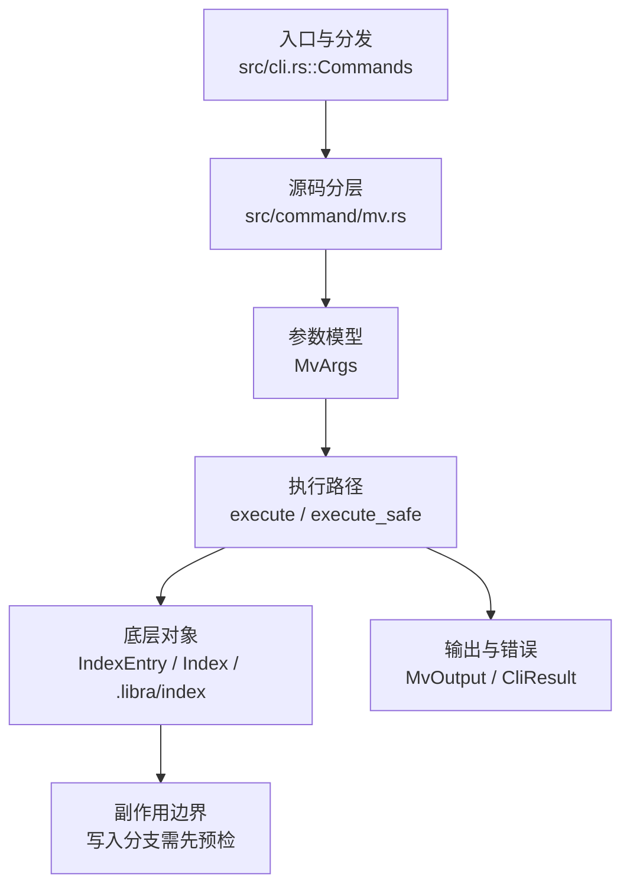

# `libra mv` 开发设计

## 命令实现目标

`libra mv` 的目标是在工作区和索引中同步移动或重命名文件、目录和符号链接。实现需要做目标预检、错误分组、skip-errors 语义、sparse no-op 标记和结构化输出，避免文件系统操作与索引状态不一致。

## 对比 Git 与兼容性

- 兼容级别：`partial`。`-k` / `--skip-errors` supported（并在 `--json` 的 `skipped` 数组中报告被丢弃的来源 + 原因；人类模式静默，与 Git 一致）; `--sparse` accepted as a no-op because Libra does not maintain sparse-checkout state

- 当前矩阵明确仍是部分兼容；未覆盖的 Git surface 必须显式列在“还未实现的功能”。

## 设计方案

- 入口与分发：已公开接入 `src/cli.rs::Commands`；已由 `src/command/mod.rs` 导出。CLI 层在 `src/cli.rs` 把解析后的参数交给命令模块，命令模块负责把领域错误转换为 `CliError` / `CliResult`。
- 源码分层：主要实现文件为 `src/command/mv.rs`。参数/子命令类型包括：`MvArgs`；输出、错误或状态类型包括：`MvOutput`（模块私有，无可见性修饰符，仅限 `mv` 模块内可见，字段 `moves` / `index_updates` / `dry_run` / `forced` / `verbose` / `skipped`（`Vec<MvSkipped{source,reason}>`，`skip_serializing_if = Vec::is_empty`），经 `emit_json_data` 序列化驱动 `--json` 契约；`-k` 决定哪些候选进入 `moves` / `index_updates`，被丢弃的来源进入 `skipped`，`--sparse` 不进入 JSON schema），错误通过 `CliResult` 或上层命令错误统一传播；主要执行函数包括：`execute`、`execute_safe`。
- 执行路径：`execute_safe` 负责 CLI 安全包装、错误映射和输出配置；索引路径会加载、比较、刷新或保存 `.libra/index`。

- 流程图：以下流程图按当前源码分层展示主路径和底层对象边界，便于维护者把代码入口、执行函数和副作用范围对应起来。

- 底层操作对象：`IndexEntry`（索引条目，承载路径、mode、object id 和 stat 元数据）；`Index` / `.libra/index`（暂存区状态、路径条目和刷新/保存边界）
- 输出与错误契约：人类输出、`--json` / `--machine` 输出和 quiet/verbose 分支必须继续走现有 `OutputConfig` / `emit_json_data` / `CliError` 路径；新增失败模式要补稳定错误码、用户提示和回归测试。
- 副作用边界：凡是写入索引、对象库、refs/HEAD、reflog、SQLite/D1、工作树或远端的路径，都必须先完成参数校验和 dry-run/预检分支，再执行持久化，避免部分写入后静默成功。

## 实现历史

- 本节依据本地 main 分支提交历史重写，筛选与该命令实现、测试或文档路径直接相关的提交；以下是归纳后的实现脉络。
- 2026-02-22 `17c0c53f`（`feat(mv): implement mv behavior and tests (#207) (#224)`）：基础实现节点：implement mv behavior and tests (#207) (#224)；当前实现的主要轮廓可追溯到该提交。
- 2026-06-06 `5753861b`（`feat(mv): add --sparse no-op flag and harden move pre-validation (#1386)`）：功能演进：add --sparse no-op flag and harden move pre-validation (#1386)；该能力曾在后续版本回退，本批重新以 no-op 形式公开 `--sparse`。
- 2026-06-01 `ebd2023d`（`feat(mv): support skip errors`）：功能演进：support skip errors；该能力曾在后续版本回退，本批重新公开 `-k` / `--skip-errors` 并补回回归测试。
- 2026-06-07 `d065ea36`（`fix(mv): close compatibility plan gaps`）：实现修正：close compatibility plan gaps；该节点把边界行为、错误处理或兼容差异纳入当前实现约束。
- 历史结论：当前文档应以这些提交之后的代码、测试和兼容矩阵为准；更早的迁移式文档只保留为背景，不再作为事实来源。

## 当前状态

- 公开状态：已公开；模块状态：已导出。
- 用户文档：`docs/commands/mv.md`。
- Synopsis：`libra mv [<options>] <source>... <destination>`。
- 公开参数/子命令包括：`<source>... <destination>`、`-v, --verbose`、`-n, --dry-run`、`-f, --force`、`-k, --skip-errors`、`--sparse`。

## 还未实现的功能

| 类别 | 未完成项 | 当前处理 |
|---|---|---|
| 兼容限制 | Sparse checkout cone 语义 | `--sparse` 已作为 no-op 接受；由于 Libra 尚未维护 sparse-checkout 状态，无法复现 Git 在 cone 外路径上的放宽语义。 |
| ✅ 已实现 | `-k` skip 诊断输出 | `MvOutput.skipped`（`Vec<MvSkipped{source,reason}>`，`skip_serializing_if = Vec::is_empty`）在 `--json`/`--machine` 中报告被丢弃的来源与原因（两类：bad/invalid source、与更早来源目标重复）。人类模式保持静默（与 Git `mv -k` 一致，由 `test_mv_skip_errors_*` 既有测试固定）。带回归测试 `test_mv_skip_errors_reports_skipped_sources`（bad/invalid source）、`test_mv_skip_errors_json_reports_duplicate_target`（duplicate-target）、`test_mv_json_omits_skipped_when_none`（空时省略）。 |

## 维护要求

- 改进本命令前，必须先阅读并遵循 [docs/development/commands/_general.md](_general.md)；这是命令设计、实现、测试和文档同步的强制要求。
- 任何行为变更都要先核对实现源码，再同步 `COMPATIBILITY.md`、`docs/commands/<cmd>.md` 和相关测试。
- 新增 Git 兼容参数时必须明确 tier、错误码、JSON/机器输出契约和回归测试。
