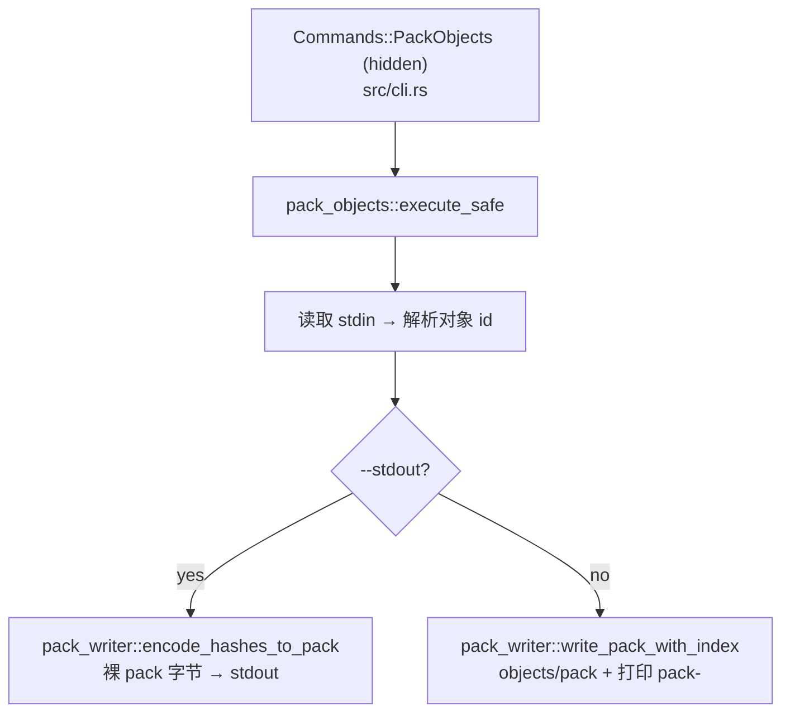

# `libra pack-objects` 开发设计

## 命令实现目标

`libra pack-objects` 是隐藏的 plumbing 命令：从 stdin 读取对象 id 列表，经共享 `internal/pack_writer.rs` 编码为单个 pack。它面向内部 / 集成使用，不进入用户兼容承诺（`hide = true`）。多数用户应使用 [`libra repack`](repack.md)。

## 对比 Git 与兼容性

- 兼容级别：`partial`。hidden plumbing command。
- 已支持：从 stdin 逐行读取对象 id（容忍 `libra rev-list --objects` 的 `<id> <path>` 形式，只取前导 id）；默认写入 `.libra/objects/pack/` 并向 stdout 打印新包的 `pack-<checksum>` stem；`--stdout` 将裸 pack 字节写到 stdout，便于 pipe 给 `libra index-pack`。
- 有意收窄（未实现）：输入是纯 id 列表（无 `--revs`/`--all` 历史遍历），输出恒为未 deltify pack，不支持 thin-pack / bitmap / reachability 选项。
- 退出码：`0`（产出 pack）；`128`（stdin 未提供任何 id）；其他非零（仓库外、编码失败）。
- 隐藏命令已登记于 `src/cli.rs` 的 `HIDDEN_COMMANDS` 白名单（`root_after_help_lists_every_visible_command` 守卫）。

## 设计方案

- 入口与分发：`src/cli.rs::Commands::PackObjects`（`hide = true`），分发到 `command::pack_objects::execute_safe`。
- 源码分层：`src/command/pack_objects.rs` 负责仓库校验、读取 stdin、解析 id（复用 `maintenance::parse_object_hash`）；编码复用 `internal::pack_writer`：`--stdout` 走 `encode_hashes_to_pack`，默认走 `write_pack_with_index`。
- 与 `repack` 共享同一 pack 写入器，故产出的包同样能被 `index-pack`/`verify-pack` 校验。

## 测试与验收

- `LIBRA_SKIP_WEB_BUILD=1 cargo test --test command_test repack`：
  - `pack-objects` 从 stdin 打包、产出的包经 `index-pack` 校验通过；
  - 空 stdin → 失败（退出 128）。
