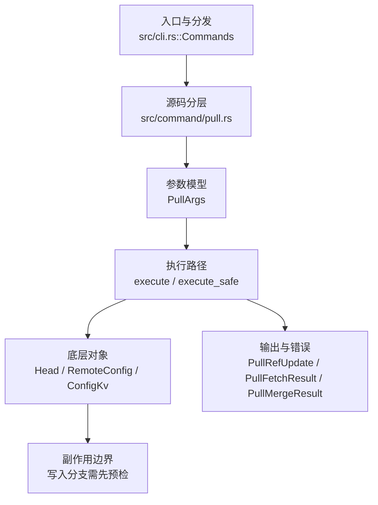

# `libra pull` 开发设计

## 命令实现目标

`libra pull` 的目标是先 fetch 再把远端变化整合进当前分支。实现需要支持 fast-forward、three-way merge、`--ff-only`/`--ff`/`--no-ff`/`--rebase`/`--no-rebase`、`pull.rebase`/`branch.<name>.rebase`/`pull.ff` 默认值、`--squash`/`--no-commit`/`--commit`、`--autostash` 与 fetch `--depth`（含本地 Libra upstream fail-closed 边界），并明确 octopus/自定义策略（`--strategy`/`-X`）的缺口。

## 对比 Git 与兼容性

- 兼容级别：`partial`。fetch + fast-forward/three-way merge supported; `--ff-only`、`--rebase`、`--no-rebase`（撤销先前的 `--rebase`，last-wins）、`--no-ff`、`--ff`、`pull.rebase`/`branch.<name>.rebase`/`pull.ff`、fetch `--depth`（Git shallow 协商路径支持；本地 Libra upstream 继承 fetch 的 `LBR-REPO-002` fail-closed）、`--squash`、`--no-commit`、`--commit` 与 `--autostash`（集成前 stash 已跟踪改动、之后 pop 回，复用 `stash::autostash_push`/`autostash_pop`，无需复杂状态机）exposed。配置默认值按 local → global → system 读取，变量名大小写不敏感；本地/全局加密值先解密；`pull.rebase=merges|interactive`（及 `m|i`）明确拒绝为 unsupported。无效或空值在 fetch/integration 前返回 `LBR-CLI-002`，本地/全局读取失败返回 `LBR-IO-001`，system scope 读取失败或不支持时跳过。

- 当前矩阵明确仍是部分兼容；未覆盖的 Git surface 必须显式列在“还未实现的功能”。

## 设计方案

- 入口与分发：已公开接入 `src/cli.rs::Commands`；已由 `src/command/mod.rs` 导出。CLI 层在 `src/cli.rs` 把解析后的参数交给命令模块，命令模块负责把领域错误转换为 `CliError` / `CliResult`。
- 源码分层：主要实现文件为 `src/command/pull.rs`。参数/子命令类型包括：`PullArgs`；输出、错误或状态类型包括：`PullRefUpdate`、`PullFetchResult`、`PullMergeResult`、`PullRebaseResult`、`PullOutput`、`PullError`；主要执行函数包括：`execute`、`execute_safe`。
- 执行路径：`execute_safe` 负责 CLI 安全包装、错误映射和输出配置；引用路径会读取或更新 SQLite refs、HEAD 与 reflog；网络路径会解析 remote 配置、协商协议并处理 pack/idx 数据。

- 流程图：以下流程图按当前源码分层展示主路径和底层对象边界，便于维护者把代码入口、执行函数和副作用范围对应起来。

- 底层操作对象：`Head`（SQLite 中的 HEAD 指向、当前分支和 detached 状态）；`RemoteConfig`（remote URL、refspec 和凭据配置）；`ConfigKv`（配置键值持久化行）
- 输出与错误契约：人类输出、`--json` / `--machine` 输出和 quiet/verbose 分支必须继续走现有 `OutputConfig` / `emit_json_data` / `CliError` 路径；新增失败模式要补稳定错误码、用户提示和回归测试。
- 全局配置 schema 保护（P0-12）：CLI dispatch 前通过 `utils::client_storage::inspect_global_config_schema_future` 检查 `~/.libra/config.db` / `LIBRA_CONFIG_GLOBAL_DB`。`pull` 默认把 future schema 视为 fail-closed 配置错误，返回 `LBR-CONFIG-001`（category `config`，exit 128），避免静默忽略全局 tiered storage 配置；`--offline` 或 `LIBRA_READ_POLICY=offline|local` 明确降级时仅 warning 一次并继续本地对象访问。诊断必须包含二进制路径、二进制版本、配置 DB 路径、当前/支持的 schema 版本和升级命令，且不得泄露 `vault.env.*` secret。回归测试：`compat_global_config_schema_future`。
- 副作用边界：凡是写入索引、对象库、refs/HEAD、reflog、SQLite/D1、工作树或远端的路径，都必须先完成参数校验和 dry-run/预检分支，再执行持久化，避免部分写入后静默成功。

## 实现历史

- 本节依据本地 main 分支提交历史重写，筛选与该命令实现、测试或文档路径直接相关的提交；以下是归纳后的实现脉络。
- 2026-05-28 `c8c47040`（`feat(pull): add --rebase flag for diverged history`）：基础实现节点：add --rebase flag for diverged history；当前实现的主要轮廓可追溯到该提交。
- 2026-06-06 `0c7604f9`（`feat(pull): forward merge flags + depth, gate unsupported rebase strategies (#1388)`）：功能演进：forward merge flags + depth, gate unsupported rebase strategies (#1388)。该提交曾被一次 reconcile 误丢内容。2026-06-18 已恢复其中在当前（已分叉）merge 引擎上仍然适用的子集：`--no-ff`、`--ff` 与 fetch `--depth`。其后 `--squash` / `--commit` / `--no-commit`（透传到 `merge::PullMergeOptions`）与 `--autostash`（stash-before/pop-after，复用 `stash::autostash_*`）均已实现并公开，不再 deferred。
- 2026-07-09 P0-03：`pull --depth` 继续只透传到 fetch；当 upstream 是本地 Libra remote 时，fetch 在对象传输前返回 `LBR-REPO-002`，pull 不进入 merge/rebase 集成阶段。详见 `docs/development/commands/fetch.md`。
- 2026-05-30 `8e987801`（`feat(pull): support ff-only`）：功能演进：support ff-only；该节点扩展了当前命令可用的参数或行为。
- 2026-06-09 `17d26c76`（`fix(pull): avoid fast-forward hang from whole-worktree restore`）：实现修正：avoid fast-forward hang from whole-worktree restore；该节点把边界行为、错误处理或兼容差异纳入当前实现约束。
- 2026-06-01 `17be24e0`（`test(compat): pin pull --ff-only/--rebase surface and fix matrix row (v0.17.1215)`）：测试契约：pin pull --ff-only/--rebase surface and fix matrix row (v0.17.1215)；相关行为已有回归守卫，后续变更需要继续满足。
- 2026-07-10（plan-20260708 P1-05a）：`run_pull` 先解析当前分支，再合成 `EffectivePullOptions`。CLI 标志优先；未传 rebase 标志时按 local → global → system 读取的 `branch.<name>.rebase` 覆盖 `pull.rebase`；未传 ff 标志时 `pull.ff=true|false|only` 分别映射默认快进、强制 merge commit、仅快进。变量名大小写不敏感，本地/全局加密值会解密；`merges`/`interactive`（及短写）返回明确 unsupported 诊断。`--commit` 仅与 `--rebase`/`--squash` 冲突，和 `--no-commit` 按最后出现者生效；它可与三种 ff 策略组合且不自行覆盖快进策略。空值/无效配置返回 `LBR-CLI-002`，本地/全局读取失败返回 `LBR-IO-001`，system scope 读取失败或不支持时跳过，均在 fetch / merge / rebase 前完成。回归测试 `compat_config_defaults_semantics`、`compat_config_defaults_edge_cases` 覆盖真实 rebase、JSON 配置选中路径、CLI 覆盖、加密值、legacy fallback、system skip、转换分支和副作用边界。
- 历史结论：当前文档应以这些提交之后的代码、测试和兼容矩阵为准；更早的迁移式文档只保留为背景，不再作为事实来源。

## 当前状态

- 公开状态：已公开；模块状态：已导出。
- 用户文档：`docs/commands/pull.md`。
- Synopsis：`libra pull [--ff-only] [--ff] [--no-ff] [--rebase] [--no-rebase] [--depth <n>] [--squash] [--no-commit] [--commit] [--autostash] [--no-progress] [<repository> [<refspec>]]`。
- 公开参数/子命令包括：`[<repository>]`、`[<refspec>]`、`-r, --rebase`、`--no-rebase`、`--ff-only`、`--ff`、`--no-ff`、`--depth <n>`、`--squash`、`--no-commit`、`--commit`、`--autostash`、`--no-progress`。`--depth` 不在 pull 层实现浅历史，而是原样透传给 fetch；本地 Libra upstream 的 fail-closed 行为在 fetch 层发生，失败后不进入集成阶段。`--autostash` 在 fetch 之后、整合（merge/rebase）之前 stash 已跟踪改动（`stash::autostash_push`，无改动时返回 false 不 stash），整合完成（成功或失败）后再 `stash::autostash_pop` 回；为此 `run_pull` 把整合结果捕获为 `integrate_result` 以便失败时也能先 pop 再传播错误。pop 失败映射为 `PullError::Autostash`，提示用 `libra stash pop` 恢复。`--no-progress` 把进度抑制转发给 fetch：`run_pull` 用 `fetch::apply_no_progress` 把传给 fetch 的 child output 的 `progress` 强制为 `ProgressMode::None`，从而抑制 fetch 的 “Receiving objects” 进度条，对齐 `git pull --no-progress`。`--no-rebase`（经 clap `overrides_with` 与 `-r`/`--rebase` 互为最后一个生效）选择 merge 路径并覆盖 `pull.rebase`；CLI 未指定 rebase/ff 行为时，`branch.<name>.rebase`、`pull.rebase` 与 `pull.ff` 按 local → global → system 级联参与合成有效选项；无效/空值在任何 fetch 或集成副作用前失败。
- `--commit`：提交 merge 结果；与 `--no-commit` 互为 last-one-wins（命令行最后出现者生效），与 `--squash`/`--rebase` 冲突。它可与 `--ff`/`--no-ff`/`--ff-only` 组合且不自行覆盖快进策略；`--ff-only` 也可与 `--squash`/`--no-commit` 组合，对齐 Git 的参数表面。配置选中的 rebase 会在成功 JSON 中表现为 `data.rebase`，即使命令行没有 `--rebase`；有效 rebase 不读取 merge-only 的 `pull.ff`。
- 无 upstream 的 `libra pull`：保留 `LBR-REPO-003` / exit 128，但 human stderr 使用 Git 风格 advisory block（无 `error:` 前缀），包含 `libra pull <remote> <branch>` 和 `libra branch --set-upstream-to=...`；当且仅当配置里只有一个 remote 时，set-upstream 示例使用该 remote 名，否则保留 `<remote>/<branch>` 占位。

## 还未实现的功能

| 类别 | 未完成项 | 当前处理 |
|---|---|---|
| ✅ 已实现 | `--ff-only` / `-r,--rebase` / `--no-rebase` / `--ff` / `--no-ff`、fetch `--depth`、`--squash`、`--no-commit`、`--commit` 已公开并生效（`--no-ff` 强制生成 merge commit，`--depth` 透传到 fetch 浅历史；本地 Libra upstream 由 fetch fail-closed，`--squash` 暂存合并树但不提交、不移动 HEAD，`--no-commit` 合并后暂停并记录 merge state 由 `libra merge --continue` 收尾，`--commit` 强制提交、与 `--no-commit` last-one-wins） | `--squash` / `--no-commit` 透传到 `merge::PullMergeOptions`；`--commit` 通过 clap `overrides_with` 清除 `--no-commit`（无新逻辑，merge 路径仍读 `no_commit`），带单元测试（`commit_flag_conflicts_and_last_one_wins`）。 |
| ✅ 已实现 | Autostash `--autostash` | 集成前 stash 已跟踪改动、之后 pop 回（复用 `stash::autostash_push`/`autostash_pop`，无需复杂状态机）；整合失败时也先 pop 再传播。带集成测试 `pull_autostash_flag_is_accepted`（编排端到端依赖 remote，归 L2）。 |
| ✅ 已实现 | `--notes`（lore.md 3.2，导入依赖图） | `PullArgs.notes` 透传到 `fetch::fetch_repository_with_result` 的 `notes` 参数，复用 fetch 的 `refs/notes/deps` 旁路导入（本地 Libra 源、default OFF、network/foreign 延后 D17）。详见 `docs/development/commands/fetch.md` 的 `--notes` 项。 |
| ✅ 已实现 | `pull.rebase` / `branch.<name>.rebase` / `pull.ff` 默认值 | CLI 标志优先；配置按 local → global → system 级联读取且变量名大小写不敏感；本地/全局加密值先解密；未传 rebase 标志时分支级 `branch.<name>.rebase` 覆盖 `pull.rebase`；未传 ff 标志时 `pull.ff=only` 等价 `--ff-only`，`pull.ff=false` 等价 `--no-ff`，`pull.ff=true` 保持快进默认；有效 rebase 不读取 merge-only 的 `pull.ff`。`merges`/`interactive`（及短写）明确 unsupported；空值/无效值返回 `LBR-CLI-002`，本地/全局读取失败返回 `LBR-IO-001`，system scope 失败/不支持时跳过，均在 fetch 前完成；显式 mode 冲突和 JSON 配置选中 rebase 有回归覆盖。 |

## 维护要求

- 改进本命令前，必须先阅读并遵循 [docs/development/commands/_general.md](_general.md)；这是命令设计、实现、测试和文档同步的强制要求。
- 任何行为变更都要先核对实现源码，再同步 `COMPATIBILITY.md`、`docs/commands/<cmd>.md` 和相关测试。
- 新增 Git 兼容参数时必须明确 tier、错误码、JSON/机器输出契约和回归测试。
