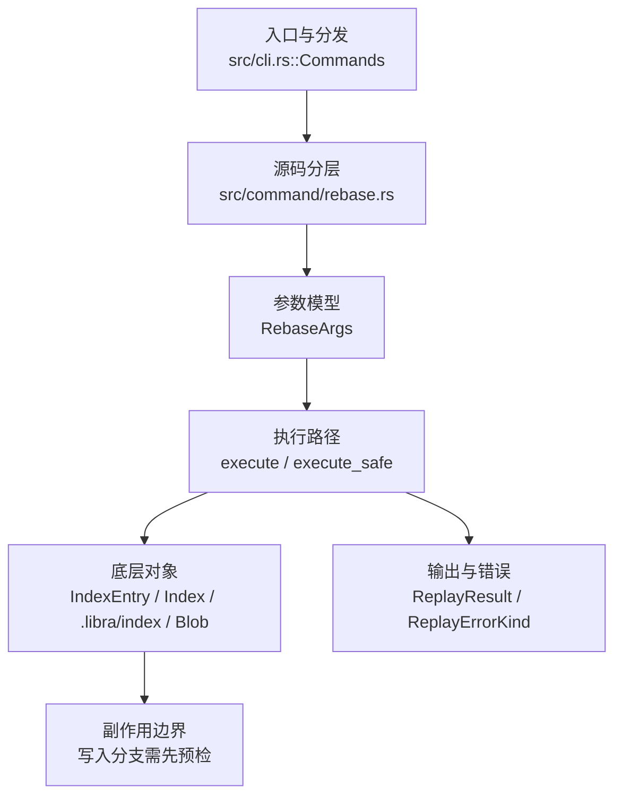

# `libra rebase` 开发设计

## 命令实现目标

`libra rebase` 的目标是把提交重放到新的 base 上，并支持 continue/abort/skip 等冲突恢复流程。实现需要保持作者/提交者语义、文件模式、错误分类和 pull --rebase 交互。除 `--onto`、`--autosquash`、`--reapply-cherry-picks` 与 empty 控制外，P1-07a 已补齐四个脚本化控制：tracked dirty state 的 `--autostash`、逐提交且强制 sandbox 的可重复 `--exec`、原子 `--update-refs`（排除所有 worktree 已检出分支）和 reflog 驱动的 `--fork-point`。interactive、`--rebase-merges`、`--rerere-autoupdate` 与 `--empty=stop|ask` 仍未实现。

## 对比 Git 与兼容性

- 兼容级别：`partial`。`--autostash`/`--no-autostash`、可重复 `--exec`、`--update-refs`/`--no-update-refs` 与 `--fork-point`/`--no-fork-point` 均为 last-wins 或 Git 同形语义；`--exec` 在所需 sandbox 不可强制时 fail-closed。`--update-refs` 记录 captured-tip CAS，支持 autosquash、become-empty、`--no-keep-empty` 与 `--skip` 的 rewrite 映射，并在一个 SQLite 事务内移动全部目标 refs。`--fork-point` 从 upstream reflog 候选中选择仍为 HEAD 祖先的最具体提交，找不到才回退普通 merge base。既有 `--onto`、autosquash、cherry-pick 与 empty 行为保持不变；interactive/`--rebase-merges`/`--rerere-autoupdate`/`--empty=stop|ask` 未支持。

- 当前矩阵明确仍是部分兼容；未覆盖的 Git surface 必须显式列在“还未实现的功能”。

## 设计方案

- 入口与分发：已公开接入 `src/cli.rs::Commands`；已由 `src/command/mod.rs` 导出。CLI 层在 `src/cli.rs` 把解析后的参数交给命令模块，命令模块负责把领域错误转换为 `CliError` / `CliResult`。
- 源码分层：主要实现文件为 `src/command/rebase.rs`。参数/子命令类型包括 `RebaseArgs`；输出、错误或状态类型包括 `RebaseState`、`RebaseAuxState`、`ReplayResult`、`ReplayErrorKind`；主要执行函数包括 `execute_safe`、`run_rebase_start`、`continue_replay`、`finalize_rebase`。Autostash 复用 `src/command/stash.rs` 的 held-stash helper，exec 复用 `internal::ai::sandbox::run_shell_command`。
- 执行路径：新序列先校验 exec，再按“stash object（含已落盘的 index-parent tree）→ fsynced sidecar → destructive reset”的顺序准备 autostash。主 todo/current-head 保存在 SQLite；`.libra/rebase-aux.json` 原子保存 exec pending index、captured refs/rewrite map 与 held stash OID，并由 `maintenance gc` 当作 fail-closed reachability root。每次 replay 成功后先保存状态和 rewrite，再执行 sandbox command；命令产生的新提交立即与 `state.current_head` 对齐，即使后续命令失败也可安全 continue/skip。结束时先物化 worktree/index，再以 captured-tip CAS 在单事务内更新当前分支、其他 refs 与 reflog，最后清 sequencer、以两个独立 three-way merge 恢复 staged index/unstaged worktree 层并删除 sidecar。

- 流程图：以下流程图按当前源码分层展示主路径和底层对象边界，便于维护者把代码入口、执行函数和副作用范围对应起来。

- 底层操作对象：`IndexEntry`（索引条目，承载路径、mode、object id 和 stat 元数据）；`Index` / `.libra/index`（暂存区状态、路径条目和刷新/保存边界）；`Blob`（文件内容或 LFS pointer 写入对象库后的 blob 对象）；`Commit`（提交对象、父提交关系和提交消息载荷）；`TreeItem` / `TreeItemMode`（tree 中的路径项和 mode）；`Tree`（由索引或对象遍历生成的目录树对象）；`Branch` / branch store（SQLite refs 上的分支读写、过滤和上游关系）；`Head`（SQLite 中的 HEAD 指向、当前分支和 detached 状态）；`ReflogContext` / `with_reflog`（SQLite reflog 写入和动作记录）；`DatabaseTransaction`（需要原子性的数据库写入事务）；SeaORM / `.libra/libra.db`（配置、refs、reflog、AI/发布元数据等 SQLite 表）；`ObjectHash`（SHA-1/SHA-256 对象 ID 和 revision 解析结果）
- 输出与错误契约：人类输出、`--json` / `--machine` 输出和 quiet 分支继续走 `OutputConfig` / `emit_json_data` / `CliError`。无效 exec 为 `LBR-CLI-002`；exec/sandbox stop 为 `LBR-CONFLICT-002`；sidecar/ref 写失败为 `LBR-IO-002`；所有错误保留可操作的 continue/skip/abort 提示。
- 副作用边界：recovery-critical sidecar 无条件 fsync，不依赖 `--sync-data`。`--exec` 信任边界是用户 shell 命令，但只允许 required workspace-write、network-denied sandbox；缺 backend 不降级裸执行。Update-refs 捕获时排除所有 worktree 的 HEAD，并在最终事务中重新比较 old OID；任一分支并发移动会回滚整个 ref 事务。Autostash re-apply 冲突先把 held object 提升到普通 stash，再清 sidecar，避免数据丢失。
- Hook 边界：新序列在任何 rebase mutation 前 blocking 运行 `pre-rebase <upstream> [branch]`；rewrite map 始终持久化到 `RebaseAuxState`，终态 ref/state/autostash 完成后 advisory 运行 `post-rewrite rebase`，stdin 为稳定排序的 old/new OID 对。无专用 `--no-verify`；中央 `LIBRA_NO_HOOKS=1` 为显式逃逸阀。

## 实现历史

- 2026-07-15（plan-20260708 P1-07a 测试确定性修复）：`compat_noninteractive_history_controls::rebase_exec_cannot_write_outside_the_repository_workspace` 原断言 exec 越界写必须使 rebase 失败，但该拒绝语义只在系统沙箱（bwrap）无法启动、Required enforcement fail-closed 的机器上成立；bwrap 可用时（`--unshare-all` + `--tmpfs /tmp` + 挂载脚手架），越界写会被**包含在 sandbox 私有命名空间内并在退出时丢弃**（touch 退出 0、宿主无文件）。测试改为钉住真正的安全不变量——逃逸文件绝不出现在宿主文件系统——并对两种合法结局分支断言（包含丢弃 → rebase 完成且无 sequencer 残留；拒绝/fail-closed → `LBR-CONFLICT-002` 且可 `--abort`）；任何真实 fail-open 逃逸仍会失败。用户文档 EN/zh 已同步包含语义说明。
- 2026-07-14（plan-20260708 P1-10）：新增 required-sandbox `pre-rebase` 与 advisory `post-rewrite rebase`；public rebase 与 `pull --rebase` 都在本地历史修改前运行同一 blocking pre hook，quiet/JSON parent 不重放 child hook 输出，post hook failure 不回滚已完成重写。回归：`compat_libra_hooks_lifecycle` 与 `command_test::test_pull_rebase_runs_pre_rebase_before_moving_local_history`。
- 本节依据本地 main 分支提交历史重写，筛选与该命令实现、测试或文档路径直接相关的提交；以下是归纳后的实现脉络。
- 2026-01-04 `1089fd43`（`feat(rebase): add --continue/--abort/--skip for conflict handling (#100)`）：基础实现节点：add --continue/--abort/--skip for conflict handling (#100)；当前实现的主要轮廓可追溯到该提交。
- 2026-05-16 `e21096fc`（`feat(cloud,rebase): align typed outputs and error classification with improvements`）：功能演进：align typed outputs and error classification with improvements；该节点扩展了当前命令可用的参数或行为。
- 2026-05-15 `802c4b4f`（`feat(rebase): route human start through runner`）：功能演进：route human start through runner；该节点扩展了当前命令可用的参数或行为。
- 2026-06-07 `f5824987`（`fix(rebase): preserve ambiguous merge-base errors`）：实现修正：preserve ambiguous merge-base errors；该节点把边界行为、错误处理或兼容差异纳入当前实现约束。
- 2026-05-21 `af91d0c6`（`test(rebase): pin From<RebaseError> for CliError stable_code mapping (v0.17.709)`）：测试契约：pin From<RebaseError> for CliError stable_code mapping (v0.17.709)；相关行为已有回归守卫，后续变更需要继续满足。
- 2026-06-19（PR-14）：新增 `--onto <newbase> [<upstream>] [<branch>]`。抽出 `newbase_id`（onto 缺省退化为 upstream），`run_rebase_start(upstream, onto)` 把 replay 落点（detach 目标、`state.onto`/`current_head`、start reflog、worktree guard 用 newbase 树）与 replay 区间（仍由 `find_merge_base(HEAD, upstream)` 决定）解耦；`--onto` 给定时跳过 fast-forward / already-up-to-date 短路（显式落点恒重放，空区间不移动分支）。第三 positional `<branch>` 经 `switch::execute_safe` 先切换。新增 `RebaseError::OntoResolve`（映射既有 `CliInvalidTarget`/128）。JSON `onto` 填 newbase id、`upstream` 填 upstream 串；人类 "Rebasing from X onto upstream" 文案沿用既有（区间来源），不破坏既有断言。
- 2026-07-13（P1-07a，v0.18.62）：新增 `--autostash`、可重复 sandbox `--exec`、`--update-refs` 和 `--fork-point` 及各自负向 toggle。引入 fsynced `RebaseAuxState` sidecar，保证 autostash、exec stop/retry、update-refs rewrite map 可跨冲突与进程重启；最终 refs captured-tip CAS 原子提交，checked-out refs 排除。Codex 高召回审查补强 exec-created commit 后续失败的 HEAD 对齐、skip/start-empty update-ref 映射、finalize 可重试顺序、fork-point 最具体候选、负向 toggle last-wins，以及 staged-only autostash 的 index-parent tree 持久化与双层恢复，避免成功后丢失暂存内容。指定回归为 `compat_noninteractive_history_controls`。
- 历史结论：当前文档应以这些提交之后的代码、测试和兼容矩阵为准；更早的迁移式文档只保留为背景，不再作为事实来源。

## 当前状态

- 公开状态：已公开；模块状态：已导出。
- 用户文档：`docs/commands/rebase.md`。
- Synopsis：`libra rebase [--onto <newbase>] [--autosquash] [--reapply-cherry-picks] [--autostash] [--exec <cmd>] [--update-refs] [--fork-point] [--no-rerere-autoupdate] [--keep-empty | --no-keep-empty] [--empty=<mode>] <upstream> [<branch>] | --continue | --abort | --skip`。
- 公开参数/子命令包括：`<upstream>`、`[<branch>]`、`--onto`、`--autosquash`、`--reapply-cherry-picks`、`--autostash`/`--no-autostash`、可重复 `--exec`、`--update-refs`/`--no-update-refs`、`--fork-point`/`--no-fork-point`、`--no-rerere-autoupdate`、empty 控制与 `--continue`/`--abort`/`--skip`。Exec stop 后 continue 重试当前 command；skip 保留已 replay commit 并跳过该 commit 剩余 exec commands。

## 还未实现的功能

| 类别 | 未完成项 | 当前处理 |
|---|---|---|
| 兼容矩阵说明 | `--onto`/autosquash/cherry-pick/empty controls 与 P1-07a 的 autostash/exec/update-refs/fork-point 已支持；interactive/`--rebase-merges`/`--rerere-autoupdate`/`--empty=stop\|ask` 未支持 | 按当前兼容矩阵保留；实现状态变化时同步 `_compatibility.md` 和测试证据。 |
| 兼容差异项 | Interactive | 原始对照：不支持；相关参数/替代：-i / --interactive；当前说明：不适用。 后续实现时需要补对应回归测试并同步兼容矩阵。 |
| ✅ 已实现 | Exec | 可重复 `--exec <cmd>` 在每个 replay commit 后按序执行；required sandbox、禁网、workspace-write；失败 round-trip 到 `--continue`/`--skip`。 |
| ✅ 已实现 | Autosquash | `--autosquash` 已支持（fixup!/squash!/amend! 移动并折叠到目标提交）。 |
| ✅ 已实现 | Autostash | `--autostash`/`--no-autostash` last-wins；tracked changes 以 held stash 跨 conflict/continue/abort，staged index 与 unstaged worktree 分层 three-way 恢复，apply 冲突提升到普通 stash。 |
| ✅ 已实现 | Update refs | `--update-refs`/`--no-update-refs` last-wins；captured-tip CAS、单事务 refs+reflog、checked-out branch 排除，覆盖 empty/skip/autosquash 映射。 |
| ✅ 已实现 | Fork point | `--fork-point`/`--no-fork-point` last-wins；upstream reflog 最具体 ancestor，缺失时 merge-base fallback。 |
| 部分实现 | Rerere autoupdate | `--no-rerere-autoupdate` 作为接受式 no-op 已公开（Libra 无 rerere）；`--rerere-autoupdate` 仍未公开。 |
| 兼容差异项 | Rebase merges | 原始对照：不支持；相关参数/替代：--rebase-merges；当前说明：默认行为。 后续实现时需要补对应回归测试并同步兼容矩阵。 |
| ✅ 已实现 | Keep empty | `--keep-empty`（no-op，默认保留）与 `--no-keep-empty`（丢弃 start-empty 提交：`commit_starts_empty` 在 `run_rebase_start` 收集后过滤 `commits_to_replay`；过滤后的 todo 持久化故 `--continue` 遵循）组成 toggle，均已公开。带集成测试（`test_rebase_keep_empty_is_accepted_noop_and_preserves_empty_commit`、`test_rebase_no_keep_empty_drops_start_empty_commits`）。 |
| ✅ 已实现 | Empty mode `--empty=<mode>` | `--empty=drop`/`keep` 控制 replay 后*变空*的提交（与 `--no-keep-empty` 的 start-empty 区分）：`replay_commit_with_conflict_detection` 在 merged tree == 新父 tree 且原提交非 start-empty（`their_tree != base_tree`）时，drop 模式返回 `ReplayResult::BecameEmptyDropped`（循环跳过、不前进 HEAD、记入 `dropped_commits`、打印 `dropping <sha> <subject> -- patch contents already upstream`），keep 模式照常提交。`empty_mode` 经 `RebaseState` 新增列 round-trip 到 `--continue`/`--skip`（ADD COLUMN 迁移，默认 `keep`）。缺省 keep 是有意与 Git（默认 drop）的分歧，避免改变既有默认行为。`stop`/`ask`（Git 的 halt-on-empty）因 Libra 非交互 rebase 无 halt-续作流而拒绝（`LBR-CLI-002`/129）。带集成测试 `test_rebase_empty_drop_skips_become_empty_commit`、`test_rebase_empty_default_keeps_become_empty_commit`、`test_rebase_empty_invalid_mode_rejected`。 |

## 维护要求

- 改进本命令前，必须先阅读并遵循 [docs/development/commands/_general.md](_general.md)；这是命令设计、实现、测试和文档同步的强制要求。
- 任何行为变更都要先核对实现源码，再同步 `COMPATIBILITY.md`、`docs/commands/<cmd>.md` 和相关测试。
- 新增 Git 兼容参数时必须明确 tier、错误码、JSON/机器输出契约和回归测试。
