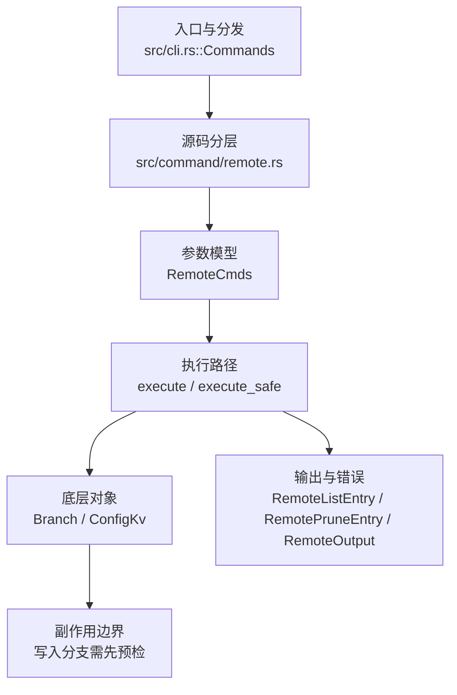

# `libra remote` 开发设计

## 命令实现目标

`libra remote` 的目标是管理远端配置，包括 add/remove/rename/get-url/set-url/prune/show/-v 等子命令。实现需要保护 SSH key namespace、复用 fetch prune 逻辑，并把远端状态以用户可读和结构化方式呈现。

## 对比 Git 与兼容性

- 兼容级别：`partial`。`add`/`remove`/`rename`/`-v`/`show`/`get-url`/`set-url`/`prune` 加上 `set-branches [--add]`（重写 `remote.<name>.fetch`）、`set-head <branch>`/`-d`/`--delete`/`--auto`（写入/删除 `refs/remotes/<name>/HEAD`；`--auto` 向远端查询 HEAD）与详细 `remote show <name>` 已支持。`remote show <name>` 默认**在线**：通过 `fetch::discover_remote_with_name` 拉取远端 HEAD/ref，把分支分类为 `tracked`/`new`/`stale`，`queried = true`；`--no-query` 走离线缓存路径（状态 `cached`，`queried = false`）。`remote update [<group>|<remote>...]` 已支持：无参数时先读取 `remotes.default`，其中的 remote 或 `remotes.<group>` 均经统一 group resolver 展开；只有该键为空时才 fetch 所有配置远端。显式名称同样可命中 `remotes.<group>` 并展开为成员。`remote add -f`/`--fetch` 已支持；`remote update -p`/`--prune` 采用先 fetch 全部 resolved 远端、全部成功后再按有效 fetch destination 映射 prune 的两段式，因此失败不会遗留已删除 ref。`remote add` 的冷配置标志 `-t <branch>`（可重复，按 `+refs/heads/<branch>:refs/remotes/<name>/<branch>` 写入逐分支 fetch refspec）、`-m <branch>`（无条件写入 `refs/remotes/<name>/HEAD`）、`--tags`/`--no-tags`（互斥，写入 `remote.<name>.tagOpt`）与信息性 `add --mirror` 标记均已支持；镜像不写 `+refs/*:refs/*` refspec（fetch 尚不感知镜像）。

- P1-06 refspec 精确性：`set-branches` / `remote add -t` 写入的 `remote.<name>.fetch` 已由 `fetch` / `remote update` / `remote prune` 消费（prune 按映射后的 destination 判断存活）；`remote update` 无参数时先解析 `remotes.default`，未配置再枚举全部远程；`remote rename` 在单事务内迁移 config（含大小写不敏感的 fetch 变量目标）、branch upstream、SSH namespace、tracking refs、remote HEAD 与 tracking reflog，remote/SSH subsection 按完整远程名精确匹配，目标 namespace 冲突时完整回滚。
- 当前矩阵承诺常用 Git 行为已支持；新增语义必须同步矩阵、用户文档和测试。

## 设计方案

- 入口与分发：已公开接入 `src/cli.rs::Commands`；已由 `src/command/mod.rs` 导出。CLI 层在 `src/cli.rs` 把解析后的参数交给命令模块，命令模块负责把领域错误转换为 `CliError` / `CliResult`。
- 源码分层：主要实现文件为 `src/command/remote.rs`。参数/子命令类型包括：`RemoteCmds`；输出、错误或状态类型包括：`RemoteListEntry`、`RemotePruneEntry`、`RemoteBranchStatus`、`RemotePullConfig`、`SetHeadMode`、`RemoteOutput`；主要执行函数包括：`execute`、`execute_safe`、`run_remote`、`run_show_remote`、`run_set_branches`、`run_set_head`。
- 执行路径：`execute_safe` 负责 CLI 安全包装、错误映射和输出配置；引用路径会读取或更新 SQLite refs、HEAD 与 reflog；网络路径会解析 remote 配置、协商协议并处理 pack/idx 数据。

- 流程图：以下流程图按当前源码分层展示主路径和底层对象边界，便于维护者把代码入口、执行函数和副作用范围对应起来。

- 底层操作对象：`Branch` / branch store（SQLite refs 上的分支读写、过滤和上游关系）；SSH transport（SSH remote 连接和认证）；Vault/libvault（身份、密钥或 vault-backed 签名边界）；`ConfigKv`（配置键值持久化行）
- 输出与错误契约：人类输出、`--json` / `--machine` 输出和 quiet/verbose 分支必须继续走现有 `OutputConfig` / `emit_json_data` / `CliError` 路径；新增失败模式要补稳定错误码、用户提示和回归测试。
- 副作用边界：凡是写入索引、对象库、refs/HEAD、reflog、SQLite/D1、工作树或远端的路径，都必须先完成参数校验和 dry-run/预检分支，再执行持久化，避免部分写入后静默成功。

## 实现历史

- 本节依据本地 main 分支提交历史重写，筛选与该命令实现、测试或文档路径直接相关的提交；以下是归纳后的实现脉络。
- 2025-10-25 `5703987b`（`feat: add option rename for remote command (#27)`）：基础实现节点：add option rename for remote command (#27)；当前实现的主要轮廓可追溯到该提交。
- 2026-06-09 `b8e6b4f4`（`feat(remote): add detailed `remote show <name>` subcommand (#379)`）：引入带 `<name>` 参数的详细 `remote show <name>`（fetch/push URL、HEAD 分支、远端及本地跟踪分支）。该 Show 详情曾被一次 reconcile 丢失内容，已于 2026-06-18 以**离线**形态恢复到当前代码：`RemoteCmds::Show { name: Option<String>, no_query, verbose }` 分发到 `run_show_remote`（带 `<name>`）或 `run_list_remotes(false)`（无 `<name>`），新增 `RemoteOutput::Show` 变体与 JSON 凭据脱敏层（`redacted_remote_output`）。其后在线发现（`fetch::discover_remote_with_name`）已恢复——`remote show <name>` 默认查询远端（`queried = true`，`--no-query` 走离线缓存）；`remote update`（多远端 fetch）也已实现（见上文兼容级别）。
- 2026-06-06 `586231c0`（`feat(remote): add set-branches and set-head subcommands (#1392)`）：引入 set-branches / set-head 子命令。其内容曾被一次 reconcile 丢失，已于 2026-06-18 恢复到当前代码：`set-branches [--add]` 在单个 `ConfigKv` 事务内重写 `remote.<name>.fetch`，`set-head <branch>`/`-d`/`--delete` 写入/删除 `refs/remotes/<name>/HEAD`（`Head` 行），`--auto` 在 `validate_remote_usage` 中按 129 拒绝（deferred），新增 `RemoteError::RemoteTrackingBranchNotFound`。
- 2026-06-19（PR-11）：补齐 `remote show <name>` 在线发现与 `set-head --auto`。抽出 `fetch::resolve_remote_default_branch(capabilities, ref_heads, remote_head)`（symref capability > HEAD OID 匹配 > main/master/first），由 fetch 缓存 remote HEAD、`remote show`/`set-head --auto` 复用。`run_show_remote` 默认在线（`discover_remote_refs` + `classify_remote_branches_online` 给出 `tracked`/`new`/`stale`，`queried = true`），`--no-query` 保留离线 `cached` 路径；`set-head --auto` 解析远端默认分支后校验本地跟踪 ref 再写入。新增 `RemoteError::Discovery`（带 `--no-query` 提示）与 `NoRemoteHead`。
- 2026-05-29 `a22d3b4b`（`fix(remote): guard ssh key namespace rename`）：实现修正：guard ssh key namespace rename；该节点把边界行为、错误处理或兼容差异纳入当前实现约束。
- 2026-07-13（plan-20260708 P1-06）：补齐 `remotes.default`、配置 refspec consumer 与 remote rename tracking namespace 事务迁移；新增 `compat_fetch_remote_refspec` 覆盖默认组、分支限制、HEAD/refspec/reflog namespace 与回滚。
- 历史结论：当前文档应以这些提交之后的代码、测试和兼容矩阵为准；更早的迁移式文档只保留为背景，不再作为事实来源。

## 当前状态

- 公开状态：已公开；模块状态：已导出。
- 用户文档：`docs/commands/remote.md`。
- Synopsis：`libra remote <subcommand> [OPTIONS] [ARGS]`。
- `remote update` 无参数时优先使用非空 `remotes.default`，否则更新全部配置远程；联网前先校验整批远程存在性与 `remote.<name>.fetch` 语法。
- `remote rename` 把配置与 `refs/remotes/<old>/*`、remote HEAD、对应 reflog 一起事务迁移到新 namespace，不再只改配置名。
- 公开参数/子命令包括：`add [-f/--fetch] [-t/--track <branch>]... [-m/--master <branch>] [--tags|--no-tags] [--mirror] <name> <url>`、`remove <name>`、`rename <old> <new>`、`-v`（verbose 列表）、`show [-n/--no-query] [-v/--verbose] [<name>]`、`get-url [--push] [--all] <name>`、`set-url [--add] [--delete] [--push] [--all] <name> <value>`、`prune [--dry-run] <name>`、`update [-p/--prune] [<group>|<remote>...]`、`set-branches [--add] <name> <branch>...`、`set-head [-a/--auto] [-d/--delete] <name> [<branch>]`。

## 还未实现的功能

| 类别 | 未完成项 | 当前处理 |
|---|---|---|
| ✅ 已实现 | `remote update [<group>\|<remote>...]`（批量 fetch） | `RemoteCmds::Update`/`RemoteOutput::Update` 已加；`resolve_update_remotes` 解析（无参=全部远端；命中 `remotes.<group>` 展开为组成员，否则按远端名），逐个调用 `fetch::fetch_repository_safe`。带集成测试（`remote_update_resolves_and_fetches_configured_remotes`）。 |
| ✅ 已实现 | `remote update -p` / `--prune`（fetch 后顺带 prune 陈旧 tracking ref） | `RemoteCmds::Update` 加 `-p/--prune`；先 fetch 全部 resolved 远端、全部成功后再逐个复用 `run_prune_remote`，把 stale 分支汇总到 `RemoteOutput::Update.pruned`（`#[serde(default, skip_serializing_if = "Vec::is_empty")]`，保持无 `-p` 时 `{action, remotes}` JSON 形状不变）。fetch 全部成功后才进入 prune 阶段（两段式），避免某个远端 fetch 失败时把已删除的 ref 丢失在错误路径里。带集成测试：`remote_update_prune_flag_is_wired`（解析+无远端通知+不可达 fetch 失败）与 `remote_update_prune_removes_stale_tracking_branches`（真实本地远端端到端修剪 stale 跟踪 ref）。 |
| ✅ 已实现 | `remote add` 冷配置标志 `-t/--track <branch>`（可重复）、`-m/--master <branch>`、`--tags`/`--no-tags` | `RemoteCmds::Add` 加四个字段，`run_add_remote` 收进 `AddRemoteArgs`：`-t` 每分支写一条 `+refs/heads/<branch>:refs/remotes/<name>/<branch>`（`ConfigKv::add`，与 `set-branches` 同格式，取代默认通配 refspec）；`--tags`/`--no-tags`（clap `conflicts_with`，互斥→129）写 `remote.<name>.tagOpt`；`-m` 在事务中 `Head::update_result_with_conn(Head::Branch, Some(name))` **无条件**写 `refs/remotes/<name>/HEAD` 的 `Head` 行（add 时跟踪 ref 尚不存在，与 Git `remote add -m` 一致；区别于 `set-head` 的存在性校验）。已与 git 差分验证 fetch refspec 与 tagOpt。带集成测试（`test_remote_add_cold_config_flags`，含 -t/--tags/-m 写入断言、--no-tags、--tags/--no-tags 冲突 129）。`add --mirror`（clap `conflicts_with = "track"`）写信息性 `remote.<name>.mirror=true` 标记、不写 `+refs/*:refs/*` refspec（与 `clone --mirror` 一致，fetch 尚不感知镜像），带集成测试 `test_remote_add_mirror_writes_marker_and_conflicts_with_track`。 |

## 维护要求

- 改进本命令前，必须先阅读并遵循 [docs/development/commands/_general.md](_general.md)；这是命令设计、实现、测试和文档同步的强制要求。
- 任何行为变更都要先核对实现源码，再同步 `COMPATIBILITY.md`、`docs/commands/<cmd>.md` 和相关测试。
- 新增 Git 兼容参数时必须明确 tier、错误码、JSON/机器输出契约和回归测试。
