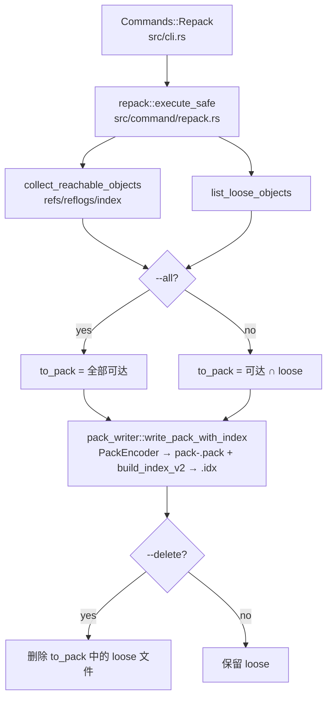

# `libra repack` 开发设计

## 命令实现目标

`libra repack` 把仓库对象合并进单个 pack，是本地对象存储优化的用户入口。实现的核心目标是**只保留一个正确的磁盘 pack 写入器**：`repack`、`pack-objects` 以及 `maintenance` 的 `loose-objects` / `incremental-repack` 任务共用 `internal/pack_writer.rs`，产出的 pack 必须能被 `libra index-pack` / `libra verify-pack` 校验通过（继承 SHA-256）。

## 对比 Git 与兼容性

- 兼容级别：`partial`。
- 已支持：`-a`/`--all`（打包全部可达对象；默认只打包 reachable-loose 对象）、`-d`/`--delete`（删除已入包的 loose 对象；**绝不**删除既有 pack，故不会遗留悬挂对象）、`-q`/`--quiet`、`--json`/`--machine`（`data.pack` / `objects_packed` / `loose_removed`）。可达性来源与 gc 一致（refs / reflogs / index）。
- 有意收窄（未实现）：始终写单个未 deltify 的 pack；delta 压缩、`--window`/`--depth`、几何式 repack（`--geometric`）、bitmap、以及删除冗余 **pack**（区别于 loose 对象）均未实现。
- 退出码：`0`（完成，含「无可打包对象」的 no-op）；非零（仓库外运行、或写包失败）。
- 新增语义必须同步 [`COMPATIBILITY.md`](../../../COMPATIBILITY.md)、用户文档 [`docs/commands/repack.md`](../../commands/repack.md) 和测试。

## 设计方案

- 入口与分发：`src/cli.rs::Commands::Repack`（可见命令，`after_help = REPACK_EXAMPLES`），分发到 `command::repack::execute_safe`。
- 源码分层：
  - `src/command/repack.rs`：参数（`RepackArgs`）、可达集与 loose 集的计算、`-d` 删除、文本/JSON 输出（`RepackOutput`）。
  - `src/internal/pack_writer.rs`：共享写入器。`encode_pack_bytes` 驱动 `git-internal` 的 `PackEncoder`；`encode_hashes_to_pack` 从存储加载对象为 `Entry` 并编码为 pack 字节；`write_pack_with_index` 以自身 trailer checksum 命名 `pack-<sha>.{pack,idx}`，用 `command::index_pack::build_index_v2` 生成索引。
  - 复用 `command::maintenance::{collect_reachable_objects, list_loose_objects, parse_object_hash}`，避免重复实现可达性遍历。
- 关键正确性：`PackEncoder::new` 在构造时从 thread-local hash kind 播种 trailer hasher，因此必须在 `set_hash_kind` **之后**、于 spawn 的任务内构造，并显式传入 `HashKind`，不依赖跨 `.await` 的 thread-local。这也修复了此前 `maintenance` 手写 writer 的 bug（sha1 硬编码、且把各对象 id 而非 pack 字节混入 trailer，导致产出的包 `index-pack` 校验失败）。

## 测试与验收

- `LIBRA_SKIP_WEB_BUILD=1 cargo test --test command_test repack`：
  - `repack -a -d` 产出的包经 `index-pack` 校验通过（关键回归：旧 writer 在此失败），loose 被清、`log`/`cat-file` 仍可读；
  - 幂等（无 loose 时 `repack` 输出「Nothing new to pack」）；
  - `--json` 输出结构；仓库外失败。
- `cargo test --test command_test maintenance` 保持全绿（gc / incremental-repack 已改调共享写入器）。
