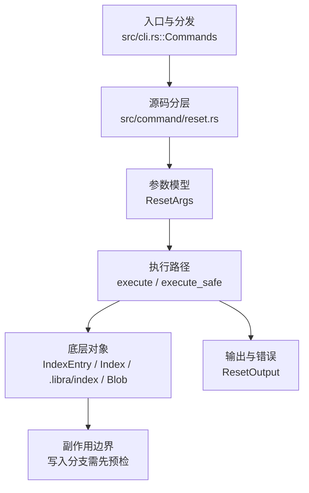

# `libra reset` 开发设计

## 命令实现目标

`libra reset` 的目标是移动 HEAD、索引和工作区到指定状态，覆盖 hard/mixed/soft/merge/keep 与 pathspec reset（含 `--pathspec-from-file` / `--pathspec-file-nul` / `--no-refresh`），并提供结构化输出。`--merge`/`--keep` 以完整预检与精确 snapshot rollback 保护本地变更。

## 对比 Git 与兼容性

- 兼容级别：`partial`。`--soft` / `--mixed` / `--hard` / `--merge` / `--keep` 和路径 reset 已支持；`--pathspec-from-file` / `--pathspec-file-nul` 与 `--no-refresh` 也已支持。`--merge` 保护 unstaged 变化并 carry unmerged stages；`--keep` 对 target-vs-HEAD 变化路径上的任何 local change fail-closed。

- 当前矩阵承诺常用 Git 行为已支持；新增语义必须同步矩阵、用户文档和测试。

## 设计方案

- 入口与分发：已公开接入 `src/cli.rs::Commands`；已由 `src/command/mod.rs` 导出。CLI 层在 `src/cli.rs` 把解析后的参数交给命令模块，命令模块负责把领域错误转换为 `CliError` / `CliResult`。
- 源码分层：主要实现文件为 `src/command/reset.rs`。参数/子命令类型包括：`ResetArgs`；输出、错误或状态类型包括：`ResetOutput`；主要执行函数包括：`execute`、`execute_safe`。
- 执行路径：`execute_safe` 负责 CLI 安全包装、错误映射和输出配置；索引路径会加载、比较、刷新或保存 `.libra/index`；对象路径会解析 revision 并读写 blob/tree/commit/tag 等对象；引用路径会读取或更新 SQLite refs、HEAD 与 reflog。

- 流程图：以下流程图按当前源码分层展示主路径和底层对象边界，便于维护者把代码入口、执行函数和副作用范围对应起来。

- 底层操作对象：`IndexEntry`（索引条目，承载路径、mode、object id 和 stat 元数据）；`Index` / `.libra/index`（暂存区状态、路径条目和刷新/保存边界）；`Blob`（文件内容或 LFS pointer 写入对象库后的 blob 对象）；`Commit`（提交对象、父提交关系和提交消息载荷）；`TreeItem` / `TreeItemMode`（tree 中的路径项和 mode）；`Tree`（由索引或对象遍历生成的目录树对象）；`Branch` / branch store（SQLite refs 上的分支读写、过滤和上游关系）；`Head`（SQLite 中的 HEAD 指向、当前分支和 detached 状态）；`ReflogContext` / `with_reflog`（SQLite reflog 写入和动作记录）；`ObjectHash`（SHA-1/SHA-256 对象 ID 和 revision 解析结果）
- 输出与错误契约：人类输出、`--json` / `--machine` 输出和 quiet/verbose 分支必须继续走现有 `OutputConfig` / `emit_json_data` / `CliError` 路径；新增失败模式要补稳定错误码、用户提示和回归测试。
- 副作用边界：凡是写入索引、对象库、refs/HEAD、reflog、SQLite/D1、工作树或远端的路径，都必须先完成参数校验和 dry-run/预检分支，再执行持久化，避免部分写入后静默成功。

## 实现历史

- 本节依据本地 main 分支提交历史重写，筛选与该命令实现、测试或文档路径直接相关的提交；以下是归纳后的实现脉络。
- 2026-06-06 `0e7b5a8f`（`feat(reset): support --pathspec-from-file, --pathspec-file-nul, --no-refresh`）：引入 `--pathspec-from-file`（`-` 读 stdin）/ `--pathspec-file-nul` / `--no-refresh` 三个标志。注：该提交的代码内容曾被一次纠缠的 reconcile 从工作树中丢弃（提交信息保留、实现消失），已于 2026-06-18 按原 diff 重新落地到当前 `ResetArgs`，故这些标志现已公开并有回归测试覆盖。
- 2026-05-24 `2827b6e3`（`fix(reset): skip traversing ignored directories in reset --hard and bump version to 0.17.946`）：实现修正：skip traversing ignored directories in reset --hard and bump version to 0.17.946；该节点把边界行为、错误处理或兼容差异纳入当前实现约束。
- 2026-05-21 `1fa9973e`（`test(reset): pin ResetError stable_code 19-variant mapping (v0.17.706)`）：测试契约：pin ResetError stable_code 19-variant mapping (v0.17.706)；相关行为已有回归守卫，后续变更需要继续满足。
- 2026-07-09（plan-20260708 P0-11）：源码核对确认 `reset --hard` 旧工作树恢复只写普通文件，tree 中 mode `120000` 的 symlink 会变成普通文件；pathspec reset 也曾用默认 blob mode 写回 index，可能丢失 `120000`。当前 hard reset 按 `TreeItemMode` 写工作树：symlink 用 blob 字节创建真实 symlink，普通文件写入前移除同名 symlink；pathspec reset 写 index 时保留 tree item mode；不支持平台明确报错。回归守卫：`compat_symlink_basic`。
- 2026-07-13（plan-20260708 P1-07c）：公开 `--merge`/`--keep`。两者先加载 HEAD/target/current index，逐路径比较 tree/index/worktree 并在覆盖风险时以 `LBR-CONFLICT-002` 拒绝；写入前保存原 index 原始字节、目录/缺失状态与 clean tracked entry 的对象/mode 引用（避免把大文件无界缓冲到内存），任何 worktree/ref 失败均精确 rollback。路径验证拒绝 `..`/absolute/`.libra` 元数据目标；ancestor 检查全程 `symlink_metadata` no-follow，ignored symlink 也不能把 write/rollback 导向仓库外。`--merge` carry stage 1/2/3 unmerged entries。E2E 固定 preservation、tracked/untracked refusal、file/directory 双向 transition 与外部 sentinel no-follow；unit rollback 回归固定两类 transition 的精确恢复。
- 历史结论：当前文档应以这些提交之后的代码、测试和兼容矩阵为准；更早的迁移式文档只保留为背景，不再作为事实来源。

## 当前状态

- 公开状态：已公开；模块状态：已导出。
- 用户文档：`docs/commands/reset.md`。
- Synopsis：`libra reset [--soft | --mixed | --hard | --merge | --keep] [<target>]`；其余 pathspec forms 不变。
- 公开参数在既有 surface 上新增 `--merge` 与 `--keep`，均属于 Clap `mode` 互斥组且拒绝 pathspec。
- `--hard` 工作树恢复保留 tree item mode：普通文件、可执行文件和 symlink 分别按 mode 写入；mode `120000` 的 symlink 不跟随目标、不解析目标路径，只把 blob 字节作为链接目标。Pathspec reset 只改 index，但同样保留目标 tree 的 mode，因此 symlink reset 回 index 后仍是 `120000`。

## P1-07c 保留模式

| 模式 | 预检 | 成功行为 |
|---|---|---|
| `--merge` | `target != index && worktree != index` 时拒绝 | index→target；仅更新 target-vs-HEAD 且 worktree clean 的路径；保留 unstaged 与 unmerged stages |
| `--keep` | target-vs-HEAD 路径存在 staged/unstaged local change 时拒绝 | index→target；更新 target-vs-HEAD 路径；保留不受影响路径 local change |

`perform_guarded_reset` 对 index/worktree 做精确 snapshot；side effect 或 `with_reflog` ref transaction 失败时恢复 snapshot。路径级拒绝在任何 index/worktree/ref mutation 前完成。

## 维护要求

- 改进本命令前，必须先阅读并遵循 [docs/development/commands/_general.md](_general.md)；这是命令设计、实现、测试和文档同步的强制要求。
- 任何行为变更都要先核对实现源码，再同步 `COMPATIBILITY.md`、`docs/commands/<cmd>.md` 和相关测试。
- 新增 Git 兼容参数时必须明确 tier、错误码、JSON/机器输出契约和回归测试。
