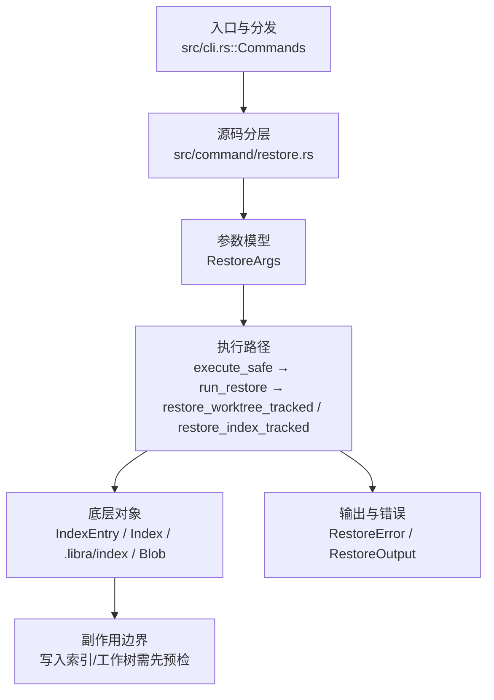

# `libra restore` 开发设计

## 命令实现目标

`libra restore` 的目标是从索引、工作区或指定来源恢复文件内容。实现需要支持 staged/worktree、`--source <tree-ish>` 来源解析、pathspec 处理、冲突阶段 `--ours/--theirs/-2/-3` + `--ignore-unmerged`（仅写工作树，索引保持未合并；未合并路径的普通 restore 报错 `LBR-CONFLICT-001`/128）与 overlay 模式 `--overlay`/`--no-overlay`（真实切换，最后给出的生效：overlay 仅创建/更新 source 中的路径、不移除 source 中缺失的已跟踪路径；默认 no-overlay 移除它们），`--merge`/`--conflict=merge|diff3`（从索引 stage 重建冲突标记写回工作树——Libra 的整文件 `ours`/`theirs` 标记，标签为通用 `ours`/`theirs`，非 Git 行级 3-way（注：`libra merge`/`cherry-pick` 已改为行级；restore 索引-stage 重建仍整文件）；diff3 额外含 base 块；zdiff3 不支持）也已支持，同时把 patch、progress 进度条等能力列为差异（`--no-progress` 已作为接受式 no-op 公开）。

## 对比 Git 与兼容性

- 兼容级别：`partial`。`--source` / `--staged` / `--worktree`、路径 restore、冲突阶段 `--ours`/`-2` 与 `--theirs`/`-3`（写工作树、索引保持未合并）+ `--ignore-unmerged`（跳过未合并路径）、overlay 模式 `--overlay`/`--no-overlay`（真实切换、最后给出的生效：overlay 不移除 source 中缺失的已跟踪路径；默认 no-overlay 移除）与 `--no-progress`（接受式 no-op：Libra 的 restore 从不渲染进度条）已支持；未合并路径的普通 restore 被拒绝（`LBR-CONFLICT-001`/128）；`--merge`/`--conflict=merge|diff3`（从索引 stage 重建冲突标记，Libra 整文件标记格式；diff3 含 base 块；zdiff3→`LBR-CLI-002`/129）已支持；patch 变体与 `--progress` 进度条尚未公开。

- 当前矩阵承诺常用 Git 行为已支持；新增语义必须同步矩阵、用户文档和测试。

## 设计方案

- 入口与分发：已公开接入 `src/cli.rs::Commands`；已由 `src/command/mod.rs` 导出。CLI 层在 `src/cli.rs` 把解析后的参数交给命令模块，命令模块负责把领域错误转换为 `CliError` / `CliResult`。
- 源码分层：主要实现文件为 `src/command/restore.rs`。参数/子命令类型包括：`RestoreArgs`；输出、错误或状态类型包括：`RestoreError`、`RestoreOutput`；主要执行函数包括：`execute_safe`、`run_restore`、`restore_worktree_tracked`、`restore_index_tracked`、`execute_to_output`（`execute` 仅为 `execute_safe` 的薄包装；`execute_checked`、`execute_checked_typed` 为供 `worktree.rs` 与 `checkout`/`clone` 调用的遗留公开 API，不在常规 CLI 分发路径上）。
- 执行路径：CLI 直接分发到 `execute_safe`（`src/cli.rs` 调用 `command::restore::execute_safe`），由其负责 CLI 安全包装、错误映射和输出配置；核心领域逻辑集中在私有 `run_restore`（再调用 `restore_worktree_tracked` / `restore_index_tracked`）；`execute_checked` / `execute_checked_typed` 是遗留路径，常规 CLI 分发不走它们；索引路径会加载、比较、刷新或保存 `.libra/index`；对象路径会解析 revision 并读写 blob/tree/commit/tag 等对象；LFS 路径会按 `.libra_attributes` 生成 pointer、锁或 batch 请求；工作树路径会显式处理目录、注册表和删除/保留语义。

- 流程图：以下流程图按当前源码分层展示主路径和底层对象边界，便于维护者把代码入口、执行函数和副作用范围对应起来。

- 底层操作对象：`IndexEntry`（索引条目，承载路径、mode、object id 和 stat 元数据）；`Index` / `.libra/index`（暂存区状态、路径条目和刷新/保存边界）；`Blob`（文件内容或 LFS pointer 写入对象库后的 blob 对象）；`Commit`（提交对象、父提交关系和提交消息载荷）；`Tree`（由索引或对象遍历生成的目录树对象）；`Branch` / branch store（SQLite refs 上的分支读写、过滤和上游关系）；`Head`（SQLite 中的 HEAD 指向、当前分支和 detached 状态）；`ClientStorage`（本地/分层对象存储读写入口）；`ObjectHash`（SHA-1/SHA-256 对象 ID 和 revision 解析结果）；`ObjectType`（blob/tree/commit/tag 类型分派）；LFS pointer / lock / batch 对象（`.libra_attributes` 驱动的大文件路径）；worktree registry / filesystem layout（附加工作区登记、路径和删除边界）
- 输出与错误契约：人类输出、`--json` / `--machine` 输出和 quiet/verbose 分支必须继续走现有 `OutputConfig` / `emit_json_data` / `CliError` 路径；新增失败模式要补稳定错误码、用户提示和回归测试。
- 副作用边界：凡是写入索引、对象库、refs/HEAD、reflog、SQLite/D1、工作树或远端的路径，都必须先完成参数校验和 dry-run/预检分支，再执行持久化，避免部分写入后静默成功。

## 实现历史

- 本节依据本地 main 分支提交历史重写，筛选与该命令实现、测试或文档路径直接相关的提交；以下是归纳后的实现脉络。
- 2026-06-06 `31378911`（`feat(restore): conflict-stage restore --ours/--theirs/-2/-3, --ignore-unmerged, unmerged guard`）：首次引入 conflict-stage restore；该提交在一次 reconcile 中被回退（参数从 `RestoreArgs` 丢失）。2026-06-25 由原提交内容恢复并适配当时已新增的 `--no-overlay`/`--no-progress`/`--pathspec-from-file` 字段：`--ours`/`-2`（冲突 stage 2）、`--theirs`/`-3`（冲突 stage 3）写工作树、索引保持未合并；`--ignore-unmerged` 跳过未合并路径；普通 restore 命中未合并路径报 `RestoreError::PathUnmerged`（`LBR-CONFLICT-001`/128）；缺失阶段报 `RestoreError::MissingStageVersion`。四个互斥关系经 clap `conflicts_with_all` 表达（→ `LBR-CLI-002`/129）。
- 2026-06-09 `17d26c76`（`fix(pull): avoid fast-forward hang from whole-worktree restore`）：实现修正：avoid fast-forward hang from whole-worktree restore；该节点把边界行为、错误处理或兼容差异纳入当前实现约束。
- 2026-06-25 `feat(restore): real --overlay overlay mode`：将原本作为接受式 no-op 的 `--no-overlay` 升级为真实的 overlay 切换对。新增 `--overlay`，与 `--no-overlay` 经 `overrides_with` 互为切换（最后给出的生效）；`overlay` 透传给 `restore_worktree_tracked`/`restore_index_tracked`。两种模式都仍计算「source 中存在但目标缺失」的发现集（用于重建/新增），overlay 仅通过门控真正的删除分支实现「不移除 source 中缺失的已跟踪路径」，从而只创建/更新 source 中的路径。同时修复一个既有 bug：已删除目录的 pathspec 经 `integrate_pathspec` 会以裸目录形式进入 `file_paths`，重建其子文件后再被当作 blob 哈希会 panic；三处 worktree restore（`restore_worktree_tracked` 与两个遗留 `restore_worktree*`）新增 `file_paths.retain(只保留 source blob 或现存文件)` 守卫。
- 2026-07-02（`lore.md` Phase 1 / 1.2 收尾）：conflict-stage restore 核心（`--ours`/`--theirs` 等）本已落地；本轮补 Git-fidelity——modify/delete 缺失阶段在默认 no-overlay 下删除工作树文件（exit 0）而非报错，`--overlay` 下仍报 `MissingStageVersion`；`restore_conflict_stage` 改返回 `(restored, deleted)` 并填充 `RestoreOutput.deleted_files`。确认 merge/rebase/cherry-pick 均写 stages 1/2/3，rebase 的 --ours/--theirs 语义 swap 为纯文档。纠正 `MissingStageVersion` 注释（原误称对齐 `git restore`，实为 Git overlay 模式行为）。新增 4 个集成测试（modify/delete 删除、delete/modify 删除、`--json` 报 deleted_files、`--overlay` 缺失阶段报错）。
- 2026-07-12（P1-05e R14 补强）：worktree 与 conflict-stage restore 在写入前统一预检目录转换；空的已物化 gitlink 目录可被删除或替换为 blob/symlink，非空目录返回 `NonEmptyWorktreeDirectory`，且在任何已选路径变更前 fail-closed，避免部分写入或递归删除嵌套仓库/用户数据。
- 2026-07-12（P1-05e R20 补强）：`restore --merge` / `--conflict=diff3` 纳入同一目录转换预检；空目录可替换为普通 marker 文件，任一命中目录非空时在写入所有已选路径前返回 `NonEmptyWorktreeDirectory`。空目录与多路径 fail-before-mutation 回归均先红后绿。
- 2026-07-09（plan-20260708 P0-11）：源码核对确认旧 restore 只按 blob hash 写普通文件，导致 tree 中 mode `120000` 的 symlink 被物化为普通文件。当前 `RestoreTarget` 保留 `TreeItemMode`，工作树恢复用 `restore_target_to_file_typed`：symlink 写为真实 symlink，普通文件会先移除同名 symlink 再写入；`restore --merge` 重建冲突标记前也会移除同名 symlink，避免把 marker 写到链接目标；非支持平台返回 `RestoreError::SymlinkUnsupported`（stable code `Unsupported`）。回归守卫：`compat_symlink_basic`。
- 2026-07-09（plan-20260708 P1-01）：`restore` 的普通 restore、`--staged`、`--worktree`、`--ignore-unmerged`、conflict-stage restore、`--merge` 与内部 `execute_checked*` 调用统一接入 `src/utils/pathspec/`。当前支持 plain prefix、wildcard、`:(top)`/`:/`、`:(glob)`、`:(literal)`、`:(icase)`、`:(exclude)`、`:!`、`:^`，并按 `core.ignorecase` 作为默认大小写策略；wildcard-looking pattern 仍匹配同名字面路径或目录前缀（Git bracket-file / bracket-directory 行为）；`--pathspec-from-file` 为空时显式报错，避免空文件变成全仓恢复。回归守卫：`compat_pathspec_magic::restore_honors_shared_pathspec_magic`。
- 历史结论：当前文档应以这些提交之后的代码、测试和兼容矩阵为准；更早的迁移式文档只保留为背景，不再作为事实来源。

## 当前状态

- 公开状态：已公开；模块状态：已导出。
- 用户文档：`docs/commands/restore.md`。
- Synopsis：`libra restore [--source <tree-ish>] [--staged] [--worktree] [(--ours | --theirs | --merge | --conflict=<style>)] [--ignore-unmerged] [--pathspec-from-file <FILE> [--pathspec-file-nul]] [<pathspec>...]`。
- 公开参数/子命令包括：`<pathspec>...`、`-s, --source <SOURCE>`、`-W, --worktree`、`-S, --staged`、`-2, --ours`（冲突 stage 2 写工作树）、`-3, --theirs`（冲突 stage 3 写工作树）、`--ignore-unmerged`（跳过未合并路径）、`--pathspec-from-file <FILE>`、`--pathspec-file-nul`、`--overlay`/`--no-overlay`（真实切换对，`overrides_with` 最后给出的生效；overlay 仅创建/更新 source 中的路径、不移除 source 中缺失的已跟踪路径，默认 no-overlay 移除）、`--no-progress`（接受式 no-op：Libra 的 restore 从不渲染进度条；字段 `no_progress` 解析后不被读取）、`--merge`（对未合并路径用 `restore_conflict_merge`+`build_conflict_markers` 从索引 stage 1/2/3 重建冲突标记写回工作树，索引保持未合并；整文件 `ours`/`theirs` 标记，独立实现、标签用通用 `ours`/`theirs`（merge.rs `write_conflict_markers` 现已改为行级 hunk + HEAD/commit-abbrev 标签；restore 仍整文件））、`--conflict <style>`（隐含 --merge：`merge` 默认 / `diff3` 含 base 块；其他值如 zdiff3 报 `RestoreError::UnsupportedConflictStyle`→`LBR-CLI-002`/129；与 ours/theirs/source/staged/ignore_unmerged 互斥）。
- plan-20260708 P1-01 后，所有 restore path filter 都先编译为共享 `PathspecSet`，再对 source tree、index stage、worktree deletion/rebuild 候选统一应用 `matches_path`；正向规格无命中时报 `RestoreError::InvalidPathspec`（`LBR-CLI-003`），但 `--ignore-unmerged` 允许被显式跳过的 unmerged 路径不触发未命中误报。
- 冲突阶段 restore（`--ours`/`-2`、`--theirs`/`-3`）：读取索引未合并条目的 stage 2/3 blob 写入工作树，索引刻意保持未合并（`libra status` 仍显示冲突直到 `libra add` 暂存解决）。与 `--theirs`/`--source`/`--staged`/`--ignore-unmerged` 互斥（clap `conflicts_with_all` → `LBR-CLI-002`/129）。**缺失阶段（modify/delete 冲突：被请求的一侧删除了该文件）**：默认 no-overlay 下删除工作树文件并 exit 0（恢复「删除」即删除，对齐 `git restore`；复用 `fs::remove_file`+`util::clear_empty_dir`，幂等——文件已不存在也成功），记入 `deleted_files`；`--overlay` 下（overlay 从不移除路径）仍报 `RestoreError::MissingStageVersion`（`LBR-CONFLICT-001`/128，即 Git overlay 模式的 `does not have our/their version`）。`restore_conflict_stage` 因此返回 `(restored, deleted)` 二元组。**rebase 下 --ours/--theirs 互换**（读 stage 逐字，rebase 写 stage 2=onto/新基、stage 3=被重放提交，故 --ours=onto、--theirs=被重放——与 merge/cherry-pick 的 ours=HEAD/theirs=incoming 相反；纯文档，无需特判）。`--ours`/`--theirs` 仅作用于未合并路径：非冲突 pathspec 被跳过，全部非冲突则报 `LBR-CONFLICT-001`/128；**有意不**复制 Git 对非冲突路径回退到 stage-0（索引）restore 的行为，以免静默回退 dirty 文件。普通 restore 命中未合并路径默认报 `path '<file>' is unmerged`（`LBR-CONFLICT-001`/128），`--ignore-unmerged` 改为跳过这些路径、恢复其余。
- `--pathspec-from-file <FILE>`：从文件读取 pathspec（每行一个，`-` 读 stdin），与位置 `<pathspec>` 二选一（clap `required_unless_present`，省略位置参数时由该选项满足）；`--pathspec-file-nul` 改用 NUL 分隔（要求同时给出 `--pathspec-from-file`）。空条目被忽略，换行模式下去除行尾 `\r`。在 `run_restore` 顶部解析后填充 `args.pathspec`，对内部 `execute_checked*` 调用方无影响（它们传显式 pathspec）。
- overlay 模式（`--overlay`/`--no-overlay`，`overrides_with` 切换、`args.overlay` 取最后生效值）：`run_restore` 把 `overlay` 透传给 `restore_worktree_tracked` / `restore_index_tracked`。⚠️ 两个发现集（`get_worktree_deleted_files_in_filters` / `get_index_deleted_files_in_filters_typed`）发现的是「source 中存在但目标缺失」需要**重建/新增**的路径（命名虽叫 "deleted"），两种模式都必须计算，否则 overlay 无法重建本地已删除的 source 文件。overlay 语义**仅**通过门控真正的删除分支实现：worktree 的 `else if !overlay && index.tracked(.., 0) { fs::remove_file }` 与 index 的 `else if !overlay { index.remove }`。故 overlay 仍创建/更新 source 提供的所有路径，只是不移除 source 中缺失的已跟踪路径；overlay=false（默认）保持原有「移除 source 中缺失的已跟踪路径」语义。10+ 个 `RestoreArgs` 构造点新增 `overlay: false` 字段。
- Symlink restore：source/index/conflict-stage target 中 mode `120000` 的条目不会被当作普通 blob 文件写入，而是按 blob 字节创建 symlink；匹配判断使用 `symlink_metadata` 与 `calc_file_blob_hash`，dangling symlink 不会被误判为缺失。恢复普通文件以及 `--merge` 冲突标记文件前会移除现有 symlink，避免跟随 symlink 覆盖外部目标。

## 还未实现的功能

| 类别 | 未完成项 | 当前处理 |
|---|---|---|
| ✅ 已实现 | 冲突解析 | `--ours`/`-2`、`--theirs`/`-3`（写工作树、索引保持未合并）、`--ignore-unmerged`（跳过未合并）、`--merge` 与 `--conflict=merge|diff3`（从索引 stage 重建冲突标记，Libra 整文件标记格式；diff3 含 base 块）均已公开；普通 restore 命中未合并路径报 `LBR-CONFLICT-001`/128。仅 `zdiff3` 风格与 Git 的行级 3-way 标记未支持。带集成测试（`test_restore_ours_writes_stage2_blob`/`..theirs..`/`test_restore_merge_rewrites_conflict_markers`）。 |
| ✅ 已实现 | Symlink restore | Tree/index/conflict-stage mode `120000` 恢复为真实 symlink，链接目标来自 blob 字节且不跟随目标；不支持 symlink 的平台显式 fail-closed。带 compat 测试 `compat_symlink_basic`。 |
| ✅ 已实现 | Shared pathspec magic | 原始对照：git pathspec magic；当前说明：CLI 与内部 restore 调用统一走 `src/utils/pathspec/`，支持 plain prefix、wildcard、`top`/`glob`/`literal`/`icase`/`exclude` 等高价值 magic，并继承 `core.ignorecase`。带 compat 测试 `compat_pathspec_magic::restore_honors_shared_pathspec_magic`。 |
| 兼容差异项 | patch 模式 | 原始对照：不支持；相关参数/替代：-p / --patch；当前说明：不适用。 后续实现时需要补对应回归测试并同步兼容矩阵。 |
| 部分实现 | 进度 | `--no-progress` 作为接受式 no-op 已公开（Libra 的 restore 从不渲染进度条）；`--progress` 进度条本身仍未实现。 |
| 兼容差异项 | 目标 revision | 原始对照：不支持；相关参数/替代：不适用；当前说明：--to <revision>。 后续实现时需要补对应回归测试并同步兼容矩阵。 |
| 兼容差异项 | 恢复指定 revision 的变更 | 原始对照：不支持；相关参数/替代：不适用；当前说明：--changes-in <revision>。 后续实现时需要补对应回归测试并同步兼容矩阵。 |

## 维护要求

- 改进本命令前，必须先阅读并遵循 [docs/development/commands/_general.md](_general.md)；这是命令设计、实现、测试和文档同步的强制要求。
- 任何行为变更都要先核对实现源码，再同步 `COMPATIBILITY.md`、`docs/commands/<cmd>.md` 和相关测试。
- 新增 Git 兼容参数时必须明确 tier、错误码、JSON/机器输出契约和回归测试。
