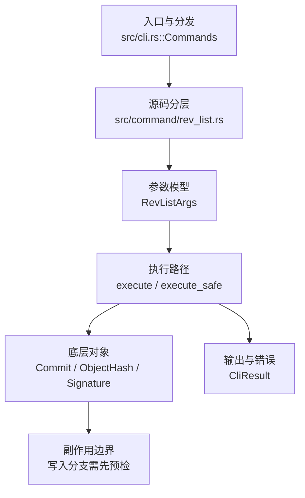

# `libra rev-list` 开发设计

## 命令实现目标

`libra rev-list` 的目标是列出从一个或多个 revision 可达的提交对象。当前实现接受零个或多个 `[SPEC]`（缺省 `HEAD`），支持多 revision union、`^` 排除、`A..B` / `A...B` 范围，并按提交时间倒序打印可达提交哈希；`--count`、`-n`/`--max-count`、`--skip`、`--since`/`--after`、`--until`/`--before`、`--merges`、`--no-merges`、`--min-parents`、`--max-parents`、`--no-min-parents`、`--no-max-parents`、`--first-parent`、`--author`、`--committer`、`--grep`、`-- <PATH>...` path limitation、`--left-right`、`--left-only`、`--right-only`、`--cherry-pick`、`--cherry-mark`、`--cherry`、`--parents`、`--children`、`--timestamp`、`--reverse`、`--all`、`--date-order`、`--boundary`、`--objects`、`--objects-edge`、`--objects-edge-aggressive`（对象枚举输出）已支持。

## 对比 Git 与兼容性

- 兼容级别：`partial`。多 revision 可达提交列表、`^` 排除、`A..B` / `A...B` 范围、`--count`、`-n`/`--max-count`、`--skip`、committer 时间过滤（`--since`/`--after`、`--until`/`--before`）、父提交数量过滤（`--merges`、`--no-merges`、`--min-parents`、`--max-parents`、`--no-min-parents`、`--no-max-parents`）、`--first-parent`、`--author`、`--committer`、`--grep`、`-- <PATH>...` path limitation、`--left-right`、`--left-only`、`--right-only`、`--cherry-pick`、`--cherry-mark`、`--cherry`、`--parents`、`--children`、`--timestamp`、`--reverse`（先做提交限制再反转输出）、`--all`（以所有 ref 和 HEAD 为起点遍历）、`--date-order`（作为默认 committer-date 顺序的 no-op 接受；与 Git 不同，不在日期偏斜时施加 topo 约束）、`--boundary`（在列出提交之后附加范围排除的边界提交，每个 `-` 前缀）和对象枚举输出 `--objects`/`--objects-edge`/`--objects-edge-aggressive`（在提交/边界流之后列出去重的可达 tree+blob 对象，pre-order，根 tree 空路径；`--objects-edge[-aggressive]` 复用 `--boundary` 前沿作为 `-` 前缀 edge 提交，aggressive 与 edge 同义——有意收窄）已支持。

- 当前矩阵承诺常用 Git 行为已支持；新增语义必须同步矩阵、用户文档和测试。

## 设计方案

- 入口与分发：已公开接入 `src/cli.rs::Commands`；已由 `src/command/mod.rs` 导出。CLI 层在 `src/cli.rs` 把解析后的参数交给命令模块，命令模块负责把领域错误转换为 `CliError` / `CliResult`。
- 源码分层：入口与参数仍在 `src/command/rev_list.rs`；输出与帮助文本在 `src/command/rev_list_output.rs`；父提交数量、作者、提交者、message grep、path limitation 和时间过滤在 `src/command/rev_list_filter.rs`；multi-spec/range/exclusion 解析、symmetric-difference side 标记和 first-parent 可达集合在 `src/command/rev_list_spec.rs`；patch-equivalence 标记、`--left-only`/`--right-only` 和 `--cherry-pick`/`--cherry-mark`/`--cherry` 过滤在 `src/command/rev_list_cherry.rs`；`--children` 的 child map 在 `src/command/rev_list_children.rs` 中根据过滤前 traversal 构建。参数/子命令类型包括：`RevListArgs`；输出、错误或状态类型包括：crate 私有的命名输出结构体 `RevListOutput`（包含输入、提交列表、输出格式、作者/提交者/message/path 过滤、side/cherry 过滤、时间过滤、父提交过滤、child 输出、first-parent、limit/skip 等字段，由 `resolve_rev_list` 返回并供 `emit_json_data` 序列化），错误通过 `CliResult` 或上层命令错误统一传播；主要执行函数包括：`execute`、`execute_safe`。
- 执行路径：`execute_safe` 负责 CLI 安全包装、错误映射和输出配置；对象路径会解析 revision 并读写 blob/tree/commit/tag 等对象。

- 流程图：以下流程图按当前源码分层展示主路径和底层对象边界，便于维护者把代码入口、执行函数和副作用范围对应起来。

- 底层操作对象：`Commit`（提交对象、父提交关系和提交消息载荷）；`ObjectHash`（SHA-1/SHA-256 对象 ID 和 revision 解析结果）；`Signature`（作者/提交者/签名时间等提交身份字段）
- 输出与错误契约：人类输出、`--json` / `--machine` 输出和 quiet/verbose 分支必须继续走现有 `OutputConfig` / `emit_json_data` / `CliError` 路径；新增失败模式要补稳定错误码、用户提示和回归测试。
- 副作用边界：凡是写入索引、对象库、refs/HEAD、reflog、SQLite/D1、工作树或远端的路径，都必须先完成参数校验和 dry-run/预检分支，再执行持久化，避免部分写入后静默成功。

## 实现历史

- 本节依据本地 main 分支提交历史重写，筛选与该命令实现、测试或文档路径直接相关的提交；以下是归纳后的实现脉络。
- 2026-05-23 `b3782775`（`feat(rev-list): wire REV_LIST_EXAMPLES into clap after_help (v0.17.828)`）：基础实现节点：wire REV_LIST_EXAMPLES into clap after_help (v0.17.828)；当前实现的主要轮廓可追溯到该提交。
- 2026-06-06 `d288b5f7`（`feat(rev-list): multi-spec, ^/A..B/A...B ranges, -n/--skip/--count, parent filters, --parents/--timestamp`）：该提交曾描述 multi-spec、`^`/`A..B`/`A...B` 范围、父提交过滤、`--parents`/`--timestamp` 等参数；以当前源码为准，这些常用路径已重新落地并由 `tests/command/rev_list_range_test.rs` 与 `tools/integration-runner` 的 `cli.object-readback` 断言覆盖。
- 2026-04-26 `1e60c68c`（`feat(rev): rev-list and rev-parse (#349)`）：功能演进：rev-list and rev-parse (#349)；该节点扩展了当前命令可用的参数或行为。
- 2026-06-16：补齐 Git 兼容输出参数 `--parents` 与 `--timestamp`，人类输出采用 Git 字段顺序，JSON 保持 `commits[]` 为纯提交 ID 并在需要时增加 `entries[]` 元数据。
- 2026-06-16：补齐 Git 兼容父提交数量过滤 `--merges`、`--no-merges`、`--min-parents`、`--max-parents`；过滤在 `--skip`、`--max-count` 和 `--count` 前应用，`--merges --no-merges` 按交集语义返回空结果。
- 2026-06-17：补齐多 revision、`^` exclusion、`A..B`、`A...B` 和 `--no-min-parents` / `--no-max-parents`；`RevListArgs` 改为接收 `specs: Vec<String>`，JSON 新增 `inputs[]` 与 reset alias 布尔字段。
- 2026-06-17：补齐 committer 时间过滤 `--since`/`--after` 与 `--until`/`--before`；沿用 `internal::log::date_parser::parse_date`，支持 `YYYY-MM-DD`、RFC3339、Unix timestamp 和相对时间表达式。
- 2026-06-17：补齐 first-parent traversal `--first-parent`；merge 提交只沿第一个父提交继续遍历，JSON 新增 `first_parent` 布尔字段。
- 2026-06-17：补齐作者过滤 `--author <PATTERN>`；按 author `name <email>` 做大小写不敏感包含匹配，JSON 新增 `author` 回显字段。
- 2026-06-17：补齐提交者过滤 `--committer <PATTERN>`；按 committer `name <email>` 做大小写不敏感包含匹配，JSON 新增 `committer` 回显字段。
- 2026-06-17：补齐 message grep 过滤 `--grep <PATTERN>`；支持重复参数 OR 语义和大小写敏感正则匹配，无效正则返回 `LBR-CLI-002`，JSON 新增 `grep[]` 回显字段。
- 2026-06-17：补齐 path limitation `rev-list <rev> -- <PATH>...`；按提交相对父提交的路径变化过滤提交，支持文件和目录 pathspec，JSON 新增 `pathspecs[]` 回显字段。
- 2026-06-17：补齐 symmetric-difference side/cherry 过滤 `--left-right`、`--left-only`、`--right-only`、`--cherry-pick`、`--cherry-mark`；`A...B` 记录左右侧元数据，patch-equivalence 以提交相对第一父提交的归一化 diff 签名计算，JSON 新增 `left_right`、`left_only`、`right_only`、`cherry_pick`、`cherry_mark`、`entries[].side`、`entries[].cherry_equivalent` 和 count-only 场景的 `count_fields[]`。
- 2026-06-17：补齐 Git 兼容 `--cherry` 简写；按 `--right-only --cherry-mark --no-merges` 组合语义保留右侧提交，等价提交用 `=`，唯一右侧提交在普通 `--cherry` 下用 `+`、在 `--left-right --cherry` 下用 `>`，JSON 新增 `cherry` 回显字段。
- 2026-06-17：补齐 Git 兼容 `--children` 输出；child map 在 path/message/parent-count/time/side/cherry 过滤以及 `--skip` / `--max-count` 前根据 traversal 构建，`--parents` 与 `--children` 在 clap 层互斥，JSON 新增 `children` 回显字段和 `entries[].children[]` 元数据。
- 历史结论：当前文档应以这些提交之后的代码、测试和兼容矩阵为准；更早的迁移式文档只保留为背景，不再作为事实来源。

## 当前状态

- 公开状态：已公开；模块状态：已导出。
- 用户文档：`docs/commands/rev-list.md`。
- Synopsis：`libra rev-list [OPTIONS] [SPEC]... [-- <PATH>...]`。
- 公开参数/子命令包括：`-n, --max-count <N>`、`--skip <N>`、`--reverse`、`--all`、`--date-order`、`--count`、`--since <DATE>` / `--after <DATE>`、`--until <DATE>` / `--before <DATE>`、`--merges`、`--no-merges`、`--min-parents <N>`、`--max-parents <N>`、`--no-min-parents`、`--no-max-parents`、`--first-parent`、`--author <PATTERN>`、`--committer <PATTERN>`、`--grep <PATTERN>`、`--left-right`、`--left-only`、`--right-only`、`--cherry-pick`、`--cherry-mark`、`--cherry`、`-- <PATH>...`、`--parents`、`--children`、`--timestamp`、`--boundary`（边界提交，`-` 前缀，置于列出提交之后；`compute_boundary_entries` 从最终输出集取「父提交不在输出集」者，按 `--parents`/`--timestamp` 元数据经同一 formatter 渲染）、`--objects`、`--objects-edge`、`--objects-edge-aggressive`（对象枚举输出：在提交/边界流后列出去重的可达 tree+blob，pre-order，根 tree 空路径；edge 变体复用边界前沿为 `-` 前缀 edge 提交）、`[SPEC]...`（可选定位参数，缺省为 `HEAD`；支持多 revision、`^` 排除、`A..B` 和 `A...B`）；`--json` / `--quiet` 为全局参数，不在 `RevListArgs` 内本地声明。

## 还未实现的功能

| 类别 | 未完成项 | 当前处理 |
|---|---|---|
| ✅ 边界输出 | `--boundary`（在列出提交之后附加边界提交——被列出提交的、未被列出的父提交，每个以 `-` 前缀）已实现，带集成测试 `test_rev_list_boundary`。`compute_boundary_entries` 从**最终输出集**（经 `--skip`/`--max-count`/过滤之后）计算：取每个列出提交的全部父提交中不在输出集者，load 后按 committer 日期降序、id tiebreak，并按 `--parents`/`--children`/`--timestamp` 填充元数据，经同一 formatter 渲染（`-` 前缀）。这与 git「返回提交的父提交但自身未被返回」规则一致：`--max-count` 给出切割点父提交而非范围起点；`--first-parent` 的效果来自更小的输出集（合并的第二父仍按 git 行为标为边界）；`--reverse` 反转**整个**输出流（列出+边界），故边界提交置于最前；`--children` 下边界提交的子提交从最终输出集派生（遍历 children map 不含被排除父，故单独计算，按输出逆序匹配 git 顺序）；`--first-parent --parents` 下未被遍历的第二父边界做 parent-rewriting（裸 `-id`，仅 first-parent 链边界保留父）；`--count` **计入**边界（落入第一/total 字段）。 | 与 git 一致（经差分验证 range/`--max-count`/`--first-parent`/`--reverse`/`--timestamp`/`--parents`/`--children`/`--count`；多子边界的排序受 libra date-order 与 git topo-order 既有差异影响）。 |
| ✅ 对象遍历输出 | `--objects`、`--objects-edge`、`--objects-edge-aggressive` 已实现，git-faithful。`collect_rev_list_objects`/`collect_tree_objects` 对每个打印提交的根 tree 做 pre-order 递归（先 emit tree 本身再按 tree 顺序遍历条目，遇子 tree 立即递归），全局 `HashSet<ObjectHash>` 去重；输出 `RevListObject{oid,path}`，根 tree 空路径渲染为 `<oid> `（尾随空格），命名对象 `<oid> <path>`，对象行跟在提交/边界流之后且不受 `--reverse` 重排。**排除闭包**：从 `RevListSelection.excluded`（`^spec`/range start/`...` merge base 的**完整可达闭包**，仅显式排除——`--max-count`/`--skip`/filter 省略的提交不在其中，故不会误抑制其对象）逐个 `seed_uninteresting_objects` 把 tree 闭包灌入 `seen`（不 emit），故范围只列出包含侧新增对象。`seed_uninteresting_tree` **先 load 再 insert**：无法 load 的 tree 不标 seen（否则会掩盖包含侧的同一损坏 tree，使其静默截断而非报错）；对缺失对象容忍（浅克隆边界）。**pathspec**：`pathspec_matches`/`pathspec_descend_tree` 把遍历裁剪到通往 pathspec 的 tree + 其下全部内容（根 tree 始终保留）；pathspecs 经 `util::to_workdir_path` 归一化（与 commit 过滤一致，`./src`→`src`）。`ObjectWalk` 分离 `emitted`（每 oid 只输出一次）与 `fully_walked`（整棵子树已覆盖才剪枝遍历）——避免共享子树在窄 pathspec 下被部分遍历后、在更宽 pathspec 路径处被错误剪枝（见 `_shared_subtree_mixed_pathspecs`）。**gitlink**：`TreeItemMode::Commit` 跳过。**损坏**：包含侧 tree load 失败→硬错误 `LBR-REPO-002`（不静默截断）。`--objects-edge[-aggressive]` 复用 `compute_boundary_entries` 前沿作为 `-` 前缀 edge 提交；aggressive 与 edge 同义（git 的 aggressive thin-pack edge 扩展无 pack-objects 消费者，有意收窄）。`--count --objects` 把对象计入总数（与 `--left-right`/`--cherry-mark`/`--cherry` 同用时拒绝——对象无 side bucket，`execute_safe` 早期 `LBR-CLI-002`，带测试 `test_rev_list_count_objects_rejects_marked_modes`）。`--count` 仅在用户显式 `--boundary` 时计入边界提交；`--objects-edge` 的 `-` edge 标记不计入（git 对 `--objects-edge` 只计 commits+objects），带测试 `test_rev_list_count_objects_edge_excludes_edge_commits`。带集成测试 `test_rev_list_objects_lists_tree_and_blobs`（校验输出形态：commit 行无空格、根 tree `<oid> ` 尾随空格、blob `<oid> <path>`、去重；与 git 的 OID 逐字节一致性为开发期手工核对，测试不调用系统 git）、`_json_contract`、`_edge_marks_boundary`、`_excludes_unchanged_from_range`、`_pathspec_prunes_walk`、`_skips_gitlinks`（crafted Commit-mode 条目）、`_errors_on_corrupt_subtree`（crafted 缺失子 tree）、`_n1_does_not_suppress_parent_objects`（`-n1` 父提交是 filter-omitted 而非 excluded，不抑制其对象）、`test_rev_list_count_objects_includes_objects`。`RevListSelection` 新增 `excluded: HashSet<String>` 字段暴露显式排除闭包。 | 与 git `rev-list --objects` 格式一致（同 fixture 下 tree/blob OID 完全相同，含 range/pathspec 闭包）。 |

## 维护要求

- 改进本命令前，必须先阅读并遵循 [docs/development/commands/_general.md](_general.md)；这是命令设计、实现、测试和文档同步的强制要求。
- 任何行为变更都要先核对实现源码，再同步 `COMPATIBILITY.md`、`docs/commands/<cmd>.md` 和相关测试。
- 新增 Git 兼容参数时必须明确 tier、错误码、JSON/机器输出契约和回归测试。
