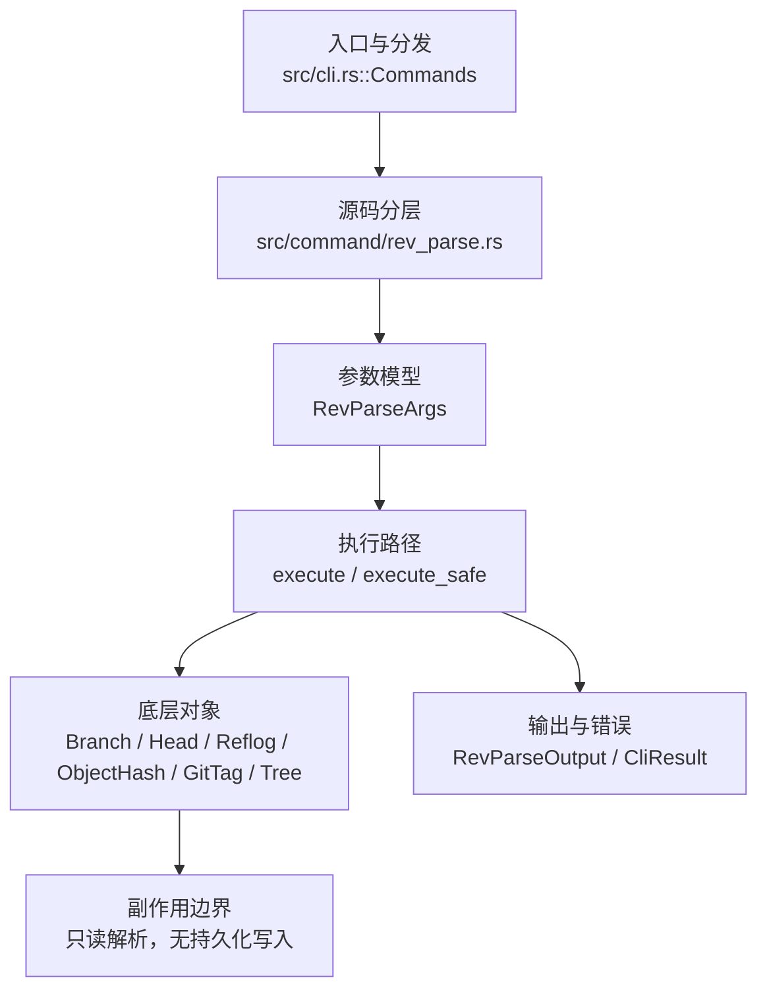

# `libra rev-parse` 开发设计

## 命令实现目标

`libra rev-parse` 的目标是解析和规范化 revision 名称、对象 ID 与仓库路径。实现需要支持 `--short`、`--abbrev-ref`、`--show-toplevel` 以及默认 `HEAD` fallback 和错误码，使脚本可以可靠地区分解析失败与使用错误。

## 对比 Git 与兼容性

- 兼容级别：`partial`。共享严格对象解析器支持 branch/tag/remote/full ref、`@`、`^N`/`~N`、`^{commit|tree|blob|tag|object}`、递归 `^{}`、数字 reflog selector（`HEAD@{N}`/`@{N}`/`branch@{N}`）和 `REV:path`，并在 SHA-1/SHA-256 仓库按当前 hash kind 校验对象 ID；plain、`--verify`/`--short`、symbolic 模式与输出过滤共用该语义。`--abbrev-ref`、`--symbolic-full-name`、`--symbolic`、`--show-toplevel`、`--default`、`--sq`、仓库状态查询及 `--flags`/`--no-flags`/`--revs-only`/`--no-revs` 已支持；日期 reflog selector、`@{-N}`、`@{upstream}`/`@{push}`、相对 tree path、`--abbrev=<n>` 与 parseopt 子模式尚未公开。

- 当前矩阵承诺常用 Git 行为已支持；新增语义必须同步矩阵、用户文档和测试。

## 设计方案

- 入口与分发：已公开接入 `src/cli.rs::Commands`；已由 `src/command/mod.rs` 导出。CLI 层在 `src/cli.rs` 把解析后的参数交给命令模块，命令模块负责把领域错误转换为 `CliError` / `CliResult`。
- 源码分层：主要实现文件为 `src/command/rev_parse.rs`。参数/子命令类型包括：`RevParseArgs`；输出、错误或状态类型包括：模块私有的输出结构体 `RevParseOutput`（`mode` / `input` / `value`），错误通过 `CliError` / `CliResult` 统一传播；主要执行函数包括：`execute`、`execute_safe`。
- 执行路径：`execute_safe` 负责 CLI 安全包装、错误映射和输出配置；对象路径委托 `utils::util::resolve_object_spec_typed`，严格消费整个 spec、读取 refs/HEAD/数字 reflog、递归 peel tag/commit/tree 并遍历 `REV:path`；`--verify`/`--short` 额外验证最终对象存在。命令只读对象库、SQLite refs/HEAD/reflog 与配置，不写对象或引用。

- 流程图：以下流程图按当前源码分层展示主路径和底层对象边界，便于维护者把代码入口、执行函数和副作用范围对应起来。

- 底层操作对象：`Branch` / branch store（SQLite refs 查询）；`Head`（HEAD 指向、当前分支和 detached 状态）；`Reflog`（数字 selector，按 timestamp/id 倒序）；`ObjectHash`（SHA-1/SHA-256 对象 ID）；`Commit`/`GitTag`/`Tree`（parent、typed peel 与 path 遍历）；`ConfigKv`（只读配置查询）。
- 输出与错误契约：人类输出、`--json` / `--machine` 输出和 quiet/verbose 分支必须继续走现有 `OutputConfig` / `emit_json_data` / `CliError` 路径；新增失败模式要补稳定错误码、用户提示和回归测试。
- 副作用边界：凡是写入索引、对象库、refs/HEAD、reflog、SQLite/D1、工作树或远端的路径，都必须先完成参数校验和 dry-run/预检分支，再执行持久化，避免部分写入后静默成功。

## 实现历史

- 本节依据本地 main 分支提交历史重写，筛选与该命令实现、测试或文档路径直接相关的提交；以下是归纳后的实现脉络。
- 2026-05-23 `d291ad12`（`feat(rev-parse): wire REV_PARSE_EXAMPLES into clap after_help (v0.17.827)`）：基础实现节点：wire REV_PARSE_EXAMPLES into clap after_help (v0.17.827)；当前实现的主要轮廓可追溯到该提交。
- 2026-06-06 `5245812d`（`feat(rev-parse): add --verify (exit 128, -q→1) and --default revision fallback`）：当前 `RevParseArgs` 已公开 `--verify`（单对象断言，失败 128，全局 `-q`→静默退 1）与 `--default <ARG>`（无 SPEC 时的回落 revision）；以现行源码为准。
- 2026-04-26 `1e60c68c`（`feat(rev): rev-list and rev-parse (#349)`）：功能演进：rev-list and rev-parse (#349)；该节点扩展了当前命令可用的参数或行为。
- 2026-07-09 P0-03：新增 `--is-shallow-repository`，只读 `.libra/shallow` 并在存在非空 shallow boundary 时打印 `true`，否则 `false`；测试 `compat_clone_shallow_integrity::rev_parse_reports_shallow_repository_boolean`。
- 2026-07-14 P1-09：新增共享严格 revision/object resolver，覆盖 `@`、数字 reflog selector、typed/recursive peel、完整 tag ref、`REV:path` 与 SHA-256；`cat-file`/`read-tree`/`commit-tree` 和 commit-ish 消费者共用同一错误分类，回归目标为 `compat_rev_parse_peel_selectors`。
- 历史结论：当前文档应以这些提交之后的代码、测试和兼容矩阵为准；更早的迁移式文档只保留为背景，不再作为事实来源。

## 当前状态

- 公开状态：已公开；模块状态：已导出。
- 用户文档：`docs/commands/rev-parse.md`。
- Synopsis：`libra rev-parse [OPTIONS] [SPEC]...`。
- 公开参数/子命令包括：`--short[=<n>]`、`--abbrev-ref`、`--symbolic-full-name`、`--symbolic`、`--flags`/`--no-flags`/`--revs-only`/`--no-revs`（输出过滤模式）、`--show-toplevel`、`--show-prefix`、`--show-cdup`、`--verify`、`--default <ARG>`、`--sq`、`--is-inside-work-tree`、`--is-inside-git-dir`、`--is-bare-repository`、`--is-shallow-repository`、`--git-dir`、`--absolute-git-dir`、`[SPEC]...`（位置参数，可多个；缺省为 `HEAD`；可用 `@`、数字 reflog、parent/ancestor、typed/recursive peel 和 `REV:path`）。`--symbolic` 与 `--symbolic-full-name`/`--short`/`--abbrev-ref`/仓库查询模式互斥（clap `conflicts_with_all`，冲突映射为退出 129）。`--sq` 仅对 `resolve`/`short` 模式的对象名做整值单引号 shell 引用（嵌入单引号转义为 `'\''`），仓库查询模式不受影响。
- `--verify`：断言 SPEC 解析为唯一对象，失败退出 128；配合全局 `--quiet`/`-q` 时静默退出 1。`--default <ARG>`：未提供位置 SPEC 时回退到该修订。`--is-inside-work-tree` / `--is-bare-repository` / `--is-shallow-repository` 打印 `true`/`false`；`--is-shallow-repository` 只读 `.libra/shallow`，文件缺失或仅空白行时为 `false`。`--git-dir` 打印 `.libra` 目录路径（Git `$GIT_DIR` 等价；Libra 始终为绝对路径）。`--absolute-git-dir` 复用 `--git-dir` 路径并经 `std::fs::canonicalize` 规范化，保证 Git「canonicalized absolute path」契约（Libra 中两者结果一致）。`--is-inside-git-dir` 在当前目录位于 `.libra` 目录内时打印 `true`，否则 `false`（复用 `util::is_sub_path` 判定 cwd 是否为 `.libra` 的子路径，含相等）。

## 还未实现的功能

| 类别 | 未完成项 | 当前处理 |
|---|---|---|
| ✅ 已实现（仓库状态查询） | `--show-toplevel`、`--show-prefix`、`--show-cdup`、`--is-inside-work-tree`、`--is-inside-git-dir`、`--is-bare-repository`、`--is-shallow-repository`、`--git-dir`、`--absolute-git-dir` 均已支持。 | `--is-inside-git-dir` 带单元测试与集成测试（worktree→`false`，`.libra` 内→`true`）；`--absolute-git-dir` 带集成测试（绝对路径、以 `.libra` 结尾、与 `--git-dir` 一致、与 `--git-dir` 互斥）；`--is-shallow-repository` 由 `compat_clone_shallow_integrity` 覆盖 false/true。 |
| ✅ 已实现（symbolic 模式） | `--symbolic-full-name` 展开 ref 名；`--symbolic` 对可解析 spec 原样回显。两者的有效性门控共用严格 resolver，接受 `@`、typed peel、完整 ref 导航、tree/blob/tag 对象和 `REV:path`。 | 不可解析 spec 仍在 stderr 报错并退出 128，而 Git 部分模式会把原始 spec 回显到 stdout；这是既有有意差异。 |
| ✅ 已实现（输出过滤） | `--flags`/`--no-flags`/`--revs-only`/`--no-revs` 用 `resolve_object_spec_typed` 分类任意类型对象 revision；`--` 后一律为 path，读失败/引用损坏会上抛。 | 已知选项必须位于位置 SPEC 之前；`--verify`/`--short` 与过滤标志组合以 LBR-CLI-002 拒绝；无参数 `--verify`/`--short` 仍默认 HEAD。 |
| revision selector（仍缺口） | 日期 reflog selector、`@{-N}`、`@{upstream}`/`@{push}`、相对 tree path（`./`/`../`）尚未实现。 | 数字 reflog selector、`@`、parent/ancestor、typed/recursive peel 与仓库根 `REV:path` 已由 `compat_rev_parse_peel_selectors` 覆盖。 |
| 输出过滤（仍缺口） | Git `--abbrev=<n>` 输出选项与 parseopt 子模式。（`--short[=<n>]`、`--sq`、`--abbrev-ref`、`--symbolic-full-name`、`--symbolic`、`--flags`/`--no-flags`/`--revs-only`/`--no-revs` 已实现，不再列为缺口。） | 后续以新增测试、兼容矩阵或用户命令文档变更为准。 |
| 参数解析模式 | Git `--parseopt`、`--keep-dashdash`、`--stuck-long`、`--sq-quote` 等 `--parseopt` 子模式；当前未实现。 | 后续以新增测试、兼容矩阵或用户命令文档变更为准。 |

## 维护要求

- 改进本命令前，必须先阅读并遵循 [docs/development/commands/_general.md](_general.md)；这是命令设计、实现、测试和文档同步的强制要求。
- 任何行为变更都要先核对实现源码，再同步 `COMPATIBILITY.md`、`docs/commands/<cmd>.md` 和相关测试。
- 新增 Git 兼容参数时必须明确 tier、错误码、JSON/机器输出契约和回归测试。
