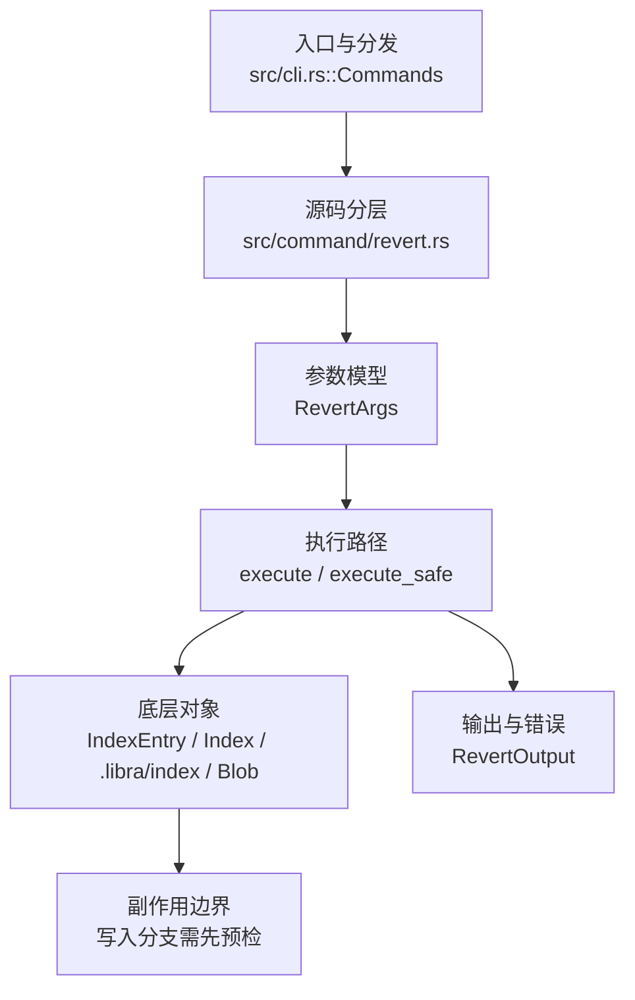

# `libra revert` 开发设计

## 命令实现目标

`libra revert` 的目标是生成抵消已有提交的反向变更，并保留冲突处理和提交控制的清晰边界。当前实现支持单/多提交、mainline、no-commit、冲突 sequencer、可重复 last-wins 的 `-X/--strategy-option ours|theirs`，以及 `--cleanup=<strip|whitespace|verbatim|scissors|default>`。`-X` 复用 merge 的 hunk resolver，只偏向重叠 region并保留 clean inverse hunk；cleanup 与 favor 都进入 `RevertState`，可跨 conflict→continue。自动提交使用当前 author/committer，并从去签名正文生成 subject。自定义 `--strategy` 仍未实现。

## 对比 Git 与兼容性

- 兼容级别：`partial`。既有 revert surface、`-X ours/theirs`、`--cleanup=<mode>` 与冲突 sequencer 已支持；favor/cleanup/edit/remaining 队列均在 fsynced `RevertState` 中向后兼容持久化。`--rerere-autoupdate` 与自定义 `--strategy` 尚未公开。

- 当前矩阵承诺常用 Git 行为已支持；新增语义必须同步矩阵、用户文档和测试。

## 设计方案

- 入口与分发：已公开接入 `src/cli.rs::Commands`；已由 `src/command/mod.rs` 导出。CLI 层在 `src/cli.rs` 把解析后的参数交给命令模块，命令模块负责把领域错误转换为 `CliError` / `CliResult`。
- 源码分层：主要实现文件为 `src/command/revert.rs`。参数/子命令类型包括：`RevertArgs`；输出、错误或状态类型包括：`RevertOutput`；主要执行函数包括：`execute`、`execute_safe`。
- 执行路径：`execute_safe` 负责 CLI 安全包装、错误映射和输出配置；索引路径会加载、比较、刷新或保存 `.libra/index`；对象路径会解析 revision 并读写 blob/tree/commit/tag 等对象；引用路径会读取或更新 SQLite refs、HEAD 与 reflog。

- 流程图：以下流程图按当前源码分层展示主路径和底层对象边界，便于维护者把代码入口、执行函数和副作用范围对应起来。

- 底层操作对象：`IndexEntry`（索引条目，承载路径、mode、object id 和 stat 元数据）；`Index` / `.libra/index`（暂存区状态、路径条目和刷新/保存边界）；`Blob`（文件内容或 LFS pointer 写入对象库后的 blob 对象）；`Commit`（提交对象、父提交关系和提交消息载荷）；`TreeItem` / `TreeItemMode`（tree 中的路径项和 mode）；`Tree`（由索引或对象遍历生成的目录树对象）；`Branch` / branch store（SQLite refs 上的分支读写、过滤和上游关系）；`Head`（SQLite 中的 HEAD 指向、当前分支和 detached 状态）；`ObjectHash`（SHA-1/SHA-256 对象 ID 和 revision 解析结果）
- 输出与错误契约：人类输出、`--json` / `--machine` 输出和 quiet/verbose 分支必须继续走现有 `OutputConfig` / `emit_json_data` / `CliError` 路径；新增失败模式要补稳定错误码、用户提示和回归测试。
- 副作用边界：凡是写入索引、对象库、refs/HEAD、reflog、SQLite/D1、工作树或远端的路径，都必须先完成参数校验和 dry-run/预检分支，再执行持久化，避免部分写入后静默成功。

## 实现历史

- 本节依据本地 main 分支提交历史重写，筛选与该命令实现、测试或文档路径直接相关的提交；以下是归纳后的实现脉络。
- 基础实现节点：当前 HEAD 支持单父提交的反向变更（`<commit>` + `-n/--no-commit`），并通过 `revert_single_commit` 中的 mainline 选择逻辑支持 merge commit revert（`-m/--mainline`）。
- 2026-05-21 `752c516f`（`test(revert): pin RevertError Display + stable_code surfaces (v0.17.703)`）：测试契约：pin RevertError Display + stable_code surfaces (v0.17.703)；相关行为已有回归守卫，后续变更需要继续满足。
- 2026-06-18：恢复 `-m/--mainline` merge commit revert（原始内容由一次 reconcile 丢弃，仅遗留提交消息），重新应用 `b5af38a` 的源码、错误变体（`MainlineRequired` / `MainlineForNonMerge` / `InvalidMainline`，全部 exit 128）、测试与文档。
- 历史结论：当前文档应以这些提交之后的代码、测试和兼容矩阵为准；更早的迁移式文档只保留为背景，不再作为事实来源。

## 当前状态

- 公开状态：已公开；模块状态：已导出。
- 用户文档：`docs/commands/revert.md`。
- Synopsis 在既有 surface 上新增 `[-X <ours|theirs>] [--cleanup=<mode>]`。
- 公开参数新增可重复 `-X/--strategy-option <ours|theirs>`（last-wins）与 `--cleanup=<mode>`；前者经 `merge::merge_bytes_with_favor` 做 hunk-level 偏向，后者复用 commit cleanup parser，并在任何 sequencer action 前校验。两者随 `RevertState` 续作。
- **冲突 sequencer**：`three_way_revert_blob` 使用 base=被 revert blob / ours=当前 / theirs=选定 parent；无 `-X` 时重叠区域写 marker，有 `-X` 时共享 hunk resolver。`RevertState` 通过 atomic+fsynced JSON 保存 orig/reverted/signoff/edit/cleanup/strategy_option/remaining/conflicted paths；`--continue`/`--skip` 续作保持相同策略。
- apply、root revert、`--skip`/`--abort` 恢复路径都对不可读/损坏的 index fail-closed（`LBR-REPO-002`），不会再把 load failure 当作空 index 后覆盖工作树；state 保留供修复后重试。

## 还未实现的功能

| 类别 | 未完成项 | 当前处理 |
|---|---|---|
| ✅ 已实现 | `-e`/`--edit` 与 `--no-edit` | `--edit` 在默认 `Revert "<subject>"` 消息上打开编辑器（`edit_revert_message`：`editor::resolve_editor` 解析 `$GIT_EDITOR`/`core.editor`/`$VISUAL`/`$EDITOR`，`editor::edit_message` 打开，结果剥离 `#` 注释行 + trim，空→`EmptyMessage`，无编辑器→`Editor` 错误，均 129）；编辑在 `resolve_revert_message`（默认消息→`edit_revert_message`）中**在改动工作树之前**完成（`create_revert_commit`/`create_empty_revert_commit` 只接收最终消息），故编辑器失败/空消息不会留下半应用的 revert；直接路径用 `args.edit`、`--continue` 经 `RevertState.edit`（`#[serde(default)]`，向后兼容）、root 路径用 `resolve_root_revert_message`。与 git 不同 Libra revert 默认不打开编辑器，`--edit` 为 opt-in，与 `--no-edit`（默认行为的 no-op）`conflicts_with` 互斥。带集成测试 `test_revert_edit_opens_editor`（`core.editor` 脚本改写消息 + `--edit --no-edit` 冲突）。 |
| ✅ 已实现 | `--no-rerere-autoupdate` | 接受式 no-op：Libra 无 rerere，无可更新（带集成测试 `test_revert_no_rerere_autoupdate_is_accepted_noop`）。Git 的反向 `--rerere-autoupdate` 未公开。 |
| ✅ 已实现 | 编辑消息 `-e`/`--edit` | 见上方 `-e`/`--edit` 与 `--no-edit` 行：在生成消息上打开编辑器（opt-in，与 git 默认不同）。 |
| ✅ 已实现 | Skip 当前 commit | `--skip`：`run_revert_skip` 经 `restore_to_orig_head` 丢弃当前冲突提交后用 `revert_sequence` 续作 `RevertState.remaining`；剩余为空时清理 state 不建提交。与 `--continue`/`--abort` 互斥。带回归测试 `test_revert_skip_continues_with_remaining` / `test_revert_skip_with_nothing_remaining`。 |
| ✅ 已实现 | 多提交冲突自动续作 | 冲突时把剩余提交队列存入 `RevertState.remaining`；`--continue`/`--skip` 经共享 `revert_sequence` 自动续作其余提交（此前剩余提交会被静默丢弃）。带回归测试 `test_revert_continue_drains_remaining_commits`。 |
| ✅ 已实现 | `-X ours/theirs` | 可重复且 last-wins；modify/modify 只偏向冲突 hunk，add/add 与 modify/delete 选择整侧；effective favor 随 `RevertState.strategy_option` 持久化。E2E `revert_strategy_option_is_hunk_level_and_last_wins` 固定 parent/tree。 |
| ✅ 已实现 | `--cleanup=<mode>` | 复用 commit cleanup modes；无 editor 时 default/scissors→whitespace，有 editor 时按 mode 清理；非法值在 control action 前失败；`RevertState.cleanup` 保证 conflict→continue round-trip。E2E `revert_cleanup_survives_conflict_continue` 固定 scissors 截断、parent 与 state cleanup。 |
| ✅ 已实现 | P0-08 identity/subject 保真 | `create_revert_commit` / `create_empty_revert_commit` 不再使用 `Commit::from_tree_id` 的固定 `mega <admin@mega.org>` 身份，而是走 `commit::create_commit_signatures(None, None)`；`build_revert_message` 使用 `parse_commit_msg` 后的首行作为 `Revert "<subject>"`。带 compat 测试 `compat_sequencer_message_author::revert_uses_current_identity_and_strips_signed_subject`。 |
| 兼容差异项 | 策略 | 原始对照：--strategy <s>；相关参数/替代：不适用；当前说明：不支持。 后续实现时需要补对应回归测试并同步兼容矩阵。 |

## 维护要求

- 改进本命令前，必须先阅读并遵循 [docs/development/commands/_general.md](_general.md)；这是命令设计、实现、测试和文档同步的强制要求。
- 任何行为变更都要先核对实现源码，再同步 `COMPATIBILITY.md`、`docs/commands/<cmd>.md` 和相关测试。
- 新增 Git 兼容参数时必须明确 tier、错误码、JSON/机器输出契约和回归测试。
