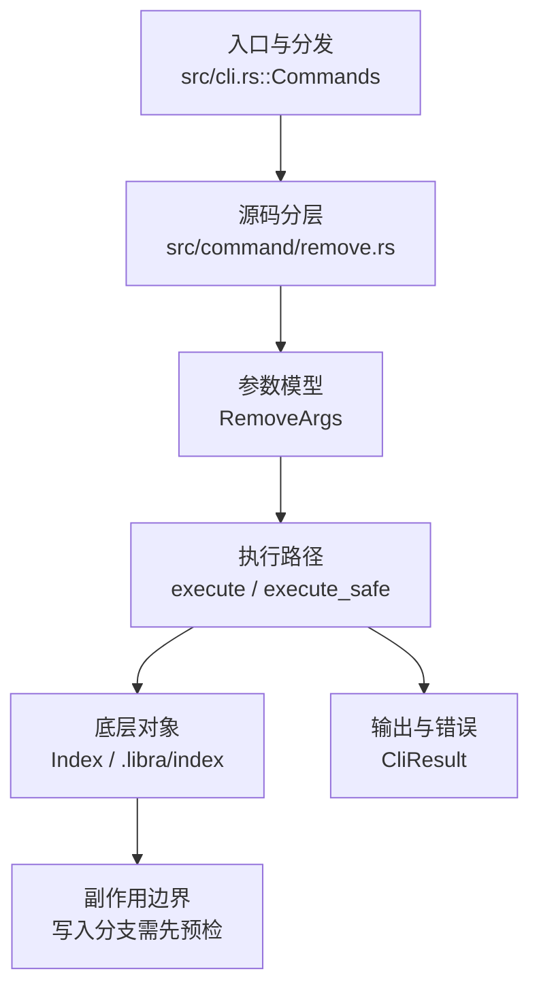

# `libra rm` 开发设计

## 命令实现目标

`libra rm` 的目标是从工作区和索引中删除路径，或在 `--cached` 下仅移出索引。实现需要支持 force、dry-run、recursive、ignore-unmatch、pathspec-from-file 和 NUL pathspec，并在稀疏 checkout 与 quiet 语义上明确差异。

## 对比 Git 与兼容性

- 兼容级别：`partial`。`--force` / `--dry-run` / `--cached` / `--recursive` / `--ignore-unmatch` / `--pathspec-from-file` / `--pathspec-file-nul` supported; shared pathspec magic supported for remove selection; `--sparse` accepted as a no-op (Libra has no sparse-checkout cone); per-command `--quiet` not exposed (use global `--quiet`)

- 当前矩阵明确仍是部分兼容；未覆盖的 Git surface 必须显式列在“还未实现的功能”。

## 设计方案

- 入口与分发：已公开接入 `src/cli.rs::Commands`；已由 `src/command/mod.rs` 导出。CLI 层在 `src/cli.rs` 把解析后的参数交给命令模块，命令模块负责把领域错误转换为 `CliError` / `CliResult`。
- 源码分层：主要实现文件为 `src/command/remove.rs`。参数/子命令类型包括：`RemoveArgs`；输出、错误或状态类型包括：私有输出结构 `RemoveOutput` / `RemovePathOutput` / `RemoveDirectoryOutput`（均 `#[derive(Serialize)]`，构成 `--json` 结构化负载，经 `emit_json_data` 序列化，未导出为 `pub`），未暴露独立错误类型，错误通过 `CliResult` 或上层命令错误统一传播；主要执行函数包括：`execute`、`execute_safe`。
- 执行路径：`execute_safe` 负责 CLI 安全包装、错误映射和输出配置；索引路径会加载、比较、刷新或保存 `.libra/index`。

- 流程图：以下流程图按当前源码分层展示主路径和底层对象边界，便于维护者把代码入口、执行函数和副作用范围对应起来。

- 底层操作对象：`Index` / `.libra/index`（暂存区状态、路径条目和刷新/保存边界）
- 输出与错误契约：人类输出、`--json` / `--machine` 输出和 quiet/verbose 分支必须继续走现有 `OutputConfig` / `emit_json_data` / `CliError` 路径；新增失败模式要补稳定错误码、用户提示和回归测试。
- 副作用边界：凡是写入索引、对象库、refs/HEAD、reflog、SQLite/D1、工作树或远端的路径，都必须先完成参数校验和 dry-run/预检分支，再执行持久化，避免部分写入后静默成功。

## 实现历史

- 本节依据本地 main 分支提交历史重写，筛选与该命令实现、测试或文档路径直接相关的提交；以下是归纳后的实现脉络。
- 2026-01-13 `9d37fd8d`（`feat(rm): support --pathspec-from-file and --pathspec-file-nul (#117)`）：基础实现节点：support --pathspec-from-file and --pathspec-file-nul (#117)；当前实现的主要轮廓可追溯到该提交。
- 2026-05-15 `8d9a89c9`（`feat(commands): structure mv and rm output`）：功能演进：structure mv and rm output；该节点扩展了当前命令可用的参数或行为。
- 2026-06-06 `17e563bb`（`fix(rm): plain piped output, 4-space conflict indent, save index before deleting files`）：实现修正：plain piped output, 4-space conflict indent, save index before deleting files；该节点把边界行为、错误处理或兼容差异纳入当前实现约束。
- 2026-07-09（plan-20260708 P1-01）：`rm`/`remove`/`delete` 的位置 pathspec 与 `--pathspec-from-file` 统一接入 `src/utils/pathspec/`。当前按 tracked index entries 作为删除候选，支持 plain prefix、wildcard、`:(top)`/`:/`、`:(glob)`、`:(literal)`、`:(icase)`、`:(exclude)`、`:!`、`:^`，并按 `core.ignorecase` 作为默认大小写策略；wildcard-looking pattern 仍匹配同名字面路径或目录前缀（Git bracket-file / bracket-directory 行为）；目录递归保护只用正向前缀判定，实际磁盘只删除匹配到的已跟踪文件，并通过 `clear_empty_dir` 清理变空父目录，避免 `:(exclude)` 或未跟踪文件被目录级删除绕过。回归守卫：`compat_pathspec_magic::rm_honors_shared_pathspec_magic`、`compat_pathspec_magic::rm_recursive_preserves_untracked_files_in_matched_directory`。
- 历史结论：当前文档应以这些提交之后的代码、测试和兼容矩阵为准；更早的迁移式文档只保留为背景，不再作为事实来源。

## 当前状态

- 公开状态：已公开；模块状态：已导出。
- 用户文档：`docs/commands/rm.md`。
- Synopsis：`libra rm [-r] [-f] [--cached] [--dry-run] [--ignore-unmatch] [--sparse] [--pathspec-from-file <file> [--pathspec-file-nul]] <pathspec>...`。
- 公开参数/子命令包括：`<pathspec>...`、`--cached`、`-r, --recursive`、`-f, --force`、`--dry-run`、`--ignore-unmatch`、`--sparse`（no-op，Libra 无 sparse-checkout cone）、`--pathspec-from-file <PATHSPEC_FROM_FILE>`、`--pathspec-file-nul`。
- plan-20260708 P1-01 后，删除候选统一由 `PathspecSet::from_workdir_with_default_icase` 编译并过滤 tracked index entries；排除 magic 会从正向集合扣除，`--ignore-unmatch` 只放宽未命中正向规格，不放宽无 pathspec 的用法错误；`-r` 只允许目录 pathspec 展开到已跟踪文件，磁盘清理仍限于删除匹配文件后自然变空的目录。

## 还未实现的功能

| 类别 | 未完成项 | 当前处理 |
|---|---|---|
| 兼容矩阵说明 | `--force` / `--dry-run` / `--cached` / `--recursive` / `--ignore-unmatch` / `--pathspec-from-file` / `--pathspec-file-nul` 支持; shared pathspec magic 已支持; `--sparse` 按 no-op 接受 (Libra 无 sparse-checkout cone); per-command `--quiet` 未公开暴露 (use global `--quiet`) | 按当前兼容矩阵保留；实现状态变化时同步 `_compatibility.md` 和测试证据。 |
| ✅ 已实现 | Shared pathspec magic | 原始对照：git pathspec magic；当前说明：`rm` 位置参数与 `--pathspec-from-file` 条目统一走 `src/utils/pathspec/`，支持 plain prefix、wildcard、`top`/`glob`/`literal`/`icase`/`exclude` 等高价值 magic，并继承 `core.ignorecase`。带 compat 测试 `compat_pathspec_magic::rm_honors_shared_pathspec_magic`。 |

## 维护要求

- 改进本命令前，必须先阅读并遵循 [docs/development/commands/_general.md](_general.md)；这是命令设计、实现、测试和文档同步的强制要求。
- 任何行为变更都要先核对实现源码，再同步 `COMPATIBILITY.md`、`docs/commands/<cmd>.md` 和相关测试。
- 新增 Git 兼容参数时必须明确 tier、错误码、JSON/机器输出契约和回归测试。
