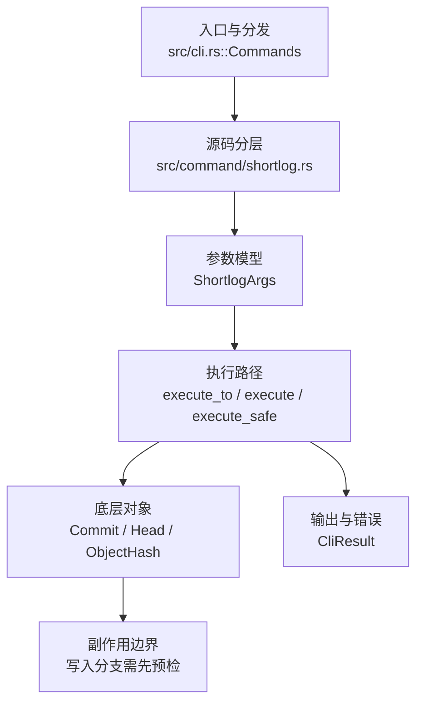

# `libra shortlog` 开发设计

## 命令实现目标

`libra shortlog` 的目标是按作者或提交者汇总提交历史。实现需要支持 committer grouping、`--group=author|committer|trailer:<key>`、`--merges`/`--no-merges`、top 限制、mailmap、范围解析和 JSON 摘要，更复杂过滤作为差异项（`--format`、stdin 管道输入已实现）。

## 对比 Git 与兼容性

- 兼容级别：`partial`。基础 author summary、email、count sorting、时间过滤、单 revision、`-c`/`--committer` 分组、`--group=author|committer|trailer:<key>`（按提交消息 trailer 值分组）、`--merges`/`--no-merges`（互相覆盖）、`--top`/`--min-count`/`--reverse`、`--author` 过滤、`-w[<width>[,<indent1>[,<indent2>]]]` 主题换行（默认 76/6/9；width 0 仅缩进不换行）、`--format <FORMAT>`（复用 `log --format` 的 `CommitFormatter`/`format_custom` 自定义模板渲染每条提交行）、stdin 管道输入（`git log | libra shortlog`：无 revision + 非 tty + 有数据时解析管道 `git log`/`libra log` 输出，medium/fuller 格式，仅作用于分组/显示选项，walk-only 过滤 `--since`/`--until`/`--merges`/`--no-merges`/`--format` 忽略；仍需在 Libra 仓库内运行；空/tty stdin 回落到 HEAD 默认）已支持。

- 当前矩阵承诺常用 Git 行为已支持；新增语义必须同步矩阵、用户文档和测试。

## 设计方案

- 入口与分发：已公开接入 `src/cli.rs::Commands`；已由 `src/command/mod.rs` 导出。CLI 层在 `src/cli.rs` 把解析后的参数交给命令模块，命令模块负责把领域错误转换为 `CliError` / `CliResult`。
- 源码分层：主要实现文件为 `src/command/shortlog.rs`。参数/子命令类型包括：`ShortlogArgs`；输出、错误或状态类型包括：源码未暴露独立公开输出/错误类型，错误通过 `CliResult` 统一传播；主要执行函数包括：`execute_to`、`execute`、`execute_safe`。
- 执行路径：`execute_safe` 负责 CLI 安全包装、错误映射和输出配置；核心领域逻辑集中在 `execute_to`；对象路径会解析 revision 并读写 blob/tree/commit/tag 等对象；引用路径会读取或更新 SQLite refs、HEAD 与 reflog。

- 流程图：以下流程图按当前源码分层展示主路径和底层对象边界，便于维护者把代码入口、执行函数和副作用范围对应起来。

- 底层操作对象：`Commit`（提交对象、父提交关系和提交消息载荷）；`Head`（SQLite 中的 HEAD 指向、当前分支和 detached 状态）；`ObjectHash`（SHA-1/SHA-256 对象 ID 和 revision 解析结果）
- 输出与错误契约：人类输出、`--json` / `--machine` 输出和 quiet/verbose 分支必须继续走现有 `OutputConfig` / `emit_json_data` / `CliError` 路径；新增失败模式要补稳定错误码、用户提示和回归测试。
- 副作用边界：凡是写入索引、对象库、refs/HEAD、reflog、SQLite/D1、工作树或远端的路径，都必须先完成参数校验和 dry-run/预检分支，再执行持久化，避免部分写入后静默成功。

## 实现历史

- 本节依据本地 main 分支提交历史重写，筛选与该命令实现、测试或文档路径直接相关的提交；以下是归纳后的实现脉络。
- 2026-06-06 `cec72108`（`feat(shortlog): add -c/--committer grouping and --no-merges filter`）：新增 `-c`/`--committer`（按 committer 身份分组）与 `--no-merges`（聚合前剔除多父提交）。该内容曾在一次 reconcile 中从工作树丢失，已于 2026-06-18 依据原提交 diff 恢复（含端到端测试与文档）。
- 2026-06-10 `3b170290`（`feat(shortlog): add --top option (#382)`）：新增 `--top`/`--min-count`/`--reverse`（排序后限制/过滤/翻转输出）。同样曾被 reconcile 丢失，已于 2026-06-18 恢复。
- 2026-06-01 `1a7501da`（`test(shortlog): pin json revision summary`）：测试契约：pin json revision summary；相关行为已有回归守卫，后续变更需要继续满足。
- 历史结论：当前文档应以这些提交之后的代码、测试和兼容矩阵为准；更早的迁移式文档只保留为背景，不再作为事实来源。

## 当前状态

- 公开状态：已公开；模块状态：已导出。
- 用户文档：`docs/commands/shortlog.md`。
- Synopsis：`libra shortlog [<revision>] [-n] [-s] [-e] [-c] [--no-merges | --merges] [--since <date>] [--until <date>] [-w[<W>[,<I1>[,<I2>]]]] [--format <FORMAT>]`。
- 公开参数/子命令包括：`-n, --numbered`、`-s, --summary`、`-e, --email`、`-c, --committer`、`--group <TYPE>`（`author`/`committer`/`trailer:<key>`）、`--no-merges`、`--merges`、`--top <N>`、`--min-count <N>`、`--reverse`、`--since <DATE>`、`--until <DATE>`、`--author <PATTERN>`、`-w, --wrap [<W>[,<I1>[,<I2>]]]`、`--format <FORMAT>`、`[<revision>]`。`--merges` 与 `--no-merges` 互为反向且 `overrides_with`（最后给出者生效）：`--no-merges` 保留父数 ≤1，`--merges` 保留父数 ≥2。`-w` 由 `parse_wrap_spec` 解析（默认 76/6/9，缺省组件回落默认值，非法值报 `LBR-CLI-002`），存入 `ShortlogOutput.wrap`（serde skip），渲染时由 `wrap_subject_lines` 对每个主题做词级换行（首行缩进 I1、续行 I2；width 0 仅缩进）。

## 还未实现的功能

| 类别 | 未完成项 | 当前处理 |
|---|---|---|
| ✅ 已实现 | 分组方式 `--group=author\|committer\|trailer:<key>` | `resolve_group_mode` 解析 `--group`（优先于 `-c`）；`trailer:<key>` 经 `extract_trailer_identities` 从消息末段 trailer 块按 key（忽略大小写）提取每个值作为分组（单提交可贡献 0..N 组）。带集成测试（`group_trailer_groups_by_trailer_value`）。 |
| ✅ 已实现 | 格式化输出 `--format=<format>` | `ShortlogArgs.format` + `aggregate_shortlog` 在分组时用 `log` 的 `CommitFormatter::new(FormatType::Custom(fmt))` 渲染每条提交行（取代默认 subject），short-hash 宽度用 `util::get_min_unique_hash_length(&commits).max(7)` 与 `libra log` 对齐；支持 `log --format` 的同一占位符集合（`%H`/`%h`/`%P`/`%p`/`%s`/`%f`/`%b`/`%B`/`%n`/ASCII/control `%xNN`/`%%`/`%an`/`%ae`/`%ad`/`%aI`/`%at`/`%cn`/`%ce`/`%cd`/`%cI`/`%ct`/`%d`/`%D`/`%m`/color placeholders），其中 `%C...` 按 CLI human 输出路径的全局 `--color` 策略启用。渲染行经 split('\n') 后按既有 6 空格缩进 + `-w` 换行路径输出（默认 subject 为单行，故对默认路径是 no-op）。`--summary` 仍优先（仅计数）。带集成测试（`test_shortlog_format_renders_custom_per_commit_line`）与 P1-04 兼容测试 `compat_pretty_format_placeholders::show_and_shortlog_reuse_pretty_placeholder_renderer`。 |
| ✅ 已实现 | 管道输入（stdin） | `run_shortlog` 在 `revision.is_none() && !stdin().is_terminal()` 且读入非空时，用 `parse_shortlog_stdin` 解析 medium/fuller `git log` 输出（`commit ` 分隔记录，`Author:`/`Commit:` 头取身份——`:` 区分 `AuthorDate:`/`CommitDate:`——4 空格缩进行为消息），经 `aggregate_shortlog_stdin` 复用提取出的 `finalize_shortlog`（与 walk 路径共用排序/过滤尾）。`--group=author/committer/trailer`、`-n`/`-s`/`-e`/`--author`/`-w`/`--top`/`--min-count`/`--reverse` 均生效；无 Commit 对象故 `--format` 用解析出的 subject（与 git 一致）、walk-only `--since`/`--until`/`--merges`/`--no-merges` 忽略（与 git 一致）。空/tty stdin 回落到 HEAD（intentionally-different：git 无默认 revision）；仍需在 Libra 仓库内（cli.rs 预检 + execute_safe require_repo）。带集成测试（`test_shortlog_reads_piped_log_input`）。与 walk 输出自洽（`libra log | libra shortlog` == `libra shortlog`，已差分验证 default/-n/-s/-e/--author）。 |
| ✅ 已实现 | 作者过滤 `--author <PATTERN>` | 聚合前按作者 `name <email>` 的大小写不敏感子串过滤（即使配合 `-c` 也按作者过滤）。带 `author_identity_matches` 单元测试。 |
| ✅ 已实现 | 换行宽度 `-w[<width>[,<indent1>[,<indent2>]]]` | `ShortlogArgs.wrap` + `parse_wrap_spec`（默认 76/6/9，width 0 仅缩进）+ `wrap_subject_lines`（词级换行，首行 I1、续行 I2）。带集成测试（`shortlog_wrap_wraps_long_subjects`）。 |

## 维护要求

- 改进本命令前，必须先阅读并遵循 [docs/development/commands/_general.md](_general.md)；这是命令设计、实现、测试和文档同步的强制要求。
- 任何行为变更都要先核对实现源码，再同步 `COMPATIBILITY.md`、`docs/commands/<cmd>.md` 和相关测试。
- 新增 Git 兼容参数时必须明确 tier、错误码、JSON/机器输出契约和回归测试。
