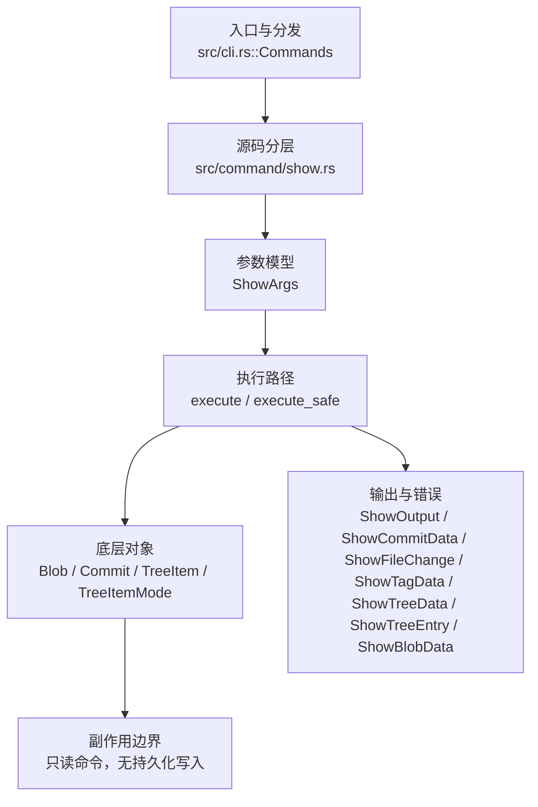

# `libra show` 开发设计

## 命令实现目标

`libra show` 的目标是展示提交、tag、tree 或 blob 对象内容，并按对象类型选择合适的人类可读输出。实现需要处理 annotated tag、pager、diff 文件名展示（`--name-only`）、大文件/二进制摘要和结构化错误。

## 对比 Git 与兼容性

- 兼容级别：`partial`。object/commit display、`--name-only`、`--name-status`、`--raw`、`--stat`、`--patch-with-stat`（先 diffstat 块再完整 patch，Git 对 `-p --stat` 的旧式同义词；复用 `--stat` 的 `show_diffstat` 与默认 patch 渲染）、`--summary`（仅创建/删除文件的 mode 摘要，复用 `generate_diff` 输出并解析 `new file mode`/`deleted file mode`，与 `diff --summary` 同一子集，不做 rename/copy/mode-change 检测）、`--oneline`、`--pretty=<fmt>`、`--format=<fmt>`（`--pretty` 的别名）、`--abbrev-commit`/`--no-abbrev-commit`（切换 header 哈希缩写）和 path filters 已支持；`--pretty` 复用 log 的 `CommitFormatter`（`oneline`/`format:<tmpl>`/`tformat:<tmpl>`/自定义模板 + 命名预设 `short`/`full`/`fuller`/`reference`/`raw`，经 log 的 `FormatType::Preset`，见 log.md）；`medium` 映射默认 Full。`--raw` 选择原始 diff 格式（`:<old-mode> <new-mode> <old-sha> <new-sha> <status>\t<path>`，id 缩写 7 位，与 `--pretty=raw` 预设不同），经 `raw_diff_lines_for_commit` + 纯函数 `build_raw_lines`：从 commit 与首父 tree 的 `get_plain_items_with_mode` 独立构建 mode-aware 变更集（path 排序；两侧 `(mode,id)` 不同即 `M`，故同 blob 的 mode-only 变化也报告，见下方专门行）。

- 当前矩阵承诺常用 Git 行为已支持；新增语义必须同步矩阵、用户文档和测试。

## 设计方案

- 入口与分发：已公开接入 `src/cli.rs::Commands`；已由 `src/command/mod.rs` 导出。CLI 层在 `src/cli.rs` 把解析后的参数交给命令模块，命令模块负责把领域错误转换为 `CliError` / `CliResult`。
- 源码分层：主要实现文件为 `src/command/show.rs`。参数/子命令类型包括：`ShowArgs`；输出、错误或状态类型包括：`ShowOutput`、`ShowCommitData`、`ShowFileChange`、`ShowTagData`、`ShowTreeData`、`ShowTreeEntry`、`ShowBlobData`；主要执行函数包括：`execute`、`execute_safe`。
- 执行路径：`execute_safe` 负责 CLI 安全包装、错误映射和输出配置；对象路径会解析 revision 并读写 blob/tree/commit/tag 等对象；引用路径会读取或更新 SQLite refs、HEAD 与 reflog。

- 流程图：以下流程图按当前源码分层展示主路径和底层对象边界，便于维护者把代码入口、执行函数和副作用范围对应起来。

- 底层操作对象：`Blob`（文件内容或 LFS pointer 写入对象库后的 blob 对象）；`Commit`（提交对象、父提交关系和提交消息载荷）；`TreeItem` / `TreeItemMode`（tree 中的路径项和 mode）；`Tree`（由索引或对象遍历生成的目录树对象）；`Branch` / branch store（SQLite refs 上的分支读写、过滤和上游关系）；`Head`（SQLite 中的 HEAD 指向、当前分支和 detached 状态）；`ClientStorage`（本地/分层对象存储读写入口）；`ObjectHash`（SHA-1/SHA-256 对象 ID 和 revision 解析结果）；`ObjectType`（blob/tree/commit/tag 类型分派）
- 输出与错误契约：人类输出、`--json` / `--machine` 输出和 quiet/verbose 分支必须继续走现有 `OutputConfig` / `emit_json_data` / `CliError` 路径；新增失败模式要补稳定错误码、用户提示和回归测试。
- 副作用边界：凡是写入索引、对象库、refs/HEAD、reflog、SQLite/D1、工作树或远端的路径，都必须先完成参数校验和 dry-run/预检分支，再执行持久化，避免部分写入后静默成功。

## 实现历史

- 本节依据本地 main 分支提交历史重写，筛选与该命令实现、测试或文档路径直接相关的提交；以下是归纳后的实现脉络。
- 2026-06-06 `1593a844`（`feat(show): add --name-status diff display mode`）：新增 `--name-status`（字段 `name_status`），按 `A`/`M`/`D` 状态字母 + tab + 文件名输出。该提交曾在一次 reconcile 中从工作树丢失，已于 2026-06-18 依据原提交 diff 恢复（含两条端到端测试与文档）。
- 2026-05-15 `aaf16f28`（`feat(show): route human output through pager`）：功能演进：route human output through pager；该节点扩展了当前命令可用的参数或行为。
- 2026-06-07 `5a5e5fcb`（`fix(show): summarize large and binary blobs`）：实现修正：summarize large and binary blobs；该节点把边界行为、错误处理或兼容差异纳入当前实现约束。
- 2026-07-09（plan-20260708 P0-06）：stdout 下游提前关闭时经全局入口与 `Pager` 输出层静默正常终止，不打印 panic/backtrace/`Broken pipe` 诊断。回归覆盖：`compat_broken_pipe_output`。
- 2026-07-09（plan-20260708 P1-04）：`show --pretty/--format` 复用扩展后的 `CommitFormatter`，获得 `%b`/`%B`/`%n`/ASCII/control `%xNN`/`%%`/`%aI`/`%cI`/`%at`/`%ct`/`%D`/`%m`/color placeholders；`show -s --format=<tmpl>` 与 Git 逐字节对齐的用例纳入 `compat_pretty_format_placeholders`，`%C...` 颜色占位符按全局 `--color` 策略输出。
- 2026-07-11（plan-20260708 P1-05d）：`show` 与 Git 一样继承 `format.pretty` 和 `log.date`；新增显式 `--date` 覆盖配置。两键复用 `src/command/log/config.rs` 的严格 local→global→system 读取器，配置错误在 pager/对象输出前 fail-closed，JSON schema 与值保持配置免疫。默认 commit/tag 日期改走共享 `format_timestamp_with`，不再由 show 私有 RFC2822 分支绕开日期模式。
- 历史结论：当前文档应以这些提交之后的代码、测试和兼容矩阵为准；更早的迁移式文档只保留为背景，不再作为事实来源。

## 当前状态

- 公开状态：已公开；模块状态：已导出。
- 用户文档：`docs/commands/show.md`。
- Synopsis：`libra show [OPTIONS] [OBJECT] [PATHS]...`。
- 公开参数/子命令包括：`[OBJECT]`、`-s, --no-patch`、`--oneline`、`--pretty <FORMAT>`、`--format <FORMAT>`、`--abbrev-commit`、`--no-abbrev-commit`、`--name-only`、`--name-status`、`--stat`、`--patch-with-stat`（先发 `show_diffstat` 的 diffstat 块、空行、再发默认 patch；置于输出分支链首位，受 `-s`/`--no-patch` 抑制；复用既有 `--stat` 与默认 patch 渲染，与 `show --stat` 的 diffstat 逐字一致）、`--summary`（创建/删除文件的 mode 摘要，复用 `generate_diff` 输出解析，等同 `diff --summary` 子集）、`--no-expand-tabs`/`--no-notes`/`--no-mailmap`/`--no-show-signature`（接受式 no-op：Libra 的 show 从不展开 tab、从不内联显示 notes、从不应用 mailmap、从不内联显示提交签名；四个字段解析后不被读取。Git 的反向 `--expand-tabs`/`--notes`/`--mailmap`/`--show-signature` 未实现）、`[PATHS]...`。`--pretty=<fmt>`/`--format=<fmt>` 经 `parse_pretty_format` + `CommitFormatter` 渲染 commit header（abbrev=7），支持与 `libra log --format` 同源的自定义占位符（含 `%b`/`%B`/`%n`/ASCII/control `%xNN`/`%%`/`%aI`/`%cI`/`%at`/`%ct`/`%D`/`%m`/color）；随后照常输出 diff（`-s` 时仅输出 header）。`--abbrev-commit` 把默认 header 的 `commit <hash>` 缩写为 7 位，`--no-abbrev-commit`（经 clap `overrides_with` 与 `--abbrev-commit` 互为最后一个生效；读 `abbrev_commit` 字段，`no_abbrev_commit` 不直接读取）显示完整（未缩写）哈希，完整哈希为默认故单独为 no-op。

- P1-05 展示默认：commit/tag 人类输出未显式指定格式时读取 `format.pretty`，未显式指定日期时读取 `log.date`；CLI `--oneline`/`--pretty`/`--format` 与新增的 `--date` 始终优先。`medium` 保持默认完整 commit id；tree/blob/`REV:path`、quiet 验证与 JSON 不读取这两项 commit 展示配置。

## 还未实现的功能

| 类别 | 未完成项 | 当前处理 |
|---|---|---|
| ✅ 已实现 | `--pretty`/`--format`（别名）、`--abbrev-commit` 已公开（复用 log 的 `CommitFormatter`/`parse_pretty_format`；`--abbrev-commit` 缩写默认 header 的 commit 哈希，`--no-abbrev-commit` 经 `overrides_with` 撤销得完整哈希）。带集成测试（`show_format_aliases_pretty_and_abbrev_commit_shortens_hash`）。 |
| ✅ 已实现 | `--summary`（创建/删除文件的 mode 摘要）。`format_show_summary` 解析 `generate_diff` 输出里的 `new file mode`/`deleted file mode` 行，渲染 ` create mode <mode> <path>` / ` delete mode <mode> <path>`，与 `diff --summary` 同一子集（不含 rename/copy/mode-change）。带单元测试 `format_show_summary_reports_only_created_and_deleted_files` + 集成测试 `test_show_summary_reports_created_files`。 |
| ✅ 已实现 | `--patch-with-stat`（先 diffstat 块、空行、再完整 patch，Git 对 `-p --stat` 的旧式同义词）已实现，带集成测试 `test_show_patch_with_stat_emits_stat_then_patch`（断言 stat 在 patch 之前、含 `diff --git`、diffstat 块与 `show --stat` 逐字一致）。 | 复用既有 `show_diffstat` + 默认 patch，故 diffstat 的格式/计数与 `show --stat` 一致（其与 git 的既有差异不在本项范围内）。 |
| ✅ 已实现 | `--raw` diff 格式 | `raw_diff_lines_for_commit` 渲染 `:<old-mode> <new-mode> <old-sha> <new-sha> <status>\t<path>`：从 commit 与首父 tree 的 `get_plain_items_with_mode` 各建 `BTreeMap<path,(mode,id)>`，纯函数 `build_raw_lines` 取两侧路径并集（path 排序）分类——仅在 new=Added、仅在 old=Deleted、两侧 `(mode,id)` 不同=Modified（**mode-aware**：同 blob 但 mode 变化也算 M，与 git 一致，可达于从 Git 导入的历史；libra 自身 `add` 暂不追踪已跟踪文件的 mode-only 变化）。mode 用 `TreeItemMode::to_bytes`，id 缩写 7，缺失侧填 `000000`/`0000000`，pathspec 经 `is_sub_path` 过滤。与 git 差分验证 modify(100644)/add(100755 可执行)/delete 一致；`build_raw_lines` 含 mode-only 单元测试，集成测试 `test_show_raw_diff_format`。（命名 pretty 预设见 log.md。） |

## 维护要求

- 改进本命令前，必须先阅读并遵循 [docs/development/commands/_general.md](_general.md)；这是命令设计、实现、测试和文档同步的强制要求。
- 任何行为变更都要先核对实现源码，再同步 `COMPATIBILITY.md`、`docs/commands/<cmd>.md` 和相关测试。
- 新增 Git 兼容参数时必须明确 tier、错误码、JSON/机器输出契约和回归测试。
