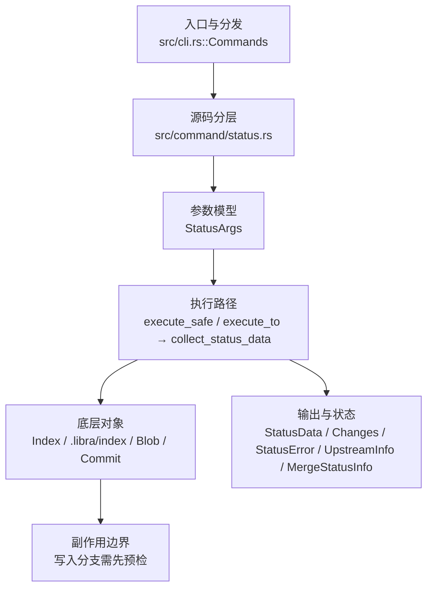

# `libra status` 开发设计

## 命令实现目标

`libra status` 的目标是展示工作区和索引状态，并支持 porcelain v1/v2、untracked/ignored 模式、结构化输出、`-z` NUL 终止输出、`--find-renames` 及 `--renames`/`--no-renames` 重命名检测开关、`--column`/`--no-column` 列对齐开关，以及 `--ahead-behind` 上游计数控制。

## 对比 Git 与兼容性

- 兼容级别：`supported`。

- 当前矩阵承诺常用 Git 行为已支持；`-z`、`--find-renames`、`--renames`/`--no-renames`、`--column`/`--no-column`、`--ahead-behind`/`--no-ahead-behind` 已补齐。新增语义必须同步矩阵、用户文档和测试。

## 设计方案

- 入口与分发：已公开接入 `src/cli.rs::Commands`；已由 `src/command/mod.rs` 导出。CLI 层在 `src/cli.rs` 把解析后的参数交给命令模块，命令模块负责把领域错误转换为 `CliError` / `CliResult`。
- 源码分层：主要实现文件为 `src/command/status.rs`。参数/子命令类型包括：`StatusArgs`、`PorcelainVersion`、`UntrackedFiles`；输出、错误或状态类型包括：`StatusData`（所有渲染器共享的中心数据结构，承载 staged/unstaged/unmerged/ignored/stash/upstream/merge_state/porcelain_v2 字段，模块内可见）、`Changes`、`StatusError`、`UpstreamInfo`、`MergeStatusInfo`；核心数据函数为 `collect_status_data`，辅助执行函数包括：`execute`、`execute_safe`、`execute_to`、`changes_to_be_committed_safe`、`changes_to_be_staged_split_safe`。
- 源码意图：源码模块注释说明该命令结合 ignore 策略计算 staged/unstaged/untracked 集合，并输出简洁摘要或结构化状态。
- 执行路径：`execute_safe`、`execute_to`、`collect_status_json_envelope_for_api` 三个入口都立即委托给共享数据核心 `collect_status_data(args) -> CliResult<StatusData>`（`src/command/status.rs:259`）；`execute_to` 是薄封装，先调用 `collect_status_data` 再调用 `render_status_to_writer`。索引路径会加载、比较并刷新 `.libra/index`（只读，不回写）；对象路径会解析 revision 并读取 blob/tree/commit 等对象；引用路径只读取 SQLite refs 与 HEAD（不更新 refs/HEAD，也不写 reflog）；本命令为只读，不通过 SeaORM/SQLite 或 D1 客户端持久化元数据。

- 流程图：以下流程图按当前源码分层展示主路径和底层对象边界，便于维护者把代码入口、执行函数和副作用范围对应起来。

- 底层操作对象：`Index` / `.libra/index`（暂存区状态、路径条目和刷新/保存边界）；`Blob`（文件内容或 LFS pointer 写入对象库后的 blob 对象）；`Commit`（提交对象、父提交关系和提交消息载荷）；`TreeItem` / `TreeItemMode`（tree 中的路径项和 mode）；`Tree`（由索引或对象遍历生成的目录树对象）；`Branch` / branch store（SQLite refs 上的分支读写、过滤和上游关系）；`Head`（SQLite 中的 HEAD 指向、当前分支和 detached 状态）；SeaORM / `.libra/libra.db`（配置、refs、reflog、AI/发布元数据等 SQLite 表）；`ObjectHash`（SHA-1/SHA-256 对象 ID 和 revision 解析结果）；`ConfigKv`（配置键值持久化行）
- 输出与错误契约：人类输出、`--json` / `--machine` 输出和 quiet/verbose 分支必须继续走现有 `OutputConfig` / `emit_json_data` / `CliError` 路径；新增失败模式要补稳定错误码、用户提示和回归测试。
- 副作用边界：凡是写入索引、对象库、refs/HEAD、reflog、SQLite/D1、工作树或远端的路径，都必须先完成参数校验和 dry-run/预检分支，再执行持久化，避免部分写入后静默成功。

## 实现历史

- 本节依据本地 main 分支提交历史重写，筛选与该命令实现、测试或文档路径直接相关的提交；以下是归纳后的实现脉络。
- 2025-11-11 `926b2c38`（`Add --ignored arg for libra status (#35)`）：基础实现节点：Add --ignored arg for libra status (#35)；当前实现的主要轮廓可追溯到该提交。
- 2026-06-06 `7d985dec`（`feat(status): add -z NUL-terminated porcelain output (implies v1)`）：当前 HEAD 已保留 `-z` / `--null` NUL-terminated 输出，`StatusArgs::null_terminated` 贯穿 short/porcelain 渲染路径；该能力不再作为缺口处理。
- 2025-12-10 `22ecce78`（`feat(status): support --porcelain=v2 and --untracked-files modes (#78) (#82)`）：功能演进：support --porcelain=v2 and --untracked-files modes (#78) (#82)；该节点扩展了当前命令可用的参数或行为。
- 2026-05-17 `f5351224`（`docs(status): correct porcelain-v2 rationale + document stash_entries opt-in`）：文档与兼容口径：correct porcelain-v2 rationale + document stash_entries opt-in；当前文档按该节点之后的实现状态校准。
- 2026-07-09（plan-20260708 P0-11）：源码核对确认多处工作树扫描使用 `exists()`/`is_file()`，会忽略 dangling symlink 或把 symlink 目标状态当作路径状态。当前 main scanner、split scanner 与 untracked walker 改用 `symlink_metadata` / `file_type.is_symlink()`，tracked symlink target change 会作为修改报告。回归守卫：`compat_symlink_basic`。
- 2026-07-09（plan-20260708 P1-01）：新增位置 `<pathspec>...` 并接入共享 `src/utils/pathspec/`；status 的 staged/unstaged/unmerged/ignored/untracked 集合和 merge conflict path 列表会按同一 matcher 限定。全局 merge-in-progress 状态不被 pathspec 清除，因此即使冲突路径被过滤隐藏，`--exit-code` 仍会把仓库视为 dirty，并且人类提示会说明冲突位于所选 pathspec 之外。回归覆盖：`compat_pathspec_magic` 与 `compat_conflict_status_diff`。
- 2026-07-09（plan-20260708 P1-03）：核对 `status --porcelain=v1/v2 -z` 的机器输出：记录以 NUL 终止且无尾随换行，rename-capable porcelain 在 `-z` 下不使用人读 `old -> new` 箭头。回归覆盖：`compat_machine_porcelain_contract`。
- 2026-07-11（plan-20260708 P1-05d，status 片）：`status.*` 展示默认接入严格 local→global→system 级联（`apply_status_config_defaults`，在 `execute_safe`/`execute_to` 两个入口、任何模式与输出之前统一校验五键——`status.showUntrackedFiles=no|normal|all`、`status.short`、`status.branch`、`status.showStash`、`status.relativePaths`——无效值 `LBR-CLI-002`、local/global 读取失败 `LBR-IO-001`；布尔经共享 `parse_git_config_bool`）。应用规则与 Git 对齐：CLI 恒胜；`status.short` 让位于显式 `--long`/`--porcelain`；`status.branch` 仅作用于 short 格式（porcelain 头仍需显式 `-b`，porcelain 对格式类 config 免疫）；`status.relativePaths=false` 在**渲染期**转换：采集管线保持 cwd 相对（pathspec 过滤与 porcelain-v2 元数据查找依赖它），`render_status_to_writer` 在人类 short/long 分支前经 `data_with_repo_root_paths`（`util::to_workdir_path`）克隆转换展示路径（`StatusData` 为此派生 Clone，porcelain-v2 元数据 Arc 包裹）；porcelain/JSON 路径形态不变；转换保留折叠目录的尾部 `/` 标记（R2 修正）。`/api/repo/status`（`collect_status_json_envelope_for_api`）同样先过解析器，与 `status --json` 字节等价并共享 fail-closed 校验（R2 修正，回归 `api_status_envelope_honors_status_config_defaults`）。`-u` 字段改为 `Option<UntrackedFiles>`（去掉 `default_value`，保留 `default_missing_value=all`），缺省经 config 回退 `normal`，恢复 CLI-对-config 优先级可判定。新增 `--no-branch`、`--no-show-stash`（`overrides_with` 负向对）。dirty-cache 扩展路径（`--scan`/`--cached`/`--check-dirty`）的 fresh 视图同样应用已解析默认：`showUntrackedFiles=no` 清空 untracked、`showStash` 填充 stash 计数、`relativePaths` 走共享渲染转换（cache 存显式路径，`normal`/`all` 在此模式渲染相同）。`commit --status` 模板经 `long_format: true` 固定长格式（Git 行为，不受 `status.short=true` 影响，回归 `commit_template_status_section_stays_long_with_status_short_config`）。回归：`compat_config_defaults_semantics` 新增 6 个 status 用例（untracked 三态全格式生效+CLI 覆盖、short/branch 仅塑形人类 short 且 porcelain 免疫、showStash 提示+负向覆盖、relativePaths=false 子目录仓库根路径+pathspec/:(top)/porcelain-v2 元数据/--exit-code 存活、fresh dirty-cache 应用三项默认、五键无效值 129 且无输出）+ `command_test` 的 commit 模板回归。
- 历史结论：当前文档应以这些提交之后的代码、测试和兼容矩阵为准；更早的迁移式文档只保留为背景，不再作为事实来源。

## 当前状态

- 公开状态：已公开；模块状态：已导出。
- 用户文档：`docs/commands/status.md`。
- Synopsis：`libra status [OPTIONS] [pathspec]...`。
- 公开参数/子命令包括：`<pathspec>...`（普通路径/目录前缀、默认通配符、`:(top)`、`:(exclude)`、`:(icase)`、`:(literal)`、`:(glob)`）、`-s, --short`、`--long`（显式选择默认长格式，no-op，与 `--short`/`--porcelain` 互斥）、`--porcelain [VERSION]`、`-b, --branch`、`--ahead-behind`、`--no-ahead-behind`、`--show-stash`、`--ignored`、`-u`/`--untracked-files [<MODE>]`（短/长形式；不带值即 `all`，短形式接受附加值 `-uno`/`-uall`/`-unormal`，经 `num_args=0..=1` + `default_missing_value=all`；默认 `normal`）、`--column`、`--no-column`、`-z`、`--find-renames [PERCENT]`、`--renames`、`--no-renames`、`--exit-code`。`--renames`/`--no-renames`（`overrides_with` 互斥）切换重命名检测：`--no-renames` 关闭（优先于 `--renames`/`--find-renames`），`--renames` 以默认（或 `--find-renames`）阈值开启。`--column`/`--no-column`（`overrides_with` 互斥）切换列对齐：`--no-column`（= `--column=never`）撤销先前的 `--column`（last-wins，读 `column` 布尔字段，`no_column` 不直接读取），status 默认非列式故单独为 no-op。
- P0-01 后，`collect_status_data` 通过 `src/command/unmerged.rs` 从 index stage 1/2/3 收集 unmerged entries，并从 untracked 集合剔除同一路径。short/porcelain v1 输出七类 XY；porcelain v2 输出 `u <XY> N... <m1> <m2> <m3> <mW> <h1> <h2> <h3> <path>`；默认长格式新增 `Unmerged paths:` 段，`--exit-code` 将 unmerged 视为 dirty。回归测试：`compat_conflict_status_diff`。
- P0-11 后，tracked symlink 按链接本身比较：link target bytes 或 mode 改变会进入 unstaged/staged 变更集合；dangling symlink 通过 `symlink_metadata` 视为存在路径，不会误报为 deleted。
- P1-03 后，`status --porcelain=v1/v2 -z` 被固定为 NUL 记录语义：脚本应按 NUL 切分记录/字段，不能依赖换行或人读 rename 箭头。
- P1-05d 后，`status.showUntrackedFiles`/`status.short`/`status.branch`/`status.showStash`/`status.relativePaths` 按严格级联生效（五键前置校验、CLI 恒胜、porcelain 对格式类 config 免疫、`status.branch` 仅 short、`relativePaths=false` 仓库根路径）；`--no-branch`/`--no-show-stash` 为对应负向覆盖；`--long` 字段由此获得运行时消费者（压制 config short）。

## 还未实现的功能

| 类别 | 未完成项 | 当前处理 |
|---|---|---|
| 兼容矩阵说明 | common Git status surface plus `-z` NUL-terminated output, `--find-renames`, `--renames`/`--no-renames`, `--column`/`--no-column`, and `--ahead-behind`/`--no-ahead-behind` supported | 按当前兼容矩阵保留；实现状态变化时同步 `_compatibility.md` 和测试证据。 |

## 维护要求

- 改进本命令前，必须先阅读并遵循 [docs/development/commands/_general.md](_general.md)；这是命令设计、实现、测试和文档同步的强制要求。
- 任何行为变更都要先核对实现源码，再同步 `COMPATIBILITY.md`、`docs/commands/<cmd>.md` 和相关测试。
- 新增 Git 兼容参数时必须明确 tier、错误码、JSON/机器输出契约和回归测试。
