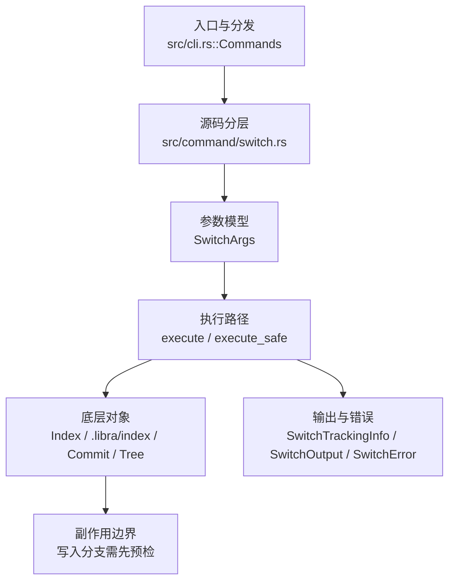

# `libra switch` 开发设计

## 命令实现目标

`libra switch` 的目标是在分支之间切换，或创建/重置分支后切换。实现需要支持 previous-checkout `-`、track、guess、force-create、orphan、锁定分支保护、结构化输出和错误码，并把 Git `switch` 的 merge/submodule 相关兼容行为留在差异记录中。

## 对比 Git 与兼容性

- 兼容级别：`partial`。

- 当前矩阵承诺常用 Git 行为已支持；`-f` / `--force`（别名 `--discard-changes`）、`--guess` / `--no-guess`（DWIM 远端跟踪猜测，默认开启）与 `--no-progress`（接受式 no-op）已公开；但 Git `switch` 的 `--merge` / conflict style / submodule 等参数尚未公开。新增语义必须同步矩阵、用户文档和测试。

## 设计方案

- 入口与分发：已公开接入 `src/cli.rs::Commands`；已由 `src/command/mod.rs` 导出。CLI 层在 `src/cli.rs` 把解析后的参数交给命令模块，命令模块负责把领域错误转换为 `CliError` / `CliResult`。
- 源码分层：主要实现文件为 `src/command/switch.rs`。参数/子命令类型包括：`SwitchArgs`；输出、错误或状态类型包括：`SwitchTrackingInfo`、`SwitchOutput`、`SwitchError`；主要执行函数包括：`execute`、`execute_safe`。
- 执行路径：`execute_safe` 负责 CLI 安全包装、错误映射和输出配置；索引路径会加载、比较、刷新或保存 `.libra/index`；对象路径会解析 revision 并读写 blob/tree/commit/tag 等对象；引用路径会读取或更新 SQLite refs、HEAD 与 reflog；数据库路径会通过 SeaORM/SQLite 或 D1 客户端持久化元数据；工作树路径会显式处理目录、注册表和删除/保留语义。

- 流程图：以下流程图按当前源码分层展示主路径和底层对象边界，便于维护者把代码入口、执行函数和副作用范围对应起来。

- 底层操作对象：`Index` / `.libra/index`（暂存区状态、路径条目和刷新/保存边界）；`Commit`（提交对象、父提交关系和提交消息载荷）；`Tree`（由索引或对象遍历生成的目录树对象）；`Branch` / branch store（SQLite refs 上的分支读写、过滤和上游关系）；`Head`（SQLite 中的 HEAD 指向、当前分支和 detached 状态）；`ReflogContext` / `with_reflog`（SQLite reflog 写入和动作记录）；`DatabaseTransaction`（需要原子性的数据库写入事务）；SeaORM / `.libra/libra.db`（配置、refs、reflog、AI/发布元数据等 SQLite 表）；`ObjectHash`（SHA-1/SHA-256 对象 ID 和 revision 解析结果）；worktree registry / filesystem layout（附加工作区登记、路径和删除边界）
- 输出与错误契约：人类输出、`--json` / `--machine` 输出和 quiet/verbose 分支必须继续走现有 `OutputConfig` / `emit_json_data` / `CliError` 路径；新增失败模式要补稳定错误码、用户提示和回归测试。
- 副作用边界：凡是写入索引、对象库、refs/HEAD、reflog、SQLite/D1、工作树或远端的路径，都必须先完成参数校验和 dry-run/预检分支，再执行持久化，避免部分写入后静默成功。

## 实现历史

- 2026-07-14（plan-20260708 P1-12）：`switch -` 通过 `resolve_previous_checkout_target` 与单行 `find_latest_navigation` SQL 查询当前 worktree 的 HEAD reflog，只采用最新 `switch`/`checkout` movement，不把完整 reflog 载入内存；本地分支来源跟随当前 tip，detached 来源用 reflog `old_oid` 完整值。无记录、来源分支已删除、损坏 message/OID/object 或存储错误均在任何 HEAD/index/worktree 写入前 fail-closed。`NavigationCommand` 让 switch/checkout 的 HEAD 更新与正确 action 的 reflog 写入共用事务路径；回归 target：`compat_previous_branch_shortcut`。
- 2026-07-14（plan-20260708 P1-10）：所有真正改变状态的 switch 在渲染成功输出前 advisory 运行 `.libra/hooks/post-checkout <old> <new> 1`；already-on no-op 不运行，`LIBRA_NO_HOOKS=1` 显式绕过。回归 target：`compat_libra_hooks_lifecycle`。
- 本节依据本地 main 分支提交历史重写，筛选与该命令实现、测试或文档路径直接相关的提交；以下是归纳后的实现脉络。
- 2026-01-21 `27f2ae2f`（`feat(switch): add --track flag to switch command (#157)`）：基础实现节点：add --track flag to switch command (#157)；当前实现的主要轮廓可追溯到该提交。
- 2026-06-06 `7e94b815`（`feat(switch): add -C/--force-create (create or reset branch then switch)`）：当前 HEAD 已保留 `SwitchArgs::force_create`，`libra switch -C <name> [<start-point>]` 会删除并重建非当前目标分支后切换；对应行为已有 `tests/command/switch_test.rs` 覆盖。
- 2026-07-09（plan-20260708 P0-04）：核对确认 `switch -c/-C <name> [<start-point>]` 已按分支创建路径切换到 symbolic `HEAD`；新增 `compat_checkout_branch_startpoint` 将 switch start-point 行为纳入跨命令守卫，防止 checkout 修复时回退 switch 语义。
- 2026-07-09（plan-20260708 P0-05）：源码核对确认旧 `switch --orphan` 会立即生成 `.librakeep` root commit，且 `checkout --orphan` 已从当前 CLI 参数消失；当前实现改为 unborn branch 语义：`HEAD` 指向尚未生成 ref 的 `refs/heads/<branch>`，index/worktree 保留，首个用户提交无 parent；同名分支和额外 start-point 均 fail-closed。回归守卫：`compat_switch_orphan_root`。
- 2026-05-23 `28bb0785`（`test(reset+switch): pin traces locked-branch coverage (v0.17.746)`）：测试契约：pin traces locked-branch coverage (v0.17.746)；相关行为已有回归守卫，后续变更需要继续满足。
- 历史结论：当前文档应以这些提交之后的代码、测试和兼容矩阵为准；更早的迁移式文档只保留为背景，不再作为事实来源。

## 当前状态

- 公开状态：已公开；模块状态：已导出。
- 用户文档：`docs/commands/switch.md`。
- Synopsis：`libra switch [-c|--create <CREATE>] [-C|--force-create <FORCE_CREATE>] [--orphan <ORPHAN>] [-d|--detach] [-t|--track] [-f|--force] [--guess] [--no-guess] [--no-progress] [<BRANCH>]`。
- 公开参数/子命令包括：`<branch>`（其中字面量 `-` 表示上一 checkout 目标）、`-c, --create <CREATE> [<start-point>]`、`-C, --force-create <FORCE_CREATE> [<start-point>]`、`--orphan <ORPHAN>`、`-d, --detach`、`-t, --track`、`-f, --force`（别名 `--discard-changes`）、`--guess`、`--no-guess`、`--no-progress`（接受式 no-op：Libra 的 switch 从不渲染进度条；字段 `no_progress` 在解构 `SwitchArgs` 时以 `_` 绑定、不被读取）。`switch -` 解析分支或 detached target 后继续复用相同 clean/untracked/case-collision/worktree guard；成功移动写 `switch` HEAD reflog，因而再次执行会切回。`-c` / `-C` 成功后 `HEAD` 保持为目标分支 symbolic ref；无效 start-point 在写 HEAD/ref 前 fail-closed。`--orphan` 设置 unborn symbolic HEAD，不创建占位 commit/branch ref，不恢复空树；首个用户提交从保留的 index 生成无 parent root commit。已有同名分支、当前分支名、其它 worktree 已 checkout 的 unborn 名称、额外 start-point 均 fail-closed。
- `-f, --force`：切换到不同提交时丢弃本地（已跟踪）改动而非因 dirty 工作区报错；仍通过 `ensure_no_untracked_overwrite` 守卫会被覆盖的未跟踪文件。实现为 `ensure_switch_clean_or_force(force, target, output)`，作用于会改变工作树的 5 个 `_for_commit` 预检点（track/create 带 start-point/force-create 带 start-point/detach/普通分支切换）。**部分实现差异**：不改变树的路径（`-c` 无 start-point、`--orphan`）仍要求干净工作区；orphan 不接受 `-f` 绕过 dirty index/worktree，因为保留 index 是首个 root commit 的语义基础。
- `--track` 现已提供 Git 的 `-t` 短别名；Libra 仅支持布尔形式（设置远端上游），不支持 Git 的 `-t (direct|inherit)` 模式参数（有意差异）。
- `--guess` / `--no-guess`：当 `<branch>` 不是本地分支但恰好唯一匹配某个远端跟踪分支时，自动创建同名本地跟踪分支并切换（Git 的 DWIM 行为，复用 `--track` 的 `switch_to_tracked_remote_branch` 路径，输出 `created=true` 与 `tracking`）。默认开启，按 `--no-guess` > `--guess` > `checkout.guess`（默认 `true`）的优先级解析；`--no-guess` 强制要求本地分支或显式 `--track <remote>/<branch>`。多个远端同名时返回歧义错误（`ConflictOperationBlocked`，退出码 128），`checkout.defaultRemote` 可消歧。`remote/branch` 形式仍按 Git `switch` 语义报 `GotRemoteBranch` 并提示使用 `--track`，不受 guess 影响。

## 还未实现的功能

| 类别 | 未完成项 | 当前处理 |
|---|---|---|
| ✅ 已实现 | `-f` / `--force`（别名 `--discard-changes`） | 已公开：带本地改动也切换、切到不同提交时丢弃它们（会被覆盖的未跟踪文件仍受保护）；字段 `force`，clap `visible_alias = "discard-changes"`。 |
| Orphan start-point | `switch --orphan <branch> <start-point>` 不公开；额外 positional 会 usage error fail-closed。 | Git `switch --orphan` 也不是 checkout 的 start-point 兼容入口；Libra 保持单参数 orphan，避免静默忽略 start-point 或破坏 P0-05 root 语义。 |
| Git 兼容参数 | `--merge`、`--conflict=<style>`、`--recurse-submodules`、`--ignore-other-worktrees` 等切换策略参数。 | 当前未公开；后续需要先补工作树冲突模型和多工作树隔离契约。 |

## 维护要求

- 改进本命令前，必须先阅读并遵循 [docs/development/commands/_general.md](_general.md)；这是命令设计、实现、测试和文档同步的强制要求。
- 任何行为变更都要先核对实现源码，再同步 `COMPATIBILITY.md`、`docs/commands/<cmd>.md` 和相关测试。
- 新增 Git 兼容参数时必须明确 tier、错误码、JSON/机器输出契约和回归测试。
