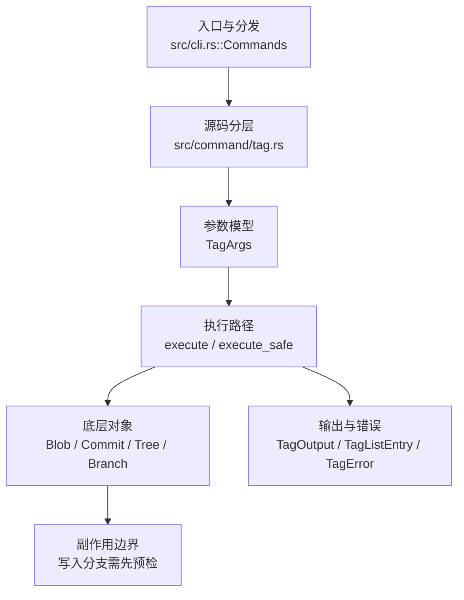

# `libra tag` 开发设计

## 命令实现目标

`libra tag` 的目标是创建、列出、过滤、删除、签名和验证标签。实现需要支持 force、`-n` 展示、annotated tag message（经 `-m`/`-F`）、`--points-at` 过滤、轻量标签路径，以及 vault-PGP 的 `-s`/`--sign`（`--no-sign` 撤销）与 `-v`/`--verify`；`-e`/`--edit` 编辑器消息录入已支持，尚未公开的是 Git GPG 互操作。

## 对比 Git 与兼容性

- 兼容级别：`partial`。轻量标签、message-based annotated tags（经 `-m`/`-F`）、`-F`/`--file`（从文件或 stdin 读取 annotated 消息）、force/delete/list/`-n`、`--points-at <object>`、`--contains <commit>`/`--no-contains <commit>`、列表模式下的 `<pattern>` glob 过滤（`tag -l 'v1.*'`）、`-s`/`--sign`（vault-PGP 签名）、`--no-sign`（撤销先前的 `-s`/`--sign`，命令行最后出现者生效；标签默认不签名，故单独使用时为 no-op）、`-v`/`--verify`（vault-PGP 验签）、`--merged <commit>`/`--no-merged <commit>`、`--sort=<key>`、`--column[=<options>]`（逗号/空格分隔，混合 `always`/`auto`/`never` + `column`/`row`（填充顺序）+ `dense`/`nodense`（列宽），默认 column-major+nodense，宽度取 `COLUMNS` 或 80，与 `-n` 互斥；列数与布局与 `git tag --column` 字节一致）、`-e`/`--edit`（打开编辑器撰写/编辑附注消息，注释行剥离，结果为空则中止）已支持；Git GPG 互操作尚未公开。

- 当前矩阵承诺常用 Git 行为已支持；新增语义必须同步矩阵、用户文档和测试。

## 设计方案

- 入口与分发：已公开接入 `src/cli.rs::Commands`；已由 `src/command/mod.rs` 导出。CLI 层在 `src/cli.rs` 把解析后的参数交给命令模块，命令模块负责把领域错误转换为 `CliError` / `CliResult`。
- 源码分层：主要实现文件为 `src/command/tag.rs`。参数/子命令类型包括：`TagArgs`；输出、错误或状态类型包括：`TagOutput`、`TagListEntry`、`TagError`（crate-private 错误枚举）；主要执行函数包括：`execute`、`execute_safe`。
- 执行路径：`execute_safe` 负责 CLI 安全包装、错误映射和输出配置；创建路径经 `tag::create` 解析 HEAD 提交并写入轻量或附注标签对象；引用路径会读取或更新 SQLite refs（创建/删除标签 ref，不写 reflog，不解析 remote/网络）；数据库路径会通过 SeaORM/SQLite 持久化标签引用。

- 流程图：以下流程图按当前源码分层展示主路径和底层对象边界，便于维护者把代码入口、执行函数和副作用范围对应起来。

- 底层操作对象：`Blob`（标签指向的 blob 对象，列表展示时读取其 ID）；`Commit`（标签指向的提交对象及提交消息载荷）；`Tree`（标签指向的目录树对象）；`Branch` / branch store（`branch::BranchStoreError`：解析 HEAD 提交时的错误来源）；SeaORM / `.libra/libra.db`（`DbErr`：读写 refs 等 SQLite 表的错误来源）
- 输出与错误契约：人类输出、`--json` / `--machine` 输出和 quiet/verbose 分支必须继续走现有 `OutputConfig` / `emit_json_data` / `CliError` 路径；新增失败模式要补稳定错误码、用户提示和回归测试。
- 副作用边界：tag 仅写入对象库（附注标签对象）和 SQLite refs（标签引用），不触及索引、reflog、D1、工作树或远端；写入前必须先完成参数校验（如删除/创建前的 name 校验），再执行持久化，避免部分写入后静默成功。

## 实现历史

- 本节依据本地 main 分支提交历史重写，筛选与该命令实现、测试或文档路径直接相关的提交；以下是归纳后的实现脉络。
- 2025-10-02 `3879a44a`（`feat: add argument -f/--force for tag command`）：基础实现节点：add argument -f/--force for tag command；当前实现的主要轮廓可追溯到该提交。
- 2026-06-07 `8fecc10d`（`feat(tag): add -a/--annotate flag requiring a message (v0.17.1409)`）：历史资料中曾记录 `-a/--annotate`，但当前 `TagArgs` 未公开该 flag；当前事实以源码为准。
- 2026-06-06 `58b0cc16`（`feat(tag): add --points-at list filter (v0.17.1406)`）：新增 `--points-at <object>`（字段 `points_at`），列表模式下按 peel-to-commit 过滤标签；不可解析对象映射为 `LBR-CLI-003`（exit 129）。该提交曾在一次 reconcile 中从工作树丢失，已于 2026-06-18 依据原提交 diff 恢复（含单元测试、端到端测试与文档）。
- 2026-05-18 `b534c401`（`fix(commit,stash,index-pack,tag): restore Issues URL on internal-invariant paths`）：实现修正：restore Issues URL on internal-invariant paths；该节点把边界行为、错误处理或兼容差异纳入当前实现约束。
- 2026-05-16 `fff9cbb0`（`test(tag): pin Display for 5 static-message TagError variants (v0.17.292)`）：测试契约：pin Display for 5 static-message TagError variants (v0.17.292)；相关行为已有回归守卫，后续变更需要继续满足。
- 2026-07-11（plan-20260708 P1-05d，sort 片）：`tag.sort` 配置默认接入严格 local→global→system 级联（`configured_tag_sort`，`--sort` 优先）。配置在 list 模式判定之后解析，因而配置的排序不会把 `libra tag <name>`（创建）翻成列表。两者皆未设置时列表按 `refname` 升序（Git 默认；此前为 DB 插入序）。无效配置值 → `TagError::InvalidSortConfig`（`LBR-CLI-002`），读取失败 → `SortConfigRead`（`LBR-IO-001`），均在输出前。`creatordate` 仍为对象哈希近似（与 `--sort` 相同，文档已注明）。已记录收窄：重复配置值只应用胜出 scope 的最后一个（Git 叠成多键排序）。回归：`compat_config_defaults_semantics` 的 `tag_sort_config_orders_list_without_forcing_list_mode`（含多值 last-wins）、`sort_config_read_failure_is_io_error_before_listing`（不可读 global 库 → LBR-IO-001 点名键）。
- 历史结论：当前文档应以这些提交之后的代码、测试和兼容矩阵为准；更早的迁移式文档只保留为背景，不再作为事实来源。

## 当前状态

- 公开状态：已公开；模块状态：已导出。
- 用户文档：`docs/commands/tag.md`。
- Synopsis：`libra tag [OPTIONS] [-l | -d | -f] [-m <MESSAGE> | -F <FILE>] [-e] [-n <N_LINES>] [--points-at <object>] [--contains <commit>] [--no-contains <commit>] [--merged <commit>] [--no-merged <commit>] [--sort <key>] [--column[=<mode>]] [--no-column] [NAME]`。
- 公开参数/子命令包括：`-l, --list`、`-d, --delete`、`-m, --message <MESSAGE>`、`-F, --file <FILE>`、`-f, --force`、`-n, --n-lines <N_LINES>`、`--points-at <object>`、`--contains <commit>`、`--no-contains <commit>`、`--merged <commit>`、`--no-merged <commit>`、`--sort <key>`、`--column[=<options>]`（逗号/空格分隔：`always`/`auto`/`never` + `column`/`row` + `dense`/`nodense`，缺省 `always`+column-major+nodense，与 `-n` 互斥，未知选项报 `LBR-CLI-002`）、`--no-column`（等价于 `--column=never`，经 clap `overrides_with` 与 `--column` 互为最后一个生效；`column` 字段读出 last-wins 结果，`no_column` 不直接读取；标签默认每行一个，故单独使用为 no-op）、`-s, --sign`、`--no-sign`（经 clap `overrides_with` 与 `--sign` 互为最后一个生效；`sign` 字段读出 last-wins 结果，`no_sign` 不直接读取）、`-v, --verify`、`[NAME]`（创建时为标签名；列表模式下作为 fnmatch glob 过滤模式，如 `tag -l 'v1.*'`，`*`/`?`/`[...]` 经 `compile_tag_glob` 锚定匹配标签名）。
- `-F, --file <FILE>`（与 `-m` 互斥）：从文件读取 annotated 标签消息（`-` 表示从 stdin 读取），由 `resolve_tag_message` 解析，提供后即创建 annotated 标签。读文件失败报 `TagError::MessageFileRead`→`LBR-IO-001`（`IoReadFailed`）。签名（`-s`）当前仍要求 `-m`（因此与 `-F` 不组合）。
- `-e, --edit`：打开编辑器撰写或编辑附注标签消息。编辑器缓冲以 `-m`/`-F` 的 base 消息（如有）加注释说明块预填，经 `editor::resolve_editor`（`GIT_EDITOR`→`core.editor`→`VISUAL`→`EDITOR`，无配置且有 TTY 时回退 `vi`，否则报 `TagError::NoEditor`→exit 128）→`editor::edit_message`（落 `TAG_EDITMSG`）打开。保存后用 `clean_tag_message`（`git stripspace` 语义：剥离整行注释、去行尾空白、折叠空行）清理；为空则报 `TagError::EmptyEditedMessage`→exit 128（`failure`+`RepoStateInvalid`，对齐 `commit` 空消息）。因 Libra 无独立 `-a`，`-e` 是经编辑器创建 annotated 标签的方式。
- `-s, --sign`（clap `requires = "message"`，即要求 `-m`；`-e` 可进一步编辑该 `-m` 消息，但 `-s` 不接受 `-F` 或仅编辑器消息）：用 vault PGP 密钥对规范化的未签名标签内容（`object/type/tag/tagger/\n\n/message`）签名，并把 armored 签名块（`vault::signature_to_armored`）追加到标签消息后，对齐 Git 的 signed-tag 布局；tagger 仅构建一次以保证被签名字节与落库对象一致。无 unseal key 时报 `CreateTagError::VaultSign`→`TagError::VaultSign`。
- `-v, --verify <name>`：`internal::tag::verify` 在签名标记处切分标签消息、重建未签名内容、`vault::armored_to_signature_hex` 还原签名后调用 `vault::pgp_verify`（libvault `pki/keys/verify`）。好签名打印 `Good signature for tag '<name>'`（exit 0）；坏签名 `TagError::BadSignature`（exit 1）；未签名/非 annotated/未找到/无密钥经 `map_verify_tag_error` 报错。
- `--contains <commit>` / `--no-contains <commit>`：仅保留（或排除）其 peeled commit 以 `<commit>` 为祖先的标签（即 tag “包含”该 commit），隐含 list 模式；复用 `log::get_reachable_commits` 对每个 tag 的 peeled commit 做一次可达性遍历。

## 还未实现的功能

| 类别 | 未完成项 | 当前处理 |
|---|---|---|
| ✅ 已实现 | 签名标签 | 原始对照：git tag -s <name>；当前说明：已实现 `-s/--sign`（vault PGP，armored 签名块追加到 tag message；要求 `-m`）。Libra 的签名为 vault-PKI，非 GPG 互通。 |
| ✅ 已实现 | 验证标签 | 原始对照：git tag -v <name>；当前说明：已实现 `-v/--verify`（`vault::pgp_verify` 经 libvault `pki/keys/verify`，重建未签名内容后验签）。Libra 验签为 vault-PKI，非 GPG 互通。 |
| ✅ 已实现 | 按包含提交过滤 | 原始对照：git tag --contains / --no-contains <commit>；当前说明：已实现（`TagArgs.contains`/`no_contains`，复用 `log::get_reachable_commits` 逐 tag 可达性过滤，隐含 list 模式）。 |
| ✅ 已实现 | 从文件读取消息 | 原始对照：git tag -F <file>（`-` 为 stdin）；当前说明：已实现 `-F`/`--file`（`resolve_tag_message` 读取文件或 stdin，与 `-m` 互斥，提供后即 annotated）。签名 `-s` 当前仍要求 `-m`，故不与 `-F` 组合。带集成测试（`test_tag_dash_f_reads_message_from_file_and_stdin`）。 |
| ✅ 已实现 | 按合并状态过滤 | 原始对照：git tag --merged / --no-merged；当前说明：已实现（`TagArgs.merged`/`no_merged`，复用可达性判定，隐含 list 模式）。 |
| ✅ 已实现 | 排序输出 | 原始对照：git tag --sort=<key>；当前说明：已实现 `--sort`（`refname`/`-refname`/`creatordate`/`-creatordate`，经 `sort_tags`）。 |
| ✅ 已实现 | 多列输出 `--column` | `--column[=<options>]`（缺省 `always`）按 `parse_column_spec` 解析逗号/空格分隔的选项：启用（`always`/`auto`/`never`）、填充顺序（`column` 默认 column-major / `row` row-major）、列宽（`nodense` 默认等宽 / `dense` 每列按自身最长项）。`format_tag_columns` 复刻 git `display_table`/`display_dense`：**dense** 取使总填充宽度严格 `< width` 的最少行数（最多列数）；**nodense** 列数 = `(width-1)/列宽`（git 严格 `<` 适配），column-major 再 `cols=ceil(n/rows)` 收缩空列、row-major 保留；**`plain`**（git 布局 token）强制单列（每行一项）。列宽与列数按**终端显示宽度**计算（`unicode_width::UnicodeWidthStr`，宽 CJK=2、组合字符=0；按显示宽度手工填充，非 Rust 的按字符数填充），与 git `utf8_strwidth` 一致；项长 + 2 padding，宽度取 `COLUMNS` 或 80；末列尾随空白裁剪。`auto` 仅 stdout 为终端时生效；与 `-n` 互斥（clap conflicts_with）；未知选项报 `LBR-CLI-002`。`--no-column`（= `--column=never`）经 `overrides_with` 撤销先前的 `--column`（last-wins）。**已与 `git tag --column` 跨多种 spec×`COLUMNS` 宽度（含 row/dense/nodense/plain + CJK 显示宽度）字节级比对一致**。带集成测试 `tag_column_lays_out_in_column_major_order`（column+row）、`tag_column_dense_row_and_boundaries_match_git`（dense/nodense 列数、严格 `<` 边界 78/79、row-major 不收缩、plain、空格分隔、later-wins）、`tag_column_unknown_option_is_usage_error`。注：libra 默认 `tag -l` 未排序（插入序），与 git 默认 refname 排序不同，是独立于 `--column` 的既有差异（用 `--sort=refname` 对齐）。 |
| ✅ 已实现 | 编辑器消息录入 `-e`/`--edit` | 原始对照：git tag -e <name>（配合 `-a`/`-m`/`-F`）；当前说明：已实现 `-e`/`--edit`，经 `compose_tag_message` 用 `editor::resolve_editor`/`edit_message`（落 `TAG_EDITMSG`）打开编辑器，缓冲以 `-m`/`-F` 的 base 消息加注释块预填；保存后 `clean_tag_message`（`git stripspace`）清理，空消息报 `TagError::EmptyEditedMessage`→exit 128。Libra 无独立 `-a`，`-e` 即经编辑器创建 annotated 标签；`-s` 仍要求 `-m`（clap `requires = "message"`）。带集成测试 `tag_edit_composes_seeds_and_aborts_via_editor`。 |

## 维护要求

- 改进本命令前，必须先阅读并遵循 [docs/development/commands/_general.md](_general.md)；这是命令设计、实现、测试和文档同步的强制要求。
- 任何行为变更都要先核对实现源码，再同步 `COMPATIBILITY.md`、`docs/commands/<cmd>.md` 和相关测试。
- 新增 Git 兼容参数时必须明确 tier、错误码、JSON/机器输出契约和回归测试。
