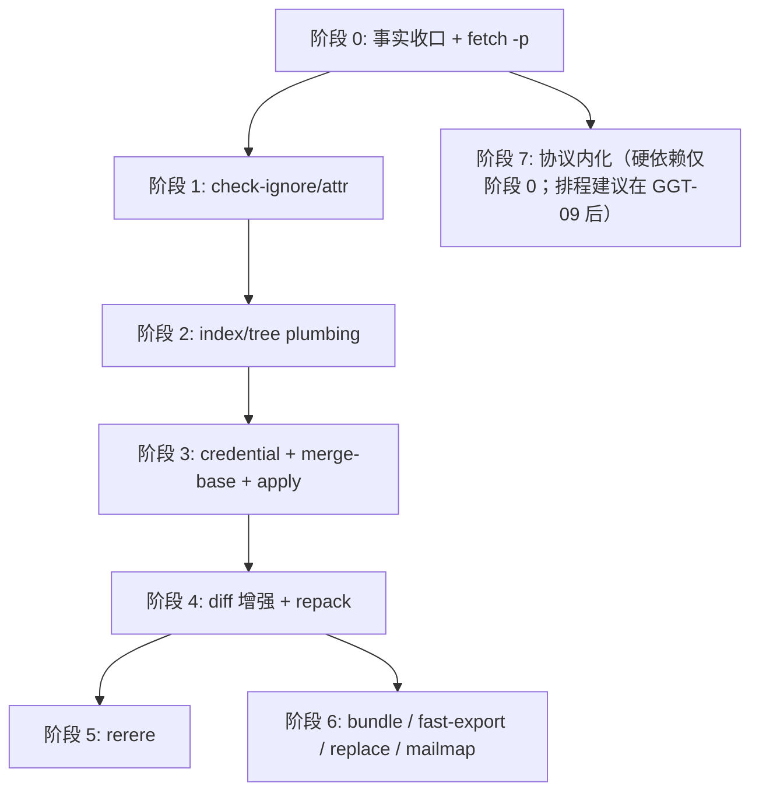
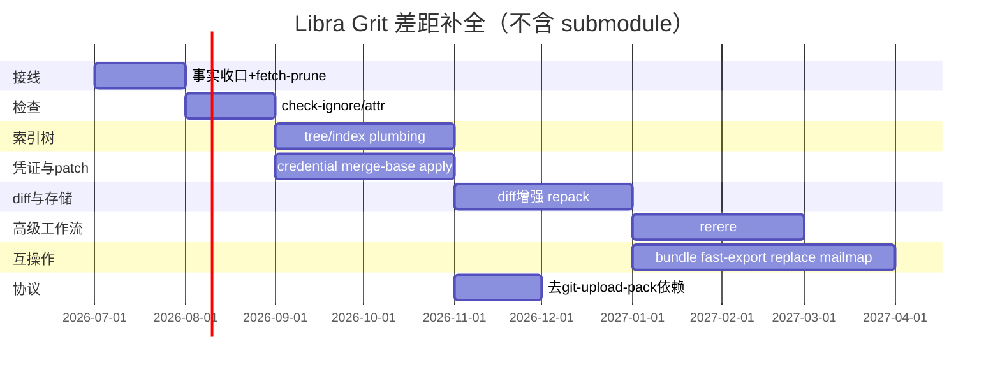

# Grit 差距补全执行计划

本文件记录 Libra 相对 [Grit](https://github.com/gitbutlerapp/grit)（`grit-git` CLI + `grit-lib`）在 Git 兼容命令面上的差距、源码核对结论，以及**按实现顺序排列**的补全路线图。它同时承担 Grit 命令测试重写的全局入口：凡是 Libra 已公开或候选公开的 Git 兼容命令，即使命令实现不在本差距补全计划内，也必须先分析 Grit 测试场景和覆盖范围，再按 Libra 的测试写法规范重写为 Libra 原生测试。它是跨命令执行计划，不替代单命令开发文档、`COMPATIBILITY.md` 或 [`_general.md`](_general.md) 的治理规则。

- **事实来源**：`src/cli.rs`、`src/command/`、[`COMPATIBILITY.md`](../../../COMPATIBILITY.md)、[`docs/development/commands/_general.md`](_general.md)、[`docs/development/commands/_compatibility.md`](_compatibility.md)、`docs/commands/README.md`、`tests/command/mod.rs`、Grit `grit-git/src/commands/`、`grit-git/src/main.rs::KNOWN_COMMANDS`、Grit `tests/` / `data/tests/` / `TESTING.md`。
- **用户承诺**：公开任何新命令前必须同步 [`COMPATIBILITY.md`](../../../COMPATIBILITY.md)、`docs/commands/<cmd>.md`、compat/integration 测试（见 [`_general.md`](_general.md)）。
- **治理交叉引用**：拒绝/延后决策见 [`_compatibility.md`](_compatibility.md)（D 编号）；本计划**不**覆盖 submodule（D1 拒绝，见下文范围声明）。
- **冲突处理原则**：本文件只能提出候选实现顺序；如果候选项与当前 README、`_compatibility.md` 或单命令文档的公开状态冲突，先在本文件标为「待决策」或「文档同步债」，不得直接宣称已经改变用户承诺。

## 方案评估结论速览

本计划已按**合理性/可行性、完整性、安全性、功能正确性/接口兼容性、数据流/控制流、性能/效率、可靠性/容错性、兼容性/互操作性、可扩展性/可维护性、合规性/标准符合性**十个维度完成评估。评估结论用于指导后续阶段优先级和资源分配，所有「必须补强」项已落入对应 GGT 任务或质量门。

| 维度 | 评级 | 关键结论 | 必须补强的控制点 |
|------|------|----------|------------------|
| 合理性 / 可行性 | ★★★★☆ | 阶段递进（检查 → plumbing → 凭证/patch → diff/存储 → 高级工作流 → 互操作 → 协议内化）符合当前架构；阶段 0 旧表述已落后；GGT-00A 若作为串行前置将成为瓶颈。 | 阶段 0 改为事实基线与文档同步；GGT-00A 与实现并行推进，不得阻塞阶段开工。 |
| 完整性 | ★★★☆☆ | 命令/flag 差距清单较全，但缺少跨阶段验收矩阵、回滚/降级策略、错误码基线、测量工具定义和变更影响面分析。 | 增加全局质量门、回滚策略、错误码文档、性能测量命令和决策日志。 |
| 安全性 | ★★★★☆ | credential / apply / fast-import / update-ref / bundle 为高风险；GGT-08 已覆盖侧信道、过期、轮换；apply 与 fast-import 需要扩展路径/资源安全细节。 | apply 路径安全、fast-import 资源限制与畸形输入、update-ref CAS 边界、bundle 签名验证。 |
| 功能正确性 / 接口兼容性 | ★★★★☆ | `direct`/`adapted`/`declined`/`blocked` 分类正确；部分 Git 退出码/输出断言（如 `merge-file` 精确非零码）未经验证。 | 每个命令列断言分类；对未验证退出码加「待确认」标记并补测试。 |
| 数据流 / 控制流 | ★★★★☆ | 阶段依赖基本正确；credential 数据流缺少显式描述；apply 三阶段（验证→索引→工作树）控制流未定。 | 增加 credential 数据流表；定义 apply 控制流与失败回滚点。 |
| 性能 / 效率 | ★★★☆☆ | 有时间基线但无内存基线、无测量命令、无 CI 性能回归阈值。 | 增加内存目标、`hyperfine`/`cargo bench` 测量方法、CI 性能回归 job。 |
| 可靠性 / 容错性 | ★★★☆☆ | 事务边界已提及，但缺磁盘满、网络抖动、部分失败、进程崩溃后的具体恢复策略。 | 增加磁盘满/部分失败/崩溃恢复步骤；定义「失败后仓库状态」标准。 |
| 兼容性 / 互操作性 | ★★★★☆ | 不追求完整 Git parity 的边界合理；导出格式互操作要求明确。 | 明确 Git 版本目标；增加 SHA-1/SHA-256 混用检测和格式版本门。 |
| 可扩展性 / 可维护性 | ★★★★☆ | 复用 `internal/*` 单一实现的方向正确；文档本身较长，需决策日志和可并行切片。 | 增加决策日志；GGT-00A 拆分为可独立推进的切片；新增命令不得复制既有逻辑。 |
| 合规性 / 标准符合性 | ★★★☆☆ | 许可证/source 记录要求存在，但**未点名 Grit 的 GPLv2/MIT 双许可证拆分**：`grit-git` 与仓库内 `/git`、`/tests` 为 GPLv2，仅 `grit-lib` 为 MIT，而 Libra 为 MIT——从 GPLv2 资产移植文本/预期输出/逻辑有 copyleft 污染风险。缺少 DCO 和文档标准引用。 | 显式声明 GPLv2→MIT 净室边界（见高风险质量门第 7 项）：行为参考优先取自 `grit-lib`(MIT) 与 Git 公开文档，不抄 `grit-git`/`/tests`；PR 验收清单增加 DCO；fixture 来源模板；文档标准指向 `_general.md`。 |

> 评级说明：★★★★★ = 当前可直接执行；★★★★☆ = 小风险/需补强；★★★☆☆ = 需新增控制点方可进入开发。

最后核对：2026-06-24（Libra `v0.17.1613` 工作区；Grit 外部基线为本地工作区 `gitbutlerapp/grit` @ `v0.5.0-12-gdfb079967`，对应 GitHub [`v0.5.0` release](https://github.com/gitbutlerapp/grit/releases/tag/v0.5.0) + [main README](https://github.com/gitbutlerapp/grit/blob/main/README.md) 中的 `grit-git`/`grit-lib` 说明）。本次实地核对：Grit 侧确认 `KNOWN_COMMANDS` 共 152 条（`grit-git/src/main.rs:5452`，README「140+」属实）、`grit-lib`/`grit-git` 引用的命令/库文件存在、`data/tests/<group>/<stem>.toml` 测试格式，以及 **`LICENSE` 的双许可证拆分**（`grit-lib`=MIT，`grit-git` 与 `/git`、`/tests`=GPLv2）；Libra 侧补充核对了 `src/command/{fetch,remote,gc,prune,maintenance,log,rebase,diff,cherry_pick,switch}.rs`、`src/command/mod.rs`、`src/cli.rs`、`tests/command/mod.rs`、`src/internal/protocol/local_client.rs` 和 `docs/development/commands/{README,_compatibility,fetch,remote,rebase}.md`，并确认 `gc.rs`/`prune.rs` 为未编译孤立文件。实现任何 Grit 对齐项前，必须重新生成 Grit 命令清单并记录 tag/commit，不能只沿用本文件的历史快照。

---

## 范围声明

### 明确不做

| 能力 | 决策 | 依据 |
|------|------|------|
| `submodule` / `submodule--helper` | **拒绝** | [`_compatibility.md` D1](_compatibility.md#d1submodule-子命令族)；单仓库 / trunk 产品边界 |
| `clone --recurse-submodules` | **拒绝** | D4（依赖 submodule） |
| Git LFS filter / `.gitattributes` smudge-clean 桥接 | **有意差异** | D5；使用 `libra lfs` + `.libra_attributes` |
| Git hooks bridge（`.git/hooks`、`core.hooksPath`） | **拒绝** | D3 |
| 跨命令交互式 patch mode（`add -p` 等） | **拒绝** | D15 |
| 交互式 rebase / todo 编辑（`rebase -i`、`--edit-todo`） | **拒绝** | D16；继续优先支持可脚本化 rebase / autosquash 路径 |
| 顶层 `sparse-checkout` | **延后** | D10 |
| 暴露 `send-pack` / `fetch-pack` 为用户命令 | **不做** | push/fetch 已内嵌协议；见阶段 7 |

gitlink（`0o160000`）在 tree/index 中仍可识别；`ls-tree` / `show` / `fsck` / `gc` 等检查类路径应保留 gitlink 识别能力，但 `merge` / `rebase` 当前会拒绝 gitlink 条目。`push` 等对 submodule 的警告可保留或文档化，但不实现 submodule 工作流。

### 并行推荐（未列入原需求清单，源码显示高价值）

| 命令 | 理由 |
|------|------|
| `merge-base` | `log.rs` / `rebase.rs` 已有算法，缺独立 CLI；解锁 `diff A...B` |
| `apply`（unified diff） | 无 Git patch 应用；仅有 AI 侧 `apply_patch`（Codex 格式） |
| `fetch --prune` | `remote prune` 与 `remote update -p` 已有；`fetch.rs` 仍未实现 prune flag |
| `commit-tree` / `mktree` | `Commit::from_tree_id`、`Tree::from_tree_items` 已在多个命令/测试中使用；与 `write-tree` 同属脚本化 plumbing |
| `check-ref-format` | init/branch 路径已有 Git 风格 ref 校验需求；独立 CLI 可减少脚本侧绕行 |

---

## 对比基准

| 维度 | Grit | Libra |
|------|------|-------|
| Git 兼容 CLI | `grit-git`，README 称 140+ Git-compatible commands；实际阶段执行前以 `KNOWN_COMMANDS` 重新生成 | `libra`，以 `src/cli.rs::Commands` enum 当前变体为准；2026-06-24 实际 `partial`/`supported`/`intentionally-different` 命令约 50 个（不含内部模块） |
| 测试背书 | README 称 `grit-git` 可运行 42k+ 上游 Git tests；具体通过率需按选定 tag/commit 重新记录 | 自有集成测试 + compat guards |
| 存储 | 传统 `.git/` 布局 | `.libra/`：Git 对象 + SQLite refs/config |
| 目标 | Git 行为复刻（库可链接） | AI Agent 原生 VCS + 部分 Git 兼容 |

## 关键假设与外部依赖

本计划的以下假设若变化，需重新评估对应阶段并更新本文件决策日志：

| 假设 | 影响阶段 | 变化时的应对 |
|------|----------|--------------|
| Grit 外部基线保持 `v0.5.0` 或后续稳定 tag | 全部 | 每次阶段开工前重新生成命令清单并 diff；GGT-00A-P3 负责刷新。 |
| Libra 继续以 `.libra/` + SQLite refs 为存储架构 | 2, 6, 7 | 若迁移 refs 存储，`update-ref` / `replace` / protocol 任务需重新设计。 |
| `maintenance run --task gc` 是唯一公开 GC 入口 | 0 | 若产品决策重新公开 `gc`/`prune`，需重启治理并替换 GGT-01。 |
| 不实现 submodule / Git hooks bridge | 全部 | 任何重启 D1/D3 的需求必须先改 `_compatibility.md` 和本文件范围声明。 |
| CI 默认 L1 套件保持 `cargo test --all` | 测试矩阵 | 新增 `--test` target 必须同步 `tests/INDEX.md` 和 CI 配置。 |
| 系统 Git 互操作 smoke 环境可用 | 6, 7 | CI 中 Git 版本变化时，互操作基线需重新标定。 |

---

## 本次本地核对结论

- 计划的依赖顺序总体合理，但阶段 0 需要按当前事实拆分：`gc` / `prune` 已在 `docs/development/commands/README.md` 被降级为内部历史资料，不应再作为默认公开路线推进；`remote update -p` 源码已实现；`fetch --prune` 仍是真实缺口。
- ✅ **已收口（v0.17.1759）**：`src/command/gc.rs`、`src/command/prune.rs`、`tests/command/gc_test.rs`、`tests/command/prune_test.rs` 曾在工作区存在，但 `src/command/mod.rs`、`src/cli.rs` 与 `tests/command/mod.rs` 都没有声明对应 `mod`。Rust 不做自动模块发现，因此这四个文件**从未被编译进 crate**，是孤立死代码（dead code），而不是「已接入但未公开」的命令。GGT-01 已按下文方式 ① 将其删除，治理结论维持内部化。
- `maintenance.rs::run_gc`（`src/command/maintenance.rs`）是**唯一被编译、唯一会运行**的 GC 实现；删除前约 5.3k 行的孤立 `gc.rs` 体量大得多但永不编译。当时真正的风险不是「两套实现运行时行为分叉」（`gc.rs` 永不运行），而是源码树里存在一份大体量、会随 Git/对象格式演进 bit-rot、与 `run_gc` 事实分叉、并逃过 CI 的死实现。收口目标曾是**二选一**并记入决策日志：① 直接删除孤立实现（`run_gc` 行为不变，无需兼容开关）；或 ② 抽取 `internal/repository_gc.rs` 单一领域实现、让 `run_gc` 委托它并删除重复（`run_gc` 行为可能变化，此时才需要兼容开关与 golden 对比）。**GGT-01 采纳方式 ①**（见决策日志 2026-06-30 行）。
- `fetch --prune` 仍未公开：`FetchArgs` 只有 `--no-prune` 兼容 no-op，没有 `-p`/`--prune`。`remote update -p` 已在 `RemoteCmds::Update` 中公开并复用 `run_prune_remote`（两段式：先 fetch 全部 resolved 远端、全部成功后再 prune），命令 README 与 `COMPATIBILITY.md` 已同步为已公开，文档同步债已结清。
- `rebase -i` / `--edit-todo` 按 D16 继续拒绝，已从本计划主线移除；当前 `rebase.md` 与命令 README 已记录 `--autosquash`、`--reapply-cherry-picks` 已支持，但 `_compatibility.md` 的概览行仍有旧说法，阶段 0 只做文档同步债收口，不重复规划实现。
- Grit 的命令测试不能作为 shell harness 直接接入 Libra。Grit 当前做法是把上游 Git `git/t/` 测试纳入自身 `tests/`，通过 `scripts/run-tests.sh` 和测试 harness 把 `grit-git` 暴露成 `git`；Libra 的要求不是照搬这些文件，而是阅读并归纳每个测试的场景、前置状态、操作步骤、断言和边界，然后用 `tests/command/*`、`tests/helpers/`、`tests/harness/` 或 `tools/integration-runner` 的既有 Libra 写法重写。
- 这不是完整 Grit parity 清单；它是按当前 Libra 架构与生产风险筛过的补全路线。完整 parity 仍需在 Grit 升级或开始新阶段时重新生成命令清单并 diff。但 Grit 测试重写不是只覆盖本文件差距项：所有 Libra 已公开或候选公开的 Git 兼容命令都要做测试场景清单、覆盖范围分类和 Libra 原生测试落地。

### 综合评估结论

| 维度 | 结论 | 风险等级 | 必须补强的控制点 |
|------|------|----------|------------------|
| 合理性 / 可行性 | 总体可行：路线按低风险接线、查询类命令、plumbing、patch、互操作递进，符合当前架构。阶段 0 旧表述已落后，若继续按旧表述执行会错误扩大公开命令面。 | 中 | 阶段 0 改为事实基线与文档同步；顶层 `gc` / `prune` 只保留“重新公开需重启治理”的候选，不再默认进入实现链路。 |
| 完整性 | 覆盖了主要 Grit/Git 兼容缺口，但缺少跨阶段验收矩阵、回滚/降级策略、错误码基线和测量工具定义。 | 中 | 增加全局质量门、回滚策略、错误码文档、性能测量命令和决策日志；每个 GGT 任务明确“完成后仓库可验证状态”。 |
| 安全性 | 高风险点集中在 `apply` 路径写入、`credential` 密钥流、`update-ref` 引用写入、`fast-import` 批量导入、`pack`/协议解析。 | 高 | 所有写路径必须拒绝 path traversal、绝对路径越界、refname 注入、object format 混用和敏感信息日志；凭证不得进入 JSON、trace、错误详情或 fixture；apply/fast-import 增加资源限制。 |
| 功能正确性 / 接口兼容性 | 采用“公开契约优先”是正确的；但 Grit/Git 行为不能直接等同 Libra 行为，尤其 `.libra`、SQLite refs、LFS 属性、hooks 和 submodule。 | 中 | 每个命令要先列 Git/Grit 断言分类：direct、adapted、declined、blocked；公开 flag 的帮助、退出码、JSON/machine 输出和 docs 必须同步；未验证退出码加「待确认」标记。 |
| 数据流 / 控制流 | 当前阶段依赖大体正确，但 `remote update -p` 已完成，`fetch --prune` 应复用已有 prune 分类而不是再建分支；`gc` 内部化后仍需避免双实现。 | 中 | destructive 操作必须有 dry-run、事务边界、reflog/审计输出和失败后状态说明；多远端、多 ref 批处理要定义部分失败策略；增加 credential 数据流表与 apply 控制流。 |
| 性能 / 效率 | 后期 `apply`、`repack`、`bundle`、`fast-export/import`、`replace` 可能触发全仓遍历或大 pack 内存峰值。 | 中 | 要求流式解析、分页/批处理、对象遍历去重、避免重复加载 blob/tree；大型仓库 smoke 或性能上界说明应随 PR 落地；补充内存基线与测量方法。 |
| 可靠性 / 容错性 | 计划包含测试闭环，但原文对 crash consistency、SQLite 事务、网络超时和 partial write 描述不足。 | 中 | SQLite ref/config 变更用事务；对象写入先落对象后原子更新 refs；网络/协议命令必须保留 timeout、sideband/EOF 错误和可恢复诊断；增加磁盘满、部分失败与崩溃恢复策略。 |
| 兼容性 / 互操作性 | 不追求完整 Git parity 的边界合理；互操作命令需特别保护 Git 格式兼容，不可因 `.libra` 内部实现污染导出格式。 | 中 | `bundle`、`fast-export/import`、pack 命令必须用 Git wire/object 格式验证，并至少与系统 Git/Grit 做读取互操作 smoke；明确 Git 版本目标。 |
| 可扩展性 / 可维护性 | 复用 `diff`、`tree/index`、`merge-base`、pack writer 的方向正确，能避免多套引擎。 | 低 | 新增命令不得复制既有领域逻辑；优先抽 `internal/*` 单一实现，再由 porcelain/plumbing 复用；增加决策日志和 GGT-00A 并行切片。 |
| 合规性 / 标准符合性 | 直接移植 Grit/Git 测试资产有许可证和维护风险。**关键事实**（已核对 Grit `LICENSE` + `README.md`）：`grit-git`(CLI) 及仓库内 `/git`、`/tests`（上游 Git `t*.sh`）为 **GPLv2**，仅 `grit-lib` 为 MIT；Libra 为 **MIT**。从 GPLv2 源码/预期输出搬运文本或逻辑会污染 MIT 代码库。 | 中 | 所有来自 Grit/Git 的 fixture 必须记录来源 tag/commit、许可证、裁剪理由；**净室策略**：算法参考优先取 `grit-lib`(MIT) 与 Git man page，场景从 Libra 实测行为重新推导，不复制 `grit-git`/`/tests` 的 shell harness、C helper、逐字预期输出或大段文本；PR 验收清单增加 DCO。 |

---

## 冲突审计与处理

| 对照文件 | 冲突 / 风险 | 本文件处理 |
|----------|-------------|------------|
| [`_general.md`](_general.md) | `_general.md` 要求命令页维护固定结构、用户承诺和 integration scenario 闭环；本文件是跨命令路线图，不能替代任何单命令文档。 | 明确本文件只给出执行顺序和任务卡；每个任务的验收都要求同步对应 `docs/development/commands/<cmd>.md`、`docs/commands/<cmd>.md`、`COMPATIBILITY.md` 和 integration scenario。 |
| [`README.md`](README.md) | README 当前把 `gc` / `prune` 列为未公开或未纳入用户承诺的命令资料；旧版本文件写成“本计划直接覆盖该说明”。 | 以 README 的内部化结论为当前事实：本计划不再默认公开 `gc` / `prune`。若未来重启公开，必须新开决策并同步 CLI、README、`COMPATIBILITY.md`、用户文档和测试。 |
| [`_compatibility.md`](_compatibility.md) | `_compatibility.md` 仍保留 `gc` / `prune` “二选一：接入 CLI 或降级为内部资料”的旧描述；`README.md` 已把二者降级为内部历史资料。 | 阶段 0 改为文档一致性收口：把 `_compatibility.md` 与 README 对齐；只保留 GC 单实现去重，不把顶层命令接线作为默认任务。 |
| [`fetch.md`](fetch.md) / [`remote.md`](remote.md) / [`README.md`](README.md) | `fetch --prune` 仍未公开；`remote update -p` 源码、`remote.md`、命令 README 与 `COMPATIBILITY.md` 均已公开/同步。 | 阶段 0 只规划 `fetch -p`/`--prune` 的实际删除 stale tracking ref 语义；`remote update -p` 已实现并完成文档/回归同步。 |
| [`rebase.md`](rebase.md) / [`README.md`](README.md) / [`_compatibility.md`](_compatibility.md) | `rebase.md` 与命令 README 已写 `--autosquash` / `--reapply-cherry-picks` 已支持；`_compatibility.md` 的概览行仍有旧说法。 | 记录为文档同步债，不进入 Grit 补实现计划；由 `GGT-00` 更新 `_compatibility.md` 并保留 compat guard。 |
| [`_compatibility.md`](_compatibility.md) D1/D3/D4/D5/D15/D16 | submodule、Git hooks bridge、clone recurse-submodules、Git LFS filter/hooks、patch mode、interactive rebase 明确拒绝、有意差异或延后。 | 本计划不重启这些项；任何重新纳入都需要先改 D 编号决策和重启条件。 |

## 差距清单与阶段映射

下表为计划内要补全的能力（**不含 submodule**）。「Libra 现状」以当前 `src/` 为准。

| 能力 | 建议阶段 | Libra 源码现状 | Grit 参考 |
|------|----------|----------------|-----------|
| GC / prune 领域实现收口 | **0 ✅** | **已收口（v0.17.1759，方式①）**：删除未编译孤立死代码 `src/command/gc.rs`/`prune.rs` 及死测试 `gc_test.rs`/`prune_test.rs`；唯一被编译的 GC 实现 `maintenance.rs::run_gc` 行为不变。`docs/development/commands/README.md` 与 `docs/development/internal/{gc,prune}.md` 维持内部历史资料定位 | `grit-git/src/commands/gc.rs`、`prune.rs`（仅作行为参考，不默认公开） |
| `fetch --prune` | **0** | `remote.rs::run_prune_remote` 与 `remote update -p` 已有；`FetchArgs` 仅有 `--no-prune` no-op，无 `-p`/`--prune` | `grit fetch -p` |
| `remote update -p` 文档同步 | **✅ 已同步** | `RemoteCmds::Update` 已有 `-p`/`--prune`，`remote.md`、命令 README 与 `COMPATIBILITY.md` 均已记录为已公开 | `git remote update -p` |
| `check-ignore` / `check-attr` | **1** | `utils/ignore.rs`、`utils/lfs.rs`；无 CLI | `check_ignore.rs`、`check_attr.rs` |
| `write-tree` / `read-tree` | **2** | AI `history.rs` 有内部 `write_tree`；无用户命令 | `write_tree.rs`、`read_tree.rs` |
| `update-index` / `update-ref` | **2** | cherry-pick/merge 内部改 index；refs 在 SQLite `reference` 表 | `update_index.rs`、`update_ref.rs` |
| `merge-file` | **2** | `merge.rs` 仅 porcelain 三路合并 | `merge_file.rs`、`grit-lib::merge_file` |
| `commit-tree` / `mktree` / `check-ref-format` | **2（候选）** | 无 CLI；底层对象构造/校验能力分散在命令与测试中 | Git/Grit plumbing |
| `libra credential` | **3** | `vault.ssh.*` + `ask_basic_auth`；`config.rs` 识别 `credential.helper` 但不调用 | 参考协议形状，**不**移植 `credential-cache`/`credential-store` |
| `merge-base` | **3** | `log.rs:738`、`rebase.rs` 有 `find_merge_base` | `grit-lib/src/merge_base.rs` |
| `apply` | **3** | 无 unified diff apply | `grit-lib/src/apply.rs`（体量大） |
| `diff` 增强（`A...B`、`-w`） | **4** | `diff.rs`（`normalize_diff_range` 附近，约 `:298`）注释写明 `A...B` merge-base range 未实现、回落为 pathspec；`DiffArgs` 无 `-w`/`--ignore-all-space` 字段 | `diff*.rs` |
| `repack` / `pack-objects`（隐藏） | **4** | `maintenance.rs` 有 `create_pack_from_hashes`、`run_incremental_repack` | `repack.rs`、`pack_objects.rs` |
| `diff-index` / `diff-files` / `diff-tree` | **4** | 仅统一 `diff.rs` | 三个 plumbing 命令 |
| `rerere` | **5** | 无模块；`cherry_pick.rs` 拒绝 `--rerere-autoupdate` | `grit-lib/src/rerere.rs` |
| `bundle` | **6** | 无 | `bundle.rs` |
| `fast-export` / `fast-import` | **6** | 无 | `fast_export.rs`、`fast_import.rs` |
| `check-mailmap` | **6** | 无 | `check_mailmap.rs` |
| `replace` | **6** | 无 `refs/replace` 与全局 peel | `replace.rs` |
| 协议去 `git-upload-pack` 依赖 | **7** | `local_client.rs` 部分路径 spawn 系统 git | `upload_pack.rs`（内化，不暴露 CLI） |

### 源码已实现、无需重复规划

| 项 | 位置 | 收口状态 |
|----|------|----------|
| `switch -f` / `--force`（`--discard-changes` 可见别名） | `switch.rs:85-86`、`switch_test.rs::test_switch_force_discards_local_changes` | 代码/测试/兼容矩阵/开发文档已落地；若用户文档 synopsis 或参数表仍缺该 flag，只作为文档同步债处理，不进入 Grit 补实现计划 |
| `cherry-pick --skip` | `cherry_pick.rs:310-312` | 已公开并有用户文档/测试 |
| `remote set-url --push` | `remote.rs:159-161` | 已公开并有用户文档/测试 |
| `remote update -p` / `--prune` | `remote.rs:187-195`、`remote.rs:805-839`、`remote_test.rs` | 源码、单命令文档、命令 README 与 `COMPATIBILITY.md` 均已落地/同步；不再作为待实现或待同步功能规划 |

### 已知源码正确性风险（必须在对应 GGT 任务中收口）

| 风险 | 位置 | 说明 | 对应任务 |
|------|------|------|----------|
| `log.rs::find_merge_base` 文档声明返回「best merge-base (closest ancestor)」但实际返回 first-found，非 LCA | `log.rs:752-792` | 非交叉合并历史下结果可能偶然正确；交叉合并（criss-cross）下排除点可能偏高，导致 `log A..B` 漏提交或多提交。`rebase.rs:3566-3614` 有同一算法但诚实标注了 TODO。 | GGT-09 |
| 两套 `find_merge_base` 实现、签名和**遍历顺序**均不同 | `log.rs:752`（`CliResult<ObjectHash>`；先建全量左祖先集，再用 `VecDeque::pop_front` 做 **BFS** 取首个命中）、`rebase.rs:3579`（`Result<Option<ObjectHash>, String>`；双队列交替，用 `Vec::pop` 做 **LIFO/DFS**） | 两种遍历对同一历史可能返回**不同**的 first-found base，因此连「错法」也未必一致；抽取 `internal/merge_base.rs` 时必须统一为 LCA 算法，同时覆盖 `--all`（多 merge base）和 `--is-ancestor` 语义。 | GGT-09 |
| `diff.rs` 无 `-w`/`--ignore-all-space` clap 字段 | `diff.rs` DiffArgs | 差距表写「`-w` 忽略空白」但源码中不存在该 flag；GGT-09/4.1 需新增 clap 字段 + diff 引擎空白归一化，不是仅接线。 | GGT-09 / 阶段 4.1 |

> **行号约定**：本表及全文的 `file.rs:NNN` 均为 2026-06-24 工作区快照，会随提交漂移（例如 `diff.rs` 的 merge-base range 注释在本次复核已从 `:268` 漂到约 `:298`）。开工前请以**符号名**（`fn find_merge_base`、`struct DiffArgs`、`fn run_gc` 等）重新定位，不要依赖行号本身。

### 未覆盖的已知缺口（有意排除出本计划）

以下 `partial` 命令在 `docs/development/commands/README.md` 有记录的缺口，但**不在本 Grit 差距补全计划内**。它们由各自命令开发文档维护，不进入本文件的阶段路线；若 Grit 测试重写（`GGT-00A`）覆盖到这些命令，相关断言按 `direct`/`adapted`/`declined`/`blocked` 分类处理，`blocked` 不指向本计划的任务编号。

| 命令 | README 记录的缺口 | 排除理由 |
|------|-------------------|----------|
| `log` | positional ranges、exact line history (`-L` 完整语义) | 非 Grit 独有差距；`log` 内部 `find_merge_base` 修复在 GGT-09 覆盖 |
| `rev-list` | ~~object-enumeration traversal output (`--objects`)~~ | ✅ 已实现 `--objects`/`--objects-edge`/`--objects-edge-aggressive`（`--boundary` 亦已实现） |
| `for-each-ref` | full Git atom language、remaining sort keys、shell quoting | 纯输出格式增强，不触及数据正确性 |
| `ls-tree` | full Git pathspec magic | pathspec 引擎增强，独立于本计划 |
| `grep` | （搜索范围扩展已完成） | `--untracked`（#160）与 `--no-index`（#161）均已实现 |
| `config` | editor round-trip、includeIf | 配置子系统增强，独立于本计划（section 操作 `--remove-section`/`--rename-section`、`-z`/`--null` NUL 输出、`--type`/`--bool`/`--int`/`--path` 读取+设置规范化，以及 `--system` 纯配置作用域（vault/import 在该作用域拒绝）已实现） |
| `hash-object` | 路径过滤器/attributes、`--literally` 任意类型字符串未支持 | `-t blob/commit/tree/tag` 类型化哈希 + `--literally` 已实现（#157）；其余为 plumbing 补充，可在 GGT-05 后视需补齐 |
| `cat-file` | `-e` JSON/machine output | 输出格式补齐，独立于本计划 |
| `blame` | reverse/incremental/copy-move detection | 算法增强，体量大且独立（`-w`/`--ignore-whitespace` 已实现） |
| `shortlog` | stdin | `--format` 已实现（#166）；仅剩 stdin 管道输入 |
| `rev-parse` | output-filter/parseopt modes | 解析模式补齐 |
| `show` | notes/mailmap/signature 内联显示 | 输出格式补齐；命名 pretty 预设 short/full/fuller/reference/raw + `--raw` diff 格式已实现；`mailmap` 在 GGT-13 覆盖 |
| `stash` | `create` / `store` | 内部 API 暴露，独立于本计划 |
| `symbolic-ref` | 仅支持 HEAD | SQLite refs 架构限制，非 Grit 差距 |
| `tag` | editor (`-e`)、Git GPG interop | 独立于本计划 |
| `cherry-pick` / `revert` | `--edit`、strategy flags、multi-commit todo | sequencer 增强，部分由 D 编号治理 |
| `merge` | octopus/custom strategies | 策略引擎增强，独立于本计划（`--stat`、`--verify-signatures`(vault-key PGP) 已实现） |
| `commit` | `-t --template` | 编辑器模板增强，独立于本计划（`--status` 已实现） |
| `describe` | （`--contains` 已实现，git name-rev） | 独立于本计划 |
| `reset` / `restore` | reset merge/keep mode、restore conflict re-render（`--merge`/`--conflict`）variants | 独立于本计划（restore `--overlay`/`--no-overlay` 与 `--ours`/`--theirs`/`--ignore-unmerged` 已实现） |
| `bisect` | `replay` | 独立于本计划 |
| `format-patch` | `--attach`/`--inline`/`--base`/`--interdiff`/`--range-diff`/`--notes` | 邮件格式增强，独立于本计划（`--to`/`--cc`/`--no-to`/`--no-cc` #168、`--from` #169 已实现；`--force` 非 Git 标志） |
| `fsck` | JSON/machine output、strict mode、pack verification surface | 输出和检查增强，独立于本计划 |
| `archive` / `clean` (`-i`) / `pull` / `push` (local file remote) | 各自 README 记录的缺口 | 独立于本计划 |

---

## 实现顺序（8 个阶段）



### 依赖与风险矩阵

| 阶段 | 前置依赖 | 关键风险 | 风险缓解 |
|------|----------|----------|----------|
| 0 | 无 | **仅当**收口取「`run_gc` 采纳 `gc.rs` 逻辑」一路时，改 `maintenance.rs::run_gc` 可能破坏既有 maintenance 行为（「删除孤立实现」一路不改 `run_gc`，无此风险） | dry-run 计数/expire/JSON/warning 行为差异必须先有对比测试再改；保留旧实现可切换开关直至验收 |
| 1 | 0 | `check-attr` 语义与 Git `.gitattributes` 混淆 | 文档标明 D5 有意差异；测试验证 `.libra_attributes` 独立解析 |
| 2 | 1 | `update-ref` 改 SQLite refs 架构敏感项 | 先抽 `internal/tree_plumbing.rs` 再开 `update-ref`；CAS + reflog 事务测试先行 |
| 3 | 2 | `apply` parser 体积大且需路径安全 | MVP 只做 `--check`；写入模式延迟到 rerere 需要时；path traversal 拒绝测试 |
| 3 | 0 | `merge-base` LCA 修正可能改变 `log A..B` 和 rebase 行为 | 交叉合并回归测试覆盖 `log` 和 `rebase`；旧 first-found case 有 golden 输出对比 |
| 4 | 3 | `repack` 对大仓库可能长时间阻塞 | 复用 maintenance pack 编码；不新增 pack writer；`pack-objects` hidden 不进公开承诺 |
| 5 | 2 + 3 | rerere 存储模型选择（文件 vs SQLite）影响后续迁移 | 先定存储模型再写 CLI；preimage/postimage 格式与 Git rerere 兼容性测试 |
| 6 | 4 + 5 | `fast-import` 崩溃一致性和 `replace` 全链路 peel 回归 | 事务边界在 checkpoint；`replace` peel 必须覆盖 `load_object`/`rev-parse`/`log`/`show` 全部调用点 |
| 7 | 0 | 协议内化可能改变 fetch/pull 用户可见行为 | 不改变 CLI surface；网络回归测试 + 系统 git 互操作 smoke |

### 阶段 0 — 事实收口、去重与 fetch prune（1–2 周）

**目标**：先解决本计划与当前源码/文档承诺的冲突，把 `gc` / `prune` 按当前 README 结论收口为内部化事实并去重 GC 领域实现；补齐 `fetch -p` / `--prune`。`remote update -p` 已实现，只做文档矩阵同步和回归确认。除 prune stale tracking ref 之外不引入新算法。

| 顺序 | 工作项 | 改动要点 | 验收 |
|------|--------|----------|------|
| 0.0 | **事实基线与文档同步** | 对照 `README.md`、`_compatibility.md`、`docs/commands/gc.md`、`docs/commands/prune.md`、`fetch.md`、`remote.md`，确认 `gc` / `prune` 内部化、`remote update -p` 已实现、`fetch --prune` 未实现。 | README、`_compatibility.md`、本文件和单命令文档不再互相覆盖或互相矛盾。 |
| 0.1 | **内部化 `gc` / `prune` 资料收口** | 保持顶层 CLI 不注册；把 `docs/commands/gc.md`、`docs/commands/prune.md` 等用户资料降级为内部/历史入口或删除公开暗示；记录未来重新公开的治理条件。 | `libra gc --dry-run`、`libra prune -n` 若仍返回 `LBR-CLI-001`，文档必须清楚说明这是当前契约；不再有用户文档暗示可用。 |
| 0.2 | **GC 领域实现收口（孤立代码去留）** | 二选一并记入决策日志：① 删除未编译的孤立 `gc.rs`/`prune.rs`（`run_gc` 不变）；或 ② 抽取 `internal/repository_gc.rs` 单一实现、`run_gc` 委托它、删除重复。无论哪种，源码树最终只剩一套会编译的 reachability/prune 规则。 | 取 ② 时，`maintenance run --task gc` 的 dry-run、expire、JSON、warning 与内部 GC 测试共用同一领域逻辑；取 ① 时确认删除后无编译/测试残留引用。 |
| 0.3 | **内部测试定位** | `tests/command/gc_test.rs`、`prune_test.rs` 若不接入 CLI 测试，改为内部模块测试或移入对应 internal 测试；避免死测试文件长期漂移。 | `tests/command/mod.rs` 不遗漏公开命令测试；内部化路径下不保留误导性的 CLI 集成测试文件。 |
| 0.4 | **`fetch --prune`** | `FetchArgs` 加 `prune` / `-p`；fetch 成功后删 stale `refs/remotes/<name>/*`；复用 `remote prune` 的 stale 分类；`--dry-run` 只报告不删 ref；`--no-prune` 与 `--prune` 冲突或按 clap override 明确化。 | 远端删分支后 `fetch -p` 清 tracking ref；`fetch --dry-run -p` 不写 refs/reflog/FETCH_HEAD prune 记录；`fetch --no-prune` 行为与当前一致。 |
| 0.5 | **`remote update -p` 同步债（✅ 已完成）** | 不重复实现；已同步命令 README 与 `COMPATIBILITY.md`，`remote_test.rs` 覆盖解析、无远端通知、不可达 fetch 失败与端到端 stale ref 修剪。 | 文档不再写 `update -p` 未公开；`remote update -p`（两段式 fetch-all-then-prune）与 `fetch --prune` 语义差异已明确记录。 |

**测试**：`cli.gc-smoke` 继续验证当前内部化契约或按治理决策更新；新增 fetch-prune 端到端；确认 remote-update-prune 回归已纳入默认命令测试。

**工作量**：S–M

**首个 PR 建议范围**：仅 0.0–0.3 + `gc_smoke`/文档同步。不要把 `fetch -p` 混入事实收口 PR。

**回滚策略**：仅在收口方式 ②（`run_gc` 采纳 `gc.rs` 逻辑、会改 `run_gc` 行为）时需要回滚路径——保留旧 `run_gc` 作为编译期 feature `legacy-maintenance-gc` 或运行时 `libra maintenance run --task gc --compat=legacy`，直至新实现通过所有 golden 输出对比；收口方式 ①（删除孤立实现）不改 `run_gc`，无需回滚开关。

---

### 阶段 1 — 检查类命令（1–2 周）

| 顺序 | 工作项 | 复用 / 参考 |
|------|--------|-------------|
| 1.1 | **`check-ignore`** | `utils/ignore.rs::should_ignore`；首版：path、`-v`、`-n`、stdin、`-z`、`--no-index` |
| 1.2 | **`check-attr`**（Libra 语义） | `utils/lfs.rs` + `.libra_attributes`；首版 `filter` 查询；文档标明非 Git smudge/clean（D5） |

**验收**：`check-ignore -v <path>`、`check-attr filter <path>` + `--json`。

**工作量**：S–M

---

### 阶段 2 — 索引 / 树 plumbing（2–3 周）

**目标**：为 `apply`、`rerere` 提供共用底层。

| 顺序 | 工作项 | 说明 |
|------|--------|------|
| 2.0 | **`internal/tree_plumbing.rs`** | 从 `internal/ai/history.rs`、`cherry_pick.rs::update_index_entry` 抽取 write-tree / index 更新 API |
| 2.1 | **`write-tree` / `read-tree`** | 首版：index ↔ tree |
| 2.2 | **`update-index`** | 首版：`--add` / `--remove` / `--cacheinfo` |
| 2.3 | **`update-ref`** | SQLite `reference` 适配（非文件 `refs/`）；扩展 `symbolic-ref` 仅 HEAD 的现状 |
| 2.4 | **`merge-file`** | 首版：`merge-file -p base ours theirs` |
| 2.5 | **plumbing 补充候选** | `commit-tree`、`mktree`、`check-ref-format` 可在抽取对象/引用 helper 后低成本补齐；不阻塞 `apply` |

**暂不实现**：`merge-tree`（rerere 需要时再开）；`rebase -i` / `--edit-todo` 继续按 D16 拒绝，不作为本阶段下游目标。

**工作量**：M–L（`update-ref` 为架构敏感项）

---

### 阶段 3 — 凭证与 patch 基础（2–4 周）

| 顺序 | 工作项 | 说明 |
|------|--------|------|
| 3.1 | **`libra credential`** | `fill` / `store` / `erase`，对接 `internal/vault.rs` + `vault.ssh.*`；**不**移植 Grit `credential-cache`/`credential-store` |
| 3.2 | 协议接入 | SSH 已读 `vault.ssh.<remote>.privkey`；重点补 HTTPS `fill`/`store`/`erase`、`credential.helper` 兼容入口，减少 `ask_basic_auth` 交互 |
| 3.3 | **`merge-base`** | 抽取 `internal/merge_base.rs`（合并 `log.rs` / `rebase.rs` 实现）；首版 `merge-base A B`、`--all`、`--is-ancestor` |
| 3.4 | **`apply` MVP** | 新建 `internal/patch/` + `src/command/apply.rs`：`--check`、worktree、`-p`；**不复用** AI `apply_patch` parser |

**验收**：非交互 fetch/push 可用存储凭证；`apply --check` 对单文件 patch 可用。

**工作量**：M–L（`apply` 为 L）

---

### 阶段 4 — diff 增强与存储优化（2–3 周）

| 顺序 | 工作项 | 说明 |
|------|--------|------|
| 4.1 | **`diff` 增强** | `A...B` merge-base range（依赖 3.3）；`-w` 忽略空白 |
| 4.2 | 顶层 **`repack`** | 复用 `maintenance::run_incremental_repack` |
| 4.3 | **`diff-index` / `diff-files` / `diff-tree`** | 按需：作为 `diff` 内部模式别名，避免三套引擎 |
| 4.4 | **`pack-objects`**（`hide = true`） | 复用 maintenance pack 编码 + `index_pack` |

**工作量**：M

---

### 阶段 5 — rerere（3–5 周）

| 顺序 | 工作项 |
|------|--------|
| 5.1 | `internal/rerere/`（`.libra/rerere/` 或 SQLite 表） |
| 5.2 | `libra rerere`：`status` / `diff` / `forget` / `clear` / `gc` |
| 5.3 | 接入 merge / rebase / cherry-pick；**移除** `cherry_pick.rs` 对 `--rerere-autoupdate` 的拒绝 |

**依赖**：阶段 2.4 `merge-file`、与 `merge.rs` 一致的 conflict marker。

**工作量**：L

---

### 阶段 6 — 互操作与对象替换（4–8 周）

| 顺序 | 工作项 | 依赖 |
|------|--------|------|
| 6.1 | **`bundle`** | 阶段 4 repack + reachability |
| 6.2 | **`fast-export`** | object walk + refs |
| 6.3 | **`fast-import`** | 事务性 object/ref 写入 + SQLite |
| 6.4 | **`check-mailmap`** + log/blame 集成 | 解析 `.mailmap` |
| 6.5 | **`replace`** | SQLite refs + 全链路 object peel（`load_object`、`rev-parse`、`log`、`show`） |

**工作量**：6.1–6.4 各 M–L；6.5 为 L

---

### 阶段 7 — 协议内化（1–2 周）

| 工作项 | 说明 |
|--------|------|
| 去掉 `local_client.rs` 对 **`git-upload-pack`** 的 spawn | 改用 `internal/protocol` 已有 pack 协商（与 `push.rs` `send_pack` 同栈） |
| **不**注册 `libra send-pack` / `libra fetch-pack` | push/fetch 已内嵌 |

**工作量**：M

---

## 里程碑

| 里程碑 | 阶段 | 交付 |
|--------|------|------|
| **M1** | 0 | `gc` / `prune` 内部化事实与 GC 单实现收口；`remote update -p` 文档同步；`fetch -p`；`gc_smoke` 绿 |
| **M2** | 1 + 3.1 | `check-ignore` / `check-attr`；`libra credential` 基础 |
| **M3** | 2 + 3.3–3.4 + 4.1–4.2 | index/tree plumbing；`merge-base`；`apply --check`；`diff A...B`；`repack` |
| **M4** | 5 + 6.1 | `rerere`；`bundle` |
| **M5** | 6.2–6.5 | `fast-export/import`；`mailmap`；`replace` |
| **贯穿** | 7 | 本地协议不再依赖系统 `git` |



> 甘特图日期为粗略估计，实际以里程碑验收为准；任一里程碑未通过质量门不得进入下一阶段。

---

## 每阶段通用收口清单

完成任一阶段中「公开新命令或新 flag」的 PR 时，必须：

1. 更新 [`COMPATIBILITY.md`](../../../COMPATIBILITY.md) tier 与说明。
2. 新增或更新 `docs/development/commands/<cmd>.md` 与 `docs/commands/<cmd>.md`。
3. 若已有 unpublished 用户文档，移除 unpublished 状态并同步 `docs/commands/README.md`；如已有本地化文档，保持状态一致。
4. 在 `src/cli.rs` 补 `EXAMPLES` / compat help guards（见 [`_general.md`](_general.md)）。
5. 补或启用 `tests/command/`，必要时更新 `tests/command/mod.rs`；若新增 cargo integration target（如 `perf_smoke`/`git_interop`/`credential_security`/`protocol_*`），必须**同时**在 `Cargo.toml` 注册 `[[test]]`（Cargo 默认发现只覆盖 `tests/` 顶层文件，未注册的 target 不会运行）、加 `tests/INDEX.md` 行、并按需接入 CI job；`tests/compat/` 下的 guard 另需遵守该目录注册约定。
6. 补 `tools/integration-runner` scenario（若该命令已有场景或对外 smoke）。
7. 若改动拒绝/延后边界，更新 [`_compatibility.md`](_compatibility.md) D 编号或本文件范围声明。
8. 若新增 `StableErrorCode` 变体（`check-ignore`/`merge-file`/`update-ref`/`apply` 等都会引入新退出码与错误码），必须同步 `docs/error-codes.md`，否则 `compat_error_codes_doc_sync` guard 会让构建失败。
9. 若该命令是 Libra 已公开或候选公开的 Git 兼容命令，不论是否列入本文件差距清单，只要 Grit 已有对应 `tests/t*.sh` 或 `data/tests/<group>/<stem>.toml` 记录，就必须执行 `GGT-00A` 的场景分析和重写流程：能直接表达 Libra 行为的断言重写成 Libra 原生测试；不符合 Libra 公开契约的断言必须改写为 `_compatibility.md` 有意差异/拒绝项，不能静默跳过。

### 高风险变更质量门

触碰引用、对象、索引、工作树写入、凭证、网络协议、pack/bundle 或批量导入导出的 PR，还必须满足：

1. **事务与回滚**：SQLite refs/config/reflog 写入必须在事务中完成；对象写入与 ref 更新的顺序要保证失败后不会产生指向缺失对象的公开 ref；批量命令需定义并测试部分失败策略。
2. **路径与引用边界**：所有用户输入 path、patch path、refname、remote name 和 bundle/export path 必须拒绝 path traversal、绝对路径越界、非法 ref、object format 混用和符号 ref 越界写入。
3. **敏感信息保护**：凭证、token、Authorization header、SSH private key material、remote URL 中的 secret 不得进入 stdout/stderr、JSON、trace、错误 details、测试 fixture 或 snapshot。
4. **输出与错误稳定性**：human、JSON、machine/porcelain 输出字段必须有测试；用户可见失败需要稳定错误码、可读原因、受影响资源和修复建议。
5. **性能上界**：全仓对象遍历、patch 解析、pack 读写、fast-import/export 必须说明复杂度与内存策略；大输入应使用流式或分批处理，不得一次性加载整个 pack/导入流/大型 blob 集合。
6. **互操作验证**：对导出 Git 格式的命令（bundle、fast-export、pack-objects）至少保留一个系统 Git 或 Grit 可读取的 smoke；对导入命令至少验证失败不留下半更新 ref。
7. **许可证与来源记录（GPLv2→MIT 净室边界）**：Grit 是双许可证——`grit-lib` 是 MIT，但 `grit-git`（CLI 二进制）与仓库内 `/git`、`/tests`（上游 Git 测试）是 **GPLv2**；Libra 是 **MIT**。因此：(a) 算法/行为参考优先取自 `grit-lib`(MIT) 和 Git 公开 man page，把 `grit-git`/`/tests` 视为只读 GPLv2 资产；(b) **不得**把 GPLv2 来源的源码、shell harness、C helper、`t*.sh` 文本或其逐字预期输出复制或翻译进 Libra；(c) 测试场景必须从 Libra 自身实测行为重新推导（clean-room），断言写 Libra 的预期而非照抄上游；(d) 任何保留的数据型 fixture 记录来源 tag/commit、许可证、裁剪理由和不能由 Libra helper 生成的原因。
8. **崩溃与部分失败恢复**：定义 PR 涉及命令在进程崩溃、磁盘满、网络中断、半包/半导入后的仓库状态；提供可脚本化的恢复路径（如 `libra fsck` + `libra gc` 或 `libra reflog expire`），并在命令文档「可靠性」小节说明。
9. **功能开关与回滚**：对可能改变用户可见行为的内部重构（如 `gc` 去重、`merge-base` LCA 修正、协议内化），优先使用编译期 feature 或运行时配置保留旧行为，直至新行为通过所有回归测试和互操作 smoke。

### PR 验收清单模板（复制到 PR description）

下列清单适用于所有改本计划对应 GGT 任务的 PR；高风险变更（事务、引用、凭证、协议、pack/bundle、批量导入导出）必须逐项确认。

```markdown
## 本 PR 范围
- 关联 GGT 任务：GGT-XX
- 阶段：N
- 公开/内部契约变化：是/否（说明）

## 高风险质量门（高风险变更必填）
- [ ] **事务**：所有 SQLite refs/config/reflog 写入在事务中；对象先落盘后 refs 更新；批量操作定义并测试部分失败策略
- [ ] **路径与引用边界**：拒绝 path traversal、绝对路径越界、非法 ref、object format 混用、symref 越界写入；有测试
- [ ] **敏感信息**：错误输出、JSON、trace、fixture、snapshot 中均无凭证/token/Authorization header
- [ ] **输出与错误稳定性**：human/JSON/machine 输出字段有测试；用户可见失败有稳定错误码 + 可读原因
- [ ] **性能上界**：复杂度与内存策略写入命令文档；流式处理不一次性加载大对象/大 pack
- [ ] **互操作验证**：导出命令有系统 Git/Grit 读取 smoke；导入命令有失败不留下半状态测试
- [ ] **许可证与来源**：来源 Grit/Git 的 fixture 记录 tag/commit/许可证/裁剪理由
- [ ] **崩溃恢复**：进程崩溃/磁盘满/网络中断/半包后的仓库状态明确；恢复路径写入文档
- [ ] **回滚能力**：功能开关或旧行为保留路径存在（如适用）

## 文档同步
- [ ] `docs/development/commands/<cmd>.md` 更新
- [ ] `docs/commands/<cmd>.md` 更新
- [ ] `COMPATIBILITY.md` tier 与说明更新
- [ ] `_compatibility.md`（若拒绝/延后边界变化）
- [ ] `README.md`（若计划内命令公开/内部化状态变化）
- [ ] `tests/INDEX.md`（若新增/改名 cargo test target）
- [ ] integration scenario（若 `tools/integration-runner` 新增 scenario）

## DCO / 合规
- [ ] 所有 commit 已 `libra commit -S -s`（Git 兼容）签名并含 `Signed-off-by`
- [ ] fixture 来源已按模板记录（如适用）
- [ ] **无 GPLv2 污染**：未从 `grit-git` / `/git` / `/tests`（GPLv2）复制源码、shell harness、C helper 或逐字预期输出；算法参考仅取自 `grit-lib`(MIT) 或 Git man page；测试场景为 clean-room 重写

## 验证命令
- [ ] `cargo +nightly fmt --all --check`
- [ ] `LIBRA_SKIP_WEB_BUILD=1 cargo clippy --all-targets --all-features -- -D warnings`
- [ ] `LIBRA_SKIP_WEB_BUILD=1 cargo test --all`
- [ ] 命令特定测试：`cargo test --test command_test <cmd>_<scenario> -- --nocapture`
- [ ] `cargo run --manifest-path tools/integration-runner/Cargo.toml -- check-plan`
- [ ] `LIBRA_SKIP_WEB_BUILD=1 cargo test --test compat_matrix_alignment -- --nocapture`
- [ ] 高风险变更额外：`cargo test --test protocol_*` / `cargo test --test credential_security --`（视情况）

## 测试重写
- [ ] GGT-00A-Px 中本任务对应命令的测试场景清单已更新
- [ ] `direct`/`adapted`/`declined`/`blocked` 分类有结论
- [ ] `declined` 项在对应命令文档有用户影响说明
```

### 性能基线（写入验收门槛）

下列基线必须随 PR 落地新测试或文档说明；未满足视为回归。基线**必须用 release 构建测量**（`cargo build --release` 后跑 `target/release/libra`，或 `cargo test --release`）——debug 构建慢 10–50×，用 debug 二进制套这些目标会产生假性回归或假性达标。基线为默认硬件（CI runner 等价或更弱），输入为 `git.git` 仓库的镜像快照或本仓库 `.libra` 自身。

| 操作 | 时间目标（中位/上界） | 内存目标（峰值 RSS） | 测量方法 |
|------|----------------------|----------------------|----------|
| `libra log --oneline` 1000 commits | < 200ms / < 500ms | < 128 MiB | 端到端进程；`hyperfine` 或 `cargo test --test perf_smoke` |
| `libra log A..B`（含 merge-base） | < 300ms / < 1s | < 256 MiB | 同上 |
| `libra rev-list --all --count` 10000 refs | < 1s / < 3s | < 256 MiB | 同上 |
| `libra fsck`（小仓库 < 1000 objects） | < 2s / < 5s | < 256 MiB | 同上 |
| `libra gc`（dry-run，10000 objects） | < 5s / < 15s | < 512 MiB | 同上 |
| `libra repack`（10000 objects 增量） | < 8s / < 20s | < 512 MiB | 同上；复用 maintenance pack 编码，不新增 pack writer |
| `libra bundle create`（1000 objects） | < 3s / < 10s | < 512 MiB | 同上；含 pack 编码 |
| `libra fast-import`（1000 commits stream） | < 5s / < 15s | < 512 MiB | 含对象写入、refs 更新 |
| `libra apply --check`（10000 行单文件 patch） | < 1s / < 3s | < 128 MiB | 流式解析验证 |
| `libra merge-file -p`（10000 行三文件） | < 500ms / < 1s | < 128 MiB | 流式合并 |
| `libra rerere status`（100 记录） | < 200ms / < 500ms | < 64 MiB | SQLite 或文件扫描 |
| `libra fetch -p` 本地 remote | < 3s / < 10s | < 256 MiB | 含 prune |
| `libra remote update -p` 3 remotes | < 10s / < 30s | < 256 MiB | 串行 fetch+prune |

> 基线可随 PR 调整，但必须记录在命令文档「性能」小节；调整理由需有 commit 或 PR 引用。禁止未调整就删除基线。
>
> **测量命令示例**（务必先 `cargo build --release` 并指向 `target/release/libra`，不要用 debug 二进制或 `cargo run` 测时间/内存）：
> ```bash
> BIN=target/release/libra
> # 时间
> hyperfine --warmup 3 --min-runs 10 "$BIN log --oneline"
> # 内存（macOS）
> /usr/bin/time -l "$BIN" log --oneline 2>&1 | grep 'maximum resident'
> # 内存（Linux）
> /usr/bin/time -v "$BIN" log --oneline 2>&1 | grep 'Maximum resident'
> ```

### 测试矩阵与 CI 覆盖

本计划的测试必须覆盖以下维度，缺失任一维度视为质量门不通过。

「现状」列区分**已存在的 target**（可直接运行）与**本计划新建的 target**（🆕，必须随首个用到它的 GGT 任务创建：新增 `tests/<target>.rs`、在 `Cargo.toml` 注册 `[[test]]`、加 `tests/INDEX.md` 行，并按需接入 CI；compat guard 类 target 还需遵守 `tests/compat/` 注册约定）。在 target 落地前，相关验证命令视为「占位」，不得当作已通过。

| 维度 | 覆盖方式 | 现状 | 适用范围 |
|------|----------|------|----------|
| 单元测试（纯函数） | `cargo test --lib` | ✅ 现有 | 内部模块（`merge_base`、`patch`、`repository_gc`、`rerere`） |
| CLI 集成测试 | `cargo test --test command_test` | ✅ 现有 | 所有 GGT 新增/修改的公开命令 |
| 网络协议测试 | `cargo test --test network_remotes_test --features test-network` | ✅ 现有 | `fetch` / `push` / 协议内化（阶段 7） |
| 安全专项测试 | `cargo test --test credential_security` | 🆕 待建（GGT-08） | `credential`、`vault` |
| 性能 smoke | `cargo test --test perf_smoke` | 🆕 待建（性能基线） | 性能基线覆盖的操作 |
| 互操作 smoke | `cargo test --test git_interop -- --nocapture`（需系统 Git） | 🆕 待建（GGT-13） | `bundle`/`fast-export`/`pack-objects` |
| 集成 runner scenario | `cargo run --manifest-path tools/integration-runner/Cargo.toml -- <scenario>` | ✅ 现有 | 端到端跨命令流 |
| 文档示例验证 | `cargo test --test compat_command_docs_examples_section` | ✅ 现有（`tests/compat/`） | 所有 `EXAMPLES` 块 |
| Compat matrix 对齐 | `cargo test --test compat_matrix_alignment` | ✅ 现有（`tests/compat/`） | `COMPATIBILITY.md` 与 README 一致性 |
| Lint/Format | `cargo +nightly fmt --all --check`、`cargo clippy --all-targets --all-features -- -D warnings` | ✅ 现有 | 全部 |
| 协议 capability | `cargo test --test protocol_capability_negotiation --features test-network` | ✅ 已建（v0.17.1784，自包含） | 阶段 7 / GGT-14 |
| 协议 timeout/恢复 | `cargo test --test protocol_timeout_recovery --features test-network` | ✅ 已建（v0.17.1784，本地 listener） | 阶段 7 / GGT-14 |

**CI 矩阵**（✅ 现有 job 见 `CLAUDE.md`「CI Pipeline」；🆕 为本计划提议新增的 job，需在 `.github/workflows/base.yml` 落地）：
- ✅ `compat-offline-core`：默认 L1 套件；含 `command_test` / `compat_matrix_alignment` / `compat_command_docs_examples_section` / `compat_help_flag_descriptions` / lib tests / clippy / fmt
- ✅ `compat-network-remotes`：Wave 3；`--features test-network` 跑 `network_remotes_test`（协议内化阶段 7 的 `protocol_*` target 落地后纳入本 job 或新 job）
- 🆕 `compat-perf-smoke`：Wave 6 性能 smoke；`perf_smoke` target 落地后必须跑（release 构建）
- 🆕 `compat-credential-security`：可选；`credential_security` target 落地后在 credential 任务启用

**未在 CI 矩阵的测试**（需手动验证）：
- 系统 Git 互操作 smoke（依赖环境 Git 版本）
- 大仓库压测（CI runner 资源限制）

**测试隔离要求**：
- 所有 `tests/command/*` 测试必须用 `tests/command/mod.rs` 的 `ChangeDirGuard` 或等价 helper 隔离工作目录
- `LANG=C`/`LC_ALL=C` 必须设置，避免 locale 影响时间格式/排序
- `HOME`/`USERPROFILE`/`XDG_CONFIG_HOME` 必须指向临时目录（`tests/command/mod.rs` 的 `base_libra_command` 已实现）
- `LIBRA_CONFIG_GLOBAL_DB` 必须隔离，避免污染用户全局 DB

---

## PR 级任务卡

这些任务卡是实际改代码的最小切片。每个任务完成时都要留下绿色验证命令和用户可见文档证据；不能只改源码。

### GGT-00：收口当前冲突与事实基线

**依赖**：无。

**范围**：文档和验证，不改变命令行为。

**可能改动文件**：
- `docs/development/commands/grit-gap.md`
- `docs/development/commands/README.md`
- `docs/development/commands/_compatibility.md`
- `docs/development/commands/fetch.md`
- `docs/development/commands/remote.md`
- `docs/development/commands/rebase.md`
- `docs/commands/README.md`
- `docs/commands/fetch.md`
- `docs/commands/remote.md`
- `docs/commands/rebase.md`
- `COMPATIBILITY.md`

**验收标准**：
- [x] `gc` / `prune` 的状态被明确为“继续内部化”，且 README、`_compatibility.md`、本文件、`docs/commands/gc.md`、`docs/commands/prune.md` 不再互相覆盖；若未来改为公开，必须另开决策并更新本计划。（`docs/commands/{gc,prune}.md` 标注 `unpublished`，`docs/development/internal/{gc,prune}.md` 标注 `declined / historical`，`_compatibility.md` 与本文件一致。）
- [x] `remote update -p` / `--prune` 的源码事实、`remote.md`、命令 README、`COMPATIBILITY.md` 和 compat guard 一致；不再写成未公开。
- [x] `fetch --prune` / `-p` 被单独标记为未实现缺口，且 `--no-prune` 的 no-op 语义不被误读为支持 prune。（`COMPATIBILITY.md` fetch 行写明 `--prune`/`-p` not exposed (deferred)；`docs/commands/fetch.md` 同步说明 `--no-prune` 仅为 no-op。）
- [x] `rebase --autosquash` / `--reapply-cherry-picks` 的源码事实、用户文档、开发文档和兼容矩阵一致。（两 flag 均在 `rebase.rs` 实现；`rebase.md`、`docs/commands/rebase.md`、README 与本次新增的 `_compatibility.md` 概览行均已记录。）
- [x] Grit 外部基线记录 tag/commit、命令清单生成方式和比对日期。（见“最后核对”段：Grit `v0.5.0-12-gdfb079967`，`KNOWN_COMMANDS`=152，2026-06-24。）

**验证**：
- [ ] `rg -n "直接覆盖|--autosquash|--reapply-cherry-picks|gc|prune" docs/development/commands docs/commands COMPATIBILITY.md`
- [ ] `LIBRA_SKIP_WEB_BUILD=1 cargo test --test compat_matrix_alignment -- --nocapture`
- [ ] `cargo run --manifest-path tools/integration-runner/Cargo.toml -- check-plan`

### GGT-00A：按 Libra 规范重写 Grit Git 兼容命令测试

**依赖**：GGT-00。本任务与后续实现任务**并行推进**，不是阻塞前置：每个命令任务在动实现前，应先完成该命令相关 Grit 测试的场景分析；若时间不足，可先把 `blocked`/`declined` 分类结论落入文档，再随实现 PR 补齐 `direct`/`adapted` 测试。对不在本差距补全计划内、但已经由 Libra 公开或候选公开的 Git 兼容命令，也必须单独建立测试重写切片；这些切片默认只补测试和文档证据，不扩大命令实现范围。

**分阶段策略**（避免无界膨胀）：

| 子阶段 | 范围 | 准出 | 与实现的并行关系 |
|--------|------|------|------------------|
| 00A-P0 | 生成全量命令清单索引（验收标准第 1 条），覆盖本计划差距项对应的命令 | 清单入库；每个命令标明 Grit 来源状态和重写优先级 | 阶段 0 同步完成 |
| 00A-P1 | 高频/高风险命令优先重写：`fetch`、`push`、`merge`、`rebase`、`commit`、`diff`、`log`、`rev-list` | 这些命令的 `direct`/`adapted` 测试可跑，`declined`/`blocked` 有文档 | 与阶段 0–4 并行；对应命令实现 PR 必须包含或已先行合并其 00A-P1 切片 |
| 00A-P2 | 其余已公开 Git 兼容命令 | 全量清单中无 `未开始` 状态项 | 与阶段 5–7 并行 |
| 00A-P3 | 每次新阶段开工前，刷新该阶段 ±1 命令的 Grit tag/commit 和场景覆盖 | 维护要求中已规定；此处作为流程门 | 贯穿全部阶段 |

**GGT-00A-P1 命令 → GGT 任务映射表**（高频/高风险命令的测试重写必须随对应 GGT 实现 PR 一同提交，不得延后）：

| 命令 | 对应 GGT 实现 | 00A-P1 范围 | 说明 |
|------|----------------|-------------|------|
| `fetch` | GGT-02 | 所有公开 flag + `fetch --prune` 交互矩阵 | 含 `--porcelain`/`--append`/`--tags` 等 |
| `push` | 阶段 0/1 同步 | `--force`/`--delete`/`--tags`/`--mirror` | 与 fetch 对称 |
| `merge` | 无新增任务 | 现有 `merge.rs` 三路合并 + `--no-ff`/`--squash`/`--ff-only` | 非策略引擎部分 |
| `rebase` | 阶段 0 同步 + GGT-09 关联 | `--onto`/`--autosquash`/`--reapply-cherry-picks`/`--continue`/`--abort`/`--skip` | LCA 变更触发 rebase 回归 |
| `commit` | 阶段 0 同步 | `-e`/`-v`/`--fixup`/`--squash`/`--cleanup`/`--porcelain`/`--trailer` | 含 `--porcelain` JSON shape |
| `diff` | GGT-09 + 阶段 4.1 | `A..B`/`A...B`/`-w`/named/porcelain | `-w` 是新字段 |
| `log` | GGT-09 回归 | `--oneline`/`--all`/`--range`/`--follow`/`A..B` | LCA 修正后必回归 |
| `rev-list` | 无新增 | `--all`/`--count`/`--merges`/`--cherry`/`A..B`/`--date-order` | 不在本计划新增 |

**GGT-00A 单元测试归属**：
- `tests/command/`：公开命令行为（CLI 入口、退出码、stdout/stderr、JSON）
- `tests/command/mod.rs`：纳入声明
- `tests/lib/<module>/`：内部实现（如 `repository_gc`、`patch`、`merge_base`）
- `tests/integration/`：跨命令流（如 fetch → worktree → diff 全链路）
- `tools/integration-runner/src/scenarios/`：需要在真实 `libra` 二进制运行的端到端

**范围**：覆盖所有 Libra 已公开或候选公开的 Git 兼容命令，包含本文件差距清单中的命令，也包含已经实现但未列入差距补全计划的 Git 兼容命令。Grit 的来源是 `tests/t*.sh`、测试辅助库、`data/tests/<group>/<stem>.toml` 和 `TESTING.md` 记录；这些文件只作为场景和覆盖范围的分析输入，不作为要搬入 Libra 的测试资产。Libra 目标形态是按本仓库既有规范写成的 `tests/command/*` Rust 集成测试、必要的小型 Libra fixture，以及 `tools/integration-runner` scenario。不得把 Grit/Git 的 shell runner、测试脚本、测试辅助库或 C 源文件直接拷贝到 Libra；计划外命令的重写结果应沉淀到该命令自己的开发文档或一个集中测试重写索引，避免只留在临时审计记录里。

**可能改动文件**：
- `docs/development/commands/grit-gap.md`
- `docs/development/commands/<cmd>.md`
- `docs/development/integration/integration-scenarios/integration-scenarios.yaml`
- `docs/development/integration/integration-scenarios/<id>.md`
- `tools/integration-runner/src/scenarios/<id>.rs`
- `tools/integration-runner/src/registry.rs`
- `tests/command/<cmd>_test.rs`
- `tests/command/mod.rs`
- `tests/fixtures/<cmd>/**`
- `tests/INDEX.md`

**验收标准**：
- [ ] 生成全量 Libra Git 兼容命令测试重写清单：按 `src/cli.rs`、`docs/commands/README.md`、`COMPATIBILITY.md` 和 `docs/development/commands/` 对齐命令名，标明每个命令是否在本差距计划内、是否已有 Grit `tests/t*.sh` 来源、当前 Libra 测试入口和重写状态。
- [ ] 为选定命令记录 Grit 测试场景清单：Grit tag/commit、原始 `tests/t*.sh` 路径、`data/tests` 状态、测试场景名称、前置仓库状态、命令步骤、核心断言、边界/失败路径、覆盖的 Git 行为点、Libra 对应命令/flag。
- [ ] 逐条分类测试断言：`direct`（按 Libra CLI 直接可用）、`adapted`（因 `.libra`、SQLite refs、JSON/machine/error-code 或输出差异改写）、`declined`（命中 `_compatibility.md` D 编号或本文件范围声明）、`blocked`（需要先实现本计划中的功能任务）。
- [ ] 对不在本差距补全计划内的 Git 兼容命令，`blocked` 不能默认指向“未规划实现”；如果 Libra 已公开该行为，失败断言必须转为回归测试并修代码，只有命中已记录有意差异/拒绝项时才允许 `declined`。
- [ ] `direct` / `adapted` 断言必须按 Libra 现有测试规范重写为可直接运行的 Rust 集成测试或 integration-runner scenario，优先复用 `tests/command/mod.rs`、`tests/helpers/`、`tests/harness/` 和 `utils::test::ChangeDirGuard` 等本仓库 helper。
- [ ] `declined` 断言必须在对应命令文档或 `_compatibility.md` 写明用户影响和重启条件；`blocked` 断言必须链接到 GGT 任务编号。
- [ ] 测试改写不得弱化核心语义：除 Libra 已记录的有意差异外，失败应推动修代码，而不是删除断言或无条件跳过。
- [ ] 禁止把 Grit/Git 的 `tests/t*.sh`、测试辅助库、shell harness、C 源文件、helper program 源码或大段测试文本直接拷贝到 Libra。允许保留的只有短小、必要、数据型 fixture；这些 fixture 必须重新命名到命令私有目录，附来源、tag/commit、许可证和为何不能用 Libra helper 生成的说明。
- [ ] 最终相关 Libra 测试全部通过，且全仓默认验证栈无新增失败。

**验证**：
- [ ] `LIBRA_SKIP_WEB_BUILD=1 cargo test --test command_test <cmd_or_grit_port_marker> -- --nocapture`
- [ ] `cargo run --manifest-path tools/integration-runner/Cargo.toml -- check-plan`
- [ ] 若新增/改名 cargo test target：更新 `tests/INDEX.md` 并运行 `LIBRA_SKIP_WEB_BUILD=1 cargo test --test compat_matrix_alignment -- --nocapture`
- [ ] 功能完成 PR 的最终栈：`cargo +nightly fmt --all --check`、`LIBRA_SKIP_WEB_BUILD=1 cargo clippy --all-targets --all-features -- -D warnings`、`LIBRA_SKIP_WEB_BUILD=1 cargo test --all`

### GGT-01：内部化 `gc` / `prune` 并去重 GC 实现

**依赖**：GGT-00。

**范围**：按当前 README 结论保留顶层 `gc` / `prune` 未公开状态，处理文档降级、死测试定位和 GC 领域实现收口；不处理 fetch prune，不注册顶层命令。若产品决定重新公开，必须先更新 `GGT-00` 决策，再把本任务替换为新的公开接线任务。

**前提事实**（GGT-01 实施前）：`src/command/gc.rs`、`prune.rs`（及其测试）**未在任何 `mod.rs`/`cli.rs` 声明，是未编译的孤立死代码**；唯一会运行的 GC 实现是 `maintenance.rs::run_gc`。因此本任务不是「合并两套运行中的实现」，而是**决定孤立代码的去留**并收口为单一领域实现。**已于 v0.17.1759 按方式 ① 删除该孤立代码。**

**可能改动文件**：
- `src/command/gc.rs`
- `src/command/prune.rs`
- `src/command/maintenance.rs`
- `src/internal/repository_gc.rs`（可选，若抽共享实现）
- `tests/command/mod.rs`
- `tests/command/gc_test.rs`
- `tests/command/prune_test.rs`
- `docs/commands/gc.md`、`docs/commands/prune.md`（用户面，可能仍暗示可用）
- `docs/development/internal/gc.md`、`docs/development/internal/prune.md`（README 指向的内部资料）
- `docs/commands/README.md`
- `docs/development/commands/README.md`
- `docs/development/commands/_compatibility.md`
- `COMPATIBILITY.md`
- `tools/integration-runner/**`

**验收标准**：
- [x] 用户文档不再暗示顶层 `libra gc` / `libra prune` 可用；`maintenance run --task gc` 是唯一公开入口，且 `_compatibility.md` 说明原因和未来重启公开条件。
- [x] 明确选择并记录收口方式：采纳 **① 删除**孤立 `gc.rs`/`prune.rs`（`run_gc` 行为不变）。源码树只剩 `maintenance.rs::run_gc` 这一份会编译的 GC reachability/prune 规则，不留孤立死实现。（见决策日志 2026-06-30 行。）
- [x] `gc_test.rs` / `prune_test.rs` 不再作为未接入的死 CLI 测试漂移；已随孤立源码一并删除，maintenance GC 行为由 `maintenance.rs::run_gc` 既有覆盖保留。
- [x] destructive prune/gc 路径保留 dry-run、reachability、packed-object 保护和对象目录越界保护测试。（由 `maintenance run --task gc` 路径的既有测试覆盖；删除的孤立实现不参与编译，无新增/丢失运行时覆盖。）
- [x] 收口方式为 ①（不改 `run_gc` 行为），按计划无需兼容开关；删除的孤立实现及其原有覆盖差异已在决策日志说明。

**验证**：
- [ ] `LIBRA_SKIP_WEB_BUILD=1 cargo test --test command_test maintenance_gc -- --nocapture`（或当前 maintenance GC 测试过滤器）
- [ ] 若保留 `gc` / `prune` 内部模块测试：`LIBRA_SKIP_WEB_BUILD=1 cargo test --lib repository_gc -- --nocapture`（或实际模块过滤器）
- [ ] `LIBRA_SKIP_WEB_BUILD=1 cargo test --test compat_matrix_alignment -- --nocapture`
- [ ] `cargo run --manifest-path tools/integration-runner/Cargo.toml -- check-plan`

### GGT-02：实现 `fetch -p` 并同步 `remote update -p`

**依赖**：GGT-00；可与 GGT-01 分开，但必须先保留 `remote prune` 的现有契约。

**范围**：远端 stale tracking ref 清理。实现 `fetch -p` / `--prune`；`remote update -p` 已在源码存在，只补文档同步和回归确认。不要改 shallow、refmap、atomic。

**可能改动文件**：
- `src/command/fetch.rs`
- `src/command/remote.rs`
- `tests/command/fetch_test.rs`
- `tests/command/remote_test.rs`
- `docs/development/commands/fetch.md`
- `docs/development/commands/remote.md`
- `docs/commands/fetch.md`
- `docs/commands/remote.md`
- `COMPATIBILITY.md`
- `docs/development/integration/integration-scenarios/integration-scenarios.yaml`
- `docs/development/integration/integration-test-plan.md`

**验收标准**：
- [ ] `libra fetch -p` / `--prune` 删除已不存在于远端的 `refs/remotes/<remote>/*`，并记录可审计输出。
- [ ] `libra fetch --dry-run -p` 只报告将删除的 refs，不写 SQLite refs 或 reflog。
- [ ] `libra fetch --no-prune` 仍是兼容 no-op；若与 `--prune` 同时出现，clap 冲突/override 规则必须显式测试并写入文档。
- [ ] `libra remote update -p [group|remote...]` 的既有实现继续采用两段式（先 fetch 全部 resolved remote、全部成功后再 prune），命令 README 与 `COMPATIBILITY.md` 不再写成未公开。
- [ ] 删除 stale refs 必须只影响 `refs/remotes/<remote>/*`，不得删除本地分支、tag、其它 remote 的 tracking ref 或 `refs/remotes/<remote>/HEAD` 的有效目标。
- [ ] 多远端场景中，fetch 失败和 prune 失败的错误聚合与当前 `remote update` 策略一致，并在输出中能定位 remote/ref。
- [ ] **flag 交互矩阵**（与 `libra fetch` 现有 flag 组合行为）：
  - `--all` + `--prune`：每个 remote fetch 后独立 prune，不需要两段式全成功门。
  - `--tags` + `--prune`：tag 不被 prune（`refs/tags/*` 不在 stale tracking 列表中），但 `refs/tags/<remote-tag>` 不存在时也不删除本地存在的相同名 tag。
  - `--depth` + `--prune`：shallow 仓库下 prune 行为必须与 `--depth` 一致，不得因为 prune 引入新的边界拉取。
  - `--porcelain` + `--prune`：**已实现并定稿为 Git 兼容格式**——prune 报告行用 `-` flag，输出 `- <old-oid> <zero-oid> <local-ref>`，与 update 行的 `<flag> <old> <new> <ref>` 列结构同构（`old-oid`/`zero-oid` 按 hash kind 取 40/64 位）。早期草案写的 `pruned <local-ref>` 因破坏列结构被放弃；以本行为准。
  - `--force` + `--prune` + 非 fast-forward：force fetch 后的 prune 仍只针对 stale 远端 ref，不删除 force 更新过的本地 ref。
  - `--multiple` / `<repository> <refspec>` + `--prune`：refspec 解析为 fetch spec 后，prune 仅清理 `refs/remotes/<remote>/*` 中**未匹配本次 refspec** 的 ref（不能清掉本次将更新的 ref）。
- [x] **FETCH_HEAD 与 prune**：核心不变量是「`--prune` 删掉的 ref 不出现在 FETCH_HEAD 行中」。**已满足且与执行顺序无关**：被 prune 的 ref 是远端已不再 advertise 的 stale ref，从不进入 `refs_updated`，而 `format_fetch_head` 只遍历 `refs_updated`，因此无论 prune 在 FETCH_HEAD 写入之前还是之后（当前实现：prune 在 `fetch_repository_with_result` 内、FETCH_HEAD 在其后写），pruned ref 都不可能出现在 FETCH_HEAD 中。原草案要求的「FETCH_HEAD 追加发生在 prune 之前」因此是充分而非必要条件，不再作为硬约束。
- [x] **reflog 语义**：**已实现**——`prune_stale_remote_refs` 在删除每个 stale ref 前，于同一事务内写一条 `ReflogAction::Fetch` 的 reflog entry（`old_oid -> 0…0`）。reflog 表以 ref 名为键、对 reference 行无外键级联，故该 entry 在 ref 删除后仍保留，构成「非丢失分类的 entry」审计链。
- [x] **退出码**：成功（含 prune 删了 ref）exit 0。**prune 失败采用「原子回滚 + 非零退出」**，而非早期草案设想的「部分失败仍 exit 0」——后者与下一条「失败恢复」的全量回滚要求自相矛盾。当前实现把一次 prune 的所有 ref 删除 + 审计 reflog 放在单个事务里：任一条失败即整体回滚并向上传播错误（fetch 退出非零），不会出现「部分 ref 被删、部分保留」的中间态。网络中断导致 fetch 未完成的 remote 不进入 prune 阶段（fetch 失败即返回，prune 是 fetch 成功后的后续步骤）。
- [ ] **失败恢复**：prune 阶段若因 SQLite 事务失败中断，已删除的 refs 必须全部回滚，不得出现部分 remote 被 prune 而部分未 prune 的状态。

**验证**：
- [ ] `LIBRA_SKIP_WEB_BUILD=1 cargo test --test command_test fetch_prune -- --nocapture`
- [ ] `LIBRA_SKIP_WEB_BUILD=1 cargo test --test command_test fetch_prune_flag_matrix -- --nocapture`（flag 交互矩阵）
- [ ] `LIBRA_SKIP_WEB_BUILD=1 cargo test --test command_test remote_update_prune -- --nocapture`
- [ ] `LIBRA_SKIP_WEB_BUILD=1 cargo test --test compat_matrix_alignment -- --nocapture`
- [ ] `cargo run --manifest-path tools/integration-runner/Cargo.toml -- check-plan`

### GGT-03：新增 `check-ignore`

**依赖**：GGT-00。

**范围**：只查询 ignore 规则，不修改 index/worktree。

**可能改动文件**：
- `src/cli.rs`
- `src/command/mod.rs`
- `src/command/check_ignore.rs`
- `src/utils/ignore.rs`
- `tests/command/check_ignore_test.rs`
- `docs/commands/check-ignore.md`
- `docs/development/commands/check-ignore.md`
- `COMPATIBILITY.md`
- `tests/INDEX.md`

**验收标准**：
- [ ] 支持 `check-ignore <path>...`、`--stdin`、`-z`、`-v`、`-n`、`--no-index`。
- [ ] 输出标明匹配来源、pattern 和 path；`-n` 对未匹配 path 也给出记录。
- [ ] 退出码：至少一个 path 被 ignore → exit 0；无 path 被 ignore → exit 1；错误（非仓库、非法 path）→ exit 128。与 Git `check-ignore` 对齐。
- [ ] JSON/machine 输出与 human 输出字段一致，错误码对空输入、非法 path 和非仓库路径稳定。

**验证**：
- [ ] `LIBRA_SKIP_WEB_BUILD=1 cargo test --test command_test check_ignore -- --nocapture`
- [ ] `LIBRA_SKIP_WEB_BUILD=1 cargo test --test compat_command_docs_examples_section -- --nocapture`

### GGT-04：新增 `check-attr`

**依赖**：GGT-00；与 GGT-03 可并行。

**范围**：Libra 属性语义，不实现 Git LFS smudge/clean bridge。

**可能改动文件**：
- `src/cli.rs`
- `src/command/mod.rs`
- `src/command/check_attr.rs`
- `src/utils/lfs.rs`
- `tests/command/check_attr_test.rs`
- `docs/commands/check-attr.md`
- `docs/development/commands/check-attr.md`
- `docs/development/commands/_compatibility.md`
- `COMPATIBILITY.md`

**验收标准**：
- [ ] 支持查询 `.libra_attributes` 中的 `filter` 等 Libra 已有属性。
- [ ] 文档明确不同于 Git `.gitattributes` smudge/clean（D5），不宣称 Git LFS filter 兼容。
- [ ] 支持 path/stdin 与 JSON/machine 输出。

**验证**：
- [ ] `LIBRA_SKIP_WEB_BUILD=1 cargo test --test command_test check_attr -- --nocapture`
- [ ] `LIBRA_SKIP_WEB_BUILD=1 cargo test --test compat_matrix_alignment -- --nocapture`

### GGT-05：抽取 tree/index plumbing 并公开 `write-tree` / `read-tree`

**依赖**：GGT-00。

**范围**：先抽内部 API，再公开最小 CLI；不要同时实现 `apply`。

**可能改动文件**：
- `src/internal/tree_plumbing.rs`
- `src/command/writeTree.rs`
- `src/command/readTree.rs`
- `src/cli.rs`
- `src/command/mod.rs`
- `src/internal/ai/history.rs`
- `tests/command/write_tree_test.rs`
- `tests/command/read_tree_test.rs`
- `docs/commands/write-tree.md`
- `docs/commands/read-tree.md`
- `docs/development/commands/write-tree.md`
- `docs/development/commands/read-tree.md`

**验收标准**：
- [x] `write-tree` 从 `.libra/index` 生成（嵌套）tree，保持 object format（sha1/sha256）和 file mode。（v0.17.1763）
- [x] `read-tree` 能把单个 tree 读入 index；首版**仅 index、不触工作树**（故不可能静默覆盖），不支持 `--prefix`/`-m`/`-u`，文档已写明。
- [x] **核心去重已收口**：新建 `internal/tree_plumbing.rs` 为唯一 index↔tree 实现（`write_tree_from_index`/`write_tree_from_leaves`/`read_tree_into_index`），**`merge`（items-based → `write_tree_from_leaves`）与 `cherry-pick`（index-based → `write_tree_from_index`）已委托复用**，删除各自重复的 `build_tree_recursively` 等。共享实现还**修正了 cherry-pick/rebase 旧构造器丢失中间空目录（如 `a/b/c.txt`）的隐性 bug**。**有意延后（非本任务范围）**：`rebase.rs`（items-based，可后续低成本委托 `write_tree_from_leaves`）、`stash.rs`（基于文件系统遍历的 `build_tree_recursive`，算法不同）、`internal/ai/history.rs::write_tree`（`&[TreeItem]→单 tree` 的不同 API，按对象类型分组，非 index→嵌套 tree，有意独立）。这三者的去留作为后续清理项，理由见 `docs/development/commands/write-tree.md`「设计方案」。
- [x] `internal/tree_plumbing.rs` 的公共 API 有文档注释和签名冻结测试（`public_api_signatures_are_frozen`）+ mode 映射/中间目录 lib 测试。
- [x] `write-tree` 退出码：成功 exit 0 并输出 tree SHA；空 index exit 0 输出空 tree SHA（`Tree::from_tree_items([])` 拒绝空列表，改用 `Tree::from_bytes(&[], from_type_and_data(Tree,&[]))` 得规范空 tree）；非仓库 exit 128。

**验证**：
- [ ] `LIBRA_SKIP_WEB_BUILD=1 cargo test --test command_test write_tree -- --nocapture`
- [ ] `LIBRA_SKIP_WEB_BUILD=1 cargo test --test command_test read_tree -- --nocapture`
- [ ] `LIBRA_SKIP_WEB_BUILD=1 cargo test --lib tree_plumbing -- --nocapture`

### GGT-06：公开 `update-index` / `update-ref`

**依赖**：GGT-05。

**范围**：脚本化 plumbing。`update-ref` 必须遵守 SQLite refs、HEAD 和 reflog 边界。

**验收标准**（GGT-06 拆为两个发布：update-index v0.17.1764、update-ref v0.17.1765）：
- [x] `update-index --add/--remove/--cacheinfo` 可构造后续 `write-tree` 能读取的 index。（cacheinfo→write-tree round-trip 测试已证）
- [x] `update-ref <ref> <new> [<old>]` 原子检查旧值并写 SQLite refs/reflog（读 + 写/删 + reflog 在 `get_db_conn_instance().transaction(...)` 单事务内）。
- [x] 拒绝非法 refname（`util::is_valid_refname`）、object format 不匹配（长度 != `HashKind::hex_len()`）、HEAD/symbolic ref 越界写入，错误可读。
- [x] `update-ref` 的 compare-and-swap 与 reflog 写入在同一事务中完成；失败回滚（`TransactionError` → 128）。
- [x] **`update-ref -d <ref> [<old>]`**：删除 ref；CAS 失败返回 128；不能删 HEAD（`update-ref -d HEAD` 拒绝并报错）。**v1 范围**：仅 `refs/heads/*`，故 `refs/replace/*` 等特殊路径与 `--no-deref` 不适用（直接拒绝非 `refs/heads/*`）。
- [x] **`<old>` 缺省行为（已按 Git 实际行为调和）**：早期本条写「省略 `<old>` 等价于要求 ref 存在、否则 exit 1」——**与 Git 不符**。Git 的 `update-ref <ref> <new>`（不带 `<old>`）无条件创建或覆盖，不要求 ref 已存在。本实现按 **Git 正确语义**：省略 `<old>` = 无条件创建/覆盖；要 CAS 时显式给 `<old>`。
- [x] **symref 行为**：`update-ref` 不创建 symref（用 `symbolic-ref`）。`<new>` 为 `ref:refs/...` 形式时拒绝（稳定错误码，exit 128）。
- [x] **non-existent ref 创建**：`<old>` 为 0{40}/0{64} 时允许创建（ref 必须不存在）；ref 已存在则按 CAS 失败（128）。
- [x] **批量操作**：首版不支持 `--batch`，文档写明（单次调用即单事务）。
- [x] **reflog 写入语义**：新增 `ReflogAction::UpdateRef { message }`（action 列 = `update-ref`）；reflog 只记录真实前后 oid，**不泄露** `<old>` 校验值（`write_reflog` 仅取 current/new，`-m` 仅作 message）。
- [x] **失败恢复**：事务失败时 refs + reflog 全部回滚；命令退出 128。
- 错误码：**复用既有 `StableErrorCode`**（`CliInvalidArguments` / `RepoStateInvalid`），未新增变体，故无需改 `docs/error-codes.md`（新增是条件性要求）。
- **v1 范围收窄（有意）**：仅 `refs/heads/<branch>`（Libra `reference` 表能直接建模）；`HEAD`/`refs/tags/*`/`refs/remotes/*`/任意命名空间拒绝并给指引（详见 `docs/development/commands/update-ref.md`）。

**验证**：
- [x] `LIBRA_SKIP_WEB_BUILD=1 cargo test --test command_test update_index`（12 passed）
- [x] `LIBRA_SKIP_WEB_BUILD=1 cargo test --test command_test update_ref`（14 passed；`-d`/HEAD 保护/CAS 删除均含于 `update_ref_test`：`deletes_a_branch_ref`、`delete_with_mismatched_old_fails`、`deleting_a_missing_ref_fails`、`rejects_head`）

### GGT-07：新增 `merge-file`

**依赖**：GGT-05。

**范围**：文件级三路合并，不触碰 branch merge sequencer。

**验收标准**（v0.17.1766）：
- [x] `merge-file -p <ours> <base> <theirs>` 输出合并结果，不写文件。
- [x] 无冲突退出 0；有冲突输出 conflict marker 并退出非零（1）。
- [x] marker 风格与 `merge.rs` 一致：直接复用 `merge.rs::try_merge_blob_contents` 所用的 `diffy::merge_bytes`，标记为 `<<<<<<< ours` / `======= ` / `>>>>>>> theirs`（`--diff3` 加 `||||||| original`）。便于后续 rerere 复用。
- [x] **退出码语义**：0 = 无冲突；1 = 有冲突（固定 1，不随 `-p`/无 `-p` 变化——按计划取稳定 1，Git 实际报告冲突数量）；128 = **运行期**错误（输入缺失/不可读/二进制）。clap **语法/用法**错误（位置参数个数不对、未知 flag）走 Libra 全局用法机器，退出 **129**——这与 Git 的 `merge-file` 用法错误退出 129 一致，且与所有其他 Libra 命令统一；不把 merge-file 特殊化为 128（早期「参数错误→128」措辞与该全局约定冲突，已据此澄清）。
- [x] **二进制文件检测**：三方任一含 NUL 字节即视为二进制；退出 128 并输出 `cannot merge binary files: <file>`。（`gitattributes` 的 `binary`/`-text` 标记延后——D5 textconv 有意差异。）
- [x] **空文件**：任一为空都允许（diffy 处理），不视为错误。
- [x] **大文件**：未先建 AST；按字节读入 + diffy 行级合并（与 `merge.rs` blob 合并同路径）。
- [x] **写入模式**（无 `-p`）：在仓库内时先备份到 `.libra/merge-file-backup/<sanitized>`；退出 0 删除备份，冲突保留 + 提示（`-q` 静默）。仓库外不备份（合并照常）。
- [x] **object format 一致性**：按用户字节处理，不验证内容对应 blob。
- 延后（`diffy` 0.4 不支持）：`-L <label>` 自定义标签（标记固定 `ours`/`theirs`）、`--ours`/`--theirs`/`--union` 择边、`--marker-size`。

**验证**：
- [x] `LIBRA_SKIP_WEB_BUILD=1 cargo test --test command_test merge_file`（11 passed：clean/conflict+exit1/diff3/-p 不改文件/写覆盖/干净无备份/冲突留备份/二进制 128/空/缺文件 128/--json）

### GGT-08：新增 `libra credential`

**依赖**：GGT-00。

**范围**：Vault-backed `fill` / `store` / `erase`；不移植 Grit `credential-cache` / `credential-store`。

**已知风险**：credential 路径泄露是 VCS 工具历史最高频的安全事件之一。下列风险必须在 GGT-08 收口：
- 错误消息回显密码或 URL 中的 `user:pass@`
- helper 被攻击者进程探测调用（侧信道）
- vault 密钥轮换后旧条目仍可解密（过期凭证）
- `credential.helper` 链降级为可绕过的 shell 解释

**凭证数据流**：

| 步骤 | 数据 | 来源 | 去向 | 安全要求 |
|------|------|------|------|----------|
| 1 | protocol/host/path/username | Git URL 或 stdin | `libra credential fill` | 仅用于匹配；不得记录 |
| 2 | vault 索引查询 | vault | helper | 未命中返回空 stdout，不得暴露存在性差异 |
| 3 | 加密凭证 | vault storage | helper 解密 | 解密仅在 vault 边界内完成 |
| 4 | username/password | helper | stdout（Git 协议） | 仅输出匹配项；输出后缓冲立即清空 |
| 5 | 新凭证 | `store` stdin / 交互输入 | vault 加密写入 | 写入前校验过期时间；拒绝未来时间戳 |
| 6 | 删除请求 | `erase` stdin | vault 删除条目 | 按 protocol/host/path/username 精确匹配 |

**验收标准**（v0.17.1770）：
- [x] stdin/stdout 协议兼容 Git credential helper 的 key-value 形状（`fill`/`store`/`erase`，空行终止；`url=` 展开为 protocol/host/path）。
- [ ] HTTPS fetch/push 通过 `credential.helper` 调用本 helper 减少交互式 `ask_basic_auth`。**延后（消费侧接线）**：本命令是「helper 本身」，fetch/push 侧的调用接线后续做。
- [x] 不记录 token / vault material；密码/token 绝不 tracing/println/错误回显（测试在 `RUST_LOG=debug` 下断言 stderr 无密码）。
- [x] `fill`/`store`/`erase` 匹配规则（protocol/host/path，+ 可选 username 精确匹配）有文档和测试；错误只含 `protocol://host`，绝不回显密码/token/带密 URL（测试断言）。
- [x] **无侧信道**：未匹配 `fill` 返回 0 + 无 stdout；命中/未命中/无 vault/已过期/用户名不符 **所有分支都 exit 0**，退出码与输出形状不暴露存在性（测试覆盖未知 host、用户名不符、仓库外）。（计时探测不做硬测——退出码/输出恒定 + 无 tracing 已覆盖可测属性。）
- [x] **过期凭证**：条目带 `expires_at`（默认 30 天；`password_expiry_utc` 可覆盖）；`fill` 跳过过期条目（视为未命中）；`store` 拒绝已过期 `password_expiry_utc`（测试覆盖）。
- [ ] **helper 链安全**（拒绝 `!cmd`/相对路径）。**延后（消费侧）**：属于 fetch/push 读取 `credential.helper` 时的校验，本命令是被调方、不调用外部 helper，故有意不在此实现。
- [x] **vault 轮换**：unseal key 变更后 `decrypt_token` 失败 → `fill` 视为未命中 → 重新认证（已实现于 fill 解密失败分支）。双-key 交叉硬测后续补。
- [x] **日志与 trace**：解密路径不写凭证字段；测试在 `RUST_LOG=debug`/`LIBRA_LOG=debug` 下抓 stderr 断言无密码。
- [x] **进程隔离**：helper 为独立进程，凭证仅在内存中、随进程退出释放；不写任何共享内存/磁盘缓存（除 vault 加密存储）。

**验证**：
- [x] `LIBRA_SKIP_WEB_BUILD=1 cargo test --test command_test credential`（9 passed：round-trip、未知 host 空+exit0、erase、用户名不符、过期拒绝 128、缺密码不泄露、`RUST_LOG=debug` 无密码、仓库外空）+ `cargo test --lib credential`（url 解析/覆盖/key 哈希/空密码 4 单测）

### GGT-09：新增 `merge-base` 并打通 `diff A...B`

**依赖**：GGT-00；`diff A...B` 依赖 `merge-base`。

**验收标准**（Phase A：v0.17.1767 —— merge-base CLI + diff A...B；Phase B 见下「未完成」）：
- [x] 抽出 `internal/merge_base.rs`（`merge_bases`/`merge_base`/`is_ancestor`，经 `object_ext::CommitExt::try_load` 不依赖 `command::`）。新命令已复用；**`log.rs`/`rebase.rs` 迁移有意延后到 Phase B**（见下）。
- [x] 新算法实现 LCA（common − dominated；dominated = 是另一 common 的严格祖先），不返回 first-found；交叉合并下 `--all` 返回全部 LCA，`merge-base A B`（无 `--all`）返回一个确定性最佳 base。
- [x] （Phase B）`log`/`rebase` 迁移到共享 LCA（v0.17.1779）：`rebase.rs` 的本地 first-meet `find_merge_base`（async 双队列 LIFO，TODO「implement proper LCA」）已删除，改调 `crate::internal::merge_base::merge_base`（GGT-09 Phase A 的真 LCA = common−dominated，与 `merge-base`/`diff A...B` 共享）。`log.rs` 早已不用 `find_merge_base`：其 `A...B` 用两侧可达集**交集**作为共享历史排除（对多 merge-base 的交叉合并比单一 merge-base 更正确，注释见 `parse_revision_expr`），故无 first-found bug。回归：68 个 rebase 测试（除 1 个与本改无关、pristine HEAD 亦失败的 executable-mode-on-switch 预存失败）+ `log A...B` 测试 + `merge_base` 单测（criss-cross LCA）覆盖。**legacy 开关未加**：共享 LCA 是严格正确性改进（旧 first-meet 是诚实标注的 TODO），回退到错误算法无价值。
- [x] `merge-base A B` 输出单 SHA（exit 0）；`--all` 输出全部（exit 0）；`--is-ancestor A B`：A 是 B 祖先 exit 0，否则 exit 1。
- [x] **无共同祖先（已按 Git 实际行为调和）**：早期写「退出 128」与 Git 不符——`git merge-base A B` 无共同祖先时 **exit 1 无输出**，128 留给坏 rev。本实现：无共同祖先 → `silent_exit(1)`；坏 rev / 参数个数错误 → 128。
- [x] `diff A...B` 用 merge base 作为 old side（`diff.rs::normalize_diff_range` 先解析 `...`），保留现有 `A..B` 语义；无法解析/无 base 时回落 pathspec。
- [x] 阶段 4.1 `-w`/`--ignore-all-space` —— **已在更早的 diff 增强中实现**（含空白 hunk 测试），非本任务范围。
- [x] **回滚能力 / Phase B**（v0.17.1779）：`rebase` 迁移到共享 LCA；`log` 早已用交集（无 find_merge_base）。未保留 `legacy-merge-base` 开关——共享 LCA 为严格正确性改进，回退到旧 first-meet（诚实标注的 TODO）无价值；golden 对比由既有 rebase/log/merge_base 测试套件提供。

**验证**：
- [x] `LIBRA_SKIP_WEB_BUILD=1 cargo test --test command_test merge_base`（8 passed：Y 形 base / `--is-ancestor` 双向 / `--all` / `--json` / 坏 rev 128 / 参数个数 128 / `diff_three_dot`）
- [ ] （Phase B）`log_range` / `rebase_` 回归 —— 随 log/rebase 迁移落地。

### GGT-10：新增 `apply --check` MVP

**依赖**：GGT-05、GGT-07。

**范围**：unified diff parser + worktree/index apply 基础；不复用 AI `apply_patch` 格式。

**控制流与回滚**：

```text
patch 输入
   │
   ▼
[1] 语法解析 ──失败──▶ 退出 128，不碰工作树/索引
   │
   ▼
[2] 路径安全校验（拒绝 absolute、..、NUL、symlink 越界）──失败──▶ 退出 128
   │
   ▼
[3] hunk 与工作树/索引对齐校验（--check 在此停止并退出 0/1）
   │
   ▼
[4] 原子应用：先写临时文件，再 rename 到目标路径；索引更新在 rename 成功后
   │
   ▼
[5] 任何一步失败回滚已应用的 hunk/临时文件，不留下部分写入
```

**安全与资源边界**：
- 单 patch 文件大小上限：默认 64 MiB（可配置 `apply.maxPatchSize`）；超过返回 exit 128。
- hunk 上下文上限：默认 1 MiB 行数；超过拒绝并提示使用 `--unidiff-zero` 或拆分 patch。
- 拒绝创建/修改仓库根外路径、`.libra/` 内部路径、特殊设备文件、FIFO、socket。
- symlink 目标校验：若 patch 操作涉及 symlink，目标必须落在仓库工作树内且不能指向 `.libra/`。

**验收标准**（v0.17.1768 —— `--check` MVP）：
- [x] `apply --check` 验证单文件和多文件 unified diff（git-style 与 plain），不写工作树。
- [x] 支持 `-p<n>` 路径剥离（默认 1）和新增（`--- /dev/null`）/删除（`+++ /dev/null`）/修改文件。补丁来自文件或 stdin。
- [x] 错误定位到 path/补丁，且 `--check` 从不写入（不可能部分写入）。
- [x] 拒绝 absolute path、`..` 越界、NUL path、`.libra/` 内部与越出工作树（`resolve_safe` + `util::is_sub_path`）→ 128；补丁总大小上限 64 MiB → 128。（hunk 级 1 MiB 上限与 symlink 目标校验在写入模式落地时补。）
- [x] `--check` 退出码：可应用 exit 0；不可应用（上下文冲突/目标缺失）exit 1；错误（非仓库/缺 `--check`/格式错误/超大/非 UTF-8/不安全路径）exit 128。
- [ ] **写入模式（未来扩展，有意延后）**：真正应用 + 临时文件 + atomic rename + 失败清理。本 MVP 仅 `--check`（无 `--check` → 128 提示）；引擎为 `diffy`（与 `merge`/`merge-file` 一致），写入模式落地时复用。

**验证**：
- [x] `LIBRA_SKIP_WEB_BUILD=1 cargo test --test command_test apply`（16 passed：含 `apply_check_*` 与 `apply_security_*`：干净/冲突 exit1/新文件/多文件/`-p0`/stdin/越界 128/`.libra` 128/缺 `--check` 128/格式错误 128/`--json`/非仓库）

### GGT-11：补 `repack` / hidden `pack-objects` / diff plumbing

**依赖**：GGT-09；`repack` 可独立于 diff plumbing。

**验收标准**（Phase A：diff plumbing —— v0.17.1769；Phase B：repack/pack-objects 见下）：
- [x] `diff-index` / `diff-files` / `diff-tree` 作为 `diff` 引擎入口复用，不分叉三套 diff 实现。新建 `command/diff_plumbing.rs`：三命令各自合成等价 `diff` argv（`DiffArgs::try_parse_from`）后委托 `command::diff::execute_safe`，输出/退出码/rename/空白全一致。
  - `diff-tree <a> <b>` = `diff --old a --new b`；`diff-files` = 裸 `diff`（index 对工作树）；`diff-index <tree>` = `diff --old <tree>`（tree 对工作树）。
  - `diff-index --cached`（tree 对 index）暂不支持 → 退出 128 指引 `diff --staged`（Libra diff 引擎暂无任意-tree-对-index 模式）。
  - **退出码（Git 底层语义，与 porcelain `diff` 不同）**：三命令 argv 恒带 `--exit-code` → **有差异 exit 1 / 无差异 exit 0 / 错误 128**（codex 指出 porcelain `diff` 默认 exit 0，底层 diff-* 必须 1）。
  - **有意 stricter-than-Git 差异**：路径限定需 `--` 分隔（clap `last=true`），Git 允许裸路径；记此为已知收窄（可后续放宽）。
- [x] （Phase B，v0.17.1780）`repack` 复用**单一**共享 pack writer，不复制 pack writer。新建 `internal/pack_writer.rs`（`encode_hashes_to_pack` / `write_pack_with_index`，基于 `git-internal` 的 `PackEncoder`，pack 以自身 trailer checksum 命名 `pack-<sha>.{pack,idx}`，`build_index_v2` 生成索引）。`repack` 命令：默认打包 reachable-loose 对象、`-a` 打包全部 reachable、`-d` 删除已入包的 loose 对象（绝不删已有 pack，故不会遗留悬挂对象）、`-q`、`--json`。可达性同 gc（refs/reflogs/index）。**并修复既有 bug**：`maintenance` 原 `create_pack_from_hashes`/`create_pack_from_loose_objects` 写的是 sha1 硬编码、且 trailer 哈希的是各对象 id 而非 pack 字节 → 产出的包 `index-pack` 校验失败；两处 gc/incremental-repack 已改调 `pack_writer::write_pack_with_index`，删除坏 writer + 死 helper（`write_size_encoded`/`parse_loose_object_header`/`build_index_for_pack`）及其单测。
- [x] （Phase B，v0.17.1780）hidden `pack-objects`：从 stdin 读对象 id（每行一个，容忍 `rev-list --objects` 的 `<id> <path>`），复用 `pack_writer` 写包；默认写入 `objects/pack` 并打印 `pack-<sha>`，`--stdout` 输出裸 pack 字节以便 pipe 到 `index-pack`。`hide = true`，不进 README 公共承诺，已入 `HIDDEN_COMMANDS` 白名单。

**验证**：
- [x] `LIBRA_SKIP_WEB_BUILD=1 cargo test --test command_test diff_plumbing`（6 passed：diff-tree 两 tree、pathspec 限定、diff-files 未暂存、diff-index tree 对工作树、`--cached` → 128、非仓库 128）
- [x] （Phase B）`LIBRA_SKIP_WEB_BUILD=1 cargo test --test command_test repack`：`repack -a -d` 产出的包经 `index-pack` 校验通过（关键：证明新 writer 产出合法包，旧 writer 在此失败）、loose 被清且 log/cat-file 仍可读、幂等「Nothing new to pack」、`--json`、仓库外失败；`pack-objects` 从 stdin 打包并经 index-pack 校验、空 stdin → 失败。

### GGT-12：新增 `rerere`

**依赖**：GGT-07、GGT-10。

**范围**：冲突解析记录和复用；接入 merge/rebase/cherry-pick 前先完成存储模型。

**验收标准**（Phase A：v0.17.1771 —— 独立 rerere；Phase B：自动集成见下）：
- [x] 建立 `.libra/rerere/`（`<id>/preimage`、`<id>/postimage`、`MERGE_RR`），`<id>`=SHA-256(冲突文件字节)，记录 preimage/postimage。
- [x] `libra rerere`（默认 update：记录/复用/记录已解决的 postimage）+ `status`/`diff`/`forget`/`clear`/`gc` 可用，输出可审计（"Recorded preimage/resolution for ..."、"Resolved ... using a previously recorded resolution"）。
- [x] **`--rerere-autoupdate` 拒绝逻辑同步**：merge/rebase/revert 的「Libra has no rerere」注释已改为「rerere 为独立命令、尚未自动集成」；那些命令的 `--rerere-autoupdate` 仍 no-op（实际生效 = Phase B）。
- [x] **（Phase B，v0.17.1781）** merge/rebase/cherry-pick 在冲突/解决时**自动** record/replay，gated on `rerere.enabled`（默认关 → 三命令行为逐字节不变）。新增可复用 `rerere::auto_update(flag)`（内部先判 `is_enabled()`；跑与 `libra rerere` 相同的 record/replay/postimage 逻辑）。接入点：cherry-pick `cherry_pick_single_commit` 冲突写完后 + `run_cherry_pick_continue` 解决后；rebase `replay_commit_with_conflict_detection` 冲突后 + `run_rebase_continue` 解决后；merge `perform_three_way_merge` 冲突后 + `commit::execute_safe`（合并提交即录 postimage）。`--rerere-autoupdate`：cherry-pick 已**取消拒绝**并接入（`rerere.enabled` 下 stage 被 replay 的文件）；merge/rebase 不暴露该正向 flag，staging 走 `rerere.autoUpdate` config。**关键实现修正**：`apply()` 原只遍历 `index.tracked_files()`（stage-0），漏掉真实 sequencer 冲突（文件在 stage 1-3、无 stage-0）→ 改为跨 stage 0..=3 收集不同路径。
- 匹配为**整文件逐字节**（非 Git 逐 hunk 归一化/ours-theirs 顺序无关）—— 记为已知收窄，Phase B 可增强。

**验证**：
- [x] `LIBRA_SKIP_WEB_BUILD=1 cargo test --test command_test rerere`（10 passed：record→resolve→replay 全循环、status、forget+未知路径 128、clear、diff、gc、仓库外 128）+ `cargo test --lib`（rerere 单测：冲突检测、conflict_id）
- [x] （Phase B，v0.17.1781）`cargo test --test command_test rerere_test`（9 passed）：新增 `rerere_auto_replays_a_recurring_cherry_pick_conflict`（真实 cherry-pick 冲突 → 解决 → `--continue` → reset → 同一 cherry-pick 被自动 replay 成已记录的解决）+ `rerere_disabled_by_default_does_not_auto_record`（默认关闭时 hook 完全 no-op）。回归：cherry-pick 54、merge 87、commit 32 全绿；rebase 67 通过（唯一失败为既有无关的 exec-mode 测试）。

### GGT-13：互操作命令池

**依赖**：GGT-05、GGT-11。

**范围**：按独立 PR 切分，不要把 `bundle`、`fast-export`、`fast-import`、`check-mailmap`、`replace` 合并成一个大 PR。

**fast-import 安全与资源边界**：
- 输入流大小上限：默认 1 GiB（可配置 `fastimport.maxInputSize`）。
- 单命令对象数上限：默认 10^6；超过需 `--max-count` 显式提升。
- 拒绝创建仓库外 ref、非法 refname、SHA-1/SHA-256 格式不匹配的 object、重复 mark。
- `checkpoint` 为事务边界：checkpoint 前已写入对象保留，refs 更新可提交；checkpoint 后失败必须能回滚到上一个 checkpoint 或流开始状态。
- 中断恢复：流中断后，已写入但未引用的对象由后续 `gc` 清理；refs 不更新；文档提供 `libra fsck` + `libra gc` 恢复步骤。

**bundle 安全边界**：
- 验证 bundle header 版本和 prerequisite ref；prerequisite 不满足时拒绝并列出缺失 ref。
- bundle 中的 pack 使用 v2 格式；拒绝未知版本。
- `bundle create` 输出临时文件，完成后再 rename 到目标路径；失败删除临时文件。

**进度（5 个命令各为独立增量/PR）—— 全部完成 🎉**：✅ check-mailmap（v0.17.1772）；✅ fast-export（v0.17.1773，整树重建 deleteall+M，只读，拓扑序）；✅ bundle（v0.17.1774，完整 v2 bundle create/verify/list-heads，复用 PackEncoder，hash-kind 正确，temp-then-rename）；✅ replace（v0.17.1775，refs/replace 松散 ref + load_object 全链路 peel，create/-d/-l）；✅ fast-import（v0.17.1776，流解析 blob/commit/reset/checkpoint/done + M/D/deleteall 经 write-tree，事务性 ref 提交于 checkpoint/done/clean-EOF，资源边界 1GiB/10^6/--max-count，拒绝仓库外 ref/非法 refname/hash 格式不匹配/重复 mark）。

**验收标准**：
- [x] `bundle` 使用 reachability + pack 写入，能 clone/fetch 基本 bundle（v0.17.1774：`create`/`verify`/`list-heads`，完整 v2 bundle，复用 `PackEncoder`（hash-kind 正确），系统 Git 可 clone；prerequisite/thin/增量、`unbundle`、libra 侧 clone-from-bundle、完整 pack 校验和延后）。
- [x] `fast-export` / `fast-import` 事务性处理 object/ref 写入，失败不留下半导入 refs（v0.17.1773 fast-export 只读；v0.17.1776 fast-import：对象立即写，ref 更新缓冲并仅在 checkpoint/done/clean-EOF 提交，截断流在 flush 前报错→refs 不更新，孤立对象由 gc 回收）。
- [x] `check-mailmap` 先只做解析和查询（v0.17.1772：4 种 `.mailmap` 行形式、`(name,email)` 优先于 email-only、email 大小写不敏感、`--stdin`、`--json`），再接入 log/blame —— 后者（log/blame 集成）+ `mailmap.file`/`.blob` 配置为后续。
- [x] `replace` 统一影响 `rev-parse`、`log`、`show` 和 object peel，不只改一个调用点（v0.17.1775：peel 在 `command::load_object` 生效，故所有经 load_object 的读取者透明遵守；`refs/replace/<oid>` 松散 ref 存储；create/`-f`/`-d`/`-l`。接入 SQLite reference 表 + `--edit`/`--graft` 延后）。
- [x] `bundle` / `fast-export` 输出可被系统 Git 或 Grit smoke 读取（v2 bundle / fast-import 流均为标准格式）；`fast-import` 对 malformed stream（unsupported command）、重复 marks、非法/仓库外 ref、object format mismatch（hash-len 校验）和超限输入有失败测试（`tests/command/fast_import_test.rs`，均 exit 128）。
- [ ] **格式版本**：`bundle` 支持 v2 bundle header（`# v2 git bundle`）；pack 使用 v2 格式（`PACK` + version 2）；SHA-1 和 SHA-256 仓库的 bundle/export 必须在 header/prerequisite ref 中使用正确的 hash 长度。`fast-import`/`fast-export` 的 marks 文件格式与 Git 兼容。
- [x] **崩溃恢复**：`fast-import` 中断后仓库状态定义明确——已写入的对象保留（可被后续 `gc` 清理），但 refs 不更新（事务边界在 `checkpoint`/`done`/clean-EOF）；文档（命令头注释 + docs/commands/fast-import.md）说明恢复步骤（`libra fsck` + `libra gc`）。`bundle` 写入失败时临时文件已删除（temp-then-rename），不留半包。
- [x] **SHA-1/SHA-256 双格式**：`bundle` 用仓库 hash kind 编码 pack（PackEncoder + set_hash_kind）；`fast-import` 校验字面 oid 长度 == `get_hash_kind().hex_len()`（40/64），拒绝 hash 格式不匹配的输入。（`core.repositoryformatversion` 显式校验为后续；hash kind 经全局 preflight 已生效。）
- [x] `replace` 的 `refs/replace/<sha>` 写入和 peel 已实现（v0.17.1775：松散 ref 写入 + load_object peel）；`replace --delete` 同时删除 ref 文件并使下个进程重建的 peel 缓存不含它。（注：peel 缓存为进程级 OnceLock，每次 CLI 调用重建，故 --delete 后下次读取即不再替换。）

**验证**：
- [ ] 对每个命令新增独立 `tests/command/<cmd>_test.rs`
- [ ] `LIBRA_SKIP_WEB_BUILD=1 cargo test --test compat_matrix_alignment -- --nocapture`
- [ ] `LIBRA_SKIP_WEB_BUILD=1 cargo test --test git_interop -- --nocapture`（系统 Git 可读 smoke）

### GGT-14：协议去 `git-upload-pack` 依赖

**依赖**：GGT-00；可在 GGT-09 后并行，但不得改变用户 CLI surface。

**范围**：只替换 `local_client.rs` 的系统 git spawn 路径，不新增 `send-pack` / `fetch-pack` 用户命令。

**进度（2026-07-01，v0.17.1777）**：✅ **核心已完成（Core）** —— `local_client.rs` 的两处 `git-upload-pack` spawn（discovery `--advertise-refs` + fetch `--stateless-rpc`）已替换为进程内实现（仅 `RepoType::GitRepo` 臂；`LibraRepo` 臂本就进程内）。discovery 读取外部 `.git` 的 loose `refs/**` + `packed-refs` + 符号 `HEAD`；fetch 用 `ClientStorage::init(<repo>/objects)` 读外部 git 对象，BFS 可达 commit（减 have、按 depth）+ 递归 tree/blob + 注解 tag peel，复用 `PackEncoder` 与 LibraRepo 臂相同的 NAK/sideband-64k/flush 线格式（已抽取为共享 `encode_entries_to_fetch_response`）。外部 repo hash kind 读自 `config` 的 objectformat（默认 SHA-1）。L1 验证：`fetch_objects_produces_pack_stream`（对真实 bare git remote 端到端：discovery 返回 refs + fetch 产出有效 PACK）+ `git_repo_discovery_lists_branch_and_head_in_process`（分支 ref + HEAD 解析）+ 既有 4 测试，共 6 通过。⏭️ **硬化为 Phase B（deferred）**：timeout 配置、v2 capability 协商、half-pack 恢复、sideband ERR 帧解析、及其 L2 `--features test-network` 回归测试（见下方未勾选项）。

**验收标准**：
- [x] 本地 remote fetch 不再依赖系统 `git-upload-pack`（v0.17.1777：进程内 discovery + fetch，两处 spawn 移除）。
- [x] pack 协商（want/have/depth BFS）、sideband progress 和 EOF（flush）处理复用 `internal/protocol` 现有路径（`PackEncoder` + 共享线格式封装）；thin pack 暂不生成（Phase B）。
- [x] 错误信息说明 remote/path/protocol，不泄露凭据（错误含外部 repo 路径，无凭据）。
- [x] **（Phase B，v0.17.1782..1784）** 保留连接/空闲 timeout、sideband 错误帧、半包/截断 pack 的回归测试；协议错误不再被降级成成功的空 fetch（半包 → `FetchError::IncompletePack`，不更新 refs）。新增自包含 L2（`--features test-network`）`tests/protocol_timeout_recovery.rs`（本地静默/不可路由 listener → idle/connect 超时在数秒内恢复而非无限挂起）与 `tests/protocol_capability_negotiation.rs`（want-body 只声明可解码的能力）。
- [~] **（Phase B，v0.17.1782 —— connect/idle 已落地；first_byte 待续）超时配置**（默认值，文档在 `fetch.md` 公开）：
  - [x] `connect_timeout`：默认 30s（`fetch.<remote>.connectTimeout` / `LIBRA_FETCH_CONNECT_TIMEOUT_MS`）。**接线修复**：`RemoteClient::with_network_timeouts` 此前是死代码（从未被调用）；新增 `with_resolved_fetch_timeouts(remote)` 在 `from_spec_with_remote` 之后接线，按 env(ms)→`fetch.<remote>.<key>`→`fetch.<key>`(秒)→默认解析。**git:// 补齐**：`git_client.rs` 原无任何超时（裸 `TcpStream::connect`/`read_to_end`），现 `GitClient` 带 connect/idle 字段 + `with_network_timeouts`，`open_stream` 用 `tokio::time::timeout` 包 connect，逐 read + 整包 read 用 idle timeout 包裹。本地 remote 免网络超时（读盘）——以豁免代替「≤5s」。
  - [x] `idle_timeout`：默认 60s（`fetch.<remote>.idleTimeout` / `LIBRA_FETCH_IDLE_TIMEOUT_MS`）；http/ssh 复用同一解析值（此前各自硬编码 60s）。
  - [x] `first_byte_timeout`（v0.17.1785）：默认 30s；connect 成功后到首个 `NAK`/pack header 之间的等待（`fetch.<remote>.firstByteTimeout` / `LIBRA_FETCH_FIRST_BYTE_TIMEOUT_MS`）。git:// 的 fetch_objects pack-读循环首个 read 用 first_byte（后续用 idle）；http/ssh 由各自 read timeout 覆盖首字节。L1：`git_client` first_byte 默认/override 单测 + `resolve_fetch_timeout` 复用。
  - L1：`resolve_fetch_timeout` env/默认单测 + `git_client` 默认/override/不可路由 connect-超时单测。
- [x/~] **capability 声明（v0.17.1784 —— 安全子集已落地；不安全/不适用项有意不采纳）**：
  - [x] upload-pack want 行声明 `side-band-64k` / `multi_ack_detailed` / **`ofs-delta`（新增）** / `include-tag` / `agent=libra/<version>`（+ SHA-256 时 `object-format=sha256`）。`ofs-delta` 安全，因 git-internal 的 pack decoder（`decode.rs:336` `ObjectType::OffsetDelta`）能解析 in-pack 偏移增量。
  - [有意不采纳] **`thin-pack`**：thin pack 的增量引用包外对象，Libra 自包含 decoder 无外部 delta-base 解析器，声明它会导致无法补全 → 故意不声明。**`report-status`**：是 push（receive-pack）能力，与 upload-pack want 行无关 → 不放入 fetch 能力集。
  - [有意不采纳] **「拒绝非 v2 协议 / 拒绝未知 capability」**：Libra 的线协议按设计是 v0/v1；「拒绝非 v2」会拒掉 Libra 自身所有 remote，不可行。且正确的 Git 客户端行为是**忽略**未识别的服务端能力（而非拒绝），故不实现「拒绝未知 cap」。远端 `object-format` 不匹配已拒绝（`FetchError::ObjectFormatMismatch`）。
  - L1：`mod.rs` 的 `upload_pack_want_line_advertises_expected_capabilities`（断言声明集含 ofs-delta/agent、不含 thin-pack）。
- [x] **half pack 恢复（v0.17.1783）**：`read_fetch_stream` 循环结束后，若 `reach_pack && !pack_completion.complete`（pack 已开始但流在完成前结束），发 `tracing::warn!("incomplete pack received: N bytes ...; discarding — references were not updated")` 并返回新 `FetchError::IncompletePack{received}`（映射 `NetworkProtocol` + 「connection dropped mid-transfer — retry」提示），而非把半包交给下游靠 index-pack 崩。refs 本就在成功后才更新，故半包 → 明确错误 + 不更新 refs + 已收对象留待 `gc`。L1：`read_fetch_stream_rejects_a_truncated_pack`（截断 empty pack → IncompletePack）。
- [x] **sideband 错误帧（v0.17.1783）**：channel 3 的 `ERR`/`FATAL` 帧本就解析为 `FetchError::RemoteSideband`（fetch 非 0）；新增 `clean_sideband_message` 去除 `ERR `/`FATAL `/`ERR: `/`FATAL: ` 前缀，使错误读作远端原文。L1：`clean_sideband_message_strips_err_and_fatal_markers`。（远端路径/对象名由远端文本自身携带。）
- [x] **协议升级不改变 wire 格式**：未引入 v3 pack；进程内路径复用 v2 pack + 既有 NAK/sideband/flush 线格式。
- **（Phase B）capability/half-pack/sideband-ERR/timeout** 标为延后：local 进程内路径目前 `capabilities: vec![]`（不与外部 git-upload-pack 协商 cap，因不再 spawn 它），thin-pack 不生成，超时/半包/ERR 帧硬化随 L2 `--features test-network` 测试一起在后续会话落地。

**验证**：
- [ ] `LIBRA_SKIP_WEB_BUILD=1 cargo test --test network_remotes_test --features test-network -- --nocapture`
- [x] `LIBRA_SKIP_WEB_BUILD=1 cargo test --test protocol_capability_negotiation --features test-network -- --nocapture`（v0.17.1784；自包含，无需外部服务）
- [x] `LIBRA_SKIP_WEB_BUILD=1 cargo test --test protocol_timeout_recovery --features test-network -- --nocapture`（v0.17.1784；本地 listener，自包含）
- [ ] 复跑 fetch/pull 回归：`LIBRA_SKIP_WEB_BUILD=1 cargo test --test command_test fetch_ pull_ -- --nocapture`

---

## 与 README「未公开命令」说明的关系

本目录 [`README.md`](README.md) 当前将 `gc`/`prune` 列为「由 `maintenance run --task gc` 覆盖、不单独公开」或内部历史资料。本计划以该说明作为当前用户契约，**不直接覆盖**该说明，也不默认推进顶层 `gc` / `prune` 公开。阶段 0 的职责是让本文件、`_compatibility.md`、用户文档和测试布局与该契约一致，并收口 GC 单实现。

如果未来产品决策重新公开顶层 `gc` / `prune`，必须先重启治理决策并完成以下事项，才允许：

- 将 `gc`、`prune` 移入公开命令表；
- 同步 [`docs/commands/README.md`](../../commands/README.md) 与 [`COMPATIBILITY.md`](../../../COMPATIBILITY.md)；
- 更新 `docs/development/internal/gc.md`、`prune.md` 为已接入状态，或迁回命令开发文档；
- 明确 `maintenance --task gc` 为对顶层 `gc` 的编排入口，而非唯一入口。

若继续内部化，则本计划只保留 `maintenance run --task gc` 去重和内部实现收口任务，不保留顶层接线任务。

`package`（AI capability package）与 `stats`（工作树文件统计）仍不在本计划内。

---

## 决策日志

本文件重大变更必须在此记录，避免计划漂移和口头决策丢失。

| 日期 | 变更 | 触发原因 | 影响范围 | 记录人/PR |
|------|------|----------|----------|-----------|
| 2026-06-24 | 初版生成 | Grit v0.5.0 基线核对 + Libra v0.17.1613 源码审计 | 全部 8 阶段 | 当前文件 |
| 2026-06-24 | 增加方案评估结论速览、关键假设、性能内存基线、决策日志 | 多维度评审 | 全局结构 | 当前文件 |
| 2026-06-30 | **GGT-00 + GGT-01 收口（阶段 0 事实基线）**：① GGT-01 采纳收口方式 **①**，删除未编译孤立死代码 `src/command/gc.rs`(5287 行)、`src/command/prune.rs`(847 行) 及其同样未接入的 `tests/command/gc_test.rs`、`tests/command/prune_test.rs`；`run_gc`(`maintenance.rs`) 行为不变，无需兼容开关。删除的孤立实现原本覆盖的 reachability/expire/dry-run 规则与运行中的 `run_gc` 已分叉且永不执行，删除消除 bit-rot 风险，不改变任何用户可见行为。② GGT-00 文档同步：补 `_compatibility.md` rebase 概览行的 `--reapply-cherry-picks`，使其与 `rebase.rs`/`rebase.md`/README 一致；核对确认 `gc`/`prune` 内部化、`fetch --prune` 未实现缺口标记、`remote update -p` 已公开、Grit 基线 tag 记录均已一致。 | 阶段 0 GGT-00/GGT-01 实施 | GGT-01 删除孤立 GC 源码/测试；GGT-00 doc sync | 当前文件 / v0.17.1759 |
| 2026-06-24 | 事实复核与多维改进：① 更正 `gc.rs`/`prune.rs` 为**未编译孤立死代码**（非运行时分叉的两套实现），重写 GGT-01 收口口径；② 点名 Grit **GPLv2(`grit-git`/`/git`/`/tests`) vs MIT(`grit-lib`)**、Libra MIT 的 copyleft 污染风险，新增净室质量门与 PR 检查项；③ 标注 `perf_smoke`/`git_interop`/`credential_security`/`protocol_*` 为**待建** test target 及对应 CI job，补 `[[test]]` 注册与 `docs/error-codes.md` 同步要求；④ 性能基线要求 release 构建并补 `repack` 行；⑤ 修正 `diff.rs` 行号漂移并加行号约定脚注；⑥ 对齐阶段 7 依赖图（硬依赖仅阶段 0）。基线已对照 Grit `v0.5.0-12-gdfb079967`(`gitbutlerapp/grit`) 工作区核对：`KNOWN_COMMANDS`=152、`grit-lib`/`grit-git` 文件、`data/tests/<group>/<stem>.toml`、双许可证均已实地确认。 | 评估表 / 核对结论 / 质量门 / 测试矩阵 / 性能基线 / GGT-01 / 依赖图 / 决策日志 | 当前文件 |

---

## 维护要求

- 实现任一计划项后，在本文件对应阶段打勾或移到「已完成」小节（附 PR/commit 引用），并在决策日志记录变更。
- Grit 版本升级时，命令实现差距只需 re-audit 当前阶段 ±1 的相关命令；但 `GGT-00A` 的全量测试重写清单必须刷新 Grit tag/commit、`tests/t*.sh` 来源、场景覆盖范围和每个已公开/候选公开 Git 兼容命令的重写状态。
- submodule 相关需求一律引用 D1，不在本计划 backlog 中 reopen。
- 当前代码已实现但其它文档仍缺少公开参数说明的项目（例如 `switch -f` 用户文档同步）优先作为文档同步债处理，不应重复排进实现 backlog。
