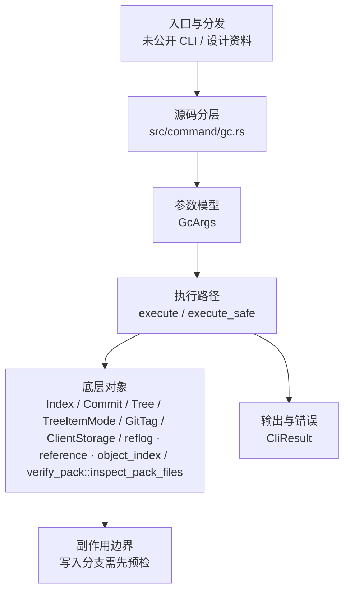

# `libra gc` 内部设计资料

> Status: **declined / historical**. This command was not published to the public CLI.
> The maintenance entry point `libra maintenance run --task gc` provides the same safe garbage-collection pass.
>
> **源码已删除（v0.17.1759）**：孤立、从未编译进二进制的 `src/command/gc.rs`（及其同样未接入的 `tests/command/gc_test.rs`）已删除，以消除 bit-rot 风险。本文件仅作为历史设计记录保留；当前唯一被编译、会运行的 GC 实现是 `src/command/maintenance.rs::run_gc`（经 `libra maintenance run --task gc` 调用）。下文对 `src/command/gc.rs`、`GcArgs` 等符号的引用均为历史快照，不再对应工作区文件。

This document preserves the original design notes for the unpublished `gc` implementation. It is not a user-visible command contract and is not tracked in `COMPATIBILITY.md`.

## 命令实现目标

`libra gc` 的目标是提供安全的仓库维护入口，用于清理不可达对象或执行保守维护任务。当前实现资料存在但顶层 CLI 尚未公开接入，因此目标是先保留安全维护语义，再决定是否进入公开命令面。

## 对比 Git 与兼容性

- 兼容级别：`unpublished`。未进入 COMPATIBILITY.md；以代码接入状态为准。

- 该资料未对应公开 CLI 命令；用户可见状态按未发布处理。

## 设计方案

- 入口与分发：源码资料存在但尚未公开接入 `src/cli.rs::Commands`；`src/` 树中没有任何 `mod gc` 声明（`src/command/mod.rs` 未声明该模块），该文件尚未被编译进二进制。CLI 层在 `src/cli.rs` 把解析后的参数交给命令模块，命令模块负责把领域错误转换为 `CliError` / `CliResult`。
- 源码分层：主要实现文件为 `src/command/gc.rs`。参数/子命令类型包括：`GcArgs`；输出、错误或状态类型包括：源码未暴露独立输出/错误类型，错误通过 `CliResult` 或上层命令错误统一传播；主要执行函数包括：`execute`、`execute_safe`。
- 执行路径：`execute_safe` 负责 CLI 安全包装、错误映射和输出配置；索引路径会加载、比较、刷新或保存 `.libra/index`；对象路径会解析 revision 并读写 blob/tree/commit/tag 等对象；引用路径会读取或更新 SQLite refs、HEAD 与 reflog；网络路径会解析 remote 配置、协商协议并处理 pack/idx 数据；数据库路径会通过 SeaORM/SQLite 持久化元数据。

- 流程图：以下流程图按当前源码分层展示主路径和底层对象边界，便于维护者把代码入口、执行函数和副作用范围对应起来。

- 底层操作对象：`IndexEntry`（索引条目，承载路径、mode、object id 和 stat 元数据）；`Index` / `.libra/index`（暂存区状态、路径条目和刷新/保存边界）；`Blob`（文件内容或 LFS pointer 写入对象库后的 blob 对象）；`Commit`（提交对象、父提交关系和提交消息载荷）；`TreeItem` / `TreeItemMode`（tree 中的路径项和 mode）；`Tree`（由索引或对象遍历生成的目录树对象）；`Head`（SQLite 中的 HEAD 指向、当前分支和 detached 状态）；`ExpireOptions` / `Reflog`（即 `ReflogStore`）/ `expire_reflog` / `expire_defaults_with_conn`（GC 预清理阶段的 reflog 过期读写和统计）；pack / idx 对象（传输包、索引、delta 和完整性校验）；`ClientStorage`（本地/分层对象存储读写入口）；SeaORM / `.libra/libra.db`（配置、refs、reflog、AI/发布元数据等 SQLite 表）
- 输出与错误契约：人类输出、`--json` / `--machine` 输出和 quiet/verbose 分支必须继续走现有 `OutputConfig` / `emit_json_data` / `CliError` 路径；新增失败模式要补稳定错误码、用户提示和回归测试。
- 副作用边界：凡是写入索引、对象库、refs/HEAD、reflog、SQLite/D1、工作树或远端的路径，都必须先完成参数校验和 dry-run/预检分支，再执行持久化，避免部分写入后静默成功。

## 实现历史

- 本节依据本地 main 分支提交历史重写，筛选与该命令实现、测试或文档路径直接相关的提交；以下是归纳后的实现脉络。
- 2026-06-10 `a4bbe28b`（`feat(gc): add safe repository maintenance command (#386)`）：基础实现节点：add safe repository maintenance command (#386)；当前实现的主要轮廓可追溯到该提交。
- 历史结论：`src/command/gc.rs` 或配套测试/文档已有历史节点，但当前 `src/cli.rs::Commands` 未公开 `gc` 入口；实现历史不改变当前状态章节中的未接入结论。

## 当前状态

- 公开状态：未公开；模块状态：`src/command/gc.rs` 源文件**已于 v0.17.1759 删除**（删除前从未在 `src/command/mod.rs` 声明 `mod gc`，从未编译进二进制）。GC 行为由 `src/command/maintenance.rs::run_gc` 提供。
- 用户文档：`docs/commands/gc.md`，当前仅作为 unpublished historical design 页面保留，不声明可执行 CLI 合约；已发布维护入口是 `libra maintenance run --dry-run --task gc`。
- Synopsis：`libra gc [--dry-run] [--prune=<date> | --no-prune] [--aggressive] [--auto] [--force]`。
- 公开参数/子命令以用户文档和 CLI help 为准；当前未抽取到独立 Options/Subcommands 小节。

## 还未实现的功能

| 类别 | 未完成项 | 当前处理 |
|---|---|---|
| 兼容矩阵 | `COMPATIBILITY.md` 尚未登记该命令行。 | 需要决定是否纳入用户可见兼容矩阵和矩阵守卫。 |
| CLI 接入 | `src/cli.rs::Commands` 尚未公开该顶层命令。 | 需要决定接入 CLI、降级为内部设计资料，或移出用户命令文档。 |
| 功能缺口 | 当 reachability 遍历不完整时跳过 loose-object 清理（warning：`reachability traversal was incomplete; loose-object pruning was skipped`）。 | 这是保守的安全行为而非缺陷；原因写入 `warnings[]`，后续如需更完整遍历再同步源码、测试和兼容矩阵。 |
| 兼容差异项 | 重打包有效对象 | 原始对照：不支持；相关参数/替代：支持；当前说明：不适用。 后续实现时需要补对应回归测试并同步兼容矩阵。 |
| 兼容差异项 | cruft packs | 原始对照：不支持；相关参数/替代：支持；当前说明：不适用。 后续实现时需要补对应回归测试并同步兼容矩阵。 |

## 维护要求

- 改进本命令前，必须先阅读并遵循 [docs/development/commands/_general.md](_general.md)；这是命令设计、实现、测试和文档同步的强制要求。
- 任何行为变更都要先核对实现源码，再同步 `COMPATIBILITY.md`、`docs/commands/<cmd>.md` 和相关测试。
- 新增 Git 兼容参数时必须明确 tier、错误码、JSON/机器输出契约和回归测试。
- 若决定发布该命令，最小闭环是：CLI 变体、`src/command/mod.rs` 导出、dispatch、用户文档、兼容矩阵和测试。
